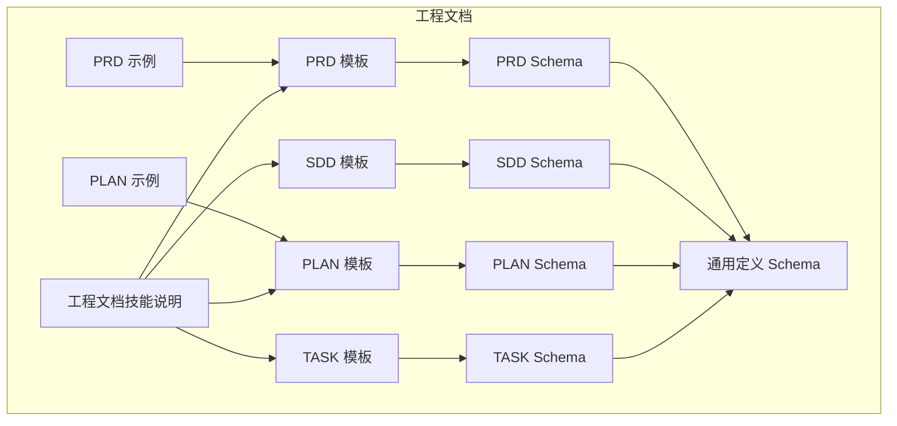
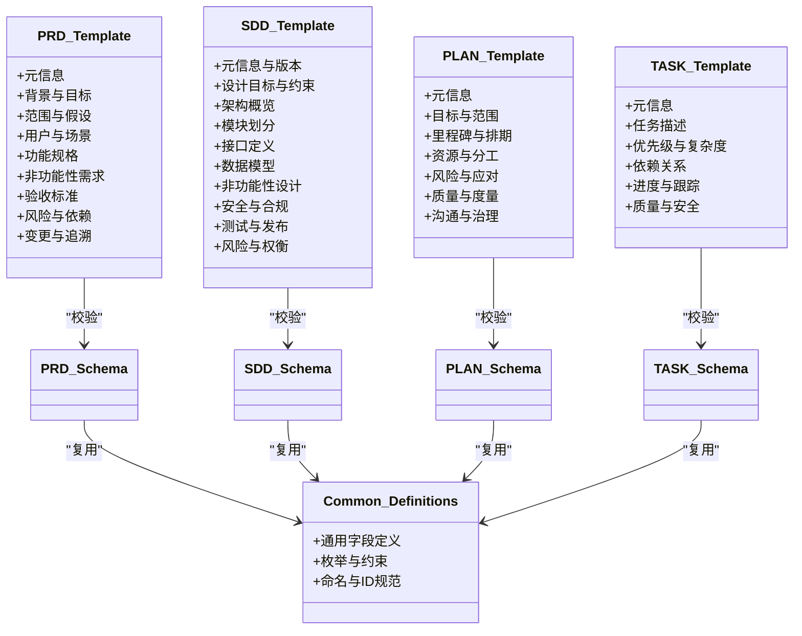
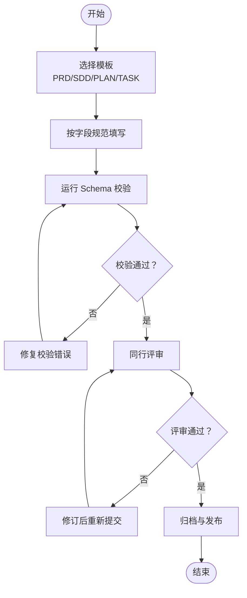
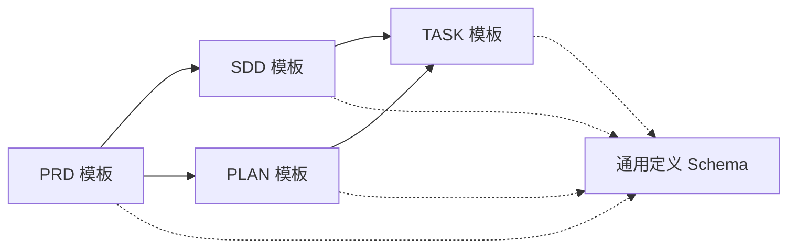

# 核心文档模板

<cite>
**本文引用的文件**   
- [PRD-template.md](file://skills/shared/engineering-docs/templates/PRD-template.md)
- [SDD-template.md](file://skills/shared/engineering-docs/templates/SDD-template.md)
- [PLAN-template.md](file://skills/shared/engineering-docs/templates/PLAN-template.md)
- [TASK-template.md](file://skills/shared/engineering-docs/templates/TASK-template.md)
- [prd.schema.json](file://skills/shared/engineering-docs/schemas/prd.schema.json)
- [sdd.schema.json](file://skills/shared/engineering-docs/schemas/sdd.schema.json)
- [plan.schema.json](file://skills/shared/engineering-docs/schemas/plan.schema.json)
- [task.schema.json](file://skills/shared/engineering-docs/schemas/task.schema.json)
- [common-defs.schema.json](file://skills/shared/engineering-docs/schemas/common-defs.schema.json)
- [form.schema.json](file://skills/shared/engineering-docs/schemas/form.schema.json)
- [module.schema.json](file://skills/shared/engineering-docs/schemas/module.schema.json)
- [release.schema.json](file://skills/shared/engineering-docs/schemas/release.schema.json)
- [PRD-001-sample-login.md](file://skills/shared/engineering-docs/examples/PRD-001-sample-login.md)
- [PLAN-v1.0-001-sample-mvp.md](file://skills/shared/engineering-docs/examples/PLAN-v1.0-001-sample-mvp.md)
- [README.md](file://skills/shared/engineering-docs/examples/README.md)
- [SKILL.md](file://skills/shared/engineering-docs/SKILL.md)
</cite>

## 目录
1. [简介](#简介)
2. [项目结构](#项目结构)
3. [核心组件](#核心组件)
4. [架构总览](#架构总览)
5. [详细组件分析](#详细组件分析)
6. [依赖关系分析](#依赖关系分析)
7. [性能与质量考量](#性能与质量考量)
8. [故障排查指南](#故障排查指南)
9. [结论](#结论)
10. [附录](#附录)

## 简介
本指南面向产品、研发与项目管理团队，系统化介绍工程文档模板的使用规范与实践方法。围绕四类核心模板：
- PRD（产品需求文档）：聚焦业务背景、目标用户、需求范围、功能规格与验收标准。
- SDD（系统设计文档）：聚焦技术架构、模块划分、接口定义、数据模型与非功能性设计。
- PLAN（项目计划）：聚焦里程碑、资源分配、风险与依赖管理。
- TASK（任务分解）：聚焦任务拆解、优先级、依赖关系与进度跟踪。

同时提供示例参考与最佳实践建议，帮助团队在一致的结构下高效协作与评审。

## 项目结构
工程文档模板位于共享技能包中，包含模板、Schema 校验规则与示例文档，便于统一格式与自动化校验。

图表来源
- [PRD-template.md](file://skills/shared/engineering-docs/templates/PRD-template.md)
- [SDD-template.md](file://skills/shared/engineering-docs/templates/SDD-template.md)
- [PLAN-template.md](file://skills/shared/engineering-docs/templates/PLAN-template.md)
- [TASK-template.md](file://skills/shared/engineering-docs/templates/TASK-template.md)
- [prd.schema.json](file://skills/shared/engineering-docs/schemas/prd.schema.json)
- [sdd.schema.json](file://skills/shared/engineering-docs/schemas/sdd.schema.json)
- [plan.schema.json](file://skills/shared/engineering-docs/schemas/plan.schema.json)
- [task.schema.json](file://skills/shared/engineering-docs/schemas/task.schema.json)
- [common-defs.schema.json](file://skills/shared/engineering-docs/schemas/common-defs.schema.json)
- [PRD-001-sample-login.md](file://skills/shared/engineering-docs/examples/PRD-001-sample-login.md)
- [PLAN-v1.0-001-sample-mvp.md](file://skills/shared/engineering-docs/examples/PLAN-v1.0-001-sample-mvp.md)
- [SKILL.md](file://skills/shared/engineering-docs/SKILL.md)

章节来源
- [SKILL.md](file://skills/shared/engineering-docs/SKILL.md)

## 核心组件
本节从“字段定义”和“填写规范”两个维度，逐一解析四类模板的核心结构与要求。为避免泄露具体示例内容，本节以结构化描述为主，并给出对应模板与 Schema 的引用路径。

### PRD（产品需求文档）
- 目的与适用范围
  - 明确产品背景、目标用户、问题域与价值主张；界定需求边界与版本范围；为设计与开发提供唯一事实来源。
- 核心字段与结构
  - 元信息：文档编号、版本、作者、日期、状态、关联需求/特性等。
  - 背景与目标：业务背景、用户痛点、成功指标与约束条件。
  - 范围与假设：本期范围、非范围、关键假设与外部依赖。
  - 用户与场景：角色画像、关键用例与用户旅程。
  - 功能规格：功能清单、交互流程、输入输出、异常分支、权限与安全。
  - 非功能性需求：性能、可用性、可观测性、合规与隐私。
  - 验收标准：验收条件、测试策略、回归范围与上线门槛。
  - 风险与依赖：已知风险、缓解措施、跨团队依赖与排期影响。
  - 变更与追溯：变更记录、决策记录（ADR）、相关文档链接。
- 填写规范与最佳实践
  - 使用清晰、可验证的语言；避免模糊词；每条需求具备可测试的验收标准。
  - 将复杂流程拆分为子流程或附流程图；对关键术语建立统一词汇表。
  - 保持版本化与变更可追溯；重大变更需评审与更新关联文档。
- 参考路径
  - 模板：[PRD-template.md](file://skills/shared/engineering-docs/templates/PRD-template.md)
  - 示例：[PRD-001-sample-login.md](file://skills/shared/engineering-docs/examples/PRD-001-sample-login.md)
  - 校验：[prd.schema.json](file://skills/shared/engineering-docs/schemas/prd.schema.json)、[common-defs.schema.json](file://skills/shared/engineering-docs/schemas/common-defs.schema.json)

章节来源
- [PRD-template.md](file://skills/shared/engineering-docs/templates/PRD-template.md)
- [PRD-001-sample-login.md](file://skills/shared/engineering-docs/examples/PRD-001-sample-login.md)
- [prd.schema.json](file://skills/shared/engineering-docs/schemas/prd.schema.json)
- [common-defs.schema.json](file://skills/shared/engineering-docs/schemas/common-defs.schema.json)

### SDD（系统设计文档）
- 目的与适用范围
  - 将 PRD 转化为可实施的技术方案，明确系统边界、架构风格、模块职责、接口契约与数据模型，指导编码与测试。
- 核心字段与结构
  - 元信息与版本控制：编号、版本、作者、日期、状态、关联 PRD/ADR。
  - 设计目标与约束：性能、可扩展性、可靠性、安全与成本约束。
  - 架构概览：分层/模块化视图、部署拓扑、关键外部系统。
  - 模块划分：模块职责、边界、内部接口、依赖关系与演进策略。
  - 接口定义：API 列表、请求/响应结构、错误码、幂等性与限流策略。
  - 数据模型：实体关系、存储选型、索引与迁移策略、数据一致性。
  - 非功能性设计：容量规划、缓存、消息队列、监控告警、日志与追踪。
  - 安全与合规：认证授权、敏感数据处理、审计与合规要求。
  - 测试与发布：单元/集成/端到端测试策略、灰度与回滚策略。
  - 风险与权衡：技术风险、替代方案与取舍依据。
- 填写规范与最佳实践
  - 接口与数据模型需与实现保持一致，优先采用 OpenAPI/JSON Schema 等机器可读契约。
  - 对关键决策形成 ADR；对高风险模块提供降级与熔断方案。
  - 通过架构图与序列图表达复杂交互，确保读者能快速定位关键点。
- 参考路径
  - 模板：[SDD-template.md](file://skills/shared/engineering-docs/templates/SDD-template.md)
  - 校验：[sdd.schema.json](file://skills/shared/engineering-docs/schemas/sdd.schema.json)、[common-defs.schema.json](file://skills/shared/engineering-docs/schemas/common-defs.schema.json)

章节来源
- [SDD-template.md](file://skills/shared/engineering-docs/templates/SDD-template.md)
- [sdd.schema.json](file://skills/shared/engineering-docs/schemas/sdd.schema.json)
- [common-defs.schema.json](file://skills/shared/engineering-docs/schemas/common-defs.schema.json)

### PLAN（项目计划）
- 目的与适用范围
  - 将需求与设计落地为可执行的项目计划，明确里程碑、资源、风险与依赖，保障按期高质量交付。
- 核心字段与结构
  - 元信息：编号、版本、作者、日期、状态、关联 PRD/SDD。
  - 目标与范围：阶段目标、交付物、验收标准与范围边界。
  - 里程碑与排期：关键节点、依赖关系、缓冲与关键路径。
  - 资源与分工：角色与职责、投入估算、外部资源与供应商。
  - 风险与应对：风险登记、概率/影响评估、缓解与应急预案。
  - 质量与度量：质量标准、度量指标、评审与审计安排。
  - 沟通与治理：例会机制、升级路径、变更控制流程。
- 填写规范与最佳实践
  - 里程碑应可验证且与交付物绑定；风险需量化并定期复盘。
  - 预留合理缓冲；对关键依赖设置预警阈值。
  - 与 PRD/SDD 双向追溯，确保范围不漂移。
- 参考路径
  - 模板：[PLAN-template.md](file://skills/shared/engineering-docs/templates/PLAN-template.md)
  - 示例：[PLAN-v1.0-001-sample-mvp.md](file://skills/shared/engineering-docs/examples/PLAN-v1.0-001-sample-mvp.md)
  - 校验：[plan.schema.json](file://skills/shared/engineering-docs/schemas/plan.schema.json)、[common-defs.schema.json](file://skills/shared/engineering-docs/schemas/common-defs.schema.json)

章节来源
- [PLAN-template.md](file://skills/shared/engineering-docs/templates/PLAN-template.md)
- [PLAN-v1.0-001-sample-mvp.md](file://skills/shared/engineering-docs/examples/PLAN-v1.0-001-sample-mvp.md)
- [plan.schema.json](file://skills/shared/engineering-docs/schemas/plan.schema.json)
- [common-defs.schema.json](file://skills/shared/engineering-docs/schemas/common-defs.schema.json)

### TASK（任务分解）
- 目的与适用范围
  - 将计划拆解为可执行的开发/测试/运维任务，明确优先级、依赖与进度，支撑日常站会与迭代回顾。
- 核心字段与结构
  - 元信息：编号、版本、作者、日期、状态、关联 PLAN/PRD/SDD。
  - 任务描述：目标、范围、前置条件、验收标准与产出物。
  - 优先级与复杂度：P0-P3 分级、工作量估算、难度标记。
  - 依赖关系：前后置任务、外部依赖、阻塞项与解除条件。
  - 进度与跟踪：开始/完成时间、实际工时、阻塞原因与解决路径。
  - 质量与安全：代码审查、测试覆盖、安全扫描与合规检查。
- 填写规范与最佳实践
  - 任务粒度适中，通常可在 1-3 天内完成；每个任务具备可验证的验收标准。
  - 显式标注依赖与风险；及时更新状态与阻塞原因。
  - 与看板/工单系统联动，保证线上与线下信息一致。
- 参考路径
  - 模板：[TASK-template.md](file://skills/shared/engineering-docs/templates/TASK-template.md)
  - 校验：[task.schema.json](file://skills/shared/engineering-docs/schemas/task.schema.json)、[common-defs.schema.json](file://skills/shared/engineering-docs/schemas/common-defs.schema.json)

章节来源
- [TASK-template.md](file://skills/shared/engineering-docs/templates/TASK-template.md)
- [task.schema.json](file://skills/shared/engineering-docs/schemas/task.schema.json)
- [common-defs.schema.json](file://skills/shared/engineering-docs/schemas/common-defs.schema.json)

## 架构总览
下图展示四类模板与其校验 Schema 的关系，以及示例文档如何作为参考填充模板。

图表来源
- [PRD-template.md](file://skills/shared/engineering-docs/templates/PRD-template.md)
- [SDD-template.md](file://skills/shared/engineering-docs/templates/SDD-template.md)
- [PLAN-template.md](file://skills/shared/engineering-docs/templates/PLAN-template.md)
- [TASK-template.md](file://skills/shared/engineering-docs/templates/TASK-template.md)
- [prd.schema.json](file://skills/shared/engineering-docs/schemas/prd.schema.json)
- [sdd.schema.json](file://skills/shared/engineering-docs/schemas/sdd.schema.json)
- [plan.schema.json](file://skills/shared/engineering-docs/schemas/plan.schema.json)
- [task.schema.json](file://skills/shared/engineering-docs/schemas/task.schema.json)
- [common-defs.schema.json](file://skills/shared/engineering-docs/schemas/common-defs.schema.json)

## 详细组件分析

### PRD 模板详解
- 结构要点
  - 元信息用于版本与追溯；背景与目标驱动后续设计与排期；范围与假设划定边界；用户与场景确保以用户为中心；功能规格细化到可实现的条目；非功能性需求保障质量基线；验收标准贯穿测试与上线；风险与依赖提前暴露；变更与追溯保障一致性。
- 填写规范
  - 语言精确、可验证；复杂流程配图；术语统一；变更留痕。
- 示例参考
  - 登录需求的 PRD 示例可作为入口点与验收标准的参考。
- 参考路径
  - 模板：[PRD-template.md](file://skills/shared/engineering-docs/templates/PRD-template.md)
  - 示例：[PRD-001-sample-login.md](file://skills/shared/engineering-docs/examples/PRD-001-sample-login.md)
  - 校验：[prd.schema.json](file://skills/shared/engineering-docs/schemas/prd.schema.json)

章节来源
- [PRD-template.md](file://skills/shared/engineering-docs/templates/PRD-template.md)
- [PRD-001-sample-login.md](file://skills/shared/engineering-docs/examples/PRD-001-sample-login.md)
- [prd.schema.json](file://skills/shared/engineering-docs/schemas/prd.schema.json)

### SDD 模板详解
- 结构要点
  - 从设计目标出发，给出架构概览与模块划分；接口与数据模型是落地的关键；非功能性设计决定系统韧性；安全与合规贯穿全生命周期；测试与发布策略保障质量与稳定性；风险与权衡体现技术决策过程。
- 填写规范
  - 接口与数据模型尽量采用机器可读契约；关键决策形成 ADR；架构图与序列图辅助理解。
- 参考路径
  - 模板：[SDD-template.md](file://skills/shared/engineering-docs/templates/SDD-template.md)
  - 校验：[sdd.schema.json](file://skills/shared/engineering-docs/schemas/sdd.schema.json)

章节来源
- [SDD-template.md](file://skills/shared/engineering-docs/templates/SDD-template.md)
- [sdd.schema.json](file://skills/shared/engineering-docs/schemas/sdd.schema.json)

### PLAN 模板详解
- 结构要点
  - 以里程碑为核心，串联资源、风险与质量度量；通过治理机制保障执行；与 PRD/SDD 双向追溯确保范围稳定。
- 填写规范
  - 里程碑可验证；风险量化；缓冲合理；变更受控。
- 示例参考
  - MVP 版本的计划示例展示了里程碑与资源的组织方式。
- 参考路径
  - 模板：[PLAN-template.md](file://skills/shared/engineering-docs/templates/PLAN-template.md)
  - 示例：[PLAN-v1.0-001-sample-mvp.md](file://skills/shared/engineering-docs/examples/PLAN-v1.0-001-sample-mvp.md)
  - 校验：[plan.schema.json](file://skills/shared/engineering-docs/schemas/plan.schema.json)

章节来源
- [PLAN-template.md](file://skills/shared/engineering-docs/templates/PLAN-template.md)
- [PLAN-v1.0-001-sample-mvp.md](file://skills/shared/engineering-docs/examples/PLAN-v1.0-001-sample-mvp.md)
- [plan.schema.json](file://skills/shared/engineering-docs/schemas/plan.schema.json)

### TASK 模板详解
- 结构要点
  - 以任务为单位，明确描述、优先级、依赖与进度；质量与安全要求内嵌于任务验收；与上层计划与需求保持追溯。
- 填写规范
  - 粒度适中；验收标准可测；依赖显式；状态实时更新。
- 参考路径
  - 模板：[TASK-template.md](file://skills/shared/engineering-docs/templates/TASK-template.md)
  - 校验：[task.schema.json](file://skills/shared/engineering-docs/schemas/task.schema.json)

章节来源
- [TASK-template.md](file://skills/shared/engineering-docs/templates/TASK-template.md)
- [task.schema.json](file://skills/shared/engineering-docs/schemas/task.schema.json)

### 概念总览：文档生成与校验流程
以下流程图展示从模板到示例再到校验的典型工作流，帮助读者理解如何使用模板与 Schema 进行文档生产与质量控制。

[此图为概念流程，无需图表来源]

## 依赖关系分析
四类模板之间通过“元信息”与“关联文档”建立强追溯关系，并通过通用定义 Schema 统一字段语义与约束。

图表来源
- [PRD-template.md](file://skills/shared/engineering-docs/templates/PRD-template.md)
- [SDD-template.md](file://skills/shared/engineering-docs/templates/SDD-template.md)
- [PLAN-template.md](file://skills/shared/engineering-docs/templates/PLAN-template.md)
- [TASK-template.md](file://skills/shared/engineering-docs/templates/TASK-template.md)
- [common-defs.schema.json](file://skills/shared/engineering-docs/schemas/common-defs.schema.json)

章节来源
- [common-defs.schema.json](file://skills/shared/engineering-docs/schemas/common-defs.schema.json)

## 性能与质量考量
- 文档性能
  - 控制文档体量，拆分大文档为多份小文档；使用交叉引用减少重复。
- 质量保障
  - 使用 Schema 校验确保结构完整与字段约束；引入同行评审与变更审计；示例文档作为基准对齐团队期望。
- 可维护性
  - 统一命名与编号规范；版本化与变更记录；与工具链（如看板、CI）集成，提升可观测性。

[本节为通用建议，无需章节来源]

## 故障排查指南
- 常见校验失败
  - 缺失必填字段：对照 Schema 补齐字段。
  - 类型不符：检查字段类型与枚举值是否符合约定。
  - 命名不规范：遵循命名与 ID 规范，避免特殊字符。
- 常见问题定位
  - 使用示例文档对比差异；逐步缩小范围至具体字段。
  - 若涉及跨文档追溯，确认关联编号与版本一致。
- 参考路径
  - 通用定义与表单/模块/发布等扩展 Schema：
    - [common-defs.schema.json](file://skills/shared/engineering-docs/schemas/common-defs.schema.json)
    - [form.schema.json](file://skills/shared/engineering-docs/schemas/form.schema.json)
    - [module.schema.json](file://skills/shared/engineering-docs/schemas/module.schema.json)
    - [release.schema.json](file://skills/shared/engineering-docs/schemas/release.schema.json)

章节来源
- [common-defs.schema.json](file://skills/shared/engineering-docs/schemas/common-defs.schema.json)
- [form.schema.json](file://skills/shared/engineering-docs/schemas/form.schema.json)
- [module.schema.json](file://skills/shared/engineering-docs/schemas/module.schema.json)
- [release.schema.json](file://skills/shared/engineering-docs/schemas/release.schema.json)

## 结论
通过统一的模板与 Schema，团队可以在一致的框架下完成从需求到设计、计划与任务的端到端文档化。配合示例与校验工具，能够显著提升文档质量与协作效率。建议在团队内推广最佳实践，并将文档纳入持续集成与评审流程，确保长期可维护与可追溯。

[本节为总结，无需章节来源]

## 附录
- 快速上手清单
  - 选择合适模板并填写元信息。
  - 按字段规范逐项完善内容。
  - 运行 Schema 校验并修复问题。
  - 发起同行评审并根据反馈修订。
  - 归档发布并建立变更与追溯机制。
- 参考路径
  - 示例 README：[README.md](file://skills/shared/engineering-docs/examples/README.md)
  - 工程文档技能说明：[SKILL.md](file://skills/shared/engineering-docs/SKILL.md)

章节来源
- [README.md](file://skills/shared/engineering-docs/examples/README.md)
- [SKILL.md](file://skills/shared/engineering-docs/SKILL.md)