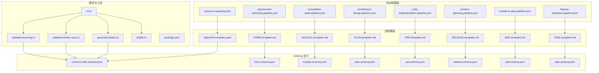
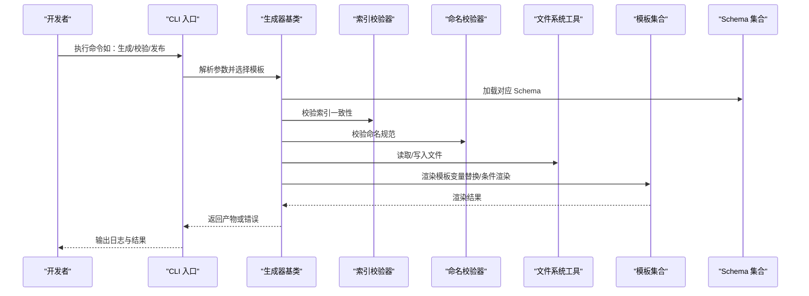
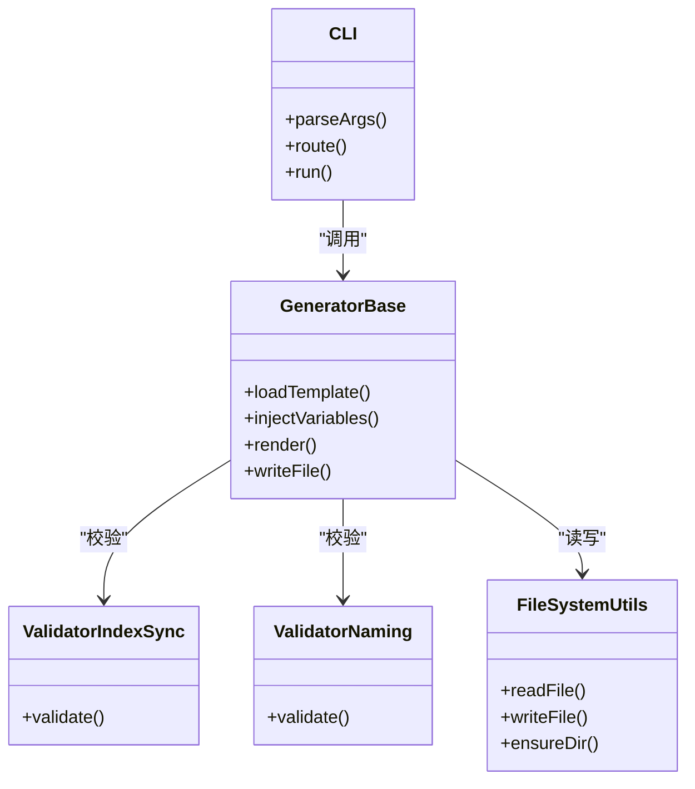
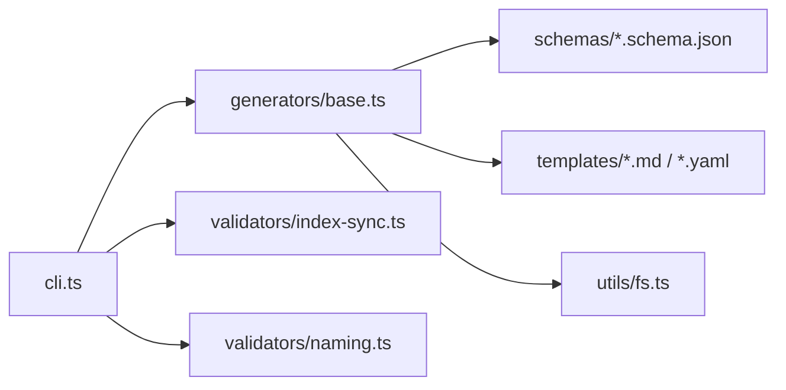

# 模板开发指南

<cite>
**本文引用的文件**   
- [pipeline-templates/README.md](file://pipeline-templates/README.md)
- [pipeline-templates/architecture-design.pipeline.json](file://pipeline-templates/architecture-design.pipeline.json)
- [pipeline-templates/code-implementation.pipeline.json](file://pipeline-templates/code-implementation.pipeline.json)
- [pipeline-templates/competitive-radar.pipeline.json](file://pipeline-templates/competitive-radar.pipeline.json)
- [pipeline-templates/feature-writeback.pipeline.json](file://pipeline-templates/feature-writeback.pipeline.json)
- [pipeline-templates/market-to-plan.pipeline.json](file://pipeline-templates/market-to-plan.pipeline.json)
- [pipeline-templates/product-planning.pipeline.json](file://pipeline-templates/product-planning.pipeline.json)
- [pipeline-templates/requirement-authoring.pipeline.json](file://pipeline-templates/requirement-authoring.pipeline.json)
- [pipeline-templates/resume-cr.pipeline.json](file://pipeline-templates/resume-cr.pipeline.json)
- [skills/shared/engineering-docs/templates/PLAN-template.md](file://skills/shared/engineering-docs/templates/PLAN-template.md)
- [skills/shared/engineering-docs/templates/PRD-template.md](file://skills/shared/engineering-docs/templates/PRD-template.md)
- [skills/shared/engineering-docs/templates/MODULE-template.md](file://skills/shared/engineering-docs/templates/MODULE-template.md)
- [skills/shared/engineering-docs/templates/TASK-template.md](file://skills/shared/engineering-docs/templates/TASK-template.md)
- [skills/shared/engineering-docs/templates/SDD-template.md](file://skills/shared/engineering-docs/templates/SDD-template.md)
- [skills/shared/engineering-docs/templates/RELEASE-template.md](file://skills/shared/engineering-docs/templates/RELEASE-template.md)
- [skills/shared/engineering-docs/templates/FORM-template.md](file://skills/shared/engineering-docs/templates/FORM-template.md)
- [skills/shared/engineering-docs/templates/OpenAPI-template.yaml](file://skills/shared/engineering-docs/templates/OpenAPI-template.yaml)
- [skills/shared/engineering-docs/schemas/common-defs.schema.json](file://skills/shared/engineering-docs/schemas/common-defs.schema.json)
- [skills/shared/engineering-docs/schemas/form.schema.json](file://skills/shared/engineering-docs/schemas/form.schema.json)
- [skills/shared/engineering-docs/schemas/module.schema.json](file://skills/shared/engineering-docs/schemas/module.schema.json)
- [skills/shared/engineering-docs/schemas/plan.schema.json](file://skills/shared/engineering-docs/schemas/plan.schema.json)
- [skills/shared/engineering-docs/schemas/prd.schema.json](file://skills/shared/engineering-docs/schemas/prd.schema.json)
- [skills/shared/engineering-docs/schemas/release.schema.json](file://skills/shared/engineering-docs/schemas/release.schema.json)
- [skills/shared/engineering-docs/schemas/sdd.schema.json](file://skills/shared/engineering-docs/schemas/sdd.schema.json)
- [skills/shared/engineering-docs/schemas/task.schema.json](file://skills/shared/engineering-docs/schemas/task.schema.json)
- [skills/shared/engineering-docs/scripts/src/cli.ts](file://skills/shared/engineering-docs/scripts/src/cli.ts)
- [skills/shared/engineering-docs/scripts/src/generators/base.ts](file://skills/shared/engineering-docs/scripts/src/generators/base.ts)
- [skills/shared/engineering-docs/scripts/src/validators/index-sync.ts](file://skills/shared/engineering-docs/scripts/src/validators/index-sync.ts)
- [skills/shared/engineering-docs/scripts/src/validators/naming.ts](file://skills/shared/engineering-docs/scripts/src/validators/naming.ts)
- [skills/shared/engineering-docs/scripts/src/utils/fs.ts](file://skills/shared/engineering-docs/scripts/src/utils/fs.ts)
- [skills/shared/engineering-docs/scripts/package.json](file://skills/shared/engineering-docs/scripts/package.json)
</cite>

## 目录
1. [简介](#简介)
2. [项目结构](#项目结构)
3. [核心组件](#核心组件)
4. [架构总览](#架构总览)
5. [详细组件分析](#详细组件分析)
6. [依赖关系分析](#依赖关系分析)
7. [性能考虑](#性能考虑)
8. [故障排查指南](#故障排查指南)
9. [结论](#结论)
10. [附录](#附录)

## 简介
本指南面向希望基于仓库现有能力进行“自定义模板”开发的工程师与文档作者。内容覆盖：
- 模板语法规范、变量替换机制与条件渲染逻辑
- 模板继承体系、组合模式与复用策略
- Schema 定义文件的结构与验证规则
- 最佳实践、命名约定与版本管理策略
- 从简单文本模板到复杂数据驱动模板的完整示例路径
- 模板测试方法、调试技巧与性能优化建议
- 模板分发与共享方案

## 项目结构
仓库中与模板相关的资源主要分布在以下位置：
- pipeline-templates：流水线级模板，描述端到端流程编排（JSON）
- skills/shared/engineering-docs/templates：文档类模板（Markdown/YAML）
- skills/shared/engineering-docs/schemas：Schema 校验定义（JSON Schema）
- skills/shared/engineering-docs/scripts：生成器、校验器与 CLI 工具（TypeScript）

图表来源
- [pipeline-templates/architecture-design.pipeline.json](file://pipeline-templates/architecture-design.pipeline.json)
- [pipeline-templates/code-implementation.pipeline.json](file://pipeline-templates/code-implementation.pipeline.json)
- [pipeline-templates/competitive-radar.pipeline.json](file://pipeline-templates/competitive-radar.pipeline.json)
- [pipeline-templates/feature-writeback.pipeline.json](file://pipeline-templates/feature-writeback.pipeline.json)
- [pipeline-templates/market-to-plan.pipeline.json](file://pipeline-templates/market-to-plan.pipeline.json)
- [pipeline-templates/product-planning.pipeline.json](file://pipeline-templates/product-planning.pipeline.json)
- [pipeline-templates/requirement-authoring.pipeline.json](file://pipeline-templates/requirement-authoring.pipeline.json)
- [pipeline-templates/resume-cr.pipeline.json](file://pipeline-templates/resume-cr.pipeline.json)
- [skills/shared/engineering-docs/templates/PLAN-template.md](file://skills/shared/engineering-docs/templates/PLAN-template.md)
- [skills/shared/engineering-docs/templates/PRD-template.md](file://skills/shared/engineering-docs/templates/PRD-template.md)
- [skills/shared/engineering-docs/templates/MODULE-template.md](file://skills/shared/engineering-docs/templates/MODULE-template.md)
- [skills/shared/engineering-docs/templates/TASK-template.md](file://skills/shared/engineering-docs/templates/TASK-template.md)
- [skills/shared/engineering-docs/templates/SDD-template.md](file://skills/shared/engineering-docs/templates/SDD-template.md)
- [skills/shared/engineering-docs/templates/RELEASE-template.md](file://skills/shared/engineering-docs/templates/RELEASE-template.md)
- [skills/shared/engineering-docs/templates/FORM-template.md](file://skills/shared/engineering-docs/templates/FORM-template.md)
- [skills/shared/engineering-docs/templates/OpenAPI-template.yaml](file://skills/shared/engineering-docs/templates/OpenAPI-template.yaml)
- [skills/shared/engineering-docs/schemas/common-defs.schema.json](file://skills/shared/engineering-docs/schemas/common-defs.schema.json)
- [skills/shared/engineering-docs/schemas/form.schema.json](file://skills/shared/engineering-docs/schemas/form.schema.json)
- [skills/shared/engineering-docs/schemas/module.schema.json](file://skills/shared/engineering-docs/schemas/module.schema.json)
- [skills/shared/engineering-docs/schemas/plan.schema.json](file://skills/shared/engineering-docs/schemas/plan.schema.json)
- [skills/shared/engineering-docs/schemas/prd.schema.json](file://skills/shared/engineering-docs/schemas/prd.schema.json)
- [skills/shared/engineering-docs/schemas/release.schema.json](file://skills/shared/engineering-docs/schemas/release.schema.json)
- [skills/shared/engineering-docs/schemas/sdd.schema.json](file://skills/shared/engineering-docs/schemas/sdd.schema.json)
- [skills/shared/engineering-docs/schemas/task.schema.json](file://skills/shared/engineering-docs/schemas/task.schema.json)
- [skills/shared/engineering-docs/scripts/src/cli.ts](file://skills/shared/engineering-docs/scripts/src/cli.ts)
- [skills/shared/engineering-docs/scripts/src/generators/base.ts](file://skills/shared/engineering-docs/scripts/src/generators/base.ts)
- [skills/shared/engineering-docs/scripts/src/validators/index-sync.ts](file://skills/shared/engineering-docs/scripts/src/validators/index-sync.ts)
- [skills/shared/engineering-docs/scripts/src/validators/naming.ts](file://skills/shared/engineering-docs/scripts/src/validators/naming.ts)
- [skills/shared/engineering-docs/scripts/src/utils/fs.ts](file://skills/shared/engineering-docs/scripts/src/utils/fs.ts)
- [skills/shared/engineering-docs/scripts/package.json](file://skills/shared/engineering-docs/scripts/package.json)

章节来源
- [pipeline-templates/README.md](file://pipeline-templates/README.md)

## 核心组件
- 流水线模板（Pipeline Templates）
  - 以 JSON 描述端到端流程步骤、输入输出与依赖关系，用于驱动自动化流水线执行。
  - 典型字段包括：元信息、阶段列表、阶段内任务、参数映射、产物路径等。
- 文档模板（Document Templates）
  - Markdown/YAML 模板，提供结构化骨架与占位符，供生成器或人工填充。
  - 通过变量占位与可选区块实现可配置化输出。
- Schema 定义（Schemas）
  - JSON Schema 描述数据结构、必填项、枚举值、嵌套对象与引用复用。
  - 为模板输入数据提供强类型校验与自动补全支持。
- 脚本与工具（Scripts & Tools）
  - CLI 入口、生成器基类、校验器与文件系统工具，支撑模板渲染、校验与发布。

章节来源
- [pipeline-templates/architecture-design.pipeline.json](file://pipeline-templates/architecture-design.pipeline.json)
- [pipeline-templates/code-implementation.pipeline.json](file://pipeline-templates/code-implementation.pipeline.json)
- [pipeline-templates/competitive-radar.pipeline.json](file://pipeline-templates/competitive-radar.pipeline.json)
- [pipeline-templates/feature-writeback.pipeline.json](file://pipeline-templates/feature-writeback.pipeline.json)
- [pipeline-templates/market-to-plan.pipeline.json](file://pipeline-templates/market-to-plan.pipeline.json)
- [pipeline-templates/product-planning.pipeline.json](file://pipeline-templates/product-planning.pipeline.json)
- [pipeline-templates/requirement-authoring.pipeline.json](file://pipeline-templates/requirement-authoring.pipeline.json)
- [pipeline-templates/resume-cr.pipeline.json](file://pipeline-templates/resume-cr.pipeline.json)
- [skills/shared/engineering-docs/templates/PLAN-template.md](file://skills/shared/engineering-docs/templates/PLAN-template.md)
- [skills/shared/engineering-docs/templates/PRD-template.md](file://skills/shared/engineering-docs/templates/PRD-template.md)
- [skills/shared/engineering-docs/templates/MODULE-template.md](file://skills/shared/engineering-docs/templates/MODULE-template.md)
- [skills/shared/engineering-docs/templates/TASK-template.md](file://skills/shared/engineering-docs/templates/TASK-template.md)
- [skills/shared/engineering-docs/templates/SDD-template.md](file://skills/shared/engineering-docs/templates/SDD-template.md)
- [skills/shared/engineering-docs/templates/RELEASE-template.md](file://skills/shared/engineering-docs/templates/RELEASE-template.md)
- [skills/shared/engineering-docs/templates/FORM-template.md](file://skills/shared/engineering-docs/templates/FORM-template.md)
- [skills/shared/engineering-docs/templates/OpenAPI-template.yaml](file://skills/shared/engineering-docs/templates/OpenAPI-template.yaml)
- [skills/shared/engineering-docs/schemas/common-defs.schema.json](file://skills/shared/engineering-docs/schemas/common-defs.schema.json)
- [skills/shared/engineering-docs/schemas/form.schema.json](file://skills/shared/engineering-docs/schemas/form.schema.json)
- [skills/shared/engineering-docs/schemas/module.schema.json](file://skills/shared/engineering-docs/schemas/module.schema.json)
- [skills/shared/engineering-docs/schemas/plan.schema.json](file://skills/shared/engineering-docs/schemas/plan.schema.json)
- [skills/shared/engineering-docs/schemas/prd.schema.json](file://skills/shared/engineering-docs/schemas/prd.schema.json)
- [skills/shared/engineering-docs/schemas/release.schema.json](file://skills/shared/engineering-docs/schemas/release.schema.json)
- [skills/shared/engineering-docs/schemas/sdd.schema.json](file://skills/shared/engineering-docs/schemas/sdd.schema.json)
- [skills/shared/engineering-docs/schemas/task.schema.json](file://skills/shared/engineering-docs/schemas/task.schema.json)
- [skills/shared/engineering-docs/scripts/src/cli.ts](file://skills/shared/engineering-docs/scripts/src/cli.ts)
- [skills/shared/engineering-docs/scripts/src/generators/base.ts](file://skills/shared/engineering-docs/scripts/src/generators/base.ts)
- [skills/shared/engineering-docs/scripts/src/validators/index-sync.ts](file://skills/shared/engineering-docs/scripts/src/validators/index-sync.ts)
- [skills/shared/engineering-docs/scripts/src/validators/naming.ts](file://skills/shared/engineering-docs/scripts/src/validators/naming.ts)
- [skills/shared/engineering-docs/scripts/src/utils/fs.ts](file://skills/shared/engineering-docs/scripts/src/utils/fs.ts)
- [skills/shared/engineering-docs/scripts/package.json](file://skills/shared/engineering-docs/scripts/package.json)

## 架构总览
下图展示了“模板—Schema—生成器—校验器—CLI”的整体协作关系。

图表来源
- [skills/shared/engineering-docs/scripts/src/cli.ts](file://skills/shared/engineering-docs/scripts/src/cli.ts)
- [skills/shared/engineering-docs/scripts/src/generators/base.ts](file://skills/shared/engineering-docs/scripts/src/generators/base.ts)
- [skills/shared/engineering-docs/scripts/src/validators/index-sync.ts](file://skills/shared/engineering-docs/scripts/src/validators/index-sync.ts)
- [skills/shared/engineering-docs/scripts/src/validators/naming.ts](file://skills/shared/engineering-docs/scripts/src/validators/naming.ts)
- [skills/shared/engineering-docs/scripts/src/utils/fs.ts](file://skills/shared/engineering-docs/scripts/src/utils/fs.ts)
- [skills/shared/engineering-docs/templates/PLAN-template.md](file://skills/shared/engineering-docs/templates/PLAN-template.md)
- [skills/shared/engineering-docs/schemas/plan.schema.json](file://skills/shared/engineering-docs/schemas/plan.schema.json)

## 详细组件分析

### 模板语法与变量替换
- 变量占位
  - 在模板中使用占位符表示待替换的数据点，例如标题、日期、作者、模块名等。
  - 占位符应遵循统一命名约定，避免冲突与歧义。
- 条件渲染
  - 根据上下文数据决定是否渲染某段内容（如可选章节、扩展说明）。
  - 条件表达式应尽量简洁明确，便于维护与测试。
- 循环与列表
  - 对数组型数据进行遍历渲染，常用于任务清单、检查项、接口列表等。
- 默认值与空值处理
  - 为常见字段提供合理默认值；对缺失字段采用安全回退策略，避免空白或错误输出。
- 片段复用
  - 将通用段落抽象为片段，通过包含指令复用，减少重复与维护成本。

章节来源
- [skills/shared/engineering-docs/templates/PLAN-template.md](file://skills/shared/engineering-docs/templates/PLAN-template.md)
- [skills/shared/engineering-docs/templates/PRD-template.md](file://skills/shared/engineering-docs/templates/PRD-template.md)
- [skills/shared/engineering-docs/templates/MODULE-template.md](file://skills/shared/engineering-docs/templates/MODULE-template.md)
- [skills/shared/engineering-docs/templates/TASK-template.md](file://skills/shared/engineering-docs/templates/TASK-template.md)
- [skills/shared/engineering-docs/templates/SDD-template.md](file://skills/shared/engineering-docs/templates/SDD-template.md)
- [skills/shared/engineering-docs/templates/RELEASE-template.md](file://skills/shared/engineering-docs/templates/RELEASE-template.md)
- [skills/shared/engineering-docs/templates/FORM-template.md](file://skills/shared/engineering-docs/templates/FORM-template.md)
- [skills/shared/engineering-docs/templates/OpenAPI-template.yaml](file://skills/shared/engineering-docs/templates/OpenAPI-template.yaml)

### 模板继承与组合模式
- 继承体系
  - 基础模板定义通用结构与样式，派生模板仅声明差异部分，降低冗余。
- 组合模式
  - 将多个小模板组合为大模板，按职责拆分，提升可读性与可测试性。
- 复用策略
  - 通过共享片段与公共 Schema 定义，跨模板复用内容与约束。
- 版本兼容
  - 在继承链中保持向后兼容，新增字段需具备默认值或可选标记。

章节来源
- [skills/shared/engineering-docs/templates/PLAN-template.md](file://skills/shared/engineering-docs/templates/PLAN-template.md)
- [skills/shared/engineering-docs/templates/PRD-template.md](file://skills/shared/engineering-docs/templates/PRD-template.md)
- [skills/shared/engineering-docs/templates/MODULE-template.md](file://skills/shared/engineering-docs/templates/MODULE-template.md)
- [skills/shared/engineering-docs/templates/TASK-template.md](file://skills/shared/engineering-docs/templates/TASK-template.md)
- [skills/shared/engineering-docs/templates/SDD-template.md](file://skills/shared/engineering-docs/templates/SDD-template.md)
- [skills/shared/engineering-docs/templates/RELEASE-template.md](file://skills/shared/engineering-docs/templates/RELEASE-template.md)
- [skills/shared/engineering-docs/templates/FORM-template.md](file://skills/shared/engineering-docs/templates/FORM-template.md)
- [skills/shared/engineering-docs/templates/OpenAPI-template.yaml](file://skills/shared/engineering-docs/templates/OpenAPI-template.yaml)

### Schema 定义结构与验证规则
- 结构要点
  - 使用 $ref 引用公共定义，避免重复。
  - 明确 required 字段、数据类型、枚举值、最小/最大长度与格式约束。
  - 对嵌套对象与数组提供清晰的结构描述。
- 验证流程
  - 生成前对输入数据进行 Schema 校验，失败则中止并给出错误定位。
  - 结合命名与索引校验器，确保文件组织与命名符合规范。
- 扩展方式
  - 新增字段时优先扩展而非破坏式修改，保证既有模板与数据兼容。

章节来源
- [skills/shared/engineering-docs/schemas/common-defs.schema.json](file://skills/shared/engineering-docs/schemas/common-defs.schema.json)
- [skills/shared/engineering-docs/schemas/form.schema.json](file://skills/shared/engineering-docs/schemas/form.schema.json)
- [skills/shared/engineering-docs/schemas/module.schema.json](file://skills/shared/engineering-docs/schemas/module.schema.json)
- [skills/shared/engineering-docs/schemas/plan.schema.json](file://skills/shared/engineering-docs/schemas/plan.schema.json)
- [skills/shared/engineering-docs/schemas/prd.schema.json](file://skills/shared/engineering-docs/schemas/prd.schema.json)
- [skills/shared/engineering-docs/schemas/release.schema.json](file://skills/shared/engineering-docs/schemas/release.schema.json)
- [skills/shared/engineering-docs/schemas/sdd.schema.json](file://skills/shared/engineering-docs/schemas/sdd.schema.json)
- [skills/shared/engineering-docs/schemas/task.schema.json](file://skills/shared/engineering-docs/schemas/task.schema.json)
- [skills/shared/engineering-docs/scripts/src/validators/index-sync.ts](file://skills/shared/engineering-docs/scripts/src/validators/index-sync.ts)
- [skills/shared/engineering-docs/scripts/src/validators/naming.ts](file://skills/shared/engineering-docs/scripts/src/validators/naming.ts)

### 流水线模板（Pipeline Templates）
- 作用
  - 以 JSON 描述多阶段流水线，串联代码、文档、评审与发布等环节。
- 关键要素
  - 阶段定义、任务顺序、输入输出映射、环境变量与产物路径。
- 使用建议
  - 将模板与具体业务解耦，通过参数注入实现灵活编排。
  - 为每个阶段提供最小必要权限与资源隔离。

章节来源
- [pipeline-templates/README.md](file://pipeline-templates/README.md)
- [pipeline-templates/architecture-design.pipeline.json](file://pipeline-templates/architecture-design.pipeline.json)
- [pipeline-templates/code-implementation.pipeline.json](file://pipeline-templates/code-implementation.pipeline.json)
- [pipeline-templates/competitive-radar.pipeline.json](file://pipeline-templates/competitive-radar.pipeline.json)
- [pipeline-templates/feature-writeback.pipeline.json](file://pipeline-templates/feature-writeback.pipeline.json)
- [pipeline-templates/market-to-plan.pipeline.json](file://pipeline-templates/market-to-plan.pipeline.json)
- [pipeline-templates/product-planning.pipeline.json](file://pipeline-templates/product-planning.pipeline.json)
- [pipeline-templates/requirement-authoring.pipeline.json](file://pipeline-templates/requirement-authoring.pipeline.json)
- [pipeline-templates/resume-cr.pipeline.json](file://pipeline-templates/resume-cr.pipeline.json)

### 生成器与 CLI 工具
- CLI 入口
  - 提供统一的命令接口，负责参数解析、路由与错误上报。
- 生成器基类
  - 封装通用的模板加载、变量注入、条件渲染与文件落盘逻辑。
- 校验器
  - 索引一致性校验与命名规范校验，保障工程结构稳定。
- 文件系统工具
  - 提供安全的读写、路径拼接与幂等操作。

图表来源
- [skills/shared/engineering-docs/scripts/src/cli.ts](file://skills/shared/engineering-docs/scripts/src/cli.ts)
- [skills/shared/engineering-docs/scripts/src/generators/base.ts](file://skills/shared/engineering-docs/scripts/src/generators/base.ts)
- [skills/shared/engineering-docs/scripts/src/validators/index-sync.ts](file://skills/shared/engineering-docs/scripts/src/validators/index-sync.ts)
- [skills/shared/engineering-docs/scripts/src/validators/naming.ts](file://skills/shared/engineering-docs/scripts/src/validators/naming.ts)
- [skills/shared/engineering-docs/scripts/src/utils/fs.ts](file://skills/shared/engineering-docs/scripts/src/utils/fs.ts)

章节来源
- [skills/shared/engineering-docs/scripts/src/cli.ts](file://skills/shared/engineering-docs/scripts/src/cli.ts)
- [skills/shared/engineering-docs/scripts/src/generators/base.ts](file://skills/shared/engineering-docs/scripts/src/generators/base.ts)
- [skills/shared/engineering-docs/scripts/src/validators/index-sync.ts](file://skills/shared/engineering-docs/scripts/src/validators/index-sync.ts)
- [skills/shared/engineering-docs/scripts/src/validators/naming.ts](file://skills/shared/engineering-docs/scripts/src/validators/naming.ts)
- [skills/shared/engineering-docs/scripts/src/utils/fs.ts](file://skills/shared/engineering-docs/scripts/src/utils/fs.ts)

### 模板开发最佳实践
- 命名约定
  - 模板与 Schema 文件采用语义化命名，体现领域与用途。
  - 变量名采用短横线分隔或下划线分隔，保持一致风格。
- 版本管理
  - 模板与 Schema 变更遵循语义化版本控制，记录破坏性变更。
  - 在 README 或变更记录中说明迁移指引。
- 可测试性
  - 为关键渲染逻辑编写单元测试，覆盖边界与异常分支。
  - 使用固定样例数据驱动回归测试。
- 可维护性
  - 将通用逻辑下沉至生成器基类与工具库，避免重复实现。
  - 通过 Schema 约束输入，减少运行时判断复杂度。

章节来源
- [skills/shared/engineering-docs/scripts/package.json](file://skills/shared/engineering-docs/scripts/package.json)
- [skills/shared/engineering-docs/scripts/src/validators/naming.ts](file://skills/shared/engineering-docs/scripts/src/validators/naming.ts)

### 模板测试方法与调试技巧
- 测试方法
  - 单元层面：针对变量替换、条件渲染与循环逻辑进行断言。
  - 集成层面：端到端运行 CLI，校验产物结构与内容。
  - 契约层面：基于 Schema 校验输入与中间数据。
- 调试技巧
  - 启用详细日志，记录渲染前后数据快照。
  - 使用最小复现用例快速定位问题。
  - 分阶段执行，逐步缩小范围。

章节来源
- [skills/shared/engineering-docs/scripts/src/cli.ts](file://skills/shared/engineering-docs/scripts/src/cli.ts)
- [skills/shared/engineering-docs/scripts/src/generators/base.ts](file://skills/shared/engineering-docs/scripts/src/generators/base.ts)
- [skills/shared/engineering-docs/scripts/src/validators/index-sync.ts](file://skills/shared/engineering-docs/scripts/src/validators/index-sync.ts)

### 性能优化建议
- 缓存策略
  - 对频繁读取的模板与 Schema 进行内存缓存，减少 I/O 开销。
- 增量渲染
  - 仅对变更的模板与数据进行渲染，避免全量重建。
- 并行处理
  - 对独立任务进行并发渲染与校验，缩短整体耗时。
- 资源限制
  - 设置合理的超时与内存上限，防止异常占用。

[本节为通用指导，不直接分析具体文件]

### 模板分发与共享方案
- 包化管理
  - 使用 package.json 管理依赖与版本，配合脚本命令统一构建与发布。
- 集中仓库
  - 将模板与 Schema 集中在共享仓库，通过子模块或引用方式复用。
- 发布流程
  - 自动化构建产物、生成变更日志与签名校验，确保可信分发。
- 消费方式
  - 通过 CLI 或 SDK 拉取并使用模板，支持本地缓存与离线模式。

章节来源
- [skills/shared/engineering-docs/scripts/package.json](file://skills/shared/engineering-docs/scripts/package.json)

## 依赖关系分析
- 组件耦合
  - CLI 作为入口，依赖生成器与校验器；生成器依赖模板与 Schema。
  - 校验器之间相对独立，但共同服务于生成流程。
- 外部依赖
  - 文件系统操作、JSON Schema 校验库、命令行解析库等。
- 潜在风险
  - 循环依赖应避免；大模板与复杂条件渲染需关注性能与可维护性。

图表来源
- [skills/shared/engineering-docs/scripts/src/cli.ts](file://skills/shared/engineering-docs/scripts/src/cli.ts)
- [skills/shared/engineering-docs/scripts/src/generators/base.ts](file://skills/shared/engineering-docs/scripts/src/generators/base.ts)
- [skills/shared/engineering-docs/scripts/src/validators/index-sync.ts](file://skills/shared/engineering-docs/scripts/src/validators/index-sync.ts)
- [skills/shared/engineering-docs/scripts/src/validators/naming.ts](file://skills/shared/engineering-docs/scripts/src/validators/naming.ts)
- [skills/shared/engineering-docs/scripts/src/utils/fs.ts](file://skills/shared/engineering-docs/scripts/src/utils/fs.ts)
- [skills/shared/engineering-docs/schemas/common-defs.schema.json](file://skills/shared/engineering-docs/schemas/common-defs.schema.json)
- [skills/shared/engineering-docs/templates/PLAN-template.md](file://skills/shared/engineering-docs/templates/PLAN-template.md)

章节来源
- [skills/shared/engineering-docs/scripts/package.json](file://skills/shared/engineering-docs/scripts/package.json)

## 性能考虑
- 渲染阶段
  - 避免在模板中进行重型计算，尽量前置到数据准备阶段。
- I/O 阶段
  - 批量写入与合并输出，减少文件句柄切换。
- 校验阶段
  - 按需校验，避免对未变更文件重复校验。
- 监控与度量
  - 记录关键指标（渲染时长、I/O 次数、错误率），持续优化。

[本节为通用指导，不直接分析具体文件]

## 故障排查指南
- 常见问题
  - 变量未定义：检查 Schema 必填字段与默认值。
  - 条件渲染异常：核对布尔表达式与空值处理。
  - 命名不一致：运行命名校验器并修正。
  - 索引不同步：运行索引校验器并修复。
- 定位方法
  - 开启详细日志，查看渲染前后数据快照。
  - 使用最小用例复现问题，逐步排除。
- 恢复策略
  - 回滚到上一稳定版本，先恢复服务再修复问题。

章节来源
- [skills/shared/engineering-docs/scripts/src/validators/index-sync.ts](file://skills/shared/engineering-docs/scripts/src/validators/index-sync.ts)
- [skills/shared/engineering-docs/scripts/src/validators/naming.ts](file://skills/shared/engineering-docs/scripts/src/validators/naming.ts)
- [skills/shared/engineering-docs/scripts/src/generators/base.ts](file://skills/shared/engineering-docs/scripts/src/generators/base.ts)

## 结论
通过模板语法规范化、Schema 强约束与工具链自动化，团队可以高效地创建、维护与分发高质量模板。建议在迭代过程中持续完善测试与监控，确保模板的可维护性与稳定性。

[本节为总结性内容，不直接分析具体文件]

## 附录
- 示例路径参考
  - 简单文本模板：参见 PLAN-template.md、TASK-template.md
  - 复杂数据驱动模板：参见 PRD-template.md、SDD-template.md、OpenAPI-template.yaml
  - 流水线模板：参见 architecture-design.pipeline.json、product-planning.pipeline.json
- 相关脚本与配置
  - CLI 与生成器：cli.ts、generators/base.ts
  - 校验器：index-sync.ts、naming.ts
  - 工具库：fs.ts
  - 包配置：package.json

章节来源
- [skills/shared/engineering-docs/templates/PLAN-template.md](file://skills/shared/engineering-docs/templates/PLAN-template.md)
- [skills/shared/engineering-docs/templates/TASK-template.md](file://skills/shared/engineering-docs/templates/TASK-template.md)
- [skills/shared/engineering-docs/templates/PRD-template.md](file://skills/shared/engineering-docs/templates/PRD-template.md)
- [skills/shared/engineering-docs/templates/SDD-template.md](file://skills/shared/engineering-docs/templates/SDD-template.md)
- [skills/shared/engineering-docs/templates/OpenAPI-template.yaml](file://skills/shared/engineering-docs/templates/OpenAPI-template.yaml)
- [pipeline-templates/architecture-design.pipeline.json](file://pipeline-templates/architecture-design.pipeline.json)
- [pipeline-templates/product-planning.pipeline.json](file://pipeline-templates/product-planning.pipeline.json)
- [skills/shared/engineering-docs/scripts/src/cli.ts](file://skills/shared/engineering-docs/scripts/src/cli.ts)
- [skills/shared/engineering-docs/scripts/src/generators/base.ts](file://skills/shared/engineering-docs/scripts/src/generators/base.ts)
- [skills/shared/engineering-docs/scripts/src/validators/index-sync.ts](file://skills/shared/engineering-docs/scripts/src/validators/index-sync.ts)
- [skills/shared/engineering-docs/scripts/src/validators/naming.ts](file://skills/shared/engineering-docs/scripts/src/validators/naming.ts)
- [skills/shared/engineering-docs/scripts/src/utils/fs.ts](file://skills/shared/engineering-docs/scripts/src/utils/fs.ts)
- [skills/shared/engineering-docs/scripts/package.json](file://skills/shared/engineering-docs/scripts/package.json)