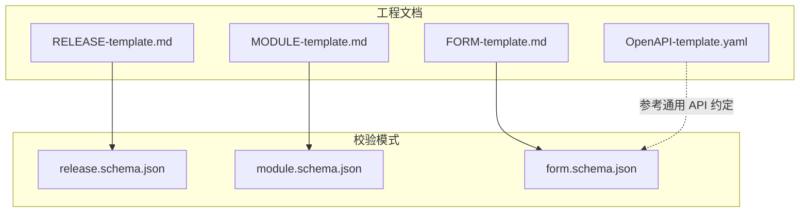
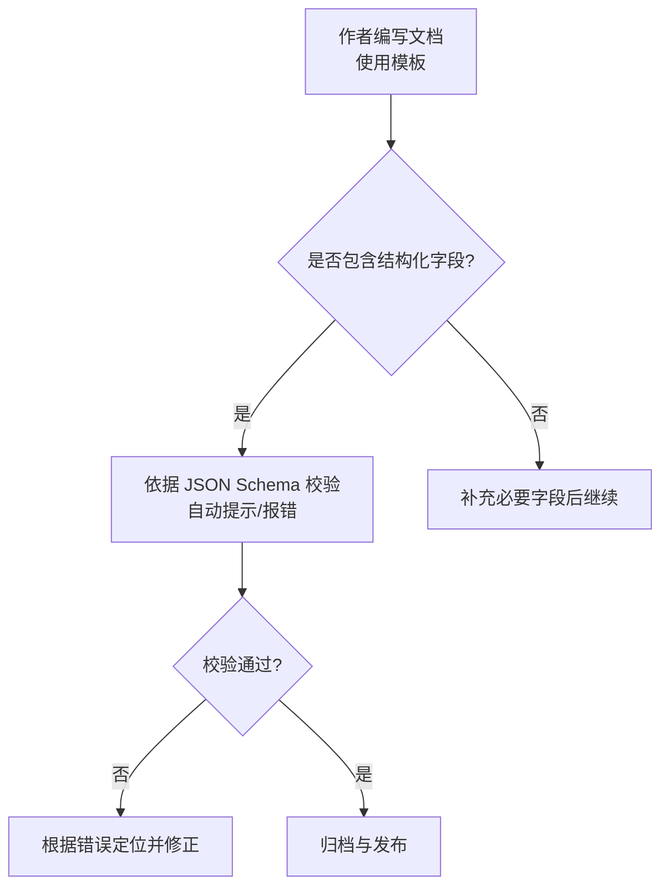
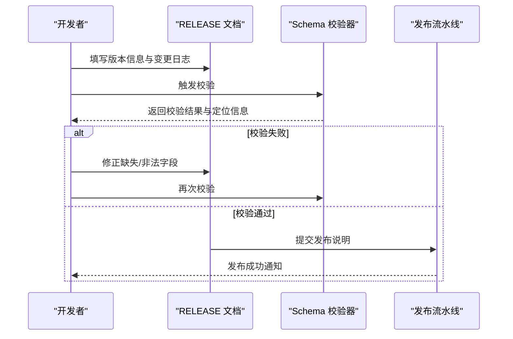
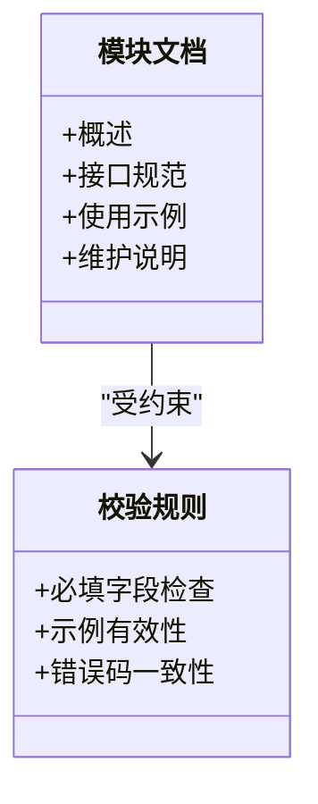
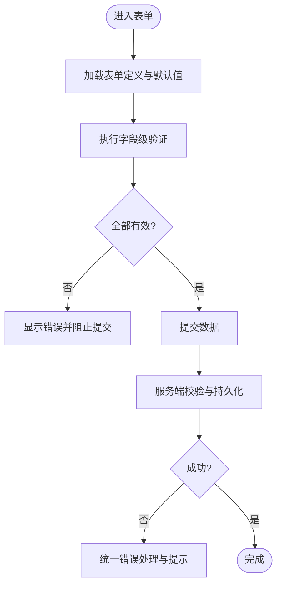
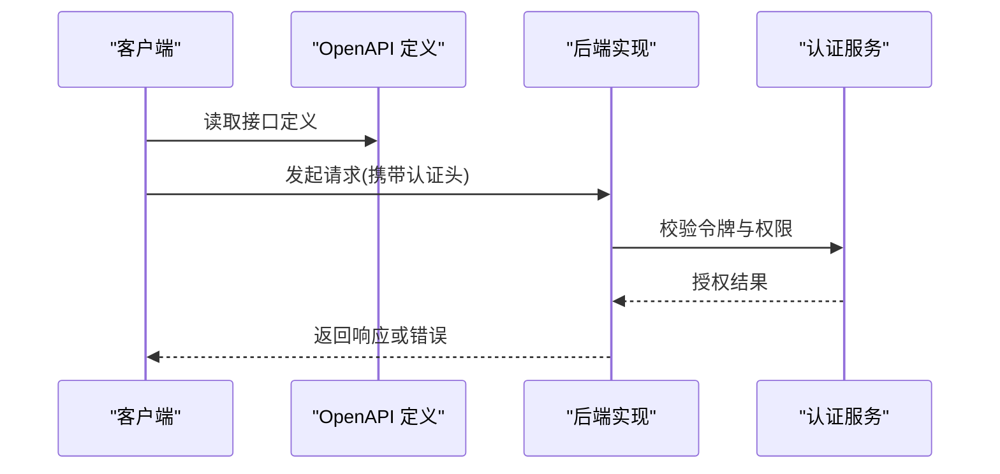
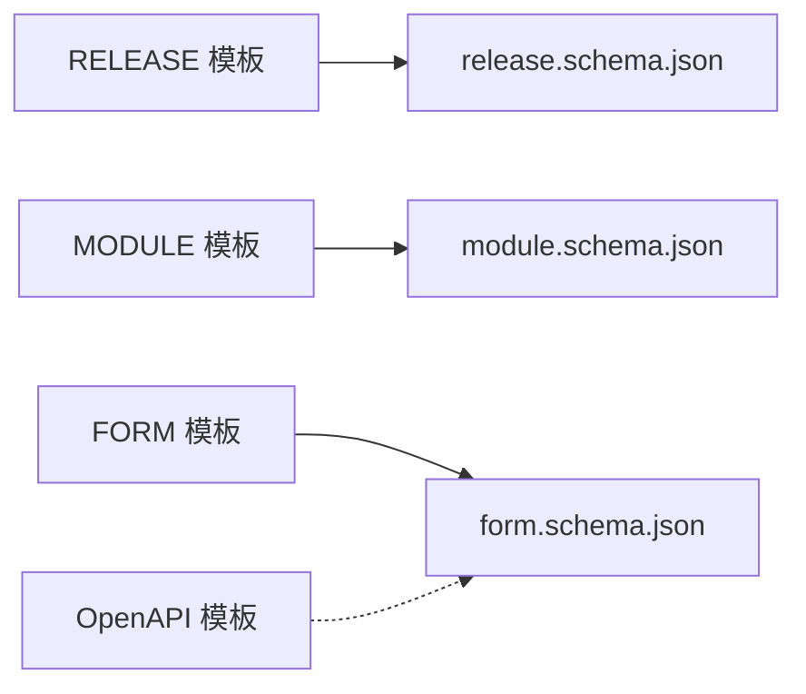

# 辅助文档模板

<cite>
**本文引用的文件**   
- [RELEASE-template.md](file://skills/shared/engineering-docs/templates/RELEASE-template.md)
- [MODULE-template.md](file://skills/shared/engineering-docs/templates/MODULE-template.md)
- [FORM-template.md](file://skills/shared/engineering-docs/templates/FORM-template.md)
- [OpenAPI-template.yaml](file://skills/shared/engineering-docs/templates/OpenAPI-template.yaml)
- [form.schema.json](file://skills/shared/engineering-docs/schemas/form.schema.json)
- [module.schema.json](file://skills/shared/engineering-docs/schemas/module.schema.json)
- [release.schema.json](file://skills/shared/engineering-docs/schemas/release.schema.json)
</cite>

## 目录
1. [简介](#简介)
2. [项目结构](#项目结构)
3. [核心组件](#核心组件)
4. [架构总览](#架构总览)
5. [详细组件分析](#详细组件分析)
6. [依赖关系分析](#依赖关系分析)
7. [性能与可用性考虑](#性能与可用性考虑)
8. [故障排查指南](#故障排查指南)
9. [结论](#结论)
10. [附录](#附录)

## 简介
本文件为“辅助文档模板”的使用说明，覆盖以下四类模板：
- RELEASE（发布说明）：版本信息、变更日志、兼容性说明、部署指南
- MODULE（模块文档）：模块概述、接口规范、使用示例、维护说明
- FORM（表单模板）：表单设计、字段验证、数据绑定、交互逻辑
- OpenAPI 模板：API 接口定义、请求响应格式、错误处理、认证机制

目标读者包括产品、研发、测试与运维人员。通过统一的模板与校验规则，提升文档质量与一致性，降低沟通成本。

## 项目结构
辅助模板位于工程文档技能包中，配套提供 JSON Schema 用于校验与提示。关键路径如下：
- 模板文件：skills/shared/engineering-docs/templates
- 校验模式：skills/shared/engineering-docs/schemas

图表来源
- [RELEASE-template.md](file://skills/shared/engineering-docs/templates/RELEASE-template.md)
- [MODULE-template.md](file://skills/shared/engineering-docs/templates/MODULE-template.md)
- [FORM-template.md](file://skills/shared/engineering-docs/templates/FORM-template.md)
- [OpenAPI-template.yaml](file://skills/shared/engineering-docs/templates/OpenAPI-template.yaml)
- [release.schema.json](file://skills/shared/engineering-docs/schemas/release.schema.json)
- [module.schema.json](file://skills/shared/engineering-docs/schemas/module.schema.json)
- [form.schema.json](file://skills/shared/engineering-docs/schemas/form.schema.json)

章节来源
- [RELEASE-template.md](file://skills/shared/engineering-docs/templates/RELEASE-template.md)
- [MODULE-template.md](file://skills/shared/engineering-docs/templates/MODULE-template.md)
- [FORM-template.md](file://skills/shared/engineering-docs/templates/FORM-template.md)
- [OpenAPI-template.yaml](file://skills/shared/engineering-docs/templates/OpenAPI-template.yaml)
- [release.schema.json](file://skills/shared/engineering-docs/schemas/release.schema.json)
- [module.schema.json](file://skills/shared/engineering-docs/schemas/module.schema.json)
- [form.schema.json](file://skills/shared/engineering-docs/schemas/form.schema.json)

## 核心组件
本节从“内容结构 + 校验约束 + 使用建议”三个维度，逐一说明各模板的要点。

### RELEASE（发布说明）模板
- 版本信息
  - 版本号、发布日期、负责人、关联需求/缺陷等元数据
  - 建议遵循语义化版本，便于下游工具解析
- 变更日志
  - 新增功能、缺陷修复、破坏性变更、已知问题
  - 每条变更应可追溯至需求或任务编号
- 兼容性说明
  - 向后兼容情况、升级注意事项、弃用项
- 部署指南
  - 前置条件、安装步骤、配置项、回滚方案、验证方法

适用场景
- 对外发布说明、内部迭代通告、合规审计留痕

章节来源
- [RELEASE-template.md](file://skills/shared/engineering-docs/templates/RELEASE-template.md)
- [release.schema.json](file://skills/shared/engineering-docs/schemas/release.schema.json)

### MODULE（模块文档）模板
- 模块概述
  - 职责边界、上下文关系、依赖与外部系统
- 接口规范
  - 输入输出、错误码、幂等性与重试策略、限流与配额
- 使用示例
  - 典型调用流程、参数样例、常见用例
- 维护说明
  - 监控指标、告警阈值、排障清单、演进路线

适用场景
- 微服务/组件文档、第三方集成说明、交接文档

章节来源
- [MODULE-template.md](file://skills/shared/engineering-docs/templates/MODULE-template.md)
- [module.schema.json](file://skills/shared/engineering-docs/schemas/module.schema.json)

### FORM（表单模板）模板
- 表单设计
  - 页面布局、分组与导航、国际化与无障碍
- 字段验证
  - 必填、长度、格式、业务规则、实时反馈
- 数据绑定
  - 双向绑定、脏检查、默认值与占位符
- 交互逻辑
  - 提交/取消、防抖节流、并发保护、错误恢复

适用场景
- 业务录入表单、配置中心表单、审批流程表单

章节来源
- [FORM-template.md](file://skills/shared/engineering-docs/templates/FORM-template.md)
- [form.schema.json](file://skills/shared/engineering-docs/schemas/form.schema.json)

### OpenAPI 模板
- API 接口定义
  - 路径、方法、参数、请求体、响应体、示例
- 错误处理
  - 统一错误码、错误消息、调试信息
- 认证机制
  - 鉴权方式、令牌传递、权限范围
- 版本管理
  - 版本前缀、弃用策略、迁移指引

适用场景
- RESTful API 契约、前后端联调、自动化测试与代码生成

章节来源
- [OpenAPI-template.yaml](file://skills/shared/engineering-docs/templates/OpenAPI-template.yaml)

## 架构总览
下图展示模板与其校验模式的对应关系，以及典型工作流中的角色分工。

[此图为概念流程图，无需图表来源]

## 详细组件分析

### RELEASE 模板详解
- 内容结构
  - 版本元数据：版本号、日期、作者、关联单号
  - 变更摘要：按类型分组的变更条目
  - 兼容性：升级影响、弃用与移除
  - 部署：环境要求、步骤、回滚与验证
- 校验要点
  - 关键字段必填、日期格式、版本号语义化
  - 变更条目需具备唯一标识与可追溯链接
- 使用建议
  - 在 CI 中加入 schema 校验，阻断不合规发布说明
  - 将变更记录与版本标签联动，便于检索

图表来源
- [RELEASE-template.md](file://skills/shared/engineering-docs/templates/RELEASE-template.md)
- [release.schema.json](file://skills/shared/engineering-docs/schemas/release.schema.json)

章节来源
- [RELEASE-template.md](file://skills/shared/engineering-docs/templates/RELEASE-template.md)
- [release.schema.json](file://skills/shared/engineering-docs/schemas/release.schema.json)

### MODULE 模板详解
- 内容结构
  - 模块概述：职责、边界、依赖
  - 接口规范：入参出参、错误码、幂等与重试
  - 使用示例：典型调用链路与参数样例
  - 维护说明：监控、告警、排障、演进
- 校验要点
  - 接口描述完整性、示例有效性、错误码一致性
- 使用建议
  - 与代码仓库保持同步，变更需评审
  - 结合 API 文档平台进行在线预览与搜索

图表来源
- [MODULE-template.md](file://skills/shared/engineering-docs/templates/MODULE-template.md)
- [module.schema.json](file://skills/shared/engineering-docs/schemas/module.schema.json)

章节来源
- [MODULE-template.md](file://skills/shared/engineering-docs/templates/MODULE-template.md)
- [module.schema.json](file://skills/shared/engineering-docs/schemas/module.schema.json)

### FORM 模板详解
- 内容结构
  - 表单设计：布局、分组、导航
  - 字段验证：规则、提示、实时反馈
  - 数据绑定：模型映射、默认值、占位符
  - 交互逻辑：提交、取消、防抖、错误恢复
- 校验要点
  - 字段类型与约束一致、提示信息明确、可访问性达标
- 使用建议
  - 将表单定义与前端实现解耦，通过配置驱动
  - 引入自动化测试覆盖关键交互路径

图表来源
- [FORM-template.md](file://skills/shared/engineering-docs/templates/FORM-template.md)
- [form.schema.json](file://skills/shared/engineering-docs/schemas/form.schema.json)

章节来源
- [FORM-template.md](file://skills/shared/engineering-docs/templates/FORM-template.md)
- [form.schema.json](file://skills/shared/engineering-docs/schemas/form.schema.json)

### OpenAPI 模板详解
- 内容结构
  - 接口定义：路径、方法、参数、请求体、响应体、示例
  - 错误处理：统一错误码、错误消息、调试信息
  - 认证机制：鉴权方式、令牌传递、权限范围
  - 版本管理：版本前缀、弃用策略、迁移指引
- 校验要点
  - 路径与方法唯一、示例可运行、错误码与业务对齐
- 使用建议
  - 作为契约驱动开发，自动生成客户端 SDK 与测试用例
  - 在 CI 中进行语法与连通性校验

图表来源
- [OpenAPI-template.yaml](file://skills/shared/engineering-docs/templates/OpenAPI-template.yaml)

章节来源
- [OpenAPI-template.yaml](file://skills/shared/engineering-docs/templates/OpenAPI-template.yaml)

## 依赖关系分析
- 模板与 Schema 的耦合
  - RELEASE 模板依赖 release.schema.json 的结构约束
  - MODULE 模板依赖 module.schema.json 的结构约束
  - FORM 模板依赖 form.schema.json 的结构约束
  - OpenAPI 模板遵循通用 API 约定，可与 form.schema.json 的通用字段复用
- 潜在风险
  - Schema 变更需同步更新模板与校验脚本
  - 跨团队对字段含义理解不一致可能导致校验通过但语义不符

图表来源
- [RELEASE-template.md](file://skills/shared/engineering-docs/templates/RELEASE-template.md)
- [MODULE-template.md](file://skills/shared/engineering-docs/templates/MODULE-template.md)
- [FORM-template.md](file://skills/shared/engineering-docs/templates/FORM-template.md)
- [OpenAPI-template.yaml](file://skills/shared/engineering-docs/templates/OpenAPI-template.yaml)
- [release.schema.json](file://skills/shared/engineering-docs/schemas/release.schema.json)
- [module.schema.json](file://skills/shared/engineering-docs/schemas/module.schema.json)
- [form.schema.json](file://skills/shared/engineering-docs/schemas/form.schema.json)

章节来源
- [release.schema.json](file://skills/shared/engineering-docs/schemas/release.schema.json)
- [module.schema.json](file://skills/shared/engineering-docs/schemas/module.schema.json)
- [form.schema.json](file://skills/shared/engineering-docs/schemas/form.schema.json)

## 性能与可用性考虑
- 文档体积控制
  - 避免在模板中嵌入大段示例，改用外链或分页
- 渲染与检索
  - 为模板添加清晰的标题层级与锚点，提升可读性与检索效率
- 校验性能
  - 在本地与 CI 并行执行校验，减少阻塞时间
- 可访问性
  - 表单与 API 文档遵循无障碍与国际化最佳实践

[本节为通用指导，无需章节来源]

## 故障排查指南
- 校验失败
  - 检查必填字段是否遗漏、数据类型是否匹配、枚举值是否在允许范围内
  - 根据错误定位到具体字段，逐项修正
- 示例不可运行
  - 确认示例参数与当前版本一致，必要时更新示例或标注待办
- 版本冲突
  - 确保版本号符合语义化规范，避免重复或倒退
- 认证与权限
  - 核对认证头与权限范围是否与实现一致，必要时增加调试信息

章节来源
- [release.schema.json](file://skills/shared/engineering-docs/schemas/release.schema.json)
- [module.schema.json](file://skills/shared/engineering-docs/schemas/module.schema.json)
- [form.schema.json](file://skills/shared/engineering-docs/schemas/form.schema.json)

## 结论
通过统一的辅助文档模板与严格的 Schema 校验，可以显著提升文档质量、降低协作成本，并为自动化流程提供稳定基础。建议在团队内推广模板与校验规则，并将其纳入日常开发与发布流程。

[本节为总结，无需章节来源]

## 附录
- 快速上手
  - 复制对应模板到目标目录
  - 根据业务填充内容，并在本地执行校验
  - 将校验集成到 CI，确保合入前通过
- 扩展建议
  - 基于现有 Schema 扩展自定义字段
  - 为模板增加多语言支持与富媒体资源引用

[本节为补充说明，无需章节来源]