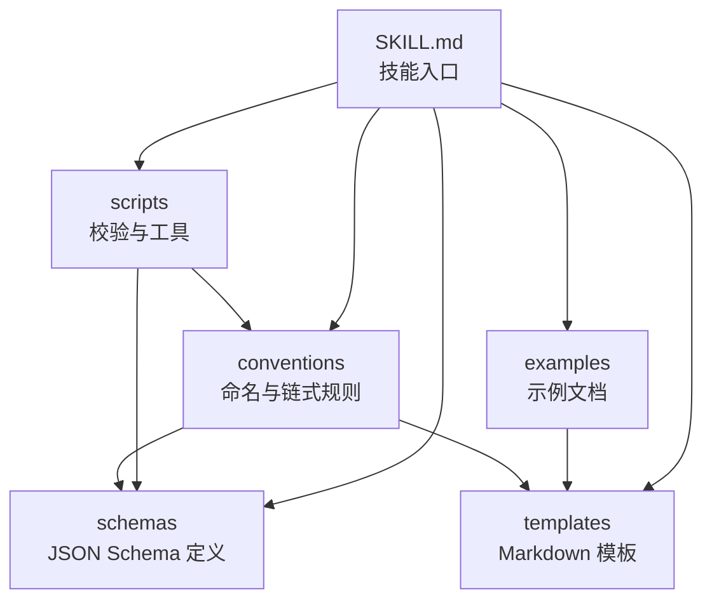
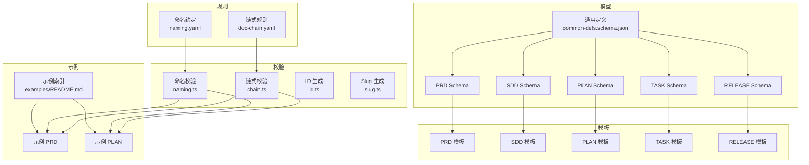
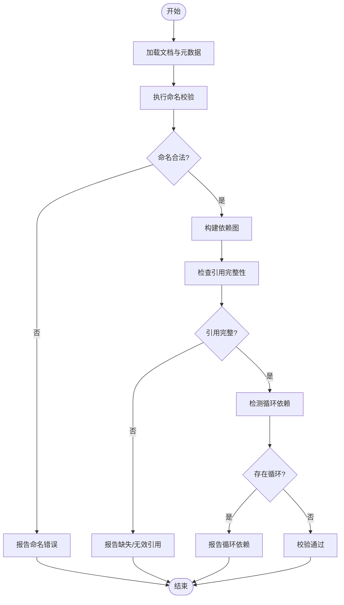
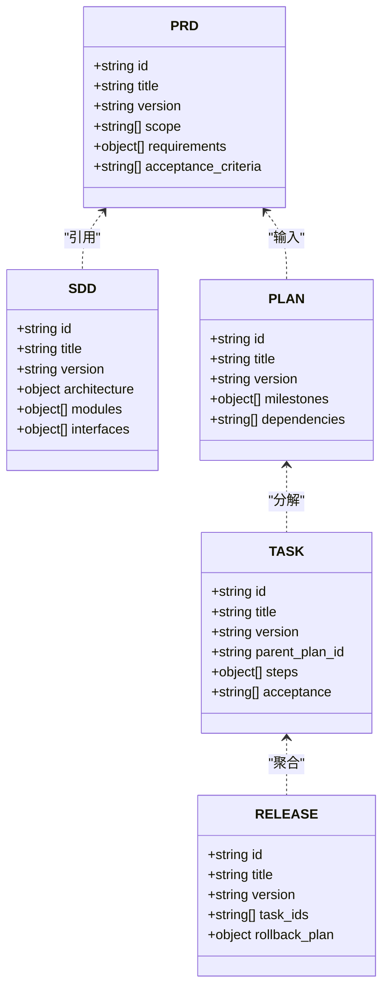
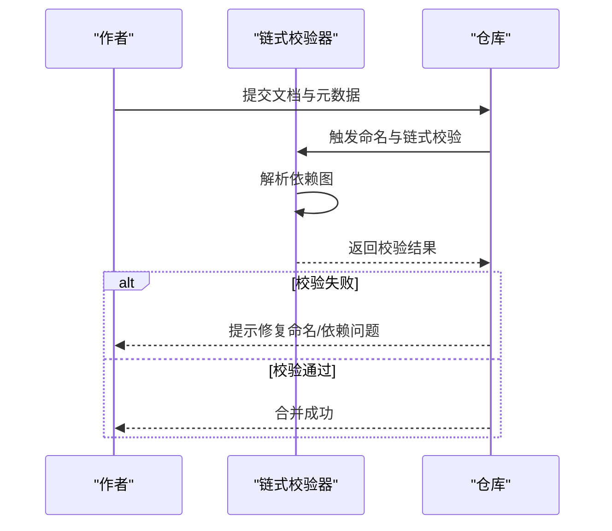

# 文档规范与标准

<cite>
**本文引用的文件**   
- [conventions/doc-chain.yaml](file://skills/shared/engineering-docs/conventions/doc-chain.yaml)
- [conventions/naming.yaml](file://skills/shared/engineering-docs/conventions/naming.yaml)
- [schemas/prd.schema.json](file://skills/shared/engineering-docs/schemas/prd.schema.json)
- [schemas/sdd.schema.json](file://skills/shared/engineering-docs/schemas/sdd.schema.json)
- [schemas/plan.schema.json](file://skills/shared/engineering-docs/schemas/plan.schema.json)
- [schemas/task.schema.json](file://skills/shared/engineering-docs/schemas/task.schema.json)
- [schemas/release.schema.json](file://skills/shared/engineering-docs/schemas/release.schema.json)
- [schemas/common-defs.schema.json](file://skills/shared/engineering-docs/schemas/common-defs.schema.json)
- [templates/PRD-template.md](file://skills/shared/engineering-docs/templates/PRD-template.md)
- [templates/SDD-template.md](file://skills/shared/engineering-docs/templates/SDD-template.md)
- [templates/PLAN-template.md](file://skills/shared/engineering-docs/templates/PLAN-template.md)
- [templates/TASK-template.md](file://skills/shared/engineering-docs/templates/TASK-template.md)
- [templates/RELEASE-template.md](file://skills/shared/engineering-docs/templates/RELEASE-template.md)
- [examples/README.md](file://skills/shared/engineering-docs/examples/README.md)
- [examples/PRD-001-sample-login.md](file://skills/shared/engineering-docs/examples/PRD-001-sample-login.md)
- [examples/PLAN-v1.0-001-sample-mvp.md](file://skills/shared/engineering-docs/examples/PLAN-v1.0-001-sample-mvp.md)
- [scripts/src/validators/naming.ts](file://skills/shared/engineering-docs/scripts/src/validators/naming.ts)
- [scripts/src/validators/chain.ts](file://skills/shared/engineering-docs/scripts/src/validators/chain.ts)
- [scripts/src/utils/id.ts](file://skills/shared/engineering-docs/scripts/src/utils/id.ts)
- [scripts/src/utils/slug.ts](file://skills/shared/engineering-docs/scripts/src/utils/slug.ts)
- [SKILL.md](file://skills/shared/engineering-docs/SKILL.md)
</cite>

## 目录
1. [引言](#引言)
2. [项目结构](#项目结构)
3. [核心组件](#核心组件)
4. [架构总览](#架构总览)
5. [详细组件分析](#详细组件分析)
6. [依赖关系与追溯性](#依赖关系与追溯性)
7. [性能与可维护性](#性能与可维护性)
8. [故障排查指南](#故障排查指南)
9. [结论](#结论)
10. [附录](#附录)

## 引言
本规范旨在为工程文档的命名约定、文件组织、链式管理与版本协作提供统一标准，覆盖 PRD、技术方案(SDD)、计划(PLAN)、任务(TASK)、发布(RELEASE)等关键文档类型。通过“模板 + Schema + 校验工具”的组合，确保文档结构一致、内容完整、可追溯、可验证，并支持自动化生成与质量检查。

## 项目结构
工程文档相关资产集中在 skills/shared/engineering-docs 目录下，采用分层组织：
- conventions：命名与链式管理规则（YAML）
- schemas：各文档类型的 JSON Schema 定义
- templates：各类文档的 Markdown 模板
- examples：示例文档，用于对齐结构与命名
- scripts：校验与辅助脚本（TypeScript），包含命名、链式、ID、Slug 等能力
- SKILL.md：技能入口说明

图表来源
- [SKILL.md](file://skills/shared/engineering-docs/SKILL.md)
- [conventions/doc-chain.yaml](file://skills/shared/engineering-docs/conventions/doc-chain.yaml)
- [conventions/naming.yaml](file://skills/shared/engineering-docs/conventions/naming.yaml)
- [schemas/prd.schema.json](file://skills/shared/engineering-docs/schemas/prd.schema.json)
- [templates/PRD-template.md](file://skills/shared/engineering-docs/templates/PRD-template.md)
- [examples/README.md](file://skills/shared/engineering-docs/examples/README.md)

章节来源
- [SKILL.md](file://skills/shared/engineering-docs/SKILL.md)
- [examples/README.md](file://skills/shared/engineering-docs/examples/README.md)

## 核心组件
- 命名约定与链式规则
  - 命名约定：规定文档前缀、编号、版本号、slug 等命名要素与格式约束。
  - 链式管理：定义文档间的父子、引用、依赖关系，以及变更传播与一致性校验。
- 文档 Schema 与模板
  - 每个文档类型对应一个 JSON Schema，定义必填字段、枚举值、嵌套结构等。
  - 模板提供结构化骨架，保证不同作者产出的文档具备一致的章节与元数据。
- 校验与工具
  - 命名校验：基于命名约定对文件名与元数据进行合法性检查。
  - 链式校验：基于链式规则对文档间依赖进行完整性与一致性检查。
  - ID/Slug 生成：提供稳定的标识符与 URL 友好路径生成能力。

章节来源
- [conventions/naming.yaml](file://skills/shared/engineering-docs/conventions/naming.yaml)
- [conventions/doc-chain.yaml](file://skills/shared/engineering-docs/conventions/doc-chain.yaml)
- [schemas/prd.schema.json](file://skills/shared/engineering-docs/schemas/prd.schema.json)
- [schemas/sdd.schema.json](file://skills/shared/engineering-docs/schemas/sdd.schema.json)
- [schemas/plan.schema.json](file://skills/shared/engineering-docs/schemas/plan.schema.json)
- [schemas/task.schema.json](file://skills/shared/engineering-docs/schemas/task.schema.json)
- [schemas/release.schema.json](file://skills/shared/engineering-docs/schemas/release.schema.json)
- [schemas/common-defs.schema.json](file://skills/shared/engineering-docs/schemas/common-defs.schema.json)
- [templates/PRD-template.md](file://skills/shared/engineering-docs/templates/PRD-template.md)
- [templates/SDD-template.md](file://skills/shared/engineering-docs/templates/SDD-template.md)
- [templates/PLAN-template.md](file://skills/shared/engineering-docs/templates/PLAN-template.md)
- [templates/TASK-template.md](file://skills/shared/engineering-docs/templates/TASK-template.md)
- [templates/RELEASE-template.md](file://skills/shared/engineering-docs/templates/RELEASE-template.md)
- [scripts/src/validators/naming.ts](file://skills/shared/engineering-docs/scripts/src/validators/naming.ts)
- [scripts/src/validators/chain.ts](file://skills/shared/engineering-docs/scripts/src/validators/chain.ts)
- [scripts/src/utils/id.ts](file://skills/shared/engineering-docs/scripts/src/utils/id.ts)
- [scripts/src/utils/slug.ts](file://skills/shared/engineering-docs/scripts/src/utils/slug.ts)

## 架构总览
文档体系由“规则—模型—模板—示例—校验”五层构成，形成闭环：
- 规则层：命名与链式规则定义文档如何命名与关联
- 模型层：Schema 定义文档的数据结构与约束
- 模板层：Markdown 模板提供写作骨架
- 示例层：示例文档展示正确用法
- 校验层：脚本对命名、链式、元数据等进行自动化校验

图表来源
- [conventions/naming.yaml](file://skills/shared/engineering-docs/conventions/naming.yaml)
- [conventions/doc-chain.yaml](file://skills/shared/engineering-docs/conventions/doc-chain.yaml)
- [schemas/prd.schema.json](file://skills/shared/engineering-docs/schemas/prd.schema.json)
- [schemas/sdd.schema.json](file://skills/shared/engineering-docs/schemas/sdd.schema.json)
- [schemas/plan.schema.json](file://skills/shared/engineering-docs/schemas/plan.schema.json)
- [schemas/task.schema.json](file://skills/shared/engineering-docs/schemas/task.schema.json)
- [schemas/release.schema.json](file://skills/shared/engineering-docs/schemas/release.schema.json)
- [schemas/common-defs.schema.json](file://skills/shared/engineering-docs/schemas/common-defs.schema.json)
- [templates/PRD-template.md](file://skills/shared/engineering-docs/templates/PRD-template.md)
- [templates/SDD-template.md](file://skills/shared/engineering-docs/templates/SDD-template.md)
- [templates/PLAN-template.md](file://skills/shared/engineering-docs/templates/PLAN-template.md)
- [templates/TASK-template.md](file://skills/shared/engineering-docs/templates/TASK-template.md)
- [templates/RELEASE-template.md](file://skills/shared/engineering-docs/templates/RELEASE-template.md)
- [examples/README.md](file://skills/shared/engineering-docs/examples/README.md)
- [examples/PRD-001-sample-login.md](file://skills/shared/engineering-docs/examples/PRD-001-sample-login.md)
- [examples/PLAN-v1.0-001-sample-mvp.md](file://skills/shared/engineering-docs/examples/PLAN-v1.0-001-sample-mvp.md)
- [scripts/src/validators/naming.ts](file://skills/shared/engineering-docs/scripts/src/validators/naming.ts)
- [scripts/src/validators/chain.ts](file://skills/shared/engineering-docs/scripts/src/validators/chain.ts)
- [scripts/src/utils/id.ts](file://skills/shared/engineering-docs/scripts/src/utils/id.ts)
- [scripts/src/utils/slug.ts](file://skills/shared/engineering-docs/scripts/src/utils/slug.ts)

## 详细组件分析

### 命名约定与文件组织
- 命名要素
  - 文档前缀：如 PRD、SDD、PLAN、TASK、RELEASE
  - 编号：全局唯一或模块内唯一的数字编号
  - 版本：语义化版本或迭代号（例如 v1.0）
  - 标题：短横线分隔的 slug，便于 URL 与检索
- 文件组织
  - 按文档类型分目录存放，或使用统一根目录配合前缀区分
  - 示例与模板分离，避免混淆
- 最佳实践
  - 使用脚本生成的 ID 与 Slug，避免手工错误
  - 在文档元数据中声明父级与依赖，便于链式校验

章节来源
- [conventions/naming.yaml](file://skills/shared/engineering-docs/conventions/naming.yaml)
- [scripts/src/validators/naming.ts](file://skills/shared/engineering-docs/scripts/src/validators/naming.ts)
- [scripts/src/utils/id.ts](file://skills/shared/engineering-docs/scripts/src/utils/id.ts)
- [scripts/src/utils/slug.ts](file://skills/shared/engineering-docs/scripts/src/utils/slug.ts)
- [examples/README.md](file://skills/shared/engineering-docs/examples/README.md)

### 文档链式管理与依赖关系
- 链式关系
  - 父子关系：如 PLAN 来源于 PRD；TASK 来源于 PLAN；RELEASE 聚合多个 TASK
  - 引用关系：SDD 引用 PRD 的功能点；RELEASE 引用 TASK 的完成状态
- 依赖定义
  - 在文档元数据中声明 depends_on、parent_of、references 等字段
  - 使用统一的 ID 作为跨文档引用键
- 一致性校验
  - 链式校验器检查依赖是否存在、是否被正确引用、是否有循环依赖
  - 命名校验器确保所有引用键符合命名约定

图表来源
- [conventions/doc-chain.yaml](file://skills/shared/engineering-docs/conventions/doc-chain.yaml)
- [scripts/src/validators/chain.ts](file://skills/shared/engineering-docs/scripts/src/validators/chain.ts)
- [scripts/src/validators/naming.ts](file://skills/shared/engineering-docs/scripts/src/validators/naming.ts)

章节来源
- [conventions/doc-chain.yaml](file://skills/shared/engineering-docs/conventions/doc-chain.yaml)
- [scripts/src/validators/chain.ts](file://skills/shared/engineering-docs/scripts/src/validators/chain.ts)

### 文档类型规范（结构与内容要求）
- PRD（产品需求文档）
  - 目标：明确业务背景、用户场景、功能范围、验收标准
  - 结构要点：概述、范围、角色与权限、业务流程、非功能需求、验收标准、风险与假设
  - 校验：遵循 PRD Schema 的字段与枚举约束
- SDD（技术方案文档）
  - 目标：描述系统架构、模块设计、接口契约、数据模型、部署方案
  - 结构要点：背景与目标、总体架构、模块划分、接口定义、数据模型、安全与合规、测试策略
  - 校验：遵循 SDD Schema 的字段与嵌套结构约束
- PLAN（计划文档）
  - 目标：将 PRD 拆解为可执行的里程碑与阶段计划
  - 结构要点：范围与目标、里程碑、资源与排期、风险与缓解、依赖与前置条件
  - 校验：遵循 PLAN Schema 的字段与依赖关系约束
- TASK（任务文档）
  - 目标：细化到具体任务的实现步骤、验收与交付物
  - 结构要点：任务描述、实现步骤、验收标准、关联文档、风险与备注
  - 校验：遵循 TASK Schema 的字段与引用约束
- RELEASE（发布文档）
  - 目标：汇总发布范围、变更清单、回滚策略与发布计划
  - 结构要点：版本信息、变更摘要、影响评估、发布步骤、回滚预案、上线后监控
  - 校验：遵循 RELEASE Schema 的字段与关联约束

图表来源
- [schemas/prd.schema.json](file://skills/shared/engineering-docs/schemas/prd.schema.json)
- [schemas/sdd.schema.json](file://skills/shared/engineering-docs/schemas/sdd.schema.json)
- [schemas/plan.schema.json](file://skills/shared/engineering-docs/schemas/plan.schema.json)
- [schemas/task.schema.json](file://skills/shared/engineering-docs/schemas/task.schema.json)
- [schemas/release.schema.json](file://skills/shared/engineering-docs/schemas/release.schema.json)
- [schemas/common-defs.schema.json](file://skills/shared/engineering-docs/schemas/common-defs.schema.json)
- [templates/PRD-template.md](file://skills/shared/engineering-docs/templates/PRD-template.md)
- [templates/SDD-template.md](file://skills/shared/engineering-docs/templates/SDD-template.md)
- [templates/PLAN-template.md](file://skills/shared/engineering-docs/templates/PLAN-template.md)
- [templates/TASK-template.md](file://skills/shared/engineering-docs/templates/TASK-template.md)
- [templates/RELEASE-template.md](file://skills/shared/engineering-docs/templates/RELEASE-template.md)

章节来源
- [schemas/prd.schema.json](file://skills/shared/engineering-docs/schemas/prd.schema.json)
- [schemas/sdd.schema.json](file://skills/shared/engineering-docs/schemas/sdd.schema.json)
- [schemas/plan.schema.json](file://skills/shared/engineering-docs/schemas/plan.schema.json)
- [schemas/task.schema.json](file://skills/shared/engineering-docs/schemas/task.schema.json)
- [schemas/release.schema.json](file://skills/shared/engineering-docs/schemas/release.schema.json)
- [schemas/common-defs.schema.json](file://skills/shared/engineering-docs/schemas/common-defs.schema.json)
- [templates/PRD-template.md](file://skills/shared/engineering-docs/templates/PRD-template.md)
- [templates/SDD-template.md](file://skills/shared/engineering-docs/templates/SDD-template.md)
- [templates/PLAN-template.md](file://skills/shared/engineering-docs/templates/PLAN-template.md)
- [templates/TASK-template.md](file://skills/shared/engineering-docs/templates/TASK-template.md)
- [templates/RELEASE-template.md](file://skills/shared/engineering-docs/templates/RELEASE-template.md)

### 示例与模板对照
- 示例文档
  - PRD 示例：展示命名、元数据与章节结构的正确写法
  - PLAN 示例：展示里程碑、依赖与版本标注
- 模板使用
  - 新建文档时优先从模板复制，再填充元数据与正文
  - 保持模板与 Schema 同步更新，避免结构漂移

章节来源
- [examples/README.md](file://skills/shared/engineering-docs/examples/README.md)
- [examples/PRD-001-sample-login.md](file://skills/shared/engineering-docs/examples/PRD-001-sample-login.md)
- [examples/PLAN-v1.0-001-sample-mvp.md](file://skills/shared/engineering-docs/examples/PLAN-v1.0-001-sample-mvp.md)
- [templates/PRD-template.md](file://skills/shared/engineering-docs/templates/PRD-template.md)
- [templates/PLAN-template.md](file://skills/shared/engineering-docs/templates/PLAN-template.md)

## 依赖关系与追溯性
- 依赖方向
  - PRD → SDD：技术方案需覆盖 PRD 中的功能与非功能需求
  - PRD → PLAN：计划需映射 PRD 的范围与优先级
  - PLAN → TASK：任务需可追溯到计划的里程碑
  - TASK → RELEASE：发布需汇总已完成的任务与变更
- 追溯性要求
  - 每个文档必须包含稳定 ID，并在元数据中声明父级与依赖
  - 链式校验器应能输出依赖图谱与断链报告
- 变更传播
  - 上游变更（如 PRD）需触发下游文档（SDD、PLAN、TASK）的评审与更新
  - 建议在 CI 中集成链式校验，阻断不合规提交

图表来源
- [conventions/doc-chain.yaml](file://skills/shared/engineering-docs/conventions/doc-chain.yaml)
- [scripts/src/validators/chain.ts](file://skills/shared/engineering-docs/scripts/src/validators/chain.ts)
- [scripts/src/validators/naming.ts](file://skills/shared/engineering-docs/scripts/src/validators/naming.ts)

章节来源
- [conventions/doc-chain.yaml](file://skills/shared/engineering-docs/conventions/doc-chain.yaml)
- [scripts/src/validators/chain.ts](file://skills/shared/engineering-docs/scripts/src/validators/chain.ts)

## 性能与可维护性
- 性能建议
  - 批量校验：一次性加载全部文档与依赖，减少 I/O 次数
  - 增量校验：仅对变更文档及其下游依赖进行重新校验
- 可维护性建议
  - 模板与 Schema 解耦：模板负责呈现，Schema 负责约束
  - 集中式规则：命名与链式规则单一来源，避免多份定义不一致
  - 示例驱动：新增文档类型时，同时提供示例与校验用例

[本节为通用指导，无需特定文件来源]

## 故障排查指南
- 常见错误
  - 命名不合法：前缀、编号、版本或 slug 不符合约定
  - 引用缺失：依赖的文档不存在或未正确声明
  - 循环依赖：A 依赖 B，B 又依赖 A，导致校验失败
- 定位方法
  - 查看命名校验器的错误日志，确认具体字段与期望格式
  - 运行链式校验器，获取依赖图与断链位置
  - 使用 ID/Slug 生成器核对引用键的一致性
- 修复建议
  - 修正命名与元数据，确保与模板和 Schema 一致
  - 补充缺失的依赖声明，或调整依赖方向以消除循环
  - 在 CI 中固定校验命令与参数，避免环境差异

章节来源
- [scripts/src/validators/naming.ts](file://skills/shared/engineering-docs/scripts/src/validators/naming.ts)
- [scripts/src/validators/chain.ts](file://skills/shared/engineering-docs/scripts/src/validators/chain.ts)
- [scripts/src/utils/id.ts](file://skills/shared/engineering-docs/scripts/src/utils/id.ts)
- [scripts/src/utils/slug.ts](file://skills/shared/engineering-docs/scripts/src/utils/slug.ts)

## 结论
通过统一的命名与链式规则、严格的 Schema 约束、标准化的模板与示例，以及自动化的校验工具，工程文档可实现高质量、强追溯与易维护。建议在团队内推广该规范，并将校验流程嵌入开发流水线，持续提升文档质量与协作效率。

[本节为总结性内容，无需特定文件来源]

## 附录
- 命名示例
  - PRD-001-sample-login.md
  - PLAN-v1.0-001-sample-mvp.md
- 组织结构建议
  - 根目录按文档类型分文件夹，或统一目录使用前缀区分
  - 示例与模板独立存放，避免误用
- 协作开发规范
  - 新建文档前先创建 ID 与 Slug，避免冲突
  - 提交前本地运行命名与链式校验，减少 CI 失败
  - 变更上游文档时，同步更新下游文档并保留变更记录

章节来源
- [examples/PRD-001-sample-login.md](file://skills/shared/engineering-docs/examples/PRD-001-sample-login.md)
- [examples/PLAN-v1.0-001-sample-mvp.md](file://skills/shared/engineering-docs/examples/PLAN-v1.0-001-sample-mvp.md)
- [scripts/src/utils/id.ts](file://skills/shared/engineering-docs/scripts/src/utils/id.ts)
- [scripts/src/utils/slug.ts](file://skills/shared/engineering-docs/scripts/src/utils/slug.ts)