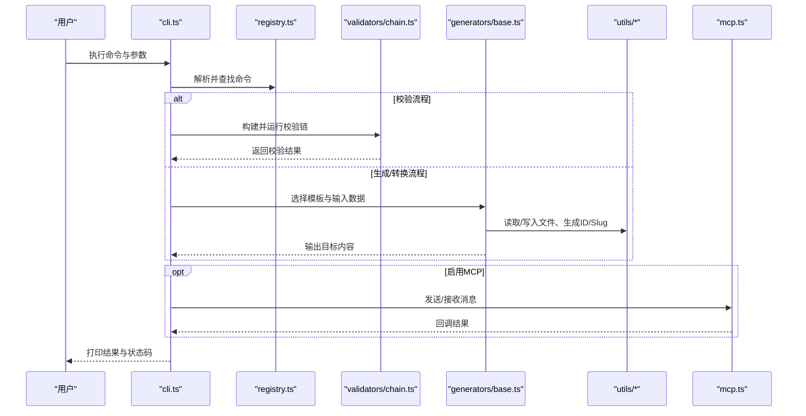
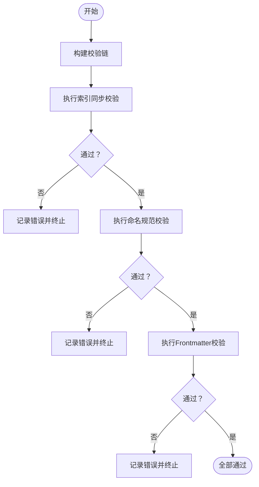
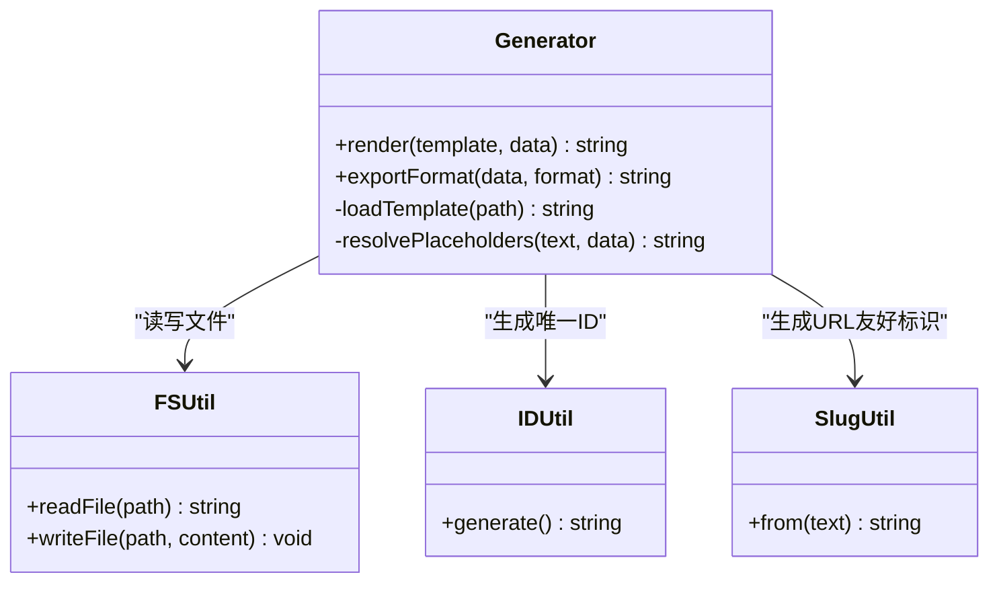
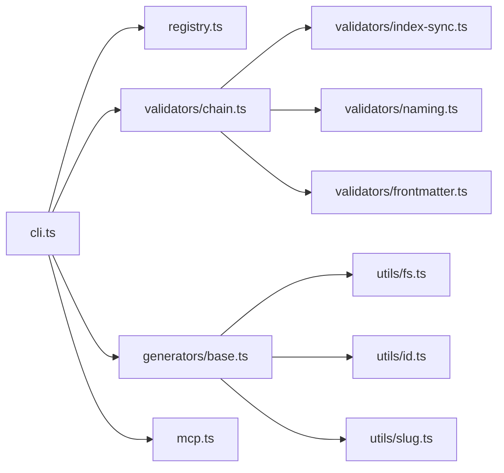

# CLI工具使用

<cite>
**本文引用的文件**   
- [CLAUDE.MD](file://CLAUDE.MD)
- [AGENT-SKILL-MATRIX.md](file://AGENT-SKILL-MATRIX.md)
- [AGENTS.md](file://AGENTS.md)
- [dir-graph.yaml](file://dir-graph.yaml)
- [pipeline-templates/README.md](file://pipeline-templates/README.md)
- [skills/shared/engineering-docs/scripts/src/cli.ts](file://skills/shared/engineering-docs/scripts/src/cli.ts)
- [skills/shared/engineering-docs/scripts/package.json](file://skills/shared/engineering-docs/scripts/package.json)
- [skills/shared/engineering-docs/scripts/tsconfig.json](file://skills/shared/engineering-docs/scripts/tsconfig.json)
- [skills/shared/engineering-docs/schemas/common-defs.schema.json](file://skills/shared/engineering-docs/schemas/common-defs.schema.json)
- [skills/shared/engineering-docs/schemas/prd.schema.json](file://skills/shared/engineering-docs/schemas/prd.schema.json)
- [skills/shared/engineering-docs/schemas/plan.schema.json](file://skills/shared/engineering-docs/schemas/plan.schema.json)
- [skills/shared/engineering-docs/schemas/sdd.schema.json](file://skills/shared/engineering-docs/schemas/sdd.schema.json)
- [skills/shared/engineering-docs/schemas/form.schema.json](file://skills/shared/engineering-docs/schemas/form.schema.json)
- [skills/shared/engineering-docs/schemas/module.schema.json](file://skills/shared/engineering-docs/schemas/module.schema.json)
- [skills/shared/engineering-docs/schemas/release.schema.json](file://skills/shared/engineering-docs/schemas/release.schema.json)
- [skills/shared/engineering-docs/schemas/task.schema.json](file://skills/shared/engineering-docs/schemas/task.schema.json)
- [skills/shared/engineering-docs/templates/PRD-template.md](file://skills/shared/engineering-docs/templates/PRD-template.md)
- [skills/shared/engineering-docs/templates/PLAN-template.md](file://skills/shared/engineering-docs/templates/PLAN-template.md)
- [skills/shared/engineering-docs/templates/SDD-template.md](file://skills/shared/engineering-docs/templates/SDD-template.md)
- [skills/shared/engineering-docs/templates/TASK-template.md](file://skills/shared/engineering-docs/templates/TASK-template.md)
- [skills/shared/engineering-docs/templates/MODULE-template.md](file://skills/shared/engineering-docs/templates/MODULE-template.md)
- [skills/shared/engineering-docs/templates/RELEASE-template.md](file://skills/shared/engineering-docs/templates/RELEASE-template.md)
- [skills/shared/engineering-docs/templates/OpenAPI-template.yaml](file://skills/shared/engineering-docs/templates/OpenAPI-template.yaml)
- [skills/shared/engineering-docs/templates/FORM-schema-template.yaml](file://skills/shared/engineering-docs/templates/FORM-schema-template.yaml)
- [skills/shared/engineering-docs/scripts/src/generators/base.ts](file://skills/shared/engineering-docs/scripts/src/generators/base.ts)
- [skills/shared/engineering-docs/scripts/src/utils/fs.ts](file://skills/shared/engineering-docs/scripts/src/utils/fs.ts)
- [skills/shared/engineering-docs/scripts/src/utils/id.ts](file://skills/shared/engineering-docs/scripts/src/utils/id.ts)
- [skills/shared/engineering-docs/scripts/src/utils/slug.ts](file://skills/shared/engineering-docs/scripts/src/utils/slug.ts)
- [skills/shared/engineering-docs/scripts/src/validators/index-sync.ts](file://skills/shared/engineering-docs/scripts/src/validators/index-sync.ts)
- [skills/shared/engineering-docs/scripts/src/validators/naming.ts](file://skills/shared/engineering-docs/scripts/src/validators/naming.ts)
- [skills/shared/engineering-docs/scripts/src/validators/frontmatter.ts](file://skills/shared/engineering-docs/scripts/src/validators/frontmatter.ts)
- [skills/shared/engineering-docs/scripts/src/validators/chain.ts](file://skills/shared/engineering-docs/scripts/src/validators/chain.ts)
- [skills/shared/engineering-docs/scripts/src/mcp.ts](file://skills/shared/engineering-docs/scripts/src/mcp.ts)
- [skills/shared/engineering-docs/scripts/src/registry.ts](file://skills/shared/engineering-docs/scripts/src/registry.ts)
</cite>

## 目录
1. [简介](#简介)
2. [项目结构](#项目结构)
3. [核心组件](#核心组件)
4. [架构总览](#架构总览)
5. [详细组件分析](#详细组件分析)
6. [依赖关系分析](#依赖关系分析)
7. [性能考虑](#性能考虑)
8. [故障排查指南](#故障排查指南)
9. [结论](#结论)
10. [附录](#附录)

## 简介
本文件面向使用该仓库中工程文档与流水线模板的CLI工具使用者，提供完整的命令行参数、选项与配置方法说明；覆盖文档验证、生成、转换等核心功能；给出常用命令示例与典型场景；解释配置文件结构与自定义选项；并包含错误处理、日志输出、调试模式的使用建议，以及与CI/CD集成、性能优化和批量处理的实践。

该CLI工具位于工程文档技能包脚本子项目中，主要能力包括：
- 基于JSON Schema对工程文档进行校验（如PRD、PLAN、SDD、TASK、MODULE、RELEASE、FORM等）
- 从模板生成标准化文档骨架
- 将结构化数据转换为Markdown或OpenAPI等格式
- 维护索引与命名规范一致性
- 可选地通过MCP协议与外部系统交互

## 项目结构
仓库中与CLI相关的代码集中在“skills/shared/engineering-docs/scripts”目录下，采用TypeScript实现，配套有JSON Schema定义、模板文件与测试用例。顶层还包含工程文档规范、Agent技能矩阵与流水线模板，便于在团队内统一文档标准与工作流。

```mermaid
graph TB
subgraph "工程文档脚本"
CLI["cli.ts<br/>入口与命令解析"]
REG["registry.ts<br/>命令注册表"]
MCP["mcp.ts<br/>MCP集成"]
GEN["generators/base.ts<br/>生成器基类"]
VAL_IDX["validators/index-sync.ts<br/>索引同步校验"]
VAL_NM["validators/naming.ts<br/>命名规范校验"]
VAL_FM["validators/frontmatter.ts<br/>Frontmatter校验"]
VAL_CH["validators/chain.ts<br/>校验链编排"]
U_FS["utils/fs.ts<br/>文件系统工具"]
U_ID["utils/id.ts<br/>ID生成"]
U_SLUG["utils/slug.ts<br/>Slug生成"]
end
subgraph "工程文档资源"
SCHEMA_PRD["schemas/prd.schema.json"]
SCHEMA_PLAN["schemas/plan.schema.json"]
SCHEMA_SDD["schemas/sdd.schema.json"]
SCHEMA_TASK["schemas/task.schema.json"]
SCHEMA_MODULE["schemas/module.schema.json"]
SCHEMA_RELEASE["schemas/release.schema.json"]
SCHEMA_FORM["schemas/form.schema.json"]
SCHEMA_COMMON["schemas/common-defs.schema.json"]
TPL_PRD["templates/PRD-template.md"]
TPL_PLAN["templates/PLAN-template.md"]
TPL_SDD["templates/SDD-template.md"]
TPL_TASK["templates/TASK-template.md"]
TPL_MODULE["templates/MODULE-template.md"]
TPL_RELEASE["templates/RELEASE-template.md"]
TPL_OPENAPI["templates/OpenAPI-template.yaml"]
TPL_FORM_SCHEMA["templates/FORM-schema-template.yaml"]
end
CLI --> REG
CLI --> MCP
CLI --> GEN
CLI --> VAL_CH
VAL_CH --> VAL_IDX
VAL_CH --> VAL_NM
VAL_CH --> VAL_FM
GEN --> U_FS
GEN --> U_ID
GEN --> U_SLUG
CLI --> SCHEMA_PRD
CLI --> SCHEMA_PLAN
CLI --> SCHEMA_SDD
CLI --> SCHEMA_TASK
CLI --> SCHEMA_MODULE
CLI --> SCHEMA_RELEASE
CLI --> SCHEMA_FORM
CLI --> SCHEMA_COMMON
CLI --> TPL_PRD
CLI --> TPL_PLAN
CLI --> TPL_SDD
CLI --> TPL_TASK
CLI --> TPL_MODULE
CLI --> TPL_RELEASE
CLI --> TPL_OPENAPI
CLI --> TPL_FORM_SCHEMA
```

图表来源
- [skills/shared/engineering-docs/scripts/src/cli.ts](file://skills/shared/engineering-docs/scripts/src/cli.ts)
- [skills/shared/engineering-docs/scripts/src/registry.ts](file://skills/shared/engineering-docs/scripts/src/registry.ts)
- [skills/shared/engineering-docs/scripts/src/mcp.ts](file://skills/shared/engineering-docs/scripts/src/mcp.ts)
- [skills/shared/engineering-docs/scripts/src/generators/base.ts](file://skills/shared/engineering-docs/scripts/src/generators/base.ts)
- [skills/shared/engineering-docs/scripts/src/validators/index-sync.ts](file://skills/shared/engineering-docs/scripts/src/validators/index-sync.ts)
- [skills/shared/engineering-docs/scripts/src/validators/naming.ts](file://skills/shared/engineering-docs/scripts/src/validators/naming.ts)
- [skills/shared/engineering-docs/scripts/src/validators/frontmatter.ts](file://skills/shared/engineering-docs/scripts/src/validators/frontmatter.ts)
- [skills/shared/engineering-docs/scripts/src/validators/chain.ts](file://skills/shared/engineering-docs/scripts/src/validators/chain.ts)
- [skills/shared/engineering-docs/scripts/src/utils/fs.ts](file://skills/shared/engineering-docs/scripts/src/utils/fs.ts)
- [skills/shared/engineering-docs/scripts/src/utils/id.ts](file://skills/shared/engineering-docs/scripts/src/utils/id.ts)
- [skills/shared/engineering-docs/scripts/src/utils/slug.ts](file://skills/shared/engineering-docs/scripts/src/utils/slug.ts)
- [skills/shared/engineering-docs/schemas/prd.schema.json](file://skills/shared/engineering-docs/schemas/prd.schema.json)
- [skills/shared/engineering-docs/schemas/plan.schema.json](file://skills/shared/engineering-docs/schemas/plan.schema.json)
- [skills/shared/engineering-docs/schemas/sdd.schema.json](file://skills/shared/engineering-docs/schemas/sdd.schema.json)
- [skills/shared/engineering-docs/schemas/task.schema.json](file://skills/shared/engineering-docs/schemas/task.schema.json)
- [skills/shared/engineering-docs/schemas/module.schema.json](file://skills/shared/engineering-docs/schemas/module.schema.json)
- [skills/shared/engineering-docs/schemas/release.schema.json](file://skills/shared/engineering-docs/schemas/release.schema.json)
- [skills/shared/engineering-docs/schemas/form.schema.json](file://skills/shared/engineering-docs/schemas/form.schema.json)
- [skills/shared/engineering-docs/schemas/common-defs.schema.json](file://skills/shared/engineering-docs/schemas/common-defs.schema.json)
- [skills/shared/engineering-docs/templates/PRD-template.md](file://skills/shared/engineering-docs/templates/PRD-template.md)
- [skills/shared/engineering-docs/templates/PLAN-template.md](file://skills/shared/engineering-docs/templates/PLAN-template.md)
- [skills/shared/engineering-docs/templates/SDD-template.md](file://skills/shared/engineering-docs/templates/SDD-template.md)
- [skills/shared/engineering-docs/templates/TASK-template.md](file://skills/shared/engineering-docs/templates/TASK-template.md)
- [skills/shared/engineering-docs/templates/MODULE-template.md](file://skills/shared/engineering-docs/templates/MODULE-template.md)
- [skills/shared/engineering-docs/templates/RELEASE-template.md](file://skills/shared/engineering-docs/templates/RELEASE-template.md)
- [skills/shared/engineering-docs/templates/OpenAPI-template.yaml](file://skills/shared/engineering-docs/templates/OpenAPI-template.yaml)
- [skills/shared/engineering-docs/templates/FORM-schema-template.yaml](file://skills/shared/engineering-docs/templates/FORM-schema-template.yaml)

章节来源
- [CLAUDE.MD](file://CLAUDE.MD)
- [AGENT-SKILL-MATRIX.md](file://AGENT-SKILL-MATRIX.md)
- [AGENTS.md](file://AGENTS.md)
- [dir-graph.yaml](file://dir-graph.yaml)
- [pipeline-templates/README.md](file://pipeline-templates/README.md)

## 核心组件
- 命令行入口与路由：负责解析全局参数、子命令与选项，并将请求分派到对应处理器。
- 命令注册表：集中管理可用命令与其元信息，便于扩展与维护。
- 校验链：组合多个校验器（索引、命名、Frontmatter等），支持顺序执行与短路策略。
- 生成器：基于模板与Schema生成文档骨架或导出目标格式。
- 工具库：文件系统、ID与Slug生成等通用能力。
- MCP集成：可选地与外部系统通过MCP协议通信。

章节来源
- [skills/shared/engineering-docs/scripts/src/cli.ts](file://skills/shared/engineering-docs/scripts/src/cli.ts)
- [skills/shared/engineering-docs/scripts/src/registry.ts](file://skills/shared/engineering-docs/scripts/src/registry.ts)
- [skills/shared/engineering-docs/scripts/src/validators/chain.ts](file://skills/shared/engineering-docs/scripts/src/validators/chain.ts)
- [skills/shared/engineering-docs/scripts/src/generators/base.ts](file://skills/shared/engineering-docs/scripts/src/generators/base.ts)
- [skills/shared/engineering-docs/scripts/src/utils/fs.ts](file://skills/shared/engineering-docs/scripts/src/utils/fs.ts)
- [skills/shared/engineering-docs/scripts/src/utils/id.ts](file://skills/shared/engineering-docs/scripts/src/utils/id.ts)
- [skills/shared/engineering-docs/scripts/src/utils/slug.ts](file://skills/shared/engineering-docs/scripts/src/utils/slug.ts)
- [skills/shared/engineering-docs/scripts/src/mcp.ts](file://skills/shared/engineering-docs/scripts/src/mcp.ts)

## 架构总览
下图展示了CLI工具的整体调用路径与模块协作关系。

图表来源
- [skills/shared/engineering-docs/scripts/src/cli.ts](file://skills/shared/engineering-docs/scripts/src/cli.ts)
- [skills/shared/engineering-docs/scripts/src/registry.ts](file://skills/shared/engineering-docs/scripts/src/registry.ts)
- [skills/shared/engineering-docs/scripts/src/validators/chain.ts](file://skills/shared/engineering-docs/scripts/src/validators/chain.ts)
- [skills/shared/engineering-docs/scripts/src/generators/base.ts](file://skills/shared/engineering-docs/scripts/src/generators/base.ts)
- [skills/shared/engineering-docs/scripts/src/utils/fs.ts](file://skills/shared/engineering-docs/scripts/src/utils/fs.ts)
- [skills/shared/engineering-docs/scripts/src/utils/id.ts](file://skills/shared/engineering-docs/scripts/src/utils/id.ts)
- [skills/shared/engineering-docs/scripts/src/utils/slug.ts](file://skills/shared/engineering-docs/scripts/src/utils/slug.ts)
- [skills/shared/engineering-docs/scripts/src/mcp.ts](file://skills/shared/engineering-docs/scripts/src/mcp.ts)

## 详细组件分析

### 命令行入口与参数解析
- 职责：解析全局参数（如工作目录、输出路径、是否静默、是否开启调试等）、子命令与选项；根据注册表路由到具体处理器。
- 关键行为：
  - 支持指定工作目录与输出目录，便于在CI中隔离产物。
  - 支持开关式选项控制日志级别与调试输出。
  - 支持批量路径输入，用于一次性校验/生成多份文档。
- 常见用法要点：
  - 指定工作目录与输出目录，避免污染源码树。
  - 在CI中使用静默模式，仅保留必要输出。
  - 结合正则或通配符选择目标文件集合。

章节来源
- [skills/shared/engineering-docs/scripts/src/cli.ts](file://skills/shared/engineering-docs/scripts/src/cli.ts)
- [skills/shared/engineering-docs/scripts/package.json](file://skills/shared/engineering-docs/scripts/package.json)

### 命令注册表
- 职责：集中声明所有可用命令及其元信息（名称、描述、选项、默认值）。
- 设计优势：新增命令只需注册，无需修改入口逻辑，提升可维护性。
- 扩展点：可通过插件机制或动态加载方式扩展命令集。

章节来源
- [skills/shared/engineering-docs/scripts/src/registry.ts](file://skills/shared/engineering-docs/scripts/src/registry.ts)

### 校验链（Validator Chain）
- 职责：按顺序执行多个校验器，支持短路失败与汇总报告。
- 内置校验器：
  - 索引同步校验：确保索引与文档集合一致。
  - 命名规范校验：检查文件名与标识是否符合约定。
  - Frontmatter校验：基于Schema校验文档头部字段。
- 适用场景：提交前预检、CI门禁、批量质量扫描。

图表来源
- [skills/shared/engineering-docs/scripts/src/validators/chain.ts](file://skills/shared/engineering-docs/scripts/src/validators/chain.ts)
- [skills/shared/engineering-docs/scripts/src/validators/index-sync.ts](file://skills/shared/engineering-docs/scripts/src/validators/index-sync.ts)
- [skills/shared/engineering-docs/scripts/src/validators/naming.ts](file://skills/shared/engineering-docs/scripts/src/validators/naming.ts)
- [skills/shared/engineering-docs/scripts/src/validators/frontmatter.ts](file://skills/shared/engineering-docs/scripts/src/validators/frontmatter.ts)

章节来源
- [skills/shared/engineering-docs/scripts/src/validators/chain.ts](file://skills/shared/engineering-docs/scripts/src/validators/chain.ts)
- [skills/shared/engineering-docs/scripts/src/validators/index-sync.ts](file://skills/shared/engineering-docs/scripts/src/validators/index-sync.ts)
- [skills/shared/engineering-docs/scripts/src/validators/naming.ts](file://skills/shared/engineering-docs/scripts/src/validators/naming.ts)
- [skills/shared/engineering-docs/scripts/src/validators/frontmatter.ts](file://skills/shared/engineering-docs/scripts/src/validators/frontmatter.ts)

### 生成器（Generator）
- 职责：基于模板与输入数据生成目标文档或导出格式。
- 能力：
  - 从模板渲染文档骨架（如PRD、PLAN、SDD、TASK、MODULE、RELEASE等）。
  - 将结构化数据导出为OpenAPI YAML或表单Schema。
  - 自动填充ID与Slug，保证唯一性与可读性。
- 输入来源：
  - 模板文件（Markdown/YAML）。
  - JSON Schema定义的结构化约束。
  - 用户提供的上下文数据或环境变量。

图表来源
- [skills/shared/engineering-docs/scripts/src/generators/base.ts](file://skills/shared/engineering-docs/scripts/src/generators/base.ts)
- [skills/shared/engineering-docs/scripts/src/utils/fs.ts](file://skills/shared/engineering-docs/scripts/src/utils/fs.ts)
- [skills/shared/engineering-docs/scripts/src/utils/id.ts](file://skills/shared/engineering-docs/scripts/src/utils/id.ts)
- [skills/shared/engineering-docs/scripts/src/utils/slug.ts](file://skills/shared/engineering-docs/scripts/src/utils/slug.ts)

章节来源
- [skills/shared/engineering-docs/scripts/src/generators/base.ts](file://skills/shared/engineering-docs/scripts/src/generators/base.ts)
- [skills/shared/engineering-docs/scripts/src/utils/fs.ts](file://skills/shared/engineering-docs/scripts/src/utils/fs.ts)
- [skills/shared/engineering-docs/scripts/src/utils/id.ts](file://skills/shared/engineering-docs/scripts/src/utils/id.ts)
- [skills/shared/engineering-docs/scripts/src/utils/slug.ts](file://skills/shared/engineering-docs/scripts/src/utils/slug.ts)

### MCP集成（可选）
- 职责：在需要时与外部系统通过MCP协议进行通信，例如拉取上下文、回写结果或触发远端任务。
- 使用建议：仅在明确需要远程交互时启用，避免增加不必要的网络开销。

章节来源
- [skills/shared/engineering-docs/scripts/src/mcp.ts](file://skills/shared/engineering-docs/scripts/src/mcp.ts)

### 配置与Schema
- 配置位置：
  - 脚本级配置：package.json中的脚本与依赖。
  - 工程文档Schema：各类型文档的JSON Schema定义，用于校验与生成。
  - 模板文件：Markdown与YAML模板，用于生成文档骨架。
- 自定义选项：
  - 通过命令行参数覆盖默认行为（如输出目录、是否跳过某项校验）。
  - 通过环境变量注入敏感信息或运行时参数。
  - 通过注册表扩展新命令或替换现有校验器。

章节来源
- [skills/shared/engineering-docs/scripts/package.json](file://skills/shared/engineering-docs/scripts/package.json)
- [skills/shared/engineering-docs/schemas/common-defs.schema.json](file://skills/shared/engineering-docs/schemas/common-defs.schema.json)
- [skills/shared/engineering-docs/schemas/prd.schema.json](file://skills/shared/engineering-docs/schemas/prd.schema.json)
- [skills/shared/engineering-docs/schemas/plan.schema.json](file://skills/shared/engineering-docs/schemas/plan.schema.json)
- [skills/shared/engineering-docs/schemas/sdd.schema.json](file://skills/shared/engineering-docs/schemas/sdd.schema.json)
- [skills/shared/engineering-docs/schemas/task.schema.json](file://skills/shared/engineering-docs/schemas/task.schema.json)
- [skills/shared/engineering-docs/schemas/module.schema.json](file://skills/shared/engineering-docs/schemas/module.schema.json)
- [skills/shared/engineering-docs/schemas/release.schema.json](file://skills/shared/engineering-docs/schemas/release.schema.json)
- [skills/shared/engineering-docs/schemas/form.schema.json](file://skills/shared/engineering-docs/schemas/form.schema.json)
- [skills/shared/engineering-docs/templates/PRD-template.md](file://skills/shared/engineering-docs/templates/PRD-template.md)
- [skills/shared/engineering-docs/templates/PLAN-template.md](file://skills/shared/engineering-docs/templates/PLAN-template.md)
- [skills/shared/engineering-docs/templates/SDD-template.md](file://skills/shared/engineering-docs/templates/SDD-template.md)
- [skills/shared/engineering-docs/templates/TASK-template.md](file://skills/shared/engineering-docs/templates/TASK-template.md)
- [skills/shared/engineering-docs/templates/MODULE-template.md](file://skills/shared/engineering-docs/templates/MODULE-template.md)
- [skills/shared/engineering-docs/templates/RELEASE-template.md](file://skills/shared/engineering-docs/templates/RELEASE-template.md)
- [skills/shared/engineering-docs/templates/OpenAPI-template.yaml](file://skills/shared/engineering-docs/templates/OpenAPI-template.yaml)
- [skills/shared/engineering-docs/templates/FORM-schema-template.yaml](file://skills/shared/engineering-docs/templates/FORM-schema-template.yaml)

## 依赖关系分析
- 内部依赖：
  - cli.ts 依赖 registry.ts、validators/chain.ts、generators/base.ts、mcp.ts 与 utils/*。
  - validators/* 之间通过 chain.ts 编排。
  - generators/base.ts 依赖 fs/id/slug 工具。
- 外部依赖：
  - TypeScript编译与Node.js运行时。
  - JSON Schema校验库（由package.json引入）。
  - 可选的MCP客户端库（若启用）。

图表来源
- [skills/shared/engineering-docs/scripts/src/cli.ts](file://skills/shared/engineering-docs/scripts/src/cli.ts)
- [skills/shared/engineering-docs/scripts/src/registry.ts](file://skills/shared/engineering-docs/scripts/src/registry.ts)
- [skills/shared/engineering-docs/scripts/src/validators/chain.ts](file://skills/shared/engineering-docs/scripts/src/validators/chain.ts)
- [skills/shared/engineering-docs/scripts/src/generators/base.ts](file://skills/shared/engineering-docs/scripts/src/generators/base.ts)
- [skills/shared/engineering-docs/scripts/src/mcp.ts](file://skills/shared/engineering-docs/scripts/src/mcp.ts)
- [skills/shared/engineering-docs/scripts/src/utils/fs.ts](file://skills/shared/engineering-docs/scripts/src/utils/fs.ts)
- [skills/shared/engineering-docs/scripts/src/utils/id.ts](file://skills/shared/engineering-docs/scripts/src/utils/id.ts)
- [skills/shared/engineering-docs/scripts/src/utils/slug.ts](file://skills/shared/engineering-docs/scripts/src/utils/slug.ts)

章节来源
- [skills/shared/engineering-docs/scripts/package.json](file://skills/shared/engineering-docs/scripts/package.json)
- [skills/shared/engineering-docs/scripts/tsconfig.json](file://skills/shared/engineering-docs/scripts/tsconfig.json)

## 性能考虑
- 批量处理：
  - 使用通配符或路径列表一次性处理多份文档，减少进程启动与初始化开销。
  - 合理设置并发度，避免I/O争用导致整体变慢。
- I/O优化：
  - 优先使用相对路径与工作目录，减少跨盘符访问。
  - 将中间产物与最终产物分离，避免重复计算。
- 校验优化：
  - 在CI中按需启用校验链，避免全量校验带来的时间成本。
  - 缓存已解析的Schema与模板，减少重复加载。
- 内存占用：
  - 大文件处理时注意流式读取与分块处理，避免一次性载入全部内容。

[本节为通用指导，不直接分析具体文件]

## 故障排查指南
- 常见问题定位：
  - 参数解析失败：检查全局参数与子命令拼写，确认选项是否存在。
  - 校验失败：查看校验链返回的错误详情，逐项修复索引、命名或Frontmatter问题。
  - 生成失败：核对模板变量与数据结构是否匹配，确认输出目录权限。
- 日志与调试：
  - 开启调试模式以获取更详细的执行轨迹。
  - 在CI中保留关键日志片段，便于快速复现问题。
- 退出码与错误传播：
  - 非零退出码表示失败，建议在CI中将失败作为阻断条件。
  - 对于部分失败的批量任务，关注汇总报告而非单条错误。

章节来源
- [skills/shared/engineering-docs/scripts/src/cli.ts](file://skills/shared/engineering-docs/scripts/src/cli.ts)
- [skills/shared/engineering-docs/scripts/src/validators/chain.ts](file://skills/shared/engineering-docs/scripts/src/validators/chain.ts)

## 结论
本CLI工具围绕工程文档的标准化与自动化展开，提供校验、生成与转换三大核心能力。通过清晰的命令注册与校验链编排，配合丰富的模板与Schema，可在团队内建立一致的文档规范与高效的工作流。建议在本地与CI中分别配置合适的参数与策略，以获得最佳体验与稳定性。

[本节为总结性内容，不直接分析具体文件]

## 附录

### 常用命令与示例
- 校验文档
  - 示例：在工作目录下对所有文档执行校验链。
  - 提示：在CI中启用静默模式，仅输出必要信息。
- 生成文档骨架
  - 示例：基于模板生成PRD/PLAN/SDD/TASK等文档。
  - 提示：指定输出目录，避免覆盖源文件。
- 转换导出
  - 示例：将结构化数据导出为OpenAPI YAML或表单Schema。
  - 提示：确保输入数据符合对应Schema定义。

章节来源
- [skills/shared/engineering-docs/scripts/src/cli.ts](file://skills/shared/engineering-docs/scripts/src/cli.ts)
- [skills/shared/engineering-docs/scripts/src/generators/base.ts](file://skills/shared/engineering-docs/scripts/src/generators/base.ts)

### 配置文件与自定义选项
- package.json
  - 定义脚本入口与依赖，便于在CI中直接调用。
- tsconfig.json
  - 控制TypeScript编译选项，影响构建与运行行为。
- Schema与模板
  - 通过扩展Schema与模板，定制文档结构与生成规则。

章节来源
- [skills/shared/engineering-docs/scripts/package.json](file://skills/shared/engineering-docs/scripts/package.json)
- [skills/shared/engineering-docs/scripts/tsconfig.json](file://skills/shared/engineering-docs/scripts/tsconfig.json)
- [skills/shared/engineering-docs/schemas/common-defs.schema.json](file://skills/shared/engineering-docs/schemas/common-defs.schema.json)
- [skills/shared/engineering-docs/templates/PRD-template.md](file://skills/shared/engineering-docs/templates/PRD-template.md)

### CI/CD集成建议
- 在流水线中安装依赖并执行脚本。
- 使用工作目录与输出目录隔离产物。
- 将校验失败作为阻断条件，确保文档质量。
- 按需启用MCP集成，避免不必要的网络依赖。

章节来源
- [pipeline-templates/README.md](file://pipeline-templates/README.md)
- [skills/shared/engineering-docs/scripts/package.json](file://skills/shared/engineering-docs/scripts/package.json)

### 参考与规范
- 工程文档规范与示例
  - 参见工程文档技能包中的规范与示例，了解命名、结构与模板约定。
- Agent技能矩阵与流水线模板
  - 参考Agent技能矩阵与流水线模板，理解端到端工作流。

章节来源
- [CLAUDE.MD](file://CLAUDE.MD)
- [AGENT-SKILL-MATRIX.md](file://AGENT-SKILL-MATRIX.md)
- [AGENTS.md](file://AGENTS.md)
- [dir-graph.yaml](file://dir-graph.yaml)
- [pipeline-templates/README.md](file://pipeline-templates/README.md)