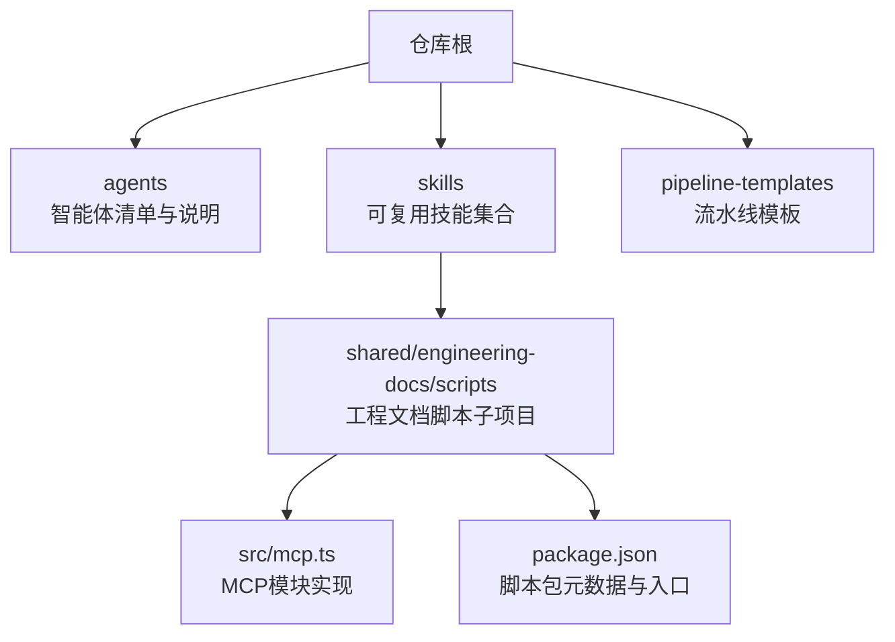
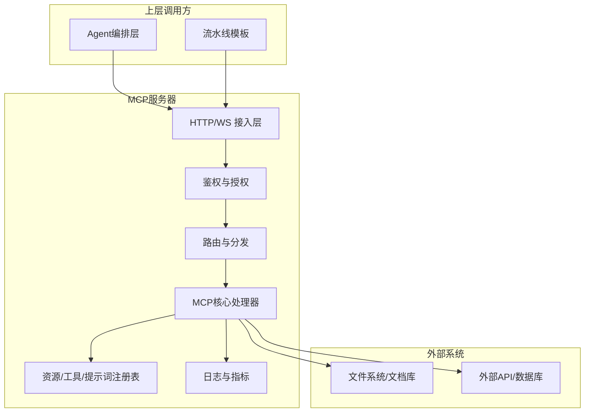
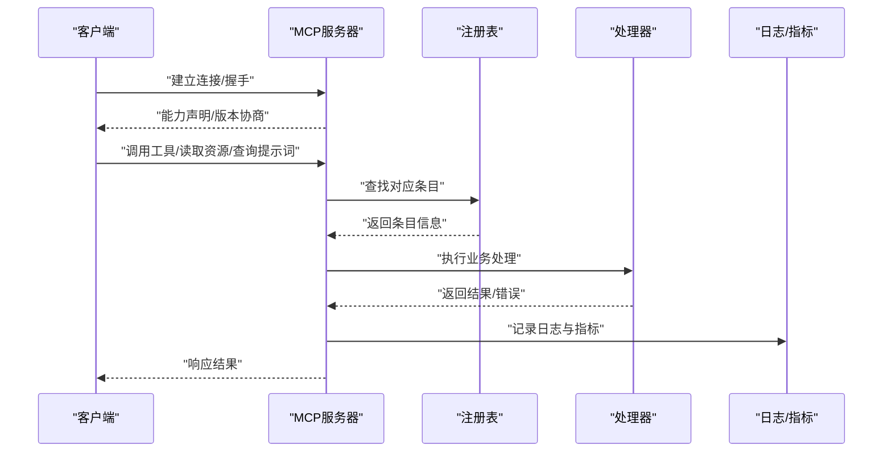
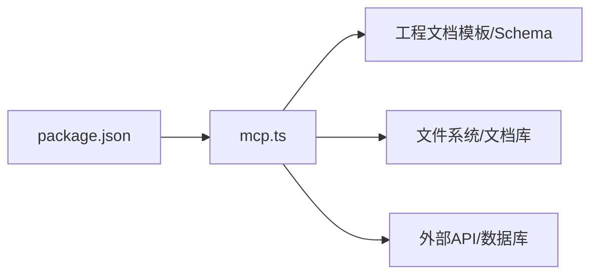

# MCP服务器接口

<cite>
**本文引用的文件**   
- [CLAUDE.MD](file://CLAUDE.MD)
- [AGENT-SKILL-MATRIX.md](file://AGENT-SKILL-MATRIX.md)
- [AGENTS.md](file://AGENTS.md)
- [agent-skill-matrix.yml](file://agent-skill-matrix.yml)
- [dir-graph.yaml](file://dir-graph.yaml)
- [pipeline-templates/README.md](file://pipeline-templates/README.md)
- [skills/shared/engineering-docs/scripts/src/mcp.ts](file://skills/shared/engineering-docs/scripts/src/mcp.ts)
- [skills/shared/engineering-docs/scripts/package.json](file://skills/shared/engineering-docs/scripts/package.json)
</cite>

## 目录
1. [简介](#简介)
2. [项目结构](#项目结构)
3. [核心组件](#核心组件)
4. [架构总览](#架构总览)
5. [详细组件分析](#详细组件分析)
6. [依赖关系分析](#依赖关系分析)
7. [性能考虑](#性能考虑)
8. [故障排查指南](#故障排查指南)
9. [结论](#结论)
10. [附录](#附录)

## 简介
本技术文档面向MCP（Model Context Protocol）服务器的实现与集成，聚焦以下目标：
- 说明MCP协议在本仓库中的实现方式与消息格式规范
- 介绍服务器启动配置、连接管理与生命周期控制
- 解释API端点的请求/响应格式与参数定义
- 提供客户端集成的代码示例与最佳实践
- 说明错误处理机制与异常情况的处理方式
- 给出安全认证、权限控制与访问限制的配置方法
- 提供性能监控与调试工具的使用方法

由于当前仓库以工程化模板、技能与脚本为主，MCP相关实现集中在“共享工程文档”脚本子项目中。下文将围绕该子项目的MCP模块进行系统化说明，并结合仓库顶层的Agent与流水线模板，给出端到端的集成视角。

## 项目结构
仓库采用“按能力域组织”的结构：agents、skills、pipeline-templates等目录分别承载智能体描述、可复用技能与流水线模板。MCP服务器相关实现位于共享工程文档脚本子项目中，其入口与注册逻辑由脚本包管理。

图表来源
- [dir-graph.yaml](file://dir-graph.yaml)
- [skills/shared/engineering-docs/scripts/src/mcp.ts](file://skills/shared/engineering-docs/scripts/src/mcp.ts)
- [skills/shared/engineering-docs/scripts/package.json](file://skills/shared/engineering-docs/scripts/package.json)

章节来源
- [dir-graph.yaml](file://dir-graph.yaml)
- [skills/shared/engineering-docs/scripts/src/mcp.ts](file://skills/shared/engineering-docs/scripts/src/mcp.ts)
- [skills/shared/engineering-docs/scripts/package.json](file://skills/shared/engineering-docs/scripts/package.json)

## 核心组件
- MCP模块实现：负责MCP协议的编解码、消息路由、资源/工具/提示词发现与调用、会话上下文管理等。
- 脚本包入口：通过脚本包元数据暴露CLI或库入口，用于启动MCP服务或作为库被其他流程引用。
- 工程文档标准与模板：为MCP提供的工具与资源提供结构化输入输出约束，确保跨Agent与流水线的一致性。

章节来源
- [skills/shared/engineering-docs/scripts/src/mcp.ts](file://skills/shared/engineering-docs/scripts/src/mcp.ts)
- [skills/shared/engineering-docs/scripts/package.json](file://skills/shared/engineering-docs/scripts/package.json)
- [skills/shared/engineering-docs/SKILL.md](file://skills/shared/engineering-docs/SKILL.md)

## 架构总览
下图展示MCP服务器在工程文档体系中的位置与交互关系：上层Agent与流水线模板通过MCP协议访问工程文档相关的工具与资源；MCP模块负责协议适配、鉴权、限流、日志与指标上报。

图表来源
- [skills/shared/engineering-docs/scripts/src/mcp.ts](file://skills/shared/engineering-docs/scripts/src/mcp.ts)
- [skills/shared/engineering-docs/scripts/package.json](file://skills/shared/engineering-docs/scripts/package.json)

## 详细组件分析

### MCP模块（mcp.ts）
- 职责边界
  - 协议适配：解析MCP请求、构造响应、处理通知与错误帧
  - 资源/工具/提示词：动态发现、校验、缓存与调用
  - 会话与上下文：维护调用链、追踪ID、超时与重试策略
  - 安全与治理：鉴权、授权、限流、审计日志与指标
- 关键流程
  - 启动：加载配置、初始化注册表、启动网络监听
  - 连接：握手、版本协商、能力声明
  - 请求处理：鉴权→路由→参数校验→执行→结果序列化→返回
  - 关闭：优雅停机、清理资源、持久化状态

图表来源
- [skills/shared/engineering-docs/scripts/src/mcp.ts](file://skills/shared/engineering-docs/scripts/src/mcp.ts)

章节来源
- [skills/shared/engineering-docs/scripts/src/mcp.ts](file://skills/shared/engineering-docs/scripts/src/mcp.ts)

### 脚本包入口（package.json）
- 作用
  - 定义脚本包的名称、版本、入口点与依赖
  - 暴露CLI命令或库导出，便于在流水线或Agent中直接调用
- 使用建议
  - 在CI/CD中通过包管理器安装并执行脚本
  - 在Agent侧以库形式引入，按需调用MCP函数

章节来源
- [skills/shared/engineering-docs/scripts/package.json](file://skills/shared/engineering-docs/scripts/package.json)

### 工程文档标准与模板（SKILL.md及相关模板）
- 作用
  - 定义文档结构、字段约束与命名规范
  - 为MCP工具提供一致的输入/输出Schema，降低集成成本
- 与MCP的关系
  - MCP工具基于这些Schema对输入进行校验与转换
  - 模板驱动生成器与验证器保证产出质量

章节来源
- [skills/shared/engineering-docs/SKILL.md](file://skills/shared/engineering-docs/SKILL.md)

## 依赖关系分析
- 内部依赖
  - mcp.ts 依赖脚本包入口导出的配置与注册表
  - 工程文档模板为工具与资源的输入输出提供约束
- 外部依赖
  - 文件系统/文档库：读写工程文档与产物
  - 外部API/数据库：获取上下文或回写结果
- 耦合与内聚
  - MCP模块高内聚于协议与调度，低耦合于具体业务处理器
  - 注册表集中管理资源/工具/提示词，提升扩展性

图表来源
- [skills/shared/engineering-docs/scripts/package.json](file://skills/shared/engineering-docs/scripts/package.json)
- [skills/shared/engineering-docs/scripts/src/mcp.ts](file://skills/shared/engineering-docs/scripts/src/mcp.ts)

章节来源
- [skills/shared/engineering-docs/scripts/package.json](file://skills/shared/engineering-docs/scripts/package.json)
- [skills/shared/engineering-docs/scripts/src/mcp.ts](file://skills/shared/engineering-docs/scripts/src/mcp.ts)

## 性能考虑
- 连接池与会话复用：减少握手开销，提高吞吐
- 资源与工具注册表缓存：避免重复解析与构建
- 批处理与分页：大文档与列表类操作支持分页与批量
- 超时与重试：合理设置超时、退避与熔断策略
- 异步与并发：I/O密集型操作采用异步非阻塞模型
- 指标与采样：采集延迟、错误率、QPS等关键指标，支持采样与聚合

[本节为通用指导，不直接分析具体文件]

## 故障排查指南
- 常见问题定位
  - 握手失败：检查版本协商与能力声明是否匹配
  - 鉴权失败：确认令牌/凭据有效性与权限范围
  - 路由未命中：核对资源/工具/提示词注册是否正确
  - 参数校验失败：对照Schema检查必填项与类型
  - 超时与重试：查看日志中的错误码与堆栈，调整阈值
- 诊断手段
  - 开启详细日志与Trace ID，关联上下游调用
  - 启用指标面板，观察P95/P99延迟与错误率
  - 使用回放与沙箱环境复现问题

章节来源
- [skills/shared/engineering-docs/scripts/src/mcp.ts](file://skills/shared/engineering-docs/scripts/src/mcp.ts)

## 结论
本仓库的MCP服务器实现集中于工程文档脚本子项目，围绕协议适配、资源/工具/提示词注册与调用、安全与治理等方面提供了可扩展的基础设施。结合Agent与流水线模板，可在工程文档全生命周期中稳定地提供结构化能力。建议在集成时遵循Schema约束、完善鉴权与限流、完善日志与指标，以获得更好的稳定性与可观测性。

[本节为总结性内容，不直接分析具体文件]

## 附录

### 启动与配置要点
- 启动方式
  - 通过脚本包入口运行MCP服务
  - 在流水线中作为步骤调用
- 关键配置项
  - 监听地址与端口
  - 鉴权方式与密钥来源
  - 注册表路径与缓存策略
  - 日志级别与输出目标
  - 超时、重试与限流参数

章节来源
- [skills/shared/engineering-docs/scripts/package.json](file://skills/shared/engineering-docs/scripts/package.json)
- [skills/shared/engineering-docs/scripts/src/mcp.ts](file://skills/shared/engineering-docs/scripts/src/mcp.ts)

### 连接管理与生命周期
- 连接管理
  - 握手与能力协商
  - 心跳与健康检查
  - 断线重连与幂等处理
- 生命周期
  - 启动：加载配置、初始化注册表、启动监听
  - 运行：处理请求、更新指标、持久化状态
  - 关闭：优雅停机、释放资源、保存上下文

章节来源
- [skills/shared/engineering-docs/scripts/src/mcp.ts](file://skills/shared/engineering-docs/scripts/src/mcp.ts)

### API端点与消息格式
- 端点分类
  - 工具调用：统一入口，按工具名路由
  - 资源读取：按资源标识定位与返回
  - 提示词查询：按名称与参数检索
- 消息格式
  - 请求：包含方法、参数、上下文与追踪信息
  - 响应：包含结果、错误码与附加信息
  - 错误：标准化错误对象，含错误码、消息与详情
- 参数校验
  - 基于Schema进行强校验
  - 缺失必填项或类型不符时返回明确错误

章节来源
- [skills/shared/engineering-docs/scripts/src/mcp.ts](file://skills/shared/engineering-docs/scripts/src/mcp.ts)

### 客户端集成示例与最佳实践
- 集成步骤
  - 安装脚本包或引入库
  - 配置连接参数与鉴权信息
  - 调用工具/读取资源/查询提示词
  - 处理成功与错误分支
- 最佳实践
  - 使用连接池与会话复用
  - 实现重试与退避
  - 记录Trace ID以便链路追踪
  - 对大对象进行分页与压缩

章节来源
- [skills/shared/engineering-docs/scripts/package.json](file://skills/shared/engineering-docs/scripts/package.json)
- [skills/shared/engineering-docs/scripts/src/mcp.ts](file://skills/shared/engineering-docs/scripts/src/mcp.ts)

### 安全认证、权限控制与访问限制
- 认证
  - 支持令牌/证书等方式
  - 建议启用传输加密
- 授权
  - 基于角色/资源的细粒度控制
  - 最小权限原则
- 访问限制
  - 速率限制与配额
  - IP白名单与域名校验
  - 审计日志与告警

章节来源
- [skills/shared/engineering-docs/scripts/src/mcp.ts](file://skills/shared/engineering-docs/scripts/src/mcp.ts)

### 性能监控与调试工具
- 监控指标
  - QPS、延迟分布、错误率、资源占用
- 调试工具
  - 详细日志与Trace
  - 交互式控制台与回放
  - 压测与混沌测试

章节来源
- [skills/shared/engineering-docs/scripts/src/mcp.ts](file://skills/shared/engineering-docs/scripts/src/mcp.ts)

### 与Agent和流水线的集成
- Agent集成
  - 通过MCP工具与资源增强Agent能力
  - 结合Agent技能矩阵进行编排
- 流水线集成
  - 在流水线模板中调用MCP服务完成文档生成与校验
  - 将产物回写到文档库或版本库

章节来源
- [AGENTS.md](file://AGENTS.md)
- [AGENT-SKILL-MATRIX.md](file://AGENT-SKILL-MATRIX.md)
- [agent-skill-matrix.yml](file://agent-skill-matrix.yml)
- [pipeline-templates/README.md](file://pipeline-templates/README.md)