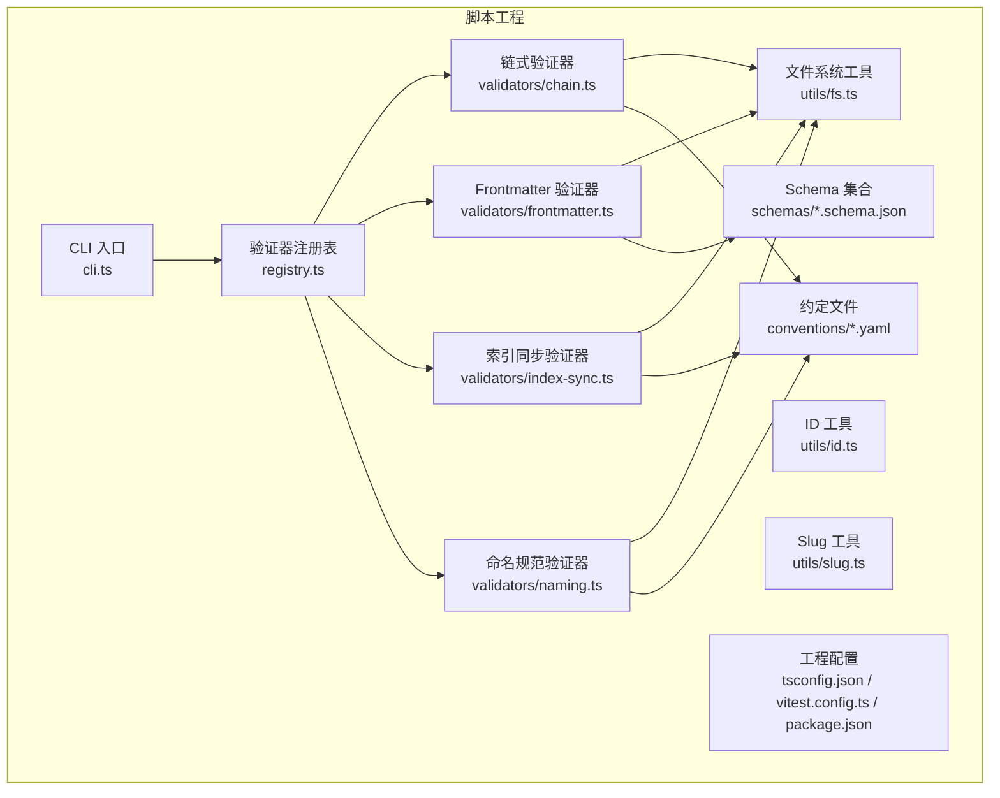
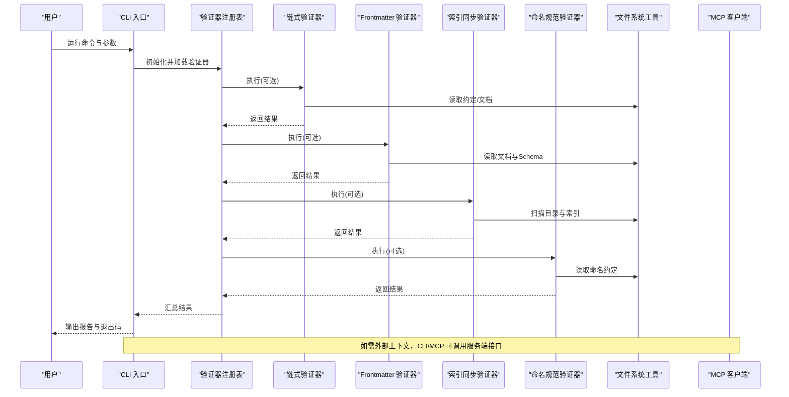
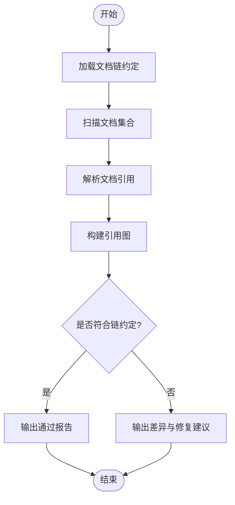
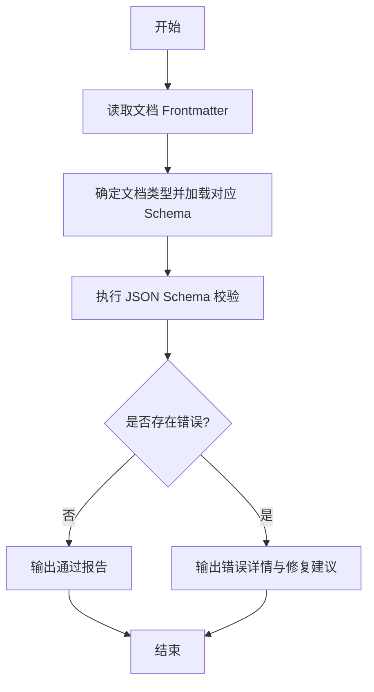
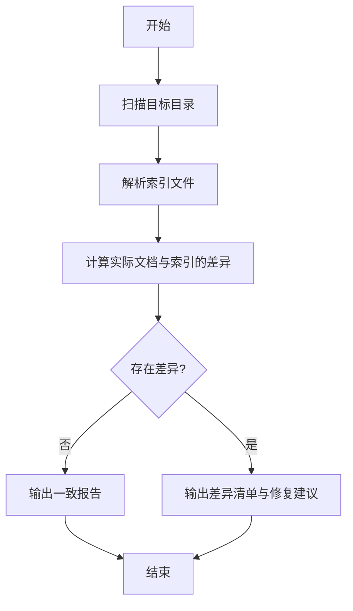
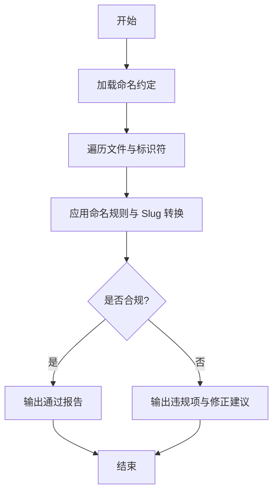
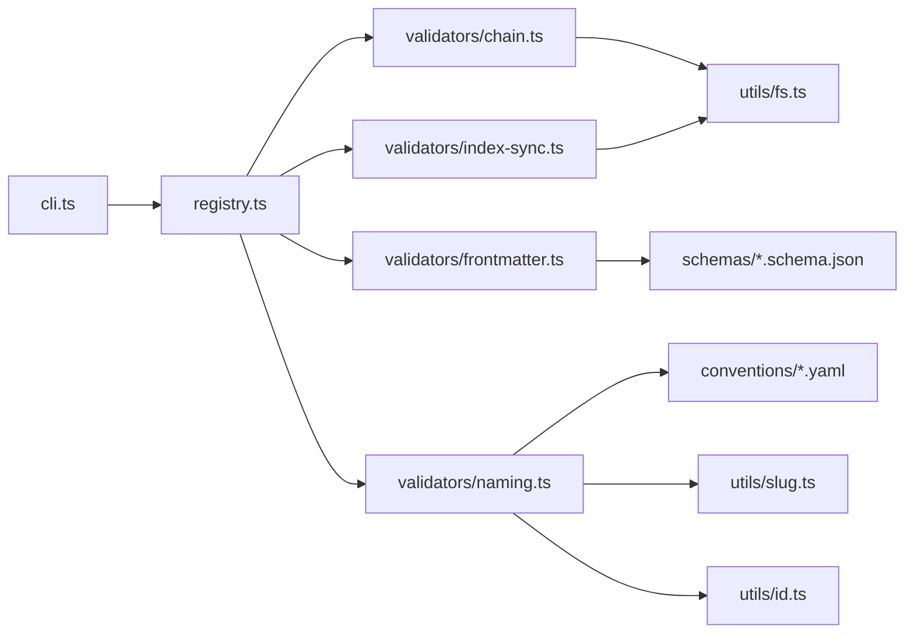

# 文档验证工具

<cite>
**本文引用的文件**   
- [cli.ts](file://skills/shared/engineering-docs/scripts/src/cli.ts)
- [mcp.ts](file://skills/shared/engineering-docs/scripts/src/mcp.ts)
- [registry.ts](file://skills/shared/engineering-docs/scripts/src/registry.ts)
- [chain.ts](file://skills/shared/engineering-docs/scripts/src/validators/chain.ts)
- [frontmatter.ts](file://skills/shared/engineering-docs/scripts/src/validators/frontmatter.ts)
- [index-sync.ts](file://skills/shared/engineering-docs/scripts/src/validators/index-sync.ts)
- [naming.ts](file://skills/shared/engineering-docs/scripts/src/validators/naming.ts)
- [fs.ts](file://skills/shared/engineering-docs/scripts/src/utils/fs.ts)
- [id.ts](file://skills/shared/engineering-docs/scripts/src/utils/id.ts)
- [slug.ts](file://skills/shared/engineering-docs/scripts/src/utils/slug.ts)
- [package.json](file://skills/shared/engineering-docs/scripts/package.json)
- [tsconfig.json](file://skills/shared/engineering-docs/scripts/tsconfig.json)
- [vitest.config.ts](file://skills/shared/engineering-docs/scripts/vitest.config.ts)
- [doc-chain.yaml](file://skills/shared/engineering-docs/scripts/src/utils/conventions/doc-chain.yaml)
- [naming.yaml](file://skills/shared/engineering-docs/scripts/src/utils/conventions/naming.yaml)
- [common-defs.schema.json](file://skills/shared/engineering-docs/scripts/src/utils/schemas/common-defs.schema.json)
- [prd.schema.json](file://skills/shared/engineering-docs/scripts/src/utils/schemas/prd.schema.json)
- [plan.schema.json](file://skills/shared/engineering-docs/scripts/src/utils/schemas/plan.schema.json)
- [sdd.schema.json](file://skills/shared/engineering-docs/scripts/src/utils/schemas/sdd.schema.json)
- [task.schema.json](file://skills/shared/engineering-docs/scripts/src/utils/schemas/task.schema.json)
- [release.schema.json](file://skills/shared/engineering-docs/scripts/src/utils/schemas/release.schema.json)
- [form.schema.json](file://skills/shared/engineering-docs/scripts/src/utils/schemas/form.schema.json)
- [module.schema.json](file://skills/shared/engineering-docs/scripts/src/utils/schemas/module.schema.json)
</cite>

## 目录
1. [简介](#简介)
2. [项目结构](#项目结构)
3. [核心组件](#核心组件)
4. [架构总览](#架构总览)
5. [详细组件分析](#详细组件分析)
6. [依赖关系分析](#依赖关系分析)
7. [性能考虑](#性能考虑)
8. [故障排查指南](#故障排查指南)
9. [结论](#结论)
10. [附录](#附录)

## 简介
本技术文档面向“文档验证工具”的开发者与使用者，系统性说明 CLI 命令用法、参数配置与执行流程；阐述 MCP 服务器接口的集成方式与消息格式；深入解析链式验证、Frontmatter 校验、索引同步校验、命名规范校验等验证器的实现原理；提供规则自定义与扩展方法；并给出错误信息解读、故障排查、性能优化与批量处理最佳实践，以及 CI/CD 集成示例。

## 项目结构
该工具位于 skills/shared/engineering-docs/scripts 目录下，采用 TypeScript 工程组织，包含：
- CLI 入口与命令解析
- MCP 客户端与服务通信
- 验证器注册表与调度
- 具体验证器实现（链式、Frontmatter、索引同步、命名规范）
- 通用工具（文件系统、ID、Slug）
- 约定与 Schema 定义（命名、文档链、JSON Schema）
- 测试与构建配置

图表来源
- [cli.ts](file://skills/shared/engineering-docs/scripts/src/cli.ts)
- [registry.ts](file://skills/shared/engineering-docs/scripts/src/registry.ts)
- [chain.ts](file://skills/shared/engineering-docs/scripts/src/validators/chain.ts)
- [frontmatter.ts](file://skills/shared/engineering-docs/scripts/src/validators/frontmatter.ts)
- [index-sync.ts](file://skills/shared/engineering-docs/scripts/src/validators/index-sync.ts)
- [naming.ts](file://skills/shared/engineering-docs/scripts/src/validators/naming.ts)
- [fs.ts](file://skills/shared/engineering-docs/scripts/src/utils/fs.ts)
- [id.ts](file://skills/shared/engineering-docs/scripts/src/utils/id.ts)
- [slug.ts](file://skills/shared/engineering-docs/scripts/src/utils/slug.ts)
- [common-defs.schema.json](file://skills/shared/engineering-docs/scripts/src/utils/schemas/common-defs.schema.json)
- [prd.schema.json](file://skills/shared/engineering-docs/scripts/src/utils/schemas/prd.schema.json)
- [plan.schema.json](file://skills/shared/engineering-docs/scripts/src/utils/schemas/plan.schema.json)
- [sdd.schema.json](file://skills/shared/engineering-docs/scripts/src/utils/schemas/sdd.schema.json)
- [task.schema.json](file://skills/shared/engineering-docs/scripts/src/utils/schemas/task.schema.json)
- [release.schema.json](file://skills/shared/engineering-docs/scripts/src/utils/schemas/release.schema.json)
- [form.schema.json](file://skills/shared/engineering-docs/scripts/src/utils/schemas/form.schema.json)
- [module.schema.json](file://skills/shared/engineering-docs/scripts/src/utils/schemas/module.schema.json)
- [doc-chain.yaml](file://skills/shared/engineering-docs/scripts/src/utils/conventions/doc-chain.yaml)
- [naming.yaml](file://skills/shared/engineering-docs/scripts/src/utils/conventions/naming.yaml)
- [tsconfig.json](file://skills/shared/engineering-docs/scripts/tsconfig.json)
- [vitest.config.ts](file://skills/shared/engineering-docs/scripts/vitest.config.ts)
- [package.json](file://skills/shared/engineering-docs/scripts/package.json)

章节来源
- [cli.ts](file://skills/shared/engineering-docs/scripts/src/cli.ts)
- [registry.ts](file://skills/shared/engineering-docs/scripts/src/registry.ts)
- [chain.ts](file://skills/shared/engineering-docs/scripts/src/validators/chain.ts)
- [frontmatter.ts](file://skills/shared/engineering-docs/scripts/src/validators/frontmatter.ts)
- [index-sync.ts](file://skills/shared/engineering-docs/scripts/src/validators/index-sync.ts)
- [naming.ts](file://skills/shared/engineering-docs/scripts/src/validators/naming.ts)
- [fs.ts](file://skills/shared/engineering-docs/scripts/src/utils/fs.ts)
- [id.ts](file://skills/shared/engineering-docs/scripts/src/utils/id.ts)
- [slug.ts](file://skills/shared/engineering-docs/scripts/src/utils/slug.ts)
- [common-defs.schema.json](file://skills/shared/engineering-docs/scripts/src/utils/schemas/common-defs.schema.json)
- [prd.schema.json](file://skills/shared/engineering-docs/scripts/src/utils/schemas/prd.schema.json)
- [plan.schema.json](file://skills/shared/engineering-docs/scripts/src/utils/schemas/plan.schema.json)
- [sdd.schema.json](file://skills/shared/engineering-docs/scripts/src/utils/schemas/sdd.schema.json)
- [task.schema.json](file://skills/shared/engineering-docs/scripts/src/utils/schemas/task.schema.json)
- [release.schema.json](file://skills/shared/engineering-docs/scripts/src/utils/schemas/release.schema.json)
- [form.schema.json](file://skills/shared/engineering-docs/scripts/src/utils/schemas/form.schema.json)
- [module.schema.json](file://skills/shared/engineering-docs/scripts/src/utils/schemas/module.schema.json)
- [doc-chain.yaml](file://skills/shared/engineering-docs/scripts/src/utils/conventions/doc-chain.yaml)
- [naming.yaml](file://skills/shared/engineering-docs/scripts/src/utils/conventions/naming.yaml)
- [tsconfig.json](file://skills/shared/engineering-docs/scripts/tsconfig.json)
- [vitest.config.ts](file://skills/shared/engineering-docs/scripts/vitest.config.ts)
- [package.json](file://skills/shared/engineering-docs/scripts/package.json)

## 核心组件
- CLI 入口：负责命令行参数解析、子命令分发、输出格式化与退出码控制。
- 注册表：集中管理验证器实例，支持按名称启用/禁用、顺序执行与结果聚合。
- 验证器族：
  - 链式验证器：基于文档链约定进行引用一致性检查。
  - Frontmatter 验证器：基于 JSON Schema 对文档元数据进行类型与约束校验。
  - 索引同步验证器：确保目录索引与实际文档集合一致。
  - 命名规范验证器：依据命名约定校验文件名与标识符。
- 工具库：文件系统遍历、ID 生成、Slug 转换等基础能力。
- 约定与 Schema：命名规则、文档链规则与各类文档类型的 JSON Schema。

章节来源
- [cli.ts](file://skills/shared/engineering-docs/scripts/src/cli.ts)
- [registry.ts](file://skills/shared/engineering-docs/scripts/src/registry.ts)
- [chain.ts](file://skills/shared/engineering-docs/scripts/src/validators/chain.ts)
- [frontmatter.ts](file://skills/shared/engineering-docs/scripts/src/validators/frontmatter.ts)
- [index-sync.ts](file://skills/shared/engineering-docs/scripts/src/validators/index-sync.ts)
- [naming.ts](file://skills/shared/engineering-docs/scripts/src/validators/naming.ts)
- [fs.ts](file://skills/shared/engineering-docs/scripts/src/utils/fs.ts)
- [id.ts](file://skills/shared/engineering-docs/scripts/src/utils/id.ts)
- [slug.ts](file://skills/shared/engineering-docs/scripts/src/utils/slug.ts)
- [common-defs.schema.json](file://skills/shared/engineering-docs/scripts/src/utils/schemas/common-defs.schema.json)
- [prd.schema.json](file://skills/shared/engineering-docs/scripts/src/utils/schemas/prd.schema.json)
- [plan.schema.json](file://skills/shared/engineering-docs/scripts/src/utils/schemas/plan.schema.json)
- [sdd.schema.json](file://skills/shared/engineering-docs/scripts/src/utils/schemas/sdd.schema.json)
- [task.schema.json](file://skills/shared/engineering-docs/scripts/src/utils/schemas/task.schema.json)
- [release.schema.json](file://skills/shared/engineering-docs/scripts/src/utils/schemas/release.schema.json)
- [form.schema.json](file://skills/shared/engineering-docs/scripts/src/utils/schemas/form.schema.json)
- [module.schema.json](file://skills/shared/engineering-docs/scripts/src/utils/schemas/module.schema.json)
- [doc-chain.yaml](file://skills/shared/engineering-docs/scripts/src/utils/conventions/doc-chain.yaml)
- [naming.yaml](file://skills/shared/engineering-docs/scripts/src/utils/conventions/naming.yaml)

## 架构总览
整体架构围绕“命令驱动 + 验证器注册表 + 可插拔验证器”展开。CLI 解析用户输入后，从注册表加载启用的验证器，依次执行并将结果汇总输出。MCP 客户端用于与外部服务交互，以获取或推送上下文数据。

图表来源
- [cli.ts](file://skills/shared/engineering-docs/scripts/src/cli.ts)
- [registry.ts](file://skills/shared/engineering-docs/scripts/src/registry.ts)
- [chain.ts](file://skills/shared/engineering-docs/scripts/src/validators/chain.ts)
- [frontmatter.ts](file://skills/shared/engineering-docs/scripts/src/validators/frontmatter.ts)
- [index-sync.ts](file://skills/shared/engineering-docs/scripts/src/validators/index-sync.ts)
- [naming.ts](file://skills/shared/engineering-docs/scripts/src/validators/naming.ts)
- [fs.ts](file://skills/shared/engineering-docs/scripts/src/utils/fs.ts)
- [mcp.ts](file://skills/shared/engineering-docs/scripts/src/mcp.ts)

## 详细组件分析

### CLI 入口与命令用法
- 功能要点
  - 解析全局选项与子命令
  - 根据子命令选择要执行的验证器组合
  - 收集各验证器结果，统一格式化输出
  - 设置进程退出码以便在自动化环境中使用
- 典型用法
  - 运行全部验证器：通过默认子命令或显式指定所有验证器
  - 仅运行部分验证器：通过子命令或参数过滤
  - 指定工作目录与输出格式：通过全局选项
  - 调试模式：开启详细日志便于定位问题
- 关键路径参考
  - 命令解析与分发逻辑：[cli.ts](file://skills/shared/engineering-docs/scripts/src/cli.ts)
  - 验证器注册与执行：[registry.ts](file://skills/shared/engineering-docs/scripts/src/registry.ts)

章节来源
- [cli.ts](file://skills/shared/engineering-docs/scripts/src/cli.ts)
- [registry.ts](file://skills/shared/engineering-docs/scripts/src/registry.ts)

### MCP 服务器接口集成
- 角色定位
  - 作为客户端与外部服务通信，拉取或写入与文档相关的上下文数据（如模板、规则、历史变更等）。
- 消息格式
  - 请求/响应遵循标准 MCP 协议的消息结构，包含方法名、参数与返回值。
  - 常见方法包括：获取规则、获取模板、提交校验结果等。
- 集成方式
  - 在需要外部上下文的验证器中按需调用 MCP 客户端。
  - 失败重试与超时控制应在客户端层实现。
- 关键路径参考
  - MCP 客户端封装与调用：[mcp.ts](file://skills/shared/engineering-docs/scripts/src/mcp.ts)

章节来源
- [mcp.ts](file://skills/shared/engineering-docs/scripts/src/mcp.ts)

### 验证器注册表
- 设计目标
  - 统一管理验证器生命周期，支持动态启用/禁用、顺序执行与结果聚合。
- 主要职责
  - 注册与查找验证器
  - 根据 CLI 参数筛选待执行验证器
  - 串行或并行执行（取决于实现），汇总错误与警告
- 关键路径参考
  - 注册表实现：[registry.ts](file://skills/shared/engineering-docs/scripts/src/registry.ts)

章节来源
- [registry.ts](file://skills/shared/engineering-docs/scripts/src/registry.ts)

### 链式验证器（文档链一致性）
- 目标
  - 依据文档链约定，校验文档间的引用关系是否完整、正确。
- 输入与依赖
  - 读取约定文件（如 doc-chain.yaml）
  - 遍历文档树，解析引用节点
- 处理流程
  - 加载约定 → 扫描文档 → 解析引用 → 比对期望链 → 产出差异报告
- 关键路径参考
  - 链式验证实现：[chain.ts](file://skills/shared/engineering-docs/scripts/src/validators/chain.ts)
  - 约定文件：[doc-chain.yaml](file://skills/shared/engineering-docs/scripts/src/utils/conventions/doc-chain.yaml)
  - 文件系统工具：[fs.ts](file://skills/shared/engineering-docs/scripts/src/utils/fs.ts)

图表来源
- [chain.ts](file://skills/shared/engineering-docs/scripts/src/validators/chain.ts)
- [doc-chain.yaml](file://skills/shared/engineering-docs/scripts/src/utils/conventions/doc-chain.yaml)
- [fs.ts](file://skills/shared/engineering-docs/scripts/src/utils/fs.ts)

章节来源
- [chain.ts](file://skills/shared/engineering-docs/scripts/src/validators/chain.ts)
- [doc-chain.yaml](file://skills/shared/engineering-docs/scripts/src/utils/conventions/doc-chain.yaml)
- [fs.ts](file://skills/shared/engineering-docs/scripts/src/utils/fs.ts)

### Frontmatter 验证器（元数据校验）
- 目标
  - 基于 JSON Schema 对文档 Frontmatter 字段进行类型、必填项与业务约束校验。
- 输入与依赖
  - 文档 Frontmatter 内容
  - 对应文档类型的 JSON Schema（如 prd.schema.json、plan.schema.json 等）
- 处理流程
  - 解析 Frontmatter → 匹配 Schema → 校验字段 → 汇总错误
- 关键路径参考
  - Frontmatter 验证实现：[frontmatter.ts](file://skills/shared/engineering-docs/scripts/src/validators/frontmatter.ts)
  - 公共定义 Schema：[common-defs.schema.json](file://skills/shared/engineering-docs/scripts/src/utils/schemas/common-defs.schema.json)
  - PRD Schema：[prd.schema.json](file://skills/shared/engineering-docs/scripts/src/utils/schemas/prd.schema.json)
  - Plan Schema：[plan.schema.json](file://skills/shared/engineering-docs/scripts/src/utils/schemas/plan.schema.json)
  - SDD Schema：[sdd.schema.json](file://skills/shared/engineering-docs/scripts/src/utils/schemas/sdd.schema.json)
  - Task Schema：[task.schema.json](file://skills/shared/engineering-docs/scripts/src/utils/schemas/task.schema.json)
  - Release Schema：[release.schema.json](file://skills/shared/engineering-docs/scripts/src/utils/schemas/release.schema.json)
  - Form Schema：[form.schema.json](file://skills/shared/engineering-docs/scripts/src/utils/schemas/form.schema.json)
  - Module Schema：[module.schema.json](file://skills/shared/engineering-docs/scripts/src/utils/schemas/module.schema.json)

图表来源
- [frontmatter.ts](file://skills/shared/engineering-docs/scripts/src/validators/frontmatter.ts)
- [common-defs.schema.json](file://skills/shared/engineering-docs/scripts/src/utils/schemas/common-defs.schema.json)
- [prd.schema.json](file://skills/shared/engineering-docs/scripts/src/utils/schemas/prd.schema.json)
- [plan.schema.json](file://skills/shared/engineering-docs/scripts/src/utils/schemas/plan.schema.json)
- [sdd.schema.json](file://skills/shared/engineering-docs/scripts/src/utils/schemas/sdd.schema.json)
- [task.schema.json](file://skills/shared/engineering-docs/scripts/src/utils/schemas/task.schema.json)
- [release.schema.json](file://skills/shared/engineering-docs/scripts/src/utils/schemas/release.schema.json)
- [form.schema.json](file://skills/shared/engineering-docs/scripts/src/utils/schemas/form.schema.json)
- [module.schema.json](file://skills/shared/engineering-docs/scripts/src/utils/schemas/module.schema.json)

章节来源
- [frontmatter.ts](file://skills/shared/engineering-docs/scripts/src/validators/frontmatter.ts)
- [common-defs.schema.json](file://skills/shared/engineering-docs/scripts/src/utils/schemas/common-defs.schema.json)
- [prd.schema.json](file://skills/shared/engineering-docs/scripts/src/utils/schemas/prd.schema.json)
- [plan.schema.json](file://skills/shared/engineering-docs/scripts/src/utils/schemas/plan.schema.json)
- [sdd.schema.json](file://skills/shared/engineering-docs/scripts/src/utils/schemas/sdd.schema.json)
- [task.schema.json](file://skills/shared/engineering-docs/scripts/src/utils/schemas/task.schema.json)
- [release.schema.json](file://skills/shared/engineering-docs/scripts/src/utils/schemas/release.schema.json)
- [form.schema.json](file://skills/shared/engineering-docs/scripts/src/utils/schemas/form.schema.json)
- [module.schema.json](file://skills/shared/engineering-docs/scripts/src/utils/schemas/module.schema.json)

### 索引同步验证器（目录索引一致性）
- 目标
  - 确保目录下的索引文件与实际文档集合保持一致，避免遗漏或冗余。
- 输入与依赖
  - 目录结构与索引文件
  - 文件系统工具用于遍历与对比
- 处理流程
  - 扫描目录 → 解析索引 → 计算差集 → 输出不一致清单
- 关键路径参考
  - 索引同步验证实现：[index-sync.ts](file://skills/shared/engineering-docs/scripts/src/validators/index-sync.ts)
  - 文件系统工具：[fs.ts](file://skills/shared/engineering-docs/scripts/src/utils/fs.ts)

图表来源
- [index-sync.ts](file://skills/shared/engineering-docs/scripts/src/validators/index-sync.ts)
- [fs.ts](file://skills/shared/engineering-docs/scripts/src/utils/fs.ts)

章节来源
- [index-sync.ts](file://skills/shared/engineering-docs/scripts/src/validators/index-sync.ts)
- [fs.ts](file://skills/shared/engineering-docs/scripts/src/utils/fs.ts)

### 命名规范验证器（命名约定）
- 目标
  - 依据命名约定校验文件名、标识符与 Slug 等是否符合团队规范。
- 输入与依赖
  - 命名约定文件（如 naming.yaml）
  - 文件系统工具与 Slug 工具
- 处理流程
  - 加载命名约定 → 遍历文件/标识符 → 应用规则 → 输出违规项
- 关键路径参考
  - 命名规范验证实现：[naming.ts](file://skills/shared/engineering-docs/scripts/src/validators/naming.ts)
  - 命名约定：[naming.yaml](file://skills/shared/engineering-docs/scripts/src/utils/conventions/naming.yaml)
  - Slug 工具：[slug.ts](file://skills/shared/engineering-docs/scripts/src/utils/slug.ts)
  - ID 工具：[id.ts](file://skills/shared/engineering-docs/scripts/src/utils/id.ts)
  - 文件系统工具：[fs.ts](file://skills/shared/engineering-docs/scripts/src/utils/fs.ts)

图表来源
- [naming.ts](file://skills/shared/engineering-docs/scripts/src/validators/naming.ts)
- [naming.yaml](file://skills/shared/engineering-docs/scripts/src/utils/conventions/naming.yaml)
- [slug.ts](file://skills/shared/engineering-docs/scripts/src/utils/slug.ts)
- [id.ts](file://skills/shared/engineering-docs/scripts/src/utils/id.ts)
- [fs.ts](file://skills/shared/engineering-docs/scripts/src/utils/fs.ts)

章节来源
- [naming.ts](file://skills/shared/engineering-docs/scripts/src/validators/naming.ts)
- [naming.yaml](file://skills/shared/engineering-docs/scripts/src/utils/conventions/naming.yaml)
- [slug.ts](file://skills/shared/engineering-docs/scripts/src/utils/slug.ts)
- [id.ts](file://skills/shared/engineering-docs/scripts/src/utils/id.ts)
- [fs.ts](file://skills/shared/engineering-docs/scripts/src/utils/fs.ts)

### 工具库与辅助模块
- 文件系统工具：提供目录遍历、文件读写、路径规范化等能力。
- ID 工具：生成稳定且可读的标识符，便于文档与任务关联。
- Slug 工具：将标题或标识符转换为 URL 友好的字符串。
- 关键路径参考
  - 文件系统工具：[fs.ts](file://skills/shared/engineering-docs/scripts/src/utils/fs.ts)
  - ID 工具：[id.ts](file://skills/shared/engineering-docs/scripts/src/utils/id.ts)
  - Slug 工具：[slug.ts](file://skills/shared/engineering-docs/scripts/src/utils/slug.ts)

章节来源
- [fs.ts](file://skills/shared/engineering-docs/scripts/src/utils/fs.ts)
- [id.ts](file://skills/shared/engineering-docs/scripts/src/utils/id.ts)
- [slug.ts](file://skills/shared/engineering-docs/scripts/src/utils/slug.ts)

## 依赖关系分析
- 内部依赖
  - CLI 依赖注册表与验证器
  - 验证器依赖工具库与约定/Schema
  - 注册表集中管理验证器生命周期
- 外部依赖
  - 构建与测试：TypeScript 编译、Vitest 测试框架
  - 包管理：pnpm/npm
- 关键路径参考
  - 工程配置：[tsconfig.json](file://skills/shared/engineering-docs/scripts/tsconfig.json)、[vitest.config.ts](file://skills/shared/engineering-docs/scripts/vitest.config.ts)、[package.json](file://skills/shared/engineering-docs/scripts/package.json)

图表来源
- [cli.ts](file://skills/shared/engineering-docs/scripts/src/cli.ts)
- [registry.ts](file://skills/shared/engineering-docs/scripts/src/registry.ts)
- [chain.ts](file://skills/shared/engineering-docs/scripts/src/validators/chain.ts)
- [frontmatter.ts](file://skills/shared/engineering-docs/scripts/src/validators/frontmatter.ts)
- [index-sync.ts](file://skills/shared/engineering-docs/scripts/src/validators/index-sync.ts)
- [naming.ts](file://skills/shared/engineering-docs/scripts/src/validators/naming.ts)
- [fs.ts](file://skills/shared/engineering-docs/scripts/src/utils/fs.ts)
- [slug.ts](file://skills/shared/engineering-docs/scripts/src/utils/slug.ts)
- [id.ts](file://skills/shared/engineering-docs/scripts/src/utils/id.ts)
- [common-defs.schema.json](file://skills/shared/engineering-docs/scripts/src/utils/schemas/common-defs.schema.json)
- [prd.schema.json](file://skills/shared/engineering-docs/scripts/src/utils/schemas/prd.schema.json)
- [plan.schema.json](file://skills/shared/engineering-docs/scripts/src/utils/schemas/plan.schema.json)
- [sdd.schema.json](file://skills/shared/engineering-docs/scripts/src/utils/schemas/sdd.schema.json)
- [task.schema.json](file://skills/shared/engineering-docs/scripts/src/utils/schemas/task.schema.json)
- [release.schema.json](file://skills/shared/engineering-docs/scripts/src/utils/schemas/release.schema.json)
- [form.schema.json](file://skills/shared/engineering-docs/scripts/src/utils/schemas/form.schema.json)
- [module.schema.json](file://skills/shared/engineering-docs/scripts/src/utils/schemas/module.schema.json)
- [doc-chain.yaml](file://skills/shared/engineering-docs/scripts/src/utils/conventions/doc-chain.yaml)
- [naming.yaml](file://skills/shared/engineering-docs/scripts/src/utils/conventions/naming.yaml)

章节来源
- [tsconfig.json](file://skills/shared/engineering-docs/scripts/tsconfig.json)
- [vitest.config.ts](file://skills/shared/engineering-docs/scripts/vitest.config.ts)
- [package.json](file://skills/shared/engineering-docs/scripts/package.json)

## 性能考虑
- 批量处理
  - 优先使用目录级扫描与增量校验，减少重复 I/O。
  - 对大型仓库可采用分片策略，按子目录并行执行验证器。
- 缓存与复用
  - 对约定与 Schema 的加载结果进行内存缓存，避免重复解析。
  - 对文件哈希或时间戳进行缓存，跳过未变更文件。
- 并发控制
  - 合理限制并发度，避免磁盘与网络瓶颈。
  - 对耗时操作（如 MCP 调用）增加超时与重试退避。
- 输出优化
  - 仅在必要时输出详细日志，生产环境默认精简输出。
  - 结构化输出（如 JSON）便于下游工具快速消费。

## 故障排查指南
- 常见问题
  - 命令无法识别：检查 CLI 参数与子命令拼写，确认已安装依赖。
  - 验证器未执行：确认注册表中已启用相应验证器，检查过滤条件。
  - Schema 校验失败：核对 Frontmatter 字段类型与必填项，参考对应 Schema。
  - 索引不一致：根据差异清单更新索引文件或补充缺失文档。
  - 命名违规：对照命名约定修正文件名与标识符。
- 定位步骤
  - 开启调试模式，查看详细日志与堆栈。
  - 单独运行单个验证器，缩小问题范围。
  - 检查约定与 Schema 版本是否与当前代码一致。
- 关键路径参考
  - CLI 与注册表：[cli.ts](file://skills/shared/engineering-docs/scripts/src/cli.ts)、[registry.ts](file://skills/shared/engineering-docs/scripts/src/registry.ts)
  - 验证器实现：[chain.ts](file://skills/shared/engineering-docs/scripts/src/validators/chain.ts)、[frontmatter.ts](file://skills/shared/engineering-docs/scripts/src/validators/frontmatter.ts)、[index-sync.ts](file://skills/shared/engineering-docs/scripts/src/validators/index-sync.ts)、[naming.ts](file://skills/shared/engineering-docs/scripts/src/validators/naming.ts)
  - 约定与 Schema：[doc-chain.yaml](file://skills/shared/engineering-docs/scripts/src/utils/conventions/doc-chain.yaml)、[naming.yaml](file://skills/shared/engineering-docs/scripts/src/utils/conventions/naming.yaml)、[common-defs.schema.json](file://skills/shared/engineering-docs/scripts/src/utils/schemas/common-defs.schema.json)

章节来源
- [cli.ts](file://skills/shared/engineering-docs/scripts/src/cli.ts)
- [registry.ts](file://skills/shared/engineering-docs/scripts/src/registry.ts)
- [chain.ts](file://skills/shared/engineering-docs/scripts/src/validators/chain.ts)
- [frontmatter.ts](file://skills/shared/engineering-docs/scripts/src/validators/frontmatter.ts)
- [index-sync.ts](file://skills/shared/engineering-docs/scripts/src/validators/index-sync.ts)
- [naming.ts](file://skills/shared/engineering-docs/scripts/src/validators/naming.ts)
- [doc-chain.yaml](file://skills/shared/engineering-docs/scripts/src/utils/conventions/doc-chain.yaml)
- [naming.yaml](file://skills/shared/engineering-docs/scripts/src/utils/conventions/naming.yaml)
- [common-defs.schema.json](file://skills/shared/engineering-docs/scripts/src/utils/schemas/common-defs.schema.json)

## 结论
本工具通过模块化验证器与注册表机制，提供了可扩展、可配置的文档质量保障能力。结合约定与 Schema，能够覆盖文档链一致性、元数据完整性、索引同步与命名规范等多维度校验。配合 CLI 与 MCP 集成，可在本地与 CI/CD 环境中高效落地。

## 附录

### CLI 命令与参数速查
- 全局选项
  - 工作目录：指定文档根目录
  - 输出格式：文本或结构化（如 JSON）
  - 调试开关：开启详细日志
- 子命令
  - 全量验证：执行所有已启用验证器
  - 单项验证：仅执行指定验证器（链式、Frontmatter、索引同步、命名规范）
- 退出码
  - 0：全部通过
  - 非 0：存在错误或警告（由策略决定）

章节来源
- [cli.ts](file://skills/shared/engineering-docs/scripts/src/cli.ts)
- [registry.ts](file://skills/shared/engineering-docs/scripts/src/registry.ts)

### 自定义与扩展验证规则
- 新增验证器
  - 在 validators 目录下创建新文件，实现统一的验证器接口（参考现有验证器）。
  - 在注册表中注册新验证器，并在 CLI 中暴露子命令或参数。
- 扩展约定与 Schema
  - 在 conventions 下新增或修改约定文件，影响链式与命名验证。
  - 在 schemas 下新增或扩展 JSON Schema，增强 Frontmatter 校验。
- 关键路径参考
  - 验证器实现参考：[chain.ts](file://skills/shared/engineering-docs/scripts/src/validators/chain.ts)、[frontmatter.ts](file://skills/shared/engineering-docs/scripts/src/validators/frontmatter.ts)、[index-sync.ts](file://skills/shared/engineering-docs/scripts/src/validators/index-sync.ts)、[naming.ts](file://skills/shared/engineering-docs/scripts/src/validators/naming.ts)
  - 约定与 Schema：[doc-chain.yaml](file://skills/shared/engineering-docs/scripts/src/utils/conventions/doc-chain.yaml)、[naming.yaml](file://skills/shared/engineering-docs/scripts/src/utils/conventions/naming.yaml)、[common-defs.schema.json](file://skills/shared/engineering-docs/scripts/src/utils/schemas/common-defs.schema.json)

章节来源
- [chain.ts](file://skills/shared/engineering-docs/scripts/src/validators/chain.ts)
- [frontmatter.ts](file://skills/shared/engineering-docs/scripts/src/validators/frontmatter.ts)
- [index-sync.ts](file://skills/shared/engineering-docs/scripts/src/validators/index-sync.ts)
- [naming.ts](file://skills/shared/engineering-docs/scripts/src/validators/naming.ts)
- [doc-chain.yaml](file://skills/shared/engineering-docs/scripts/src/utils/conventions/doc-chain.yaml)
- [naming.yaml](file://skills/shared/engineering-docs/scripts/src/utils/conventions/naming.yaml)
- [common-defs.schema.json](file://skills/shared/engineering-docs/scripts/src/utils/schemas/common-defs.schema.json)

### CI/CD 集成示例
- GitHub Actions
  - 在 workflow 中安装依赖、构建与运行验证命令
  - 将验证结果上传为工件，或在失败时阻断流水线
- GitLab CI
  - 在 .gitlab-ci.yml 中定义 job，执行验证命令并收集报告
- Jenkins
  - 在 Pipeline 中调用脚本，设置阶段状态与归档产物

章节来源
- [package.json](file://skills/shared/engineering-docs/scripts/package.json)
- [tsconfig.json](file://skills/shared/engineering-docs/scripts/tsconfig.json)
- [vitest.config.ts](file://skills/shared/engineering-docs/scripts/vitest.config.ts)