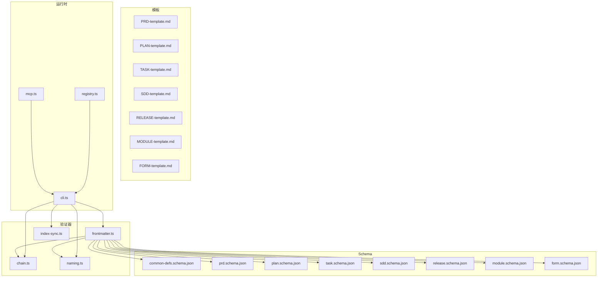
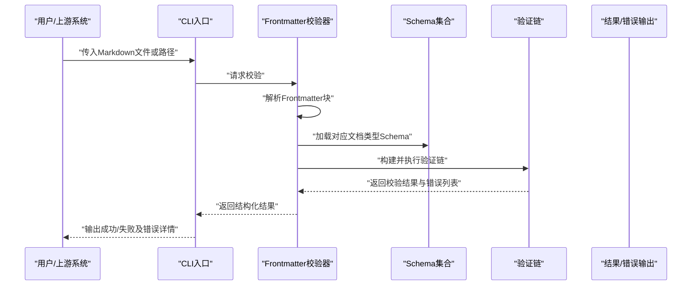
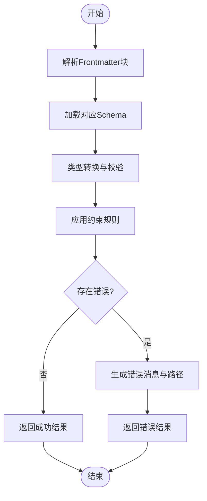
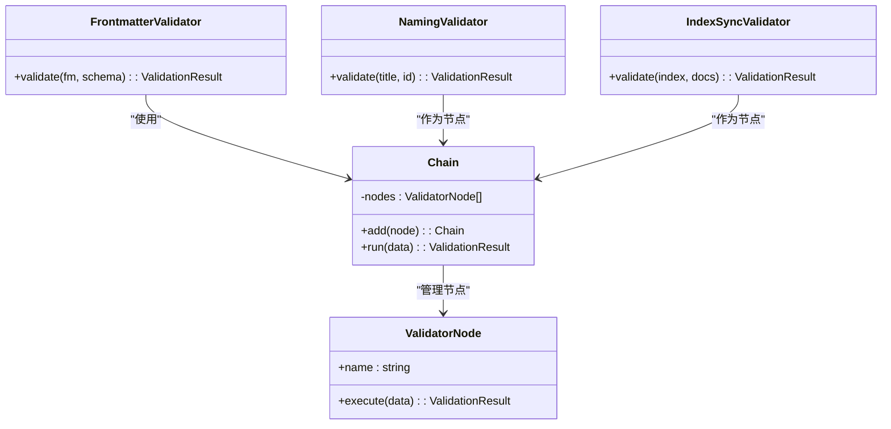
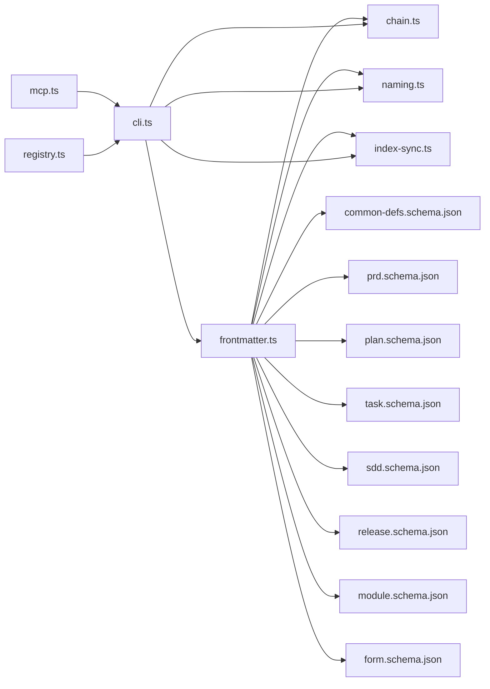

# Frontmatter验证器

<cite>
**本文引用的文件**   
- [frontmatter.ts](file://skills/shared/engineering-docs/scripts/src/validators/frontmatter.ts)
- [chain.ts](file://skills/shared/engineering-docs/scripts/src/validators/chain.ts)
- [index-sync.ts](file://skills/shared/engineering-docs/scripts/src/validators/index-sync.ts)
- [naming.ts](file://skills/shared/engineering-docs/scripts/src/validators/naming.ts)
- [cli.ts](file://skills/shared/engineering-docs/scripts/src/cli.ts)
- [mcp.ts](file://skills/shared/engineering-docs/scripts/src/mcp.ts)
- [registry.ts](file://skills/shared/engineering-docs/scripts/src/registry.ts)
- [package.json](file://skills/shared/engineering-docs/scripts/package.json)
- [tsconfig.json](file://skills/shared/engineering-docs/scripts/tsconfig.json)
- [vitest.config.ts](file://skills/shared/engineering-docs/scripts/vitest.config.ts)
- [PRD模板](file://skills/shared/engineering-docs/templates/PRD-template.md)
- [PLAN模板](file://skills/shared/engineering-docs/templates/PLAN-template.md)
- [TASK模板](file://skills/shared/engineering-docs/templates/TASK-template.md)
- [SDD模板](file://skills/shared/engineering-docs/templates/SDD-template.md)
- [RELEASE模板](file://skills/shared/engineering-docs/templates/RELEASE-template.md)
- [MODULE模板](file://skills/shared/engineering-docs/templates/MODULE-template.md)
- [FORM模板](file://skills/shared/engineering-docs/templates/FORM-template.md)
- [common-defs.schema.json](file://skills/shared/engineering-docs/schemas/common-defs.schema.json)
- [prd.schema.json](file://skills/shared/engineering-docs/schemas/prd.schema.json)
- [plan.schema.json](file://skills/shared/engineering-docs/schemas/plan.schema.json)
- [task.schema.json](file://skills/shared/engineering-docs/schemas/task.schema.json)
- [sdd.schema.json](file://skills/shared/engineering-docs/schemas/sdd.schema.json)
- [release.schema.json](file://skills/shared/engineering-docs/schemas/release.schema.json)
- [module.schema.json](file://skills/shared/engineering-docs/schemas/module.schema.json)
- [form.schema.json](file://skills/shared/engineering-docs/schemas/form.schema.json)
</cite>

## 目录
1. [简介](#简介)
2. [项目结构](#项目结构)
3. [核心组件](#核心组件)
4. [架构总览](#架构总览)
5. [详细组件分析](#详细组件分析)
6. [依赖关系分析](#依赖关系分析)
7. [性能考虑](#性能考虑)
8. [故障排查指南](#故障排查指南)
9. [结论](#结论)
10. [附录](#附录)

## 简介
本技术文档围绕Frontmatter验证器展开，聚焦于Markdown文档头部元数据（Frontmatter）的解析、校验与转换流程。该验证器基于Schema驱动，提供字段类型约束、必填项检查、格式校验以及错误定位与友好提示能力；同时支持组合式验证链与命名规范校验，便于在工程化文档体系中统一质量门禁。

## 项目结构
验证器位于“工程化文档”技能脚本中，采用TypeScript实现，配套JSON Schema定义与CLI入口，并提供测试配置。整体组织方式以“功能域+工具层”划分：
- validators：验证逻辑（Frontmatter、命名、索引同步、验证链）
- schemas：各文档类型的JSON Schema定义
- templates：文档模板（含Frontmatter示例）
- scripts：CLI、MCP集成、注册表等运行期入口

图表来源
- [frontmatter.ts](file://skills/shared/engineering-docs/scripts/src/validators/frontmatter.ts)
- [chain.ts](file://skills/shared/engineering-docs/scripts/src/validators/chain.ts)
- [index-sync.ts](file://skills/shared/engineering-docs/scripts/src/validators/index-sync.ts)
- [naming.ts](file://skills/shared/engineering-docs/scripts/src/validators/naming.ts)
- [cli.ts](file://skills/shared/engineering-docs/scripts/src/cli.ts)
- [mcp.ts](file://skills/shared/engineering-docs/scripts/src/mcp.ts)
- [registry.ts](file://skills/shared/engineering-docs/scripts/src/registry.ts)
- [common-defs.schema.json](file://skills/shared/engineering-docs/schemas/common-defs.schema.json)
- [prd.schema.json](file://skills/shared/engineering-docs/schemas/prd.schema.json)
- [plan.schema.json](file://skills/shared/engineering-docs/schemas/plan.schema.json)
- [task.schema.json](file://skills/shared/engineering-docs/schemas/task.schema.json)
- [sdd.schema.json](file://skills/shared/engineering-docs/schemas/sdd.schema.json)
- [release.schema.json](file://skills/shared/engineering-docs/schemas/release.schema.json)
- [module.schema.json](file://skills/shared/engineering-docs/schemas/module.schema.json)
- [form.schema.json](file://skills/shared/engineering-docs/schemas/form.schema.json)
- [PRD模板](file://skills/shared/engineering-docs/templates/PRD-template.md)
- [PLAN模板](file://skills/shared/engineering-docs/templates/PLAN-template.md)
- [TASK模板](file://skills/shared/engineering-docs/templates/TASK-template.md)
- [SDD模板](file://skills/shared/engineering-docs/templates/SDD-template.md)
- [RELEASE模板](file://skills/shared/engineering-docs/templates/RELEASE-template.md)
- [MODULE模板](file://skills/shared/engineering-docs/templates/MODULE-template.md)
- [FORM模板](file://skills/shared/engineering-docs/templates/FORM-template.md)

章节来源
- [frontmatter.ts](file://skills/shared/engineering-docs/scripts/src/validators/frontmatter.ts)
- [chain.ts](file://skills/shared/engineering-docs/scripts/src/validators/chain.ts)
- [index-sync.ts](file://skills/shared/engineering-docs/scripts/src/validators/index-sync.ts)
- [naming.ts](file://skills/shared/engineering-docs/scripts/src/validators/naming.ts)
- [cli.ts](file://skills/shared/engineering-docs/scripts/src/cli.ts)
- [mcp.ts](file://skills/shared/engineering-docs/scripts/src/mcp.ts)
- [registry.ts](file://skills/shared/engineering-docs/scripts/src/registry.ts)
- [package.json](file://skills/shared/engineering-docs/scripts/package.json)
- [tsconfig.json](file://skills/shared/engineering-docs/scripts/tsconfig.json)
- [vitest.config.ts](file://skills/shared/engineering-docs/scripts/vitest.config.ts)

## 核心组件
- Frontmatter解析与校验：负责从Markdown中提取Frontmatter块，按Schema进行类型与约束校验，并输出结构化结果与错误信息。
- 验证链：将多个验证步骤串联执行，支持短路或继续策略，聚合错误并生成可定位的错误路径。
- 命名规范校验：对标题、文件名、ID等字段进行一致性检查，确保跨文档引用稳定。
- 索引同步校验：校验文档索引与内容的一致性，如链接、标签、分类等。
- 运行时集成：通过CLI与MCP暴露验证能力，供本地与远程调用。

章节来源
- [frontmatter.ts](file://skills/shared/engineering-docs/scripts/src/validators/frontmatter.ts)
- [chain.ts](file://skills/shared/engineering-docs/scripts/src/validators/chain.ts)
- [naming.ts](file://skills/shared/engineering-docs/scripts/src/validators/naming.ts)
- [index-sync.ts](file://skills/shared/engineering-docs/scripts/src/validators/index-sync.ts)
- [cli.ts](file://skills/shared/engineering-docs/scripts/src/cli.ts)
- [mcp.ts](file://skills/shared/engineering-docs/scripts/src/mcp.ts)

## 架构总览
下图展示了从输入到输出的端到端流程：读取Markdown、解析Frontmatter、加载对应Schema、执行验证链、收集错误与提示、返回结果。

图表来源
- [cli.ts](file://skills/shared/engineering-docs/scripts/src/cli.ts)
- [frontmatter.ts](file://skills/shared/engineering-docs/scripts/src/validators/frontmatter.ts)
- [chain.ts](file://skills/shared/engineering-docs/scripts/src/validators/chain.ts)
- [common-defs.schema.json](file://skills/shared/engineering-docs/schemas/common-defs.schema.json)
- [prd.schema.json](file://skills/shared/engineering-docs/schemas/prd.schema.json)
- [plan.schema.json](file://skills/shared/engineering-docs/schemas/plan.schema.json)
- [task.schema.json](file://skills/shared/engineering-docs/schemas/task.schema.json)
- [sdd.schema.json](file://skills/shared/engineering-docs/schemas/sdd.schema.json)
- [release.schema.json](file://skills/shared/engineering-docs/schemas/release.schema.json)
- [module.schema.json](file://skills/shared/engineering-docs/schemas/module.schema.json)
- [form.schema.json](file://skills/shared/engineering-docs/schemas/form.schema.json)

## 详细组件分析

### Frontmatter解析与校验
- 解析阶段：识别Markdown开头的YAML块，提取键值对为对象。
- 类型映射：根据Schema中的type定义，将字符串值转换为期望类型（如string、number、boolean、enum、array、object等）。
- 约束校验：应用required、minLength、maxLength、pattern、minimum、maximum、uniqueItems、items、properties等规则。
- 错误定位：记录每个失败字段的JSON Path，便于快速定位问题。
- 结果输出：包含是否通过、已转换后的数据、错误数组（含路径、消息、规则名）。

图表来源
- [frontmatter.ts](file://skills/shared/engineering-docs/scripts/src/validators/frontmatter.ts)
- [common-defs.schema.json](file://skills/shared/engineering-docs/schemas/common-defs.schema.json)
- [prd.schema.json](file://skills/shared/engineering-docs/schemas/prd.schema.json)
- [plan.schema.json](file://skills/shared/engineering-docs/schemas/plan.schema.json)
- [task.schema.json](file://skills/shared/engineering-docs/schemas/task.schema.json)
- [sdd.schema.json](file://skills/shared/engineering-docs/schemas/sdd.schema.json)
- [release.schema.json](file://skills/shared/engineering-docs/schemas/release.schema.json)
- [module.schema.json](file://skills/shared/engineering-docs/schemas/module.schema.json)
- [form.schema.json](file://skills/shared/engineering-docs/schemas/form.schema.json)

章节来源
- [frontmatter.ts](file://skills/shared/engineering-docs/scripts/src/validators/frontmatter.ts)
- [common-defs.schema.json](file://skills/shared/engineering-docs/schemas/common-defs.schema.json)
- [prd.schema.json](file://skills/shared/engineering-docs/schemas/prd.schema.json)
- [plan.schema.json](file://skills/shared/engineering-docs/schemas/plan.schema.json)
- [task.schema.json](file://skills/shared/engineering-docs/schemas/task.schema.json)
- [sdd.schema.json](file://skills/shared/engineering-docs/schemas/sdd.schema.json)
- [release.schema.json](file://skills/shared/engineering-docs/schemas/release.schema.json)
- [module.schema.json](file://skills/shared/engineering-docs/schemas/module.schema.json)
- [form.schema.json](file://skills/shared/engineering-docs/schemas/form.schema.json)

### 验证链（Chain）
- 设计模式：将多个验证步骤作为节点串联，支持顺序执行与短路策略。
- 错误聚合：每个节点返回局部错误，最终汇总为全局错误集。
- 扩展点：新增验证步骤只需实现标准接口并注册到链中。
- 适用场景：类型校验、业务规则、跨字段一致性、外部资源可达性等。

图表来源
- [chain.ts](file://skills/shared/engineering-docs/scripts/src/validators/chain.ts)
- [frontmatter.ts](file://skills/shared/engineering-docs/scripts/src/validators/frontmatter.ts)
- [naming.ts](file://skills/shared/engineering-docs/scripts/src/validators/naming.ts)
- [index-sync.ts](file://skills/shared/engineering-docs/scripts/src/validators/index-sync.ts)

章节来源
- [chain.ts](file://skills/shared/engineering-docs/scripts/src/validators/chain.ts)
- [frontmatter.ts](file://skills/shared/engineering-docs/scripts/src/validators/frontmatter.ts)
- [naming.ts](file://skills/shared/engineering-docs/scripts/src/validators/naming.ts)
- [index-sync.ts](file://skills/shared/engineering-docs/scripts/src/validators/index-sync.ts)

### 命名规范校验
- 目标：保证标题、ID、文件名等符合约定，避免后续引用断裂。
- 规则示例：大小写、分隔符、前缀/后缀、唯一性、长度限制。
- 集成方式：作为验证链的一个节点参与执行。

章节来源
- [naming.ts](file://skills/shared/engineering-docs/scripts/src/validators/naming.ts)

### 索引同步校验
- 目标：确保文档索引与实际内容一致，包括链接、标签、分类等。
- 行为：扫描相关文档，比对索引条目，报告缺失或冗余。
- 集成方式：作为验证链的后期节点，用于整体一致性保障。

章节来源
- [index-sync.ts](file://skills/shared/engineering-docs/scripts/src/validators/index-sync.ts)

### 运行时集成（CLI与MCP）
- CLI：提供命令行参数，支持批量校验、指定Schema、输出格式选择。
- MCP：将验证能力封装为服务接口，供远程调用。
- 注册表：集中管理验证器与Schema的注册与查找。

章节来源
- [cli.ts](file://skills/shared/engineering-docs/scripts/src/cli.ts)
- [mcp.ts](file://skills/shared/engineering-docs/scripts/src/mcp.ts)
- [registry.ts](file://skills/shared/engineering-docs/scripts/src/registry.ts)

## 依赖关系分析
- 内部依赖：
  - frontmatter.ts 依赖 chain.ts、naming.ts、index-sync.ts 提供的验证能力。
  - 所有验证器均依赖 schemas 下的JSON Schema定义进行类型与约束校验。
- 外部依赖：
  - TypeScript编译与测试框架（见tsconfig与vitest配置）。
  - JSON Schema解析库（由package.json声明）。
- 耦合与内聚：
  - 验证器模块职责清晰，通过验证链松耦合组合。
  - Schema与模板分离，便于独立演进。

图表来源
- [frontmatter.ts](file://skills/shared/engineering-docs/scripts/src/validators/frontmatter.ts)
- [chain.ts](file://skills/shared/engineering-docs/scripts/src/validators/chain.ts)
- [naming.ts](file://skills/shared/engineering-docs/scripts/src/validators/naming.ts)
- [index-sync.ts](file://skills/shared/engineering-docs/scripts/src/validators/index-sync.ts)
- [cli.ts](file://skills/shared/engineering-docs/scripts/src/cli.ts)
- [mcp.ts](file://skills/shared/engineering-docs/scripts/src/mcp.ts)
- [registry.ts](file://skills/shared/engineering-docs/scripts/src/registry.ts)
- [common-defs.schema.json](file://skills/shared/engineering-docs/schemas/common-defs.schema.json)
- [prd.schema.json](file://skills/shared/engineering-docs/schemas/prd.schema.json)
- [plan.schema.json](file://skills/shared/engineering-docs/schemas/plan.schema.json)
- [task.schema.json](file://skills/shared/engineering-docs/schemas/task.schema.json)
- [sdd.schema.json](file://skills/shared/engineering-docs/schemas/sdd.schema.json)
- [release.schema.json](file://skills/shared/engineering-docs/schemas/release.schema.json)
- [module.schema.json](file://skills/shared/engineering-docs/schemas/module.schema.json)
- [form.schema.json](file://skills/shared/engineering-docs/schemas/form.schema.json)

章节来源
- [package.json](file://skills/shared/engineering-docs/scripts/package.json)
- [tsconfig.json](file://skills/shared/engineering-docs/scripts/tsconfig.json)
- [vitest.config.ts](file://skills/shared/engineering-docs/scripts/vitest.config.ts)

## 性能考虑
- 增量校验：仅对变更文档执行验证，减少全量扫描开销。
- Schema缓存：启动时加载并缓存常用Schema，避免重复I/O。
- 并行处理：对多文档批量校验采用并发策略，注意控制并发度以避免资源争用。
- 错误短路：在关键前置校验失败时提前终止后续昂贵步骤。

[本节为通用指导，不直接分析具体文件]

## 故障排查指南
- 常见错误类型
  - 必填字段缺失：检查required规则与字段路径。
  - 类型不匹配：核对Schema的type定义与输入值。
  - 格式不符：检查pattern、minLength/maxLength、枚举值等。
  - 唯一性冲突：检查uniqueItems或自定义唯一性规则。
- 错误定位技巧
  - 关注错误消息中的JSON Path，快速定位到具体字段。
  - 结合模板对照，确认默认值与示例是否符合预期。
- 调试建议
  - 使用CLI的详细输出模式，查看中间结果与错误堆栈。
  - 在验证链中插入日志节点，逐步缩小问题范围。

章节来源
- [frontmatter.ts](file://skills/shared/engineering-docs/scripts/src/validators/frontmatter.ts)
- [chain.ts](file://skills/shared/engineering-docs/scripts/src/validators/chain.ts)
- [cli.ts](file://skills/shared/engineering-docs/scripts/src/cli.ts)

## 结论
Frontmatter验证器通过Schema驱动的强类型校验与可扩展的验证链机制，为工程化文档提供了稳定的质量门禁。配合命名规范与索引同步校验，能够有效提升文档的一致性与可维护性。建议在CI流水线中集成该验证器，以实现持续的质量保障。

[本节为总结性内容，不直接分析具体文件]

## 附录

### 支持的字段类型与约束（基于JSON Schema）
- 基础类型：string、number、integer、boolean
- 复合类型：array、object
- 常用约束：
  - required：必填字段
  - minLength/maxLength：字符串长度限制
  - pattern：正则表达式格式校验
  - minimum/maximum：数值范围
  - enum：枚举值限定
  - uniqueItems：数组元素唯一性
  - items：数组元素Schema
  - properties：对象属性Schema
  - additionalProperties：是否允许额外属性

章节来源
- [common-defs.schema.json](file://skills/shared/engineering-docs/schemas/common-defs.schema.json)
- [prd.schema.json](file://skills/shared/engineering-docs/schemas/prd.schema.json)
- [plan.schema.json](file://skills/shared/engineering-docs/schemas/plan.schema.json)
- [task.schema.json](file://skills/shared/engineering-docs/schemas/task.schema.json)
- [sdd.schema.json](file://skills/shared/engineering-docs/schemas/sdd.schema.json)
- [release.schema.json](file://skills/shared/engineering-docs/schemas/release.schema.json)
- [module.schema.json](file://skills/shared/engineering-docs/schemas/module.schema.json)
- [form.schema.json](file://skills/shared/engineering-docs/schemas/form.schema.json)

### 实际使用示例与常见场景
- 基本校验：对PRD文档的Frontmatter进行类型与必填项校验。
- 格式校验：对日期、URL、邮箱等字段进行pattern校验。
- 跨字段一致性：校验版本号与发布日期之间的先后关系。
- 批量校验：通过CLI对目录下的多篇文档进行统一校验。
- 自定义验证器：在验证链中新增业务规则节点，实现领域特定校验。

章节来源
- [PRD模板](file://skills/shared/engineering-docs/templates/PRD-template.md)
- [PLAN模板](file://skills/shared/engineering-docs/templates/PLAN-template.md)
- [TASK模板](file://skills/shared/engineering-docs/templates/TASK-template.md)
- [SDD模板](file://skills/shared/engineering-docs/templates/SDD-template.md)
- [RELEASE模板](file://skills/shared/engineering-docs/templates/RELEASE-template.md)
- [MODULE模板](file://skills/shared/engineering-docs/templates/MODULE-template.md)
- [FORM模板](file://skills/shared/engineering-docs/templates/FORM-template.md)
- [cli.ts](file://skills/shared/engineering-docs/scripts/src/cli.ts)
- [chain.ts](file://skills/shared/engineering-docs/scripts/src/validators/chain.ts)