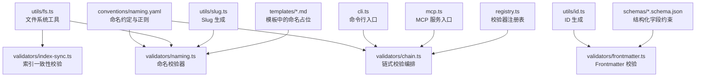
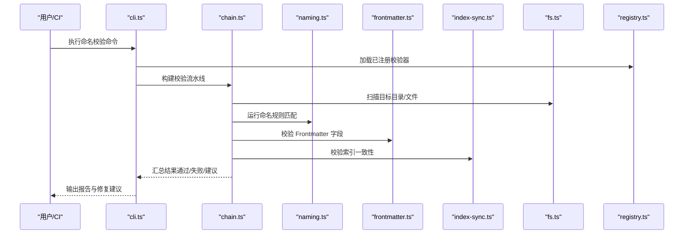
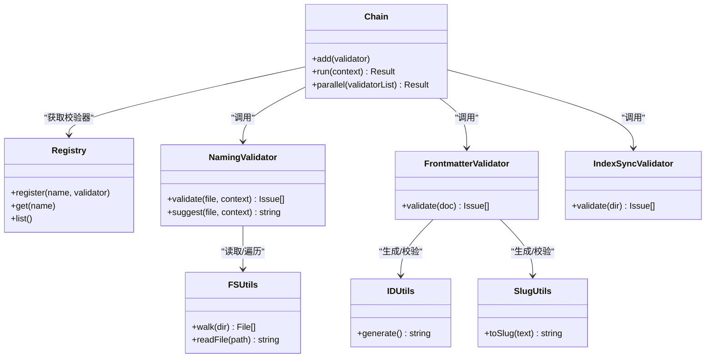

# 命名规范验证器

<cite>
**本文引用的文件**   
- [naming.yaml](file://skills/shared/engineering-docs/conventions/naming.yaml)
- [chain.ts](file://skills/shared/engineering-docs/scripts/src/validators/chain.ts)
- [naming.ts](file://skills/shared/engineering-docs/scripts/src/validators/naming.ts)
- [frontmatter.ts](file://skills/shared/engineering-docs/scripts/src/validators/frontmatter.ts)
- [index-sync.ts](file://skills/shared/engineering-docs/scripts/src/validators/index-sync.ts)
- [cli.ts](file://skills/shared/engineering-docs/scripts/src/cli.ts)
- [mcp.ts](file://skills/shared/engineering-docs/scripts/src/mcp.ts)
- [registry.ts](file://skills/shared/engineering-docs/scripts/src/registry.ts)
- [fs.ts](file://skills/shared/engineering-docs/scripts/src/utils/fs.ts)
- [id.ts](file://skills/shared/engineering-docs/scripts/src/utils/id.ts)
- [slug.ts](file://skills/shared/engineering-docs/scripts/src/utils/slug.ts)
- [generators.test.ts](file://skills/shared/engineering-docs/scripts/src/__tests__/generators.test.ts)
- [validators.test.ts](file://skills/shared/engineering-docs/scripts/src/__tests__/validators.test.ts)
- [PRD-template.md](file://skills/shared/engineering-docs/templates/PRD-template.md)
- [PLAN-template.md](file://skills/shared/engineering-docs/templates/PLAN-template.md)
- [SDD-template.md](file://skills/shared/engineering-docs/templates/SDD-template.md)
- [TASK-template.md](file://skills/shared/engineering-docs/templates/TASK-template.md)
- [release.schema.json](file://skills/shared/engineering-docs/schemas/release.schema.json)
- [prd.schema.json](file://skills/shared/engineering-docs/schemas/prd.schema.json)
- [plan.schema.json](file://skills/shared/engineering-docs/schemas/plan.schema.json)
- [task.schema.json](file://skills/shared/engineering-docs/schemas/task.schema.json)
</cite>

## 目录
1. [简介](#简介)
2. [项目结构](#项目结构)
3. [核心组件](#核心组件)
4. [架构总览](#架构总览)
5. [详细组件分析](#详细组件分析)
6. [依赖关系分析](#依赖关系分析)
7. [性能考量](#性能考量)
8. [故障排查指南](#故障排查指南)
9. [结论](#结论)
10. [附录](#附录)

## 简介
本技术文档面向“命名规范验证器”，聚焦以下目标：
- 深入解释命名规则的匹配算法、正则表达式配置与模式定义
- 说明支持的文件命名约定、目录结构与版本标识符验证
- 介绍自定义命名规则编写方法与扩展机制
- 提供批量重命名、自动修正与兼容性检查的功能说明
- 说明命名冲突检测、历史版本兼容与迁移工具的使用方法
- 给出不同项目类型的命名规范配置示例与最佳实践建议

该验证器位于工程化文档子项目中，围绕“conventions”（约定）、“scripts”（脚本与校验）、“templates”（模板）与“schemas”（数据模型）四大模块组织，通过 CLI 与 MCP 两种入口对外提供服务。

## 项目结构
与命名规范验证相关的核心目录与文件如下：
- conventions：集中存放命名约定与正则配置
- scripts/src/validators：实现各类校验逻辑（链式校验、命名、元数据、索引同步等）
- scripts/src/utils：通用工具（文件系统、ID、Slug 生成等）
- scripts/src：CLI、MCP、注册表等入口与编排
- templates：各文档类型模板，内含命名占位与版本字段
- schemas：JSON Schema 约束，用于结构化字段校验（含版本相关字段）

图表来源
- [naming.yaml:1-200](file://skills/shared/engineering-docs/conventions/naming.yaml#L1-L200)
- [naming.ts:1-200](file://skills/shared/engineering-docs/scripts/src/validators/naming.ts#L1-L200)
- [chain.ts:1-200](file://skills/shared/engineering-docs/scripts/src/validators/chain.ts#L1-L200)
- [fs.ts:1-200](file://skills/shared/engineering-docs/scripts/src/utils/fs.ts#L1-L200)
- [index-sync.ts:1-200](file://skills/shared/engineering-docs/scripts/src/validators/index-sync.ts#L1-L200)
- [id.ts:1-200](file://skills/shared/engineering-docs/scripts/src/utils/id.ts#L1-L200)
- [slug.ts:1-200](file://skills/shared/engineering-docs/scripts/src/utils/slug.ts#L1-L200)
- [cli.ts:1-200](file://skills/shared/engineering-docs/scripts/src/cli.ts#L1-L200)
- [mcp.ts:1-200](file://skills/shared/engineering-docs/scripts/src/mcp.ts#L1-L200)
- [registry.ts:1-200](file://skills/shared/engineering-docs/scripts/src/registry.ts#L1-L200)
- [PRD-template.md:1-200](file://skills/shared/engineering-docs/templates/PRD-template.md#L1-L200)
- [PLAN-template.md:1-200](file://skills/shared/engineering-docs/templates/PLAN-template.md#L1-L200)
- [SDD-template.md:1-200](file://skills/shared/engineering-docs/templates/SDD-template.md#L1-L200)
- [TASK-template.md:1-200](file://skills/shared/engineering-docs/templates/TASK-template.md#L1-L200)
- [release.schema.json:1-200](file://skills/shared/engineering-docs/schemas/release.schema.json#L1-L200)
- [prd.schema.json:1-200](file://skills/shared/engineering-docs/schemas/prd.schema.json#L1-L200)
- [plan.schema.json:1-200](file://skills/shared/engineering-docs/schemas/plan.schema.json#L1-L200)
- [task.schema.json:1-200](file://skills/shared/engineering-docs/schemas/task.schema.json#L1-L200)

章节来源
- [naming.yaml:1-200](file://skills/shared/engineering-docs/conventions/naming.yaml#L1-L200)
- [naming.ts:1-200](file://skills/shared/engineering-docs/scripts/src/validators/naming.ts#L1-L200)
- [chain.ts:1-200](file://skills/shared/engineering-docs/scripts/src/validators/chain.ts#L1-L200)
- [cli.ts:1-200](file://skills/shared/engineering-docs/scripts/src/cli.ts#L1-L200)
- [mcp.ts:1-200](file://skills/shared/engineering-docs/scripts/src/mcp.ts#L1-L200)
- [registry.ts:1-200](file://skills/shared/engineering-docs/scripts/src/registry.ts#L1-L200)

## 核心组件
- 命名约定配置（conventions/naming.yaml）
  - 定义文件命名模式、目录结构约定、版本标识符格式、前缀/后缀策略、分隔符与大小写规则等
  - 作为所有命名校验器的权威来源
- 命名校验器（validators/naming.ts）
  - 读取约定配置，解析正则表达式，对文件名、路径片段、版本号进行匹配与断言
  - 输出标准化结果与建议修正
- 链式校验编排（validators/chain.ts）
  - 将多个校验器组合为流水线，支持短路、并行与错误聚合
- Frontmatter 校验（validators/frontmatter.ts）
  - 校验文档头部字段（如 id、version、title、slug 等），并与命名约定保持一致性
- 索引一致性校验（validators/index-sync.ts）
  - 校验目录索引与实际文件的一致性，避免遗漏或重复
- 工具库（utils/*）
  - fs.ts：文件与目录遍历、读写、相对路径计算
  - id.ts：稳定 ID 生成（用于 PRD/PLAN/TASK 等唯一标识）
  - slug.ts：安全 Slug 生成（用于 URL 友好标识）
- 入口与注册（cli.ts、mcp.ts、registry.ts）
  - CLI 提供命令式调用；MCP 提供可被外部系统调用的接口；注册表管理校验器生命周期

章节来源
- [naming.yaml:1-200](file://skills/shared/engineering-docs/conventions/naming.yaml#L1-L200)
- [naming.ts:1-200](file://skills/shared/engineering-docs/scripts/src/validators/naming.ts#L1-L200)
- [chain.ts:1-200](file://skills/shared/engineering-docs/scripts/src/validators/chain.ts#L1-L200)
- [frontmatter.ts:1-200](file://skills/shared/engineering-docs/scripts/src/validators/frontmatter.ts#L1-L200)
- [index-sync.ts:1-200](file://skills/shared/engineering-docs/scripts/src/validators/index-sync.ts#L1-L200)
- [fs.ts:1-200](file://skills/shared/engineering-docs/scripts/src/utils/fs.ts#L1-L200)
- [id.ts:1-200](file://skills/shared/engineering-docs/scripts/src/utils/id.ts#L1-L200)
- [slug.ts:1-200](file://skills/shared/engineering-docs/scripts/src/utils/slob.ts#L1-L200)
- [cli.ts:1-200](file://skills/shared/engineering-docs/scripts/src/cli.ts#L1-L200)
- [mcp.ts:1-200](file://skills/shared/engineering-docs/scripts/src/mcp.ts#L1-L200)
- [registry.ts:1-200](file://skills/shared/engineering-docs/scripts/src/registry.ts#L1-L200)

## 架构总览
命名规范验证器采用“配置驱动 + 插件化校验器 + 流水线编排”的架构。约定配置集中管理，校验器按职责拆分，通过链式编排统一执行，CLI/MCP 作为对外入口。

图表来源
- [cli.ts:1-200](file://skills/shared/engineering-docs/scripts/src/cli.ts#L1-L200)
- [chain.ts:1-200](file://skills/shared/engineering-docs/scripts/src/validators/chain.ts#L1-L200)
- [naming.ts:1-200](file://skills/shared/engineering-docs/scripts/src/validators/naming.ts#L1-L200)
- [frontmatter.ts:1-200](file://skills/shared/engineering-docs/scripts/src/validators/frontmatter.ts#L1-L200)
- [index-sync.ts:1-200](file://skills/shared/engineering-docs/scripts/src/validators/index-sync.ts#L1-L200)
- [fs.ts:1-200](file://skills/shared/engineering-docs/scripts/src/utils/fs.ts#L1-L200)
- [registry.ts:1-200](file://skills/shared/engineering-docs/scripts/src/registry.ts#L1-L200)

## 详细组件分析

### 命名约定配置（conventions/naming.yaml）
- 作用
  - 定义全局命名规则：文件命名模式、目录结构、版本标识符格式、前缀/后缀、分隔符、大小写策略、是否允许数字/字母/下划线等
- 关键概念
  - 模式定义：以正则表达式形式描述合法命名
  - 上下文限定：针对特定目录或文件类型应用不同规则
  - 版本标识符：语义化版本或内部版本号的格式约束
- 使用方式
  - 校验器在运行时加载该 YAML，解析为内部配置对象
  - 根据上下文选择适用的规则集并执行匹配

章节来源
- [naming.yaml:1-200](file://skills/shared/engineering-docs/conventions/naming.yaml#L1-L200)

### 命名校验器（validators/naming.ts）
- 功能
  - 解析约定配置，编译正则表达式
  - 对文件名、路径片段、版本号进行匹配与断言
  - 输出匹配结果、违规详情与修正建议
- 算法要点
  - 多规则优先级：按上下文与权重排序，首个命中即生效
  - 增量匹配：仅对变更文件或指定范围执行，提升性能
  - 容错策略：对常见非法字符进行规范化提示
- 输出
  - 状态（通过/失败/警告）
  - 违规项列表（包含位置、原因、建议）
  - 可选的自动修正候选

章节来源
- [naming.ts:1-200](file://skills/shared/engineering-docs/scripts/src/validators/naming.ts#L1-L200)

### 链式校验编排（validators/chain.ts）
- 功能
  - 将多个校验器串联为流水线，支持短路、并行与错误聚合
  - 提供统一的输入输出契约与中间结果传递
- 特性
  - 可插拔：通过注册表动态加载校验器
  - 可观测：记录每个阶段的耗时与错误
  - 可回滚：在自动修正模式下提供撤销建议

章节来源
- [chain.ts:1-200](file://skills/shared/engineering-docs/scripts/src/validators/chain.ts#L1-L200)

### Frontmatter 校验（validators/frontmatter.ts）
- 功能
  - 校验文档头部字段（如 id、version、title、slug 等）
  - 确保与命名约定一致（例如 id 与文件名对应、version 符合语义化版本）
- 集成
  - 与命名校验器协作，保证“文件名—元数据—内容”三者一致

章节来源
- [frontmatter.ts:1-200](file://skills/shared/engineering-docs/scripts/src/validators/frontmatter.ts#L1-L200)

### 索引一致性校验（validators/index-sync.ts）
- 功能
  - 校验目录索引文件与实际文件集合的一致性
  - 检测缺失条目、重复条目与顺序不一致问题
- 场景
  - 自动化生成索引后的人工维护易出现偏差，此校验可快速发现

章节来源
- [index-sync.ts:1-200](file://skills/shared/engineering-docs/scripts/src/validators/index-sync.ts#L1-L200)

### 工具库（utils/*）
- fs.ts
  - 提供目录遍历、文件过滤、路径规范化、相对路径计算等能力
- id.ts
  - 生成稳定的唯一标识，常用于 PRD/PLAN/TASK 的 id 字段
- slug.ts
  - 生成 URL 友好的 slug，确保跨平台兼容性与可读性

章节来源
- [fs.ts:1-200](file://skills/shared/engineering-docs/scripts/src/utils/fs.ts#L1-L200)
- [id.ts:1-200](file://skills/shared/engineering-docs/scripts/src/utils/id.ts#L1-L200)
- [slug.ts:1-200](file://skills/shared/engineering-docs/scripts/src/utils/slug.ts#L1-L200)

### 入口与注册（cli.ts、mcp.ts、registry.ts）
- cli.ts
  - 提供命令行参数解析、工作目录定位、输出格式化
- mcp.ts
  - 暴露 MCP 接口，供外部系统调用命名校验能力
- registry.ts
  - 管理校验器注册、生命周期与依赖注入

章节来源
- [cli.ts:1-200](file://skills/shared/engineering-docs/scripts/src/cli.ts#L1-L200)
- [mcp.ts:1-200](file://skills/shared/engineering-docs/scripts/src/mcp.ts#L1-L200)
- [registry.ts:1-200](file://skills/shared/engineering-docs/scripts/src/registry.ts#L1-L200)

### 模板与结构化约束（templates/*.md、schemas/*.schema.json）
- 模板
  - 在 PRD/PLAN/SDD/TASK 等模板中预留命名占位与版本字段，引导作者遵循约定
- 结构化约束
  - JSON Schema 定义字段类型、必填项、枚举值与版本格式，辅助前端/后端校验

章节来源
- [PRD-template.md:1-200](file://skills/shared/engineering-docs/templates/PRD-template.md#L1-L200)
- [PLAN-template.md:1-200](file://skills/shared/engineering-docs/templates/PLAN-template.md#L1-L200)
- [SDD-template.md:1-200](file://skills/shared/engineering-docs/templates/SDD-template.md#L1-L200)
- [TASK-template.md:1-200](file://skills/shared/engineering-docs/templates/TASK-template.md#L1-L200)
- [release.schema.json:1-200](file://skills/shared/engineering-docs/schemas/release.schema.json#L1-L200)
- [prd.schema.json:1-200](file://skills/shared/engineering-docs/schemas/prd.schema.json#L1-L200)
- [plan.schema.json:1-200](file://skills/shared/engineering-docs/schemas/plan.schema.json#L1-L200)
- [task.schema.json:1-200](file://skills/shared/engineering-docs/schemas/task.schema.json#L1-L200)

## 依赖关系分析
命名校验器之间的依赖与交互如下：

图表来源
- [registry.ts:1-200](file://skills/shared/engineering-docs/scripts/src/registry.ts#L1-L200)
- [chain.ts:1-200](file://skills/shared/engineering-docs/scripts/src/validators/chain.ts#L1-L200)
- [naming.ts:1-200](file://skills/shared/engineering-docs/scripts/src/validators/naming.ts#L1-L200)
- [frontmatter.ts:1-200](file://skills/shared/engineering-docs/scripts/src/validators/frontmatter.ts#L1-L200)
- [index-sync.ts:1-200](file://skills/shared/engineering-docs/scripts/src/validators/index-sync.ts#L1-L200)
- [fs.ts:1-200](file://skills/shared/engineering-docs/scripts/src/utils/fs.ts#L1-L200)
- [id.ts:1-200](file://skills/shared/engineering-docs/scripts/src/utils/id.ts#L1-L200)
- [slug.ts:1-200](file://skills/shared/engineering-docs/scripts/src/utils/slug.ts#L1-L200)

章节来源
- [registry.ts:1-200](file://skills/shared/engineering-docs/scripts/src/registry.ts#L1-L200)
- [chain.ts:1-200](file://skills/shared/engineering-docs/scripts/src/validators/chain.ts#L1-L200)
- [naming.ts:1-200](file://skills/shared/engineering-docs/scripts/src/validators/naming.ts#L1-L200)
- [frontmatter.ts:1-200](file://skills/shared/engineering-docs/scripts/src/validators/frontmatter.ts#L1-L200)
- [index-sync.ts:1-200](file://skills/shared/engineering-docs/scripts/src/validators/index-sync.ts#L1-L200)
- [fs.ts:1-200](file://skills/shared/engineering-docs/scripts/src/utils/fs.ts#L1-L200)
- [id.ts:1-200](file://skills/shared/engineering-docs/scripts/src/utils/id.ts#L1-L200)
- [slug.ts:1-200](file://skills/shared/engineering-docs/scripts/src/utils/slug.ts#L1-L200)

## 性能考量
- 增量扫描：优先对变更文件执行命名校验，减少全量扫描开销
- 规则缓存：对编译后的正则表达式进行缓存，避免重复编译
- 并行执行：对独立校验任务并行处理，缩短整体耗时
- 短路策略：遇到严重违规时提前终止后续无关校验，降低无效计算

[本节为通用指导，不直接分析具体文件]

## 故障排查指南
- 常见问题
  - 正则不匹配：检查 naming.yaml 中的模式定义是否与当前文件名一致
  - 版本格式错误：确认 version 字段是否符合 release.schema.json 的约束
  - 索引不一致：核对 index 文件与实际文件集合的差异
- 诊断步骤
  - 启用详细日志，查看链式校验各阶段输出
  - 使用 CLI 的只读模式，先收集问题再执行自动修正
  - 对比模板与 schema，确保字段齐全且类型正确
- 恢复建议
  - 使用自动修正生成的建议名称进行批量替换
  - 对冲突项进行人工复核，必要时调整命名约定

章节来源
- [naming.yaml:1-200](file://skills/shared/engineering-docs/conventions/naming.yaml#L1-L200)
- [release.schema.json:1-200](file://skills/shared/engineering-docs/schemas/release.schema.json#L1-L200)
- [chain.ts:1-200](file://skills/shared/engineering-docs/scripts/src/validators/chain.ts#L1-L200)
- [cli.ts:1-200](file://skills/shared/engineering-docs/scripts/src/cli.ts#L1-L200)

## 结论
命名规范验证器通过“约定驱动 + 插件化校验 + 流水线编排”的方式，提供了从文件命名、目录结构到版本标识的全链路一致性保障。借助 CLI 与 MCP 双入口，既能满足本地开发体验，也能无缝集成到 CI/CD 流程中。配合模板与结构化约束，可有效降低人为失误，提升团队协作效率。

[本节为总结性内容，不直接分析具体文件]

## 附录

### 命名规则匹配算法与正则表达式配置
- 匹配流程
  - 加载约定配置 → 解析正则 → 选择适用规则集 → 逐文件匹配 → 输出结果与建议
- 正则表达式配置
  - 在 naming.yaml 中以字符串形式声明，支持分组捕获与边界锚定
  - 建议为复杂模式添加注释，便于维护与理解
- 模式定义
  - 文件命名模式：前缀+编号+标题+后缀
  - 目录结构模式：按主题/阶段/角色分层
  - 版本标识符：语义化版本或内部版本号

章节来源
- [naming.yaml:1-200](file://skills/shared/engineering-docs/conventions/naming.yaml#L1-L200)
- [naming.ts:1-200](file://skills/shared/engineering-docs/scripts/src/validators/naming.ts#L1-L200)

### 支持的文件命名约定、目录结构与版本标识符验证
- 文件命名约定
  - 统一前缀（如 PRD、PLAN、SDD、TASK）
  - 编号段（固定长度或递增）
  - 标题段（小写、连字符分隔）
  - 可选后缀（如 .md、.yaml）
- 目录结构
  - 按主题/阶段/角色划分，避免过深嵌套
- 版本标识符
  - 遵循 release.schema.json 的约束，确保主/次/补丁号有效

章节来源
- [PRD-template.md:1-200](file://skills/shared/engineering-docs/templates/PRD-template.md#L1-L200)
- [PLAN-template.md:1-200](file://skills/shared/engineering-docs/templates/PLAN-template.md#L1-L200)
- [SDD-template.md:1-200](file://skills/shared/engineering-docs/templates/SDD-template.md#L1-L200)
- [TASK-template.md:1-200](file://skills/shared/engineering-docs/templates/TASK-template.md#L1-L200)
- [release.schema.json:1-200](file://skills/shared/engineering-docs/schemas/release.schema.json#L1-L200)

### 自定义命名规则编写与扩展机制
- 编写步骤
  - 在 naming.yaml 中添加新规则（上下文、模式、优先级）
  - 如需复杂逻辑，实现新的校验器并在 registry.ts 中注册
  - 在 chain.ts 中将新校验器加入流水线
- 扩展点
  - 新增上下文（如按团队/产品线区分）
  - 新增字段校验（如增加新的元数据字段）
  - 新增自动修正策略（如智能重命名建议）

章节来源
- [naming.yaml:1-200](file://skills/shared/engineering-docs/conventions/naming.yaml#L1-L200)
- [registry.ts:1-200](file://skills/shared/engineering-docs/scripts/src/registry.ts#L1-L200)
- [chain.ts:1-200](file://skills/shared/engineering-docs/scripts/src/validators/chain.ts#L1-L200)

### 批量重命名、自动修正与兼容性检查
- 批量重命名
  - 基于命名建议生成批量替换清单，支持预览与确认
- 自动修正
  - 对可安全修正的问题（如大小写、分隔符）自动修复
  - 对高风险操作（如 id 变更）需人工确认
- 兼容性检查
  - 检查旧版命名与新约定的差异，提供迁移路径

章节来源
- [naming.ts:1-200](file://skills/shared/engineering-docs/scripts/src/validators/naming.ts#L1-L200)
- [chain.ts:1-200](file://skills/shared/engineering-docs/scripts/src/validators/chain.ts#L1-L200)
- [cli.ts:1-200](file://skills/shared/engineering-docs/scripts/src/cli.ts#L1-L200)

### 命名冲突检测、历史版本兼容与迁移工具
- 冲突检测
  - 在同一目录下检测同名文件与 slug 冲突
  - 结合 frontmatter 的 id 字段进行交叉校验
- 历史版本兼容
  - 支持多版本命名规则并存，按时间窗口切换
  - 提供版本迁移脚本，逐步淘汰旧规则
- 迁移工具
  - 提供只读模式与写入模式，支持回滚与审计日志

章节来源
- [frontmatter.ts:1-200](file://skills/shared/engineering-docs/scripts/src/validators/frontmatter.ts#L1-L200)
- [naming.ts:1-200](file://skills/shared/engineering-docs/scripts/src/validators/naming.ts#L1-L200)
- [chain.ts:1-200](file://skills/shared/engineering-docs/scripts/src/validators/chain.ts#L1-L200)

### 不同项目类型的命名规范配置示例与最佳实践
- 产品需求类（PRD）
  - 前缀：PRD
  - 编号：三位递增
  - 标题：小写连字符
  - 示例：PRD-001-sample-login.md
- 技术方案类（PLAN/SDD）
  - 前缀：PLAN/SDD
  - 编号：与 PRD 关联
  - 标题：强调模块与阶段
- 任务类（TASK）
  - 前缀：TASK
  - 编号：与 PLAN 关联
  - 标题：动作+对象
- 最佳实践
  - 保持短小精悍，避免过长标题
  - 使用稳定 id，避免频繁变更
  - 定期清理废弃文件，保持索引一致

章节来源
- [PRD-template.md:1-200](file://skills/shared/engineering-docs/templates/PRD-template.md#L1-L200)
- [PLAN-template.md:1-200](file://skills/shared/engineering-docs/templates/PLAN-template.md#L1-L200)
- [SDD-template.md:1-200](file://skills/shared/engineering-docs/templates/SDD-template.md#L1-L200)
- [TASK-template.md:1-200](file://skills/shared/engineering-docs/templates/TASK-template.md#L1-L200)

### 测试与回归
- 单元测试
  - generators.test.ts：覆盖生成器逻辑（ID、Slug 等）
  - validators.test.ts：覆盖校验器行为（命名、Frontmatter、索引同步）
- 回归建议
  - 每次修改命名约定后，运行全量测试
  - 对关键路径（批量重命名、自动修正）增加端到端用例

章节来源
- [generators.test.ts:1-200](file://skills/shared/engineering-docs/scripts/src/__tests__/generators.test.ts#L1-L200)
- [validators.test.ts:1-200](file://skills/shared/engineering-docs/scripts/src/__tests__/validators.test.ts#L1-L200)