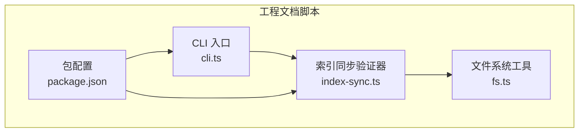
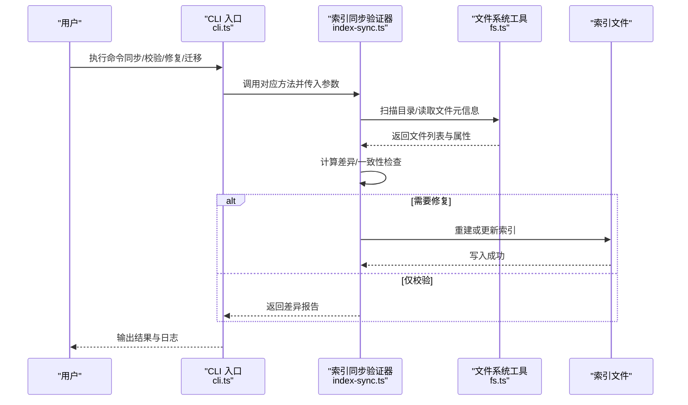
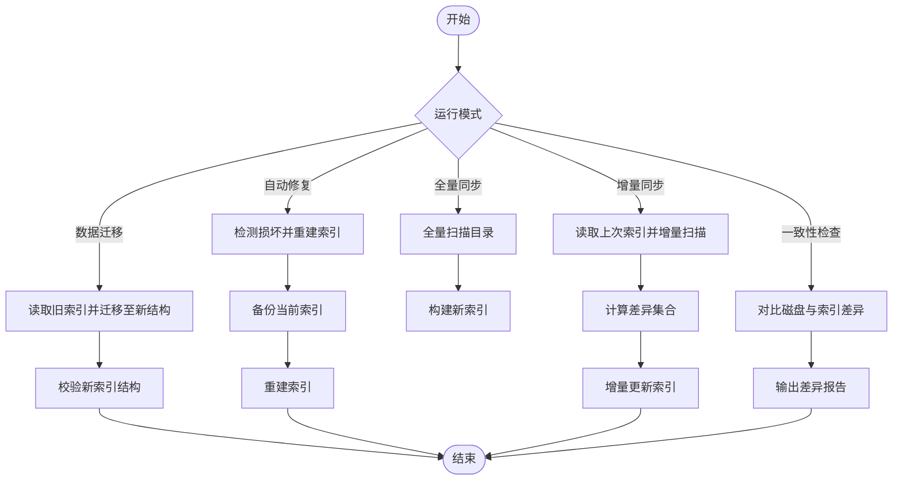
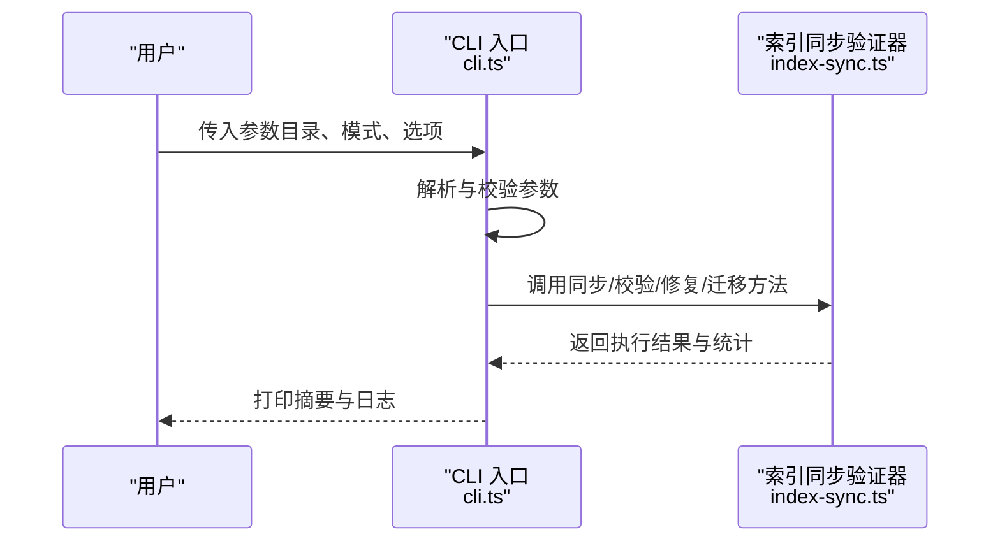
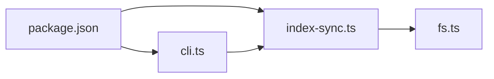

# 索引同步验证器

<cite>
**本文引用的文件**   
- [index-sync.ts](file://skills/shared/engineering-docs/scripts/src/validators/index-sync.ts)
- [cli.ts](file://skills/shared/engineering-docs/scripts/src/cli.ts)
- [fs.ts](file://skills/shared/engineering-docs/scripts/src/utils/fs.ts)
- [package.json](file://skills/shared/engineering-docs/scripts/package.json)
</cite>

## 目录
1. [简介](#简介)
2. [项目结构](#项目结构)
3. [核心组件](#核心组件)
4. [架构总览](#架构总览)
5. [详细组件分析](#详细组件分析)
6. [依赖关系分析](#依赖关系分析)
7. [性能考虑](#性能考虑)
8. [故障排查指南](#故障排查指南)
9. [结论](#结论)
10. [附录](#附录)

## 简介
本技术文档围绕“索引同步验证器”展开，聚焦于工程文档仓库中“文件索引的生成、同步与一致性检查”。该验证器负责：
- 扫描目标目录，构建或更新索引文件；
- 对比磁盘状态与索引记录，识别新增、删除、修改等差异；
- 提供增量与全量两种同步模式，并支持差异对比输出；
- 在检测到不一致时，执行自动修复（重建索引）并提供安全保护策略；
- 对大文件进行优化处理，保障性能与稳定性；
- 检测索引损坏并提供恢复机制，同时支持数据迁移。

## 项目结构
与索引同步验证相关的代码位于工程文档脚本子项目中，关键路径如下：
- 验证器实现：skills/shared/engineering-docs/scripts/src/validators/index-sync.ts
- CLI 入口与命令解析：skills/shared/engineering-docs/scripts/src/cli.ts
- 文件系统工具：skills/shared/engineering-docs/scripts/src/utils/fs.ts
- 包配置与依赖：skills/shared/engineering-docs/scripts/package.json

图表来源
- [cli.ts](file://skills/shared/engineering-docs/scripts/src/cli.ts)
- [index-sync.ts](file://skills/shared/engineering-docs/scripts/src/validators/index-sync.ts)
- [fs.ts](file://skills/shared/engineering-docs/scripts/src/utils/fs.ts)
- [package.json](file://skills/shared/engineering-docs/scripts/package.json)

章节来源
- [index-sync.ts](file://skills/shared/engineering-docs/scripts/src/validators/index-sync.ts)
- [cli.ts](file://skills/shared/engineering-docs/scripts/src/cli.ts)
- [fs.ts](file://skills/shared/engineering-docs/scripts/src/utils/fs.ts)
- [package.json](file://skills/shared/engineering-docs/scripts/package.json)

## 核心组件
- 索引同步验证器（index-sync.ts）
  - 职责：遍历目标目录，计算文件元信息（如路径、大小、时间戳、哈希），维护索引文件，执行一致性校验与修复。
  - 能力：增量同步、全量同步、差异对比、自动修复、损坏检测与恢复、数据迁移。
- CLI 入口（cli.ts）
  - 职责：解析命令行参数，选择运行模式（同步、校验、修复、迁移），调用验证器完成具体任务。
- 文件系统工具（fs.ts）
  - 职责：封装目录遍历、文件读取、统计、写入等底层操作，为上层逻辑提供稳定接口。
- 包配置（package.json）
  - 职责：声明依赖与脚本命令，便于本地开发与测试。

章节来源
- [index-sync.ts](file://skills/shared/engineering-docs/scripts/src/validators/index-sync.ts)
- [cli.ts](file://skills/shared/engineering-docs/scripts/src/cli.ts)
- [fs.ts](file://skills/shared/engineering-docs/scripts/src/utils/fs.ts)
- [package.json](file://skills/shared/engineering-docs/scripts/package.json)

## 架构总览
整体流程由 CLI 驱动，根据用户输入选择不同工作流。验证器内部通过文件系统工具访问磁盘，读写索引文件，并在必要时触发修复或迁移。

图表来源
- [cli.ts](file://skills/shared/engineering-docs/scripts/src/cli.ts)
- [index-sync.ts](file://skills/shared/engineering-docs/scripts/src/validators/index-sync.ts)
- [fs.ts](file://skills/shared/engineering-docs/scripts/src/utils/fs.ts)

## 详细组件分析

### 索引同步验证器（index-sync.ts）
- 索引文件结构定义
  - 建议字段：文件相对路径、文件大小、最后修改时间、内容哈希、版本标记、创建时间、更新时间。
  - 版本与迁移：通过版本字段区分索引格式，升级时按版本迁移旧索引到新结构。
- 生成与更新策略
  - 全量同步：重新扫描整个目录，重建索引，适用于首次初始化或大规模变更后的恢复。
  - 增量同步：基于上次索引的时间戳或哈希变化，仅处理新增、删除、修改的文件，提升效率。
- 一致性检查与冲突解决
  - 比较磁盘与索引的差异集合，识别三类事件：新增、删除、修改。
  - 冲突场景：并发修改导致的时间戳回退或哈希不一致。采用“以磁盘为准”的策略，结合幂等写入确保最终一致。
- 自动修复与安全保护
  - 自动修复：当检测到不一致或索引损坏时，可自动重建索引；提供“只读校验”和“写入修复”两种模式。
  - 安全保护：在写入前备份原索引，失败时回滚；对敏感路径进行白名单过滤；限制最大扫描深度与文件大小阈值。
- 大文件处理与性能优化
  - 分块读取与流式哈希：避免一次性加载大文件到内存。
  - 并行扫描：使用并发控制限制 I/O 压力。
  - 缓存策略：对未变更文件的元信息进行短期缓存，减少重复计算。
- 损坏检测与恢复
  - 校验索引完整性（如 JSON 结构、必填字段、哈希有效性）。
  - 若损坏，尝试从备份恢复；否则触发全量重建。
- 数据迁移
  - 读取旧版索引，映射到新结构，保留必要历史字段用于审计。
  - 迁移完成后更新版本标记，并记录迁移日志。

图表来源
- [index-sync.ts](file://skills/shared/engineering-docs/scripts/src/validators/index-sync.ts)
- [fs.ts](file://skills/shared/engineering-docs/scripts/src/utils/fs.ts)

章节来源
- [index-sync.ts](file://skills/shared/engineering-docs/scripts/src/validators/index-sync.ts)

### CLI 入口（cli.ts）
- 命令解析
  - 支持参数：目标目录、同步模式（全量/增量）、是否开启修复、是否输出差异、迁移开关等。
- 工作流编排
  - 根据参数调用验证器的相应方法，统一错误捕获与日志输出。
- 交互与反馈
  - 提供进度提示与结果摘要，便于用户快速定位问题。

图表来源
- [cli.ts](file://skills/shared/engineering-docs/scripts/src/cli.ts)
- [index-sync.ts](file://skills/shared/engineering-docs/scripts/src/validators/index-sync.ts)

章节来源
- [cli.ts](file://skills/shared/engineering-docs/scripts/src/cli.ts)

### 文件系统工具（fs.ts）
- 目录遍历
  - 递归扫描，支持忽略规则与深度限制。
- 文件元信息
  - 获取路径、大小、时间戳、权限等基础属性。
- 大文件处理
  - 提供分块读取与流式哈希接口，降低内存占用。
- 原子写入
  - 先写临时文件再替换，保证索引写入的原子性与一致性。

章节来源
- [fs.ts](file://skills/shared/engineering-docs/scripts/src/utils/fs.ts)

## 依赖关系分析
- 模块耦合
  - CLI 依赖验证器；验证器依赖文件系统工具；三者均受包配置管理。
- 外部依赖
  - 包配置中声明的库用于 JSON 序列化、哈希计算、并发控制等。

图表来源
- [package.json](file://skills/shared/engineering-docs/scripts/package.json)
- [cli.ts](file://skills/shared/engineering-docs/scripts/src/cli.ts)
- [index-sync.ts](file://skills/shared/engineering-docs/scripts/src/validators/index-sync.ts)
- [fs.ts](file://skills/shared/engineering-docs/scripts/src/utils/fs.ts)

章节来源
- [package.json](file://skills/shared/engineering-docs/scripts/package.json)
- [cli.ts](file://skills/shared/engineering-docs/scripts/src/cli.ts)
- [index-sync.ts](file://skills/shared/engineering-docs/scripts/src/validators/index-sync.ts)
- [fs.ts](file://skills/shared/engineering-docs/scripts/src/utils/fs.ts)

## 性能考虑
- 并发与限流
  - 合理设置并发度，避免 I/O 风暴；对慢盘或网络盘进一步降低并发。
- 增量优先
  - 默认启用增量同步，仅在必要时回退到全量。
- 大文件优化
  - 使用流式哈希与分块读取；跳过不可读或过大文件并记录告警。
- 缓存与去重
  - 对相同内容的文件进行去重处理，减少重复计算。
- 资源监控
  - 记录 CPU、内存、I/O 指标，辅助调优。

[本节为通用指导，不直接分析具体文件]

## 故障排查指南
- 常见问题
  - 索引不一致：运行一致性检查，查看差异报告；必要时执行自动修复。
  - 索引损坏：尝试从备份恢复；若失败则全量重建。
  - 大文件超时：调整并发与超时参数，或排除超大文件。
  - 权限不足：确认运行用户对目标目录有读取权限。
- 诊断步骤
  - 启用详细日志，定位失败阶段。
  - 对比新旧索引的关键字段（路径、大小、时间戳、哈希）。
  - 检查文件系统工具的错误码与异常堆栈。
- 恢复策略
  - 优先使用最近一次成功的索引备份。
  - 若无备份，执行全量重建并验证一致性。

章节来源
- [index-sync.ts](file://skills/shared/engineering-docs/scripts/src/validators/index-sync.ts)
- [fs.ts](file://skills/shared/engineering-docs/scripts/src/utils/fs.ts)

## 结论
索引同步验证器通过清晰的模块化设计与完善的错误处理，实现了高效、可靠的文件索引管理与一致性保障。其支持的增量与全量同步、差异对比、自动修复、损坏检测与数据迁移等功能，能够满足复杂工程文档仓库的日常运维需求。配合性能优化策略与故障排查指南，可在生产环境中稳定运行。

[本节为总结性内容，不直接分析具体文件]

## 附录
- 配置项参考
  - 同步模式：全量/增量
  - 自动修复：开启/关闭
  - 差异输出：详细/摘要
  - 并发度：数值
  - 最大文件大小：字节阈值
  - 忽略规则：路径匹配表达式
  - 备份策略：保留份数与路径
- 使用场景
  - 首次初始化：全量同步生成初始索引。
  - 日常维护：增量同步保持索引最新。
  - 发布前校验：一致性检查确保索引与磁盘一致。
  - 灾难恢复：索引损坏后自动修复或手动恢复。
  - 版本升级：数据迁移将旧索引升级到新结构。

[本节为概念性说明，不直接分析具体文件]