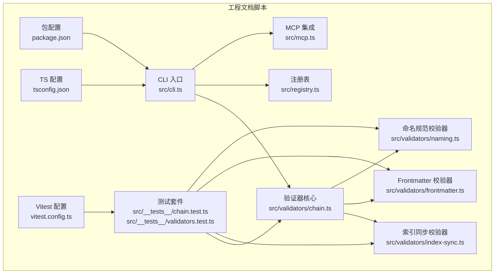
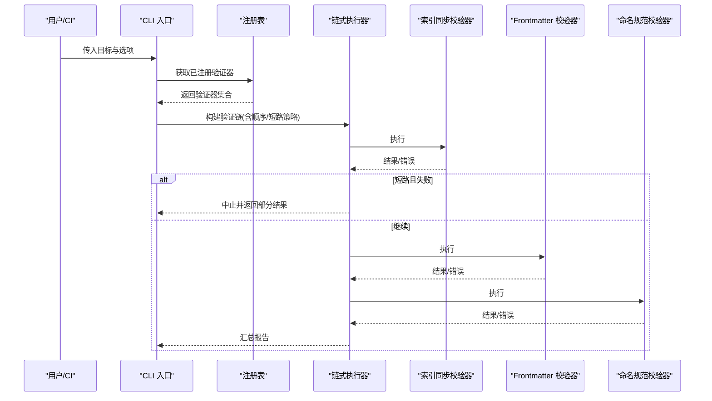
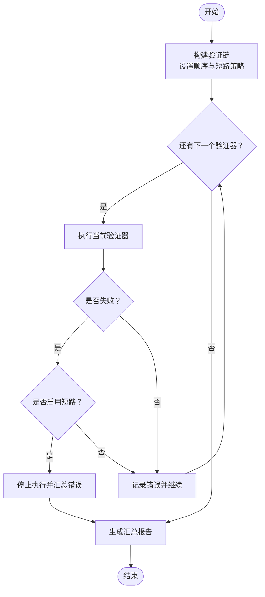
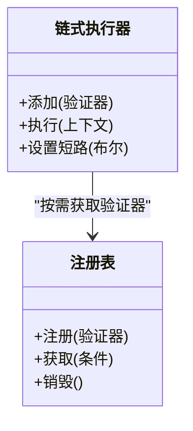
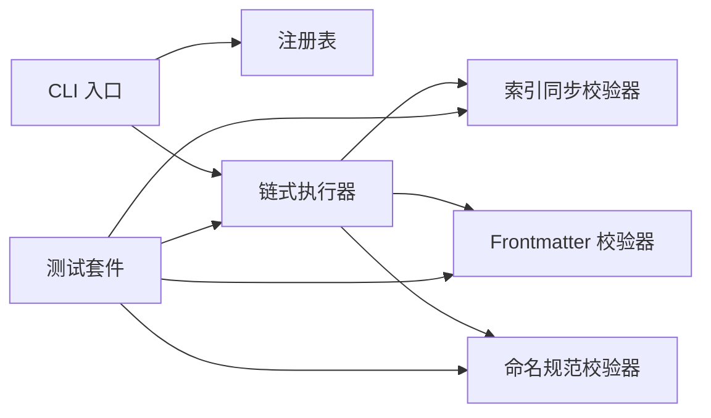

# 链式验证器

<cite>
**本文引用的文件**   
- [chain.ts](file://skills/shared/engineering-docs/scripts/src/validators/chain.ts)
- [index-sync.ts](file://skills/shared/engineering-docs/scripts/src/validators/index-sync.ts)
- [frontmatter.ts](file://skills/shared/engineering-docs/scripts/src/validators/frontmatter.ts)
- [naming.ts](file://skills/shared/engineering-docs/scripts/src/validators/naming.ts)
- [cli.ts](file://skills/shared/engineering-docs/scripts/src/cli.ts)
- [registry.ts](file://skills/shared/engineering-docs/scripts/src/registry.ts)
- [mcp.ts](file://skills/shared/engineering-docs/scripts/src/mcp.ts)
- [package.json](file://skills/shared/engineering-docs/scripts/package.json)
- [tsconfig.json](file://skills/shared/engineering-docs/scripts/tsconfig.json)
- [vitest.config.ts](file://skills/shared/engineering-docs/scripts/vitest.config.ts)
- [chain.test.ts](file://skills/shared/engineering-docs/scripts/src/__tests__/chain.test.ts)
- [validators.test.ts](file://skills/shared/engineering-docs/scripts/src/__tests__/validators.test.ts)
</cite>

## 目录
1. [简介](#简介)
2. [项目结构](#项目结构)
3. [核心组件](#核心组件)
4. [架构总览](#架构总览)
5. [详细组件分析](#详细组件分析)
6. [依赖关系分析](#依赖关系分析)
7. [性能与并行处理](#性能与并行处理)
8. [故障排查指南](#故障排查指南)
9. [结论](#结论)
10. [附录：使用示例与最佳实践](#附录使用示例与最佳实践)

## 简介
本技术文档围绕“链式验证器”展开，聚焦其架构设计、执行流程、注册机制、顺序控制、错误处理策略、结果收集与报告生成，并提供组合模式与管道设计的最佳实践。该实现位于工程文档脚本子系统中，提供可插拔的验证器能力，支持同步执行与测试驱动开发。

## 项目结构
与链式验证器直接相关的代码集中在 engineering-docs/scripts 目录下，关键路径如下：
- 验证器核心与内置验证器：src/validators
- CLI 入口与命令编排：src/cli.ts
- 全局注册表（用于发现/管理验证器）：src/registry.ts
- MCP 集成（可选扩展点）：src/mcp.ts
- 测试用例：src/__tests__
- 构建与运行配置：package.json、tsconfig.json、vitest.config.ts

图表来源
- [cli.ts](file://skills/shared/engineering-docs/scripts/src/cli.ts)
- [registry.ts](file://skills/shared/engineering-docs/scripts/src/registry.ts)
- [mcp.ts](file://skills/shared/engineering-docs/scripts/src/mcp.ts)
- [chain.ts](file://skills/shared/engineering-docs/scripts/src/validators/chain.ts)
- [index-sync.ts](file://skills/shared/engineering-docs/scripts/src/validators/index-sync.ts)
- [frontmatter.ts](file://skills/shared/engineering-docs/scripts/src/validators/frontmatter.ts)
- [naming.ts](file://skills/shared/engineering-docs/scripts/src/validators/naming.ts)
- [chain.test.ts](file://skills/shared/engineering-docs/scripts/src/__tests__/chain.test.ts)
- [validators.test.ts](file://skills/shared/engineering-docs/scripts/src/__tests__/validators.test.ts)
- [package.json](file://skills/shared/engineering-docs/scripts/package.json)
- [tsconfig.json](file://skills/shared/engineering-docs/scripts/tsconfig.json)
- [vitest.config.ts](file://skills/shared/engineering-docs/scripts/vitest.config.ts)

章节来源
- [cli.ts](file://skills/shared/engineering-docs/scripts/src/cli.ts)
- [registry.ts](file://skills/shared/engineering-docs/scripts/src/registry.ts)
- [chain.ts](file://skills/shared/engineering-docs/scripts/src/validators/chain.ts)
- [index-sync.ts](file://skills/shared/engineering-docs/scripts/src/validators/index-sync.ts)
- [frontmatter.ts](file://skills/shared/engineering-docs/scripts/src/validators/frontmatter.ts)
- [naming.ts](file://skills/shared/engineering-docs/scripts/src/validators/naming.ts)
- [chain.test.ts](file://skills/shared/engineering-docs/scripts/src/__tests__/chain.test.ts)
- [validators.test.ts](file://skills/shared/engineering-docs/scripts/src/__tests__/validators.test.ts)
- [package.json](file://skills/shared/engineering-docs/scripts/package.json)
- [tsconfig.json](file://skills/shared/engineering-docs/scripts/tsconfig.json)
- [vitest.config.ts](file://skills/shared/engineering-docs/scripts/vitest.config.ts)

## 核心组件
- 验证器核心（链式执行器）
  - 职责：维护验证器列表、按序执行、聚合结果、短路或继续策略、错误收集与报告输出。
  - 关键点：顺序可控、可扩展、统一的结果模型、可配置的失败策略。
- 内置验证器
  - 索引同步校验器：检查索引与内容一致性。
  - Frontmatter 校验器：校验文档元数据字段与格式。
  - 命名规范校验器：校验文件名/标识符是否符合约定。
- 注册表
  - 职责：集中管理验证器的发现、注册、查询与生命周期。
- CLI 入口
  - 职责：解析参数、加载配置、组装验证链、触发执行并输出结果。
- 测试套件
  - 职责：覆盖链式执行、短路行为、错误聚合、自定义验证器注入等场景。

章节来源
- [chain.ts](file://skills/shared/engineering-docs/scripts/src/validators/chain.ts)
- [index-sync.ts](file://skills/shared/engineering-docs/scripts/src/validators/index-sync.ts)
- [frontmatter.ts](file://skills/shared/engineering-docs/scripts/src/validators/frontmatter.ts)
- [naming.ts](file://skills/shared/engineering-docs/scripts/src/validators/naming.ts)
- [registry.ts](file://skills/shared/engineering-docs/scripts/src/registry.ts)
- [cli.ts](file://skills/shared/engineering-docs/scripts/src/cli.ts)
- [chain.test.ts](file://skills/shared/engineering-docs/scripts/src/__tests__/chain.test.ts)
- [validators.test.ts](file://skills/shared/engineering-docs/scripts/src/__tests__/validators.test.ts)

## 架构总览
链式验证器采用“管道+注册表”的设计：
- 注册表负责发现与装载验证器；
- CLI 根据配置选择并排序验证器，构建执行链；
- 链式执行器依次调用各验证器，收集错误与结果；
- 可选择短路模式，在首个失败时提前终止；
- 最终汇总为结构化报告供 CLI 输出或外部系统消费。

图表来源
- [cli.ts](file://skills/shared/engineering-docs/scripts/src/cli.ts)
- [registry.ts](file://skills/shared/engineering-docs/scripts/src/registry.ts)
- [chain.ts](file://skills/shared/engineering-docs/scripts/src/validators/chain.ts)
- [index-sync.ts](file://skills/shared/engineering-docs/scripts/src/validators/index-sync.ts)
- [frontmatter.ts](file://skills/shared/engineering-docs/scripts/src/validators/frontmatter.ts)
- [naming.ts](file://skills/shared/engineering-docs/scripts/src/validators/naming.ts)

## 详细组件分析

### 链式执行器（核心）
- 设计要点
  - 顺序控制：通过有序列表保证执行先后；
  - 短路策略：可配置在首个失败时立即停止后续验证；
  - 错误聚合：无论是否短路，均收集每个阶段的错误以便报告；
  - 结果模型：统一的中间结果结构，便于汇总与可视化。
- 复杂度与性能
  - 时间复杂度 O(n)，n 为验证器数量；
  - 空间复杂度 O(n) 用于存储中间结果与错误列表；
  - 若引入并行化，需考虑验证器间无状态与幂等性。

图表来源
- [chain.ts](file://skills/shared/engineering-docs/scripts/src/validators/chain.ts)

章节来源
- [chain.ts](file://skills/shared/engineering-docs/scripts/src/validators/chain.ts)
- [chain.test.ts](file://skills/shared/engineering-docs/scripts/src/__tests__/chain.test.ts)

### 注册表（验证器发现与管理）
- 设计要点
  - 集中注册：所有验证器通过统一接口注册；
  - 动态发现：运行时按名称或标签筛选；
  - 生命周期：支持初始化、销毁与状态查询。
- 与链式执行器的协作
  - 执行器从注册表拉取待执行的验证器集合；
  - 注册表保证唯一性与版本兼容。

图表来源
- [registry.ts](file://skills/shared/engineering-docs/scripts/src/registry.ts)
- [chain.ts](file://skills/shared/engineering-docs/scripts/src/validators/chain.ts)

章节来源
- [registry.ts](file://skills/shared/engineering-docs/scripts/src/registry.ts)

### 内置验证器

#### 索引同步校验器
- 职责：确保索引文件与实际内容一致，避免引用缺失或冗余。
- 输入/输出：以文档集合为输入，输出一致性检查结果与差异列表。
- 适用场景：批量文档治理、发布前质量门禁。

章节来源
- [index-sync.ts](file://skills/shared/engineering-docs/scripts/src/validators/index-sync.ts)

#### Frontmatter 校验器
- 职责：校验文档头部元数据的必填字段、类型与取值范围。
- 输入/输出：以单篇文档为输入，输出字段级校验结果。
- 适用场景：模板约束、自动化生成文档合规性检查。

章节来源
- [frontmatter.ts](file://skills/shared/engineering-docs/scripts/src/validators/frontmatter.ts)

#### 命名规范校验器
- 职责：校验文件名、标识符遵循团队命名约定。
- 输入/输出：以文件路径或标识符为输入，输出违规项与建议。
- 适用场景：仓库规范化、CI 门禁。

章节来源
- [naming.ts](file://skills/shared/engineering-docs/scripts/src/validators/naming.ts)

### CLI 入口与命令编排
- 职责：解析命令行参数、加载配置、组装验证链、触发执行、输出结果。
- 与注册表的交互：根据配置决定启用哪些验证器及顺序。
- 与 MCP 的集成：可选地暴露为服务接口，供外部系统调用。

章节来源
- [cli.ts](file://skills/shared/engineering-docs/scripts/src/cli.ts)
- [mcp.ts](file://skills/shared/engineering-docs/scripts/src/mcp.ts)

### 测试套件
- 覆盖范围：链式执行、短路行为、错误聚合、自定义验证器注入、边界条件。
- 工具链：基于 Vitest，配合 TS 配置进行类型安全测试。

章节来源
- [chain.test.ts](file://skills/shared/engineering-docs/scripts/src/__tests__/chain.test.ts)
- [validators.test.ts](file://skills/shared/engineering-docs/scripts/src/__tests__/validators.test.ts)
- [vitest.config.ts](file://skills/shared/engineering-docs/scripts/vitest.config.ts)
- [tsconfig.json](file://skills/shared/engineering-docs/scripts/tsconfig.json)

## 依赖关系分析
- 模块内聚与耦合
  - 验证器之间尽量保持无状态与独立，降低耦合；
  - 链式执行器仅依赖注册表提供的抽象，避免硬编码具体实现；
  - CLI 作为编排层，不承载业务逻辑。
- 外部依赖
  - 包管理与构建：package.json、tsconfig.json；
  - 测试框架：vitest.config.ts。

图表来源
- [cli.ts](file://skills/shared/engineering-docs/scripts/src/cli.ts)
- [registry.ts](file://skills/shared/engineering-docs/scripts/src/registry.ts)
- [chain.ts](file://skills/shared/engineering-docs/scripts/src/validators/chain.ts)
- [index-sync.ts](file://skills/shared/engineering-docs/scripts/src/validators/index-sync.ts)
- [frontmatter.ts](file://skills/shared/engineering-docs/scripts/src/validators/frontmatter.ts)
- [naming.ts](file://skills/shared/engineering-docs/scripts/src/validators/naming.ts)
- [chain.test.ts](file://skills/shared/engineering-docs/scripts/src/__tests__/chain.test.ts)
- [validators.test.ts](file://skills/shared/engineering-docs/scripts/src/__tests__/validators.test.ts)

章节来源
- [cli.ts](file://skills/shared/engineering-docs/scripts/src/cli.ts)
- [registry.ts](file://skills/shared/engineering-docs/scripts/src/registry.ts)
- [chain.ts](file://skills/shared/engineering-docs/scripts/src/validators/chain.ts)
- [index-sync.ts](file://skills/shared/engineering-docs/scripts/src/validators/index-sync.ts)
- [frontmatter.ts](file://skills/shared/engineering-docs/scripts/src/validators/frontmatter.ts)
- [naming.ts](file://skills/shared/engineering-docs/scripts/src/validators/naming.ts)
- [chain.test.ts](file://skills/shared/engineering-docs/scripts/src/__tests__/chain.test.ts)
- [validators.test.ts](file://skills/shared/engineering-docs/scripts/src/__tests__/validators.test.ts)

## 性能与并行处理
- 串行执行
  - 默认顺序执行，适合存在前后依赖的验证器；
  - 优点：简单可靠、易于调试；
  - 缺点：整体耗时受最长验证器影响。
- 并行优化建议
  - 将无状态、幂等的验证器放入并行批次；
  - 对 IO 密集型验证器使用并发限制，避免资源争用；
  - 合并阶段：在并行完成后统一汇总错误与结果。
- 短路策略
  - 在 CI 场景中可开启短路以减少无效执行；
  - 注意短路会跳过后续验证，需在报告中明确标注。

[本节为通用性能指导，不直接分析具体文件]

## 故障排查指南
- 常见问题
  - 验证器未注册：确认注册表是否正确加载与初始化；
  - 顺序不符合预期：检查 CLI 配置或构建链时的排序逻辑；
  - 短路导致遗漏错误：关闭短路或调整报告展示策略；
  - 自定义验证器报错：检查输入上下文与返回值结构是否符合契约。
- 定位方法
  - 启用更详细的日志输出；
  - 使用最小复现用例隔离问题；
  - 借助测试套件逐步回归。

章节来源
- [chain.test.ts](file://skills/shared/engineering-docs/scripts/src/__tests__/chain.test.ts)
- [validators.test.ts](file://skills/shared/engineering-docs/scripts/src/__tests__/validators.test.ts)

## 结论
链式验证器通过“注册表+执行器+内置验证器”的分层设计，实现了高内聚、低耦合的可扩展验证体系。其顺序可控、错误聚合与可选短路的特性，使其既适用于本地开发体验，也满足 CI 质量门禁需求。结合并行化与良好报告机制，可在大规模文档工程中稳定落地。

[本节为总结性内容，不直接分析具体文件]

## 附录：使用示例与最佳实践

### 如何构建验证链
- 步骤
  - 从注册表获取所需验证器；
  - 按业务优先级排序；
  - 配置短路策略与错误聚合方式；
  - 执行并获取汇总报告。
- 参考路径
  - [构建与执行流程](file://skills/shared/engineering-docs/scripts/src/validators/chain.ts)
  - [CLI 编排示例](file://skills/shared/engineering-docs/scripts/src/cli.ts)

### 如何添加自定义验证器
- 要求
  - 遵循统一接口（输入上下文、输出结果/错误）；
  - 保持无状态与幂等，便于并行化；
  - 在注册表中完成注册。
- 参考路径
  - [注册表接口](file://skills/shared/engineering-docs/scripts/src/registry.ts)
  - [内置验证器实现参考](file://skills/shared/engineering-docs/scripts/src/validators/index-sync.ts)
  - [内置验证器实现参考](file://skills/shared/engineering-docs/scripts/src/validators/frontmatter.ts)
  - [内置验证器实现参考](file://skills/shared/engineering-docs/scripts/src/validators/naming.ts)

### 验证器组合模式与管道设计最佳实践
- 组合模式
  - 将多个细粒度验证器组合成完整流水线；
  - 通过配置开关按需启用/禁用。
- 管道设计
  - 每步只关注单一职责；
  - 中间结果标准化，便于下游消费；
  - 错误信息结构化，包含位置、原因与建议。
- 参考路径
  - [链式执行器](file://skills/shared/engineering-docs/scripts/src/validators/chain.ts)
  - [测试用例中的组合用法](file://skills/shared/engineering-docs/scripts/src/__tests__/chain.test.ts)

### 验证结果的收集、汇总与报告生成
- 收集
  - 每个验证器返回结构化结果与错误列表；
  - 执行器累积所有结果，支持短路标记。
- 汇总
  - 统计通过率、失败数、严重级别分布；
  - 生成可读报告（文本/JSON）。
- 参考路径
  - [链式执行器结果聚合](file://skills/shared/engineering-docs/scripts/src/validators/chain.ts)
  - [CLI 输出与格式化](file://skills/shared/engineering-docs/scripts/src/cli.ts)

### 实际使用示例（路径指引）
- 基本执行
  - [链式执行器用法](file://skills/shared/engineering-docs/scripts/src/validators/chain.ts)
  - [CLI 调用入口](file://skills/shared/engineering-docs/scripts/src/cli.ts)
- 并行与短路
  - [链式执行器配置](file://skills/shared/engineering-docs/scripts/src/validators/chain.ts)
  - [测试覆盖短路行为](file://skills/shared/engineering-docs/scripts/src/__tests__/chain.test.ts)
- 自定义验证器
  - [注册表注册流程](file://skills/shared/engineering-docs/scripts/src/registry.ts)
  - [内置验证器参考实现](file://skills/shared/engineering-docs/scripts/src/validators/index-sync.ts)