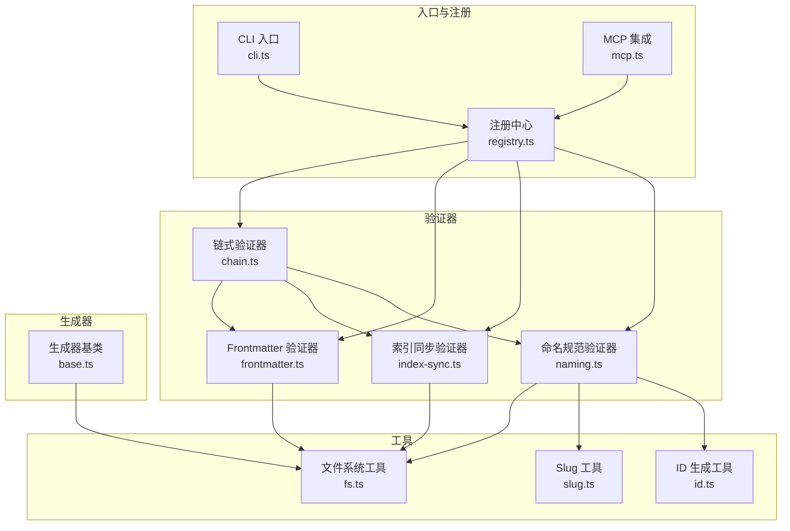
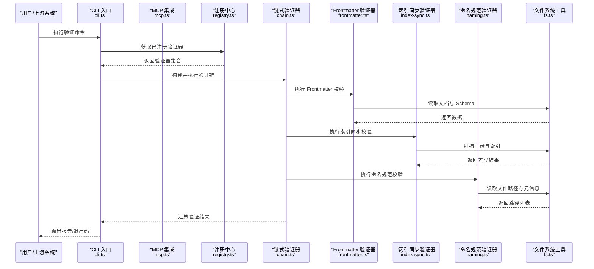
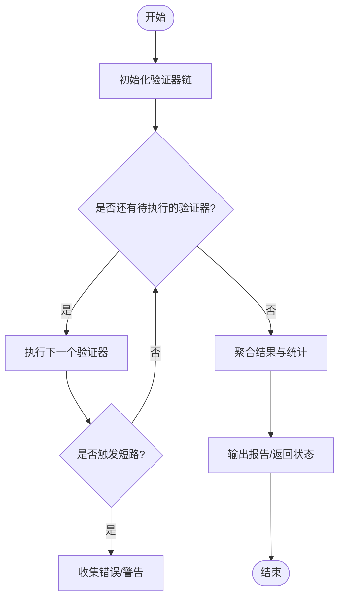
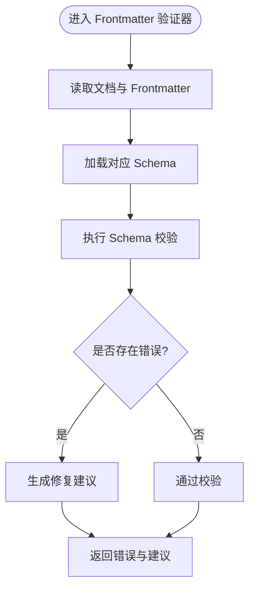
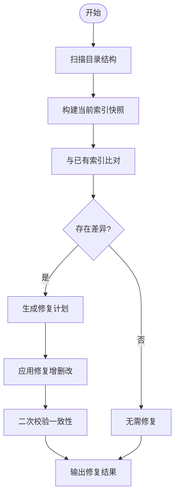
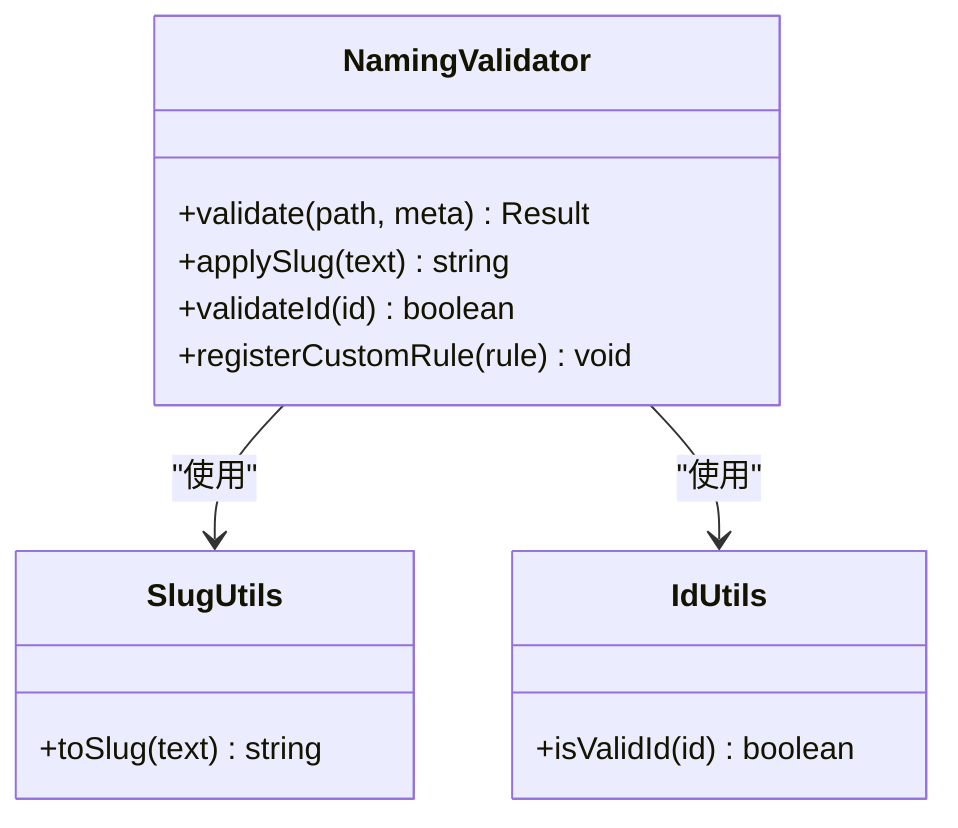
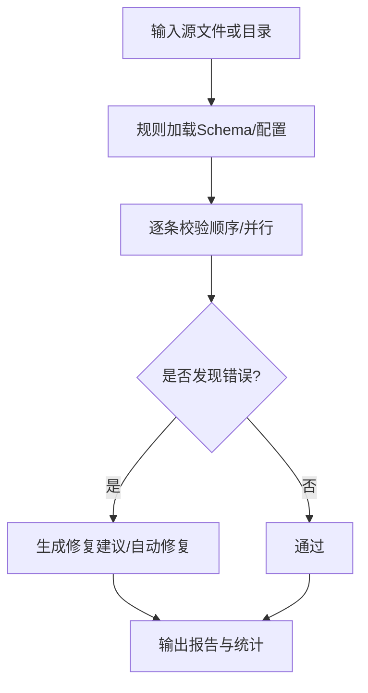
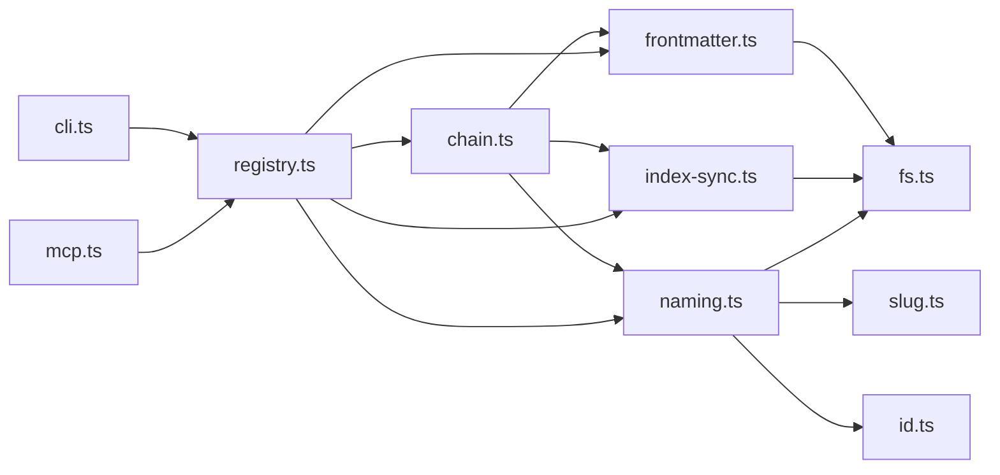

# 验证器详解

<cite>
**本文引用的文件**   
- [chain.ts](file://skills/shared/engineering-docs/scripts/src/validators/chain.ts)
- [frontmatter.ts](file://skills/shared/engineering-docs/scripts/src/validators/frontmatter.ts)
- [index-sync.ts](file://skills/shared/engineering-docs/scripts/src/validators/index-sync.ts)
- [naming.ts](file://skills/shared/engineering-docs/scripts/src/validators/naming.ts)
- [cli.ts](file://skills/shared/engineering-docs/scripts/src/cli.ts)
- [registry.ts](file://skills/shared/engineering-docs/scripts/src/registry.ts)
- [mcp.ts](file://skills/shared/engineering-docs/scripts/src/mcp.ts)
- [fs.ts](file://skills/shared/engineering-docs/scripts/src/utils/fs.ts)
- [id.ts](file://skills/shared/engineering-docs/scripts/src/utils/id.ts)
- [slug.ts](file://skills/shared/engineering-docs/scripts/src/utils/slug.ts)
- [base.ts](file://skills/shared/engineering-docs/scripts/src/generators/base.ts)
- [package.json](file://skills/shared/engineering-docs/scripts/package.json)
- [tsconfig.json](file://skills/shared/engineering-docs/scripts/tsconfig.json)
- [vitest.config.ts](file://skills/shared/engineering-docs/scripts/vitest.config.ts)
- [chain.test.ts](file://skills/shared/engineering-docs/scripts/src/__tests__/chain.test.ts)
- [generators.test.ts](file://skills/shared/engineering-docs/scripts/src/__tests__/generators.test.ts)
- [validators.test.ts](file://skills/shared/engineering-docs/scripts/src/__tests__/validators.test.ts)
</cite>

## 目录
1. [简介](#简介)
2. [项目结构](#项目结构)
3. [核心组件](#核心组件)
4. [架构总览](#架构总览)
5. [详细组件分析](#详细组件分析)
6. [依赖关系分析](#依赖关系分析)
7. [性能考虑](#性能考虑)
8. [故障排查指南](#故障排查指南)
9. [结论](#结论)
10. [附录](#附录)

## 简介
本文件面向“工程文档脚本”中的验证器子系统，系统性阐述链式验证器的架构与执行流程，并深入解析以下内置验证器：
- Frontmatter 验证器：规则配置与数据校验逻辑
- 索引同步验证器：文件一致性检查与自动修复
- 命名规范验证器：命名规则与自定义扩展方法

同时提供验证器开发指南、插件化扩展机制、规则编写规范与测试方法，以及性能优化与并行处理最佳实践和常见错误排查方案。

## 项目结构
验证器子系统位于 engineering-docs/scripts 目录下，采用“按功能分层 + 工具复用”的组织方式：
- validators：验证器实现（链式编排、Frontmatter、索引同步、命名规范）
- utils：通用工具（文件系统、ID 生成、Slug 处理）
- generators：模板与内容生成基类（供验证器或相关能力复用）
- cli / mcp / registry：入口与注册中心（CLI 命令、MCP 集成、验证器注册）
- __tests__：单元测试（链式、生成器、验证器）

图表来源
- [chain.ts:1-200](file://skills/shared/engineering-docs/scripts/src/validators/chain.ts#L1-L200)
- [frontmatter.ts:1-200](file://skills/shared/engineering-docs/scripts/src/validators/frontmatter.ts#L1-L200)
- [index-sync.ts:1-200](file://skills/shared/engineering-docs/scripts/src/validators/index-sync.ts#L1-L200)
- [naming.ts:1-200](file://skills/shared/engineering-docs/scripts/src/validators/naming.ts#L1-L200)
- [cli.ts:1-200](file://skills/shared/engineering-docs/scripts/src/cli.ts#L1-L200)
- [mcp.ts:1-200](file://skills/shared/engineering-docs/scripts/src/mcp.ts#L1-L200)
- [registry.ts:1-200](file://skills/shared/engineering-docs/scripts/src/registry.ts#L1-L200)
- [fs.ts:1-200](file://skills/shared/engineering-docs/scripts/src/utils/fs.ts#L1-L200)
- [id.ts:1-200](file://skills/shared/engineering-docs/scripts/src/utils/id.ts#L1-L200)
- [slug.ts:1-200](file://skills/shared/engineering-docs/scripts/src/utils/slug.ts#L1-L200)
- [base.ts:1-200](file://skills/shared/engineering-docs/scripts/src/generators/base.ts#L1-L200)

章节来源
- [package.json:1-200](file://skills/shared/engineering-docs/scripts/package.json#L1-L200)
- [tsconfig.json:1-200](file://skills/shared/engineering-docs/scripts/tsconfig.json#L1-L200)

## 核心组件
- 链式验证器：负责将多个验证器串联执行，支持短路、顺序控制与结果聚合。
- Frontmatter 验证器：基于 schema 对文档头部元数据进行类型与必填校验，并提供可插拔的规则扩展点。
- 索引同步验证器：对比目录结构与索引文件，检测缺失/多余条目，支持自动修复写入。
- 命名规范验证器：依据约定对文件名、模块名等进行规范化检查，并提供自定义扩展方法以适配业务规则。

章节来源
- [chain.ts:1-200](file://skills/shared/engineering-docs/scripts/src/validators/chain.ts#L1-L200)
- [frontmatter.ts:1-200](file://skills/shared/engineering-docs/scripts/src/validators/frontmatter.ts#L1-L200)
- [index-sync.ts:1-200](file://skills/shared/engineering-docs/scripts/src/validators/index-sync.ts#L1-L200)
- [naming.ts:1-200](file://skills/shared/engineering-docs/scripts/src/validators/naming.ts#L1-L200)

## 架构总览
验证器子系统通过注册中心统一暴露能力，CLI/MCP 作为外部入口调用链式验证器，链式验证器依次调度各具体验证器。工具层提供文件系统、ID、Slug 等基础能力；生成器基类为内容生成提供通用抽象。

图表来源
- [cli.ts:1-200](file://skills/shared/engineering-docs/scripts/src/cli.ts#L1-L200)
- [mcp.ts:1-200](file://skills/shared/engineering-docs/scripts/src/mcp.ts#L1-L200)
- [registry.ts:1-200](file://skills/shared/engineering-docs/scripts/src/registry.ts#L1-L200)
- [chain.ts:1-200](file://skills/shared/engineering-docs/scripts/src/validators/chain.ts#L1-L200)
- [frontmatter.ts:1-200](file://skills/shared/engineering-docs/scripts/src/validators/frontmatter.ts#L1-L200)
- [index-sync.ts:1-200](file://skills/shared/engineering-docs/scripts/src/validators/index-sync.ts#L1-L200)
- [naming.ts:1-200](file://skills/shared/engineering-docs/scripts/src/validators/naming.ts#L1-L200)
- [fs.ts:1-200](file://skills/shared/engineering-docs/scripts/src/utils/fs.ts#L1-L200)

## 详细组件分析

### 链式验证器（Chain Validator）
职责与特性
- 将多个验证器按顺序组合执行，支持短路策略与结果聚合。
- 提供统一的错误收集与统计接口，便于上层输出报告。
- 可扩展：新增验证器后只需在注册中心登记即可参与链式执行。

关键流程
- 初始化阶段：加载注册表，构建验证器实例数组。
- 执行阶段：逐个调用验证器，根据配置决定是否继续后续验证器。
- 收尾阶段：汇总错误、警告与修复建议，返回结构化结果。

图表来源
- [chain.ts:1-200](file://skills/shared/engineering-docs/scripts/src/validators/chain.ts#L1-L200)

章节来源
- [chain.ts:1-200](file://skills/shared/engineering-docs/scripts/src/validators/chain.ts#L1-L200)

### Frontmatter 验证器
职责与特性
- 基于 JSON Schema 对 Markdown 文档的 Frontmatter 进行强类型校验。
- 支持必填字段、枚举值、格式约束与自定义规则扩展。
- 提供友好的错误定位与修复建议（如缺失字段提示）。

规则配置与校验逻辑
- 规则来源：从 schemas 目录加载对应类型的 Schema 定义。
- 校验过程：解析 Frontmatter -> 应用 Schema 校验 -> 收集错误 -> 生成修复建议。
- 扩展点：允许注入自定义校验函数，覆盖特定字段的业务规则。

图表来源
- [frontmatter.ts:1-200](file://skills/shared/engineering-docs/scripts/src/validators/frontmatter.ts#L1-L200)
- [fs.ts:1-200](file://skills/shared/engineering-docs/scripts/src/utils/fs.ts#L1-L200)

章节来源
- [frontmatter.ts:1-200](file://skills/shared/engineering-docs/scripts/src/validators/frontmatter.ts#L1-L200)
- [fs.ts:1-200](file://skills/shared/engineering-docs/scripts/src/utils/fs.ts#L1-L200)

### 索引同步验证器
职责与特性
- 对比目录结构与索引文件，检测缺失条目、多余条目与不一致项。
- 支持自动修复：增量更新索引，确保索引与实际文件一致。
- 提供幂等修复策略，避免重复写入与冲突。

一致性检查与自动修复流程
- 扫描阶段：遍历目标目录，收集文件清单。
- 比对阶段：与现有索引逐项比对，计算差异集。
- 修复阶段：按需写入新增/删除项，保持索引一致。

图表来源
- [index-sync.ts:1-200](file://skills/shared/engineering-docs/scripts/src/validators/index-sync.ts#L1-L200)
- [fs.ts:1-200](file://skills/shared/engineering-docs/scripts/src/utils/fs.ts#L1-L200)

章节来源
- [index-sync.ts:1-200](file://skills/shared/engineering-docs/scripts/src/validators/index-sync.ts#L1-L200)
- [fs.ts:1-200](file://skills/shared/engineering-docs/scripts/src/utils/fs.ts#L1-L200)

### 命名规范验证器
职责与特性
- 依据工程规范对文件名、模块名等进行一致性检查。
- 支持 Slug 标准化与 ID 格式校验，保证资源标识唯一性与可读性。
- 提供自定义扩展方法，允许团队按需追加命名规则。

命名规则与扩展机制
- 内置规则：文件名大小写、分隔符、前缀/后缀约定、禁止字符等。
- Slug 处理：将标题或名称转换为标准 Slug，用于 URL 友好路径。
- ID 校验：确保 ID 符合长度、字符集与唯一性要求。
- 扩展点：注册自定义命名规则函数，按文件类型或路径模式匹配执行。

图表来源
- [naming.ts:1-200](file://skills/shared/engineering-docs/scripts/src/validators/naming.ts#L1-L200)
- [slug.ts:1-200](file://skills/shared/engineering-docs/scripts/src/utils/slug.ts#L1-L200)
- [id.ts:1-200](file://skills/shared/engineering-docs/scripts/src/utils/id.ts#L1-L200)

章节来源
- [naming.ts:1-200](file://skills/shared/engineering-docs/scripts/src/validators/naming.ts#L1-L200)
- [slug.ts:1-200](file://skills/shared/engineering-docs/scripts/src/utils/slug.ts#L1-L200)
- [id.ts:1-200](file://skills/shared/engineering-docs/scripts/src/utils/id.ts#L1-L200)

### 概念性概览
下图展示一个通用的验证工作流，适用于多种场景（不限于代码仓库）：

[此图为概念性流程图，不直接映射到具体源码文件]

## 依赖关系分析
- 内部依赖
  - 链式验证器依赖所有具体验证器，并通过注册中心动态装配。
  - 各验证器依赖文件系统工具进行 I/O 操作；命名规范验证器额外依赖 Slug 与 ID 工具。
  - 生成器基类与工具层解耦，便于复用。
- 外部依赖
  - 通过 package.json 声明运行时与开发时依赖（如测试框架、类型检查等）。
  - tsconfig.json 管理编译选项与路径别名。

图表来源
- [chain.ts:1-200](file://skills/shared/engineering-docs/scripts/src/validators/chain.ts#L1-L200)
- [frontmatter.ts:1-200](file://skills/shared/engineering-docs/scripts/src/validators/frontmatter.ts#L1-L200)
- [index-sync.ts:1-200](file://skills/shared/engineering-docs/scripts/src/validators/index-sync.ts#L1-L200)
- [naming.ts:1-200](file://skills/shared/engineering-docs/scripts/src/validators/naming.ts#L1-L200)
- [fs.ts:1-200](file://skills/shared/engineering-docs/scripts/src/utils/fs.ts#L1-L200)
- [slug.ts:1-200](file://skills/shared/engineering-docs/scripts/src/utils/slug.ts#L1-L200)
- [id.ts:1-200](file://skills/shared/engineering-docs/scripts/src/utils/id.ts#L1-L200)
- [cli.ts:1-200](file://skills/shared/engineering-docs/scripts/src/cli.ts#L1-L200)
- [mcp.ts:1-200](file://skills/shared/engineering-docs/scripts/src/mcp.ts#L1-L200)
- [registry.ts:1-200](file://skills/shared/engineering-docs/scripts/src/registry.ts#L1-L200)

章节来源
- [package.json:1-200](file://skills/shared/engineering-docs/scripts/package.json#L1-L200)
- [tsconfig.json:1-200](file://skills/shared/engineering-docs/scripts/tsconfig.json#L1-L200)

## 性能考虑
- 并行处理
  - 对无副作用的验证器（如命名规范、Frontmatter）可采用并发执行，提升吞吐。
  - 对涉及文件写入的验证器（如索引同步）需串行或加锁，避免竞态条件。
- 短路策略
  - 在链式验证中，严重错误可触发短路，减少不必要的后续校验。
- I/O 优化
  - 批量读取与缓存目录树，减少重复 stat/readdir 开销。
  - 对大文件采用流式读取，降低内存峰值。
- 结果聚合
  - 使用增量聚合器记录错误与统计，避免频繁对象创建。

[本节为通用性能指导，不直接分析具体文件]

## 故障排查指南
- Frontmatter 校验失败
  - 现象：缺少必填字段、类型不匹配、枚举值非法。
  - 排查：查看错误定位信息与修复建议；确认 Schema 版本与文档类型一致。
  - 参考路径：[frontmatter.ts:1-200](file://skills/shared/engineering-docs/scripts/src/validators/frontmatter.ts#L1-L200)
- 索引不一致
  - 现象：索引中存在多余或缺失条目。
  - 排查：运行索引同步验证器并启用自动修复；核对目录变更历史。
  - 参考路径：[index-sync.ts:1-200](file://skills/shared/engineering-docs/scripts/src/validators/index-sync.ts#L1-L200)
- 命名不规范
  - 现象：文件名包含非法字符、大小写不一致、Slug 不符合约定。
  - 排查：使用命名规范验证器输出违规清单；按建议重命名。
  - 参考路径：[naming.ts:1-200](file://skills/shared/engineering-docs/scripts/src/validators/naming.ts#L1-L200)
- 链式执行异常
  - 现象：某验证器抛出未捕获异常导致链中断。
  - 排查：检查该验证器错误边界与日志；确认注册中心是否正确登记。
  - 参考路径：[chain.ts:1-200](file://skills/shared/engineering-docs/scripts/src/validators/chain.ts#L1-L200)

章节来源
- [frontmatter.ts:1-200](file://skills/shared/engineering-docs/scripts/src/validators/frontmatter.ts#L1-L200)
- [index-sync.ts:1-200](file://skills/shared/engineering-docs/scripts/src/validators/index-sync.ts#L1-L200)
- [naming.ts:1-200](file://skills/shared/engineering-docs/scripts/src/validators/naming.ts#L1-L200)
- [chain.ts:1-200](file://skills/shared/engineering-docs/scripts/src/validators/chain.ts#L1-L200)

## 结论
验证器子系统通过链式编排与注册中心实现了高内聚、低耦合的可扩展验证能力。Frontmatter、索引同步与命名规范三大验证器覆盖了文档质量、索引一致性与命名约定的核心需求。结合并行处理、短路策略与自动修复，可在保证正确性的同时提升效率。遵循本文的开发指南与测试方法，可快速扩展新的验证器以满足更多业务场景。

## 附录

### 验证器开发指南
- 新建验证器
  - 在 validators 目录创建新文件，实现统一的验证接口（输入：文件/路径/元信息；输出：结果/错误/修复建议）。
  - 在注册中心登记验证器，使其参与链式执行。
- 插件化扩展
  - 通过注册中心动态加载验证器，支持热插拔与按需启用。
  - 对外暴露配置项，允许关闭/开启特定验证器或调整行为。
- 规则编写规范
  - 明确输入输出契约，错误信息需包含位置、原因与修复建议。
  - 对 I/O 操作进行错误边界保护，避免影响其他验证器。
- 测试方法
  - 使用 vitest 编写单测，覆盖正常路径、异常路径与边界条件。
  - 针对 I/O 敏感逻辑，使用临时目录与 Mock 文件系统。
  - 参考测试文件：
    - [chain.test.ts:1-200](file://skills/shared/engineering-docs/scripts/src/__tests__/chain.test.ts#L1-L200)
    - [validators.test.ts:1-200](file://skills/shared/engineering-docs/scripts/src/__tests__/validators.test.ts#L1-L200)
    - [generators.test.ts:1-200](file://skills/shared/engineering-docs/scripts/src/__tests__/generators.test.ts#L1-L200)
- 配置与环境
  - 通过 package.json 管理依赖与脚本命令。
  - 使用 tsconfig.json 配置编译选项与路径别名。
  - 使用 vitest.config.ts 配置测试环境与覆盖率。

章节来源
- [registry.ts:1-200](file://skills/shared/engineering-docs/scripts/src/registry.ts#L1-L200)
- [chain.test.ts:1-200](file://skills/shared/engineering-docs/scripts/src/__tests__/chain.test.ts#L1-L200)
- [validators.test.ts:1-200](file://skills/shared/engineering-docs/scripts/src/__tests__/validators.test.ts#L1-L200)
- [generators.test.ts:1-200](file://skills/shared/engineering-docs/scripts/src/__tests__/generators.test.ts#L1-L200)
- [package.json:1-200](file://skills/shared/engineering-docs/scripts/package.json#L1-L200)
- [tsconfig.json:1-200](file://skills/shared/engineering-docs/scripts/tsconfig.json#L1-L200)
- [vitest.config.ts:1-200](file://skills/shared/engineering-docs/scripts/vitest.config.ts#L1-L200)