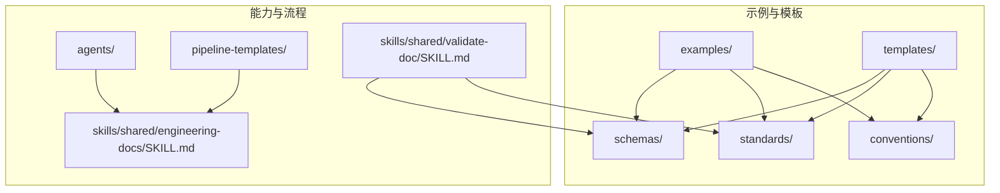
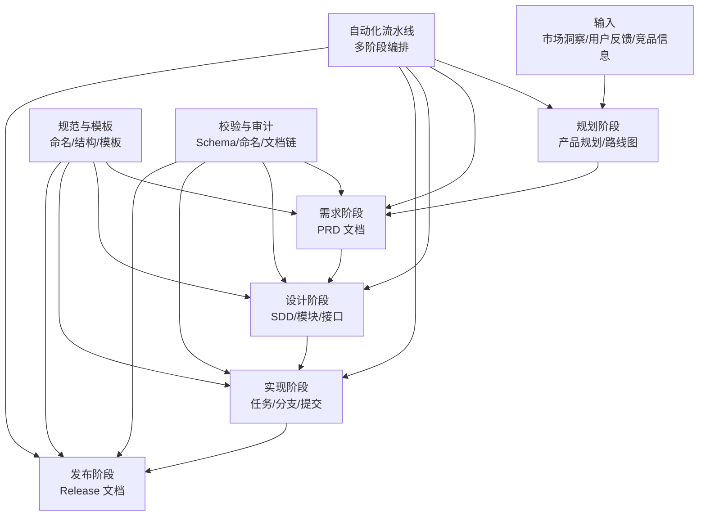
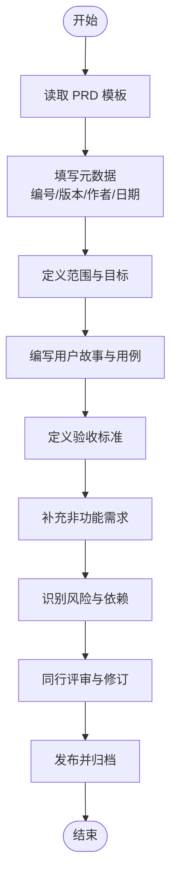
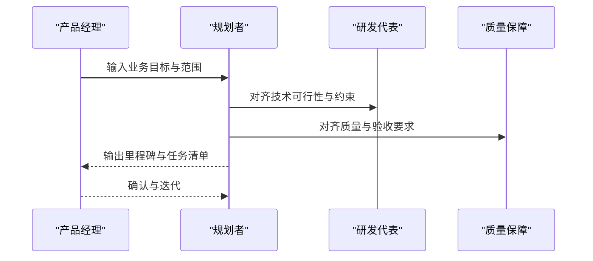
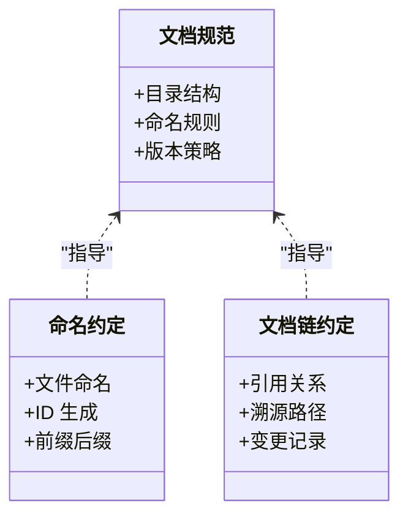
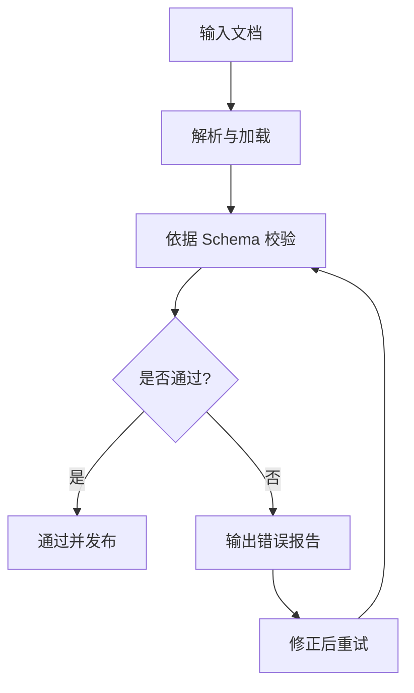
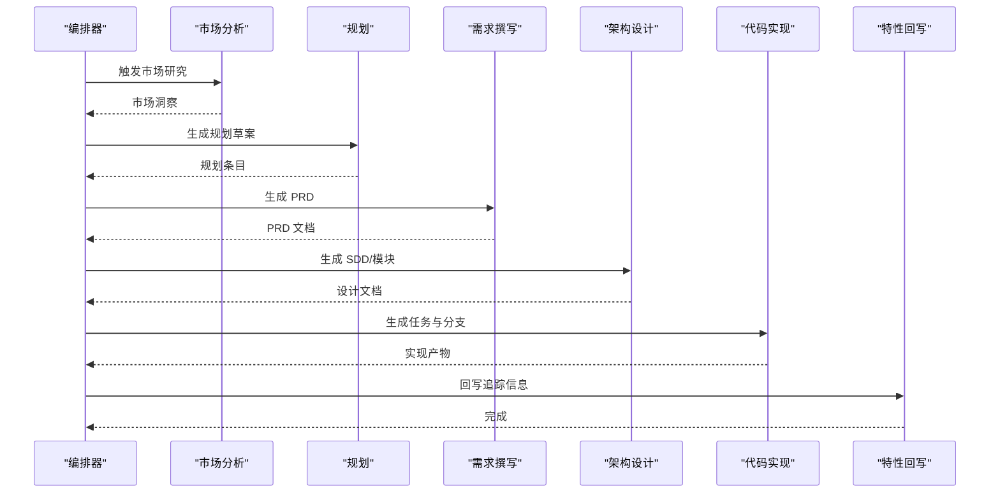
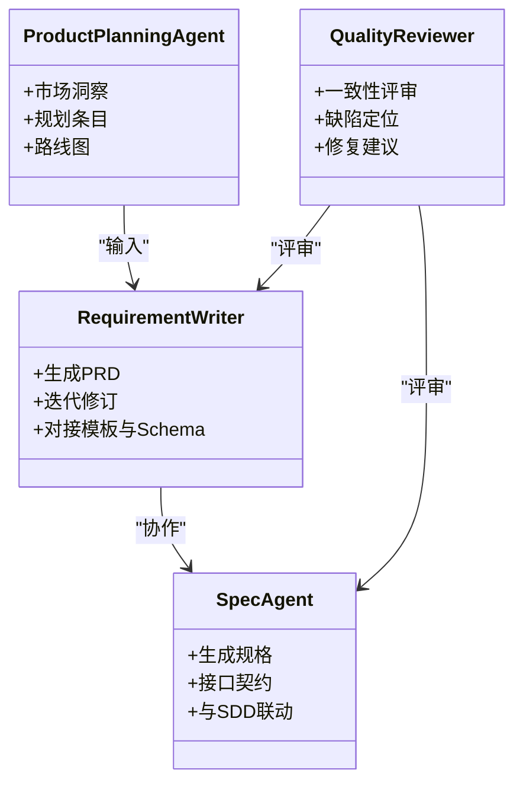
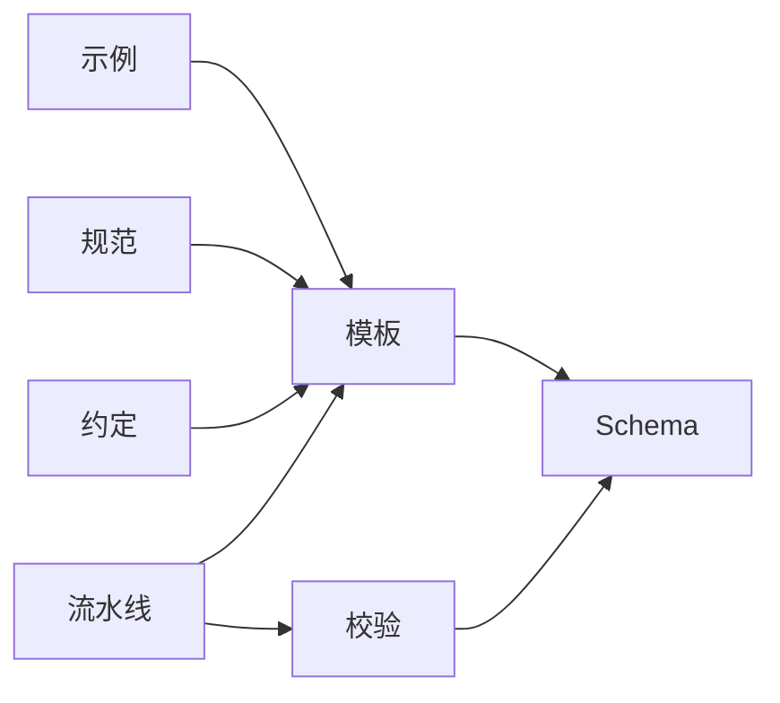

# 示例文档参考

<cite>
**本文引用的文件**   
- [PRD-001-sample-login.md](file://skills/shared/engineering-docs/examples/PRD-001-sample-login.md)
- [PLAN-v1.0-001-sample-mvp.md](file://skills/shared/engineering-docs/examples/PLAN-v1.0-001-sample-mvp.md)
- [README.md](file://skills/shared/engineering-docs/examples/README.md)
- [prd.schema.json](file://skills/shared/engineering-docs/schemas/prd.schema.json)
- [plan.schema.json](file://skills/shared/engineering-docs/schemas/plan.schema.json)
- [PRD-template.md](file://skills/shared/engineering-docs/templates/PRD-template.md)
- [PLAN-template.md](file://skills/shared/engineering-docs/templates/PLAN-template.md)
- [MODULE-template.md](file://skills/shared/engineering-docs/templates/MODULE-template.md)
- [FORM-template.md](file://skills/shared/engineering-docs/templates/FORM-template.md)
- [SDD-template.md](file://skills/shared/engineering-docs/templates/SDD-template.md)
- [RELEASE-template.md](file://skills/shared/engineering-docs/templates/RELEASE-template.md)
- [TASK-template.md](file://skills/shared/engineering-docs/templates/TASK-template.md)
- [OpenAPI-template.yaml](file://skills/shared/engineering-docs/templates/OpenAPI-template.yaml)
- [ENGINEERING-STRUCTURE-TEAM.md](file://skills/shared/engineering-docs/standards/ENGINEERING-STRUCTURE-TEAM.md)
- [doc-chain.yaml](file://skills/shared/engineering-docs/conventions/doc-chain.yaml)
- [naming.yaml](file://skills/shared/engineering-docs/conventions/naming.yaml)
- [SKILL.md](file://skills/shared/engineering-docs/SKILL.md)
- [validate-doc SKILL.md](file://skills/shared/validate-doc/SKILL.md)
- [requirement-writer.md](file://agents/requirement-writer.md)
- [spec-agent.md](file://agents/spec-agent.md)
- [product-planning-agent.md](file://agents/product-planning-agent.md)
- [quality-reviewer-agent.md](file://agents/quality-reviewer-agent.md)
- [pipeline README.md](file://pipeline-templates/README.md)
- [architecture-design.pipeline.json](file://pipeline-templates/architecture-design.pipeline.json)
- [code-implementation.pipeline.json](file://pipeline-templates/code-implementation.pipeline.json)
- [feature-writeback.pipeline.json](file://pipeline-templates/feature-writeback.pipeline.json)
- [market-to-plan.pipeline.json](file://pipeline-templates/market-to-plan.pipeline.json)
- [product-planning.pipeline.json](file://pipeline-templates/product-planning.pipeline.json)
- [requirement-authoring.pipeline.json](file://pipeline-templates/requirement-authoring.pipeline.json)
</cite>

## 目录
1. [引言](#引言)
2. [项目结构](#项目结构)
3. [核心组件](#核心组件)
4. [架构总览](#架构总览)
5. [详细组件分析](#详细组件分析)
6. [依赖关系分析](#依赖关系分析)
7. [性能与可维护性考虑](#性能与可维护性考虑)
8. [故障排查指南](#故障排查指南)
9. [结论](#结论)
10. [附录](#附录)

## 引言
本文件面向希望快速掌握高质量工程文档编写与管理的读者，提供一套完整的“示例文档参考”学习材料。内容覆盖：
- 高质量的 PRD、计划（PLAN）等示例文档的结构拆解与写作技巧
- 模板与模式：如何基于模板快速生成标准化文档
- 最佳实践与设计模式：命名规范、文档链、版本化与校验
- 不同场景下的文档范例与模板选择建议
- 常见问题与修改建议、质量评估标准与方法

目标是帮助团队在统一规范下高效产出一致、可追溯、可验证的文档资产。

## 项目结构
仓库围绕“工程文档体系”组织，包含示例、模板、规范、约定、校验工具与自动化流水线等关键要素。下图展示与文档相关的核心目录与文件关系。

图示来源
- [README.md](file://skills/shared/engineering-docs/examples/README.md)
- [PRD-template.md](file://skills/shared/engineering-docs/templates/PRD-template.md)
- [PLAN-template.md](file://skills/shared/engineering-docs/templates/PLAN-template.md)
- [ENGINEERING-STRUCTURE-TEAM.md](file://skills/shared/engineering-docs/standards/ENGINEERING-STRUCTURE-TEAM.md)
- [doc-chain.yaml](file://skills/shared/engineering-docs/conventions/doc-chain.yaml)
- [naming.yaml](file://skills/shared/engineering-docs/conventions/naming.yaml)
- [prd.schema.json](file://skills/shared/engineering-docs/schemas/prd.schema.json)
- [plan.schema.json](file://skills/shared/engineering-docs/schemas/plan.schema.json)
- [SKILL.md](file://skills/shared/engineering-docs/SKILL.md)
- [validate-doc SKILL.md](file://skills/shared/validate-doc/SKILL.md)

章节来源
- [README.md](file://skills/shared/engineering-docs/examples/README.md)
- [SKILL.md](file://skills/shared/engineering-docs/SKILL.md)

## 核心组件
- 示例文档
  - PRD 示例：用于演示产品需求文档的结构、字段与表达范式
  - PLAN 示例：用于演示研发计划的结构、里程碑与任务分解方式
- 模板与规范
  - 模板：PRD、PLAN、模块、表单、SDD、发布、任务、OpenAPI 等
  - 规范：工程结构团队规范、命名约定、文档链约定
- 校验与约束
  - Schema：PRD、PLAN 等文档结构的 JSON Schema 定义
  - 校验技能：对文档进行结构与命名一致性检查
- 自动化与编排
  - 流水线模板：从市场分析到规划、需求撰写、架构设计、代码实现、特性回写等端到端流程
  - Agent 能力：需求撰写、规格说明、产品规划、质量评审等角色化能力

章节来源
- [PRD-001-sample-login.md](file://skills/shared/engineering-docs/examples/PRD-001-sample-login.md)
- [PLAN-v1.0-001-sample-mvp.md](file://skills/shared/engineering-docs/examples/PLAN-v1.0-001-sample-mvp.md)
- [PRD-template.md](file://skills/shared/engineering-docs/templates/PRD-template.md)
- [PLAN-template.md](file://skills/shared/engineering-docs/templates/PLAN-template.md)
- [MODULE-template.md](file://skills/shared/engineering-docs/templates/MODULE-template.md)
- [FORM-template.md](file://skills/shared/engineering-docs/templates/FORM-template.md)
- [SDD-template.md](file://skills/shared/engineering-docs/templates/SDD-template.md)
- [RELEASE-template.md](file://skills/shared/engineering-docs/templates/RELEASE-template.md)
- [TASK-template.md](file://skills/shared/engineering-docs/templates/TASK-template.md)
- [OpenAPI-template.yaml](file://skills/shared/engineering-docs/templates/OpenAPI-template.yaml)
- [ENGINEERING-STRUCTURE-TEAM.md](file://skills/shared/engineering-docs/standards/ENGINEERING-STRUCTURE-TEAM.md)
- [doc-chain.yaml](file://skills/shared/engineering-docs/conventions/doc-chain.yaml)
- [naming.yaml](file://skills/shared/engineering-docs/conventions/naming.yaml)
- [prd.schema.json](file://skills/shared/engineering-docs/schemas/prd.schema.json)
- [plan.schema.json](file://skills/shared/engineering-docs/schemas/plan.schema.json)
- [SKILL.md](file://skills/shared/engineering-docs/SKILL.md)
- [validate-doc SKILL.md](file://skills/shared/validate-doc/SKILL.md)
- [pipeline README.md](file://pipeline-templates/README.md)
- [architecture-design.pipeline.json](file://pipeline-templates/architecture-design.pipeline.json)
- [code-implementation.pipeline.json](file://pipeline-templates/code-implementation.pipeline.json)
- [feature-writeback.pipeline.json](file://pipeline-templates/feature-writeback.pipeline.json)
- [market-to-plan.pipeline.json](file://pipeline-templates/market-to-plan.pipeline.json)
- [product-planning.pipeline.json](file://pipeline-templates/product-planning.pipeline.json)
- [requirement-authoring.pipeline.json](file://pipeline-templates/requirement-authoring.pipeline.json)
- [requirement-writer.md](file://agents/requirement-writer.md)
- [spec-agent.md](file://agents/spec-agent.md)
- [product-planning-agent.md](file://agents/product-planning-agent.md)
- [quality-reviewer-agent.md](file://agents/quality-reviewer-agent.md)

## 架构总览
下图展示了“文档生产与治理”的整体架构：以模板与规范为基座，通过示例与 Schema 约束，结合校验技能与流水线编排，形成从输入到产出的闭环。

图示来源
- [pipeline README.md](file://pipeline-templates/README.md)
- [product-planning.pipeline.json](file://pipeline-templates/product-planning.pipeline.json)
- [requirement-authoring.pipeline.json](file://pipeline-templates/requirement-authoring.pipeline.json)
- [architecture-design.pipeline.json](file://pipeline-templates/architecture-design.pipeline.json)
- [code-implementation.pipeline.json](file://pipeline-templates/code-implementation.pipeline.json)
- [feature-writeback.pipeline.json](file://pipeline-templates/feature-writeback.pipeline.json)
- [market-to-plan.pipeline.json](file://pipeline-templates/market-to-plan.pipeline.json)
- [ENGINEERING-STRUCTURE-TEAM.md](file://skills/shared/engineering-docs/standards/ENGINEERING-STRUCTURE-TEAM.md)
- [doc-chain.yaml](file://skills/shared/engineering-docs/conventions/doc-chain.yaml)
- [naming.yaml](file://skills/shared/engineering-docs/conventions/naming.yaml)
- [prd.schema.json](file://skills/shared/engineering-docs/schemas/prd.schema.json)
- [plan.schema.json](file://skills/shared/engineering-docs/schemas/plan.schema.json)

## 详细组件分析

### PRD 示例与模板
- 示例要点
  - 结构化字段：背景、目标、范围、用户故事、验收标准、非功能需求、风险与依赖、版本与变更历史
  - 表达范式：问题-方案-收益-度量；用例-前置条件-预期结果
  - 可追溯性：与需求注册表、任务、测试用例的关联
- 模板要点
  - 固定头部元数据：标题、编号、版本、作者、日期、状态
  - 章节顺序与必填项提示
  - 与 Schema 对齐的字段约束
- 最佳实践
  - 单一事实源：PRD 作为需求唯一权威来源
  - 增量演进：按版本记录变更，避免歧义
  - 指标驱动：明确成功度量与验收门槛
- 常见误区与建议
  - 缺失验收标准：补充可测试的验收条目
  - 范围不清：增加边界与排除项
  - 未标注依赖：显式列出外部依赖与风险缓解

图示来源
- [PRD-template.md](file://skills/shared/engineering-docs/templates/PRD-template.md)
- [PRD-001-sample-login.md](file://skills/shared/engineering-docs/examples/PRD-001-sample-login.md)
- [prd.schema.json](file://skills/shared/engineering-docs/schemas/prd.schema.json)

章节来源
- [PRD-001-sample-login.md](file://skills/shared/engineering-docs/examples/PRD-001-sample-login.md)
- [PRD-template.md](file://skills/shared/engineering-docs/templates/PRD-template.md)
- [prd.schema.json](file://skills/shared/engineering-docs/schemas/prd.schema.json)

### 计划（PLAN）示例与模板
- 示例要点
  - 目标与范围：MVP 范围、关键假设、成功指标
  - 里程碑与时间线：阶段划分、交付物、依赖关系
  - 资源与风险：人员、预算、技术风险与应对策略
- 模板要点
  - 固定头部元数据与版本控制
  - 里程碑表格、任务分解、责任矩阵
  - 与 PRD 的引用关系，确保双向追溯
- 最佳实践
  - 自上而下规划：先目标后任务，再细化到任务级
  - 可视化呈现：甘特图或看板辅助沟通
  - 滚动式更新：定期复盘与调整
- 常见误区与建议
  - 过度乐观排期：引入缓冲与不确定性管理
  - 忽略依赖：显式标注内外部依赖与前置条件

图示来源
- [PLAN-template.md](file://skills/shared/engineering-docs/templates/PLAN-template.md)
- [PLAN-v1.0-001-sample-mvp.md](file://skills/shared/engineering-docs/examples/PLAN-v1.0-001-sample-mvp.md)
- [plan.schema.json](file://skills/shared/engineering-docs/schemas/plan.schema.json)

章节来源
- [PLAN-v1.0-001-sample-mvp.md](file://skills/shared/engineering-docs/examples/PLAN-v1.0-001-sample-mvp.md)
- [PLAN-template.md](file://skills/shared/engineering-docs/templates/PLAN-template.md)
- [plan.schema.json](file://skills/shared/engineering-docs/schemas/plan.schema.json)

### 其他文档模板族
- 模块（MODULE）：描述系统/子系统职责、边界、接口与依赖
- 表单（FORM）：结构化数据采集与审批流
- 软件设计文档（SDD）：架构决策、模块设计、接口契约
- 发布（RELEASE）：版本范围、变更摘要、回滚策略、上线检查单
- 任务（TASK）：任务描述、验收标准、工作量估算、依赖与阻塞项
- OpenAPI：接口契约模板，便于前后端协同与自动化生成

章节来源
- [MODULE-template.md](file://skills/shared/engineering-docs/templates/MODULE-template.md)
- [FORM-template.md](file://skills/shared/engineering-docs/templates/FORM-template.md)
- [SDD-template.md](file://skills/shared/engineering-docs/templates/SDD-template.md)
- [RELEASE-template.md](file://skills/shared/engineering-docs/templates/RELEASE-template.md)
- [TASK-template.md](file://skills/shared/engineering-docs/templates/TASK-template.md)
- [OpenAPI-template.yaml](file://skills/shared/engineering-docs/templates/OpenAPI-template.yaml)

### 规范与约定
- 工程结构团队规范：文档分类、目录组织、命名规则、版本策略
- 命名约定：文件与目录命名、ID 生成、前缀与后缀规范
- 文档链约定：文档间引用关系、溯源路径、变更记录

图示来源
- [ENGINEERING-STRUCTURE-TEAM.md](file://skills/shared/engineering-docs/standards/ENGINEERING-STRUCTURE-TEAM.md)
- [naming.yaml](file://skills/shared/engineering-docs/conventions/naming.yaml)
- [doc-chain.yaml](file://skills/shared/engineering-docs/conventions/doc-chain.yaml)

章节来源
- [ENGINEERING-STRUCTURE-TEAM.md](file://skills/shared/engineering-docs/standards/ENGINEERING-STRUCTURE-TEAM.md)
- [naming.yaml](file://skills/shared/engineering-docs/conventions/naming.yaml)
- [doc-chain.yaml](file://skills/shared/engineering-docs/conventions/doc-chain.yaml)

### 校验与约束（Schema 与校验技能）
- Schema 校验：使用 JSON Schema 对 PRD、PLAN 等文档结构进行强约束，确保必填字段、类型与枚举值正确
- 校验技能：提供统一的校验入口，支持批量检查、错误定位与修复建议
- 集成点：可在流水线中作为门禁步骤，阻止不合规文档合并

图示来源
- [prd.schema.json](file://skills/shared/engineering-docs/schemas/prd.schema.json)
- [plan.schema.json](file://skills/shared/engineering-docs/schemas/plan.schema.json)
- [validate-doc SKILL.md](file://skills/shared/validate-doc/SKILL.md)

章节来源
- [prd.schema.json](file://skills/shared/engineering-docs/schemas/prd.schema.json)
- [plan.schema.json](file://skills/shared/engineering-docs/schemas/plan.schema.json)
- [validate-doc SKILL.md](file://skills/shared/validate-doc/SKILL.md)

### 自动化流水线与编排
- 典型流水线
  - 市场分析到规划：将市场洞察转化为规划条目与路线图
  - 需求撰写：从输入到 PRD 成稿，自动填充模板与校验
  - 架构设计：从 PRD 到 SDD/模块设计，建立设计决策记录
  - 代码实现：从设计到任务分解、分支与提交
  - 特性回写：将实现与测试信息回写到文档与追踪系统
- 编排要点
  - 阶段解耦：每阶段有明确输入/输出与验收标准
  - 可观测性：日志、指标与产物归档
  - 失败恢复：断点续跑与人工介入点

图示来源
- [pipeline README.md](file://pipeline-templates/README.md)
- [market-to-plan.pipeline.json](file://pipeline-templates/market-to-plan.pipeline.json)
- [product-planning.pipeline.json](file://pipeline-templates/product-planning.pipeline.json)
- [requirement-authoring.pipeline.json](file://pipeline-templates/requirement-authoring.pipeline.json)
- [architecture-design.pipeline.json](file://pipeline-templates/architecture-design.pipeline.json)
- [code-implementation.pipeline.json](file://pipeline-templates/code-implementation.pipeline.json)
- [feature-writeback.pipeline.json](file://pipeline-templates/feature-writeback.pipeline.json)

章节来源
- [pipeline README.md](file://pipeline-templates/README.md)
- [market-to-plan.pipeline.json](file://pipeline-templates/market-to-plan.pipeline.json)
- [product-planning.pipeline.json](file://pipeline-templates/product-planning.pipeline.json)
- [requirement-authoring.pipeline.json](file://pipeline-templates/requirement-authoring.pipeline.json)
- [architecture-design.pipeline.json](file://pipeline-templates/architecture-design.pipeline.json)
- [code-implementation.pipeline.json](file://pipeline-templates/code-implementation.pipeline.json)
- [feature-writeback.pipeline.json](file://pipeline-templates/feature-writeback.pipeline.json)

### Agent 能力与角色
- 需求撰写 Agent：负责从输入到 PRD 的生成与迭代
- 规格说明 Agent：协助生成规格与接口契约
- 产品规划 Agent：整合市场与用户反馈，输出规划与路线图
- 质量评审 Agent：执行文档与实现的一致性评审

图示来源
- [requirement-writer.md](file://agents/requirement-writer.md)
- [spec-agent.md](file://agents/spec-agent.md)
- [product-planning-agent.md](file://agents/product-planning-agent.md)
- [quality-reviewer-agent.md](file://agents/quality-reviewer-agent.md)

章节来源
- [requirement-writer.md](file://agents/requirement-writer.md)
- [spec-agent.md](file://agents/spec-agent.md)
- [product-planning-agent.md](file://agents/product-planning-agent.md)
- [quality-reviewer-agent.md](file://agents/quality-reviewer-agent.md)

## 依赖关系分析
- 文档与模板：示例与模板共同构成“写法示范+结构约束”的双轮驱动
- 模板与 Schema：模板提供人类可读结构，Schema 提供机器可校验约束
- 规范与约定：命名与文档链确保跨文档的可追溯性与一致性
- 校验与流水线：校验作为门禁，流水线串联各阶段，形成端到端自动化

图示来源
- [PRD-template.md](file://skills/shared/engineering-docs/templates/PRD-template.md)
- [PLAN-template.md](file://skills/shared/engineering-docs/templates/PLAN-template.md)
- [prd.schema.json](file://skills/shared/engineering-docs/schemas/prd.schema.json)
- [plan.schema.json](file://skills/shared/engineering-docs/schemas/plan.schema.json)
- [ENGINEERING-STRUCTURE-TEAM.md](file://skills/shared/engineering-docs/standards/ENGINEERING-STRUCTURE-TEAM.md)
- [doc-chain.yaml](file://skills/shared/engineering-docs/conventions/doc-chain.yaml)
- [naming.yaml](file://skills/shared/engineering-docs/conventions/naming.yaml)
- [validate-doc SKILL.md](file://skills/shared/validate-doc/SKILL.md)
- [pipeline README.md](file://pipeline-templates/README.md)

章节来源
- [PRD-template.md](file://skills/shared/engineering-docs/templates/PRD-template.md)
- [PLAN-template.md](file://skills/shared/engineering-docs/templates/PLAN-template.md)
- [prd.schema.json](file://skills/shared/engineering-docs/schemas/prd.schema.json)
- [plan.schema.json](file://skills/shared/engineering-docs/schemas/plan.schema.json)
- [ENGINEERING-STRUCTURE-TEAM.md](file://skills/shared/engineering-docs/standards/ENGINEERING-STRUCTURE-TEAM.md)
- [doc-chain.yaml](file://skills/shared/engineering-docs/conventions/doc-chain.yaml)
- [naming.yaml](file://skills/shared/engineering-docs/conventions/naming.yaml)
- [validate-doc SKILL.md](file://skills/shared/validate-doc/SKILL.md)
- [pipeline README.md](file://pipeline-templates/README.md)

## 性能与可维护性考虑
- 文档体积与检索：合理拆分大文档，使用索引与标签提升检索效率
- 版本化与差异：采用增量更新与对比工具，降低审阅成本
- 自动化与门禁：在流水线中嵌入校验与格式检查，减少人工负担
- 模板演进：保持向后兼容，提供迁移指引与灰度策略

[本节为通用指导，无需具体文件来源]

## 故障排查指南
- 校验失败
  - 现象：Schema 报错、必填字段缺失、类型不符
  - 处理：根据错误报告定位字段，对照模板与 Schema 修正
- 命名不一致
  - 现象：文件/目录命名不符合约定
  - 处理：依据命名约定批量重命名，更新引用
- 文档链断裂
  - 现象：引用失效、溯源路径不完整
  - 处理：补全引用、更新文档链配置
- 流水线中断
  - 现象：某阶段失败、产物缺失
  - 处理：查看阶段日志，定位上游输入问题，必要时人工介入

章节来源
- [validate-doc SKILL.md](file://skills/shared/validate-doc/SKILL.md)
- [naming.yaml](file://skills/shared/engineering-docs/conventions/naming.yaml)
- [doc-chain.yaml](file://skills/shared/engineering-docs/conventions/doc-chain.yaml)

## 结论
通过“示例+模板+规范+约定+校验+流水线”的组合，团队可以构建稳定、可追溯、可自动化的工程文档体系。建议在落地时：
- 以示例为起点，逐步引入模板与 Schema
- 用规范与约定统一风格与结构
- 以校验与流水线为抓手，持续改进质量与效率

[本节为总结性内容，无需具体文件来源]

## 附录
- 快速创建项目文档的步骤
  - 选择模板：根据场景选择 PRD/PLAN/SDD/RELEASE/TASK 等模板
  - 填写元数据：编号、版本、作者、日期、状态
  - 填充正文：按模板章节逐项完善
  - 运行校验：使用校验技能检查结构与命名
  - 纳入流水线：将文档生成与校验接入流水线
- 质量评估标准与方法
  - 完整性：是否覆盖所有必填字段与章节
  - 一致性：命名、引用、版本是否符合约定
  - 可追溯性：是否能追溯到输入与下游产物
  - 可测试性：验收标准是否可量化与复测
  - 可维护性：变更是否清晰、影响面是否可控

章节来源
- [PRD-template.md](file://skills/shared/engineering-docs/templates/PRD-template.md)
- [PLAN-template.md](file://skills/shared/engineering-docs/templates/PLAN-template.md)
- [MODULE-template.md](file://skills/shared/engineering-docs/templates/MODULE-template.md)
- [FORM-template.md](file://skills/shared/engineering-docs/templates/FORM-template.md)
- [SDD-template.md](file://skills/shared/engineering-docs/templates/SDD-template.md)
- [RELEASE-template.md](file://skills/shared/engineering-docs/templates/RELEASE-template.md)
- [TASK-template.md](file://skills/shared/engineering-docs/templates/TASK-template.md)
- [OpenAPI-template.yaml](file://skills/shared/engineering-docs/templates/OpenAPI-template.yaml)
- [ENGINEERING-STRUCTURE-TEAM.md](file://skills/shared/engineering-docs/standards/ENGINEERING-STRUCTURE-TEAM.md)
- [doc-chain.yaml](file://skills/shared/engineering-docs/conventions/doc-chain.yaml)
- [naming.yaml](file://skills/shared/engineering-docs/conventions/naming.yaml)
- [prd.schema.json](file://skills/shared/engineering-docs/schemas/prd.schema.json)
- [plan.schema.json](file://skills/shared/engineering-docs/schemas/plan.schema.json)
- [validate-doc SKILL.md](file://skills/shared/validate-doc/SKILL.md)
- [pipeline README.md](file://pipeline-templates/README.md)