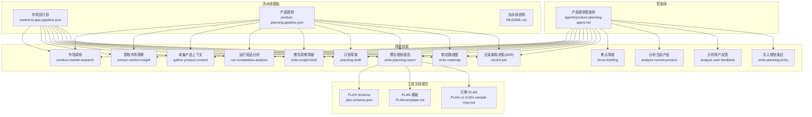
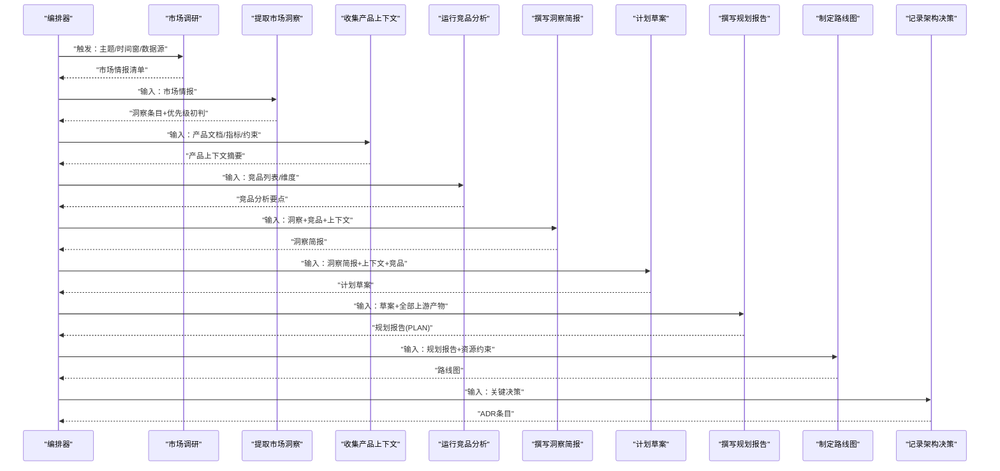
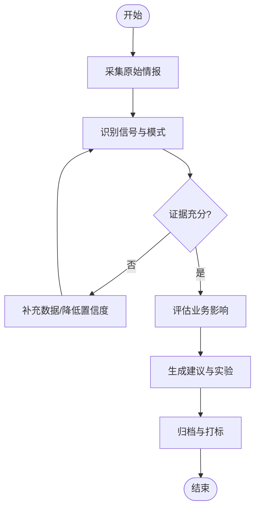
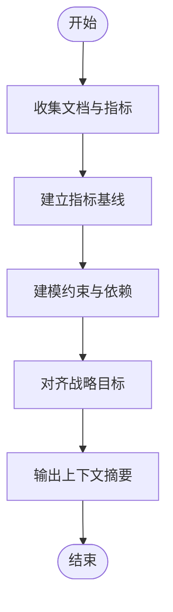
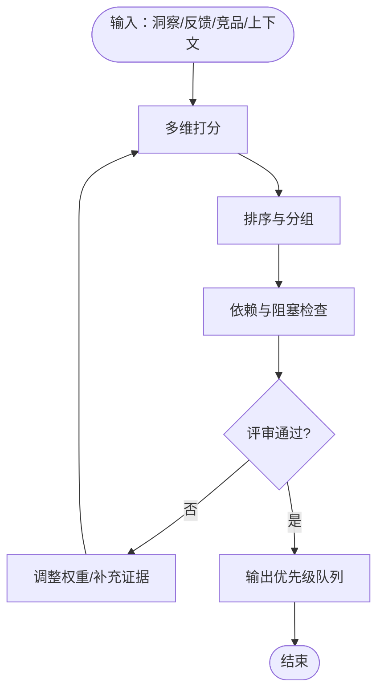
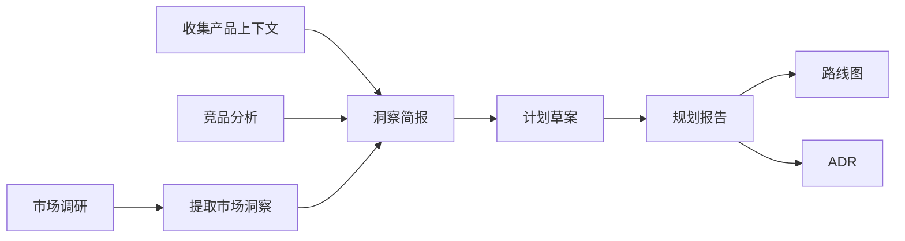

# 产品规划技能

<cite>
**本文引用的文件**   
- [agents/product-planning-agent.md](file://agents/product-planning-agent.md)
- [skills/planning/conduct-market-research/SKILL.md](file://skills/planning/conduct-market-research/SKILL.md)
- [skills/planning/extract-market-insight/SKILL.md](file://skills/planning/extract-market-insight/SKILL.md)
- [skills/planning/gather-product-context/SKILL.md](file://skills/planning/gather-product-context/SKILL.md)
- [skills/planning/run-competitive-analysis/SKILL.md](file://skills/planning/run-competitive-analysis/SKILL.md)
- [skills/planning/write-insight-brief/SKILL.md](file://skills/planning/write-insight-brief/SKILL.md)
- [skills/planning/planning-draft/SKILL.md](file://skills/planning/planning-draft/SKILL.md)
- [skills/planning/write-planning-report/SKILL.md](file://skills/planning/write-planning-report/SKILL.md)
- [skills/planning/write-roadmap/SKILL.md](file://skills/planning/write-roadmap/SKILL.md)
- [skills/planning/record-adr/SKILL.md](file://skills/planning/record-adr/SKILL.md)
- [skills/planning/focus-briefing/SKILL.md](file://skills/planning/focus-briefing/SKILL.md)
- [skills/planning/analyze-current-product/SKILL.md](file://skills/planning/analyze-current-product/SKILL.md)
- [skills/planning/analyze-user-feedback/SKILL.md](file://skills/planning/analyze-user-feedback/SKILL.md)
- [skills/planning/write-planning-entry/SKILL.md](file://skills/planning/write-planning-entry/SKILL.md)
- [pipeline-templates/market-to-plan.pipeline.json](file://pipeline-templates/market-to-plan.pipeline.json)
- [pipeline-templates/product-planning.pipeline.json](file://pipeline-templates/product-planning.pipeline.json)
- [pipeline-templates/README.md](file://pipeline-templates/README.md)
- [shared/engineering-docs/schemas/plan.schema.json](file://skills/shared/engineering-docs/schemas/plan.schema.json)
- [shared/engineering-docs/templates/PLAN-template.md](file://skills/shared/engineering-docs/templates/PLAN-template.md)
- [shared/engineering-docs/examples/PLAN-v1.0-001-sample-mvp.md](file://skills/shared/engineering-docs/examples/PLAN-v1.0-001-sample-mvp.md)
</cite>

## 目录
1. [引言](#引言)
2. [项目结构](#项目结构)
3. [核心组件](#核心组件)
4. [架构总览](#架构总览)
5. [详细组件分析](#详细组件分析)
6. [依赖关系分析](#依赖关系分析)
7. [性能与可扩展性](#性能与可扩展性)
8. [故障排查指南](#故障排查指南)
9. [结论](#结论)
10. [附录](#附录)

## 引言
本文件面向“产品规划”能力域，系统化梳理市场调研、竞品分析、需求收集与规划制定的完整流程。文档聚焦以下目标：
- 明确每个规划技能的作用、输入输出格式与执行时机
- 提供市场洞察提取、产品上下文收集与需求优先级排序的方法论
- 给出规划报告生成、路线图制定与决策记录的标准模板指引
- 说明规划流程的自动化编排与外部系统集成方式

## 项目结构
围绕“产品规划”的核心资产分布在如下位置：
- 智能体定义：agents/product-planning-agent.md
- 规划技能集合：skills/planning/*（涵盖调研、洞察、竞品、计划草案、报告、路线图、ADR等）
- 流水线模板：pipeline-templates/*（market-to-plan、product-planning 等）
- 工程文档规范与模板：skills/shared/engineering-docs/*（schema、template、example）

图表来源
- [agents/product-planning-agent.md](file://agents/product-planning-agent.md)
- [skills/planning/conduct-market-research/SKILL.md](file://skills/planning/conduct-market-research/SKILL.md)
- [skills/planning/extract-market-insight/SKILL.md](file://skills/planning/extract-market-insight/SKILL.md)
- [skills/planning/gather-product-context/SKILL.md](file://skills/planning/gather-product-context/SKILL.md)
- [skills/planning/run-competitive-analysis/SKILL.md](file://skills/planning/run-competitive-analysis/SKILL.md)
- [skills/planning/write-insight-brief/SKILL.md](file://skills/planning/write-insight-brief/SKILL.md)
- [skills/planning/planning-draft/SKILL.md](file://skills/planning/planning-draft/SKILL.md)
- [skills/planning/write-planning-report/SKILL.md](file://skills/planning/write-planning-report/SKILL.md)
- [skills/planning/write-roadmap/SKILL.md](file://skills/planning/write-roadmap/SKILL.md)
- [skills/planning/record-adr/SKILL.md](file://skills/planning/record-adr/SKILL.md)
- [skills/planning/focus-briefing/SKILL.md](file://skills/planning/focus-briefing/SKILL.md)
- [skills/planning/analyze-current-product/SKILL.md](file://skills/planning/analyze-current-product/SKILL.md)
- [skills/planning/analyze-user-feedback/SKILL.md](file://skills/planning/analyze-user-feedback/SKILL.md)
- [skills/planning/write-planning-entry/SKILL.md](file://skills/planning/write-planning-entry/SKILL.md)
- [pipeline-templates/market-to-plan.pipeline.json](file://pipeline-templates/market-to-plan.pipeline.json)
- [pipeline-templates/product-planning.pipeline.json](file://pipeline-templates/product-planning.pipeline.json)
- [pipeline-templates/README.md](file://pipeline-templates/README.md)
- [skills/shared/engineering-docs/schemas/plan.schema.json](file://skills/shared/engineering-docs/schemas/plan.schema.json)
- [skills/shared/engineering-docs/templates/PLAN-template.md](file://skills/shared/engineering-docs/templates/PLAN-template.md)
- [skills/shared/engineering-docs/examples/PLAN-v1.0-001-sample-mvp.md](file://skills/shared/engineering-docs/examples/PLAN-v1.0-001-sample-mvp.md)

章节来源
- [agents/product-planning-agent.md](file://agents/product-planning-agent.md)
- [pipeline-templates/README.md](file://pipeline-templates/README.md)

## 核心组件
本节概述关键规划技能及其职责边界，便于快速定位与组合使用。

- 市场调研 conduct-market-research
  - 作用：采集行业趋势、政策、技术演进与用户行为变化，形成结构化市场情报
  - 输入：主题/关键词、时间窗口、地域/细分领域、数据源偏好
  - 输出：市场情报清单、趋势摘要、风险与机会点
  - 执行时机：规划启动前或季度复盘时

- 提取市场洞察 extract-market-insight
  - 作用：从原始情报中提炼可行动洞察，关联业务影响
  - 输入：市场调研结果、历史洞察库
  - 输出：洞察条目（背景-信号-含义-建议），优先级初判
  - 执行时机：市场调研完成后

- 收集产品上下文 gather-product-context
  - 作用：聚合产品现状、指标、版本节奏、资源约束与战略对齐
  - 输入：产品文档、指标看板、路线图、预算/人力
  - 输出：产品上下文摘要、约束清单、关键假设
  - 执行时机：洞察提炼后、计划草案前

- 运行竞品分析 run-competitive-analysis
  - 作用：识别直接/间接竞品，评估功能、体验、定价、渠道与策略
  - 输入：竞品列表、关注维度、数据采集范围
  - 输出：竞品雷达图要点、差异化机会、威胁清单
  - 执行时机：与市场调研并行或紧随其后

- 撰写洞察简报 write-insight-brief
  - 作用：将洞察转化为高层可读的简报，支撑决策
  - 输入：洞察条目、竞品分析、产品上下文
  - 输出：一页纸简报（问题-洞察-建议-影响）
  - 执行时机：洞察与竞品分析完成，进入计划阶段前

- 计划草案 planning-draft
  - 作用：基于洞察与上下文，产出初步方案与备选路径
  - 输入：洞察简报、产品上下文、竞品分析
  - 输出：候选方向、目标假设、成功度量、风险与依赖
  - 执行时机：洞察简报评审通过后

- 撰写规划报告 write-planning-report
  - 作用：整合所有输入，形成正式规划报告（遵循 PLAN 模板与 Schema）
  - 输入：计划草案、洞察简报、竞品分析、产品上下文
  - 输出：规划报告（含目标、策略、里程碑、度量、风险与依赖）
  - 执行时机：计划草案评审通过后

- 制定路线图 write-roadmap
  - 作用：将规划落地为分阶段路线图与交付物
  - 输入：规划报告、资源与约束、外部依赖
  - 输出：路线图（主题-阶段-里程碑-负责人-度量）
  - 执行时机：规划报告批准后

- 记录架构决策 record-adr
  - 作用：沉淀关键决策的背景、选项、权衡与结论
  - 输入：决策议题、选项对比、影响面
  - 输出：ADR 条目（标题、状态、上下文、决策、后果）
  - 执行时机：重大决策发生时

- 焦点简报 focus-briefing
  - 作用：针对特定议题的快速对齐材料
  - 输入：议题、相关数据、待决事项
  - 输出：焦点简报（背景-问题-选项-建议）
  - 执行时机：跨团队对齐或紧急决策

- 分析当前产品 analyze-current-product
  - 作用：量化现状（指标、缺陷、性能、可用性）
  - 输入：监控、日志、工单、评测
  - 输出：现状诊断、改进机会、基线指标
  - 执行时机：规划前期或复盘期

- 分析用户反馈 analyze-user-feedback
  - 作用：从多渠道反馈中聚类问题与诉求
  - 输入：反馈池、标签体系、NPS/CSAT
  - 输出：需求聚类、痛点热力、优先建议
  - 执行时机：持续进行，纳入洞察与计划

- 写入规划条目 write-planning-entry
  - 作用：将已批准的计划项登记入系统，建立追踪基线
  - 输入：批准的计划项、责任人、里程碑
  - 输出：规划条目（ID、描述、状态、链接）
  - 执行时机：规划审批通过后

章节来源
- [skills/planning/conduct-market-research/SKILL.md](file://skills/planning/conduct-market-research/SKILL.md)
- [skills/planning/extract-market-insight/SKILL.md](file://skills/planning/extract-market-insight/SKILL.md)
- [skills/planning/gather-product-context/SKILL.md](file://skills/planning/gather-product-context/SKILL.md)
- [skills/planning/run-competitive-analysis/SKILL.md](file://skills/planning/run-competitive-analysis/SKILL.md)
- [skills/planning/write-insight-brief/SKILL.md](file://skills/planning/write-insight-brief/SKILL.md)
- [skills/planning/planning-draft/SKILL.md](file://skills/planning/planning-draft/SKILL.md)
- [skills/planning/write-planning-report/SKILL.md](file://skills/planning/write-planning-report/SKILL.md)
- [skills/planning/write-roadmap/SKILL.md](file://skills/planning/write-roadmap/SKILL.md)
- [skills/planning/record-adr/SKILL.md](file://skills/planning/record-adr/SKILL.md)
- [skills/planning/focus-briefing/SKILL.md](file://skills/planning/focus-briefing/SKILL.md)
- [skills/planning/analyze-current-product/SKILL.md](file://skills/planning/analyze-current-product/SKILL.md)
- [skills/planning/analyze-user-feedback/SKILL.md](file://skills/planning/analyze-user-feedback/SKILL.md)
- [skills/planning/write-planning-entry/SKILL.md](file://skills/planning/write-planning-entry/SKILL.md)

## 架构总览
下图展示“市场到计划”端到端编排与产物流转，体现各技能的衔接与产物形态。

图表来源
- [pipeline-templates/market-to-plan.pipeline.json](file://pipeline-templates/market-to-plan.pipeline.json)
- [pipeline-templates/product-planning.pipeline.json](file://pipeline-templates/product-planning.pipeline.json)
- [skills/planning/conduct-market-research/SKILL.md](file://skills/planning/conduct-market-research/SKILL.md)
- [skills/planning/extract-market-insight/SKILL.md](file://skills/planning/extract-market-insight/SKILL.md)
- [skills/planning/gather-product-context/SKILL.md](file://skills/planning/gather-product-context/SKILL.md)
- [skills/planning/run-competitive-analysis/SKILL.md](file://skills/planning/run-competitive-analysis/SKILL.md)
- [skills/planning/write-insight-brief/SKILL.md](file://skills/planning/write-insight-brief/SKILL.md)
- [skills/planning/planning-draft/SKILL.md](file://skills/planning/planning-draft/SKILL.md)
- [skills/planning/write-planning-report/SKILL.md](file://skills/planning/write-planning-report/SKILL.md)
- [skills/planning/write-roadmap/SKILL.md](file://skills/planning/write-roadmap/SKILL.md)
- [skills/planning/record-adr/SKILL.md](file://skills/planning/record-adr/SKILL.md)

## 详细组件分析

### 方法论一：市场洞察提取
- 输入：市场调研结果、历史洞察库、外部事件流
- 处理步骤：
  - 信号识别：从趋势、政策、技术、用户行为中提取弱信号
  - 因果链构建：背景→信号→含义→业务影响
  - 证据校验：交叉验证多源信息，标注置信度
  - 建议生成：提出可操作建议与实验设计
  - 归档与复用：入库并打标签，支持检索与回溯
- 输出：洞察条目（含背景、信号、含义、建议、置信度、证据链接）
- 执行时机：市场调研完成后；也可作为持续过程定期更新

图表来源
- [skills/planning/extract-market-insight/SKILL.md](file://skills/planning/extract-market-insight/SKILL.md)
- [skills/planning/conduct-market-research/SKILL.md](file://skills/planning/conduct-market-research/SKILL.md)

章节来源
- [skills/planning/extract-market-insight/SKILL.md](file://skills/planning/extract-market-insight/SKILL.md)
- [skills/planning/conduct-market-research/SKILL.md](file://skills/planning/conduct-market-research/SKILL.md)

### 方法论二：产品上下文收集
- 输入：产品文档、指标看板、版本节奏、资源与预算、合规要求
- 处理步骤：
  - 现状盘点：功能矩阵、性能/稳定性、用户体验、安全与合规
  - 指标基线：北极星指标、关键过程指标、健康度阈值
  - 约束建模：人力、资金、技术债、外部依赖
  - 战略对齐：与公司/业务线目标映射
- 输出：产品上下文摘要、约束清单、关键假设
- 执行时机：洞察提炼后、计划草案前；也可在迭代中滚动更新

图表来源
- [skills/planning/gather-product-context/SKILL.md](file://skills/planning/gather-product-context/SKILL.md)
- [skills/planning/analyze-current-product/SKILL.md](file://skills/planning/analyze-current-product/SKILL.md)

章节来源
- [skills/planning/gather-product-context/SKILL.md](file://skills/planning/gather-product-context/SKILL.md)
- [skills/planning/analyze-current-product/SKILL.md](file://skills/planning/analyze-current-product/SKILL.md)

### 方法论三：需求优先级排序
- 输入：洞察条目、用户反馈聚类、竞品差异点、产品上下文
- 方法：
  - 价值-成本-风险三维评估
  - 影响面×实现难度×不确定性打分
  - 与战略目标的权重映射
  - 依赖与阻塞分析
- 输出：优先级队列（P0/P1/P2）、理由与证据、风险缓解措施
- 执行时机：计划草案阶段；随新证据动态调整

图表来源
- [skills/planning/analyze-user-feedback/SKILL.md](file://skills/planning/analyze-user-feedback/SKILL.md)
- [skills/planning/planning-draft/SKILL.md](file://skills/planning/planning-draft/SKILL.md)

章节来源
- [skills/planning/analyze-user-feedback/SKILL.md](file://skills/planning/analyze-user-feedback/SKILL.md)
- [skills/planning/planning-draft/SKILL.md](file://skills/planning/planning-draft/SKILL.md)

### 标准化模板与产物
- 规划报告（PLAN）
  - 模板：PLAN-template.md
  - 结构：目标、策略、范围、里程碑、度量、风险与依赖、附录
  - 校验：plan.schema.json
  - 参考：PLAN-v1.0-001-sample-mvp.md
- 洞察简报
  - 结构：问题-洞察-建议-影响-证据
- 路线图
  - 结构：主题-阶段-里程碑-负责人-度量-依赖
- ADR
  - 结构：标题、状态、上下文、选项、决策、后果、生效日期

章节来源
- [skills/shared/engineering-docs/templates/PLAN-template.md](file://skills/shared/engineering-docs/templates/PLAN-template.md)
- [skills/shared/engineering-docs/schemas/plan.schema.json](file://skills/shared/engineering-docs/schemas/plan.schema.json)
- [skills/shared/engineering-docs/examples/PLAN-v1.0-001-sample-mvp.md](file://skills/shared/engineering-docs/examples/PLAN-v1.0-001-sample-mvp.md)

## 依赖关系分析
- 技能间依赖
  - 洞察简报依赖：市场调研、竞品分析、产品上下文
  - 计划草案依赖：洞察简报、产品上下文、竞品分析
  - 规划报告依赖：计划草案及全部上游产物
  - 路线图依赖：规划报告、资源与约束
  - ADR：贯穿全链路，捕获关键决策
- 编排与集成
  - market-to-plan.pipeline.json：端到端编排“市场→计划”
  - product-planning.pipeline.json：更通用的产品规划编排
  - README.md：流水线使用说明与约定

图表来源
- [pipeline-templates/market-to-plan.pipeline.json](file://pipeline-templates/market-to-plan.pipeline.json)
- [pipeline-templates/product-planning.pipeline.json](file://pipeline-templates/product-planning.pipeline.json)
- [pipeline-templates/README.md](file://pipeline-templates/README.md)

章节来源
- [pipeline-templates/market-to-plan.pipeline.json](file://pipeline-templates/market-to-plan.pipeline.json)
- [pipeline-templates/product-planning.pipeline.json](file://pipeline-templates/product-planning.pipeline.json)
- [pipeline-templates/README.md](file://pipeline-templates/README.md)

## 性能与可扩展性
- 并行化
  - 市场调研与竞品分析可并行执行
  - 洞察提取与上下文收集可并行
- 增量更新
  - 洞察与反馈分析支持增量刷新，避免全量重算
- 缓存与复用
  - 对稳定上下文（如产品约束）做缓存，减少重复采集
- 扩展点
  - 新增数据源：在市场调研与竞品分析中扩展采集器
  - 新维度评分：在优先级排序中扩展打分模型
  - 新模板/Schema：在工程文档规范中扩展产物标准

[本节为通用指导，不直接分析具体文件]

## 故障排查指南
- 常见失败点
  - 数据源不可达：检查网络、鉴权与配额
  - 输入缺失：确认上游产物是否齐全（洞察、上下文、竞品）
  - 模板校验失败：对照 plan.schema.json 修正字段
  - 权限不足：确保读写仓库/知识库/看板权限
- 定位步骤
  - 查看流水线日志，定位失败节点
  - 核对输入产物结构与必填字段
  - 复现最小用例，逐步缩小范围
- 恢复策略
  - 重试与退避：对瞬时错误自动重试
  - 降级：跳过非关键步骤，保留核心产物
  - 回滚：以最近一次通过的产物为准

章节来源
- [pipeline-templates/README.md](file://pipeline-templates/README.md)
- [skills/shared/engineering-docs/schemas/plan.schema.json](file://skills/shared/engineering-docs/schemas/plan.schema.json)

## 结论
通过将“市场调研—洞察提取—竞品分析—上下文收集—计划草案—规划报告—路线图—ADR”串联为可编排的技能集，并以统一模板与 Schema 保障产物质量，产品规划流程可实现高内聚、低耦合、可观测与可演进的工程化实践。建议在组织内推广该范式，结合数据源与工具链持续优化。

[本节为总结性内容，不直接分析具体文件]

## 附录
- 智能体角色
  - 产品规划智能体负责协调上述技能，驱动流水线执行与产物治理
- 模板与示例
  - PLAN 模板与示例用于统一规划报告结构
  - 洞察简报与路线图可按需裁剪

章节来源
- [agents/product-planning-agent.md](file://agents/product-planning-agent.md)
- [skills/shared/engineering-docs/templates/PLAN-template.md](file://skills/shared/engineering-docs/templates/PLAN-template.md)
- [skills/shared/engineering-docs/examples/PLAN-v1.0-001-sample-mvp.md](file://skills/shared/engineering-docs/examples/PLAN-v1.0-001-sample-mvp.md)