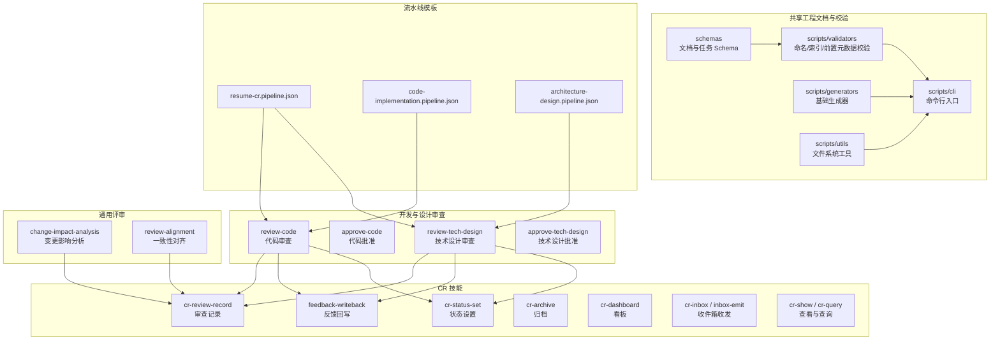
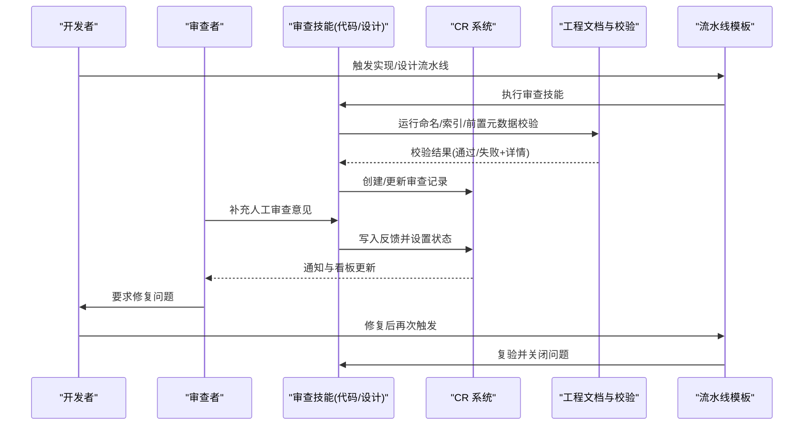
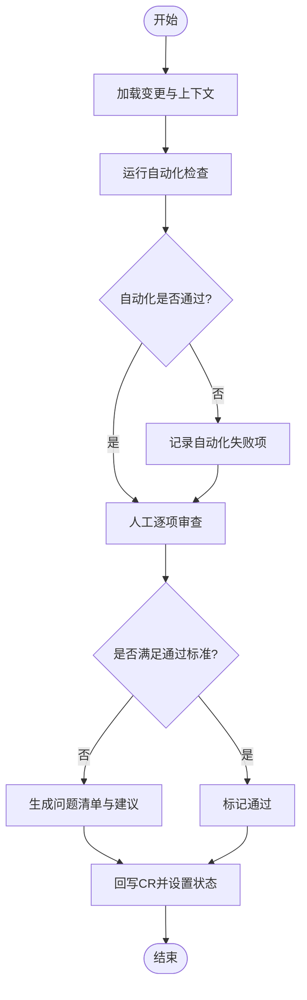
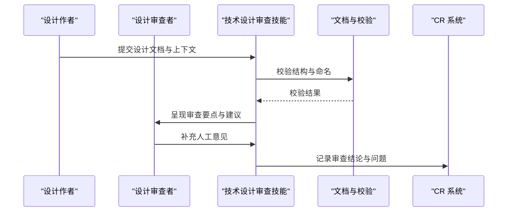
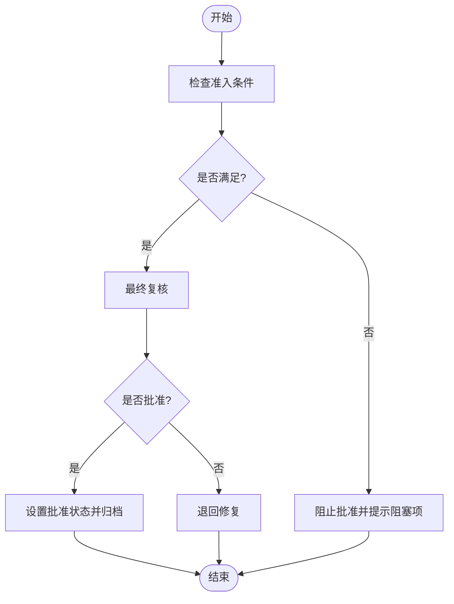
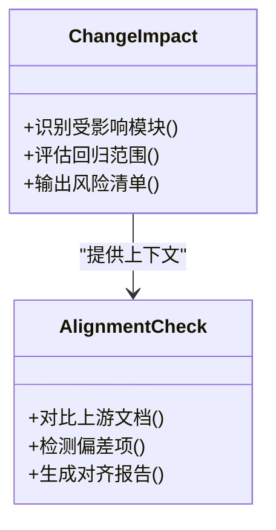
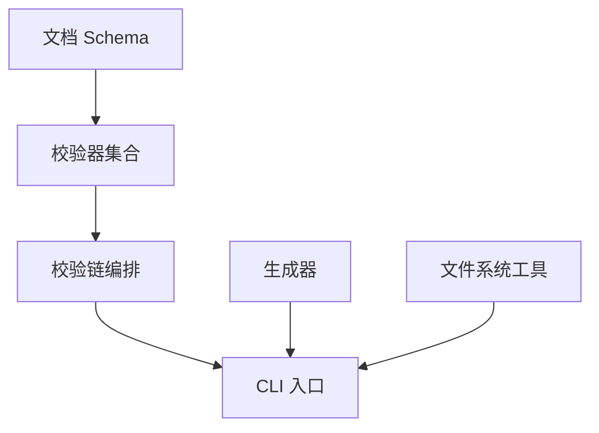
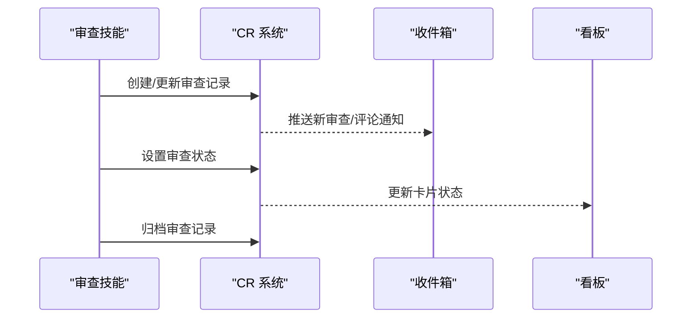
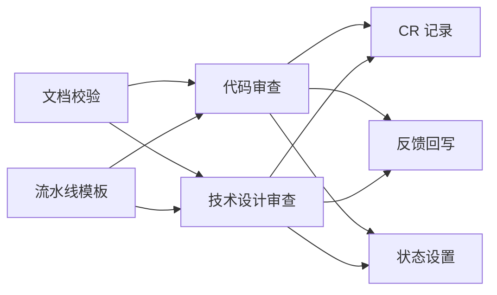
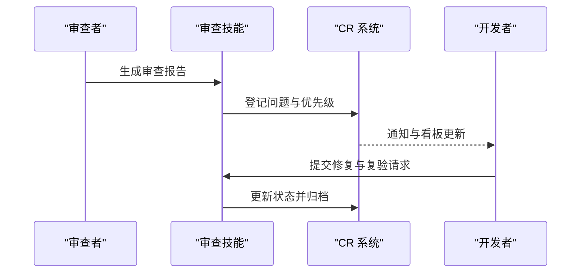

# 代码审查技能

<cite>
**本文引用的文件**   
- [skills/cr/cr-review-record/SKILL.md](file://skills/cr/cr-review-record/SKILL.md)
- [skills/cr/feedback-writeback/SKILL.md](file://skills/cr/feedback-writeback/SKILL.md)
- [skills/cr/cr-status-set/SKILL.md](file://skills/cr/cr-status-set/SKILL.md)
- [skills/cr/cr-show/SKILL.md](file://skills/cr/cr-show/SKILL.md)
- [skills/cr/cr-query/SKILL.md](file://skills/cr/cr-query/SKILL.md)
- [skills/cr/cr-inbox/SKILL.md](file://skills/cr/cr-inbox/SKILL.md)
- [skills/cr/inbox-emit/SKILL.md](file://skills/cr/inbox-emit/SKILL.md)
- [skills/cr/cr-archive/SKILL.md](file://skills/cr/cr-archive/SKILL.md)
- [skills/cr/cr-dashboard/SKILL.md](file://skills/cr/cr-dashboard/SKILL.md)
- [skills/develop/review-code/SKILL.md](file://skills/develop/review-code/SKILL.md)
- [skills/develop/approve-code/SKILL.md](file://skills/develop/approve-code/SKILL.md)
- [skills/develop/review-tech-design/SKILL.md](file://skills/develop/review-tech-design/SKILL.md)
- [skills/develop/approve-tech-design/SKILL.md](file://skills/develop/approve-tech-design/SKILL.md)
- [skills/review/change-impact-analysis/SKILL.md](file://skills/review/change-impact-analysis/SKILL.md)
- [skills/review/review-alignment/SKILL.md](file://skills/review/review-alignment/SKILL.md)
- [skills/shared/engineering-docs/schemas/common-defs.schema.json](file://skills/shared/engineering-docs/schemas/common-defs.schema.json)
- [skills/shared/engineering-docs/schemas/task.schema.json](file://skills/shared/engineering-docs/schemas/task.schema.json)
- [skills/shared/engineering-docs/scripts/src/validators/index-sync.ts](file://skills/shared/engineering-docs/scripts/src/validators/index-sync.ts)
- [skills/shared/engineering-docs/scripts/src/validators/naming.ts](file://skills/shared/engineering-docs/scripts/src/validators/naming.ts)
- [skills/shared/engineering-docs/scripts/src/validators/frontmatter.ts](file://skills/shared/engineering-docs/scripts/src/validators/frontmatter.ts)
- [skills/shared/engineering-docs/scripts/src/validators/chain.ts](file://skills/shared/engineering-docs/scripts/src/validators/chain.ts)
- [skills/shared/engineering-docs/scripts/src/generators/base.ts](file://skills/shared/engineering-docs/scripts/src/generators/base.ts)
- [skills/shared/engineering-docs/scripts/src/utils/fs.ts](file://skills/shared/engineering-docs/scripts/src/utils/fs.ts)
- [skills/shared/engineering-docs/scripts/src/cli.ts](file://skills/shared/engineering-docs/scripts/src/cli.ts)
- [pipeline-templates/resume-cr.pipeline.json](file://pipeline-templates/resume-cr.pipeline.json)
- [pipeline-templates/code-implementation.pipeline.json](file://pipeline-templates/code-implementation.pipeline.json)
- [pipeline-templates/architecture-design.pipeline.json](file://pipeline-templates/architecture-design.pipeline.json)
</cite>

## 目录
1. [简介](#简介)
2. [项目结构](#项目结构)
3. [核心组件](#核心组件)
4. [架构总览](#架构总览)
5. [详细组件分析](#详细组件分析)
6. [依赖分析](#依赖分析)
7. [性能考虑](#性能考虑)
8. [故障排查指南](#故障排查指南)
9. [结论](#结论)
10. [附录](#附录)

## 简介
本技术文档围绕“代码审查技能模块”，系统化阐述代码审查、技术设计审查与质量审批三类技能的工作流程、判断标准、规则配置、自动化检查项与人工审核要点，并给出审查报告生成、问题追踪与修复验证的完整闭环。同时说明与CR系统的集成方式与状态同步机制，并提供批量审查操作示例与关键指标定义，帮助团队建立可度量、可追溯、可自动化的工程评审体系。

## 项目结构
该仓库以“技能（skill）”为最小能力单元组织，围绕 CR 与开发/设计/评审相关能力分布在多个目录：
- skills/cr：CR 系统交互与记录、反馈回写、状态设置、归档、看板、收件箱等
- skills/develop：代码与技术设计的审查与批准、实现、任务拆分与设计编写
- skills/review：变更影响分析与一致性对齐审查
- skills/shared/engineering-docs：工程文档规范、模板、Schema、校验脚本与工具链
- pipeline-templates：流水线模板，串联从需求到实现、设计与审查的关键阶段

图表来源
- [skills/cr/cr-review-record/SKILL.md](file://skills/cr/cr-review-record/SKILL.md)
- [skills/cr/feedback-writeback/SKILL.md](file://skills/cr/feedback-writeback/SKILL.md)
- [skills/cr/cr-status-set/SKILL.md](file://skills/cr/cr-status-set/SKILL.md)
- [skills/cr/cr-archive/SKILL.md](file://skills/cr/cr-archive/SKILL.md)
- [skills/cr/cr-dashboard/SKILL.md](file://skills/cr/cr-dashboard/SKILL.md)
- [skills/cr/cr-inbox/SKILL.md](file://skills/cr/cr-inbox/SKILL.md)
- [skills/cr/inbox-emit/SKILL.md](file://skills/cr/inbox-emit/SKILL.md)
- [skills/cr/cr-show/SKILL.md](file://skills/cr/cr-show/SKILL.md)
- [skills/cr/cr-query/SKILL.md](file://skills/cr/cr-query/SKILL.md)
- [skills/develop/review-code/SKILL.md](file://skills/develop/review-code/SKILL.md)
- [skills/develop/approve-code/SKILL.md](file://skills/develop/approve-code/SKILL.md)
- [skills/develop/review-tech-design/SKILL.md](file://skills/develop/review-tech-design/SKILL.md)
- [skills/develop/approve-tech-design/SKILL.md](file://skills/develop/approve-tech-design/SKILL.md)
- [skills/review/change-impact-analysis/SKILL.md](file://skills/review/change-impact-analysis/SKILL.md)
- [skills/review/review-alignment/SKILL.md](file://skills/review/review-alignment/SKILL.md)
- [skills/shared/engineering-docs/scripts/src/validators/index-sync.ts](file://skills/shared/engineering-docs/scripts/src/validators/index-sync.ts)
- [skills/shared/engineering-docs/scripts/src/validators/naming.ts](file://skills/shared/engineering-docs/scripts/src/validators/naming.ts)
- [skills/shared/engineering-docs/scripts/src/validators/frontmatter.ts](file://skills/shared/engineering-docs/scripts/src/validators/frontmatter.ts)
- [skills/shared/engineering-docs/scripts/src/validators/chain.ts](file://skills/shared/engineering-docs/scripts/src/validators/chain.ts)
- [skills/shared/engineering-docs/scripts/src/generators/base.ts](file://skills/shared/engineering-docs/scripts/src/generators/base.ts)
- [skills/shared/engineering-docs/scripts/src/utils/fs.ts](file://skills/shared/engineering-docs/scripts/src/utils/fs.ts)
- [skills/shared/engineering-docs/scripts/src/cli.ts](file://skills/shared/engineering-docs/scripts/src/cli.ts)
- [pipeline-templates/resume-cr.pipeline.json](file://pipeline-templates/resume-cr.pipeline.json)
- [pipeline-templates/code-implementation.pipeline.json](file://pipeline-templates/code-implementation.pipeline.json)
- [pipeline-templates/architecture-design.pipeline.json](file://pipeline-templates/architecture-design.pipeline.json)

章节来源
- [skills/cr/cr-review-record/SKILL.md](file://skills/cr/cr-review-record/SKILL.md)
- [skills/develop/review-code/SKILL.md](file://skills/develop/review-code/SKILL.md)
- [skills/develop/review-tech-design/SKILL.md](file://skills/develop/review-tech-design/SKILL.md)
- [skills/review/change-impact-analysis/SKILL.md](file://skills/review/change-impact-analysis/SKILL.md)
- [skills/review/review-alignment/SKILL.md](file://skills/review/review-alignment/SKILL.md)
- [skills/shared/engineering-docs/scripts/src/validators/chain.ts](file://skills/shared/engineering-docs/scripts/src/validators/chain.ts)
- [pipeline-templates/resume-cr.pipeline.json](file://pipeline-templates/resume-cr.pipeline.json)

## 核心组件
- CR 记录与反馈
  - 审查记录：用于沉淀审查意见、结论与关联工件，形成可追溯证据链
  - 反馈回写：将审查结果与问题清单回写到目标系统，驱动后续修复
  - 状态设置：在 CR 系统中更新审查状态（如待审、通过、需修改、已关闭）
- 代码与技术设计审查
  - 代码审查：对提交或分支进行可读性、健壮性、安全与合规性评估
  - 技术设计审查：对架构方案、接口设计、数据模型与演进策略进行评估
  - 代码批准与技术设计批准：基于审查结论与规则阈值做出放行决策
- 通用评审
  - 变更影响分析：识别受影响的模块、依赖与风险面，辅助制定回归范围
  - 一致性对齐：确保产出物与上游规划、PRD、SDD 保持一致
- 共享工程文档与校验
  - 文档 Schema：定义 PRD、SDD、任务等结构化约束
  - 校验脚本：命名规范、索引一致性、前置元数据完整性等自动化检查
  - 生成器与 CLI：标准化产物生成与批量处理入口

章节来源
- [skills/cr/cr-review-record/SKILL.md](file://skills/cr/cr-review-record/SKILL.md)
- [skills/cr/feedback-writeback/SKILL.md](file://skills/cr/feedback-writeback/SKILL.md)
- [skills/cr/cr-status-set/SKILL.md](file://skills/cr/cr-status-set/SKILL.md)
- [skills/develop/review-code/SKILL.md](file://skills/develop/review-code/SKILL.md)
- [skills/develop/approve-code/SKILL.md](file://skills/develop/approve-code/SKILL.md)
- [skills/develop/review-tech-design/SKILL.md](file://skills/develop/review-tech-design/SKILL.md)
- [skills/develop/approve-tech-design/SKILL.md](file://skills/develop/approve-tech-design/SKILL.md)
- [skills/review/change-impact-analysis/SKILL.md](file://skills/review/change-impact-analysis/SKILL.md)
- [skills/review/review-alignment/SKILL.md](file://skills/review/review-alignment/SKILL.md)
- [skills/shared/engineering-docs/schemas/common-defs.schema.json](file://skills/shared/engineering-docs/schemas/common-defs.schema.json)
- [skills/shared/engineering-docs/schemas/task.schema.json](file://skills/shared/engineering-docs/schemas/task.schema.json)
- [skills/shared/engineering-docs/scripts/src/validators/index-sync.ts](file://skills/shared/engineering-docs/scripts/src/validators/index-sync.ts)
- [skills/shared/engineering-docs/scripts/src/validators/naming.ts](file://skills/shared/engineering-docs/scripts/src/validators/naming.ts)
- [skills/shared/engineering-docs/scripts/src/validators/frontmatter.ts](file://skills/shared/engineering-docs/scripts/src/validators/frontmatter.ts)
- [skills/shared/engineering-docs/scripts/src/validators/chain.ts](file://skills/shared/engineering-docs/scripts/src/validators/chain.ts)
- [skills/shared/engineering-docs/scripts/src/generators/base.ts](file://skills/shared/engineering-docs/scripts/src/generators/base.ts)
- [skills/shared/engineering-docs/scripts/src/utils/fs.ts](file://skills/shared/engineering-docs/scripts/src/utils/fs.ts)
- [skills/shared/engineering-docs/scripts/src/cli.ts](file://skills/shared/engineering-docs/scripts/src/cli.ts)

## 架构总览
下图展示“审查技能”与“CR 系统”、“工程文档校验”和“流水线模板”的协作关系。

图表来源
- [pipeline-templates/resume-cr.pipeline.json](file://pipeline-templates/resume-cr.pipeline.json)
- [pipeline-templates/code-implementation.pipeline.json](file://pipeline-templates/code-implementation.pipeline.json)
- [pipeline-templates/architecture-design.pipeline.json](file://pipeline-templates/architecture-design.pipeline.json)
- [skills/cr/cr-review-record/SKILL.md](file://skills/cr/cr-review-record/SKILL.md)
- [skills/cr/feedback-writeback/SKILL.md](file://skills/cr/feedback-writeback/SKILL.md)
- [skills/cr/cr-status-set/SKILL.md](file://skills/cr/cr-status-set/SKILL.md)
- [skills/shared/engineering-docs/scripts/src/validators/chain.ts](file://skills/shared/engineering-docs/scripts/src/validators/chain.ts)

## 详细组件分析

### 代码审查（Review Code）
- 输入与上下文
  - 变更集、关联任务、设计文档、历史审查记录
- 自动化检查项
  - 命名规范、索引一致性、前置元数据完整性、文档与任务 Schema 校验
- 人工审核要点
  - 可读性与复杂度、边界与异常处理、安全性与权限、性能与资源使用、可测试性与回归范围
- 输出与回写
  - 审查结论、问题清单、建议修复、风险与回归建议；回写至 CR 并更新状态

图表来源
- [skills/develop/review-code/SKILL.md](file://skills/develop/review-code/SKILL.md)
- [skills/cr/cr-review-record/SKILL.md](file://skills/cr/cr-review-record/SKILL.md)
- [skills/cr/feedback-writeback/SKILL.md](file://skills/cr/feedback-writeback/SKILL.md)
- [skills/cr/cr-status-set/SKILL.md](file://skills/cr/cr-status-set/SKILL.md)
- [skills/shared/engineering-docs/scripts/src/validators/chain.ts](file://skills/shared/engineering-docs/scripts/src/validators/chain.ts)

章节来源
- [skills/develop/review-code/SKILL.md](file://skills/develop/review-code/SKILL.md)
- [skills/cr/cr-review-record/SKILL.md](file://skills/cr/cr-review-record/SKILL.md)
- [skills/cr/feedback-writeback/SKILL.md](file://skills/cr/feedback-writeback/SKILL.md)
- [skills/cr/cr-status-set/SKILL.md](file://skills/cr/cr-status-set/SKILL.md)
- [skills/shared/engineering-docs/scripts/src/validators/chain.ts](file://skills/shared/engineering-docs/scripts/src/validators/chain.ts)

### 技术设计审查（Review Tech Design）
- 关注点
  - 架构合理性、扩展性与解耦、接口契约与兼容性、数据一致性与迁移策略、可观测性与容错
- 自动化与人工结合
  - 文档结构与命名校验、前后置依赖一致性、与 PRD/SDD 的对齐度
- 输出
  - 设计缺陷与改进建议、风险评估、回归与灰度策略建议

图表来源
- [skills/develop/review-tech-design/SKILL.md](file://skills/develop/review-tech-design/SKILL.md)
- [skills/shared/engineering-docs/scripts/src/validators/naming.ts](file://skills/shared/engineering-docs/scripts/src/validators/naming.ts)
- [skills/shared/engineering-docs/scripts/src/validators/index-sync.ts](file://skills/shared/engineering-docs/scripts/src/validators/index-sync.ts)
- [skills/cr/cr-review-record/SKILL.md](file://skills/cr/cr-review-record/SKILL.md)

章节来源
- [skills/develop/review-tech-design/SKILL.md](file://skills/develop/review-tech-design/SKILL.md)
- [skills/shared/engineering-docs/scripts/src/validators/naming.ts](file://skills/shared/engineering-docs/scripts/src/validators/naming.ts)
- [skills/shared/engineering-docs/scripts/src/validators/index-sync.ts](file://skills/shared/engineering-docs/scripts/src/validators/index-sync.ts)
- [skills/cr/cr-review-record/SKILL.md](file://skills/cr/cr-review-record/SKILL.md)

### 质量审批（Approve Code / Approve Tech Design）
- 准入条件
  - 自动化检查全部通过、关键问题已修复、回归范围明确、风险可控
- 决策依据
  - 审查记录、问题清单与修复验证结果、影响分析与对齐度评估
- 动作
  - 在 CR 中设置批准状态、归档审查记录、触发后续发布或合并流程

图表来源
- [skills/develop/approve-code/SKILL.md](file://skills/develop/approve-code/SKILL.md)
- [skills/develop/approve-tech-design/SKILL.md](file://skills/develop/approve-tech-design/SKILL.md)
- [skills/cr/cr-status-set/SKILL.md](file://skills/cr/cr-status-set/SKILL.md)
- [skills/cr/cr-review-record/SKILL.md](file://skills/cr/cr-review-record/SKILL.md)

章节来源
- [skills/develop/approve-code/SKILL.md](file://skills/develop/approve-code/SKILL.md)
- [skills/develop/approve-tech-design/SKILL.md](file://skills/develop/approve-tech-design/SKILL.md)
- [skills/cr/cr-status-set/SKILL.md](file://skills/cr/cr-status-set/SKILL.md)
- [skills/cr/cr-review-record/SKILL.md](file://skills/cr/cr-review-record/SKILL.md)

### 变更影响分析与一致性对齐
- 变更影响分析
  - 识别受影响模块、外部依赖、接口契约与数据模型变化，评估回归范围与风险
- 一致性对齐
  - 对照 PRD/SDD/任务清单，确保设计/实现与业务目标一致，避免漂移

图表来源
- [skills/review/change-impact-analysis/SKILL.md](file://skills/review/change-impact-analysis/SKILL.md)
- [skills/review/review-alignment/SKILL.md](file://skills/review/review-alignment/SKILL.md)

章节来源
- [skills/review/change-impact-analysis/SKILL.md](file://skills/review/change-impact-analysis/SKILL.md)
- [skills/review/review-alignment/SKILL.md](file://skills/review/review-alignment/SKILL.md)

### 工程文档与自动化校验
- 文档 Schema
  - 通用定义与任务结构约束，保证结构化与可解析
- 校验器
  - 命名规范、索引一致性、前置元数据完整性；支持组合成校验链
- 生成器与 CLI
  - 标准化产物生成与批量处理入口，便于流水线集成

图表来源
- [skills/shared/engineering-docs/schemas/common-defs.schema.json](file://skills/shared/engineering-docs/schemas/common-defs.schema.json)
- [skills/shared/engineering-docs/schemas/task.schema.json](file://skills/shared/engineering-docs/schemas/task.schema.json)
- [skills/shared/engineering-docs/scripts/src/validators/index-sync.ts](file://skills/shared/engineering-docs/scripts/src/validators/index-sync.ts)
- [skills/shared/engineering-docs/scripts/src/validators/naming.ts](file://skills/shared/engineering-docs/scripts/src/validators/naming.ts)
- [skills/shared/engineering-docs/scripts/src/validators/frontmatter.ts](file://skills/shared/engineering-docs/scripts/src/validators/frontmatter.ts)
- [skills/shared/engineering-docs/scripts/src/validators/chain.ts](file://skills/shared/engineering-docs/scripts/src/validators/chain.ts)
- [skills/shared/engineering-docs/scripts/src/generators/base.ts](file://skills/shared/engineering-docs/scripts/src/generators/base.ts)
- [skills/shared/engineering-docs/scripts/src/utils/fs.ts](file://skills/shared/engineering-docs/scripts/src/utils/fs.ts)
- [skills/shared/engineering-docs/scripts/src/cli.ts](file://skills/shared/engineering-docs/scripts/src/cli.ts)

章节来源
- [skills/shared/engineering-docs/schemas/common-defs.schema.json](file://skills/shared/engineering-docs/schemas/common-defs.schema.json)
- [skills/shared/engineering-docs/schemas/task.schema.json](file://skills/shared/engineering-docs/schemas/task.schema.json)
- [skills/shared/engineering-docs/scripts/src/validators/chain.ts](file://skills/shared/engineering-docs/scripts/src/validators/chain.ts)
- [skills/shared/engineering-docs/scripts/src/validators/naming.ts](file://skills/shared/engineering-docs/scripts/src/validators/naming.ts)
- [skills/shared/engineering-docs/scripts/src/validators/index-sync.ts](file://skills/shared/engineering-docs/scripts/src/validators/index-sync.ts)
- [skills/shared/engineering-docs/scripts/src/validators/frontmatter.ts](file://skills/shared/engineering-docs/scripts/src/validators/frontmatter.ts)
- [skills/shared/engineering-docs/scripts/src/generators/base.ts](file://skills/shared/engineering-docs/scripts/src/generators/base.ts)
- [skills/shared/engineering-docs/scripts/src/utils/fs.ts](file://skills/shared/engineering-docs/scripts/src/utils/fs.ts)
- [skills/shared/engineering-docs/scripts/src/cli.ts](file://skills/shared/engineering-docs/scripts/src/cli.ts)

### 与 CR 系统集成与状态同步
- 集成点
  - 审查记录创建与更新、反馈回写、状态设置、归档、看板与收件箱消息
- 状态同步
  - 基于事件驱动的更新：当审查结论或问题状态变化时，同步至 CR 看板与收件箱，保持多方视图一致

图表来源
- [skills/cr/cr-review-record/SKILL.md](file://skills/cr/cr-review-record/SKILL.md)
- [skills/cr/feedback-writeback/SKILL.md](file://skills/cr/feedback-writeback/SKILL.md)
- [skills/cr/cr-status-set/SKILL.md](file://skills/cr/cr-status-set/SKILL.md)
- [skills/cr/cr-archive/SKILL.md](file://skills/cr/cr-archive/SKILL.md)
- [skills/cr/cr-dashboard/SKILL.md](file://skills/cr/cr-dashboard/SKILL.md)
- [skills/cr/cr-inbox/SKILL.md](file://skills/cr/cr-inbox/SKILL.md)
- [skills/cr/inbox-emit/SKILL.md](file://skills/cr/inbox-emit/SKILL.md)

章节来源
- [skills/cr/cr-review-record/SKILL.md](file://skills/cr/cr-review-record/SKILL.md)
- [skills/cr/feedback-writeback/SKILL.md](file://skills/cr/feedback-writeback/SKILL.md)
- [skills/cr/cr-status-set/SKILL.md](file://skills/cr/cr-status-set/SKILL.md)
- [skills/cr/cr-archive/SKILL.md](file://skills/cr/cr-archive/SKILL.md)
- [skills/cr/cr-dashboard/SKILL.md](file://skills/cr/cr-dashboard/SKILL.md)
- [skills/cr/cr-inbox/SKILL.md](file://skills/cr/cr-inbox/SKILL.md)
- [skills/cr/inbox-emit/SKILL.md](file://skills/cr/inbox-emit/SKILL.md)

## 依赖分析
- 组件内聚与耦合
  - 审查技能与 CR 系统通过“记录/反馈/状态/归档/看板/收件箱”等接口松耦合协作
  - 工程文档校验作为独立子图，被审查技能按需调用，降低主流程复杂度
- 外部依赖与集成点
  - 流水线模板负责编排与触发，审查技能与 CR 系统负责状态与数据同步
- 潜在循环依赖
  - 校验链与生成器均通过 CLI 统一入口，避免直接相互引用导致的循环

图表来源
- [skills/develop/review-code/SKILL.md](file://skills/develop/review-code/SKILL.md)
- [skills/develop/review-tech-design/SKILL.md](file://skills/develop/review-tech-design/SKILL.md)
- [skills/cr/cr-review-record/SKILL.md](file://skills/cr/cr-review-record/SKILL.md)
- [skills/cr/feedback-writeback/SKILL.md](file://skills/cr/feedback-writeback/SKILL.md)
- [skills/cr/cr-status-set/SKILL.md](file://skills/cr/cr-status-set/SKILL.md)
- [skills/shared/engineering-docs/scripts/src/validators/chain.ts](file://skills/shared/engineering-docs/scripts/src/validators/chain.ts)
- [pipeline-templates/resume-cr.pipeline.json](file://pipeline-templates/resume-cr.pipeline.json)

章节来源
- [skills/develop/review-code/SKILL.md](file://skills/develop/review-code/SKILL.md)
- [skills/develop/review-tech-design/SKILL.md](file://skills/develop/review-tech-design/SKILL.md)
- [skills/cr/cr-review-record/SKILL.md](file://skills/cr/cr-review-record/SKILL.md)
- [skills/cr/feedback-writeback/SKILL.md](file://skills/cr/feedback-writeback/SKILL.md)
- [skills/cr/cr-status-set/SKILL.md](file://skills/cr/cr-status-set/SKILL.md)
- [skills/shared/engineering-docs/scripts/src/validators/chain.ts](file://skills/shared/engineering-docs/scripts/src/validators/chain.ts)
- [pipeline-templates/resume-cr.pipeline.json](file://pipeline-templates/resume-cr.pipeline.json)

## 性能考虑
- 并行化与批量化
  - 利用 CLI 与校验链对多文档/多任务进行批量校验，减少重复 IO
- 增量检查
  - 仅对变更涉及的文档与任务执行校验，降低整体耗时
- 缓存与复用
  - 对稳定不变的 Schema 与规则进行缓存，避免重复解析
- 流水线优化
  - 将耗时较长的审查步骤拆分为独立阶段，提高并发度与可恢复性

[本节为通用指导，不直接分析具体文件]

## 故障排查指南
- 常见问题定位
  - 自动化检查失败：优先查看命名、索引与前置元数据校验错误
  - 审查未推进：确认 CR 状态是否正确设置、反馈是否成功回写
  - 看板/收件箱不同步：检查状态设置与收件箱发射是否正常
- 定位手段
  - 使用 CR 查看与查询技能获取最新状态与记录
  - 使用归档功能回溯历史审查结论与问题清单
  - 使用工程文档校验 CLI 输出详细错误信息

章节来源
- [skills/cr/cr-show/SKILL.md](file://skills/cr/cr-show/SKILL.md)
- [skills/cr/cr-query/SKILL.md](file://skills/cr/cr-query/SKILL.md)
- [skills/cr/cr-archive/SKILL.md](file://skills/cr/cr-archive/SKILL.md)
- [skills/cr/cr-status-set/SKILL.md](file://skills/cr/cr-status-set/SKILL.md)
- [skills/cr/feedback-writeback/SKILL.md](file://skills/cr/feedback-writeback/SKILL.md)
- [skills/cr/inbox-emit/SKILL.md](file://skills/cr/inbox-emit/SKILL.md)
- [skills/shared/engineering-docs/scripts/src/cli.ts](file://skills/shared/engineering-docs/scripts/src/cli.ts)

## 结论
通过将“代码审查、技术设计审查、质量审批”与“工程文档校验”和“CR 系统”深度集成，本技能模块实现了从自动化检查到人工审核、从问题追踪到修复验证的完整闭环。借助流水线模板与状态同步机制，团队可高效开展批量审查与持续交付，提升工程质量与协作效率。

## 附录

### 审查规则配置方法
- 规则来源
  - 工程文档 Schema 与命名/索引/前置元数据校验器
  - 审查技能内置的判断标准与阈值
- 配置位置
  - 校验链编排与 CLI 参数控制
  - 流水线模板中的阶段与参数
- 生效范围
  - 按任务/文档粒度启用或禁用特定规则

章节来源
- [skills/shared/engineering-docs/schemas/common-defs.schema.json](file://skills/shared/engineering-docs/schemas/common-defs.schema.json)
- [skills/shared/engineering-docs/schemas/task.schema.json](file://skills/shared/engineering-docs/schemas/task.schema.json)
- [skills/shared/engineering-docs/scripts/src/validators/chain.ts](file://skills/shared/engineering-docs/scripts/src/validators/chain.ts)
- [skills/shared/engineering-docs/scripts/src/cli.ts](file://skills/shared/engineering-docs/scripts/src/cli.ts)
- [pipeline-templates/resume-cr.pipeline.json](file://pipeline-templates/resume-cr.pipeline.json)

### 自动化检查项清单
- 命名规范检查
- 索引一致性检查
- 前置元数据完整性检查
- 文档与任务结构校验

章节来源
- [skills/shared/engineering-docs/scripts/src/validators/naming.ts](file://skills/shared/engineering-docs/scripts/src/validators/naming.ts)
- [skills/shared/engineering-docs/scripts/src/validators/index-sync.ts](file://skills/shared/engineering-docs/scripts/src/validators/index-sync.ts)
- [skills/shared/engineering-docs/scripts/src/validators/frontmatter.ts](file://skills/shared/engineering-docs/scripts/src/validators/frontmatter.ts)
- [skills/shared/engineering-docs/scripts/src/validators/chain.ts](file://skills/shared/engineering-docs/scripts/src/validators/chain.ts)

### 人工审核要点
- 代码层面：可读性、复杂度、异常处理、安全与权限、性能与资源、可测试性
- 设计层面：架构合理、扩展性、接口契约、数据一致性与迁移、可观测性与容错
- 业务对齐：与 PRD/SDD/任务的一致性、回归范围与风险控制

章节来源
- [skills/develop/review-code/SKILL.md](file://skills/develop/review-code/SKILL.md)
- [skills/develop/review-tech-design/SKILL.md](file://skills/develop/review-tech-design/SKILL.md)
- [skills/review/review-alignment/SKILL.md](file://skills/review/review-alignment/SKILL.md)

### 审查报告生成、问题追踪与修复验证流程
- 报告生成：汇总自动化检查结果与人工审查意见，形成结构化报告
- 问题追踪：在 CR 中登记问题、指派责任人、设定优先级与截止日期
- 修复验证：修复后触发复验，更新状态并归档

图表来源
- [skills/cr/cr-review-record/SKILL.md](file://skills/cr/cr-review-record/SKILL.md)
- [skills/cr/feedback-writeback/SKILL.md](file://skills/cr/feedback-writeback/SKILL.md)
- [skills/cr/cr-status-set/SKILL.md](file://skills/cr/cr-status-set/SKILL.md)
- [skills/cr/cr-archive/SKILL.md](file://skills/cr/cr-archive/SKILL.md)

### 代码质量指标定义
- 覆盖率：单元测试覆盖比例
- 复杂度：圈复杂度与认知复杂度阈值
- 稳定性：失败率与回归次数
- 时效性：平均修复时长与审查周期
- 一致性：文档与实现对齐度评分

[本节为通用指标定义，不直接分析具体文件]

### 批量审查操作示例
- 使用 CLI 批量执行文档与任务校验
- 在流水线模板中配置批量审查阶段，按任务维度并行执行
- 通过 CR 看板与收件箱集中查看与分发审查任务

章节来源
- [skills/shared/engineering-docs/scripts/src/cli.ts](file://skills/shared/engineering-docs/scripts/src/cli.ts)
- [pipeline-templates/resume-cr.pipeline.json](file://pipeline-templates/resume-cr.pipeline.json)
- [pipeline-templates/code-implementation.pipeline.json](file://pipeline-templates/code-implementation.pipeline.json)
- [pipeline-templates/architecture-design.pipeline.json](file://pipeline-templates/architecture-design.pipeline.json)
- [skills/cr/cr-dashboard/SKILL.md](file://skills/cr/cr-dashboard/SKILL.md)
- [skills/cr/cr-inbox/SKILL.md](file://skills/cr/cr-inbox/SKILL.md)