# 同步协作技能

<cite>
**本文引用的文件**   
- [pull-progress/SKILL.md](file://skills/sync/pull-progress/SKILL.md)
- [push-progress/SKILL.md](file://skills/sync/push-progress/SKILL.md)
- [resume-from-remote/SKILL.md](file://skills/sync/resume-from-remote/SKILL.md)
- [list-remote-checkpoints/SKILL.md](file://skills/sync/list-remote-checkpoints/SKILL.md)
- [handover-cr/SKILL.md](file://skills/sync/handover-cr/SKILL.md)
- [writeback-prd-sdd/SKILL.md](file://skills/writeback/writeback-prd-sdd/SKILL.md)
- [merge-feature-branch/SKILL.md](file://skills/writeback/merge-feature-branch/SKILL.md)
- [feature-writeback.pipeline.json](file://pipeline-templates/feature-writeback.pipeline.json)
- [code-implementation.pipeline.json](file://pipeline-templates/code-implementation.pipeline.json)
- [architecture-design.pipeline.json](file://pipeline-templates/architecture-design.pipeline.json)
</cite>

## 目录
1. [简介](#简介)
2. [项目结构](#项目结构)
3. [核心组件](#核心组件)
4. [架构总览](#架构总览)
5. [详细组件分析](#详细组件分析)
6. [依赖分析](#依赖分析)
7. [性能考虑](#性能考虑)
8. [故障排查指南](#故障排查指南)
9. [结论](#结论)
10. [附录](#附录)

## 简介
本文件面向“同步协作技能模块”，聚焦分布式环境下的多节点协作与一致性保障。文档围绕以下目标展开：
- 远程进度拉取与从远程恢复的执行机制
- 多节点协作中的数据同步策略、冲突解决与状态一致性保证
- 分布式任务分发、进度跟踪与异常恢复的实施方案
- 网络异常处理、数据备份恢复与协作权限管理的最佳实践
- 与Git仓库及其他外部系统的同步集成方式

本说明以仓库中“sync”相关技能与“writeback”、“pipeline-templates”为事实依据，结合通用分布式系统实践进行系统化阐述，帮助读者在真实环境中落地可观测、可恢复、可扩展的协作流程。

## 项目结构
与同步协作相关的核心内容分布在如下位置：
- skills/sync：包含远程进度拉取、推送、从远程恢复、列出远程检查点以及交接等能力定义
- skills/writeback：将本地产出写回至代码库或上游系统（如PRD/SDD、分支合并）
- pipeline-templates：提供端到端流水线模板，串联设计、实现与写回阶段

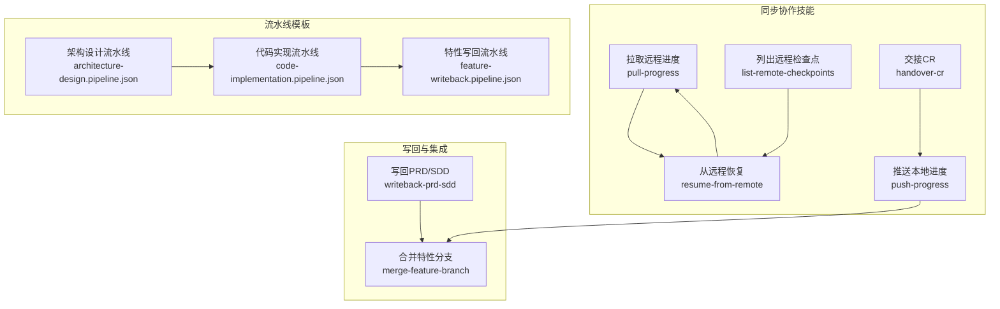

图表来源
- [pull-progress/SKILL.md](file://skills/sync/pull-progress/SKILL.md)
- [push-progress/SKILL.md](file://skills/sync/push-progress/SKILL.md)
- [resume-from-remote/SKILL.md](file://skills/sync/resume-from-remote/SKILL.md)
- [list-remote-checkpoints/SKILL.md](file://skills/sync/list-remote-checkpoints/SKILL.md)
- [handover-cr/SKILL.md](file://skills/sync/handover-cr/SKILL.md)
- [writeback-prd-sdd/SKILL.md](file://skills/writeback/writeback-prd-sdd/SKILL.md)
- [merge-feature-branch/SKILL.md](file://skills/writeback/merge-feature-branch/SKILL.md)
- [architecture-design.pipeline.json](file://pipeline-templates/architecture-design.pipeline.json)
- [code-implementation.pipeline.json](file://pipeline-templates/code-implementation.pipeline.json)
- [feature-writeback.pipeline.json](file://pipeline-templates/feature-writeback.pipeline.json)

章节来源
- [pull-progress/SKILL.md](file://skills/sync/pull-progress/SKILL.md)
- [push-progress/SKILL.md](file://skills/sync/push-progress/SKILL.md)
- [resume-from-remote/SKILL.md](file://skills/sync/resume-from-remote/SKILL.md)
- [list-remote-checkpoints/SKILL.md](file://skills/sync/list-remote-checkpoints/SKILL.md)
- [handover-cr/SKILL.md](file://skills/sync/handover-cr/SKILL.md)
- [writeback-prd-sdd/SKILL.md](file://skills/writeback/writeback-prd-sdd/SKILL.md)
- [merge-feature-branch/SKILL.md](file://skills/writeback/merge-feature-branch/SKILL.md)
- [architecture-design.pipeline.json](file://pipeline-templates/architecture-design.pipeline.json)
- [code-implementation.pipeline.json](file://pipeline-templates/code-implementation.pipeline.json)
- [feature-writeback.pipeline.json](file://pipeline-templates/feature-writeback.pipeline.json)

## 核心组件
本节对“同步协作”的关键能力进行分层说明，并给出职责边界与交互要点。

- 远程进度拉取（pull-progress）
  - 职责：从远端获取最新进度与检查点，用于本地继续执行或对齐状态
  - 关键输入：会话标识、目标远端地址、认证凭据、过滤条件（可选）
  - 关键输出：最新检查点、增量变更集、元数据（时间戳、版本、签名等）
  - 一致性：基于检查点序列号或版本号进行幂等拉取；支持断点续拉

- 本地进度推送（push-progress）
  - 职责：将本地完成的工作与中间检查点持久化到远端
  - 关键输入：当前工作单元、检查点快照、变更摘要、签名信息
  - 关键输出：远端确认回执、新的全局序列号
  - 一致性：采用乐观锁或版本号比较避免覆盖；失败重试与幂等提交

- 从远程恢复（resume-from-remote）
  - 职责：根据远端最新检查点恢复本地执行上下文，确保无缝接续
  - 关键输入：目标会话、期望恢复点（latest/by-id/by-time）、校验参数
  - 关键输出：恢复后的本地状态、待办清单、依赖项列表
  - 一致性：恢复前进行完整性校验与签名验证；必要时触发冲突检测

- 列出远程检查点（list-remote-checkpoints）
  - 职责：枚举远端可用检查点，辅助选择恢复点或审计历史
  - 关键输入：会话范围、时间窗口、分页参数
  - 关键输出：检查点列表（含ID、时间戳、摘要、来源节点）

- 交接CR（handover-cr）
  - 职责：在多节点间转移责任主体，更新协作元数据与权限
  - 关键输入：原负责人、新负责人、交接原因、审批标记
  - 关键输出：交接记录、权限变更事件、通知消息

- 写回PRD/SDD（writeback-prd-sdd）
  - 职责：将需求与设计产物写回到代码仓库或文档系统
  - 关键输入：产物路径、版本标签、变更说明
  - 关键输出：提交哈希、分支名、合并请求链接

- 合并特性分支（merge-feature-branch）
  - 职责：将特性分支合并入主干或发布分支，触发CI/CD
  - 关键输入：源分支、目标分支、合并策略、质量门禁结果
  - 关键输出：合并结果、构建日志、回归测试报告

章节来源
- [pull-progress/SKILL.md](file://skills/sync/pull-progress/SKILL.md)
- [push-progress/SKILL.md](file://skills/sync/push-progress/SKILL.md)
- [resume-from-remote/SKILL.md](file://skills/sync/resume-from-remote/SKILL.md)
- [list-remote-checkpoints/SKILL.md](file://skills/sync/list-remote-checkpoints/SKILL.md)
- [handover-cr/SKILL.md](file://skills/sync/handover-cr/SKILL.md)
- [writeback-prd-sdd/SKILL.md](file://skills/writeback/writeback-prd-sdd/SKILL.md)
- [merge-feature-branch/SKILL.md](file://skills/writeback/merge-feature-branch/SKILL.md)

## 架构总览
下图展示分布式协作的总体架构与数据流向，涵盖节点、远端存储、Git仓库与流水线编排。

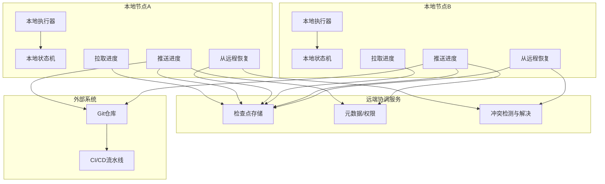

图表来源
- [pull-progress/SKILL.md](file://skills/sync/pull-progress/SKILL.md)
- [push-progress/SKILL.md](file://skills/sync/push-progress/SKILL.md)
- [resume-from-remote/SKILL.md](file://skills/sync/resume-from-remote/SKILL.md)
- [writeback-prd-sdd/SKILL.md](file://skills/writeback/writeback-prd-sdd/SKILL.md)
- [merge-feature-branch/SKILL.md](file://skills/writeback/merge-feature-branch/SKILL.md)

## 详细组件分析

### 远程进度拉取（pull-progress）
- 执行机制
  - 通过会话标识定位远端检查点集合
  - 按序列号或时间戳增量拉取，避免重复下载
  - 校验检查点签名与完整性，拒绝篡改数据
  - 返回增量变更集与最新全局序列号，供本地状态机收敛
- 数据同步策略
  - 使用单调递增的检查点ID保证顺序性
  - 支持按节点过滤，便于定向同步
- 冲突与一致性
  - 拉取后进入本地合并阶段，若检测到并行修改，交由冲突解决策略处理
  - 拉取操作幂等，多次执行不会产生副作用
- 网络异常处理
  - 指数退避重试、超时控制、熔断降级
  - 断点续传：记录已拉取的最大序列号，下次从断点继续

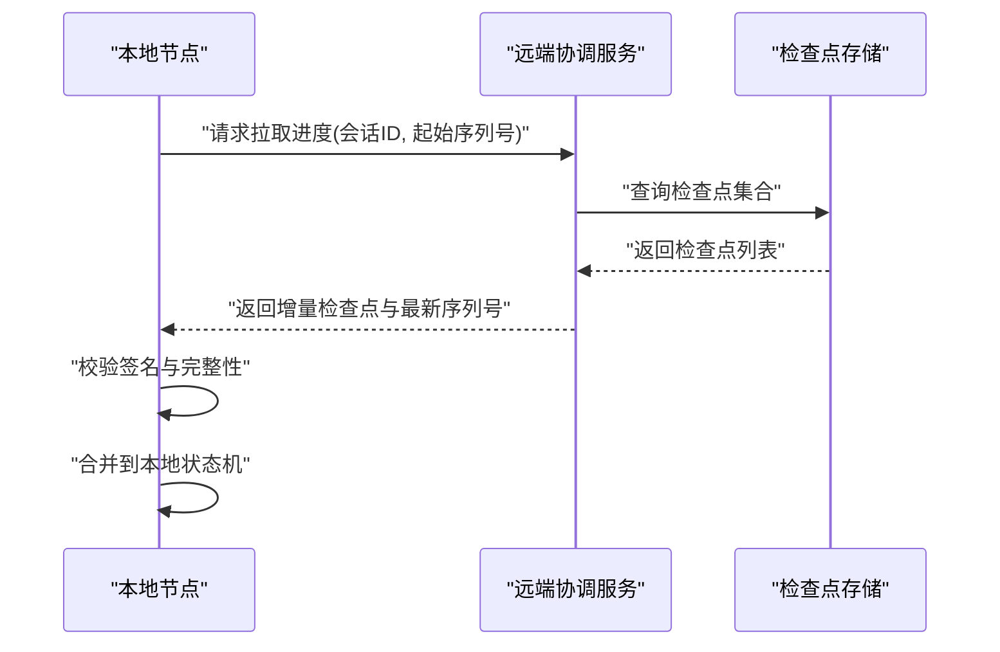

图表来源
- [pull-progress/SKILL.md](file://skills/sync/pull-progress/SKILL.md)

章节来源
- [pull-progress/SKILL.md](file://skills/sync/pull-progress/SKILL.md)

### 本地进度推送（push-progress）
- 执行机制
  - 生成检查点快照，附带变更摘要、签名与来源节点
  - 提交到远端，获得远端确认回执与新全局序列号
  - 失败时自动重试，保证至少一次语义
- 数据同步策略
  - 乐观并发控制：提交时携带期望版本，远端比较后决定接受或拒绝
  - 幂等提交：相同检查点ID不会重复写入
- 冲突与一致性
  - 版本不匹配时触发冲突检测，可选择重放或人工介入
  - 推送成功后广播事件，其他节点可拉取增量
- 网络异常处理
  - 重试与退避、连接池复用、限流保护
  - 失败回滚：未确认的提交视为未完成，避免半写状态

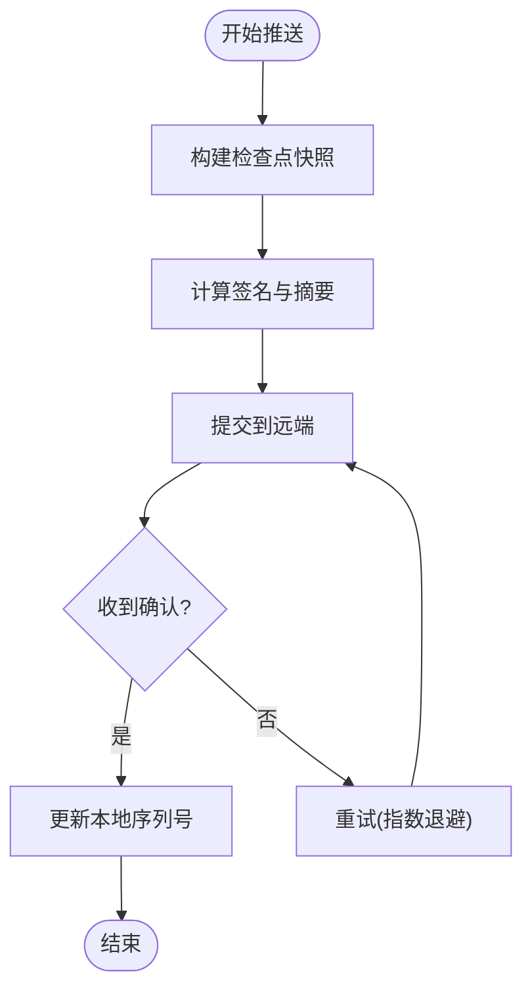

图表来源
- [push-progress/SKILL.md](file://skills/sync/push-progress/SKILL.md)

章节来源
- [push-progress/SKILL.md](file://skills/sync/push-progress/SKILL.md)

### 从远程恢复（resume-from-remote）
- 执行机制
  - 根据目标会话与恢复策略（最新/指定ID/时间窗口）选择检查点
  - 下载必要上下文与依赖项，重建本地执行环境
  - 校验恢复点完整性与权限，确保可安全继续
- 数据同步策略
  - 恢复后进入“收敛模式”，先拉取后续增量再执行
  - 支持选择性恢复（仅恢复特定任务或子图）
- 冲突与一致性
  - 恢复前进行差异比对，识别并行修改
  - 冲突解决策略包括：优先最新、优先本地、三方合并或人工决策
- 网络异常处理
  - 大对象分块下载、断点续传
  - 恢复失败时回滚到上一个稳定检查点

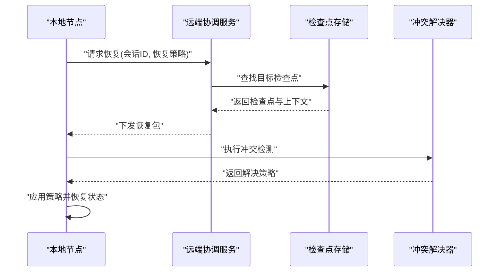

图表来源
- [resume-from-remote/SKILL.md](file://skills/sync/resume-from-remote/SKILL.md)

章节来源
- [resume-from-remote/SKILL.md](file://skills/sync/resume-from-remote/SKILL.md)

### 列出远程检查点（list-remote-checkpoints）
- 执行机制
  - 按会话、时间窗口、分页参数查询远端检查点索引
  - 返回检查点摘要（ID、时间戳、来源节点、大小、签名指纹）
- 用途
  - 辅助选择恢复点
  - 审计与追踪历史变更
  - 监控远端健康度与可用性

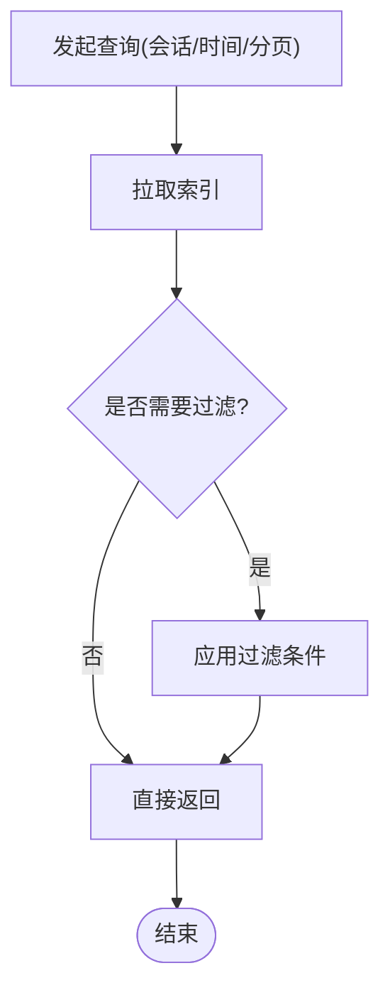

图表来源
- [list-remote-checkpoints/SKILL.md](file://skills/sync/list-remote-checkpoints/SKILL.md)

章节来源
- [list-remote-checkpoints/SKILL.md](file://skills/sync/list-remote-checkpoints/SKILL.md)

### 交接CR（handover-cr）
- 执行机制
  - 更新协作元数据中的负责人与权限
  - 记录交接原因与审批标记，形成不可变审计日志
  - 触发通知与下游任务迁移
- 权限管理
  - 基于角色的访问控制（RBAC），确保只有授权人员可交接
  - 交接前后进行权限校验，防止越权操作

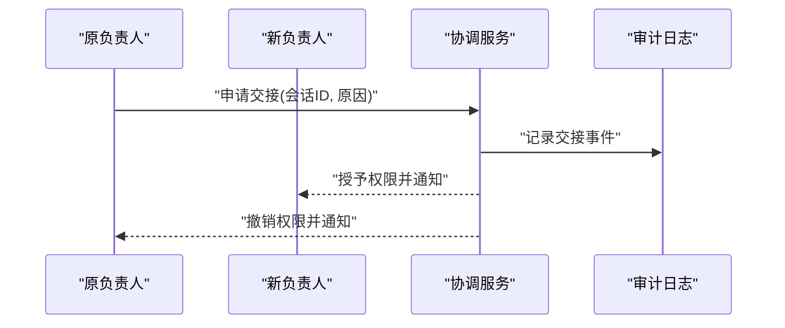

图表来源
- [handover-cr/SKILL.md](file://skills/sync/handover-cr/SKILL.md)

章节来源
- [handover-cr/SKILL.md](file://skills/sync/handover-cr/SKILL.md)

### 写回PRD/SDD（writeback-prd-sdd）
- 执行机制
  - 将产物打包并提交到Git仓库，附带版本标签与变更说明
  - 生成合并请求（MR/PR），触发CI/CD流水线
- 集成方式
  - 与Git仓库API对接，支持分支模型与标签策略
  - 与流水线模板联动，确保写回后自动构建与验证

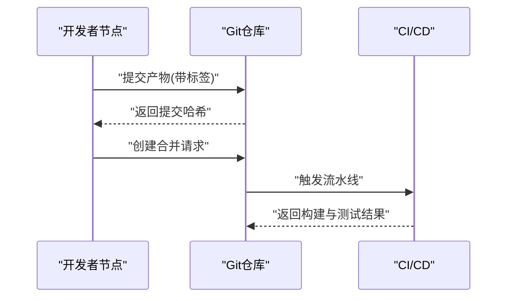

图表来源
- [writeback-prd-sdd/SKILL.md](file://skills/writeback/writeback-prd-sdd/SKILL.md)

章节来源
- [writeback-prd-sdd/SKILL.md](file://skills/writeback/writeback-prd-sdd/SKILL.md)

### 合并特性分支（merge-feature-branch）
- 执行机制
  - 将特性分支合并入主干或发布分支，遵循预定义的合并策略
  - 合并前执行质量门禁（静态检查、单元测试、回归测试）
- 集成方式
  - 与流水线模板协同，确保合并后自动部署与验证
  - 失败时自动回滚或保留隔离分支以便修复

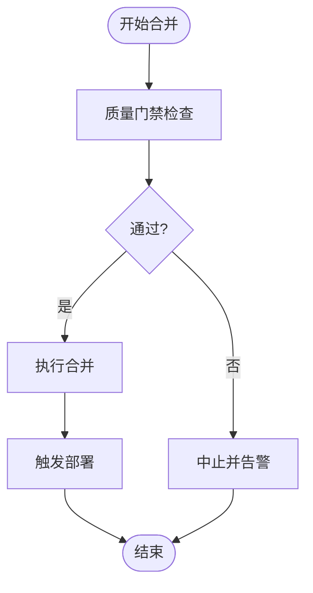

图表来源
- [merge-feature-branch/SKILL.md](file://skills/writeback/merge-feature-branch/SKILL.md)

章节来源
- [merge-feature-branch/SKILL.md](file://skills/writeback/merge-feature-branch/SKILL.md)

## 依赖分析
同步协作模块与外部系统的依赖关系如下：
- 远端协调服务：提供检查点存储、元数据管理与冲突解决
- Git仓库：作为产物与代码的最终一致存储
- CI/CD流水线：负责自动化构建、测试与部署
- 权限系统：提供身份认证与访问控制

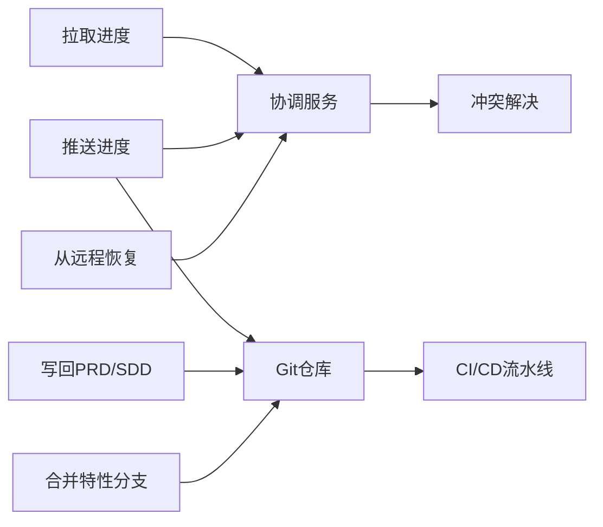

图表来源
- [pull-progress/SKILL.md](file://skills/sync/pull-progress/SKILL.md)
- [push-progress/SKILL.md](file://skills/sync/push-progress/SKILL.md)
- [resume-from-remote/SKILL.md](file://skills/sync/resume-from-remote/SKILL.md)
- [writeback-prd-sdd/SKILL.md](file://skills/writeback/writeback-prd-sdd/SKILL.md)
- [merge-feature-branch/SKILL.md](file://skills/writeback/merge-feature-branch/SKILL.md)

章节来源
- [pull-progress/SKILL.md](file://skills/sync/pull-progress/SKILL.md)
- [push-progress/SKILL.md](file://skills/sync/push-progress/SKILL.md)
- [resume-from-remote/SKILL.md](file://skills/sync/resume-from-remote/SKILL.md)
- [writeback-prd-sdd/SKILL.md](file://skills/writeback/writeback-prd-sdd/SKILL.md)
- [merge-feature-branch/SKILL.md](file://skills/writeback/merge-feature-branch/SKILL.md)

## 性能考虑
- 增量同步：仅传输变更部分，减少带宽与CPU开销
- 批量操作：合并多个小检查点为大批次，降低远端压力
- 缓存与去重：本地缓存最近检查点，避免重复下载
- 并发控制：限制并发拉取/推送数量，避免雪崩
- 压缩与编码：对大对象进行压缩，提升传输效率
- 异步与背压：使用队列与背压机制，平滑峰值流量

[本节为通用指导，无需具体文件引用]

## 故障排查指南
- 网络异常
  - 现象：拉取/推送超时、连接中断
  - 排查：检查网络连通性、远端服务健康、证书与鉴权配置
  - 处理：启用重试与退避，切换备用远端或离线模式
- 数据不一致
  - 现象：本地与远端状态不同步
  - 排查：对比检查点序列号与签名，定位缺失或重复提交
  - 处理：重新拉取增量，必要时全量恢复
- 冲突无法自动解决
  - 现象：并行修改导致合并失败
  - 排查：查看冲突详情与差异，确认业务优先级
  - 处理：人工介入合并，记录决策并更新策略
- 权限问题
  - 现象：无法拉取/推送或交接失败
  - 排查：检查角色与权限映射、令牌有效期
  - 处理：刷新凭证、调整权限策略

章节来源
- [pull-progress/SKILL.md](file://skills/sync/pull-progress/SKILL.md)
- [push-progress/SKILL.md](file://skills/sync/push-progress/SKILL.md)
- [resume-from-remote/SKILL.md](file://skills/sync/resume-from-remote/SKILL.md)
- [handover-cr/SKILL.md](file://skills/sync/handover-cr/SKILL.md)

## 结论
通过“拉取进度—推送进度—从远程恢复—列出检查点—交接CR—写回PRD/SDD—合并特性分支”的闭环能力，本模块在多节点分布式环境下实现了高可用的协作与一致性保障。配合流水线模板与Git仓库集成，可实现从设计到实现的端到端自动化与可追溯性。建议在生产环境中强化权限管控、冲突解决策略与监控告警，以提升整体稳定性与可维护性。

[本节为总结性内容，无需具体文件引用]

## 附录

### 流水线模板与协作集成
- 架构设计流水线：驱动需求与设计产物的生成与评审
- 代码实现流水线：驱动开发任务的执行与产物提交
- 特性写回流水线：驱动写回与合并，触发CI/CD

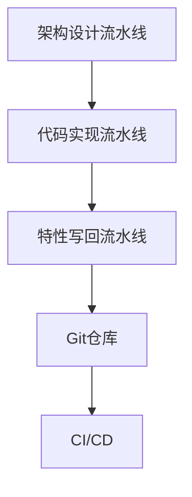

图表来源
- [architecture-design.pipeline.json](file://pipeline-templates/architecture-design.pipeline.json)
- [code-implementation.pipeline.json](file://pipeline-templates/code-implementation.pipeline.json)
- [feature-writeback.pipeline.json](file://pipeline-templates/feature-writeback.pipeline.json)

章节来源
- [architecture-design.pipeline.json](file://pipeline-templates/architecture-design.pipeline.json)
- [code-implementation.pipeline.json](file://pipeline-templates/code-implementation.pipeline.json)
- [feature-writeback.pipeline.json](file://pipeline-templates/feature-writeback.pipeline.json)