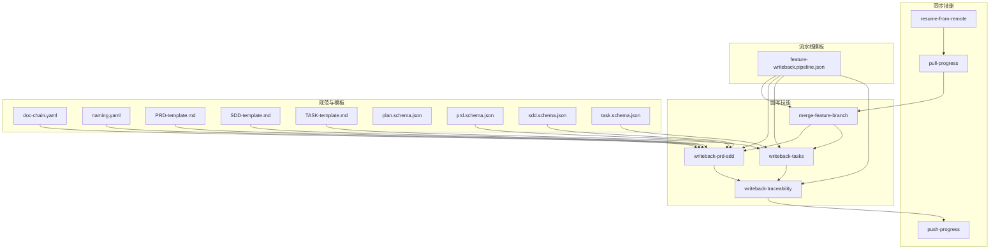
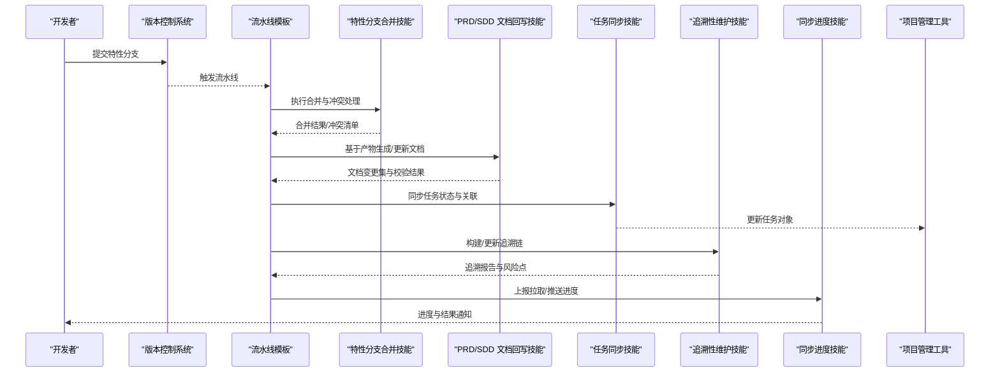
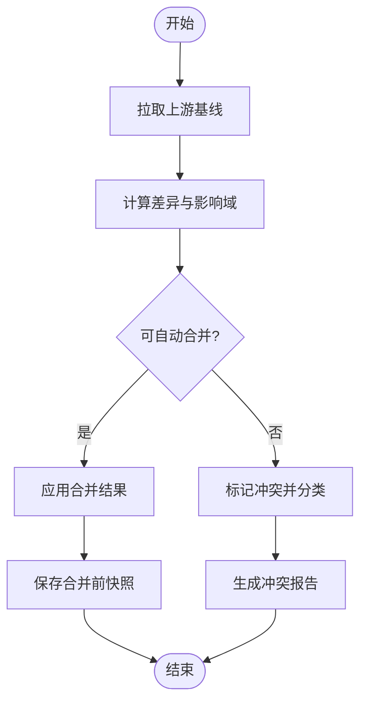
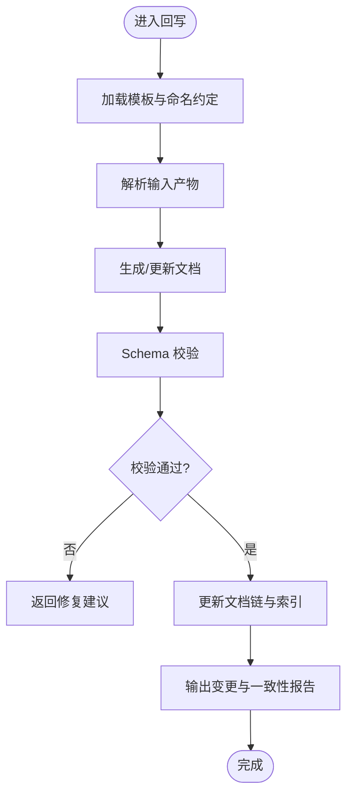
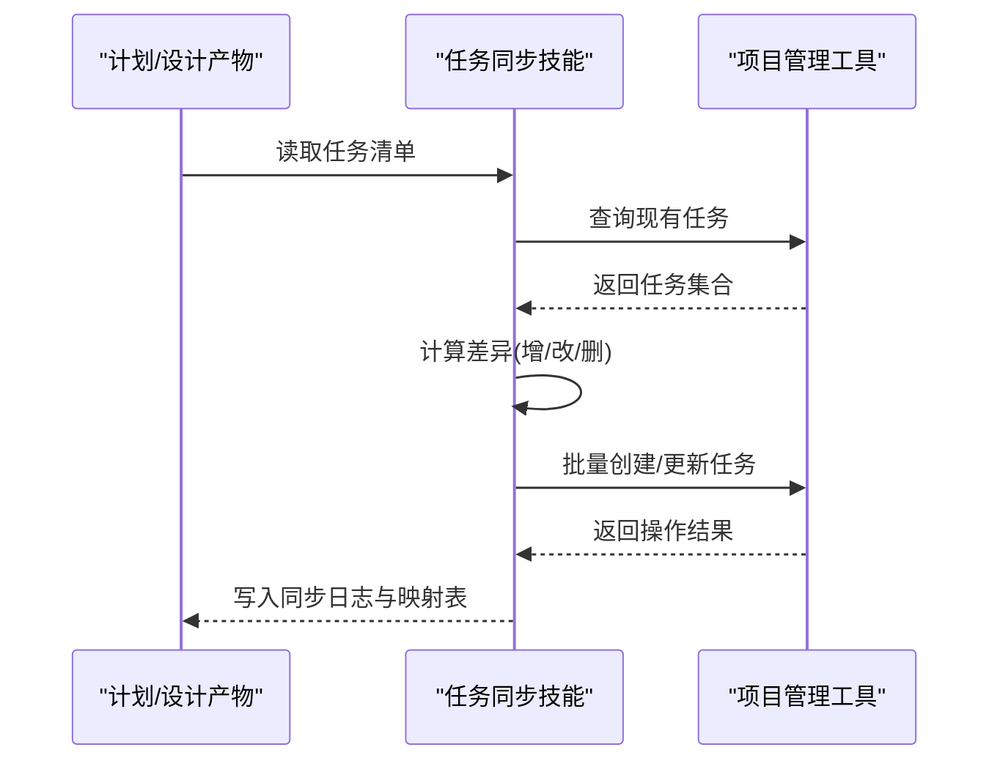
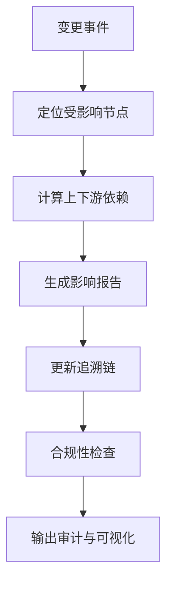
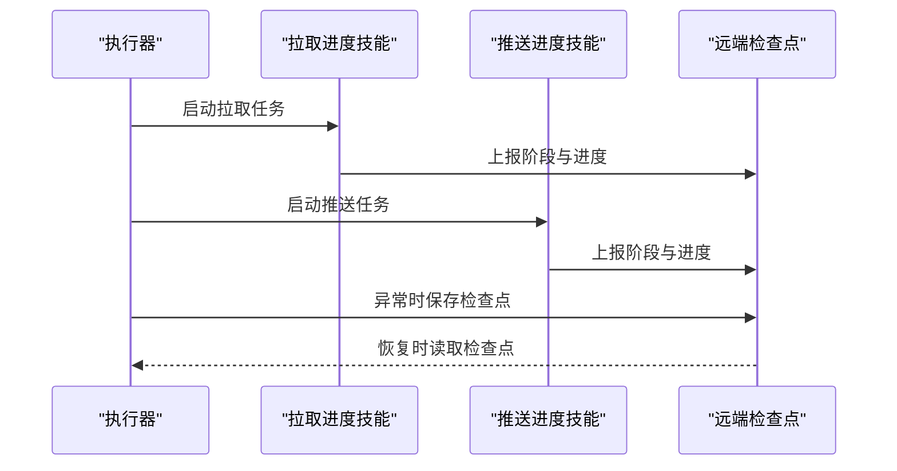
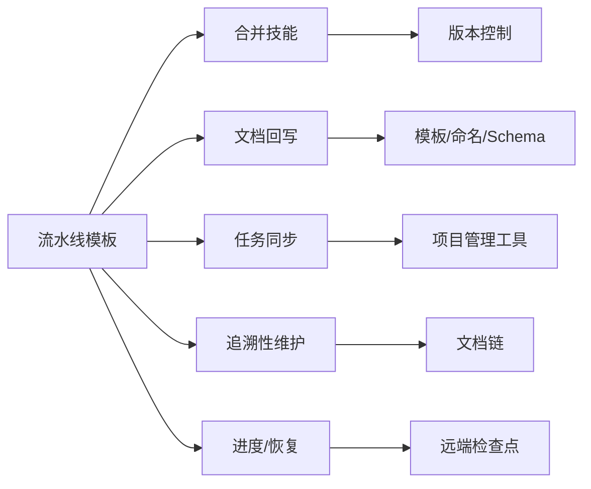

# 回写同步技能

<cite>
**本文引用的文件**   
- [feature-writeback.pipeline.json](file://pipeline-templates/feature-writeback.pipeline.json)
- [merge-feature-branch/SKILL.md](file://skills/writeback/merge-feature-branch/SKILL.md)
- [writeback-prd-sdd/SKILL.md](file://skills/writeback/writeback-prd-sdd/SKILL.md)
- [writeback-tasks/SKILL.md](file://skills/writeback/writeback-tasks/SKILL.md)
- [writeback-traceability/SKILL.md](file://skills/writeback/writeback-traceability/SKILL.md)
- [pull-progress/SKILL.md](file://skills/sync/pull-progress/SKILL.md)
- [push-progress/SKILL.md](file://skills/sync/push-progress/SKILL.md)
- [resume-from-remote/SKILL.md](file://skills/sync/resume-from-remote/SKILL.md)
- [engineer-docs/SKILL.md](file://skills/shared/engineering-docs/SKILL.md)
- [doc-chain.yaml](file://skills/shared/engineering-docs/conventions/doc-chain.yaml)
- [naming.yaml](file://skills/shared/engineering-docs/conventions/naming.yaml)
- [PRD-template.md](file://skills/shared/engineering-docs/templates/PRD-template.md)
- [SDD-template.md](file://skills/shared/engineering-docs/templates/SDD-template.md)
- [TASK-template.md](file://skills/shared/engineering-docs/templates/TASK-template.md)
- [plan.schema.json](file://skills/shared/engineering-docs/schemas/plan.schema.json)
- [prd.schema.json](file://skills/shared/engineering-docs/schemas/prd.schema.json)
- [sdd.schema.json](file://skills/shared/engineering-docs/schemas/sdd.schema.json)
- [task.schema.json](file://skills/shared/engineering-docs/schemas/task.schema.json)
- [validate-doc/SKILL.md](file://skills/shared/validate-doc/SKILL.md)
- [change-impact-analysis/SKILL.md](file://skills/review/change-impact-analysis/SKILL.md)
- [review-alignment/SKILL.md](file://skills/review/review-alignment/SKILL.md)
</cite>

## 目录
1. [简介](#简介)
2. [项目结构](#项目结构)
3. [核心组件](#核心组件)
4. [架构总览](#架构总览)
5. [详细组件分析](#详细组件分析)
6. [依赖分析](#依赖分析)
7. [性能考虑](#性能考虑)
8. [故障排查指南](#故障排查指南)
9. [结论](#结论)
10. [附录](#附录)

## 简介
本文件面向“回写同步技能模块”，系统性阐述特性分支合并、文档回写、任务同步与追溯性维护的回写机制，覆盖文档与代码一致性保证、变更传播与版本对齐策略；提供自动化代码合并策略、冲突解决与回滚实施方案；并给出文档追溯性维护、变更影响分析与合规性检查的自动化流程。同时说明与版本控制系统和项目管理工具的深度集成方式，帮助团队在工程化流水线中实现端到端可追踪、可验证、可回滚的协同闭环。

## 项目结构
围绕回写与同步能力，仓库采用“技能（SKILL）+ 模板/规范 + 流水线模板”的组织方式：
- 技能层：定义具体操作的可执行步骤与约束，如特性分支合并、PRD/SDD 回写、任务同步、追溯性维护等。
- 规范与模板层：统一文档命名、结构与校验规则，确保产出物一致性与可解析性。
- 流水线模板层：将多个技能编排为端到端工作流，驱动自动化执行与状态上报。

图表来源
- [feature-writeback.pipeline.json](file://pipeline-templates/feature-writeback.pipeline.json)
- [merge-feature-branch/SKILL.md](file://skills/writeback/merge-feature-branch/SKILL.md)
- [writeback-prd-sdd/SKILL.md](file://skills/writeback/writeback-prd-sdd/SKILL.md)
- [writeback-tasks/SKILL.md](file://skills/writeback/writeback-tasks/SKILL.md)
- [writeback-traceability/SKILL.md](file://skills/writeback/writeback-traceability/SKILL.md)
- [pull-progress/SKILL.md](file://skills/sync/pull-progress/SKILL.md)
- [push-progress/SKILL.md](file://skills/sync/push-progress/SKILL.md)
- [resume-from-remote/SKILL.md](file://skills/sync/resume-from-remote/SKILL.md)
- [doc-chain.yaml](file://skills/shared/engineering-docs/conventions/doc-chain.yaml)
- [naming.yaml](file://skills/shared/engineering-docs/conventions/naming.yaml)
- [PRD-template.md](file://skills/shared/engineering-docs/templates/PRD-template.md)
- [SDD-template.md](file://skills/shared/engineering-docs/templates/SDD-template.md)
- [TASK-template.md](file://skills/shared/engineering-docs/templates/TASK-template.md)
- [plan.schema.json](file://skills/shared/engineering-docs/schemas/plan.schema.json)
- [prd.schema.json](file://skills/shared/engineering-docs/schemas/prd.schema.json)
- [sdd.schema.json](file://skills/shared/engineering-docs/schemas/sdd.schema.json)
- [task.schema.json](file://skills/shared/engineering-docs/schemas/task.schema.json)

章节来源
- [feature-writeback.pipeline.json](file://pipeline-templates/feature-writeback.pipeline.json)
- [engineer-docs/SKILL.md](file://skills/shared/engineering-docs/SKILL.md)

## 核心组件
- 特性分支合并技能：负责拉取上游变更、创建或更新特性分支、执行自动合并与冲突检测、生成合并报告与回滚建议。
- PRD/SDD 文档回写技能：基于需求与设计产物，按模板与模式校验生成/更新文档，维护元数据与引用链。
- 任务同步技能：将计划/设计中的任务项映射到项目管理工具的任务对象，保持状态、优先级与关联关系一致。
- 追溯性维护技能：维护需求-设计-任务-代码的多维追溯链，支持影响面分析与合规性检查。
- 同步进度技能：提供拉取/推送进度的上报与恢复能力，保障长耗时任务的断点续跑。
- 规范与模板：通过命名约定、文档链约定、模板与 Schema 约束，确保文档结构化与可验证。

章节来源
- [merge-feature-branch/SKILL.md](file://skills/writeback/merge-feature-branch/SKILL.md)
- [writeback-prd-sdd/SKILL.md](file://skills/writeback/writeback-prd-sdd/SKILL.md)
- [writeback-tasks/SKILL.md](file://skills/writeback/writeback-tasks/SKILL.md)
- [writeback-traceability/SKILL.md](file://skills/writeback/writeback-traceability/SKILL.md)
- [pull-progress/SKILL.md](file://skills/sync/pull-progress/SKILL.md)
- [push-progress/SKILL.md](file://skills/sync/push-progress/SKILL.md)
- [resume-from-remote/SKILL.md](file://skills/sync/resume-from-remote/SKILL.md)
- [doc-chain.yaml](file://skills/shared/engineering-docs/conventions/doc-chain.yaml)
- [naming.yaml](file://skills/shared/engineering-docs/conventions/naming.yaml)
- [PRD-template.md](file://skills/shared/engineering-docs/templates/PRD-template.md)
- [SDD-template.md](file://skills/shared/engineering-docs/templates/SDD-template.md)
- [TASK-template.md](file://skills/shared/engineering-docs/templates/TASK-template.md)
- [prd.schema.json](file://skills/shared/engineering-docs/schemas/prd.schema.json)
- [sdd.schema.json](file://skills/shared/engineering-docs/schemas/sdd.schema.json)
- [task.schema.json](file://skills/shared/engineering-docs/schemas/task.schema.json)

## 架构总览
回写同步以“流水线模板”为编排入口，串联“合并-回写-同步-追溯-上报”的关键环节，形成从代码到文档再到任务的双向闭环。

图表来源
- [feature-writeback.pipeline.json](file://pipeline-templates/feature-writeback.pipeline.json)
- [merge-feature-branch/SKILL.md](file://skills/writeback/merge-feature-branch/SKILL.md)
- [writeback-prd-sdd/SKILL.md](file://skills/writeback/writeback-prd-sdd/SKILL.md)
- [writeback-tasks/SKILL.md](file://skills/writeback/writeback-tasks/SKILL.md)
- [writeback-traceability/SKILL.md](file://skills/writeback/writeback-traceability/SKILL.md)
- [pull-progress/SKILL.md](file://skills/sync/pull-progress/SKILL.md)
- [push-progress/SKILL.md](file://skills/sync/push-progress/SKILL.md)

## 详细组件分析

### 特性分支合并技能
职责与流程要点：
- 拉取上游最新基线，计算差异范围，识别潜在冲突区域。
- 执行自动合并策略：优先三方合并、保留必要注释、标记需人工确认的变更。
- 冲突检测与分级：对关键路径（接口、配置、公共模块）进行高优提示。
- 生成合并报告：包含变更摘要、受影响文件、风险评估与建议操作。
- 回滚支持：记录合并前快照，支持一键回滚至稳定基线。

图表来源
- [merge-feature-branch/SKILL.md](file://skills/writeback/merge-feature-branch/SKILL.md)

章节来源
- [merge-feature-branch/SKILL.md](file://skills/writeback/merge-feature-branch/SKILL.md)

### PRD/SDD 文档回写技能
职责与流程要点：
- 依据模板与命名约定生成/更新 PRD/SDD，确保字段完整与结构一致。
- 使用 Schema 进行强校验，拦截不合规变更。
- 维护文档链（doc-chain），建立需求-设计-实现的引用关系。
- 输出变更摘要与一致性报告，便于审查与审计。

图表来源
- [writeback-prd-sdd/SKILL.md](file://skills/writeback/writeback-prd-sdd/SKILL.md)
- [doc-chain.yaml](file://skills/shared/engineering-docs/conventions/doc-chain.yaml)
- [naming.yaml](file://skills/shared/engineering-docs/conventions/naming.yaml)
- [PRD-template.md](file://skills/shared/engineering-docs/templates/PRD-template.md)
- [SDD-template.md](file://skills/shared/engineering-docs/templates/SDD-template.md)
- [prd.schema.json](file://skills/shared/engineering-docs/schemas/prd.schema.json)
- [sdd.schema.json](file://skills/shared/engineering-docs/schemas/sdd.schema.json)

章节来源
- [writeback-prd-sdd/SKILL.md](file://skills/writeback/writeback-prd-sdd/SKILL.md)
- [doc-chain.yaml](file://skills/shared/engineering-docs/conventions/doc-chain.yaml)
- [naming.yaml](file://skills/shared/engineering-docs/conventions/naming.yaml)
- [PRD-template.md](file://skills/shared/engineering-docs/templates/PRD-template.md)
- [SDD-template.md](file://skills/shared/engineering-docs/templates/SDD-template.md)
- [prd.schema.json](file://skills/shared/engineering-docs/schemas/prd.schema.json)
- [sdd.schema.json](file://skills/shared/engineering-docs/schemas/sdd.schema.json)

### 任务同步技能
职责与流程要点：
- 将计划/设计中的任务项映射到项目管理工具的任务对象，保持 ID、标题、描述、优先级、状态与关联关系一致。
- 增量同步：仅处理新增/变更的任务，避免全量刷新带来的性能问题。
- 双向对齐：当外部系统修改任务时，反向更新本地计划/设计中的对应条目。
- 失败重试与幂等：确保重复执行不会产生重复任务或状态错乱。

图表来源
- [writeback-tasks/SKILL.md](file://skills/writeback/writeback-tasks/SKILL.md)
- [TASK-template.md](file://skills/shared/engineering-docs/templates/TASK-template.md)
- [task.schema.json](file://skills/shared/engineering-docs/schemas/task.schema.json)

章节来源
- [writeback-tasks/SKILL.md](file://skills/writeback/writeback-tasks/SKILL.md)
- [TASK-template.md](file://skills/shared/engineering-docs/templates/TASK-template.md)
- [task.schema.json](file://skills/shared/engineering-docs/schemas/task.schema.json)

### 追溯性维护技能
职责与流程要点：
- 维护需求-设计-任务-代码的多维追溯链，支持按任一节点向上/下游追溯。
- 变更影响分析：当某节点变更时，自动识别受影响节点并生成影响报告。
- 合规性检查：确保所有关键节点具备必要的元数据与审批记录。
- 可视化导出：输出追溯图与审计报告，辅助评审与审计。

图表来源
- [writeback-traceability/SKILL.md](file://skills/writeback/writeback-traceability/SKILL.md)
- [change-impact-analysis/SKILL.md](file://skills/review/change-impact-analysis/SKILL.md)
- [review-alignment/SKILL.md](file://skills/review/review-alignment/SKILL.md)

章节来源
- [writeback-traceability/SKILL.md](file://skills/writeback/writeback-traceability/SKILL.md)
- [change-impact-analysis/SKILL.md](file://skills/review/change-impact-analysis/SKILL.md)
- [review-alignment/SKILL.md](file://skills/review/review-alignment/SKILL.md)

### 同步进度与恢复技能
职责与流程要点：
- 拉取/推送进度上报：在长耗时操作中周期性上报进度，支持中断后恢复。
- 远程状态恢复：从远端检查点恢复执行上下文，避免重复劳动。
- 状态持久化：将关键状态落盘或写入远端，确保跨进程/跨实例一致性。

图表来源
- [pull-progress/SKILL.md](file://skills/sync/pull-progress/SKILL.md)
- [push-progress/SKILL.md](file://skills/sync/push-progress/SKILL.md)
- [resume-from-remote/SKILL.md](file://skills/sync/resume-from-remote/SKILL.md)

章节来源
- [pull-progress/SKILL.md](file://skills/sync/pull-progress/SKILL.md)
- [push-progress/SKILL.md](file://skills/sync/push-progress/SKILL.md)
- [resume-from-remote/SKILL.md](file://skills/sync/resume-from-remote/SKILL.md)

### 规范与模板体系
- 命名约定：统一文档与资源命名，降低歧义与检索成本。
- 文档链约定：明确文档间引用关系与层级，支撑追溯与影响分析。
- 模板与 Schema：标准化文档结构，结合校验提升质量与一致性。

章节来源
- [naming.yaml](file://skills/shared/engineering-docs/conventions/naming.yaml)
- [doc-chain.yaml](file://skills/shared/engineering-docs/conventions/doc-chain.yaml)
- [PRD-template.md](file://skills/shared/engineering-docs/templates/PRD-template.md)
- [SDD-template.md](file://skills/shared/engineering-docs/templates/SDD-template.md)
- [TASK-template.md](file://skills/shared/engineering-docs/templates/TASK-template.md)
- [plan.schema.json](file://skills/shared/engineering-docs/schemas/plan.schema.json)
- [prd.schema.json](file://skills/shared/engineering-docs/schemas/prd.schema.json)
- [sdd.schema.json](file://skills/shared/engineering-docs/schemas/sdd.schema.json)
- [task.schema.json](file://skills/shared/engineering-docs/schemas/task.schema.json)

## 依赖分析
- 内聚与耦合：各技能职责清晰，依赖集中在“规范与模板”与“流水线模板”。合并技能与文档回写、任务同步之间通过产物与报告解耦。
- 直接依赖：
  - 合并技能依赖版本控制接口与冲突检测逻辑。
  - 文档回写依赖模板、命名约定与 Schema 校验。
  - 任务同步依赖项目管理工具 API 与幂等映射表。
  - 追溯性维护依赖文档链与影响分析工具。
- 间接依赖：
  - 进度上报与恢复依赖远端检查点服务。
  - 合规性检查依赖审查技能与审计输出。

图表来源
- [feature-writeback.pipeline.json](file://pipeline-templates/feature-writeback.pipeline.json)
- [merge-feature-branch/SKILL.md](file://skills/writeback/merge-feature-branch/SKILL.md)
- [writeback-prd-sdd/SKILL.md](file://skills/writeback/writeback-prd-sdd/SKILL.md)
- [writeback-tasks/SKILL.md](file://skills/writeback/writeback-tasks/SKILL.md)
- [writeback-traceability/SKILL.md](file://skills/writeback/writeback-traceability/SKILL.md)
- [pull-progress/SKILL.md](file://skills/sync/pull-progress/SKILL.md)
- [push-progress/SKILL.md](file://skills/sync/push-progress/SKILL.md)
- [resume-from-remote/SKILL.md](file://skills/sync/resume-from-remote/SKILL.md)
- [doc-chain.yaml](file://skills/shared/engineering-docs/conventions/doc-chain.yaml)
- [naming.yaml](file://skills/shared/engineering-docs/conventions/naming.yaml)
- [PRD-template.md](file://skills/shared/engineering-docs/templates/PRD-template.md)
- [SDD-template.md](file://skills/shared/engineering-docs/templates/SDD-template.md)
- [TASK-template.md](file://skills/shared/engineering-docs/templates/TASK-template.md)
- [prd.schema.json](file://skills/shared/engineering-docs/schemas/prd.schema.json)
- [sdd.schema.json](file://skills/shared/engineering-docs/schemas/sdd.schema.json)
- [task.schema.json](file://skills/shared/engineering-docs/schemas/task.schema.json)

章节来源
- [feature-writeback.pipeline.json](file://pipeline-templates/feature-writeback.pipeline.json)

## 性能考虑
- 增量处理：任务同步与文档回写应优先采用增量策略，减少不必要的全量扫描与 I/O。
- 并行执行：流水线中无依赖的步骤可并行执行，缩短整体时长。
- 缓存与复用：对模板渲染、Schema 校验结果进行缓存，避免重复计算。
- 批量化操作：与项目管理工具的交互尽量批量提交，降低网络往返开销。
- 进度上报频率：合理设置上报间隔，平衡实时性与负载压力。

## 故障排查指南
- 合并失败
  - 检查冲突报告与受影响文件列表，定位关键路径冲突。
  - 查看合并前快照，必要时回滚至稳定基线。
- 文档校验失败
  - 根据 Schema 错误信息修正字段类型与必填项。
  - 核对命名约定与文档链引用是否完整。
- 任务同步异常
  - 检查幂等映射表与外部系统返回码，避免重复创建。
  - 确认权限与 API 限流策略。
- 追溯性缺失
  - 核查文档链完整性与元数据是否齐全。
  - 运行合规性检查，补齐缺失的审批与变更记录。
- 进度中断
  - 使用恢复技能从远端检查点继续执行。
  - 检查上报通道与存储可用性。

章节来源
- [merge-feature-branch/SKILL.md](file://skills/writeback/merge-feature-branch/SKILL.md)
- [writeback-prd-sdd/SKILL.md](file://skills/writeback/writeback-prd-sdd/SKILL.md)
- [writeback-tasks/SKILL.md](file://skills/writeback/writeback-tasks/SKILL.md)
- [writeback-traceability/SKILL.md](file://skills/writeback/writeback-traceability/SKILL.md)
- [pull-progress/SKILL.md](file://skills/sync/pull-progress/SKILL.md)
- [push-progress/SKILL.md](file://skills/sync/push-progress/SKILL.md)
- [resume-from-remote/SKILL.md](file://skills/sync/resume-from-remote/SKILL.md)
- [validate-doc/SKILL.md](file://skills/shared/validate-doc/SKILL.md)

## 结论
通过“合并-回写-同步-追溯-上报”的闭环设计与严格的规范/模板/校验体系，回写同步技能实现了从代码到文档再到任务的一致性与可追溯性。配合流水线编排与进度恢复能力，可在复杂协作场景中提供稳定、高效且可审计的工程化支撑。

## 附录
- 最佳实践
  - 在特性分支上尽早触发回写，减少后期整合成本。
  - 严格遵循命名与文档链约定，确保可检索与可追溯。
  - 对关键路径变更进行人工复核，自动化与人工互补。
- 扩展建议
  - 引入更细粒度的影响面分析指标，辅助发布决策。
  - 增强与 CI/CD 的质量门禁联动，提高合规性覆盖率。