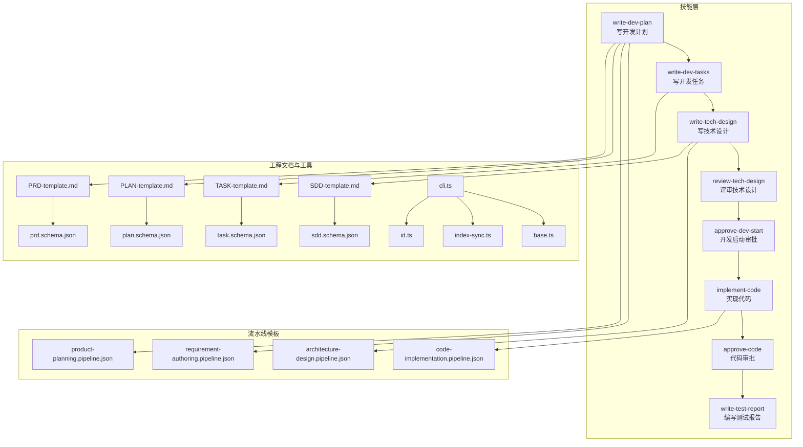
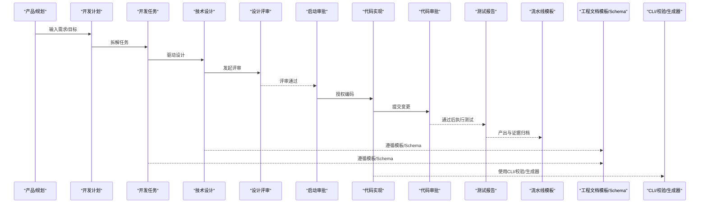
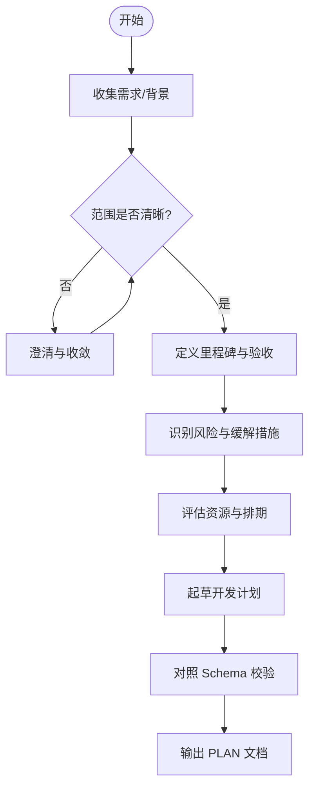
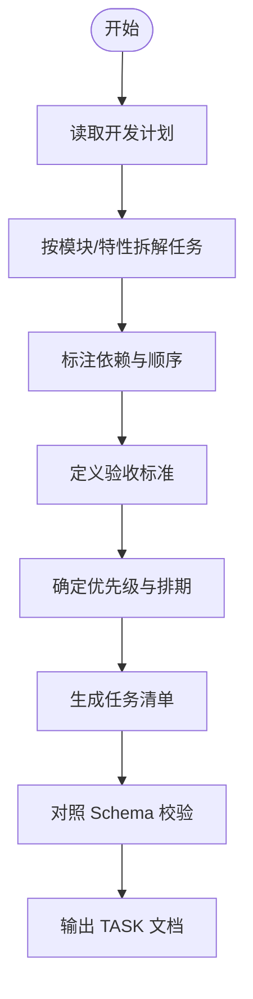
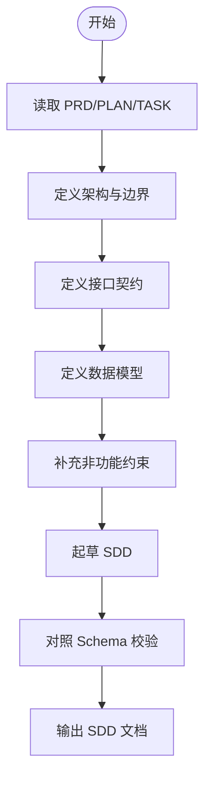
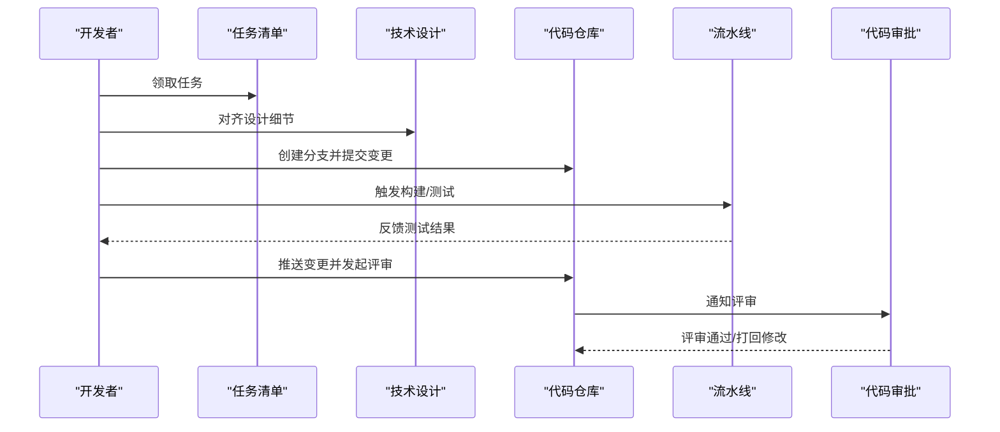
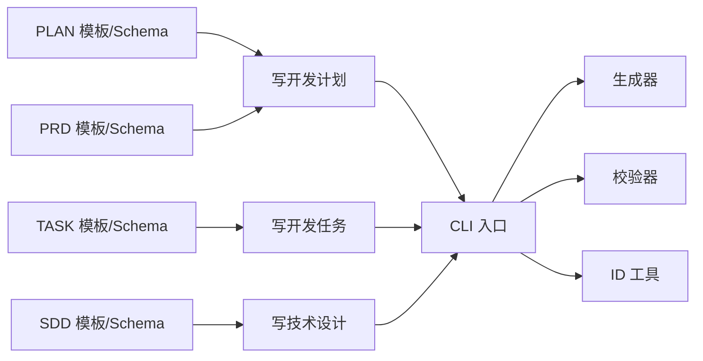

# 开发实施技能

<cite>
**本文引用的文件**   
- [agents/dev-agent.md](file://agents/dev-agent.md)
- [skills/develop/write-dev-plan/SKILL.md](file://skills/develop/write-dev-plan/SKILL.md)
- [skills/develop/write-dev-tasks/SKILL.md](file://skills/develop/write-dev-tasks/SKILL.md)
- [skills/develop/write-tech-design/SKILL.md](file://skills/develop/write-tech-design/SKILL.md)
- [skills/develop/review-tech-design/SKILL.md](file://skills/develop/review-tech-design/SKILL.md)
- [skills/develop/implement-code/SKILL.md](file://skills/develop/implement-code/SKILL.md)
- [skills/develop/approve-dev-start/SKILL.md](file://skills/develop/approve-dev-start/SKILL.md)
- [skills/develop/approve-tech-design/SKILL.md](file://skills/develop/approve-tech-design/SKILL.md)
- [skills/develop/approve-code/SKILL.md](file://skills/develop/approve-code/SKILL.md)
- [skills/develop/write-test-report/SKILL.md](file://skills/develop/write-test-report/SKILL.md)
- [pipeline-templates/code-implementation.pipeline.json](file://pipeline-templates/code-implementation.pipeline.json)
- [pipeline-templates/architecture-design.pipeline.json](file://pipeline-templates/architecture-design.pipeline.json)
- [pipeline-templates/requirement-authoring.pipeline.json](file://pipeline-templates/requirement-authoring.pipeline.json)
- [pipeline-templates/product-planning.pipeline.json](file://pipeline-templates/product-planning.pipeline.json)
- [shared/engineering-docs/templates/TASK-template.md](file://skills/shared/engineering-docs/templates/TASK-template.md)
- [shared/engineering-docs/templates/PLAN-template.md](file://skills/shared/engineering-docs/templates/PLAN-template.md)
- [shared/engineering-docs/templates/SDD-template.md](file://skills/shared/engineering-docs/templates/SDD-template.md)
- [shared/engineering-docs/templates/PRD-template.md](file://skills/shared/engineering-docs/templates/PRD-template.md)
- [shared/engineering-docs/schemas/task.schema.json](file://skills/shared/engineering-docs/schemas/task.schema.json)
- [shared/engineering-docs/schemas/plan.schema.json](file://skills/shared/engineering-docs/schemas/plan.schema.json)
- [shared/engineering-docs/schemas/sdd.schema.json](file://skills/shared/engineering-docs/schemas/sdd.schema.json)
- [shared/engineering-docs/schemas/prd.schema.json](file://skills/shared/engineering-docs/schemas/prd.schema.json)
- [shared/engineering-docs/scripts/src/cli.ts](file://skills/shared/engineering-docs/scripts/src/cli.ts)
- [shared/engineering-docs/scripts/src/generators/base.ts](file://skills/shared/engineering-docs/scripts/src/generators/base.ts)
- [shared/engineering-docs/scripts/src/validators/index-sync.ts](file://skills/shared/engineering-docs/scripts/src/validators/index-sync.ts)
- [shared/engineering-docs/scripts/src/utils/id.ts](file://skills/shared/engineering-docs/scripts/src/utils/id.ts)
- [shared/engineering-docs/scripts/package.json](file://skills/shared/engineering-docs/scripts/package.json)
</cite>

## 目录
1. [引言](#引言)
2. [项目结构](#项目结构)
3. [核心组件](#核心组件)
4. [架构总览](#架构总览)
5. [详细组件分析](#详细组件分析)
6. [依赖分析](#依赖分析)
7. [性能与效率优化](#性能与效率优化)
8. [故障排查指南](#故障排查指南)
9. [结论](#结论)
10. [附录](#附录)

## 引言
本文件面向“开发实施技能”模块，提供从开发计划制定、技术方案设计到代码实现与测试报告的完整开发技能链文档。内容覆盖：
- 阶段任务分解、任务分配与进度跟踪机制
- 开发启动审批与技术设计评审的分支管理与合并策略
- 开发任务模板、技术规范要求与测试用例生成示例
- 开发效率优化技巧与团队协作最佳实践

## 项目结构
该仓库围绕“技能（SKILL）+ 流水线模板（pipeline-templates）+ 工程文档规范与脚本（shared/engineering-docs）”组织，形成“能力定义—流程编排—产物规范—工具支撑”的闭环。

图表来源
- [skills/develop/write-dev-plan/SKILL.md](file://skills/develop/write-dev-plan/SKILL.md)
- [skills/develop/write-dev-tasks/SKILL.md](file://skills/develop/write-dev-tasks/SKILL.md)
- [skills/develop/write-tech-design/SKILL.md](file://skills/develop/write-tech-design/SKILL.md)
- [skills/develop/review-tech-design/SKILL.md](file://skills/develop/review-tech-design/SKILL.md)
- [skills/develop/approve-dev-start/SKILL.md](file://skills/develop/approve-dev-start/SKILL.md)
- [skills/develop/implement-code/SKILL.md](file://skills/develop/implement-code/SKILL.md)
- [skills/develop/approve-code/SKILL.md](file://skills/develop/approve-code/SKILL.md)
- [skills/develop/write-test-report/SKILL.md](file://skills/develop/write-test-report/SKILL.md)
- [pipeline-templates/architecture-design.pipeline.json](file://pipeline-templates/architecture-design.pipeline.json)
- [pipeline-templates/code-implementation.pipeline.json](file://pipeline-templates/code-implementation.pipeline.json)
- [pipeline-templates/requirement-authoring.pipeline.json](file://pipeline-templates/requirement-authoring.pipeline.json)
- [pipeline-templates/product-planning.pipeline.json](file://pipeline-templates/product-planning.pipeline.json)
- [skills/shared/engineering-docs/templates/TASK-template.md](file://skills/shared/engineering-docs/templates/TASK-template.md)
- [skills/shared/engineering-docs/templates/PLAN-template.md](file://skills/shared/engineering-docs/templates/PLAN-template.md)
- [skills/shared/engineering-docs/templates/SDD-template.md](file://skills/shared/engineering-docs/templates/SDD-template.md)
- [skills/shared/engineering-docs/templates/PRD-template.md](file://skills/shared/engineering-docs/templates/PRD-template.md)
- [skills/shared/engineering-docs/schemas/task.schema.json](file://skills/shared/engineering-docs/schemas/task.schema.json)
- [skills/shared/engineering-docs/schemas/plan.schema.json](file://skills/shared/engineering-docs/schemas/plan.schema.json)
- [skills/shared/engineering-docs/schemas/sdd.schema.json](file://skills/shared/engineering-docs/schemas/sdd.schema.json)
- [skills/shared/engineering-docs/schemas/prd.schema.json](file://skills/shared/engineering-docs/schemas/prd.schema.json)
- [skills/shared/engineering-docs/scripts/src/cli.ts](file://skills/shared/engineering-docs/scripts/src/cli.ts)
- [skills/shared/engineering-docs/scripts/src/generators/base.ts](file://skills/shared/engineering-docs/scripts/src/generators/base.ts)
- [skills/shared/engineering-docs/scripts/src/validators/index-sync.ts](file://skills/shared/engineering-docs/scripts/src/validators/index-sync.ts)
- [skills/shared/engineering-docs/scripts/src/utils/id.ts](file://skills/shared/engineering-docs/scripts/src/utils/id.ts)

章节来源
- [agents/dev-agent.md](file://agents/dev-agent.md)
- [skills/develop/write-dev-plan/SKILL.md](file://skills/develop/write-dev-plan/SKILL.md)
- [skills/develop/write-dev-tasks/SKILL.md](file://skills/develop/write-dev-tasks/SKILL.md)
- [skills/develop/write-tech-design/SKILL.md](file://skills/develop/write-tech-design/SKILL.md)
- [skills/develop/review-tech-design/SKILL.md](file://skills/develop/review-tech-design/SKILL.md)
- [skills/develop/approve-dev-start/SKILL.md](file://skills/develop/approve-dev-start/SKILL.md)
- [skills/develop/implement-code/SKILL.md](file://skills/develop/implement-code/SKILL.md)
- [skills/develop/approve-code/SKILL.md](file://skills/develop/approve-code/SKILL.md)
- [skills/develop/write-test-report/SKILL.md](file://skills/develop/write-test-report/SKILL.md)
- [pipeline-templates/code-implementation.pipeline.json](file://pipeline-templates/code-implementation.pipeline.json)
- [pipeline-templates/architecture-design.pipeline.json](file://pipeline-templates/architecture-design.pipeline.json)
- [pipeline-templates/requirement-authoring.pipeline.json](file://pipeline-templates/requirement-authoring.pipeline.json)
- [pipeline-templates/product-planning.pipeline.json](file://pipeline-templates/product-planning.pipeline.json)
- [skills/shared/engineering-docs/templates/TASK-template.md](file://skills/shared/engineering-docs/templates/TASK-template.md)
- [skills/shared/engineering-docs/templates/PLAN-template.md](file://skills/shared/engineering-docs/templates/PLAN-template.md)
- [skills/shared/engineering-docs/templates/SDD-template.md](file://skills/shared/engineering-docs/templates/SDD-template.md)
- [skills/shared/engineering-docs/templates/PRD-template.md](file://skills/shared/engineering-docs/templates/PRD-template.md)
- [skills/shared/engineering-docs/schemas/task.schema.json](file://skills/shared/engineering-docs/schemas/task.schema.json)
- [skills/shared/engineering-docs/schemas/plan.schema.json](file://skills/shared/engineering-docs/schemas/plan.schema.json)
- [skills/shared/engineering-docs/schemas/sdd.schema.json](file://skills/shared/engineering-docs/schemas/sdd.schema.json)
- [skills/shared/engineering-docs/schemas/prd.schema.json](file://skills/shared/engineering-docs/schemas/prd.schema.json)
- [skills/shared/engineering-docs/scripts/src/cli.ts](file://skills/shared/engineering-docs/scripts/src/cli.ts)
- [skills/shared/engineering-docs/scripts/src/generators/base.ts](file://skills/shared/engineering-docs/scripts/src/generators/base.ts)
- [skills/shared/engineering-docs/scripts/src/validators/index-sync.ts](file://skills/shared/engineering-docs/scripts/src/validators/index-sync.ts)
- [skills/shared/engineering-docs/scripts/src/utils/id.ts](file://skills/shared/engineering-docs/scripts/src/utils/id.ts)

## 核心组件
- 开发计划（write-dev-plan）：将需求转化为可执行的开发计划，明确范围、里程碑、风险与资源。
- 开发任务（write-dev-tasks）：基于计划拆解为具体任务，定义交付物、验收标准与依赖关系。
- 技术设计（write-tech-design）：输出系统/模块级设计说明，包含架构、接口、数据模型与非功能约束。
- 技术设计评审（review-tech-design）：对设计进行质量把关，确保可行性、一致性与可维护性。
- 开发启动审批（approve-dev-start）：在设计与任务就绪后，正式批准进入编码阶段。
- 代码实现（implement-code）：按任务与规范完成编码、单测与自测，提交变更。
- 代码审批（approve-code）：通过评审确认质量与合规，允许合并。
- 测试报告（write-test-report）：汇总测试过程、结果与回归情况，作为发布依据之一。

章节来源
- [skills/develop/write-dev-plan/SKILL.md](file://skills/develop/write-dev-plan/SKILL.md)
- [skills/develop/write-dev-tasks/SKILL.md](file://skills/develop/write-dev-tasks/SKILL.md)
- [skills/develop/write-tech-design/SKILL.md](file://skills/develop/write-tech-design/SKILL.md)
- [skills/develop/review-tech-design/SKILL.md](file://skills/develop/review-tech-design/SKILL.md)
- [skills/develop/approve-dev-start/SKILL.md](file://skills/develop/approve-dev-start/SKILL.md)
- [skills/develop/implement-code/SKILL.md](file://skills/develop/implement-code/SKILL.md)
- [skills/develop/approve-code/SKILL.md](file://skills/develop/approve-code/SKILL.md)
- [skills/develop/write-test-report/SKILL.md](file://skills/develop/write-test-report/SKILL.md)

## 架构总览
下图展示“技能—流水线—文档规范—工具脚本”的整体协作关系。

图表来源
- [skills/develop/write-dev-plan/SKILL.md](file://skills/develop/write-dev-plan/SKILL.md)
- [skills/develop/write-dev-tasks/SKILL.md](file://skills/develop/write-dev-tasks/SKILL.md)
- [skills/develop/write-tech-design/SKILL.md](file://skills/develop/write-tech-design/SKILL.md)
- [skills/develop/review-tech-design/SKILL.md](file://skills/develop/review-tech-design/SKILL.md)
- [skills/develop/approve-dev-start/SKILL.md](file://skills/develop/approve-dev-start/SKILL.md)
- [skills/develop/implement-code/SKILL.md](file://skills/develop/implement-code/SKILL.md)
- [skills/develop/approve-code/SKILL.md](file://skills/develop/approve-code/SKILL.md)
- [skills/develop/write-test-report/SKILL.md](file://skills/develop/write-test-report/SKILL.md)
- [pipeline-templates/code-implementation.pipeline.json](file://pipeline-templates/code-implementation.pipeline.json)
- [pipeline-templates/architecture-design.pipeline.json](file://pipeline-templates/architecture-design.pipeline.json)
- [skills/shared/engineering-docs/templates/TASK-template.md](file://skills/shared/engineering-docs/templates/TASK-template.md)
- [skills/shared/engineering-docs/templates/SDD-template.md](file://skills/shared/engineering-docs/templates/SDD-template.md)
- [skills/shared/engineering-docs/scripts/src/cli.ts](file://skills/shared/engineering-docs/scripts/src/cli.ts)

## 详细组件分析

### 开发计划（write-dev-plan）
- 职责：将业务目标转化为可度量的里程碑、范围边界、风险清单与资源计划；对齐上游需求与下游任务。
- 关键产出：开发计划文档（遵循 PLAN 模板），关联需求文档（PRD）。
- 与上下游：承接需求/规划，驱动任务拆解与技术设计。

图表来源
- [skills/develop/write-dev-plan/SKILL.md](file://skills/develop/write-dev-plan/SKILL.md)
- [skills/shared/engineering-docs/templates/PLAN-template.md](file://skills/shared/engineering-docs/templates/PLAN-template.md)
- [skills/shared/engineering-docs/schemas/plan.schema.json](file://skills/shared/engineering-docs/schemas/plan.schema.json)

章节来源
- [skills/develop/write-dev-plan/SKILL.md](file://skills/develop/write-dev-plan/SKILL.md)
- [skills/shared/engineering-docs/templates/PLAN-template.md](file://skills/shared/engineering-docs/templates/PLAN-template.md)
- [skills/shared/engineering-docs/schemas/plan.schema.json](file://skills/shared/engineering-docs/schemas/plan.schema.json)

### 开发任务（write-dev-tasks）
- 职责：将计划拆分为可独立交付的任务，明确依赖、验收标准与优先级。
- 关键产出：任务清单（遵循 TASK 模板），与计划/设计建立双向追溯。
- 与上下游：承接计划，驱动技术设计与实现。

图表来源
- [skills/develop/write-dev-tasks/SKILL.md](file://skills/develop/write-dev-tasks/SKILL.md)
- [skills/shared/engineering-docs/templates/TASK-template.md](file://skills/shared/engineering-docs/templates/TASK-template.md)
- [skills/shared/engineering-docs/schemas/task.schema.json](file://skills/shared/engineering-docs/schemas/task.schema.json)

章节来源
- [skills/develop/write-dev-tasks/SKILL.md](file://skills/develop/write-dev-tasks/SKILL.md)
- [skills/shared/engineering-docs/templates/TASK-template.md](file://skills/shared/engineering-docs/templates/TASK-template.md)
- [skills/shared/engineering-docs/schemas/task.schema.json](file://skills/shared/engineering-docs/schemas/task.schema.json)

### 技术设计（write-tech-design）
- 职责：输出系统/模块级设计说明，包括架构、接口、数据模型、部署与运维要点。
- 关键产出：技术设计文档（遵循 SDD 模板），与 PRD/PLAN/TASK 建立追溯。
- 与上下游：承接任务，驱动评审与实现。

图表来源
- [skills/develop/write-tech-design/SKILL.md](file://skills/develop/write-tech-design/SKILL.md)
- [skills/shared/engineering-docs/templates/SDD-template.md](file://skills/shared/engineering-docs/templates/SDD-template.md)
- [skills/shared/engineering-docs/schemas/sdd.schema.json](file://skills/shared/engineering-docs/schemas/sdd.schema.json)

章节来源
- [skills/develop/write-tech-design/SKILL.md](file://skills/develop/write-tech-design/SKILL.md)
- [skills/shared/engineering-docs/templates/SDD-template.md](file://skills/shared/engineering-docs/templates/SDD-template.md)
- [skills/shared/engineering-docs/schemas/sdd.schema.json](file://skills/shared/engineering-docs/schemas/sdd.schema.json)

### 技术设计评审（review-tech-design）
- 职责：对技术设计的完整性、可行性、一致性与风险进行评审，提出改进建议并记录结论。
- 关键产出：评审意见与结论，必要时触发修订再评。

章节来源
- [skills/develop/review-tech-design/SKILL.md](file://skills/develop/review-tech-design/SKILL.md)

### 开发启动审批（approve-dev-start）
- 职责：在设计评审通过、任务就绪且资源到位后，正式批准进入编码阶段。
- 关键产出：审批结论与前置条件检查清单。

章节来源
- [skills/develop/approve-dev-start/SKILL.md](file://skills/develop/approve-dev-start/SKILL.md)

### 代码实现（implement-code）
- 职责：按任务与设计实现代码，遵循工程规范，完善单测与自测，提交变更。
- 关键产出：代码变更、单测、变更记录与相关文档更新。
- 与上下游：承接设计/任务，驱动代码审批与测试。

图表来源
- [skills/develop/implement-code/SKILL.md](file://skills/develop/implement-code/SKILL.md)
- [pipeline-templates/code-implementation.pipeline.json](file://pipeline-templates/code-implementation.pipeline.json)

章节来源
- [skills/develop/implement-code/SKILL.md](file://skills/develop/implement-code/SKILL.md)
- [pipeline-templates/code-implementation.pipeline.json](file://pipeline-templates/code-implementation.pipeline.json)

### 代码审批（approve-code）
- 职责：对代码质量、可读性、安全性与一致性进行评审，确认符合规范后方可合并。
- 关键产出：评审意见与合并许可。

章节来源
- [skills/develop/approve-code/SKILL.md](file://skills/develop/approve-code/SKILL.md)

### 测试报告（write-test-report）
- 职责：汇总测试范围、用例、环境与结果，给出回归结论与风险提示。
- 关键产出：测试报告，作为发布准入依据之一。

章节来源
- [skills/develop/write-test-report/SKILL.md](file://skills/develop/write-test-report/SKILL.md)

## 依赖分析
- 技能间依赖：计划→任务→设计→评审→审批→实现→审批→测试报告，形成线性主链路。
- 模板与 Schema：各文档严格遵循对应模板与 Schema，保证结构化与可校验。
- 工具脚本：CLI 统一入口，调用生成器与校验器，辅助文档生成与一致性检查。

图表来源
- [skills/shared/engineering-docs/templates/PLAN-template.md](file://skills/shared/engineering-docs/templates/PLAN-template.md)
- [skills/shared/engineering-docs/templates/TASK-template.md](file://skills/shared/engineering-docs/templates/TASK-template.md)
- [skills/shared/engineering-docs/templates/SDD-template.md](file://skills/shared/engineering-docs/templates/SDD-template.md)
- [skills/shared/engineering-docs/templates/PRD-template.md](file://skills/shared/engineering-docs/templates/PRD-template.md)
- [skills/shared/engineering-docs/schemas/plan.schema.json](file://skills/shared/engineering-docs/schemas/plan.schema.json)
- [skills/shared/engineering-docs/schemas/task.schema.json](file://skills/shared/engineering-docs/schemas/task.schema.json)
- [skills/shared/engineering-docs/schemas/sdd.schema.json](file://skills/shared/engineering-docs/schemas/sdd.schema.json)
- [skills/shared/engineering-docs/schemas/prd.schema.json](file://skills/shared/engineering-docs/schemas/prd.schema.json)
- [skills/shared/engineering-docs/scripts/src/cli.ts](file://skills/shared/engineering-docs/scripts/src/cli.ts)
- [skills/shared/engineering-docs/scripts/src/generators/base.ts](file://skills/shared/engineering-docs/scripts/src/generators/base.ts)
- [skills/shared/engineering-docs/scripts/src/validators/index-sync.ts](file://skills/shared/engineering-docs/scripts/src/validators/index-sync.ts)
- [skills/shared/engineering-docs/scripts/src/utils/id.ts](file://skills/shared/engineering-docs/scripts/src/utils/id.ts)

章节来源
- [skills/shared/engineering-docs/scripts/src/cli.ts](file://skills/shared/engineering-docs/scripts/src/cli.ts)
- [skills/shared/engineering-docs/scripts/src/generators/base.ts](file://skills/shared/engineering-docs/scripts/src/generators/base.ts)
- [skills/shared/engineering-docs/scripts/src/validators/index-sync.ts](file://skills/shared/engineering-docs/scripts/src/validators/index-sync.ts)
- [skills/shared/engineering-docs/scripts/src/utils/id.ts](file://skills/shared/engineering-docs/scripts/src/utils/id.ts)

## 性能与效率优化
- 并行化任务拆分：将无强依赖的任务并行推进，缩短整体周期。
- 模板与 Schema 先行：以模板和 Schema 为基线，减少返工与格式不一致。
- 自动化校验：利用 CLI 与校验器在本地预检，降低流水线失败率。
- 增量式实现：小步快跑，频繁提交与评审，降低合并冲突风险。
- 流水线复用：复用现有 pipeline 模板，减少重复配置与维护成本。

[本节为通用指导，不直接分析具体文件]

## 故障排查指南
- 文档校验失败：优先检查对应 Schema 字段与必填项，定位错误行与原因。
- 模板不一致：对比模板版本与引用路径，确保使用最新模板。
- 流水线失败：查看流水线日志，定位构建/测试失败点，复现最小用例。
- 依赖缺失：确认包管理器与依赖安装状态，清理缓存后重试。
- ID 冲突：使用工具生成唯一标识，避免手工拼接导致重复。

章节来源
- [skills/shared/engineering-docs/scripts/src/validators/index-sync.ts](file://skills/shared/engineering-docs/scripts/src/validators/index-sync.ts)
- [skills/shared/engineering-docs/scripts/src/utils/id.ts](file://skills/shared/engineering-docs/scripts/src/utils/id.ts)
- [skills/shared/engineering-docs/scripts/package.json](file://skills/shared/engineering-docs/scripts/package.json)

## 结论
通过将“技能—流水线—模板—工具”一体化，开发实施技能实现了从计划到交付的可控、可度量与可追溯。建议在团队内推广模板与 Schema 的强制校验，结合流水线自动化，持续提升交付质量与效率。

[本节为总结性内容，不直接分析具体文件]

## 附录

### 开发阶段与任务分解参考
- 计划阶段：范围界定、里程碑、风险与资源评估。
- 任务阶段：任务拆解、依赖标注、验收标准与优先级。
- 设计阶段：架构、接口、数据模型与非功能约束。
- 实现阶段：编码、单测、自测与变更记录。
- 评审阶段：设计评审与代码评审，记录问题与结论。
- 测试阶段：测试范围、用例、环境、结果与回归结论。

章节来源
- [skills/develop/write-dev-plan/SKILL.md](file://skills/develop/write-dev-plan/SKILL.md)
- [skills/develop/write-dev-tasks/SKILL.md](file://skills/develop/write-dev-tasks/SKILL.md)
- [skills/develop/write-tech-design/SKILL.md](file://skills/develop/write-tech-design/SKILL.md)
- [skills/develop/review-tech-design/SKILL.md](file://skills/develop/review-tech-design/SKILL.md)
- [skills/develop/implement-code/SKILL.md](file://skills/develop/implement-code/SKILL.md)
- [skills/develop/approve-code/SKILL.md](file://skills/develop/approve-code/SKILL.md)
- [skills/develop/write-test-report/SKILL.md](file://skills/develop/write-test-report/SKILL.md)

### 分支管理与合并策略（建议）
- 分支命名：feature/<编号>-<简述>，hotfix/<编号>-<简述>，release/<版本号>。
- 合并策略：主干保护，至少一次评审通过；大改动采用分阶段合并与灰度验证。
- 变更追踪：每个任务对应一个分支与一次合并请求，保持一一对应。

[本节为通用实践建议，不直接分析具体文件]

### 测试用例生成示例（思路）
- 输入：任务清单中的验收标准与接口契约。
- 处理：按正向、异常、边界三类构造用例，映射到接口与数据模型。
- 输出：测试用例清单与预期结果，便于自动化执行与回归。

[本节为通用方法说明，不直接分析具体文件]

### 工程文档与工具使用说明
- 模板与 Schema：所有文档需遵循对应模板与 Schema，确保结构化与一致性。
- CLI 工具：统一入口，支持生成、校验与同步索引等能力。
- 生成器与校验器：封装通用逻辑，提升文档生产效率与正确性。

章节来源
- [skills/shared/engineering-docs/scripts/src/cli.ts](file://skills/shared/engineering-docs/scripts/src/cli.ts)
- [skills/shared/engineering-docs/scripts/src/generators/base.ts](file://skills/shared/engineering-docs/scripts/src/generators/base.ts)
- [skills/shared/engineering-docs/scripts/src/validators/index-sync.ts](file://skills/shared/engineering-docs/scripts/src/validators/index-sync.ts)
- [skills/shared/engineering-docs/scripts/src/utils/id.ts](file://skills/shared/engineering-docs/scripts/src/utils/id.ts)
- [skills/shared/engineering-docs/scripts/package.json](file://skills/shared/engineering-docs/scripts/package.json)