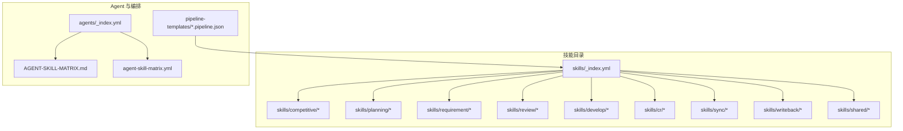
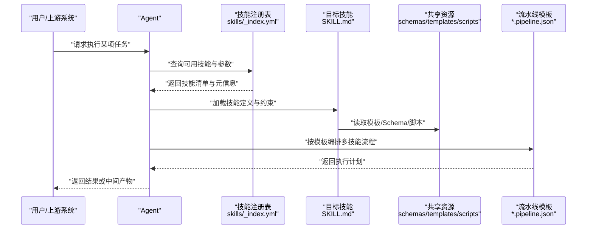
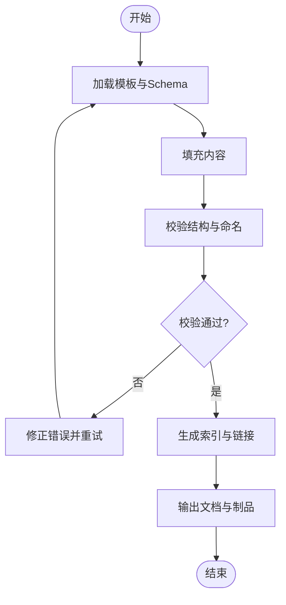
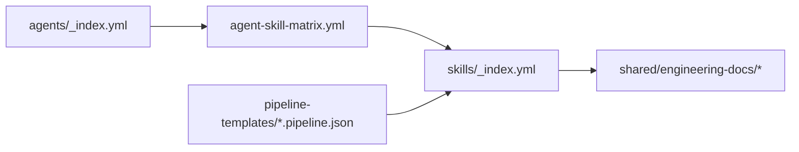

# 技能系统

<cite>
**本文引用的文件**   
- [skills/_index.yml](file://skills/_index.yml)
- [agents/_index.yml](file://agents/_index.yml)
- [AGENT-SKILL-MATRIX.md](file://AGENT-SKILL-MATRIX.md)
- [agent-skill-matrix.yml](file://agent-skill-matrix.yml)
- [dir-graph.yaml](file://dir-graph.yaml)
- [pipeline-templates/README.md](file://pipeline-templates/README.md)
- [pipeline-templates/architecture-design.pipeline.json](file://pipeline-templates/architecture-design.pipeline.json)
- [pipeline-templates/code-implementation.pipeline.json](file://pipeline-templates/code-implementation.pipeline.json)
- [pipeline-templates/competitive-radar.pipeline.json](file://pipeline-templates/competitive-radar.pipeline.json)
- [pipeline-templates/feature-writeback.pipeline.json](file://pipeline-templates/feature-writeback.pipeline.json)
- [pipeline-templates/market-to-plan.pipeline.json](file://pipeline-templates/market-to-plan.pipeline.json)
- [pipeline-templates/product-planning.pipeline.json](file://pipeline-templates/product-planning.pipeline.json)
- [pipeline-templates/requirement-authoring.pipeline.json](file://pipeline-templates/requirement-authoring.pipeline.json)
- [pipeline-templates/resume-cr.pipeline.json](file://pipeline-templates/resume-cr.pipeline.json)
- [skills/shared/engineering-docs/SKILL.md](file://skills/shared/engineering-docs/SKILL.md)
- [skills/shared/engineering-docs/schemas/common-defs.schema.json](file://skills/shared/engineering-docs/schemas/common-defs.schema.json)
- [skills/shared/engineering-docs/schemas/prd.schema.json](file://skills/shared/engineering-docs/schemas/prd.schema.json)
- [skills/shared/engineering-docs/schemas/sdd.schema.json](file://skills/shared/engineering-docs/schemas/sdd.schema.json)
- [skills/shared/engineering-docs/schemas/task.schema.json](file://skills/shared/engineering-docs/schemas/task.schema.json)
- [skills/shared/engineering-docs/templates/PRD-template.md](file://skills/shared/engineering-docs/templates/PRD-template.md)
- [skills/shared/engineering-docs/templates/SDD-template.md](file://skills/shared/engineering-docs/templates/SDD-template.md)
- [skills/shared/engineering-docs/templates/TASK-template.md](file://skills/shared/engineering-docs/templates/TASK-template.md)
- [skills/shared/engineering-docs/scripts/src/cli.ts](file://skills/shared/engineering-docs/scripts/src/cli.ts)
- [skills/shared/engineering-docs/scripts/src/registry.ts](file://skills/shared/engineering-docs/scripts/src/registry.ts)
- [skills/shared/engineering-docs/scripts/src/generators/base.ts](file://skills/shared/engineering-docs/scripts/src/generators/base.ts)
- [skills/shared/engineering-docs/scripts/src/validators/index-sync.ts](file://skills/shared/engineering-docs/scripts/src/validators/index-sync.ts)
- [skills/shared/engineering-docs/scripts/src/utils/fs.ts](file://skills/shared/engineering-docs/scripts/src/utils/fs.ts)
- [skills/shared/engineering-docs/scripts/src/utils/id.ts](file://skills/shared/engineering-docs/scripts/src/utils/id.ts)
- [skills/shared/engineering-docs/scripts/src/utils/slug.ts](file://skills/shared/engineering-docs/scripts/src/utils/slug.ts)
- [skills/shared/engineering-docs/scripts/package.json](file://skills/shared/engineering-docs/scripts/package.json)
- [skills/shared/engineering-docs/scripts/tsconfig.json](file://skills/shared/engineering-docs/scripts/tsconfig.json)
- [skills/shared/engineering-docs/scripts/vitest.config.ts](file://skills/shared/engineering-docs/scripts/vitest.config.ts)
- [skills/shared/validate-doc/SKILL.md](file://skills/shared/validate-doc/SKILL.md)
- [skills/reviewer-panel.yaml](file://skills/reviewer-panel.yaml)
- [skills/competitive/fetch-competitor-updates/SKILL.md](file://skills/competitive/fetch-competitor-updates/SKILL.md)
- [skills/competitive/write-competitive-report/SKILL.md](file://skills/competitive/write-competitive-report/SKILL.md)
- [skills/planning/conduct-market-research/SKILL.md](file://skills/planning/conduct-market-research/SKILL.md)
- [skills/planning/focus-briefing/SKILL.md](file://skills/planning/focus-briefing/SKILL.md)
- [skills/planning/planning-draft/SKILL.md](file://skills/planning/planning-draft/SKILL.md)
- [skills/planning/run-competitive-analysis/SKILL.md](file://skills/planning/run-competitive-analysis/SKILL.md)
- [skills/planning/write-insight-brief/SKILL.md](file://skills/planning/write-insight-brief/SKILL.md)
- [skills/planning/write-planning-entry/SKILL.md](file://skills/planning/write-planning-entry/SKILL.md)
- [skills/planning/write-planning-report/SKILL.md](file://skills/planning/write-planning-report/SKILL.md)
- [skills/planning/write-roadmap/SKILL.md](file://skills/planning/write-roadmap/SKILL.md)
- [skills/requirement/approve-requirement/SKILL.md](file://skills/requirement/approve-requirement/SKILL.md)
- [skills/requirement/requirement-register/SKILL.md](file://skills/requirement/requirement-register/SKILL.md)
- [skills/requirement/review-requirement/SKILL.md](file://skills/requirement/review-requirement/SKILL.md)
- [skills/requirement/write-requirement-prd/SKILL.md](file://skills/requirement/write-requirement-prd/SKILL.md)
- [skills/review/change-impact-analysis/SKILL.md](file://skills/review/change-impact-analysis/SKILL.md)
- [skills/review/review-alignment/SKILL.md](file://skills/review/review-alignment/SKILL.md)
- [skills/cr/cr-archive/SKILL.md](file://skills/cr/cr-archive/SKILL.md)
- [skills/cr/cr-dashboard/SKILL.md](file://skills/cr/cr-dashboard/SKILL.md)
- [skills/cr/cr-query/SKILL.md](file://skills/cr/cr-query/SKILL.md)
- [skills/cr/cr-review-record/SKILL.md](file://skills/cr/cr-review-record/SKILL.md)
- [skills/cr/cr-show/SKILL.md](file://skills/cr/cr-show/SKILL.md)
- [skills/cr/feedback-writeback/SKILL.md](file://skills/cr/feedback-writeback/SKILL.md)
- [skills/cr/inbox-emit/SKILL.md](file://skills/cr/inbox-emit/SKILL.md)
- [skills/develop/implement-code/SKILL.md](file://skills/develop/implement-code/SKILL.md)
- [skills/develop/write-dev-plan/SKILL.md](file://skills/develop/write-dev-plan/SKILL.md)
- [skills/develop/write-dev-tasks/SKILL.md](file://skills/develop/write-dev-tasks/SKILL.md)
- [skills/develop/write-tech-design/SKILL.md](file://skills/develop/write-tech-design/SKILL.md)
- [skills/develop/write-test-report/SKILL.md](file://skills/develop/write-test-report/SKILL.md)
- [skills/sync/pull-progress/SKILL.md](file://skills/sync/pull-progress/SKILL.md)
- [skills/sync/push-progress/SKILL.md](file://skills/sync/push-progress/SKILL.md)
- [skills/sync/resume-from-remote/SKILL.md](file://skills/sync/resume-from-remote/SKILL.md)
- [skills/writeback/merge-feature-branch/SKILL.md](file://skills/writeback/merge-feature-branch/SKILL.md)
- [skills/writeback/writeback-prd-sdd/SKILL.md](file://skills/writeback/writeback-prd-sdd/SKILL.md)
- [skills/writeback/writeback-tasks/SKILL.md](file://skills/writeback/writeback-tasks/SKILL.md)
- [skills/writeback/writeback-traceability/SKILL.md](file://skills/writeback/writeback-traceability/SKILL.md)
</cite>

## 目录
1. [简介](#简介)
2. [项目结构](#项目结构)
3. [核心组件](#核心组件)
4. [架构总览](#架构总览)
5. [详细组件分析](#详细组件分析)
6. [依赖关系分析](#依赖关系分析)
7. [性能考虑](#性能考虑)
8. [故障排查指南](#故障排查指南)
9. [结论](#结论)
10. [附录](#附录)

## 简介
本文件面向“技能系统”的构建者、使用者与维护者，系统性阐述技能的设计模式与架构原理，说明技能如何作为可复用的业务逻辑单元被 Agent 调用和执行。文档按功能领域对内置技能进行分类说明，涵盖竞争分析、代码审查、开发、规划、需求管理、审查、同步与回写等八大类；并给出技能的定义规范、参数配置、输入输出格式与执行流程。此外，提供自定义技能开发的完整指南（模板、测试策略、部署方式），以及实际使用示例与集成模式，解释技能间的依赖关系与组合方式。

## 项目结构
仓库采用“按能力域组织”的技能目录结构：每个技能以独立子目录表示，并通过 SKILL.md 描述其元数据、参数、输入输出与执行约定；共享资源（如工程文档模板、Schema、校验脚本）集中在 shared 目录；Agent 与 Pipeline 通过索引与矩阵文件声明对技能的引用与编排。

图表来源
- [skills/_index.yml](file://skills/_index.yml)
- [agents/_index.yml](file://agents/_index.yml)
- [AGENT-SKILL-MATRIX.md](file://AGENT-SKILL-MATRIX.md)
- [agent-skill-matrix.yml](file://agent-skill-matrix.yml)
- [pipeline-templates/README.md](file://pipeline-templates/README.md)

章节来源
- [skills/_index.yml](file://skills/_index.yml)
- [agents/_index.yml](file://agents/_index.yml)
- [AGENT-SKILL-MATRIX.md](file://AGENT-SKILL-MATRIX.md)
- [agent-skill-matrix.yml](file://agent-skill-matrix.yml)
- [dir-graph.yaml](file://dir-graph.yaml)
- [pipeline-templates/README.md](file://pipeline-templates/README.md)

## 核心组件
- 技能注册表与索引
  - skills/_index.yml：集中登记所有可用技能及其分类，供上层工具检索与发现。
  - reviewer-panel.yaml：评审相关面板的配置入口，聚合评审类技能。
- 工程文档体系（shared）
  - SKILL.md：工程文档生成与校验能力的技能说明。
  - schemas/*.schema.json：PRD、SDD、任务等文档的结构化约束。
  - templates/*.md：标准文档模板，确保产出一致性。
  - scripts/*：基于 TypeScript 的 CLI、注册表、生成器、校验器与工具函数，支撑文档链式生成与一致性校验。
- Agent 与技能矩阵
  - agents/_index.yml：Agent 清单与能力边界。
  - AGENT-SKILL-MATRIX.md / agent-skill-matrix.yml：Agent 与技能的映射关系，指导编排与权限控制。
- 流水线模板
  - pipeline-templates/*.pipeline.json：将多个技能串联为端到端工作流的标准模板，覆盖架构设计、编码实现、竞品雷达、特性回写、市场到规划、产品规划、需求编写、CR 恢复等场景。

章节来源
- [skills/_index.yml](file://skills/_index.yml)
- [skills/reviewer-panel.yaml](file://skills/reviewer-panel.yaml)
- [skills/shared/engineering-docs/SKILL.md](file://skills/shared/engineering-docs/SKILL.md)
- [skills/shared/engineering-docs/schemas/common-defs.schema.json](file://skills/shared/engineering-docs/schemas/common-defs.schema.json)
- [skills/shared/engineering-docs/schemas/prd.schema.json](file://skills/shared/engineering-docs/schemas/prd.schema.json)
- [skills/shared/engineering-docs/schemas/sdd.schema.json](file://skills/shared/engineering-docs/schemas/sdd.schema.json)
- [skills/shared/engineering-docs/schemas/task.schema.json](file://skills/shared/engineering-docs/schemas/task.schema.json)
- [skills/shared/engineering-docs/templates/PRD-template.md](file://skills/shared/engineering-docs/templates/PRD-template.md)
- [skills/shared/engineering-docs/templates/SDD-template.md](file://skills/shared/engineering-docs/templates/SDD-template.md)
- [skills/shared/engineering-docs/templates/TASK-template.md](file://skills/shared/engineering-docs/templates/TASK-template.md)
- [skills/shared/engineering-docs/scripts/src/cli.ts](file://skills/shared/engineering-docs/scripts/src/cli.ts)
- [skills/shared/engineering-docs/scripts/src/registry.ts](file://skills/shared/engineering-docs/scripts/src/registry.ts)
- [skills/shared/engineering-docs/scripts/src/generators/base.ts](file://skills/shared/engineering-docs/scripts/src/generators/base.ts)
- [skills/shared/engineering-docs/scripts/src/validators/index-sync.ts](file://skills/shared/engineering-docs/scripts/src/validators/index-sync.ts)
- [skills/shared/engineering-docs/scripts/src/utils/fs.ts](file://skills/shared/engineering-docs/scripts/src/utils/fs.ts)
- [skills/shared/engineering-docs/scripts/src/utils/id.ts](file://skills/shared/engineering-docs/scripts/src/utils/id.ts)
- [skills/shared/engineering-docs/scripts/src/utils/slug.ts](file://skills/shared/engineering-docs/scripts/src/utils/slug.ts)
- [skills/shared/engineering-docs/scripts/package.json](file://skills/shared/engineering-docs/scripts/package.json)
- [skills/shared/engineering-docs/scripts/tsconfig.json](file://skills/shared/engineering-docs/scripts/tsconfig.json)
- [skills/shared/engineering-docs/scripts/vitest.config.ts](file://skills/shared/engineering-docs/scripts/vitest.config.ts)
- [agents/_index.yml](file://agents/_index.yml)
- [AGENT-SKILL-MATRIX.md](file://AGENT-SKILL-MATRIX.md)
- [agent-skill-matrix.yml](file://agent-skill-matrix.yml)
- [pipeline-templates/README.md](file://pipeline-templates/README.md)

## 架构总览
技能系统遵循“声明式注册 + 结构化契约 + 可编排流水线”的架构原则：
- 声明式注册：每个技能在自身目录下提供 SKILL.md，并在全局索引中登记，便于发现和版本治理。
- 结构化契约：通过 Schema 与模板约束输入输出，保证跨 Agent 与流水线的一致性与可验证性。
- 可编排流水线：Pipeline 模板将多个技能串接为端到端流程，支持并行与条件分支（由具体运行时决定）。

图表来源
- [skills/_index.yml](file://skills/_index.yml)
- [skills/shared/engineering-docs/SKILL.md](file://skills/shared/engineering-docs/SKILL.md)
- [pipeline-templates/README.md](file://pipeline-templates/README.md)

## 详细组件分析

### 竞争分析技能（competitive）
- 典型技能
  - fetch-competitor-updates：拉取竞品动态，标准化为统一结构。
  - write-competitive-report：基于动态与洞察生成竞品分析报告。
- 输入输出
  - 输入：竞品列表、时间窗口、数据来源标识、报告风格偏好。
  - 输出：结构化竞品情报条目、可视化雷达数据、报告文档。
- 执行流程
  - 数据采集 → 清洗去重 → 洞察抽取 → 报告生成 → 归档与发布。
- 与其他技能的协作
  - 与 planning/run-competitive-analysis 联动，将竞品洞察注入规划阶段。

章节来源
- [skills/competitive/fetch-competitor-updates/SKILL.md](file://skills/competitive/fetch-competitor-updates/SKILL.md)
- [skills/competitive/write-competitive-report/SKILL.md](file://skills/competitive/write-competitive-report/SKILL.md)
- [skills/planning/run-competitive-analysis/SKILL.md](file://skills/planning/run-competitive-analysis/SKILL.md)

### 代码审查技能（cr）
- 典型技能
  - cr-query、cr-show、cr-dashboard：查询与展示变更单状态与详情。
  - cr-review-record：记录评审意见与决策。
  - feedback-writeback：将评审反馈回写到关联工件。
  - inbox-emit：将待办事项投递至收件箱。
  - cr-archive：归档历史变更单。
- 输入输出
  - 输入：变更单号、筛选条件、评审意见、附件。
  - 输出：结构化评审记录、仪表盘数据、归档包、收件箱消息。
- 执行流程
  - 查询/展示 → 评审记录 → 反馈回写 → 归档/通知。
- 与其他技能的协作
  - 与 develop/implement-code、writeback/* 配合，形成“评审-修改-合并”闭环。

章节来源
- [skills/cr/cr-query/SKILL.md](file://skills/cr/cr-query/SKILL.md)
- [skills/cr/cr-show/SKILL.md](file://skills/cr/cr-show/SKILL.md)
- [skills/cr/cr-dashboard/SKILL.md](file://skills/cr/cr-dashboard/SKILL.md)
- [skills/cr/cr-review-record/SKILL.md](file://skills/cr/cr-review-record/SKILL.md)
- [skills/cr/feedback-writeback/SKILL.md](file://skills/cr/feedback-writeback/SKILL.md)
- [skills/cr/inbox-emit/SKILL.md](file://skills/cr/inbox-emit/SKILL.md)
- [skills/cr/cr-archive/SKILL.md](file://skills/cr/cr-archive/SKILL.md)

### 开发技能（develop）
- 典型技能
  - implement-code：根据设计与任务实施代码。
  - write-dev-plan、write-dev-tasks：制定开发计划与任务分解。
  - write-tech-design：输出技术设计文档。
  - write-test-report：生成测试报告。
- 输入输出
  - 输入：需求/设计文档、任务清单、环境上下文。
  - 输出：代码变更、开发计划、技术设计、测试报告。
- 执行流程
  - 计划与任务 → 技术设计 → 编码实现 → 测试与报告。
- 与其他技能的协作
  - 依赖 requirement/* 产出的 PRD，并与 review/* 进行对齐检查。

章节来源
- [skills/develop/implement-code/SKILL.md](file://skills/develop/implement-code/SKILL.md)
- [skills/develop/write-dev-plan/SKILL.md](file://skills/develop/write-dev-plan/SKILL.md)
- [skills/develop/write-dev-tasks/SKILL.md](file://skills/develop/write-dev-tasks/SKILL.md)
- [skills/develop/write-tech-design/SKILL.md](file://skills/develop/write-tech-design/SKILL.md)
- [skills/develop/write-test-report/SKILL.md](file://skills/develop/write-test-report/SKILL.md)

### 规划技能（planning）
- 典型技能
  - conduct-market-research：开展市场调研。
  - focus-briefing：聚焦简报生成。
  - planning-draft：规划草案生成。
  - run-competitive-analysis：运行竞品分析。
  - write-insight-brief：撰写洞察简报。
  - write-planning-entry、write-planning-report：写入规划条目与报告。
  - write-roadmap：输出路线图。
- 输入输出
  - 输入：市场数据、用户反馈、竞品情报、产品上下文。
  - 输出：调研摘要、洞察简报、规划条目、路线图。
- 执行流程
  - 调研 → 洞察 → 规划草案 → 评审与定稿 → 路线图发布。
- 与其他技能的协作
  - 消费 competitive/* 的输出，驱动 requirement/* 与 develop/* 的后续工作。

章节来源
- [skills/planning/conduct-market-research/SKILL.md](file://skills/planning/conduct-market-research/SKILL.md)
- [skills/planning/focus-briefing/SKILL.md](file://skills/planning/focus-briefing/SKILL.md)
- [skills/planning/planning-draft/SKILL.md](file://skills/planning/planning-draft/SKILL.md)
- [skills/planning/run-competitive-analysis/SKILL.md](file://skills/planning/run-competitive-analysis/SKILL.md)
- [skills/planning/write-insight-brief/SKILL.md](file://skills/planning/write-insight-brief/SKILL.md)
- [skills/planning/write-planning-entry/SKILL.md](file://skills/planning/write-planning-entry/SKILL.md)
- [skills/planning/write-planning-report/SKILL.md](file://skills/planning/write-planning-report/SKILL.md)
- [skills/planning/write-roadmap/SKILL.md](file://skills/planning/write-roadmap/SKILL.md)

### 需求管理技能（requirement）
- 典型技能
  - requirement-register：需求注册与基线化。
  - write-requirement-prd：生成 PRD。
  - review-requirement：需求评审。
  - approve-requirement：需求批准。
- 输入输出
  - 输入：原始需求、背景资料、约束条件。
  - 输出：注册记录、PRD 文档、评审意见、批准结论。
- 执行流程
  - 注册 → 起草 PRD → 评审 → 批准 → 进入下游。
- 与其他技能的协作
  - 为 planning/* 与 develop/* 提供权威输入。

章节来源
- [skills/requirement/requirement-register/SKILL.md](file://skills/requirement/requirement-register/SKILL.md)
- [skills/requirement/write-requirement-prd/SKILL.md](file://skills/requirement/write-requirement-prd/SKILL.md)
- [skills/requirement/review-requirement/SKILL.md](file://skills/requirement/review-requirement/SKILL.md)
- [skills/requirement/approve-requirement/SKILL.md](file://skills/requirement/approve-requirement/SKILL.md)

### 审查技能（review）
- 典型技能
  - change-impact-analysis：变更影响分析。
  - review-alignment：对齐度审查（与需求/设计/路线图的契合度）。
- 输入输出
  - 输入：变更范围、受影响模块、质量门禁规则。
  - 输出：影响分析报告、对齐度评分与建议。
- 执行流程
  - 收集变更上下文 → 影响面识别 → 风险评估 → 审查结论。
- 与其他技能的协作
  - 与 cr/* 和 develop/* 紧密协作，保障质量与一致性。

章节来源
- [skills/review/change-impact-analysis/SKILL.md](file://skills/review/change-impact-analysis/SKILL.md)
- [skills/review/review-alignment/SKILL.md](file://skills/review/review-alignment/SKILL.md)

### 同步技能（sync）
- 典型技能
  - pull-progress：拉取进度同步。
  - push-progress：推送进度同步。
  - resume-from-remote：从远端恢复执行。
- 输入输出
  - 输入：远端位置、断点信息、增量标记。
  - 输出：本地进度快照、恢复上下文。
- 执行流程
  - 探测远端状态 → 计算差异 → 增量同步 → 恢复执行。
- 与其他技能的协作
  - 为长耗时流水线提供容错与续跑能力。

章节来源
- [skills/sync/pull-progress/SKILL.md](file://skills/sync/pull-progress/SKILL.md)
- [skills/sync/push-progress/SKILL.md](file://skills/sync/push-progress/SKILL.md)
- [skills/sync/resume-from-remote/SKILL.md](file://skills/sync/resume-from-remote/SKILL.md)

### 回写技能（writeback）
- 典型技能
  - merge-feature-branch：合并特性分支。
  - writeback-prd-sdd：将 PRD/SDD 回写到目标仓库。
  - writeback-tasks：任务级回写。
  - writeback-traceability：追溯关系回写。
- 输入输出
  - 输入：源工件、目标位置、合并策略、追溯映射。
  - 输出：合并结果、更新后的工件、追溯图谱。
- 执行流程
  - 准备合并 → 应用变更 → 生成追溯 → 提交与通知。
- 与其他技能的协作
  - 承接 develop/* 与 cr/* 的产出，完成最终交付。

章节来源
- [skills/writeback/merge-feature-branch/SKILL.md](file://skills/writeback/merge-feature-branch/SKILL.md)
- [skills/writeback/writeback-prd-sdd/SKILL.md](file://skills/writeback/writeback-prd-sdd/SKILL.md)
- [skills/writeback/writeback-tasks/SKILL.md](file://skills/writeback/writeback-tasks/SKILL.md)
- [skills/writeback/writeback-traceability/SKILL.md](file://skills/writeback/writeback-traceability/SKILL.md)

### 共享工程文档能力（shared/engineering-docs）
- 职责
  - 提供工程文档的模板、Schema 与校验/生成脚本，确保文档一致性与可验证性。
- 关键要素
  - 模板：PRD、SDD、TASK 等标准模板。
  - Schema：common-defs、prd、sdd、task 等结构约束。
  - 脚本：CLI、注册表、生成器、校验器与通用工具（FS、ID、Slug）。
- 执行模型
  - 基于模板与 Schema 生成文档，并通过校验器保证索引同步与命名规范。

图表来源
- [skills/shared/engineering-docs/SKILL.md](file://skills/shared/engineering-docs/SKILL.md)
- [skills/shared/engineering-docs/schemas/common-defs.schema.json](file://skills/shared/engineering-docs/schemas/common-defs.schema.json)
- [skills/shared/engineering-docs/schemas/prd.schema.json](file://skills/shared/engineering-docs/schemas/prd.schema.json)
- [skills/shared/engineering-docs/schemas/sdd.schema.json](file://skills/shared/engineering-docs/schemas/sdd.schema.json)
- [skills/shared/engineering-docs/schemas/task.schema.json](file://skills/shared/engineering-docs/schemas/task.schema.json)
- [skills/shared/engineering-docs/templates/PRD-template.md](file://skills/shared/engineering-docs/templates/PRD-template.md)
- [skills/shared/engineering-docs/templates/SDD-template.md](file://skills/shared/engineering-docs/templates/SDD-template.md)
- [skills/shared/engineering-docs/templates/TASK-template.md](file://skills/shared/engineering-docs/templates/TASK-template.md)
- [skills/shared/engineering-docs/scripts/src/cli.ts](file://skills/shared/engineering-docs/scripts/src/cli.ts)
- [skills/shared/engineering-docs/scripts/src/registry.ts](file://skills/shared/engineering-docs/scripts/src/registry.ts)
- [skills/shared/engineering-docs/scripts/src/generators/base.ts](file://skills/shared/engineering-docs/scripts/src/generators/base.ts)
- [skills/shared/engineering-docs/scripts/src/validators/index-sync.ts](file://skills/shared/engineering-docs/scripts/src/validators/index-sync.ts)
- [skills/shared/engineering-docs/scripts/src/utils/fs.ts](file://skills/shared/engineering-docs/scripts/src/utils/fs.ts)
- [skills/shared/engineering-docs/scripts/src/utils/id.ts](file://skills/shared/engineering-docs/scripts/src/utils/id.ts)
- [skills/shared/engineering-docs/scripts/src/utils/slug.ts](file://skills/shared/engineering-docs/scripts/src/utils/slug.ts)

章节来源
- [skills/shared/engineering-docs/SKILL.md](file://skills/shared/engineering-docs/SKILL.md)
- [skills/shared/engineering-docs/schemas/common-defs.schema.json](file://skills/shared/engineering-docs/schemas/common-defs.schema.json)
- [skills/shared/engineering-docs/schemas/prd.schema.json](file://skills/shared/engineering-docs/schemas/prd.schema.json)
- [skills/shared/engineering-docs/schemas/sdd.schema.json](file://skills/shared/engineering-docs/schemas/sdd.schema.json)
- [skills/shared/engineering-docs/schemas/task.schema.json](file://skills/shared/engineering-docs/schemas/task.schema.json)
- [skills/shared/engineering-docs/templates/PRD-template.md](file://skills/shared/engineering-docs/templates/PRD-template.md)
- [skills/shared/engineering-docs/templates/SDD-template.md](file://skills/shared/engineering-docs/templates/SDD-template.md)
- [skills/shared/engineering-docs/templates/TASK-template.md](file://skills/shared/engineering-docs/templates/TASK-template.md)
- [skills/shared/engineering-docs/scripts/src/cli.ts](file://skills/shared/engineering-docs/scripts/src/cli.ts)
- [skills/shared/engineering-docs/scripts/src/registry.ts](file://skills/shared/engineering-docs/scripts/src/registry.ts)
- [skills/shared/engineering-docs/scripts/src/generators/base.ts](file://skills/shared/engineering-docs/scripts/src/generators/base.ts)
- [skills/shared/engineering-docs/scripts/src/validators/index-sync.ts](file://skills/shared/engineering-docs/scripts/src/validators/index-sync.ts)
- [skills/shared/engineering-docs/scripts/src/utils/fs.ts](file://skills/shared/engineering-docs/scripts/src/utils/fs.ts)
- [skills/shared/engineering-docs/scripts/src/utils/id.ts](file://skills/shared/engineering-docs/scripts/src/utils/id.ts)
- [skills/shared/engineering-docs/scripts/src/utils/slug.ts](file://skills/shared/engineering-docs/scripts/src/utils/slug.ts)

### 文档校验能力（shared/validate-doc）
- 职责
  - 提供文档一致性校验技能，确保模板、Schema 与索引同步。
- 输入输出
  - 输入：文档集合、索引文件、校验规则。
  - 输出：校验报告、修复建议。

章节来源
- [skills/shared/validate-doc/SKILL.md](file://skills/shared/validate-doc/SKILL.md)

## 依赖关系分析
- Agent 与技能映射
  - agents/_index.yml 与 agent-skill-matrix.yml 共同定义各 Agent 可调用的技能集，用于权限与能力边界控制。
  - AGENT-SKILL-MATRIX.md 提供人类可读的矩阵说明。
- 流水线与技能编排
  - pipeline-templates/*.pipeline.json 将多个技能串联为端到端流程，例如：
    - architecture-design.pipeline.json：架构设计流程。
    - code-implementation.pipeline.json：编码实现流程。
    - competitive-radar.pipeline.json：竞品雷达流程。
    - feature-writeback.pipeline.json：特性回写流程。
    - market-to-plan.pipeline.json：市场到规划流程。
    - product-planning.pipeline.json：产品规划流程。
    - requirement-authoring.pipeline.json：需求编写流程。
    - resume-cr.pipeline.json：CR 恢复流程。
- 共享资源依赖
  - 多数技能依赖 shared/engineering-docs 的模板与 Schema，确保文档一致性。

图表来源
- [agents/_index.yml](file://agents/_index.yml)
- [agent-skill-matrix.yml](file://agent-skill-matrix.yml)
- [skills/_index.yml](file://skills/_index.yml)
- [pipeline-templates/README.md](file://pipeline-templates/README.md)

章节来源
- [agents/_index.yml](file://agents/_index.yml)
- [agent-skill-matrix.yml](file://agent-skill-matrix.yml)
- [AGENT-SKILL-MATRIX.md](file://AGENT-SKILL-MATRIX.md)
- [dir-graph.yaml](file://dir-graph.yaml)
- [pipeline-templates/README.md](file://pipeline-templates/README.md)

## 性能考虑
- 批量处理与缓存
  - 对重复性高的操作（如文档生成、校验）应启用缓存与增量处理，减少重复计算。
- 并发与限流
  - 在流水线中合理设置并发度，避免外部系统过载；对网络密集型技能（如拉取竞品动态）增加重试与退避策略。
- 资源隔离
  - 将重型任务（如大规模文档生成）与轻量任务（如查询/展示）分离，避免相互阻塞。
- 监控与度量
  - 为关键技能添加指标采集（耗时、成功率、失败原因），便于定位瓶颈。

[本节为通用指导，不直接分析具体文件]

## 故障排查指南
- 常见问题
  - 技能未注册：确认 skills/_index.yml 是否包含目标技能条目。
  - 参数缺失或类型不符：对照 SKILL.md 的参数定义与 Schema 约束进行检查。
  - 模板/Schema 不一致：使用 shared/validate-doc 与 engineering-docs 校验脚本进行一致性检查。
  - 流水线中断：利用 sync/resume-from-remote 与 pull/push progress 技能恢复执行。
- 定位步骤
  - 查看 Agent 与技能矩阵，确认权限与可用性。
  - 检查流水线模板中的技能顺序与依赖。
  - 使用 shared/engineering-docs 的 CLI 与校验器输出日志进行诊断。

章节来源
- [skills/_index.yml](file://skills/_index.yml)
- [skills/shared/validate-doc/SKILL.md](file://skills/shared/validate-doc/SKILL.md)
- [skills/shared/engineering-docs/scripts/src/cli.ts](file://skills/shared/engineering-docs/scripts/src/cli.ts)
- [skills/sync/resume-from-remote/SKILL.md](file://skills/sync/resume-from-remote/SKILL.md)
- [skills/sync/pull-progress/SKILL.md](file://skills/sync/pull-progress/SKILL.md)
- [skills/sync/push-progress/SKILL.md](file://skills/sync/push-progress/SKILL.md)

## 结论
技能系统通过“声明式注册 + 结构化契约 + 可编排流水线”的架构，将复杂业务逻辑封装为可复用、可组合、可验证的技能单元。借助共享的工程文档能力与严格的 Schema/模板约束，系统在跨 Agent 与跨团队场景中保持了高一致性与可维护性。未来可在并发优化、可观测性与自动化测试方面持续增强，进一步提升整体效率与稳定性。

[本节为总结性内容，不直接分析具体文件]

## 附录

### 技能定义规范（参考）
- 目录结构
  - 每个技能一个目录，包含 SKILL.md 描述元数据、参数、输入输出与执行约定。
- 元数据字段（建议）
  - 名称、版本、作者、描述、分类、依赖、权限、输入参数、输出格式、错误码、示例。
- 输入输出格式
  - 优先使用 JSON 或 Markdown 结构化片段，必要时附带 Schema 约束。
- 执行约定
  - 幂等性、可重试、可恢复、可观测（日志/指标）、超时与熔断策略。

章节来源
- [skills/_index.yml](file://skills/_index.yml)
- [skills/shared/engineering-docs/SKILL.md](file://skills/shared/engineering-docs/SKILL.md)

### 自定义技能开发指南
- 模板
  - 新建技能目录，创建 SKILL.md，填写元数据与接口契约。
  - 若涉及工程文档，复用 shared/engineering-docs 的模板与 Schema。
- 测试策略
  - 单元测试：针对工具函数与生成器逻辑。
  - 集成测试：模拟外部依赖，验证端到端流程。
  - 回归测试：基于 Schema 与模板的一致性校验。
- 部署方式
  - 将新技能加入 skills/_index.yml。
  - 如需纳入流水线，更新 pipeline-templates 对应模板。
  - 更新 agent-skill-matrix.yml 与 AGENT-SKILL-MATRIX.md，授予相应 Agent 调用权限。

章节来源
- [skills/_index.yml](file://skills/_index.yml)
- [pipeline-templates/README.md](file://pipeline-templates/README.md)
- [agent-skill-matrix.yml](file://agent-skill-matrix.yml)
- [AGENT-SKILL-MATRIX.md](file://AGENT-SKILL-MATRIX.md)

### 使用示例与集成模式
- 端到端示例
  - 市场到规划：market-to-plan.pipeline.json 串联调研、洞察、规划条目与报告。
  - 需求编写：requirement-authoring.pipeline.json 串联注册、PRD 生成、评审与批准。
  - 编码实现：code-implementation.pipeline.json 串联任务分解、技术设计、编码与测试报告。
  - 特性回写：feature-writeback.pipeline.json 串联 PRD/SDD 回写、任务回写与追溯。
- 组合模式
  - 串行：前一步输出作为下一步输入。
  - 并行：多技能同时执行，最后汇聚结果。
  - 条件分支：依据前置结果选择不同路径。

章节来源
- [pipeline-templates/market-to-plan.pipeline.json](file://pipeline-templates/market-to-plan.pipeline.json)
- [pipeline-templates/requirement-authoring.pipeline.json](file://pipeline-templates/requirement-authoring.pipeline.json)
- [pipeline-templates/code-implementation.pipeline.json](file://pipeline-templates/code-implementation.pipeline.json)
- [pipeline-templates/feature-writeback.pipeline.json](file://pipeline-templates/feature-writeback.pipeline.json)