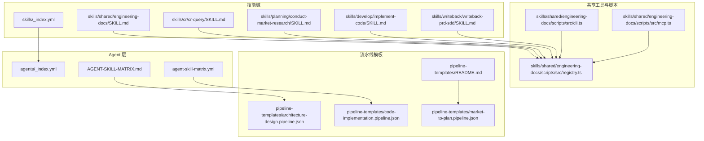
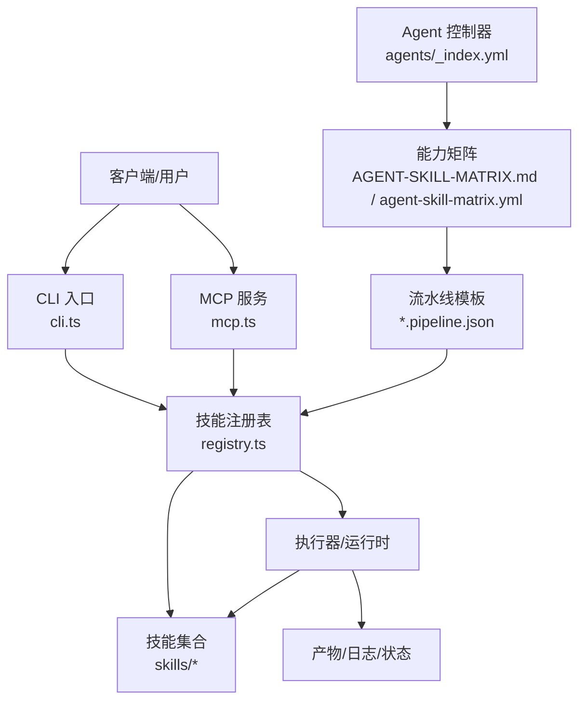
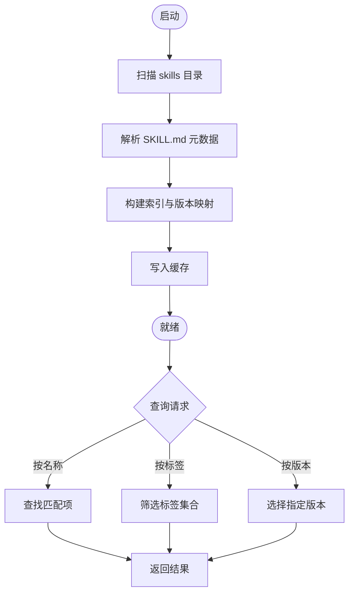
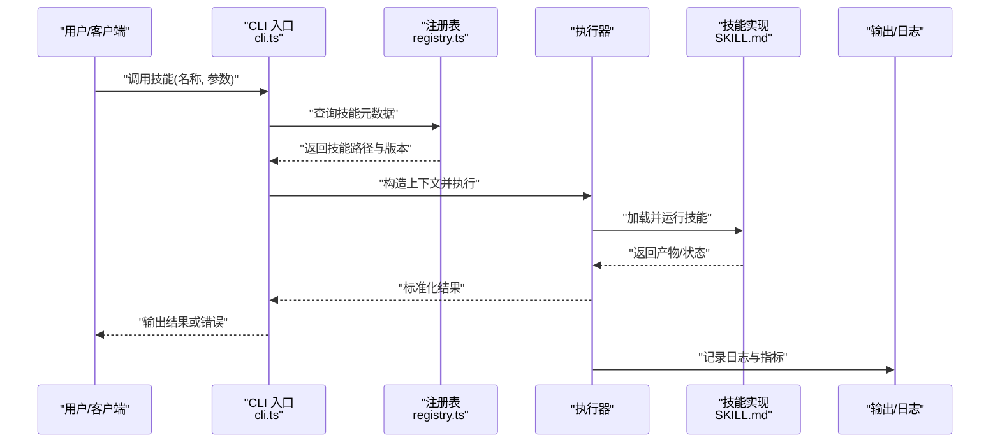
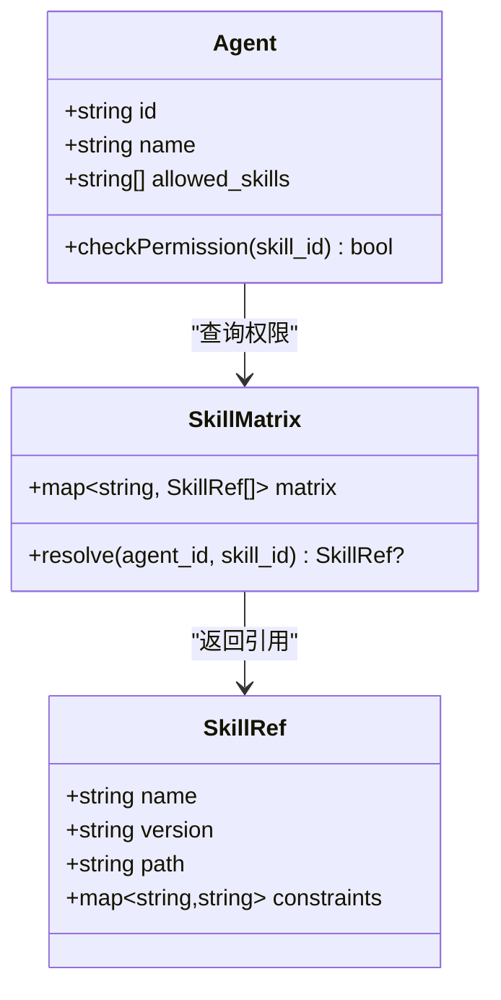
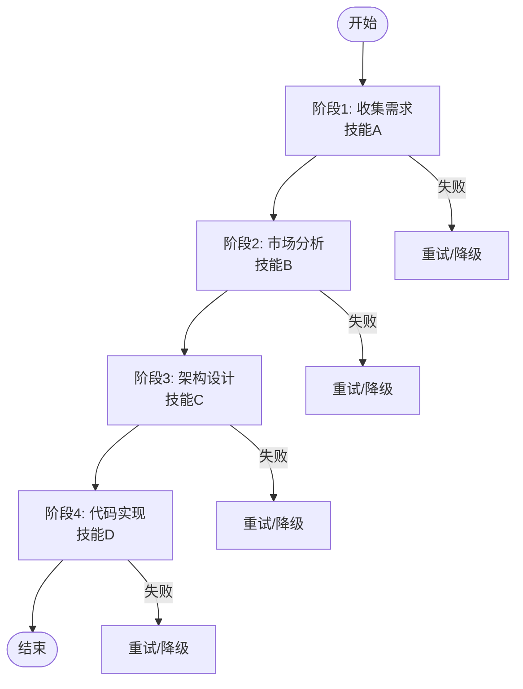
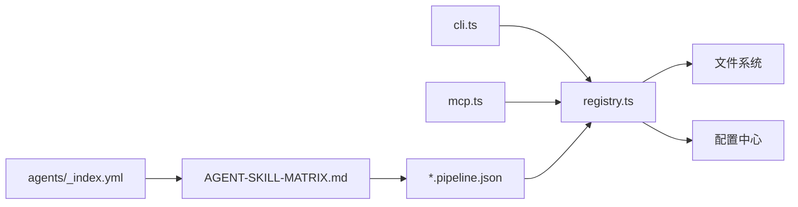

# 技能系统架构

<cite>
**本文引用的文件**   
- [skills/_index.yml](file://skills/_index.yml)
- [agents/_index.yml](file://agents/_index.yml)
- [AGENT-SKILL-MATRIX.md](file://AGENT-SKILL-MATRIX.md)
- [agent-skill-matrix.yml](file://agent-skill-matrix.yml)
- [dir-graph.yaml](file://dir-graph.yaml)
- [pipeline-templates/README.md](file://pipeline-templates/README.md)
- [pipeline-templates/architecture-design.pipeline.json](file://pipeline-templates/architecture-design.pipeline.json)
- [pipeline-templates/code-implementation.pipeline.json](file://pipeline-templates/code-implementation.pipeline.json)
- [pipeline-templates/market-to-plan.pipeline.json](file://pipeline-templates/market-to-plan.pipeline.json)
- [skills/shared/engineering-docs/scripts/src/registry.ts](file://skills/shared/engineering-docs/scripts/src/registry.ts)
- [skills/shared/engineering-docs/scripts/src/cli.ts](file://skills/shared/engineering-docs/scripts/src/cli.ts)
- [skills/shared/engineering-docs/scripts/src/mcp.ts](file://skills/shared/engineering-docs/scripts/src/mcp.ts)
- [skills/shared/engineering-docs/SKILL.md](file://skills/shared/engineering-docs/SKILL.md)
- [skills/cr/cr-query/SKILL.md](file://skills/cr/cr-query/SKILL.md)
- [skills/planning/conduct-market-research/SKILL.md](file://skills/planning/conduct-market-research/SKILL.md)
- [skills/develop/implement-code/SKILL.md](file://skills/develop/implement-code/SKILL.md)
- [skills/writeback/writeback-prd-sdd/SKILL.md](file://skills/writeback/writeback-prd-sdd/SKILL.md)
</cite>

## 目录
1. [简介](#简介)
2. [项目结构](#项目结构)
3. [核心组件](#核心组件)
4. [架构总览](#架构总览)
5. [详细组件分析](#详细组件分析)
6. [依赖分析](#依赖分析)
7. [性能考虑](#性能考虑)
8. [故障排查指南](#故障排查指南)
9. [结论](#结论)
10. [附录](#附录)

## 简介
本技术文档围绕“技能系统”的架构与实现展开，聚焦以下目标：
- 技能的设计模式与核心概念（定义规范、生命周期、执行引擎、依赖注入）
- 技能与 Agent 的交互模式、参数传递与错误处理策略
- 技能注册表、发现机制与版本管理
- 技能在整体系统中的位置与职责边界（架构图与数据流图）
- 性能优化与扩展点设计

该仓库以“声明式技能 + 可组合流水线 + 工具脚本”的方式组织能力。技能通过 SKILL.md 描述其输入输出、约束与行为；Agent 通过矩阵映射选择并编排技能；工程文档子模块提供基于 TypeScript 的注册表与 CLI/MCP 集成示例，体现技能的发现与执行方式。

## 项目结构
仓库采用按领域分层的目录组织，核心包括：
- skills：各领域的技能集合，每个技能以独立目录和 SKILL.md 描述
- agents：Agent 定义与索引，用于驱动技能编排
- pipeline-templates：可复用的流水线模板，将多个技能串联为端到端流程
- shared/engineering-docs/scripts：工程文档相关的脚本与工具，包含注册表、CLI、MCP 等实现片段

图表来源
- [skills/_index.yml](file://skills/_index.yml)
- [agents/_index.yml](file://agents/_index.yml)
- [AGENT-SKILL-MATRIX.md](file://AGENT-SKILL-MATRIX.md)
- [agent-skill-matrix.yml](file://agent-skill-matrix.yml)
- [pipeline-templates/README.md](file://pipeline-templates/README.md)
- [pipeline-templates/architecture-design.pipeline.json](file://pipeline-templates/architecture-design.pipeline.json)
- [pipeline-templates/code-implementation.pipeline.json](file://pipeline-templates/code-implementation.pipeline.json)
- [pipeline-templates/market-to-plan.pipeline.json](file://pipeline-templates/market-to-plan.pipeline.json)
- [skills/shared/engineering-docs/scripts/src/registry.ts](file://skills/shared/engineering-docs/scripts/src/registry.ts)
- [skills/shared/engineering-docs/scripts/src/cli.ts](file://skills/shared/engineering-docs/scripts/src/cli.ts)
- [skills/shared/engineering-docs/scripts/src/mcp.ts](file://skills/shared/engineering-docs/scripts/src/mcp.ts)

章节来源
- [skills/_index.yml](file://skills/_index.yml)
- [agents/_index.yml](file://agents/_index.yml)
- [AGENT-SKILL-MATRIX.md](file://AGENT-SKILL-MATRIX.md)
- [agent-skill-matrix.yml](file://agent-skill-matrix.yml)
- [dir-graph.yaml](file://dir-graph.yaml)
- [pipeline-templates/README.md](file://pipeline-templates/README.md)

## 核心组件
- 技能定义（SKILL.md）：描述技能的输入参数、输出产物、前置条件、副作用与约束，作为技能契约与元数据载体
- 技能注册表（registry.ts）：集中维护技能清单、版本、路径映射与依赖关系，支持按名称或标签检索
- 执行入口（cli.ts / mcp.ts）：命令行与 MCP 协议两种调用方式，负责解析参数、加载注册表、调度执行与结果回写
- Agent 与矩阵（_index.yml / AGENT-SKILL-MATRIX.md / agent-skill-matrix.yml）：定义 Agent 角色与其可调用的技能集，形成“谁可以做什么”的权限与能力映射
- 流水线模板（*.pipeline.json）：将多个技能串成工作流，定义阶段、输入输出绑定与错误处理策略

章节来源
- [skills/shared/engineering-docs/scripts/src/registry.ts](file://skills/shared/engineering-docs/scripts/src/registry.ts)
- [skills/shared/engineering-docs/scripts/src/cli.ts](file://skills/shared/engineering-docs/scripts/src/cli.ts)
- [skills/shared/engineering-docs/scripts/src/mcp.ts](file://skills/shared/engineering-docs/scripts/src/mcp.ts)
- [agents/_index.yml](file://agents/_index.yml)
- [AGENT-SKILL-MATRIX.md](file://AGENT-SKILL-MATRIX.md)
- [agent-skill-matrix.yml](file://agent-skill-matrix.yml)
- [pipeline-templates/README.md](file://pipeline-templates/README.md)

## 架构总览
技能系统由“定义—注册—发现—编排—执行—回写”构成闭环。Agent 根据矩阵选择技能，流水线模板将多技能组合为端到端流程，注册表提供统一的能力视图，CLI/MCP 提供外部接入点。

图表来源
- [skills/shared/engineering-docs/scripts/src/cli.ts](file://skills/shared/engineering-docs/scripts/src/cli.ts)
- [skills/shared/engineering-docs/scripts/src/mcp.ts](file://skills/shared/engineering-docs/scripts/src/mcp.ts)
- [skills/shared/engineering-docs/scripts/src/registry.ts](file://skills/shared/engineering-docs/scripts/src/registry.ts)
- [agents/_index.yml](file://agents/_index.yml)
- [AGENT-SKILL-MATRIX.md](file://AGENT-SKILL-MATRIX.md)
- [agent-skill-matrix.yml](file://agent-skill-matrix.yml)
- [pipeline-templates/README.md](file://pipeline-templates/README.md)

## 详细组件分析

### 技能定义规范（SKILL.md）
- 目的：以人类可读与机器可解析的方式描述技能契约，包括输入参数、输出产物、前置条件、副作用、错误码与版本信息
- 典型字段建议：
  - 元数据：名称、版本、作者、许可证、变更日志
  - 输入：参数名、类型、必填性、默认值、校验规则
  - 输出：产物路径或数据结构、质量要求
  - 约束：运行环境、资源限制、外部依赖
  - 错误：异常分类、重试策略、降级方案
  - 审计：追踪 ID、时间戳、责任人
- 示例参考：
  - [cr-query 技能](file://skills/cr/cr-query/SKILL.md)
  - [conduct-market-research 技能](file://skills/planning/conduct-market-research/SKILL.md)
  - [implement-code 技能](file://skills/develop/implement-code/SKILL.md)
  - [writeback-prd-sdd 技能](file://skills/writeback/writeback-prd-sdd/SKILL.md)
  - [engineering-docs 共享技能](file://skills/shared/engineering-docs/SKILL.md)

章节来源
- [skills/cr/cr-query/SKILL.md](file://skills/cr/cr-query/SKILL.md)
- [skills/planning/conduct-market-research/SKILL.md](file://skills/planning/conduct-market-research/SKILL.md)
- [skills/develop/implement-code/SKILL.md](file://skills/develop/implement-code/SKILL.md)
- [skills/writeback/writeback-prd-sdd/SKILL.md](file://skills/writeback/writeback-prd-sdd/SKILL.md)
- [skills/shared/engineering-docs/SKILL.md](file://skills/shared/engineering-docs/SKILL.md)

### 技能注册表与发现机制（registry.ts）
- 职责：
  - 扫描与加载所有 SKILL.md，构建统一的技能清单
  - 维护版本、路径、依赖、标签等元数据
  - 提供按名称、标签、版本过滤的查询接口
  - 暴露能力图谱，供 Agent 与流水线模板使用
- 关键流程：
  - 初始化时遍历 skills 目录，解析每个 SKILL.md
  - 合并冲突版本，保留最新稳定版或按策略选择
  - 缓存索引以提升查询性能
- 扩展点：
  - 插件化加载器：支持从远程仓库或包管理器拉取技能
  - 校验器：对 SKILL.md 进行 schema 校验，确保契约一致性

图表来源
- [skills/shared/engineering-docs/scripts/src/registry.ts](file://skills/shared/engineering-docs/scripts/src/registry.ts)

章节来源
- [skills/shared/engineering-docs/scripts/src/registry.ts](file://skills/shared/engineering-docs/scripts/src/registry.ts)

### 执行入口与依赖注入（cli.ts / mcp.ts）
- CLI 入口（cli.ts）：
  - 解析命令行参数，验证输入
  - 加载注册表，定位目标技能
  - 组装上下文（环境变量、凭据、工作区路径）
  - 调用执行器并输出结果或错误
- MCP 服务（mcp.ts）：
  - 暴露标准方法供外部系统调用
  - 将请求转换为内部执行上下文
  - 返回结构化响应与状态码
- 依赖注入：
  - 通过上下文对象注入文件系统、网络、配置、日志等依赖
  - 支持测试替换（Mock）与生产环境真实实现切换

图表来源
- [skills/shared/engineering-docs/scripts/src/cli.ts](file://skills/shared/engineering-docs/scripts/src/cli.ts)
- [skills/shared/engineering-docs/scripts/src/mcp.ts](file://skills/shared/engineering-docs/scripts/src/mcp.ts)
- [skills/shared/engineering-docs/scripts/src/registry.ts](file://skills/shared/engineering-docs/scripts/src/registry.ts)

章节来源
- [skills/shared/engineering-docs/scripts/src/cli.ts](file://skills/shared/engineering-docs/scripts/src/cli.ts)
- [skills/shared/engineering-docs/scripts/src/mcp.ts](file://skills/shared/engineering-docs/scripts/src/mcp.ts)

### Agent 与技能矩阵（_index.yml / AGENT-SKILL-MATRIX.md / agent-skill-matrix.yml）
- 作用：
  - 定义 Agent 角色及其可调用的技能集合
  - 明确权限边界与能力范围，防止越权调用
  - 为流水线模板提供“可用技能”的来源
- 设计要点：
  - 矩阵条目包含：Agent 标识、技能名称、版本约束、触发条件
  - 支持动态更新：当新增技能或调整权限时，同步更新矩阵
  - 与注册表联动：仅允许注册表中存在的技能被调用

图表来源
- [agents/_index.yml](file://agents/_index.yml)
- [AGENT-SKILL-MATRIX.md](file://AGENT-SKILL-MATRIX.md)
- [agent-skill-matrix.yml](file://agent-skill-matrix.yml)

章节来源
- [agents/_index.yml](file://agents/_index.yml)
- [AGENT-SKILL-MATRIX.md](file://AGENT-SKILL-MATRIX.md)
- [agent-skill-matrix.yml](file://agent-skill-matrix.yml)

### 流水线模板（*.pipeline.json）
- 作用：
  - 将多个技能组合为端到端流程，定义阶段、输入输出绑定、并行与串行策略
  - 提供错误处理与重试策略，保证流程健壮性
- 典型字段：
  - 阶段列表：每个阶段包含技能名称、参数映射、依赖阶段
  - 全局配置：超时、重试次数、失败策略（继续/中止）
  - 产物管理：中间产物存储路径、清理策略
- 示例参考：
  - [architecture-design 流水线](file://pipeline-templates/architecture-design.pipeline.json)
  - [code-implementation 流水线](file://pipeline-templates/code-implementation.pipeline.json)
  - [market-to-plan 流水线](file://pipeline-templates/market-to-plan.pipeline.json)

图表来源
- [pipeline-templates/README.md](file://pipeline-templates/README.md)
- [pipeline-templates/architecture-design.pipeline.json](file://pipeline-templates/architecture-design.pipeline.json)
- [pipeline-templates/code-implementation.pipeline.json](file://pipeline-templates/code-implementation.pipeline.json)
- [pipeline-templates/market-to-plan.pipeline.json](file://pipeline-templates/market-to-plan.pipeline.json)

章节来源
- [pipeline-templates/README.md](file://pipeline-templates/README.md)
- [pipeline-templates/architecture-design.pipeline.json](file://pipeline-templates/architecture-design.pipeline.json)
- [pipeline-templates/code-implementation.pipeline.json](file://pipeline-templates/code-implementation.pipeline.json)
- [pipeline-templates/market-to-plan.pipeline.json](file://pipeline-templates/market-to-plan.pipeline.json)

## 依赖分析
- 组件耦合：
  - cli.ts 与 mcp.ts 均依赖 registry.ts 获取技能元数据
  - registry.ts 依赖文件系统扫描与 SKILL.md 解析
  - Agent 与矩阵不直接依赖执行器，仅通过注册表与流水线模板间接协作
- 外部依赖：
  - 文件系统：读取 SKILL.md 与产物
  - 配置中心：环境变量与凭据注入
  - 日志与监控：记录执行轨迹与指标
- 潜在循环依赖：
  - 避免在 SKILL.md 中反向引用注册表逻辑，保持单向依赖

图表来源
- [skills/shared/engineering-docs/scripts/src/cli.ts](file://skills/shared/engineering-docs/scripts/src/cli.ts)
- [skills/shared/engineering-docs/scripts/src/mcp.ts](file://skills/shared/engineering-docs/scripts/src/mcp.ts)
- [skills/shared/engineering-docs/scripts/src/registry.ts](file://skills/shared/engineering-docs/scripts/src/registry.ts)
- [agents/_index.yml](file://agents/_index.yml)
- [AGENT-SKILL-MATRIX.md](file://AGENT-SKILL-MATRIX.md)
- [pipeline-templates/README.md](file://pipeline-templates/README.md)

章节来源
- [skills/shared/engineering-docs/scripts/src/registry.ts](file://skills/shared/engineering-docs/scripts/src/registry.ts)
- [skills/shared/engineering-docs/scripts/src/cli.ts](file://skills/shared/engineering-docs/scripts/src/cli.ts)
- [skills/shared/engineering-docs/scripts/src/mcp.ts](file://skills/shared/engineering-docs/scripts/src/mcp.ts)
- [agents/_index.yml](file://agents/_index.yml)
- [AGENT-SKILL-MATRIX.md](file://AGENT-SKILL-MATRIX.md)
- [pipeline-templates/README.md](file://pipeline-templates/README.md)

## 性能考虑
- 注册表缓存：
  - 首次扫描后持久化索引，减少重复 I/O
  - 增量更新：监听 SKILL.md 变更事件，局部刷新
- 并发执行：
  - 流水线阶段内无依赖的技能可并行执行
  - 控制并发度，避免资源争用
- 产物管理：
  - 中间产物压缩与清理策略
  - 大文件分块传输与断点续传
- 错误快速失败：
  - 短超时与重试上限，避免雪崩
  - 熔断与降级：关键技能不可用时回退到替代流程

[本节为通用指导，无需特定文件来源]

## 故障排查指南
- 常见问题：
  - 技能未找到：检查注册表索引是否包含该技能，确认名称与版本
  - 参数校验失败：核对 SKILL.md 中的输入约束与实际传入值
  - 权限不足：确认 Agent 是否在矩阵中被授权调用该技能
  - 流水线中断：查看阶段日志与错误码，定位失败节点
- 诊断步骤：
  - 启用详细日志，记录请求上下文与执行轨迹
  - 使用 CLI 的调试模式，逐步验证参数与依赖
  - 检查注册表缓存是否过期，必要时强制重建
- 恢复策略：
  - 重试与回滚：对幂等操作进行重试，非幂等操作需人工介入
  - 降级与补偿：调用替代技能或生成占位产物，保证流程继续

章节来源
- [skills/shared/engineering-docs/scripts/src/cli.ts](file://skills/shared/engineering-docs/scripts/src/cli.ts)
- [skills/shared/engineering-docs/scripts/src/registry.ts](file://skills/shared/engineering-docs/scripts/src/registry.ts)
- [AGENT-SKILL-MATRIX.md](file://AGENT-SKILL-MATRIX.md)

## 结论
本技能系统通过“声明式定义 + 集中注册 + 矩阵管控 + 流水线编排”的模式，实现了高内聚、低耦合的可扩展能力体系。SKILL.md 作为契约核心，registry.ts 提供统一视图，cli.ts/mcp.ts 作为接入点，Agent 与矩阵保障安全与可控，流水线模板提升复用性与稳定性。未来可在远程加载、动态版本协商、更细粒度权限控制等方面持续演进。

[本节为总结性内容，无需特定文件来源]

## 附录
- 术语表：
  - 技能：最小可执行单元，封装特定业务能力
  - Agent：任务发起者与编排者，受矩阵约束
  - 注册表：技能元数据的集中管理与查询服务
  - 流水线：多技能的有序组合与错误处理流程
- 最佳实践：
  - 保持 SKILL.md 简洁明确，避免歧义
  - 为每个技能编写单元测试与集成测试
  - 使用语义化版本管理，避免破坏性变更
  - 在流水线中显式声明依赖与产物，便于追踪

[本节为补充说明，无需特定文件来源]