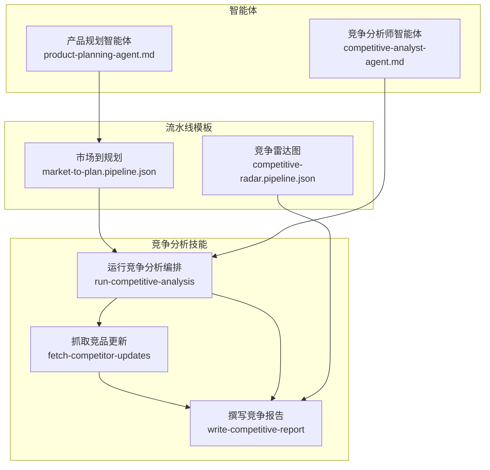
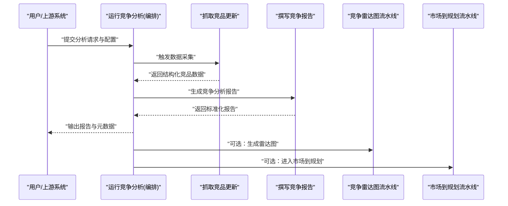
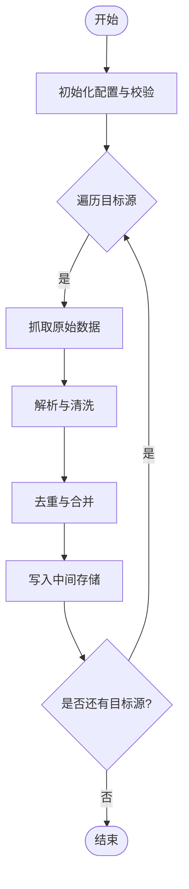
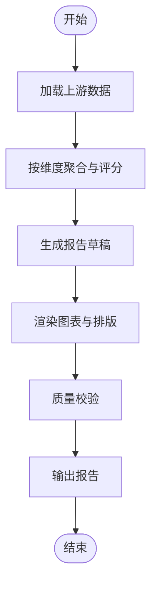
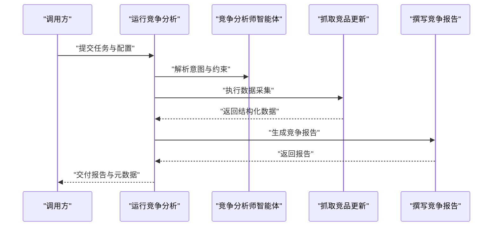
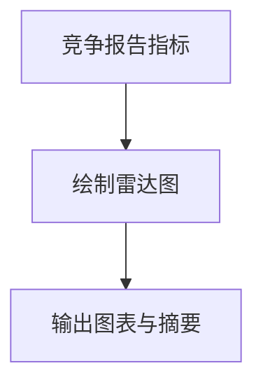
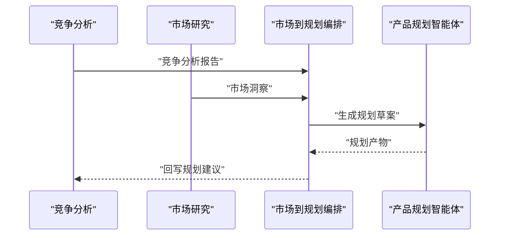
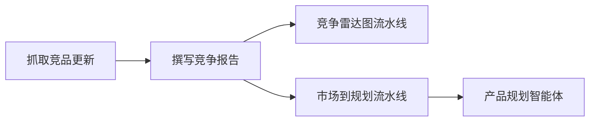

# 竞争分析技能

<cite>
**本文引用的文件**   
- [skills/competitive/fetch-competitor-updates/SKILL.md](file://skills/competitive/fetch-competitor-updates/SKILL.md)
- [skills/competitive/write-competitive-report/SKILL.md](file://skills/competitive/write-competitive-report/SKILL.md)
- [skills/planning/run-competitive-analysis/SKILL.md](file://skills/planning/run-competitive-analysis/SKILL.md)
- [pipeline-templates/competitive-radar.pipeline.json](file://pipeline-templates/competitive-radar.pipeline.json)
- [pipeline-templates/market-to-plan.pipeline.json](file://pipeline-templates/market-to-plan.pipeline.json)
- [agents/competitive-analyst-agent.md](file://agents/competitive-analyst-agent.md)
- [agents/product-planning-agent.md](file://agents/product-planning-agent.md)
</cite>

## 目录
1. [简介](#简介)
2. [项目结构](#项目结构)
3. [核心组件](#核心组件)
4. [架构总览](#架构总览)
5. [详细组件分析](#详细组件分析)
6. [依赖关系分析](#依赖关系分析)
7. [性能与可扩展性](#性能与可扩展性)
8. [故障排查指南](#故障排查指南)
9. [结论](#结论)
10. [附录：使用示例与最佳实践](#附录使用示例与最佳实践)

## 简介
本模块提供“竞争分析”相关技能，覆盖竞品动态抓取、竞争分析报告生成，以及将分析结果转化为规划建议的端到端流程。通过标准化输入输出与可编排流水线，该模块可与产品规划技能无缝协作，形成从市场洞察到产品规划的闭环。

## 项目结构
竞争分析能力分布在 skills 与 pipeline-templates 两个层面：
- skills/competitive：包含竞品更新抓取、报告撰写等原子技能说明
- skills/planning：包含“运行竞争分析”这一编排入口，用于串联多个子技能
- pipeline-templates：提供可视化或脚本化的流水线模板，如竞争雷达图、市场到规划等

图表来源
- [skills/competitive/fetch-competitor-updates/SKILL.md](file://skills/competitive/fetch-competitor-updates/SKILL.md)
- [skills/competitive/write-competitive-report/SKILL.md](file://skills/competitive/write-competitive-report/SKILL.md)
- [skills/planning/run-competitive-analysis/SKILL.md](file://skills/planning/run-competitive-analysis/SKILL.md)
- [pipeline-templates/competitive-radar.pipeline.json](file://pipeline-templates/competitive-radar.pipeline.json)
- [pipeline-templates/market-to-plan.pipeline.json](file://pipeline-templates/market-to-plan.pipeline.json)
- [agents/competitive-analyst-agent.md](file://agents/competitive-analyst-agent.md)
- [agents/product-planning-agent.md](file://agents/product-planning-agent.md)

章节来源
- [skills/competitive/fetch-competitor-updates/SKILL.md](file://skills/competitive/fetch-competitor-updates/SKILL.md)
- [skills/competitive/write-competitive-report/SKILL.md](file://skills/competitive/write-competitive-report/SKILL.md)
- [skills/planning/run-competitive-analysis/SKILL.md](file://skills/planning/run-competitive-analysis/SKILL.md)
- [pipeline-templates/competitive-radar.pipeline.json](file://pipeline-templates/competitive-radar.pipeline.json)
- [pipeline-templates/market-to-plan.pipeline.json](file://pipeline-templates/market-to-plan.pipeline.json)
- [agents/competitive-analyst-agent.md](file://agents/competitive-analyst-agent.md)
- [agents/product-planning-agent.md](file://agents/product-planning-agent.md)

## 核心组件
- 抓取竞品更新：负责采集目标竞品的公开信息、版本发布、功能变更、市场声量等数据，并结构化输出供后续处理。
- 撰写竞争报告：基于抓取到的数据，生成标准化的竞争分析报告，包括对比维度、趋势判断与关键发现。
- 运行竞争分析（编排）：作为统一入口，协调上游数据源与下游产出，串联抓取与报告生成，并可对接规划建议提取。
- 竞争雷达图流水线：将竞争分析结果可视化为雷达图，便于横向对比与决策沟通。
- 市场到规划流水线：将竞争分析与市场洞察整合，驱动产品规划工作流。

章节来源
- [skills/competitive/fetch-competitor-updates/SKILL.md](file://skills/competitive/fetch-competitor-updates/SKILL.md)
- [skills/competitive/write-competitive-report/SKILL.md](file://skills/competitive/write-competitive-report/SKILL.md)
- [skills/planning/run-competitive-analysis/SKILL.md](file://skills/planning/run-competitive-analysis/SKILL.md)
- [pipeline-templates/competitive-radar.pipeline.json](file://pipeline-templates/competitive-radar.pipeline.json)
- [pipeline-templates/market-to-plan.pipeline.json](file://pipeline-templates/market-to-plan.pipeline.json)

## 架构总览
竞争分析模块采用“原子技能 + 编排入口 + 流水线模板”的分层设计：
- 原子技能层：聚焦单一职责（抓取、报告），保证高内聚、低耦合
- 编排层：提供统一的执行入口，管理参数、依赖与顺序
- 流水线层：以 JSON 描述多步骤任务，支持复用与组合

图表来源
- [skills/planning/run-competitive-analysis/SKILL.md](file://skills/planning/run-competitive-analysis/SKILL.md)
- [skills/competitive/fetch-competitor-updates/SKILL.md](file://skills/competitive/fetch-competitor-updates/SKILL.md)
- [skills/competitive/write-competitive-report/SKILL.md](file://skills/competitive/write-competitive-report/SKILL.md)
- [pipeline-templates/competitive-radar.pipeline.json](file://pipeline-templates/competitive-radar.pipeline.json)
- [pipeline-templates/market-to-plan.pipeline.json](file://pipeline-templates/market-to-plan.pipeline.json)

## 详细组件分析

### 组件一：抓取竞品更新
- 功能特性
  - 支持多源采集（官网、公告、应用商店、社区、媒体等）
  - 增量抓取与去重，避免重复计算
  - 结构化字段映射，便于下游消费
- 配置参数（典型项）
  - 目标竞品列表与标识
  - 抓取范围与时间窗口
  - 数据清洗规则与过滤条件
  - 重试策略与超时控制
- 执行流程
  - 初始化与校验配置
  - 遍历目标源进行抓取
  - 解析与标准化数据
  - 写入中间存储并返回结果
- 错误处理
  - 网络异常重试与降级
  - 解析失败记录与跳过
  - 告警与审计日志

图表来源
- [skills/competitive/fetch-competitor-updates/SKILL.md](file://skills/competitive/fetch-competitor-updates/SKILL.md)

章节来源
- [skills/competitive/fetch-competitor-updates/SKILL.md](file://skills/competitive/fetch-competitor-updates/SKILL.md)

### 组件二：撰写竞争报告
- 功能特性
  - 多维度对比（功能、体验、定价、生态、渠道等）
  - 趋势研判与机会点识别
  - 标准报告结构与可插拔模板
- 配置参数（典型项）
  - 报告维度与权重
  - 数据来源与优先级
  - 输出格式与语言
  - 敏感信息与脱敏策略
- 执行流程
  - 加载上游结构化数据
  - 按维度聚合与评分
  - 生成文本与图表素材
  - 组装为最终报告
- 错误处理
  - 缺失数据回退策略
  - 模板渲染失败重试
  - 质量校验与人工复核提示

图表来源
- [skills/competitive/write-competitive-report/SKILL.md](file://skills/competitive/write-competitive-report/SKILL.md)

章节来源
- [skills/competitive/write-competitive-report/SKILL.md](file://skills/competitive/write-competitive-report/SKILL.md)

### 组件三：运行竞争分析（编排）
- 角色定位
  - 统一入口，负责参数装配、依赖检查、顺序调度
  - 与“竞争分析师智能体”协同，提升语义理解与推理质量
- 执行流程
  - 接收请求与校验
  - 调用抓取技能获取数据
  - 调用报告技能生成报告
  - 可选触发可视化与规划联动
- 集成点
  - 与“竞争雷达图流水线”对接，快速产出可视化
  - 与“市场到规划流水线”对接，推动规划落地

图表来源
- [skills/planning/run-competitive-analysis/SKILL.md](file://skills/planning/run-competitive-analysis/SKILL.md)
- [agents/competitive-analyst-agent.md](file://agents/competitive-analyst-agent.md)

章节来源
- [skills/planning/run-competitive-analysis/SKILL.md](file://skills/planning/run-competitive-analysis/SKILL.md)
- [agents/competitive-analyst-agent.md](file://agents/competitive-analyst-agent.md)

### 组件四：竞争雷达图流水线
- 作用
  - 将竞争分析结果转换为雷达图，直观展示多维对比
- 输入
  - 来自“撰写竞争报告”的结构化指标与得分
- 输出
  - 雷达图资源与摘要说明
- 适用场景
  - 汇报演示、方案评审、跨团队对齐

图表来源
- [pipeline-templates/competitive-radar.pipeline.json](file://pipeline-templates/competitive-radar.pipeline.json)

章节来源
- [pipeline-templates/competitive-radar.pipeline.json](file://pipeline-templates/competitive-radar.pipeline.json)

### 组件五：市场到规划流水线
- 作用
  - 将竞争分析与市场洞察融合，驱动产品规划
- 输入
  - 竞争分析报告、市场研究结果、用户反馈等
- 输出
  - 规划草案、路线图条目、待办事项
- 协作关系
  - 与“产品规划智能体”配合，完成规划文档生成与评审

图表来源
- [pipeline-templates/market-to-plan.pipeline.json](file://pipeline-templates/market-to-plan.pipeline.json)
- [agents/product-planning-agent.md](file://agents/product-planning-agent.md)

章节来源
- [pipeline-templates/market-to-plan.pipeline.json](file://pipeline-templates/market-to-plan.pipeline.json)
- [agents/product-planning-agent.md](file://agents/product-planning-agent.md)

## 依赖关系分析
- 内部依赖
  - “运行竞争分析”依赖“抓取竞品更新”和“撰写竞争报告”
  - “竞争雷达图流水线”依赖“撰写竞争报告”的输出
  - “市场到规划流水线”依赖“竞争分析报告”与“市场研究”
- 外部依赖
  - 数据源接口（网站、API、第三方平台）
  - 可视化引擎（雷达图渲染）
  - 规划智能体（自然语言理解与生成）

图表来源
- [skills/competitive/fetch-competitor-updates/SKILL.md](file://skills/competitive/fetch-competitor-updates/SKILL.md)
- [skills/competitive/write-competitive-report/SKILL.md](file://skills/competitive/write-competitive-report/SKILL.md)
- [pipeline-templates/competitive-radar.pipeline.json](file://pipeline-templates/competitive-radar.pipeline.json)
- [pipeline-templates/market-to-plan.pipeline.json](file://pipeline-templates/market-to-plan.pipeline.json)
- [agents/product-planning-agent.md](file://agents/product-planning-agent.md)

章节来源
- [skills/competitive/fetch-competitor-updates/SKILL.md](file://skills/competitive/fetch-competitor-updates/SKILL.md)
- [skills/competitive/write-competitive-report/SKILL.md](file://skills/competitive/write-competitive-report/SKILL.md)
- [pipeline-templates/competitive-radar.pipeline.json](file://pipeline-templates/competitive-radar.pipeline.json)
- [pipeline-templates/market-to-plan.pipeline.json](file://pipeline-templates/market-to-plan.pipeline.json)
- [agents/product-planning-agent.md](file://agents/product-planning-agent.md)

## 性能与可扩展性
- 并发与批处理
  - 对多源抓取进行并发控制，避免过载
  - 批量聚合与缓存减少重复计算
- 容错与稳定性
  - 重试与熔断策略，保障长链路稳定
  - 断点续跑与幂等写入
- 扩展点
  - 新增数据源适配器
  - 新增报告维度与模板
  - 接入更多可视化与规划工具

[本节为通用指导，不直接分析具体文件]

## 故障排查指南
- 常见问题
  - 数据源不可达或限流：检查网络、代理、配额与重试策略
  - 解析失败或字段缺失：核对清洗规则与映射表，启用降级与告警
  - 报告渲染异常：验证模板与依赖库版本，开启详细日志
  - 流水线卡住：检查上游产出完整性与依赖顺序
- 诊断要点
  - 查看中间存储与审计日志
  - 确认输入参数与权限配置
  - 逐步隔离问题（抓取 vs 报告 vs 可视化 vs 规划）

章节来源
- [skills/competitive/fetch-competitor-updates/SKILL.md](file://skills/competitive/fetch-competitor-updates/SKILL.md)
- [skills/competitive/write-competitive-report/SKILL.md](file://skills/competitive/write-competitive-report/SKILL.md)
- [skills/planning/run-competitive-analysis/SKILL.md](file://skills/planning/run-competitive-analysis/SKILL.md)

## 结论
竞争分析模块通过清晰的职责划分与可编排的流水线，实现了从数据采集到报告生成再到规划联动的完整闭环。借助标准化输入输出与智能体协作，可在不同业务场景中快速复用与扩展。

[本节为总结性内容，不直接分析具体文件]

## 附录：使用示例与最佳实践

### 使用示例
- 输入数据格式（建议）
  - 目标竞品清单与标识
  - 时间窗口与抓取范围
  - 报告维度与权重
  - 输出格式与语言偏好
- 输出结果结构（建议）
  - 结构化指标与得分
  - 竞争分析报告（文本与图表）
  - 规划建议条目（面向产品规划）
- 常见应用场景
  - 季度竞品复盘与策略调整
  - 新功能立项前的差异化评估
  - 市场进入与区域拓展可行性分析

[本节为概念性示例，不直接分析具体文件]

### 与其他技能的协作关系
- 与产品规划技能集成
  - 通过“市场到规划流水线”将竞争分析结果注入规划工作流
  - 由“产品规划智能体”生成规划草案与路线图条目
- 与可视化技能集成
  - 通过“竞争雷达图流水线”快速产出可视化材料，辅助决策沟通

章节来源
- [pipeline-templates/market-to-plan.pipeline.json](file://pipeline-templates/market-to-plan.pipeline.json)
- [agents/product-planning-agent.md](file://agents/product-planning-agent.md)
- [pipeline-templates/competitive-radar.pipeline.json](file://pipeline-templates/competitive-radar.pipeline.json)

### 最佳实践建议
- 明确边界与契约
  - 定义清晰的数据模型与字段字典
  - 约定版本号与兼容性策略
- 渐进式增强
  - 先跑通最小可用流程，再逐步增加维度与模板
- 安全与合规
  - 遵循数据隐私与版权要求，做好脱敏与授权
- 持续改进
  - 建立度量与反馈机制，定期优化抓取与报告质量

[本节为通用指导，不直接分析具体文件]