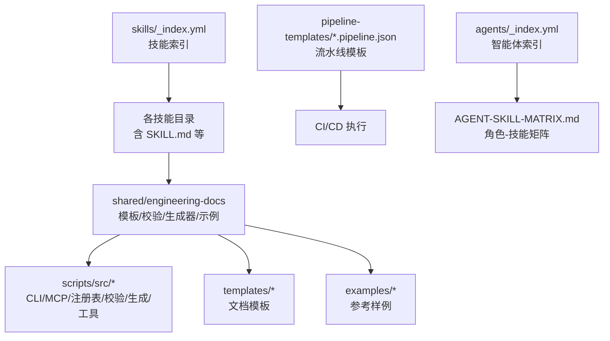
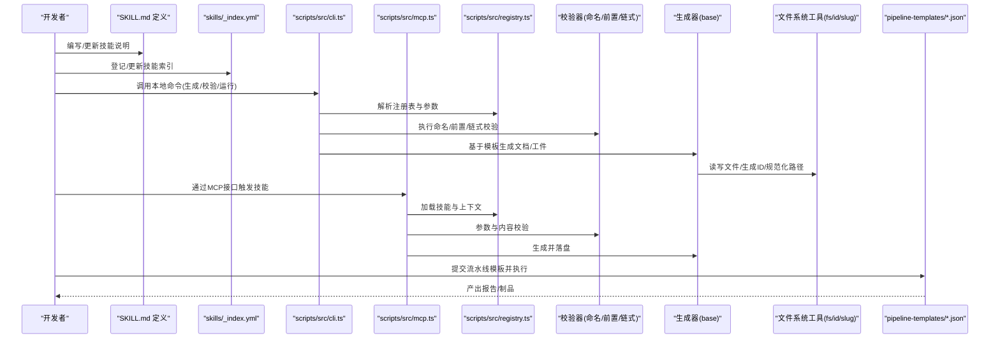
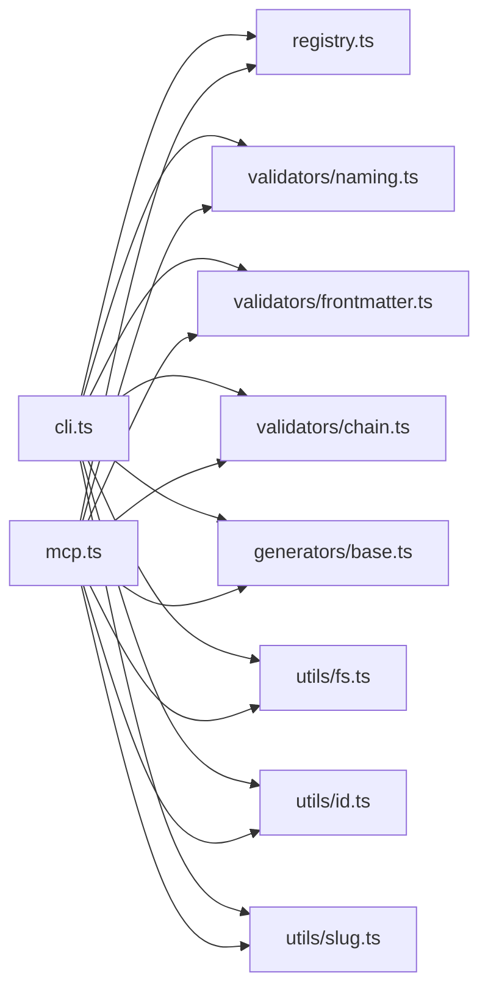

# 自定义技能开发

<cite>
**本文引用的文件**   
- [skills/_index.yml](file://skills/_index.yml)
- [skills/reviewer-panel.yaml](file://skills/reviewer-panel.yaml)
- [skills/shared/engineering-docs/SKILL.md](file://skills/shared/engineering-docs/SKILL.md)
- [skills/shared/engineering-docs/scripts/src/cli.ts](file://skills/shared/engineering-docs/scripts/src/cli.ts)
- [skills/shared/engineering-docs/scripts/src/mcp.ts](file://skills/shared/engineering-docs/scripts/src/mcp.ts)
- [skills/shared/engineering-docs/scripts/src/registry.ts](file://skills/shared/engineering-docs/scripts/src/registry.ts)
- [skills/shared/engineering-docs/scripts/package.json](file://skills/shared/engineering-docs/scripts/package.json)
- [skills/shared/engineering-docs/scripts/tsconfig.json](file://skills/shared/engineering-docs/scripts/tsconfig.json)
- [skills/shared/engineering-docs/scripts/vitest.config.ts](file://skills/shared/engineering-docs/scripts/vitest.config.ts)
- [skills/shared/engineering-docs/scripts/src/__tests__/chain.test.ts](file://skills/shared/engineering-docs/scripts/src/__tests__/chain.test.ts)
- [skills/shared/engineering-docs/scripts/src/__tests__/generators.test.ts](file://skills/shared/engineering-docs/scripts/src/__tests__/generators.test.ts)
- [skills/shared/engineering-docs/scripts/src/__tests__/validators.test.ts](file://skills/shared/engineering-docs/scripts/src/__tests__/validators.test.ts)
- [skills/shared/engineering-docs/scripts/src/generators/base.ts](file://skills/shared/engineering-docs/scripts/src/generators/base.ts)
- [skills/shared/engineering-docs/scripts/src/utils/fs.ts](file://skills/shared/engineering-docs/scripts/src/utils/fs.ts)
- [skills/shared/engineering-docs/scripts/src/utils/id.ts](file://skills/shared/engineering-docs/scripts/src/utils/id.ts)
- [skills/shared/engineering-docs/scripts/src/utils/slug.ts](file://skills/shared/engineering-docs/scripts/src/utils/slug.ts)
- [skills/shared/engineering-docs/scripts/src/validators/index-sync.ts](file://skills/shared/engineering-docs/scripts/src/validators/index-sync.ts)
- [skills/shared/engineering-docs/scripts/src/validators/frontmatter.ts](file://skills/shared/engineering-docs/scripts/src/validators/frontmatter.ts)
- [skills/shared/engineering-docs/scripts/src/validators/naming.ts](file://skills/shared/engineering-docs/scripts/src/validators/naming.ts)
- [skills/shared/engineering-docs/scripts/src/validators/chain.ts](file://skills/shared/engineering-docs/scripts/src/validators/chain.ts)
- [skills/shared/engineering-docs/templates/PRD-template.md](file://skills/shared/engineering-docs/templates/PRD-template.md)
- [skills/shared/engineering-docs/templates/TASK-template.md](file://skills/shared/engineering-docs/templates/TASK-template.md)
- [skills/shared/engineering-docs/examples/README.md](file://skills/shared/engineering-docs/examples/README.md)
- [pipeline-templates/README.md](file://pipeline-templates/README.md)
- [pipeline-templates/architecture-design.pipeline.json](file://pipeline-templates/architecture-design.pipeline.json)
- [pipeline-templates/code-implementation.pipeline.json](file://pipeline-templates/code-implementation.pipeline.json)
- [pipeline-templates/product-planning.pipeline.json](file://pipeline-templates/product-planning.pipeline.json)
- [agents/_index.yml](file://agents/_index.yml)
- [AGENT-SKILL-MATRIX.md](file://AGENT-SKILL-MATRIX.md)
</cite>

## 目录
1. [简介](#简介)
2. [项目结构](#项目结构)
3. [核心组件](#核心组件)
4. [架构总览](#架构总览)
5. [详细组件分析](#详细组件分析)
6. [依赖关系分析](#依赖关系分析)
7. [性能考虑](#性能考虑)
8. [故障排查指南](#故障排查指南)
9. [结论](#结论)
10. [附录](#附录)

## 简介
本指南面向希望在本仓库中创建“自定义技能”的开发者，覆盖从技能设计、实现规范、测试策略到打包发布的全流程。仓库采用“以文档为中心 + 脚本工具链”的技能组织方式：每个技能通常包含一个 SKILL.md 描述其能力与参数约定，并通过共享的工程文档模板、校验器与生成器来保证产出质量；同时提供 MCP 集成入口与 CLI 工具，便于在本地或流水线环境中运行与调试。

## 项目结构
仓库围绕 skills 目录组织技能定义与示例，shared 子目录提供跨技能的通用模板、校验规则与脚本工具；pipeline-templates 提供可复用的流水线编排；agents 目录用于将技能映射到智能体角色矩阵。

图表来源
- [skills/_index.yml](file://skills/_index.yml)
- [skills/shared/engineering-docs/SKILL.md](file://skills/shared/engineering-docs/SKILL.md)
- [skills/shared/engineering-docs/scripts/src/cli.ts](file://skills/shared/engineering-docs/scripts/src/cli.ts)
- [skills/shared/engineering-docs/scripts/src/mcp.ts](file://skills/shared/engineering-docs/scripts/src/mcp.ts)
- [skills/shared/engineering-docs/scripts/src/registry.ts](file://skills/shared/engineering-docs/scripts/src/registry.ts)
- [pipeline-templates/README.md](file://pipeline-templates/README.md)
- [agents/_index.yml](file://agents/_index.yml)
- [AGENT-SKILL-MATRIX.md](file://AGENT-SKILL-MATRIX.md)

章节来源
- [skills/_index.yml](file://skills/_index.yml)
- [skills/shared/engineering-docs/SKILL.md](file://skills/shared/engineering-docs/SKILL.md)
- [pipeline-templates/README.md](file://pipeline-templates/README.md)
- [agents/_index.yml](file://agents/_index.yml)
- [AGENT-SKILL-MATRIX.md](file://AGENT-SKILL-MATRIX.md)

## 核心组件
- 技能定义与索引
  - 每个技能目录通常包含 SKILL.md，描述技能用途、输入参数、输出产物、约束与注意事项。
  - skills/_index.yml 作为全局索引，集中管理可用技能清单与元信息。
- 工程文档标准与模板
  - shared/engineering-docs 提供统一的文档模板（如 PRD、TASK 等）、命名规范、Schema 与示例，确保不同团队产出的文档一致且可验证。
- 脚本工具链
  - scripts 提供 CLI 命令、MCP 服务入口、注册表与校验/生成工具，支持本地开发与自动化流水线。
- 流水线模板
  - pipeline-templates 提供可复用的流水线 JSON 模板，用于编排多步骤任务（如架构设计、代码实现、产品规划等）。
- 智能体与技能矩阵
  - agents/_index.yml 与 AGENT-SKILL-MATRIX.md 将技能与智能体角色关联，指导在不同场景下选择合适技能组合。

章节来源
- [skills/_index.yml](file://skills/_index.yml)
- [skills/shared/engineering-docs/SKILL.md](file://skills/shared/engineering-docs/SKILL.md)
- [skills/shared/engineering-docs/scripts/src/cli.ts](file://skills/shared/engineering-docs/scripts/src/cli.ts)
- [skills/shared/engineering-docs/scripts/src/mcp.ts](file://skills/shared/engineering-docs/scripts/src/mcp.ts)
- [skills/shared/engineering-docs/scripts/src/registry.ts](file://skills/shared/engineering-docs/scripts/src/registry.ts)
- [pipeline-templates/README.md](file://pipeline-templates/README.md)
- [agents/_index.yml](file://agents/_index.yml)
- [AGENT-SKILL-MATRIX.md](file://AGENT-SKILL-MATRIX.md)

## 架构总览
下图展示了“技能定义 → 工具链 → 产物验证 → 流水线编排”的整体流程。

图表来源
- [skills/_index.yml](file://skills/_index.yml)
- [skills/shared/engineering-docs/SKILL.md](file://skills/shared/engineering-docs/SKILL.md)
- [skills/shared/engineering-docs/scripts/src/cli.ts](file://skills/shared/engineering-docs/scripts/src/cli.ts)
- [skills/shared/engineering-docs/scripts/src/mcp.ts](file://skills/shared/engineering-docs/scripts/src/mcp.ts)
- [skills/shared/engineering-docs/scripts/src/registry.ts](file://skills/shared/engineering-docs/scripts/src/registry.ts)
- [skills/shared/engineering-docs/scripts/src/validators/naming.ts](file://skills/shared/engineering-docs/scripts/src/validators/naming.ts)
- [skills/shared/engineering-docs/scripts/src/validators/frontmatter.ts](file://skills/shared/engineering-docs/scripts/src/validators/frontmatter.ts)
- [skills/shared/engineering-docs/scripts/src/validators/chain.ts](file://skills/shared/engineering-docs/scripts/src/validators/chain.ts)
- [skills/shared/engineering-docs/scripts/src/generators/base.ts](file://skills/shared/engineering-docs/scripts/src/generators/base.ts)
- [skills/shared/engineering-docs/scripts/src/utils/fs.ts](file://skills/shared/engineering-docs/scripts/src/utils/fs.ts)
- [skills/shared/engineering-docs/scripts/src/utils/id.ts](file://skills/shared/engineering-docs/scripts/src/utils/id.ts)
- [skills/shared/engineering-docs/scripts/src/utils/slug.ts](file://skills/shared/engineering-docs/scripts/src/utils/slug.ts)
- [pipeline-templates/README.md](file://pipeline-templates/README.md)

## 详细组件分析

### 技能定义与索引
- 目标
  - 明确技能职责、输入参数、输出产物、约束条件与使用示例。
- 关键文件
  - 技能说明：各技能目录下的 SKILL.md
  - 全局索引：skills/_index.yml
- 建议
  - 为每个技能维护最小必要字段：名称、版本、作者、描述、参数、产物、依赖、注意事项。
  - 在索引中保持唯一键与稳定路径，避免重名冲突。

章节来源
- [skills/_index.yml](file://skills/_index.yml)
- [skills/shared/engineering-docs/SKILL.md](file://skills/shared/engineering-docs/SKILL.md)

### 工程文档标准与模板
- 目标
  - 统一文档结构与命名，提升可读性与可验证性。
- 关键文件
  - 模板：templates/*.md（如 PRD、TASK 等）
  - 示例：examples/*（含 README 与样例）
  - 规范：conventions/*（命名、链式文档等）
- 建议
  - 新技能应优先复用现有模板，减少重复劳动。
  - 遵循命名与层级规范，确保后续校验与检索顺畅。

章节来源
- [skills/shared/engineering-docs/templates/PRD-template.md](file://skills/shared/engineering-docs/templates/PRD-template.md)
- [skills/shared/engineering-docs/templates/TASK-template.md](file://skills/shared/engineering-docs/templates/TASK-template.md)
- [skills/shared/engineering-docs/examples/README.md](file://skills/shared/engineering-docs/examples/README.md)

### 脚本工具链（CLI/MCP/注册表）
- 目标
  - 提供本地开发体验与远程集成能力，支撑生成、校验、运行与分发。
- 关键文件
  - CLI 入口：scripts/src/cli.ts
  - MCP 服务：scripts/src/mcp.ts
  - 注册表：scripts/src/registry.ts
  - 配置与构建：package.json、tsconfig.json、vitest.config.ts
- 建议
  - 所有对外暴露的能力应在注册表中声明，便于发现与权限控制。
  - CLI 与 MCP 应保持一致的参数契约与错误码。

章节来源
- [skills/shared/engineering-docs/scripts/src/cli.ts](file://skills/shared/engineering-docs/scripts/src/cli.ts)
- [skills/shared/engineering-docs/scripts/src/mcp.ts](file://skills/shared/engineering-docs/scripts/src/mcp.ts)
- [skills/shared/engineering-docs/scripts/src/registry.ts](file://skills/shared/engineering-docs/scripts/src/registry.ts)
- [skills/shared/engineering-docs/scripts/package.json](file://skills/shared/engineering-docs/scripts/package.json)
- [skills/shared/engineering-docs/scripts/tsconfig.json](file://skills/shared/engineering-docs/scripts/tsconfig.json)
- [skills/shared/engineering-docs/scripts/vitest.config.ts](file://skills/shared/engineering-docs/scripts/vitest.config.ts)

### 校验器（命名/前置/链式）
- 目标
  - 对文件名、Frontmatter、文档链一致性等进行静态检查，保障质量基线。
- 关键文件
  - 命名校验：src/validators/naming.ts
  - 前置校验：src/validators/frontmatter.ts
  - 链式校验：src/validators/chain.ts
  - 索引同步校验：src/validators/index-sync.ts
- 建议
  - 新增校验规则时，补充对应单元测试，确保回归稳定。
  - 将常见错误归类并给出修复建议，降低排障成本。

章节来源
- [skills/shared/engineering-docs/scripts/src/validators/naming.ts](file://skills/shared/engineering-docs/scripts/src/validators/naming.ts)
- [skills/shared/engineering-docs/scripts/src/validators/frontmatter.ts](file://skills/shared/engineering-docs/scripts/src/validators/frontmatter.ts)
- [skills/shared/engineering-docs/scripts/src/validators/chain.ts](file://skills/shared/engineering-docs/scripts/src/validators/chain.ts)
- [skills/shared/engineering-docs/scripts/src/validators/index-sync.ts](file://skills/shared/engineering-docs/scripts/src/validators/index-sync.ts)

### 生成器与工具函数
- 目标
  - 基于模板与上下文快速生成文档与工件，并提供 ID、Slug、文件系统等基础能力。
- 关键文件
  - 生成器基类：src/generators/base.ts
  - 文件系统工具：src/utils/fs.ts
  - ID 生成：src/utils/id.ts
  - Slug 生成：src/utils/slug.ts
- 建议
  - 生成器应幂等，支持增量更新与回滚。
  - 工具函数需具备完善的边界处理与日志记录。

章节来源
- [skills/shared/engineering-docs/scripts/src/generators/base.ts](file://skills/shared/engineering-docs/scripts/src/generators/base.ts)
- [skills/shared/engineering-docs/scripts/src/utils/fs.ts](file://skills/shared/engineering-docs/scripts/src/utils/fs.ts)
- [skills/shared/engineering-docs/scripts/src/utils/id.ts](file://skills/shared/engineering-docs/scripts/src/utils/id.ts)
- [skills/shared/engineering-docs/scripts/src/utils/slug.ts](file://skills/shared/engineering-docs/scripts/src/utils/slug.ts)

### 测试策略与用例
- 目标
  - 覆盖核心逻辑、边界条件与集成场景，保障稳定性与兼容性。
- 关键文件
  - 测试配置：vitest.config.ts
  - 用例：
    - src/__tests__/chain.test.ts
    - src/__tests__/generators.test.ts
    - src/__tests__/validators.test.ts
- 建议
  - 按模块划分测试套件，结合快照与数据驱动测试。
  - 引入性能基准用例，监控关键路径耗时。

章节来源
- [skills/shared/engineering-docs/scripts/vitest.config.ts](file://skills/shared/engineering-docs/scripts/vitest.config.ts)
- [skills/shared/engineering-docs/scripts/src/__tests__/chain.test.ts](file://skills/shared/engineering-docs/scripts/src/__tests__/chain.test.ts)
- [skills/shared/engineering-docs/scripts/src/__tests__/generators.test.ts](file://skills/shared/engineering-docs/scripts/src/__tests__/generators.test.ts)
- [skills/shared/engineering-docs/scripts/src/__tests__/validators.test.ts](file://skills/shared/engineering-docs/scripts/src/__tests__/validators.test.ts)

### 流水线模板与编排
- 目标
  - 将技能串联为端到端工作流，支持多阶段构建、校验与发布。
- 关键文件
  - 模板说明：pipeline-templates/README.md
  - 模板实例：architecture-design.pipeline.json、code-implementation.pipeline.json、product-planning.pipeline.json
- 建议
  - 为每个流水线定义明确的输入/输出与失败重试策略。
  - 使用环境变量注入敏感信息与运行时参数。

章节来源
- [pipeline-templates/README.md](file://pipeline-templates/README.md)
- [pipeline-templates/architecture-design.pipeline.json](file://pipeline-templates/architecture-design.pipeline.json)
- [pipeline-templates/code-implementation.pipeline.json](file://pipeline-templates/code-implementation.pipeline.json)
- [pipeline-templates/product-planning.pipeline.json](file://pipeline-templates/product-planning.pipeline.json)

### 智能体与技能矩阵
- 目标
  - 将技能与智能体角色对齐，形成可组合的工作集。
- 关键文件
  - 智能体索引：agents/_index.yml
  - 矩阵文档：AGENT-SKILL-MATRIX.md
- 建议
  - 为新技能补充矩阵条目，明确适用场景与前置依赖。

章节来源
- [agents/_index.yml](file://agents/_index.yml)
- [AGENT-SKILL-MATRIX.md](file://AGENT-SKILL-MATRIX.md)

## 依赖关系分析
以下图展示脚本模块间的依赖关系，有助于理解扩展点与耦合面。

图表来源
- [skills/shared/engineering-docs/scripts/src/cli.ts](file://skills/shared/engineering-docs/scripts/src/cli.ts)
- [skills/shared/engineering-docs/scripts/src/mcp.ts](file://skills/shared/engineering-docs/scripts/src/mcp.ts)
- [skills/shared/engineering-docs/scripts/src/registry.ts](file://skills/shared/engineering-docs/scripts/src/registry.ts)
- [skills/shared/engineering-docs/scripts/src/validators/naming.ts](file://skills/shared/engineering-docs/scripts/src/validators/naming.ts)
- [skills/shared/engineering-docs/scripts/src/validators/frontmatter.ts](file://skills/shared/engineering-docs/scripts/src/validators/frontmatter.ts)
- [skills/shared/engineering-docs/scripts/src/validators/chain.ts](file://skills/shared/engineering-docs/scripts/src/validators/chain.ts)
- [skills/shared/engineering-docs/scripts/src/generators/base.ts](file://skills/shared/engineering-docs/scripts/src/generators/base.ts)
- [skills/shared/engineering-docs/scripts/src/utils/fs.ts](file://skills/shared/engineering-docs/scripts/src/utils/fs.ts)
- [skills/shared/engineering-docs/scripts/src/utils/id.ts](file://skills/shared/engineering-docs/scripts/src/utils/id.ts)
- [skills/shared/engineering-docs/scripts/src/utils/slug.ts](file://skills/shared/engineering-docs/scripts/src/utils/slug.ts)

章节来源
- [skills/shared/engineering-docs/scripts/src/cli.ts](file://skills/shared/engineering-docs/scripts/src/cli.ts)
- [skills/shared/engineering-docs/scripts/src/mcp.ts](file://skills/shared/engineering-docs/scripts/src/mcp.ts)
- [skills/shared/engineering-docs/scripts/src/registry.ts](file://skills/shared/engineering-docs/scripts/src/registry.ts)

## 性能考虑
- 批量操作
  - 对大量文件的生成与校验应分批处理，避免一次性占用过多内存。
- 缓存与增量
  - 对模板渲染结果与校验结果进行缓存，支持增量更新。
- I/O 优化
  - 合并写入、使用流式处理，减少磁盘抖动。
- 并发控制
  - 合理设置并发度，避免阻塞系统资源。
- 监控与度量
  - 记录关键路径耗时与错误率，建立性能基线与告警。

[本节为通用指导，不直接分析具体文件]

## 故障排查指南
- 常见问题定位
  - 参数缺失或类型不符：检查注册表与 CLI/MCP 参数契约，确认必填项与默认值。
  - 命名不规范：查看命名校验器错误提示，修正文件或目录命名。
  - Frontmatter 不完整：根据前置校验器返回的错误信息补齐字段。
  - 文档链不一致：使用链式校验器定位断裂节点，补全引用关系。
- 日志与调试
  - 在 CLI 与 MCP 入口增加结构化日志，记录请求参数、中间状态与异常堆栈。
  - 使用测试用例复现问题，逐步缩小范围。
- 恢复与回滚
  - 生成器应支持幂等与回滚，保留历史版本以便快速恢复。

章节来源
- [skills/shared/engineering-docs/scripts/src/validators/naming.ts](file://skills/shared/engineering-docs/scripts/src/validators/naming.ts)
- [skills/shared/engineering-docs/scripts/src/validators/frontmatter.ts](file://skills/shared/engineering-docs/scripts/src/validators/frontmatter.ts)
- [skills/shared/engineering-docs/scripts/src/validators/chain.ts](file://skills/shared/engineering-docs/scripts/src/validators/chain.ts)
- [skills/shared/engineering-docs/scripts/src/validators/index-sync.ts](file://skills/shared/engineering-docs/scripts/src/validators/index-sync.ts)
- [skills/shared/engineering-docs/scripts/src/cli.ts](file://skills/shared/engineering-docs/scripts/src/cli.ts)
- [skills/shared/engineering-docs/scripts/src/mcp.ts](file://skills/shared/engineering-docs/scripts/src/mcp.ts)

## 结论
通过“文档即技能 + 工具链保障”的模式，本仓库实现了高内聚、低耦合的可复用技能体系。建议在新增技能时严格遵循命名与模板规范，完善注册表与索引，配套测试与流水线模板，从而获得一致的交付质量与高效的协作体验。

[本节为总结性内容，不直接分析具体文件]

## 附录

### 技能开发流程清单
- 设计
  - 明确技能目标、输入/输出、依赖与约束
  - 在索引中登记技能元信息
- 实现
  - 复用模板与生成器，遵循命名与前置规范
  - 在注册表中声明能力与参数契约
- 测试
  - 编写单元与集成用例，覆盖边界与异常路径
  - 添加性能基准与兼容性验证
- 发布
  - 通过 CLI 或 MCP 触发构建与校验
  - 使用流水线模板进行端到端编排与归档

[本节为流程概览，不直接分析具体文件]

### 常用命令与入口
- 本地开发
  - 使用 CLI 进行生成、校验与运行
- 远程集成
  - 通过 MCP 提供服务化能力
- 流水线执行
  - 基于 pipeline-templates 中的 JSON 模板编排任务

章节来源
- [skills/shared/engineering-docs/scripts/src/cli.ts](file://skills/shared/engineering-docs/scripts/src/cli.ts)
- [skills/shared/engineering-docs/scripts/src/mcp.ts](file://skills/shared/engineering-docs/scripts/src/mcp.ts)
- [pipeline-templates/README.md](file://pipeline-templates/README.md)