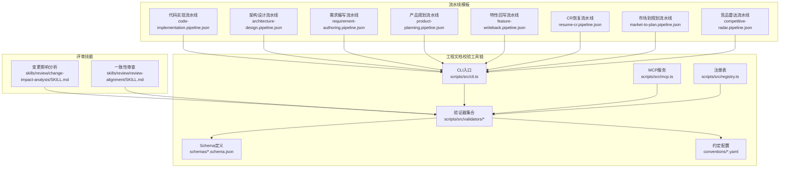
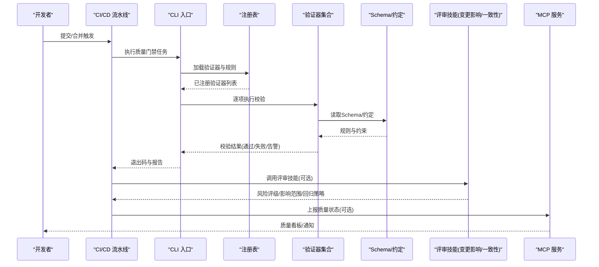
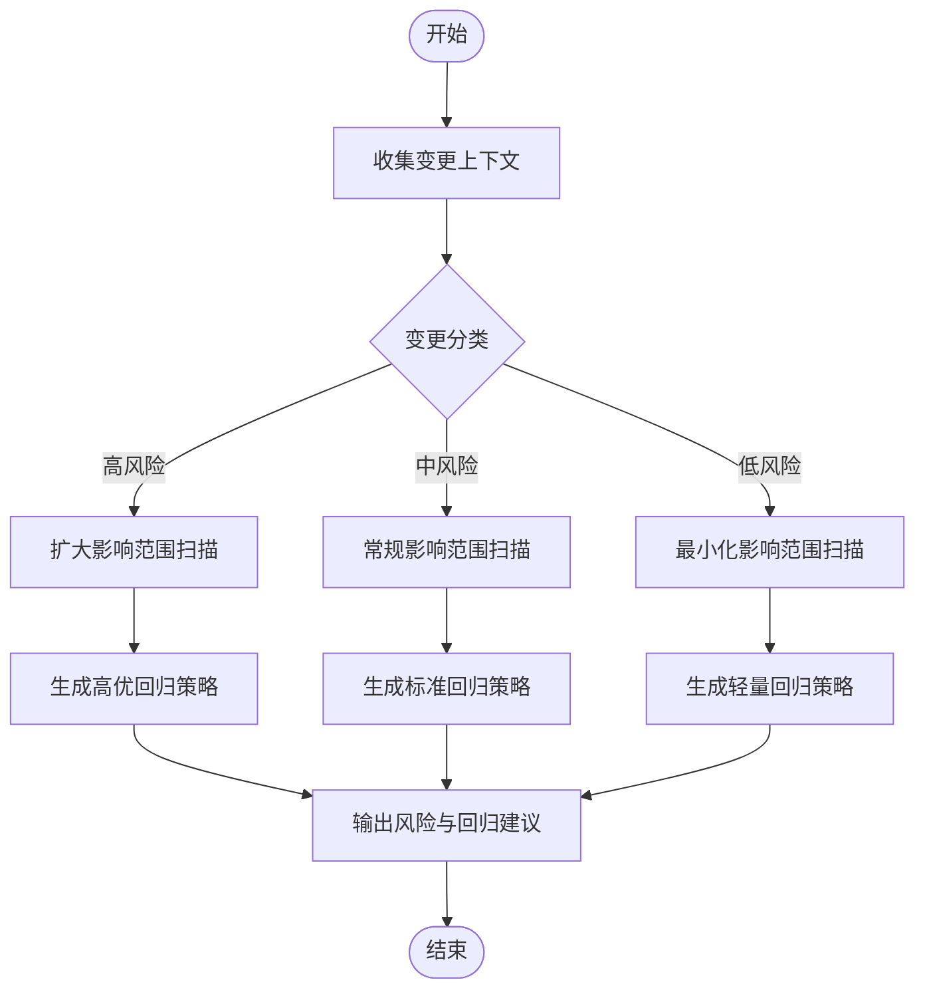
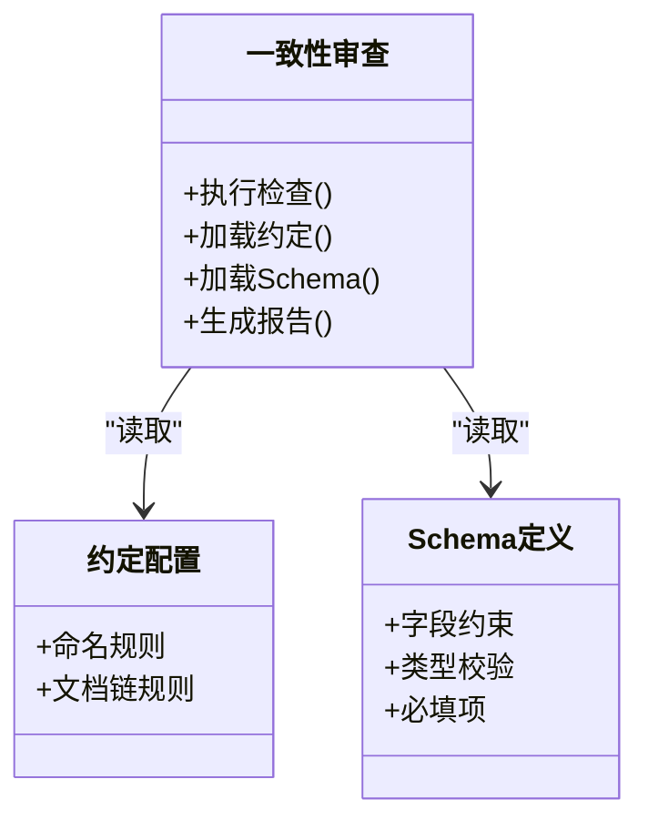
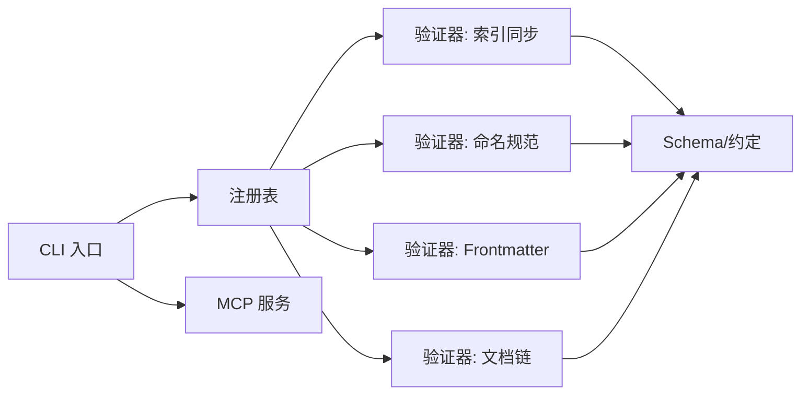
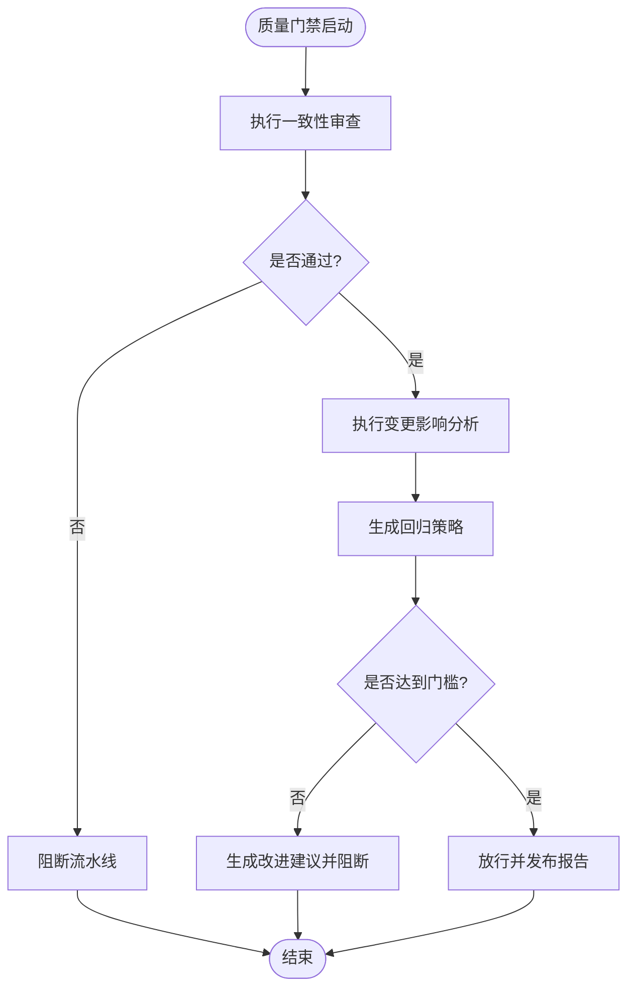
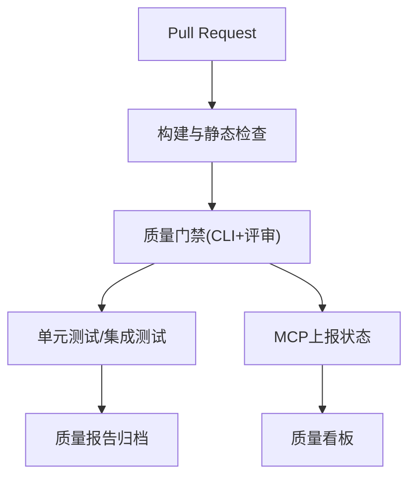
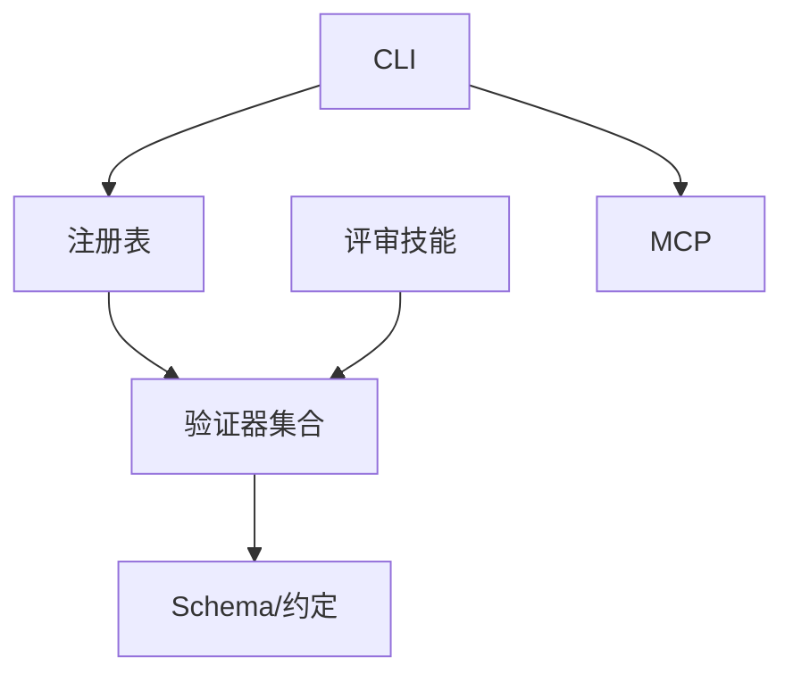

# 质量保证技能

<cite>
**本文引用的文件**   
- [agents/quality-reviewer-agent.md](file://agents/quality-reviewer-agent.md)
- [skills/review/change-impact-analysis/SKILL.md](file://skills/review/change-impact-analysis/SKILL.md)
- [skills/review/review-alignment/SKILL.md](file://skills/review/review-alignment/SKILL.md)
- [skills/shared/engineering-docs/scripts/src/cli.ts](file://skills/shared/engineering-docs/scripts/src/cli.ts)
- [skills/shared/engineering-docs/scripts/src/mcp.ts](file://skills/shared/engineering-docs/scripts/src/mcp.ts)
- [skills/shared/engineering-docs/scripts/src/registry.ts](file://skills/shared/engineering-docs/scripts/src/registry.ts)
- [skills/shared/engineering-docs/scripts/src/validators/index-sync.ts](file://skills/shared/engineering-docs/scripts/src/validators/index-sync.ts)
- [skills/shared/engineering-docs/scripts/src/validators/naming.ts](file://skills/shared/engineering-docs/scripts/src/validators/naming.ts)
- [skills/shared/engineering-docs/scripts/src/validators/frontmatter.ts](file://skills/shared/engineering-docs/scripts/src/validators/frontmatter.ts)
- [skills/shared/engineering-docs/scripts/src/validators/chain.ts](file://skills/shared/engineering-docs/scripts/src/validators/chain.ts)
- [skills/shared/engineering-docs/scripts/package.json](file://skills/shared/engineering-docs/scripts/package.json)
- [skills/shared/engineering-docs/scripts/tsconfig.json](file://skills/shared/engineering-docs/scripts/tsconfig.json)
- [skills/shared/engineering-docs/scripts/vitest.config.ts](file://skills/shared/engineering-docs/scripts/vitest.config.ts)
- [skills/shared/engineering-docs/schemas/common-defs.schema.json](file://skills/shared/engineering-docs/schemas/common-defs.schema.json)
- [skills/shared/engineering-docs/schemas/prd.schema.json](file://skills/shared/engineering-docs/schemas/prd.schema.json)
- [skills/shared/engineering-docs/schemas/sdd.schema.json](file://skills/shared/engineering-docs/schemas/sdd.schema.json)
- [skills/shared/engineering-docs/schemas/plan.schema.json](file://skills/shared/engineering-docs/schemas/plan.schema.json)
- [skills/shared/engineering-docs/schemas/task.schema.json](file://skills/shared/engineering-docs/schemas/task.schema.json)
- [skills/shared/engineering-docs/schemas/release.schema.json](file://skills/shared/engineering-docs/schemas/release.schema.json)
- [skills/shared/engineering-docs/schemas/form.schema.json](file://skills/shared/engineering-docs/schemas/form.schema.json)
- [skills/shared/engineering-docs/schemas/module.schema.json](file://skills/shared/engineering-docs/schemas/module.schema.json)
- [skills/shared/engineering-docs/conventions/doc-chain.yaml](file://skills/shared/engineering-docs/conventions/doc-chain.yaml)
- [skills/shared/engineering-docs/conventions/naming.yaml](file://skills/shared/engineering-docs/conventions/naming.yaml)
- [skills/shared/validate-doc/SKILL.md](file://skills/shared/validate-doc/SKILL.md)
- [pipeline-templates/README.md](file://pipeline-templates/README.md)
- [pipeline-templates/code-implementation.pipeline.json](file://pipeline-templates/code-implementation.pipeline.json)
- [pipeline-templates/architecture-design.pipeline.json](file://pipeline-templates/architecture-design.pipeline.json)
- [pipeline-templates/requirement-authoring.pipeline.json](file://pipeline-templates/requirement-authoring.pipeline.json)
- [pipeline-templates/product-planning.pipeline.json](file://pipeline-templates/product-planning.pipeline.json)
- [pipeline-templates/feature-writeback.pipeline.json](file://pipeline-templates/feature-writeback.pipeline.json)
- [pipeline-templates/resume-cr.pipeline.json](file://pipeline-templates/resume-cr.pipeline.json)
- [pipeline-templates/market-to-plan.pipeline.json](file://pipeline-templates/market-to-plan.pipeline.json)
- [pipeline-templates/competitive-radar.pipeline.json](file://pipeline-templates/competitive-radar.pipeline.json)
</cite>

## 目录
1. [简介](#简介)
2. [项目结构](#项目结构)
3. [核心组件](#核心组件)
4. [架构总览](#架构总览)
5. [详细组件分析](#详细组件分析)
6. [依赖分析](#依赖分析)
7. [性能考虑](#性能考虑)
8. [故障排查指南](#故障排查指南)
9. [结论](#结论)
10. [附录](#附录)

## 简介
本文件面向“质量保证技能模块”，围绕变更影响分析与一致性审查两大质量保障机制，系统化阐述以下能力：
- 变更风险评估、影响范围识别与回归测试策略的自动化方法
- 一致性检查规则配置、质量门禁设置与缺陷预防措施的实施路径
- 质量度量指标定义、质量报告生成与质量改进建议的自动生成
- 与CI/CD流水线的质量集成与持续质量监控

该文档以仓库中现有的“评审”“共享工程文档校验脚本”“流水线模板”等资产为依据，提供从概念到落地的完整说明。

## 项目结构
与质量保证相关的核心位置包括：
- 评审类技能：变更影响分析、一致性审查
- 工程文档校验工具链：CLI、MCP、注册表、验证器、Schema、约定
- 流水线模板：用于在CI/CD中编排质量活动

图示来源
- [skills/review/change-impact-analysis/SKILL.md](file://skills/review/change-impact-analysis/SKILL.md)
- [skills/review/review-alignment/SKILL.md](file://skills/review/review-alignment/SKILL.md)
- [skills/shared/engineering-docs/scripts/src/cli.ts](file://skills/shared/engineering-docs/scripts/src/cli.ts)
- [skills/shared/engineering-docs/scripts/src/mcp.ts](file://skills/shared/engineering-docs/scripts/src/mcp.ts)
- [skills/shared/engineering-docs/scripts/src/registry.ts](file://skills/shared/engineering-docs/scripts/src/registry.ts)
- [skills/shared/engineering-docs/scripts/src/validators/index-sync.ts](file://skills/shared/engineering-docs/scripts/src/validators/index-sync.ts)
- [skills/shared/engineering-docs/scripts/src/validators/naming.ts](file://skills/shared/engineering-docs/scripts/src/validators/naming.ts)
- [skills/shared/engineering-docs/scripts/src/validators/frontmatter.ts](file://skills/shared/engineering-docs/scripts/src/validators/frontmatter.ts)
- [skills/shared/engineering-docs/scripts/src/validators/chain.ts](file://skills/shared/engineering-docs/scripts/src/validators/chain.ts)
- [skills/shared/engineering-docs/schemas/common-defs.schema.json](file://skills/shared/engineering-docs/schemas/common-defs.schema.json)
- [skills/shared/engineering-docs/schemas/prd.schema.json](file://skills/shared/engineering-docs/schemas/prd.schema.json)
- [skills/shared/engineering-docs/schemas/sdd.schema.json](file://skills/shared/engineering-docs/schemas/sdd.schema.json)
- [skills/shared/engineering-docs/schemas/plan.schema.json](file://skills/shared/engineering-docs/schemas/plan.schema.json)
- [skills/shared/engineering-docs/schemas/task.schema.json](file://skills/shared/engineering-docs/schemas/task.schema.json)
- [skills/shared/engineering-docs/schemas/release.schema.json](file://skills/shared/engineering-docs/schemas/release.schema.json)
- [skills/shared/engineering-docs/schemas/form.schema.json](file://skills/shared/engineering-docs/schemas/form.schema.json)
- [skills/shared/engineering-docs/schemas/module.schema.json](file://skills/shared/engineering-docs/schemas/module.schema.json)
- [skills/shared/engineering-docs/conventions/doc-chain.yaml](file://skills/shared/engineering-docs/conventions/doc-chain.yaml)
- [skills/shared/engineering-docs/conventions/naming.yaml](file://skills/shared/engineering-docs/conventions/naming.yaml)
- [pipeline-templates/code-implementation.pipeline.json](file://pipeline-templates/code-implementation.pipeline.json)
- [pipeline-templates/architecture-design.pipeline.json](file://pipeline-templates/architecture-design.pipeline.json)
- [pipeline-templates/requirement-authoring.pipeline.json](file://pipeline-templates/requirement-authoring.pipeline.json)
- [pipeline-templates/product-planning.pipeline.json](file://pipeline-templates/product-planning.pipeline.json)
- [pipeline-templates/feature-writeback.pipeline.json](file://pipeline-templates/feature-writeback.pipeline.json)
- [pipeline-templates/resume-cr.pipeline.json](file://pipeline-templates/resume-cr.pipeline.json)
- [pipeline-templates/market-to-plan.pipeline.json](file://pipeline-templates/market-to-plan.pipeline.json)
- [pipeline-templates/competitive-radar.pipeline.json](file://pipeline-templates/competitive-radar.pipeline.json)

章节来源
- [skills/review/change-impact-analysis/SKILL.md](file://skills/review/change-impact-analysis/SKILL.md)
- [skills/review/review-alignment/SKILL.md](file://skills/review/review-alignment/SKILL.md)
- [skills/shared/engineering-docs/scripts/src/cli.ts](file://skills/shared/engineering-docs/scripts/src/cli.ts)
- [skills/shared/engineering-docs/scripts/src/mcp.ts](file://skills/shared/engineering-docs/scripts/src/mcp.ts)
- [skills/shared/engineering-docs/scripts/src/registry.ts](file://skills/shared/engineering-docs/scripts/src/registry.ts)
- [skills/shared/engineering-docs/scripts/src/validators/index-sync.ts](file://skills/shared/engineering-docs/scripts/src/validators/index-sync.ts)
- [skills/shared/engineering-docs/scripts/src/validators/naming.ts](file://skills/shared/engineering-docs/scripts/src/validators/naming.ts)
- [skills/shared/engineering-docs/scripts/src/validators/frontmatter.ts](file://skills/shared/engineering-docs/scripts/src/validators/frontmatter.ts)
- [skills/shared/engineering-docs/scripts/src/validators/chain.ts](file://skills/shared/engineering-docs/scripts/src/validators/chain.ts)
- [skills/shared/engineering-docs/schemas/common-defs.schema.json](file://skills/shared/engineering-docs/schemas/common-defs.schema.json)
- [skills/shared/engineering-docs/schemas/prd.schema.json](file://skills/shared/engineering-docs/schemas/prd.schema.json)
- [skills/shared/engineering-docs/schemas/sdd.schema.json](file://skills/shared/engineering-docs/schemas/sdd.schema.json)
- [skills/shared/engineering-docs/schemas/plan.schema.json](file://skills/shared/engineering-docs/schemas/plan.schema.json)
- [skills/shared/engineering-docs/schemas/task.schema.json](file://skills/shared/engineering-docs/schemas/task.schema.json)
- [skills/shared/engineering-docs/schemas/release.schema.json](file://skills/shared/engineering-docs/schemas/release.schema.json)
- [skills/shared/engineering-docs/schemas/form.schema.json](file://skills/shared/engineering-docs/schemas/form.schema.json)
- [skills/shared/engineering-docs/schemas/module.schema.json](file://skills/shared/engineering-docs/schemas/module.schema.json)
- [skills/shared/engineering-docs/conventions/doc-chain.yaml](file://skills/shared/engineering-docs/conventions/doc-chain.yaml)
- [skills/shared/engineering-docs/conventions/naming.yaml](file://skills/shared/engineering-docs/conventions/naming.yaml)
- [pipeline-templates/README.md](file://pipeline-templates/README.md)
- [pipeline-templates/code-implementation.pipeline.json](file://pipeline-templates/code-implementation.pipeline.json)
- [pipeline-templates/architecture-design.pipeline.json](file://pipeline-templates/architecture-design.pipeline.json)
- [pipeline-templates/requirement-authoring.pipeline.json](file://pipeline-templates/requirement-authoring.pipeline.json)
- [pipeline-templates/product-planning.pipeline.json](file://pipeline-templates/product-planning.pipeline.json)
- [pipeline-templates/feature-writeback.pipeline.json](file://pipeline-templates/feature-writeback.pipeline.json)
- [pipeline-templates/resume-cr.pipeline.json](file://pipeline-templates/resume-cr.pipeline.json)
- [pipeline-templates/market-to-plan.pipeline.json](file://pipeline-templates/market-to-plan.pipeline.json)
- [pipeline-templates/competitive-radar.pipeline.json](file://pipeline-templates/competitive-radar.pipeline.json)

## 核心组件
- 评审技能
  - 变更影响分析：用于评估变更的风险等级、影响范围与回归测试策略，并输出结构化建议。
  - 一致性审查：基于约定与Schema对文档与产物进行一致性校验，发现命名、结构与引用不一致问题。
- 工程文档校验工具链
  - CLI：统一入口，支持批量校验、结果汇总与退出码控制，便于接入CI。
  - MCP：提供可被外部系统调用的接口，将校验能力暴露为服务。
  - 注册表：集中管理验证器与规则，支持扩展与组合。
  - 验证器：按维度执行具体检查（索引同步、命名规范、Frontmatter字段、文档链完整性等）。
  - Schema与约定：定义数据模型与命名/链接约定，作为校验依据。
- 流水线模板
  - 将上述能力编排进CI/CD流程，形成质量门禁与持续质量监控。

章节来源
- [skills/review/change-impact-analysis/SKILL.md](file://skills/review/change-impact-analysis/SKILL.md)
- [skills/review/review-alignment/SKILL.md](file://skills/review/review-alignment/SKILL.md)
- [skills/shared/engineering-docs/scripts/src/cli.ts](file://skills/shared/engineering-docs/scripts/src/cli.ts)
- [skills/shared/engineering-docs/scripts/src/mcp.ts](file://skills/shared/engineering-docs/scripts/src/mcp.ts)
- [skills/shared/engineering-docs/scripts/src/registry.ts](file://skills/shared/engineering-docs/scripts/src/registry.ts)
- [skills/shared/engineering-docs/scripts/src/validators/index-sync.ts](file://skills/shared/engineering-docs/scripts/src/validators/index-sync.ts)
- [skills/shared/engineering-docs/scripts/src/validators/naming.ts](file://skills/shared/engineering-docs/scripts/src/validators/naming.ts)
- [skills/shared/engineering-docs/scripts/src/validators/frontmatter.ts](file://skills/shared/engineering-docs/scripts/src/validators/frontmatter.ts)
- [skills/shared/engineering-docs/scripts/src/validators/chain.ts](file://skills/shared/engineering-docs/scripts/src/validators/chain.ts)
- [skills/shared/engineering-docs/schemas/common-defs.schema.json](file://skills/shared/engineering-docs/schemas/common-defs.schema.json)
- [skills/shared/engineering-docs/schemas/prd.schema.json](file://skills/shared/engineering-docs/schemas/prd.schema.json)
- [skills/shared/engineering-docs/schemas/sdd.schema.json](file://skills/shared/engineering-docs/schemas/sdd.schema.json)
- [skills/shared/engineering-docs/schemas/plan.schema.json](file://skills/shared/engineering-docs/schemas/plan.schema.json)
- [skills/shared/engineering-docs/schemas/task.schema.json](file://skills/shared/engineering-docs/schemas/task.schema.json)
- [skills/shared/engineering-docs/schemas/release.schema.json](file://skills/shared/engineering-docs/schemas/release.schema.json)
- [skills/shared/engineering-docs/schemas/form.schema.json](file://skills/shared/engineering-docs/schemas/form.schema.json)
- [skills/shared/engineering-docs/schemas/module.schema.json](file://skills/shared/engineering-docs/schemas/module.schema.json)
- [skills/shared/engineering-docs/conventions/doc-chain.yaml](file://skills/shared/engineering-docs/conventions/doc-chain.yaml)
- [skills/shared/engineering-docs/conventions/naming.yaml](file://skills/shared/engineering-docs/conventions/naming.yaml)
- [pipeline-templates/README.md](file://pipeline-templates/README.md)

## 架构总览
下图展示了“评审技能 + 校验工具链 + 流水线模板”的整体协作关系，以及数据与控制流。

图示来源
- [skills/shared/engineering-docs/scripts/src/cli.ts](file://skills/shared/engineering-docs/scripts/src/cli.ts)
- [skills/shared/engineering-docs/scripts/src/registry.ts](file://skills/shared/engineering-docs/scripts/src/registry.ts)
- [skills/shared/engineering-docs/scripts/src/validators/index-sync.ts](file://skills/shared/engineering-docs/scripts/src/validators/index-sync.ts)
- [skills/shared/engineering-docs/scripts/src/validators/naming.ts](file://skills/shared/engineering-docs/scripts/src/validators/naming.ts)
- [skills/shared/engineering-docs/scripts/src/validators/frontmatter.ts](file://skills/shared/engineering-docs/scripts/src/validators/frontmatter.ts)
- [skills/shared/engineering-docs/scripts/src/validators/chain.ts](file://skills/shared/engineering-docs/scripts/src/validators/chain.ts)
- [skills/shared/engineering-docs/schemas/common-defs.schema.json](file://skills/shared/engineering-docs/schemas/common-defs.schema.json)
- [skills/shared/engineering-docs/schemas/prd.schema.json](file://skills/shared/engineering-docs/schemas/prd.schema.json)
- [skills/shared/engineering-docs/schemas/sdd.schema.json](file://skills/shared/engineering-docs/schemas/sdd.schema.json)
- [skills/shared/engineering-docs/schemas/plan.schema.json](file://skills/shared/engineering-docs/schemas/plan.schema.json)
- [skills/shared/engineering-docs/schemas/task.schema.json](file://skills/shared/engineering-docs/schemas/task.schema.json)
- [skills/shared/engineering-docs/schemas/release.schema.json](file://skills/shared/engineering-docs/schemas/release.schema.json)
- [skills/shared/engineering-docs/schemas/form.schema.json](file://skills/shared/engineering-docs/schemas/form.schema.json)
- [skills/shared/engineering-docs/schemas/module.schema.json](file://skills/shared/engineering-docs/schemas/module.schema.json)
- [skills/shared/engineering-docs/conventions/doc-chain.yaml](file://skills/shared/engineering-docs/conventions/doc-chain.yaml)
- [skills/shared/engineering-docs/conventions/naming.yaml](file://skills/shared/engineering-docs/conventions/naming.yaml)
- [skills/review/change-impact-analysis/SKILL.md](file://skills/review/change-impact-analysis/SKILL.md)
- [skills/review/review-alignment/SKILL.md](file://skills/review/review-alignment/SKILL.md)
- [skills/shared/engineering-docs/scripts/src/mcp.ts](file://skills/shared/engineering-docs/scripts/src/mcp.ts)

## 详细组件分析

### 变更影响分析（Change Impact Analysis）
- 目标
  - 评估变更风险等级，识别受影响范围（文档、模块、依赖），制定回归测试策略与优先级。
- 输入
  - 变更集（文件差异、关联文档、任务/需求/设计条目）
  - 历史质量数据（缺陷分布、回归失败记录）
- 处理逻辑
  - 基于变更类型与影响面进行风险分级
  - 映射受影响工件与下游依赖
  - 生成回归测试清单与覆盖建议
- 输出
  - 风险评级、影响范围清单、回归策略与建议
- 与工具链集成
  - 可在流水线中作为独立阶段或前置门禁；结果写入质量报告并驱动后续步骤

图示来源
- [skills/review/change-impact-analysis/SKILL.md](file://skills/review/change-impact-analysis/SKILL.md)

章节来源
- [skills/review/change-impact-analysis/SKILL.md](file://skills/review/change-impact-analysis/SKILL.md)

### 一致性审查（Review Alignment）
- 目标
  - 确保文档与产物遵循命名、结构与引用约定，避免“漂移”。
- 规则来源
  - 约定配置（命名、文档链）
  - Schema定义（字段、类型、必填项）
- 关键检查点
  - 命名规范、前后置元信息完整性、索引同步、文档链连通性
- 输出
  - 一致性检查结果、修复建议与阻断级别

图示来源
- [skills/review/review-alignment/SKILL.md](file://skills/review/review-alignment/SKILL.md)
- [skills/shared/engineering-docs/conventions/doc-chain.yaml](file://skills/shared/engineering-docs/conventions/doc-chain.yaml)
- [skills/shared/engineering-docs/conventions/naming.yaml](file://skills/shared/engineering-docs/conventions/naming.yaml)
- [skills/shared/engineering-docs/schemas/common-defs.schema.json](file://skills/shared/engineering-docs/schemas/common-defs.schema.json)
- [skills/shared/engineering-docs/schemas/prd.schema.json](file://skills/shared/engineering-docs/schemas/prd.schema.json)
- [skills/shared/engineering-docs/schemas/sdd.schema.json](file://skills/shared/engineering-docs/schemas/sdd.schema.json)
- [skills/shared/engineering-docs/schemas/plan.schema.json](file://skills/shared/engineering-docs/schemas/plan.schema.json)
- [skills/shared/engineering-docs/schemas/task.schema.json](file://skills/shared/engineering-docs/schemas/task.schema.json)
- [skills/shared/engineering-docs/schemas/release.schema.json](file://skills/shared/engineering-docs/schemas/release.schema.json)
- [skills/shared/engineering-docs/schemas/form.schema.json](file://skills/shared/engineering-docs/schemas/form.schema.json)
- [skills/shared/engineering-docs/schemas/module.schema.json](file://skills/shared/engineering-docs/schemas/module.schema.json)

章节来源
- [skills/review/review-alignment/SKILL.md](file://skills/review/review-alignment/SKILL.md)
- [skills/shared/engineering-docs/conventions/doc-chain.yaml](file://skills/shared/engineering-docs/conventions/doc-chain.yaml)
- [skills/shared/engineering-docs/conventions/naming.yaml](file://skills/shared/engineering-docs/conventions/naming.yaml)
- [skills/shared/engineering-docs/schemas/common-defs.schema.json](file://skills/shared/engineering-docs/schemas/common-defs.schema.json)
- [skills/shared/engineering-docs/schemas/prd.schema.json](file://skills/shared/engineering-docs/schemas/prd.schema.json)
- [skills/shared/engineering-docs/schemas/sdd.schema.json](file://skills/shared/engineering-docs/schemas/sdd.schema.json)
- [skills/shared/engineering-docs/schemas/plan.schema.json](file://skills/shared/engineering-docs/schemas/plan.schema.json)
- [skills/shared/engineering-docs/schemas/task.schema.json](file://skills/shared/engineering-docs/schemas/task.schema.json)
- [skills/shared/engineering-docs/schemas/release.schema.json](file://skills/shared/engineering-docs/schemas/release.schema.json)
- [skills/shared/engineering-docs/schemas/form.schema.json](file://skills/shared/engineering-docs/schemas/form.schema.json)
- [skills/shared/engineering-docs/schemas/module.schema.json](file://skills/shared/engineering-docs/schemas/module.schema.json)

### 工程文档校验工具链（CLI/MCP/注册表/验证器）
- CLI
  - 统一入口，负责参数解析、任务调度、结果聚合与退出码控制，便于CI集成。
- MCP
  - 将校验能力对外暴露为服务，供其他系统查询质量状态或触发校验。
- 注册表
  - 集中管理验证器与规则，支持动态加载与组合。
- 验证器
  - 索引同步：保证索引与内容一致
  - 命名规范：统一命名约定
  - Frontmatter：校验元信息完整性与类型
  - 文档链：检查链接与引用连通性
- 配置与Schema
  - 约定：命名与文档链规则
  - Schema：数据结构与约束

图示来源
- [skills/shared/engineering-docs/scripts/src/cli.ts](file://skills/shared/engineering-docs/scripts/src/cli.ts)
- [skills/shared/engineering-docs/scripts/src/mcp.ts](file://skills/shared/engineering-docs/scripts/src/mcp.ts)
- [skills/shared/engineering-docs/scripts/src/registry.ts](file://skills/shared/engineering-docs/scripts/src/registry.ts)
- [skills/shared/engineering-docs/scripts/src/validators/index-sync.ts](file://skills/shared/engineering-docs/scripts/src/validators/index-sync.ts)
- [skills/shared/engineering-docs/scripts/src/validators/naming.ts](file://skills/shared/engineering-docs/scripts/src/validators/naming.ts)
- [skills/shared/engineering-docs/scripts/src/validators/frontmatter.ts](file://skills/shared/engineering-docs/scripts/src/validators/frontmatter.ts)
- [skills/shared/engineering-docs/scripts/src/validators/chain.ts](file://skills/shared/engineering-docs/scripts/src/validators/chain.ts)
- [skills/shared/engineering-docs/schemas/common-defs.schema.json](file://skills/shared/engineering-docs/schemas/common-defs.schema.json)
- [skills/shared/engineering-docs/schemas/prd.schema.json](file://skills/shared/engineering-docs/schemas/prd.schema.json)
- [skills/shared/engineering-docs/schemas/sdd.schema.json](file://skills/shared/engineering-docs/schemas/sdd.schema.json)
- [skills/shared/engineering-docs/schemas/plan.schema.json](file://skills/shared/engineering-docs/schemas/plan.schema.json)
- [skills/shared/engineering-docs/schemas/task.schema.json](file://skills/shared/engineering-docs/schemas/task.schema.json)
- [skills/shared/engineering-docs/schemas/release.schema.json](file://skills/shared/engineering-docs/schemas/release.schema.json)
- [skills/shared/engineering-docs/schemas/form.schema.json](file://skills/shared/engineering-docs/schemas/form.schema.json)
- [skills/shared/engineering-docs/schemas/module.schema.json](file://skills/shared/engineering-docs/schemas/module.schema.json)
- [skills/shared/engineering-docs/conventions/doc-chain.yaml](file://skills/shared/engineering-docs/conventions/doc-chain.yaml)
- [skills/shared/engineering-docs/conventions/naming.yaml](file://skills/shared/engineering-docs/conventions/naming.yaml)

章节来源
- [skills/shared/engineering-docs/scripts/src/cli.ts](file://skills/shared/engineering-docs/scripts/src/cli.ts)
- [skills/shared/engineering-docs/scripts/src/mcp.ts](file://skills/shared/engineering-docs/scripts/src/mcp.ts)
- [skills/shared/engineering-docs/scripts/src/registry.ts](file://skills/shared/engineering-docs/scripts/src/registry.ts)
- [skills/shared/engineering-docs/scripts/src/validators/index-sync.ts](file://skills/shared/engineering-docs/scripts/src/validators/index-sync.ts)
- [skills/shared/engineering-docs/scripts/src/validators/naming.ts](file://skills/shared/engineering-docs/scripts/src/validators/naming.ts)
- [skills/shared/engineering-docs/scripts/src/validators/frontmatter.ts](file://skills/shared/engineering-docs/scripts/src/validators/frontmatter.ts)
- [skills/shared/engineering-docs/scripts/src/validators/chain.ts](file://skills/shared/engineering-docs/scripts/src/validators/chain.ts)
- [skills/shared/engineering-docs/schemas/common-defs.schema.json](file://skills/shared/engineering-docs/schemas/common-defs.schema.json)
- [skills/shared/engineering-docs/schemas/prd.schema.json](file://skills/shared/engineering-docs/schemas/prd.schema.json)
- [skills/shared/engineering-docs/schemas/sdd.schema.json](file://skills/shared/engineering-docs/schemas/sdd.schema.json)
- [skills/shared/engineering-docs/schemas/plan.schema.json](file://skills/shared/engineering-docs/schemas/plan.schema.json)
- [skills/shared/engineering-docs/schemas/task.schema.json](file://skills/shared/engineering-docs/schemas/task.schema.json)
- [skills/shared/engineering-docs/schemas/release.schema.json](file://skills/shared/engineering-docs/schemas/release.schema.json)
- [skills/shared/engineering-docs/schemas/form.schema.json](file://skills/shared/engineering-docs/schemas/form.schema.json)
- [skills/shared/engineering-docs/schemas/module.schema.json](file://skills/shared/engineering-docs/schemas/module.schema.json)
- [skills/shared/engineering-docs/conventions/doc-chain.yaml](file://skills/shared/engineering-docs/conventions/doc-chain.yaml)
- [skills/shared/engineering-docs/conventions/naming.yaml](file://skills/shared/engineering-docs/conventions/naming.yaml)

### 质量门禁与回归测试策略（自动化）
- 质量门禁
  - 在流水线中嵌入一致性审查与变更影响分析，失败则阻断合并或发布。
  - 使用CLI退出码与报告作为门禁判定依据。
- 回归测试策略
  - 根据变更影响分析输出，自动选择回归用例集与覆盖深度。
  - 结合历史缺陷与失败热点，优先强化高风险区域。
- 质量报告与改进建议
  - 汇总一致性检查结果、风险评级与回归策略，生成可读报告。
  - 基于规则命中与趋势，自动生成改进建议（如补齐缺失字段、修正命名、修复断链）。

图示来源
- [skills/shared/engineering-docs/scripts/src/cli.ts](file://skills/shared/engineering-docs/scripts/src/cli.ts)
- [skills/review/change-impact-analysis/SKILL.md](file://skills/review/change-impact-analysis/SKILL.md)
- [skills/review/review-alignment/SKILL.md](file://skills/review/review-alignment/SKILL.md)

章节来源
- [skills/shared/engineering-docs/scripts/src/cli.ts](file://skills/shared/engineering-docs/scripts/src/cli.ts)
- [skills/review/change-impact-analysis/SKILL.md](file://skills/review/change-impact-analysis/SKILL.md)
- [skills/review/review-alignment/SKILL.md](file://skills/review/review-alignment/SKILL.md)

### 与CI/CD的质量集成与持续质量监控
- 集成方式
  - 使用流水线模板在各阶段调用CLI与评审技能，形成端到端质量门禁。
  - 通过MCP上报质量状态，供看板与通知消费。
- 持续监控
  - 定期运行一致性审查与影响分析，跟踪趋势与退化。
  - 将质量指标纳入仪表盘，设定阈值与告警。

图示来源
- [pipeline-templates/README.md](file://pipeline-templates/README.md)
- [pipeline-templates/code-implementation.pipeline.json](file://pipeline-templates/code-implementation.pipeline.json)
- [pipeline-templates/architecture-design.pipeline.json](file://pipeline-templates/architecture-design.pipeline.json)
- [pipeline-templates/requirement-authoring.pipeline.json](file://pipeline-templates/requirement-authoring.pipeline.json)
- [pipeline-templates/product-planning.pipeline.json](file://pipeline-templates/product-planning.pipeline.json)
- [pipeline-templates/feature-writeback.pipeline.json](file://pipeline-templates/feature-writeback.pipeline.json)
- [pipeline-templates/resume-cr.pipeline.json](file://pipeline-templates/resume-cr.pipeline.json)
- [pipeline-templates/market-to-plan.pipeline.json](file://pipeline-templates/market-to-plan.pipeline.json)
- [pipeline-templates/competitive-radar.pipeline.json](file://pipeline-templates/competitive-radar.pipeline.json)
- [skills/shared/engineering-docs/scripts/src/cli.ts](file://skills/shared/engineering-docs/scripts/src/cli.ts)
- [skills/shared/engineering-docs/scripts/src/mcp.ts](file://skills/shared/engineering-docs/scripts/src/mcp.ts)

章节来源
- [pipeline-templates/README.md](file://pipeline-templates/README.md)
- [pipeline-templates/code-implementation.pipeline.json](file://pipeline-templates/code-implementation.pipeline.json)
- [pipeline-templates/architecture-design.pipeline.json](file://pipeline-templates/architecture-design.pipeline.json)
- [pipeline-templates/requirement-authoring.pipeline.json](file://pipeline-templates/requirement-authoring.pipeline.json)
- [pipeline-templates/product-planning.pipeline.json](file://pipeline-templates/product-planning.pipeline.json)
- [pipeline-templates/feature-writeback.pipeline.json](file://pipeline-templates/feature-writeback.pipeline.json)
- [pipeline-templates/resume-cr.pipeline.json](file://pipeline-templates/resume-cr.pipeline.json)
- [pipeline-templates/market-to-plan.pipeline.json](file://pipeline-templates/market-to-plan.pipeline.json)
- [pipeline-templates/competitive-radar.pipeline.json](file://pipeline-templates/competitive-radar.pipeline.json)
- [skills/shared/engineering-docs/scripts/src/cli.ts](file://skills/shared/engineering-docs/scripts/src/cli.ts)
- [skills/shared/engineering-docs/scripts/src/mcp.ts](file://skills/shared/engineering-docs/scripts/src/mcp.ts)

## 依赖分析
- 组件耦合
  - CLI依赖注册表与验证器；验证器依赖Schema与约定；评审技能依赖变更上下文与历史数据。
- 外部依赖
  - 文件系统访问（读取文档与配置）、JSON/YAML解析、HTTP（MCP对外服务）。
- 潜在循环依赖
  - 注册表仅作为加载器，无反向依赖，降低循环风险。
- 接口契约
  - CLI与MCP提供稳定接口；验证器以统一协议返回结果，便于替换与扩展。

图示来源
- [skills/shared/engineering-docs/scripts/src/cli.ts](file://skills/shared/engineering-docs/scripts/src/cli.ts)
- [skills/shared/engineering-docs/scripts/src/registry.ts](file://skills/shared/engineering-docs/scripts/src/registry.ts)
- [skills/shared/engineering-docs/scripts/src/mcp.ts](file://skills/shared/engineering-docs/scripts/src/mcp.ts)
- [skills/shared/engineering-docs/scripts/src/validators/index-sync.ts](file://skills/shared/engineering-docs/scripts/src/validators/index-sync.ts)
- [skills/shared/engineering-docs/scripts/src/validators/naming.ts](file://skills/shared/engineering-docs/scripts/src/validators/naming.ts)
- [skills/shared/engineering-docs/scripts/src/validators/frontmatter.ts](file://skills/shared/engineering-docs/scripts/src/validators/frontmatter.ts)
- [skills/shared/engineering-docs/scripts/src/validators/chain.ts](file://skills/shared/engineering-docs/scripts/src/validators/chain.ts)
- [skills/shared/engineering-docs/schemas/common-defs.schema.json](file://skills/shared/engineering-docs/schemas/common-defs.schema.json)
- [skills/shared/engineering-docs/schemas/prd.schema.json](file://skills/shared/engineering-docs/schemas/prd.schema.json)
- [skills/shared/engineering-docs/schemas/sdd.schema.json](file://skills/shared/engineering-docs/schemas/sdd.schema.json)
- [skills/shared/engineering-docs/schemas/plan.schema.json](file://skills/shared/engineering-docs/schemas/plan.schema.json)
- [skills/shared/engineering-docs/schemas/task.schema.json](file://skills/shared/engineering-docs/schemas/task.schema.json)
- [skills/shared/engineering-docs/schemas/release.schema.json](file://skills/shared/engineering-docs/schemas/release.schema.json)
- [skills/shared/engineering-docs/schemas/form.schema.json](file://skills/shared/engineering-docs/schemas/form.schema.json)
- [skills/shared/engineering-docs/schemas/module.schema.json](file://skills/shared/engineering-docs/schemas/module.schema.json)
- [skills/shared/engineering-docs/conventions/doc-chain.yaml](file://skills/shared/engineering-docs/conventions/doc-chain.yaml)
- [skills/shared/engineering-docs/conventions/naming.yaml](file://skills/shared/engineering-docs/conventions/naming.yaml)
- [skills/review/change-impact-analysis/SKILL.md](file://skills/review/change-impact-analysis/SKILL.md)
- [skills/review/review-alignment/SKILL.md](file://skills/review/review-alignment/SKILL.md)

章节来源
- [skills/shared/engineering-docs/scripts/src/cli.ts](file://skills/shared/engineering-docs/scripts/src/cli.ts)
- [skills/shared/engineering-docs/scripts/src/registry.ts](file://skills/shared/engineering-docs/scripts/src/registry.ts)
- [skills/shared/engineering-docs/scripts/src/mcp.ts](file://skills/shared/engineering-docs/scripts/src/mcp.ts)
- [skills/shared/engineering-docs/scripts/src/validators/index-sync.ts](file://skills/shared/engineering-docs/scripts/src/validators/index-sync.ts)
- [skills/shared/engineering-docs/scripts/src/validators/naming.ts](file://skills/shared/engineering-docs/scripts/src/validators/naming.ts)
- [skills/shared/engineering-docs/scripts/src/validators/frontmatter.ts](file://skills/shared/engineering-docs/scripts/src/validators/frontmatter.ts)
- [skills/shared/engineering-docs/scripts/src/validators/chain.ts](file://skills/shared/engineering-docs/scripts/src/validators/chain.ts)
- [skills/shared/engineering-docs/schemas/common-defs.schema.json](file://skills/shared/engineering-docs/schemas/common-defs.schema.json)
- [skills/shared/engineering-docs/schemas/prd.schema.json](file://skills/shared/engineering-docs/schemas/prd.schema.json)
- [skills/shared/engineering-docs/schemas/sdd.schema.json](file://skills/shared/engineering-docs/schemas/sdd.schema.json)
- [skills/shared/engineering-docs/schemas/plan.schema.json](file://skills/shared/engineering-docs/schemas/plan.schema.json)
- [skills/shared/engineering-docs/schemas/task.schema.json](file://skills/shared/engineering-docs/schemas/task.schema.json)
- [skills/shared/engineering-docs/schemas/release.schema.json](file://skills/shared/engineering-docs/schemas/release.schema.json)
- [skills/shared/engineering-docs/schemas/form.schema.json](file://skills/shared/engineering-docs/schemas/form.schema.json)
- [skills/shared/engineering-docs/schemas/module.schema.json](file://skills/shared/engineering-docs/schemas/module.schema.json)
- [skills/shared/engineering-docs/conventions/doc-chain.yaml](file://skills/shared/engineering-docs/conventions/doc-chain.yaml)
- [skills/shared/engineering-docs/conventions/naming.yaml](file://skills/shared/engineering-docs/conventions/naming.yaml)
- [skills/review/change-impact-analysis/SKILL.md](file://skills/review/change-impact-analysis/SKILL.md)
- [skills/review/review-alignment/SKILL.md](file://skills/review/review-alignment/SKILL.md)

## 性能考虑
- 并行校验：验证器可并行执行，减少整体耗时。
- 增量检查：基于变更集只校验受影响文件，提升效率。
- 缓存策略：对Schema与约定加载结果进行缓存，避免重复IO。
- 资源限制：对大仓库采用分片与限流，防止内存与CPU峰值过高。

[本节为通用指导，不直接分析具体文件]

## 故障排查指南
- 常见问题
  - 命名不规范：根据命名约定修正文件名与引用
  - 索引不同步：更新索引文件或重新生成索引
  - Frontmatter缺失：补齐必要字段与类型
  - 文档链断裂：修复断链或调整链接路径
- 定位方法
  - 查看CLI输出与退出码，定位失败的验证器
  - 对照Schema与约定，确认期望值与实际值差异
  - 使用MCP获取实时质量状态，辅助跨系统排障

章节来源
- [skills/shared/engineering-docs/scripts/src/cli.ts](file://skills/shared/engineering-docs/scripts/src/cli.ts)
- [skills/shared/engineering-docs/scripts/src/validators/index-sync.ts](file://skills/shared/engineering-docs/scripts/src/validators/index-sync.ts)
- [skills/shared/engineering-docs/scripts/src/validators/naming.ts](file://skills/shared/engineering-docs/scripts/src/validators/naming.ts)
- [skills/shared/engineering-docs/scripts/src/validators/frontmatter.ts](file://skills/shared/engineering-docs/scripts/src/validators/frontmatter.ts)
- [skills/shared/engineering-docs/scripts/src/validators/chain.ts](file://skills/shared/engineering-docs/scripts/src/validators/chain.ts)
- [skills/shared/engineering-docs/schemas/common-defs.schema.json](file://skills/shared/engineering-docs/schemas/common-defs.schema.json)
- [skills/shared/engineering-docs/schemas/prd.schema.json](file://skills/shared/engineering-docs/schemas/prd.schema.json)
- [skills/shared/engineering-docs/schemas/sdd.schema.json](file://skills/shared/engineering-docs/schemas/sdd.schema.json)
- [skills/shared/engineering-docs/schemas/plan.schema.json](file://skills/shared/engineering-docs/schemas/plan.schema.json)
- [skills/shared/engineering-docs/schemas/task.schema.json](file://skills/shared/engineering-docs/schemas/task.schema.json)
- [skills/shared/engineering-docs/schemas/release.schema.json](file://skills/shared/engineering-docs/schemas/release.schema.json)
- [skills/shared/engineering-docs/schemas/form.schema.json](file://skills/shared/engineering-docs/schemas/form.schema.json)
- [skills/shared/engineering-docs/schemas/module.schema.json](file://skills/shared/engineering-docs/schemas/module.schema.json)
- [skills/shared/engineering-docs/conventions/doc-chain.yaml](file://skills/shared/engineering-docs/conventions/doc-chain.yaml)
- [skills/shared/engineering-docs/conventions/naming.yaml](file://skills/shared/engineering-docs/conventions/naming.yaml)

## 结论
通过将“变更影响分析”和“一致性审查”与工程文档校验工具链及流水线模板深度融合，可实现：
- 自动化的变更风险评估与回归策略生成
- 严格的一致性检查与质量门禁
- 可观测的质量度量与持续改进闭环
建议在团队内推广标准化实践，持续优化规则与策略，提升交付质量与效率。

[本节为总结性内容，不直接分析具体文件]

## 附录
- 相关技能与脚本参考
  - 评审技能：变更影响分析、一致性审查
  - 工程文档校验：CLI、MCP、注册表、验证器、Schema、约定
  - 流水线模板：多场景质量门禁与报告归档

章节来源
- [skills/review/change-impact-analysis/SKILL.md](file://skills/review/change-impact-analysis/SKILL.md)
- [skills/review/review-alignment/SKILL.md](file://skills/review/review-alignment/SKILL.md)
- [skills/shared/engineering-docs/scripts/src/cli.ts](file://skills/shared/engineering-docs/scripts/src/cli.ts)
- [skills/shared/engineering-docs/scripts/src/mcp.ts](file://skills/shared/engineering-docs/scripts/src/mcp.ts)
- [skills/shared/engineering-docs/scripts/src/registry.ts](file://skills/shared/engineering-docs/scripts/src/registry.ts)
- [skills/shared/engineering-docs/scripts/src/validators/index-sync.ts](file://skills/shared/engineering-docs/scripts/src/validators/index-sync.ts)
- [skills/shared/engineering-docs/scripts/src/validators/naming.ts](file://skills/shared/engineering-docs/scripts/src/validators/naming.ts)
- [skills/shared/engineering-docs/scripts/src/validators/frontmatter.ts](file://skills/shared/engineering-docs/scripts/src/validators/frontmatter.ts)
- [skills/shared/engineering-docs/scripts/src/validators/chain.ts](file://skills/shared/engineering-docs/scripts/src/validators/chain.ts)
- [skills/shared/engineering-docs/schemas/common-defs.schema.json](file://skills/shared/engineering-docs/schemas/common-defs.schema.json)
- [skills/shared/engineering-docs/schemas/prd.schema.json](file://skills/shared/engineering-docs/schemas/prd.schema.json)
- [skills/shared/engineering-docs/schemas/sdd.schema.json](file://skills/shared/engineering-docs/schemas/sdd.schema.json)
- [skills/shared/engineering-docs/schemas/plan.schema.json](file://skills/shared/engineering-docs/schemas/plan.schema.json)
- [skills/shared/engineering-docs/schemas/task.schema.json](file://skills/shared/engineering-docs/schemas/task.schema.json)
- [skills/shared/engineering-docs/schemas/release.schema.json](file://skills/shared/engineering-docs/schemas/release.schema.json)
- [skills/shared/engineering-docs/schemas/form.schema.json](file://skills/shared/engineering-docs/schemas/form.schema.json)
- [skills/shared/engineering-docs/schemas/module.schema.json](file://skills/shared/engineering-docs/schemas/module.schema.json)
- [skills/shared/engineering-docs/conventions/doc-chain.yaml](file://skills/shared/engineering-docs/conventions/doc-chain.yaml)
- [skills/shared/engineering-docs/conventions/naming.yaml](file://skills/shared/engineering-docs/conventions/naming.yaml)
- [pipeline-templates/README.md](file://pipeline-templates/README.md)
- [pipeline-templates/code-implementation.pipeline.json](file://pipeline-templates/code-implementation.pipeline.json)
- [pipeline-templates/architecture-design.pipeline.json](file://pipeline-templates/architecture-design.pipeline.json)
- [pipeline-templates/requirement-authoring.pipeline.json](file://pipeline-templates/requirement-authoring.pipeline.json)
- [pipeline-templates/product-planning.pipeline.json](file://pipeline-templates/product-planning.pipeline.json)
- [pipeline-templates/feature-writeback.pipeline.json](file://pipeline-templates/feature-writeback.pipeline.json)
- [pipeline-templates/resume-cr.pipeline.json](file://pipeline-templates/resume-cr.pipeline.json)
- [pipeline-templates/market-to-plan.pipeline.json](file://pipeline-templates/market-to-plan.pipeline.json)
- [pipeline-templates/competitive-radar.pipeline.json](file://pipeline-templates/competitive-radar.pipeline.json)