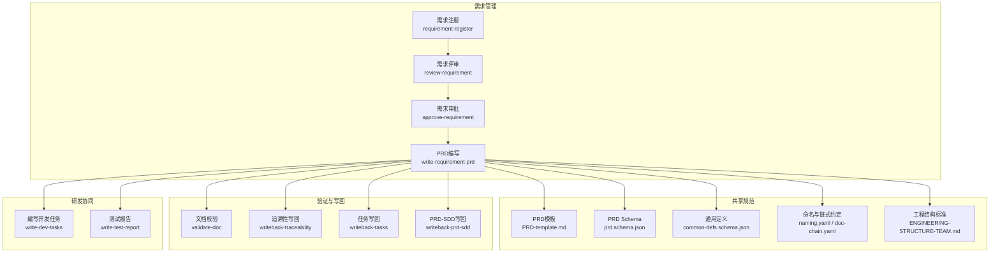
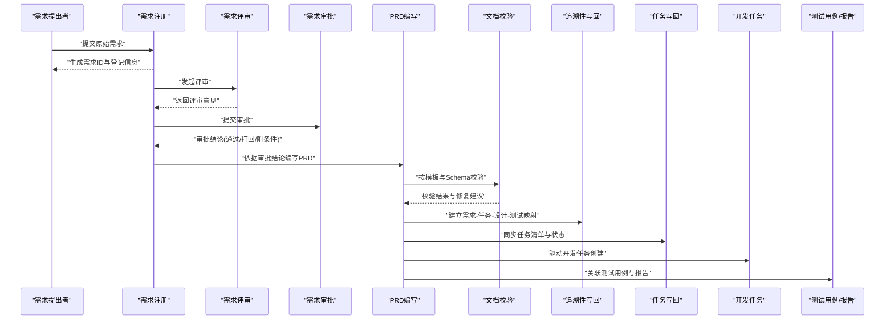
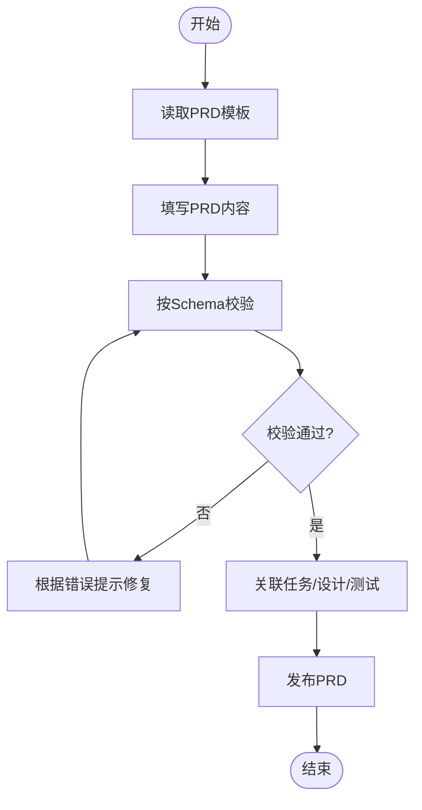
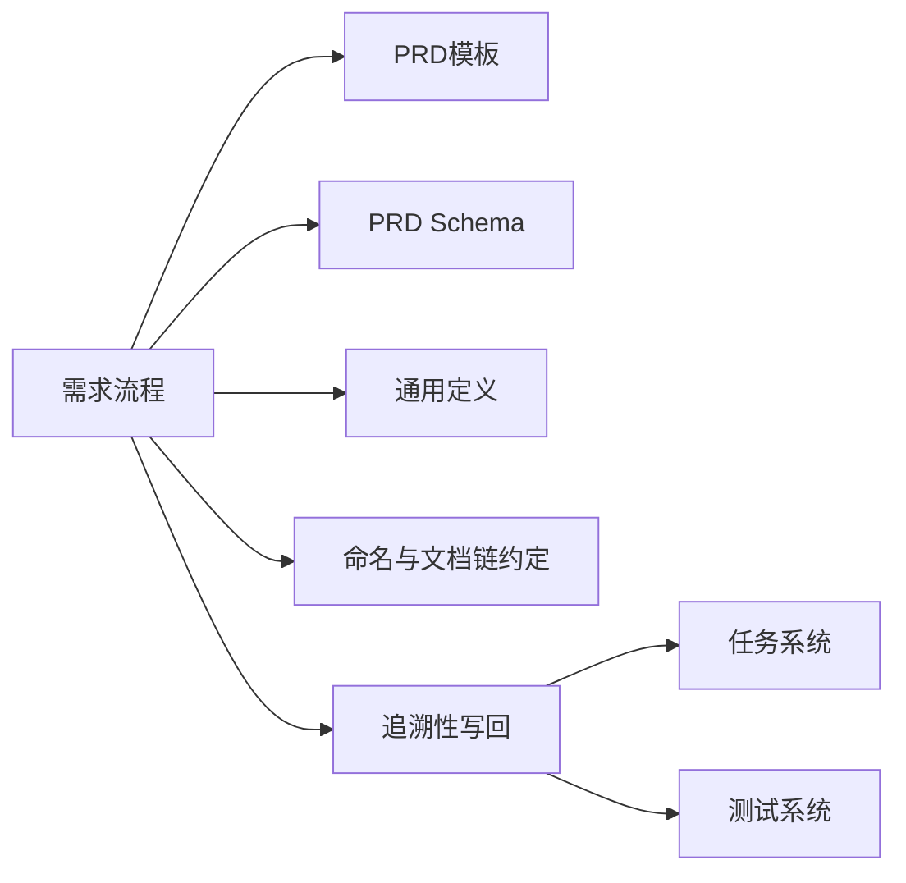

# 需求管理技能

<cite>
**本文引用的文件**   
- [requirement-register/SKILL.md](file://skills/requirement/requirement-register/SKILL.md)
- [review-requirement/SKILL.md](file://skills/requirement/review-requirement/SKILL.md)
- [approve-requirement/SKILL.md](file://skills/requirement/approve-requirement/SKILL.md)
- [write-requirement-prd/SKILL.md](file://skills/requirement/write-requirement-prd/SKILL.md)
- [PRD-template.md](file://skills/shared/engineering-docs/templates/PRD-template.md)
- [prd.schema.json](file://skills/shared/engineering-docs/schemas/prd.schema.json)
- [common-defs.schema.json](file://skills/shared/engineering-docs/schemas/common-defs.schema.json)
- [validate-doc/SKILL.md](file://skills/shared/validate-doc/SKILL.md)
- [change-impact-analysis/SKILL.md](file://skills/review/change-impact-analysis/SKILL.md)
- [writeback-traceability/SKILL.md](file://skills/writeback/writeback-traceability/SKILL.md)
- [writeback-tasks/SKILL.md](file://skills/writeback/writeback-tasks/SKILL.md)
- [writeback-prd-sdd/SKILL.md](file://skills/writeback/writeback-prd-sdd/SKILL.md)
- [write-dev-tasks/SKILL.md](file://skills/develop/write-dev-tasks/SKILL.md)
- [write-test-report/SKILL.md](file://skills/develop/write-test-report/SKILL.md)
- [task.schema.json](file://skills/shared/engineering-docs/schemas/task.schema.json)
- [sdd.schema.json](file://skills/shared/engineering-docs/schemas/sdd.schema.json)
- [release.schema.json](file://skills/shared/engineering-docs/schemas/release.schema.json)
- [plan.schema.json](file://skills/shared/engineering-docs/schemas/plan.schema.json)
- [module.schema.json](file://skills/shared/engineering-docs/schemas/module.schema.json)
- [form.schema.json](file://skills/shared/engineering-docs/schemas/form.schema.json)
- [doc-chain.yaml](file://skills/shared/engineering-docs/conventions/doc-chain.yaml)
- [naming.yaml](file://skills/shared/engineering-docs/conventions/naming.yaml)
- [ENGINEERING-STRUCTURE-TEAM.md](file://skills/shared/engineering-docs/standards/ENGINEERING-STRUCTURE-TEAM.md)
- [pipeline-templates/requirement-authoring.pipeline.json](file://pipeline-templates/requirement-authoring.pipeline.json)
</cite>

## 目录
1. [引言](#引言)
2. [项目结构](#项目结构)
3. [核心组件](#核心组件)
4. [架构总览](#架构总览)
5. [详细组件分析](#详细组件分析)
6. [依赖分析](#依赖分析)
7. [性能考虑](#性能考虑)
8. [故障排查指南](#故障排查指南)
9. [结论](#结论)
10. [附录](#附录)

## 引言
本文件为“需求管理技能”模块的需求工程文档，覆盖从需求注册、评审、审批到PRD编写的完整流程；并给出需求规格定义、变更管理与追溯性维护的方法；提供模板定制、评审标准配置与审批工作流设置的实用指南；包含质量评估指标、冲突解决策略与跨团队协调机制；解释与开发任务及测试用例的关联管理。

## 项目结构
需求管理相关能力分布在以下位置：
- 技能定义：skills/requirement/*（注册、评审、审批、PRD编写）
- 共享规范与模板：skills/shared/engineering-docs/{schemas, templates, conventions, standards}
- 验证工具：skills/shared/validate-doc/SKILL.md
- 变更影响分析与追溯：skills/review/change-impact-analysis/SKILL.md、skills/writeback/writeback-traceability/SKILL.md
- 与开发与测试的联动：skills/develop/write-dev-tasks/SKILL.md、skills/develop/write-test-report/SKILL.md、skills/writeback/writeback-tasks/SKILL.md、skills/writeback/writeback-prd-sdd/SKILL.md
- 流水线编排：pipeline-templates/requirement-authoring.pipeline.json

图表来源
- [requirement-register/SKILL.md](file://skills/requirement/requirement-register/SKILL.md)
- [review-requirement/SKILL.md](file://skills/requirement/review-requirement/SKILL.md)
- [approve-requirement/SKILL.md](file://skills/requirement/approve-requirement/SKILL.md)
- [write-requirement-prd/SKILL.md](file://skills/requirement/write-requirement-prd/SKILL.md)
- [PRD-template.md](file://skills/shared/engineering-docs/templates/PRD-template.md)
- [prd.schema.json](file://skills/shared/engineering-docs/schemas/prd.schema.json)
- [common-defs.schema.json](file://skills/shared/engineering-docs/schemas/common-defs.schema.json)
- [doc-chain.yaml](file://skills/shared/engineering-docs/conventions/doc-chain.yaml)
- [naming.yaml](file://skills/shared/engineering-docs/conventions/naming.yaml)
- [ENGINEERING-STRUCTURE-TEAM.md](file://skills/shared/engineering-docs/standards/ENGINEERING-STRUCTURE-TEAM.md)
- [validate-doc/SKILL.md](file://skills/shared/validate-doc/SKILL.md)
- [writeback-traceability/SKILL.md](file://skills/writeback/writeback-traceability/SKILL.md)
- [writeback-tasks/SKILL.md](file://skills/writeback/writeback-tasks/SKILL.md)
- [writeback-prd-sdd/SKILL.md](file://skills/writeback/writeback-prd-sdd/SKILL.md)
- [write-dev-tasks/SKILL.md](file://skills/develop/write-dev-tasks/SKILL.md)
- [write-test-report/SKILL.md](file://skills/develop/write-test-report/SKILL.md)

章节来源
- [requirement-register/SKILL.md](file://skills/requirement/requirement-register/SKILL.md)
- [review-requirement/SKILL.md](file://skills/requirement/review-requirement/SKILL.md)
- [approve-requirement/SKILL.md](file://skills/requirement/approve-requirement/SKILL.md)
- [write-requirement-prd/SKILL.md](file://skills/requirement/write-requirement-prd/SKILL.md)
- [PRD-template.md](file://skills/shared/engineering-docs/templates/PRD-template.md)
- [prd.schema.json](file://skills/shared/engineering-docs/schemas/prd.schema.json)
- [common-defs.schema.json](file://skills/shared/engineering-docs/schemas/common-defs.schema.json)
- [doc-chain.yaml](file://skills/shared/engineering-docs/conventions/doc-chain.yaml)
- [naming.yaml](file://skills/shared/engineering-docs/conventions/naming.yaml)
- [ENGINEERING-STRUCTURE-TEAM.md](file://skills/shared/engineering-docs/standards/ENGINEERING-STRUCTURE-TEAM.md)
- [validate-doc/SKILL.md](file://skills/shared/validate-doc/SKILL.md)
- [writeback-traceability/SKILL.md](file://skills/writeback/writeback-traceability/SKILL.md)
- [writeback-tasks/SKILL.md](file://skills/writeback/writeback-tasks/SKILL.md)
- [writeback-prd-sdd/SKILL.md](file://skills/writeback/writeback-prd-sdd/SKILL.md)
- [write-dev-tasks/SKILL.md](file://skills/develop/write-dev-tasks/SKILL.md)
- [write-test-report/SKILL.md](file://skills/develop/write-test-report/SKILL.md)

## 核心组件
- 需求注册：负责收集原始需求、建立唯一标识、记录背景与目标、初步范围与约束，形成可进入评审的候选需求。
- 需求评审：对需求的完整性、可行性、风险与价值进行结构化审查，输出评审意见与修订建议。
- 需求审批：基于评审结果与治理规则进行决策，决定通过、打回或附加条件通过。
- PRD编写：将已批准需求转化为产品需求文档，遵循统一模板与Schema，确保可执行性与可追溯性。

章节来源
- [requirement-register/SKILL.md](file://skills/requirement/requirement-register/SKILL.md)
- [review-requirement/SKILL.md](file://skills/requirement/review-requirement/SKILL.md)
- [approve-requirement/SKILL.md](file://skills/requirement/approve-requirement/SKILL.md)
- [write-requirement-prd/SKILL.md](file://skills/requirement/write-requirement-prd/SKILL.md)

## 架构总览
下图展示需求从注册到PRD落地的端到端流程，以及与其他工程工件（任务、设计、测试、发布）的关联关系。

图表来源
- [requirement-register/SKILL.md](file://skills/requirement/requirement-register/SKILL.md)
- [review-requirement/SKILL.md](file://skills/requirement/review-requirement/SKILL.md)
- [approve-requirement/SKILL.md](file://skills/requirement/approve-requirement/SKILL.md)
- [write-requirement-prd/SKILL.md](file://skills/requirement/write-requirement-prd/SKILL.md)
- [validate-doc/SKILL.md](file://skills/shared/validate-doc/SKILL.md)
- [writeback-traceability/SKILL.md](file://skills/writeback/writeback-traceability/SKILL.md)
- [writeback-tasks/SKILL.md](file://skills/writeback/writeback-tasks/SKILL.md)
- [write-dev-tasks/SKILL.md](file://skills/develop/write-dev-tasks/SKILL.md)
- [write-test-report/SKILL.md](file://skills/develop/write-test-report/SKILL.md)

## 详细组件分析

### 需求注册
- 职责与输入
  - 收集业务背景、目标用户、问题陈述、期望收益、边界与约束。
  - 生成唯一需求标识，建立初始元数据（版本、优先级、标签）。
- 处理逻辑
  - 标准化字段填充，检查必填项与格式。
  - 生成可被后续评审使用的结构化草稿。
- 输出
  - 需求登记条目、待评审清单、变更记录入口。
- 关键要点
  - 明确范围与验收口径，避免模糊描述。
  - 保留原始来源与上下文，便于追溯。

章节来源
- [requirement-register/SKILL.md](file://skills/requirement/requirement-register/SKILL.md)

### 需求评审
- 职责与输入
  - 输入为注册后的需求草稿；评审维度包括价值、可行性、风险、依赖、合规与成本。
- 处理逻辑
  - 组织评审会议或异步评审，收集多方意见。
  - 形成结构化评审结论与修订建议，必要时触发补充调研。
- 输出
  - 评审纪要、修订清单、是否进入审批的建议。
- 关键要点
  - 评审标准应可量化（如覆盖率、风险等级阈值）。
  - 对争议点记录决策依据，便于审计。

章节来源
- [review-requirement/SKILL.md](file://skills/requirement/review-requirement/SKILL.md)

### 需求审批
- 职责与输入
  - 输入为评审结论与修订后内容；审批人依据治理规则做最终决策。
- 处理逻辑
  - 核对前置条件（评审通过、必要附件齐全、风险可控）。
  - 做出通过、打回或附条件通过的决策，并记录原因。
- 输出
  - 审批结论、生效时间、后续行动项。
- 关键要点
  - 审批规则应与组织治理一致，支持分级授权。
  - 附条件通过需明确条件与验收方式。

章节来源
- [approve-requirement/SKILL.md](file://skills/requirement/approve-requirement/SKILL.md)

### PRD编写
- 职责与输入
  - 输入为已批准的需求；输出为符合模板与Schema的PRD。
- 处理逻辑
  - 按模板组织章节：背景、目标、范围、用户故事、功能与非功能需求、验收标准、依赖与约束、风险与缓解、里程碑与度量等。
  - 使用Schema进行一致性校验，确保关键字段完整与类型正确。
- 输出
  - 可执行的PRD文档、校验报告、与任务/设计/测试的关联映射。
- 关键要点
  - 验收标准必须可测、可追踪。
  - 非功能需求需量化（性能、可用性、安全等）。

章节来源
- [write-requirement-prd/SKILL.md](file://skills/requirement/write-requirement-prd/SKILL.md)
- [PRD-template.md](file://skills/shared/engineering-docs/templates/PRD-template.md)
- [prd.schema.json](file://skills/shared/engineering-docs/schemas/prd.schema.json)
- [common-defs.schema.json](file://skills/shared/engineering-docs/schemas/common-defs.schema.json)

#### PRD结构与校验流程图

图表来源
- [PRD-template.md](file://skills/shared/engineering-docs/templates/PRD-template.md)
- [prd.schema.json](file://skills/shared/engineering-docs/schemas/prd.schema.json)
- [validate-doc/SKILL.md](file://skills/shared/validate-doc/SKILL.md)

### 需求规格定义
- 方法
  - 使用统一模板与Schema定义需求规格，保证字段完备与语义一致。
  - 采用通用定义（common-defs）统一枚举、单位、度量与术语。
- 实践
  - 将业务目标拆解为可验证的用户故事与验收标准。
  - 明确非功能指标与验收门槛。

章节来源
- [PRD-template.md](file://skills/shared/engineering-docs/templates/PRD-template.md)
- [prd.schema.json](file://skills/shared/engineering-docs/schemas/prd.schema.json)
- [common-defs.schema.json](file://skills/shared/engineering-docs/schemas/common-defs.schema.json)

### 需求变更管理
- 流程
  - 变更申请→影响分析→评审→审批→更新PRD与关联工件→通知干系人。
- 影响分析
  - 评估范围、进度、成本、风险与依赖变化，识别受影响的任务与设计。
- 控制
  - 所有变更需留痕，保持版本化与可审计。

章节来源
- [change-impact-analysis/SKILL.md](file://skills/review/change-impact-analysis/SKILL.md)
- [writeback-traceability/SKILL.md](file://skills/writeback/writeback-traceability/SKILL.md)

### 需求追溯性维护
- 目标
  - 建立“需求↔任务↔设计↔测试↔发布”的双向追溯链。
- 实现
  - 在PRD中显式引用任务、设计与测试用例ID。
  - 使用写回技能自动同步状态与链接，减少手工维护成本。
- 监控
  - 定期运行追溯性检查，发现断链或缺失及时修复。

章节来源
- [writeback-traceability/SKILL.md](file://skills/writeback/writeback-traceability/SKILL.md)
- [writeback-tasks/SKILL.md](file://skills/writeback/writeback-tasks/SKILL.md)
- [writeback-prd-sdd/SKILL.md](file://skills/writeback/writeback-prd-sdd/SKILL.md)

### 与开发任务和测试用例的关联管理
- 任务分解
  - 将PRD中的功能点拆分为可交付的开发任务，明确负责人、预估与依赖。
- 测试关联
  - 为每个验收标准关联测试用例，并在测试报告中回填结果与缺陷。
- 写回机制
  - 通过写回技能将任务与测试结果同步至PRD与追溯链。

章节来源
- [write-dev-tasks/SKILL.md](file://skills/develop/write-dev-tasks/SKILL.md)
- [write-test-report/SKILL.md](file://skills/develop/write-test-report/SKILL.md)
- [writeback-tasks/SKILL.md](file://skills/writeback/writeback-tasks/SKILL.md)

## 依赖分析
- 内部依赖
  - 需求流程依赖共享模板与Schema，确保文档一致性与机器可读。
  - 与写回技能强耦合，以自动化维护追溯链与工件一致性。
- 外部依赖
  - 与开发任务系统、测试管理系统通过写回接口集成。
- 约定与标准
  - 命名规范与文档链约定保障跨团队协作效率。

图表来源
- [PRD-template.md](file://skills/shared/engineering-docs/templates/PRD-template.md)
- [prd.schema.json](file://skills/shared/engineering-docs/schemas/prd.schema.json)
- [common-defs.schema.json](file://skills/shared/engineering-docs/schemas/common-defs.schema.json)
- [naming.yaml](file://skills/shared/engineering-docs/conventions/naming.yaml)
- [doc-chain.yaml](file://skills/shared/engineering-docs/conventions/doc-chain.yaml)
- [writeback-traceability/SKILL.md](file://skills/writeback/writeback-traceability/SKILL.md)
- [writeback-tasks/SKILL.md](file://skills/writeback/writeback-tasks/SKILL.md)

章节来源
- [naming.yaml](file://skills/shared/engineering-docs/conventions/naming.yaml)
- [doc-chain.yaml](file://skills/shared/engineering-docs/conventions/doc-chain.yaml)
- [ENGINEERING-STRUCTURE-TEAM.md](file://skills/shared/engineering-docs/standards/ENGINEERING-STRUCTURE-TEAM.md)

## 性能考虑
- 文档生成与校验
  - 优先复用模板与Schema，减少重复劳动；批量校验时并行处理以提升吞吐。
- 写回与同步
  - 增量写回优于全量重写；对大工件分块写入，降低失败重试成本。
- 追溯链查询
  - 建立索引（按ID、标签、阶段）加速检索；定期清理无效链接。

[本节为通用指导，不直接分析具体文件]

## 故障排查指南
- 文档校验失败
  - 定位Schema错误提示，对照模板补齐缺失字段或修正类型。
  - 使用验证技能获取详细诊断信息。
- 追溯链断裂
  - 检查PRD中任务/设计/测试ID是否存在且有效。
  - 重新运行写回技能修复断链。
- 审批卡点
  - 确认前置条件（评审通过、附件齐全）是否满足。
  - 查看审批日志与打回原因，针对性补正。

章节来源
- [validate-doc/SKILL.md](file://skills/shared/validate-doc/SKILL.md)
- [writeback-traceability/SKILL.md](file://skills/writeback/writeback-traceability/SKILL.md)
- [approve-requirement/SKILL.md](file://skills/requirement/approve-requirement/SKILL.md)

## 结论
通过标准化的注册-评审-审批-PRD流程，配合统一的模板与Schema、严格的验证与写回机制，可实现高质量、可追溯、可执行的需求管理。结合变更影响分析与跨团队协作约定，能有效降低沟通成本与返工率，提升整体交付效率与质量。

[本节为总结性内容，不直接分析具体文件]

## 附录

### 实用指南一：需求模板定制
- 步骤
  - 基于现有PRD模板扩展章节或字段。
  - 同步更新Schema以约束新增字段。
  - 在验证环节加入自定义规则。
- 注意事项
  - 保持向后兼容，旧文档仍可校验通过。
  - 提供迁移脚本或说明，平滑过渡。

章节来源
- [PRD-template.md](file://skills/shared/engineering-docs/templates/PRD-template.md)
- [prd.schema.json](file://skills/shared/engineering-docs/schemas/prd.schema.json)
- [validate-doc/SKILL.md](file://skills/shared/validate-doc/SKILL.md)

### 实用指南二：评审标准配置
- 建议维度
  - 价值度、技术可行性、风险等级、依赖复杂度、合规性、成本与周期。
- 评分与阈值
  - 为各维度设定权重与阈值，达到阈值方可进入审批。
- 记录与审计
  - 保存评分明细与决策依据，支持复盘与改进。

章节来源
- [review-requirement/SKILL.md](file://skills/requirement/review-requirement/SKILL.md)

### 实用指南三：审批工作流设置
- 角色与权限
  - 明确审批人、会签人与否决权规则。
- 条件分支
  - 高风险或高成本需求升级审批层级。
- 自动化
  - 将审批结论自动写回需求登记与PRD元数据。

章节来源
- [approve-requirement/SKILL.md](file://skills/requirement/approve-requirement/SKILL.md)

### 实用指南四：需求质量评估指标
- 建议指标
  - 完整性（必填字段覆盖率）、清晰度（歧义比例）、可测性（验收标准可测比例）、一致性（与模板/Schema对齐度）、可追溯性（链接完整率）。
- 采集与反馈
  - 在验证与写回环节自动计算指标，生成质量报告。

章节来源
- [validate-doc/SKILL.md](file://skills/shared/validate-doc/SKILL.md)
- [writeback-traceability/SKILL.md](file://skills/writeback/writeback-traceability/SKILL.md)

### 实用指南五：需求冲突解决策略
- 原则
  - 以业务目标与用户价值为先，数据与事实为依据。
- 机制
  - 建立冲突仲裁小组，记录决策与理由。
  - 对冲突点进行影响分析，评估替代方案。

章节来源
- [change-impact-analysis/SKILL.md](file://skills/review/change-impact-analysis/SKILL.md)

### 实用指南六：跨团队需求协调机制
- 约定
  - 使用统一命名与文档链约定，确保跨团队可读与可联查。
- 协作
  - 明确接口契约与依赖边界，提前暴露风险。
- 同步
  - 通过写回与看板同步状态，减少信息差。

章节来源
- [naming.yaml](file://skills/shared/engineering-docs/conventions/naming.yaml)
- [doc-chain.yaml](file://skills/shared/engineering-docs/conventions/doc-chain.yaml)
- [ENGINEERING-STRUCTURE-TEAM.md](file://skills/shared/engineering-docs/standards/ENGINEERING-STRUCTURE-TEAM.md)

### 实用指南七：与开发任务和测试用例的关联管理
- 任务拆分
  - 将PRD功能点映射为任务，明确验收与依赖。
- 测试关联
  - 为每条验收标准绑定测试用例，闭环验证。
- 写回同步
  - 自动将任务与测试结果同步至PRD与追溯链。

章节来源
- [write-dev-tasks/SKILL.md](file://skills/develop/write-dev-tasks/SKILL.md)
- [write-test-report/SKILL.md](file://skills/develop/write-test-report/SKILL.md)
- [writeback-tasks/SKILL.md](file://skills/writeback/writeback-tasks/SKILL.md)

### 参考工件与模型
- 任务模型
  - 字段与约束见任务Schema。
- 系统设计文档（SDD）
  - 字段与约束见SDD Schema。
- 发布与计划
  - 发布与计划模型分别由对应Schema定义。
- 模块与表单
  - 模块与表单模型由相应Schema定义，支撑更细粒度的工程工件管理。

章节来源
- [task.schema.json](file://skills/shared/engineering-docs/schemas/task.schema.json)
- [sdd.schema.json](file://skills/shared/engineering-docs/schemas/sdd.schema.json)
- [release.schema.json](file://skills/shared/engineering-docs/schemas/release.schema.json)
- [plan.schema.json](file://skills/shared/engineering-docs/schemas/plan.schema.json)
- [module.schema.json](file://skills/shared/engineering-docs/schemas/module.schema.json)
- [form.schema.json](file://skills/shared/engineering-docs/schemas/form.schema.json)

### 流水线编排参考
- 需求撰写流水线
  - 用于串联注册、评审、审批与PRD生成的端到端流程，便于自动化与可视化。

章节来源
- [pipeline-templates/requirement-authoring.pipeline.json](file://pipeline-templates/requirement-authoring.pipeline.json)