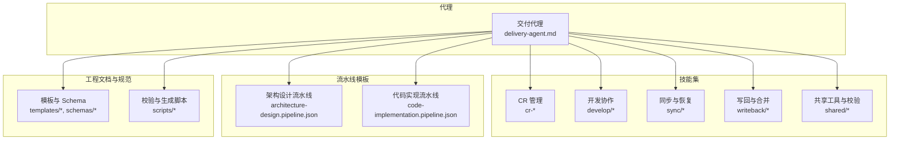
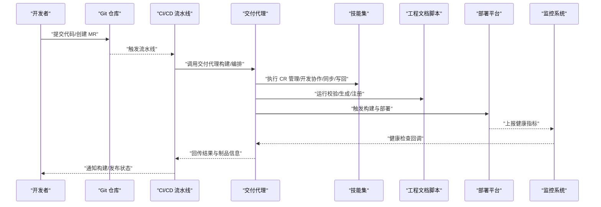
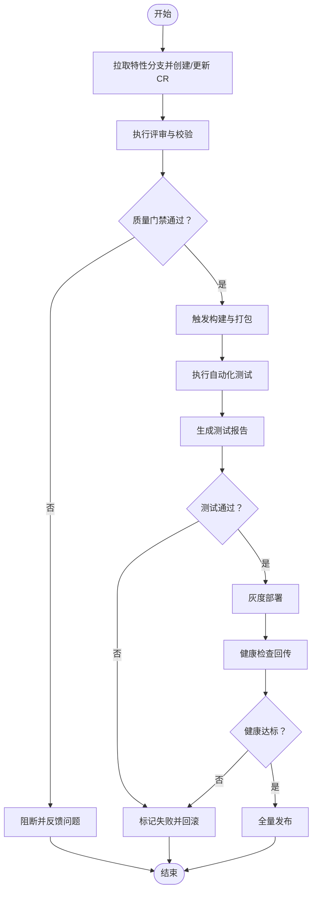
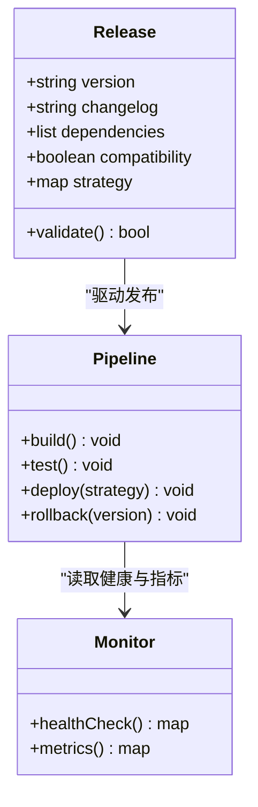
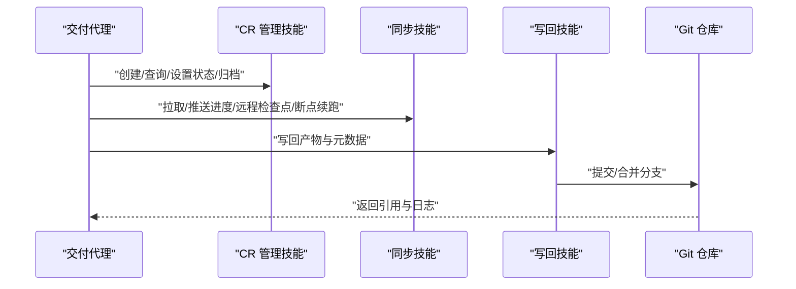
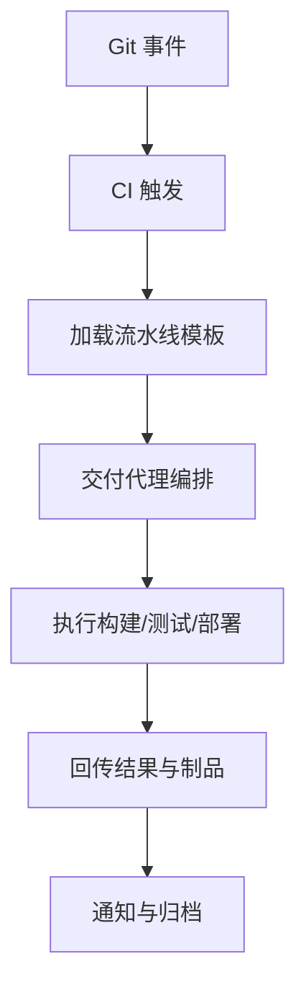
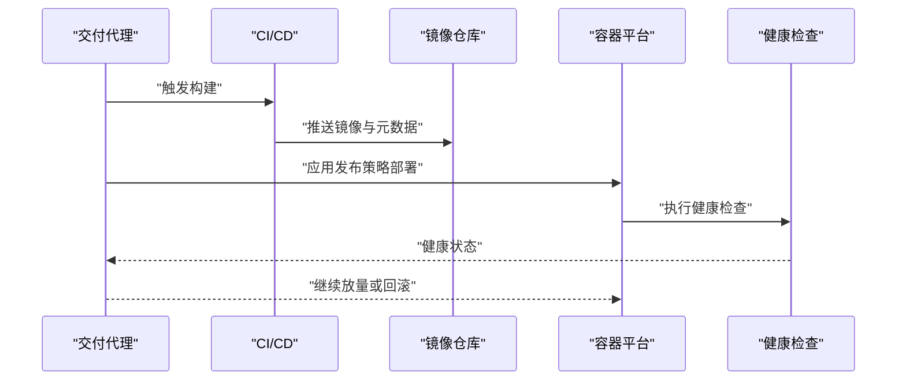
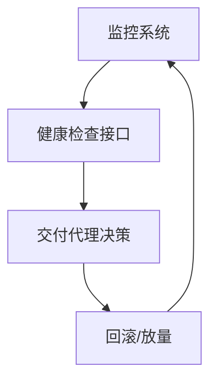
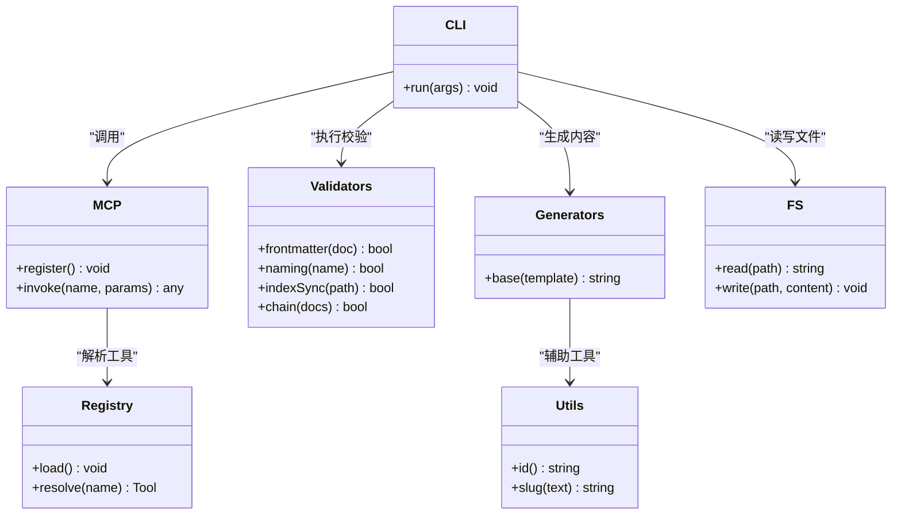
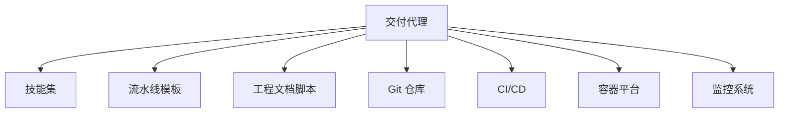

# 交付代理

<cite>
**本文引用的文件**   
- [agents/delivery-agent.md](file://agents/delivery-agent.md)
- [pipeline-templates/README.md](file://pipeline-templates/README.md)
- [pipeline-templates/architecture-design.pipeline.json](file://pipeline-templates/architecture-design.pipeline.json)
- [pipeline-templates/code-implementation.pipeline.json](file://pipeline-templates/code-implementation.pipeline.json)
- [skills/shared/engineering-docs/schemas/release.schema.json](file://skills/shared/engineering-docs/schemas/release.schema.json)
- [skills/shared/engineering-docs/templates/RELEASE-template.md](file://skills/shared/engineering-docs/templates/RELEASE-template.md)
- [skills/writeback/merge-feature-branch/SKILL.md](file://skills/writeback/merge-feature-branch/SKILL.md)
- [skills/cr/cr-status-set/SKILL.md](file://skills/cr/cr-status-set/SKILL.md)
- [skills/cr/cr-show/SKILL.md](file://skills/cr/cr-show/SKILL.md)
- [skills/cr/cr-archive/SKILL.md](file://skills/cr/cr-archive/SKILL.md)
- [skills/cr/cr-inbox/SKILL.md](file://skills/cr/cr-inbox/SKILL.md)
- [skills/cr/cr-query/SKILL.md](file://skills/cr/cr-query/SKILL.md)
- [skills/cr/cr-review-record/SKILL.md](file://skills/cr/cr-review-record/SKILL.md)
- [skills/sync/pull-progress/SKILL.md](file://skills/sync/pull-progress/SKILL.md)
- [skills/sync/push-progress/SKILL.md](file://skills/sync/push-progress/SKILL.md)
- [skills/sync/resume-from-remote/SKILL.md](file://skills/sync/resume-from-remote/SKILL.md)
- [skills/sync/handover-cr/SKILL.md](file://skills/sync/handover-cr/SKILL.md)
- [skills/sync/list-remote-checkpoints/SKILL.md](file://skills/sync/list-remote-checkpoints/SKILL.md)
- [skills/develop/implement-code/SKILL.md](file://skills/develop/implement-code/SKILL.md)
- [skills/develop/review-code/SKILL.md](file://skills/develop/review-code/SKILL.md)
- [skills/develop/approve-code/SKILL.md](file://skills/develop/approve-code/SKILL.md)
- [skills/develop/approve-dev-start/SKILL.md](file://skills/develop/approve-dev-start/SKILL.md)
- [skills/develop/write-test-report/SKILL.md](file://skills/develop/write-test-report/SKILL.md)
- [skills/develop/write-dev-plan/SKILL.md](file://skills/develop/write-dev-plan/SKILL.md)
- [skills/develop/write-dev-tasks/SKILL.md](file://skills/develop/write-dev-tasks/SKILL.md)
- [skills/develop/write-tech-design/SKILL.md](file://skills/develop/write-tech-design/SKILL.md)
- [skills/develop/review-tech-design/SKILL.md](file://skills/develop/review-tech-design/SKILL.md)
- [skills/shared/validate-doc/SKILL.md](file://skills/shared/validate-doc/SKILL.md)
- [skills/shared/engineering-docs/scripts/src/cli.ts](file://skills/shared/engineering-docs/scripts/src/cli.ts)
- [skills/shared/engineering-docs/scripts/src/mcp.ts](file://skills/shared/engineering-docs/scripts/src/mcp.ts)
- [skills/shared/engineering-docs/scripts/src/registry.ts](file://skills/shared/engineering-docs/scripts/src/registry.ts)
- [skills/shared/engineering-docs/scripts/src/generators/base.ts](file://skills/shared/engineering-docs/scripts/src/generators/base.ts)
- [skills/shared/engineering-docs/scripts/src/utils/fs.ts](file://skills/shared/engineering-docs/scripts/src/utils/fs.ts)
- [skills/shared/engineering-docs/scripts/src/utils/id.ts](file://skills/shared/engineering-docs/scripts/src/utils/id.ts)
- [skills/shared/engineering-docs/scripts/src/utils/slug.ts](file://skills/shared/engineering-docs/scripts/src/utils/slug.ts)
- [skills/shared/engineering-docs/scripts/src/validators/index-sync.ts](file://skills/shared/engineering-docs/scripts/src/validators/index-sync.ts)
- [skills/shared/engineering-docs/scripts/src/validators/frontmatter.ts](file://skills/shared/engineering-docs/scripts/src/validators/frontmatter.ts)
- [skills/shared/engineering-docs/scripts/src/validators/naming.ts](file://skills/shared/engineering-docs/scripts/src/validators/naming.ts)
- [skills/shared/engineering-docs/scripts/src/validators/chain.ts](file://skills/shared/engineering-docs/scripts/src/validators/chain.ts)
</cite>

## 目录
1. [简介](#简介)
2. [项目结构](#项目结构)
3. [核心组件](#核心组件)
4. [架构总览](#架构总览)
5. [详细组件分析](#详细组件分析)
6. [依赖关系分析](#依赖关系分析)
7. [性能与稳定性考虑](#性能与稳定性考虑)
8. [故障排查指南](#故障排查指南)
9. [结论](#结论)
10. [附录：API 参考与集成示例](#附录api-参考与集成示例)

## 简介
本文件面向“交付代理”的使用者与集成方，系统阐述其在项目交付管理、版本发布协调、部署自动化与质量门禁执行方面的职责与工作方式。文档同时覆盖与 Git 仓库、CI/CD 流水线、容器平台与监控系统的对接方式，并提供完整的 API 参考（构建触发、环境部署、健康检查回传等），以及从代码合并验证到灰度发布与回滚的端到端流程说明与最佳实践。

## 项目结构
仓库采用“代理 + 技能 + 流水线模板 + 工程文档规范”的分层组织方式：
- agents：定义各角色型代理的职责与能力边界，其中 delivery-agent.md 为交付代理的主描述。
- skills：按领域划分的可复用技能集合，涵盖需求、设计、开发、评审、同步、写回、共享工具等。
- pipeline-templates：CI/CD 流水线模板，用于编排不同阶段的自动化任务。
- shared/engineering-docs：工程文档规范、模板、Schema 校验与脚本工具，支撑交付过程的可追溯性与一致性。

图表来源
- [agents/delivery-agent.md](file://agents/delivery-agent.md)
- [pipeline-templates/README.md](file://pipeline-templates/README.md)
- [pipeline-templates/architecture-design.pipeline.json](file://pipeline-templates/architecture-design.pipeline.json)
- [pipeline-templates/code-implementation.pipeline.json](file://pipeline-templates/code-implementation.pipeline.json)
- [skills/shared/engineering-docs/templates/RELEASE-template.md](file://skills/shared/engineering-docs/templates/RELEASE-template.md)
- [skills/shared/engineering-docs/schemas/release.schema.json](file://skills/shared/engineering-docs/schemas/release.schema.json)
- [skills/shared/engineering-docs/scripts/src/cli.ts](file://skills/shared/engineering-docs/scripts/src/cli.ts)
- [skills/shared/engineering-docs/scripts/src/mcp.ts](file://skills/shared/engineering-docs/scripts/src/mcp.ts)
- [skills/shared/engineering-docs/scripts/src/registry.ts](file://skills/shared/engineering-docs/scripts/src/registry.ts)

章节来源
- [agents/delivery-agent.md](file://agents/delivery-agent.md)
- [pipeline-templates/README.md](file://pipeline-templates/README.md)

## 核心组件
- 交付代理主职责
  - 项目交付管理：统一编排需求、设计、开发、测试、发布与运维各环节，确保交付物完整、可追溯。
  - 版本发布协调：基于发布模板与 Schema 约束，驱动版本基线、变更清单与发布说明的生成与校验。
  - 部署自动化：通过流水线模板与技能组合，完成构建、镜像打包、部署与健康检查回传。
  - 质量门禁执行：在关键节点引入评审、校验与测试报告，未达标则阻断后续流程。
- 关键技能域
  - CR 管理：创建、查询、状态设置、归档与收件箱处理，保障变更可控。
  - 开发协作：技术设计、任务拆解、实现与评审、测试报告输出。
  - 同步与恢复：拉取/推送进度、远程断点续跑、跨代理交接。
  - 写回与合并：将产物与元数据写回仓库，合并特性分支至主干。
  - 共享工具：文档校验、ID/Slug 生成、FS 工具、MCP 注册与 CLI 入口。

章节来源
- [agents/delivery-agent.md](file://agents/delivery-agent.md)
- [skills/cr/cr-status-set/SKILL.md](file://skills/cr/cr-status-set/SKILL.md)
- [skills/cr/cr-show/SKILL.md](file://skills/cr/cr-show/SKILL.md)
- [skills/cr/cr-archive/SKILL.md](file://skills/cr/cr-archive/SKILL.md)
- [skills/cr/cr-inbox/SKILL.md](file://skills/cr/cr-inbox/SKILL.md)
- [skills/cr/cr-query/SKILL.md](file://skills/cr/cr-query/SKILL.md)
- [skills/cr/cr-review-record/SKILL.md](file://skills/cr/cr-review-record/SKILL.md)
- [skills/develop/implement-code/SKILL.md](file://skills/develop/implement-code/SKILL.md)
- [skills/develop/review-code/SKILL.md](file://skills/develop/review-code/SKILL.md)
- [skills/develop/approve-code/SKILL.md](file://skills/develop/approve-code/SKILL.md)
- [skills/develop/approve-dev-start/SKILL.md](file://skills/develop/approve-dev-start/SKILL.md)
- [skills/develop/write-test-report/SKILL.md](file://skills/develop/write-test-report/SKILL.md)
- [skills/develop/write-dev-plan/SKILL.md](file://skills/develop/write-dev-plan/SKILL.md)
- [skills/develop/write-dev-tasks/SKILL.md](file://skills/develop/write-dev-tasks/SKILL.md)
- [skills/develop/write-tech-design/SKILL.md](file://skills/develop/write-tech-design/SKILL.md)
- [skills/develop/review-tech-design/SKILL.md](file://skills/develop/review-tech-design/SKILL.md)
- [skills/sync/pull-progress/SKILL.md](file://skills/sync/pull-progress/SKILL.md)
- [skills/sync/push-progress/SKILL.md](file://skills/sync/push-progress/SKILL.md)
- [skills/sync/resume-from-remote/SKILL.md](file://skills/sync/resume-from-remote/SKILL.md)
- [skills/sync/handover-cr/SKILL.md](file://skills/sync/handover-cr/SKILL.md)
- [skills/sync/list-remote-checkpoints/SKILL.md](file://skills/sync/list-remote-checkpoints/SKILL.md)
- [skills/writeback/merge-feature-branch/SKILL.md](file://skills/writeback/merge-feature-branch/SKILL.md)
- [skills/shared/validate-doc/SKILL.md](file://skills/shared/validate-doc/SKILL.md)
- [skills/shared/engineering-docs/scripts/src/cli.ts](file://skills/shared/engineering-docs/scripts/src/cli.ts)
- [skills/shared/engineering-docs/scripts/src/mcp.ts](file://skills/shared/engineering-docs/scripts/src/mcp.ts)
- [skills/shared/engineering-docs/scripts/src/registry.ts](file://skills/shared/engineering-docs/scripts/src/registry.ts)
- [skills/shared/engineering-docs/scripts/src/generators/base.ts](file://skills/shared/engineering-docs/scripts/src/generators/base.ts)
- [skills/shared/engineering-docs/scripts/src/utils/fs.ts](file://skills/shared/engineering-docs/scripts/src/utils/fs.ts)
- [skills/shared/engineering-docs/scripts/src/utils/id.ts](file://skills/shared/engineering-docs/scripts/src/utils/id.ts)
- [skills/shared/engineering-docs/scripts/src/utils/slug.ts](file://skills/shared/engineering-docs/scripts/src/utils/slug.ts)
- [skills/shared/engineering-docs/scripts/src/validators/index-sync.ts](file://skills/shared/engineering-docs/scripts/src/validators/index-sync.ts)
- [skills/shared/engineering-docs/scripts/src/validators/frontmatter.ts](file://skills/shared/engineering-docs/scripts/src/validators/frontmatter.ts)
- [skills/shared/engineering-docs/scripts/src/validators/naming.ts](file://skills/shared/engineering-docs/scripts/src/validators/naming.ts)
- [skills/shared/engineering-docs/scripts/src/validators/chain.ts](file://skills/shared/engineering-docs/scripts/src/validators/chain.ts)

## 架构总览
交付代理以“技能”为原子能力，以“流水线模板”为编排载体，以“工程文档规范与脚本”为质量与一致性保障，形成从代码提交到生产发布的闭环。

图表来源
- [pipeline-templates/README.md](file://pipeline-templates/README.md)
- [pipeline-templates/architecture-design.pipeline.json](file://pipeline-templates/architecture-design.pipeline.json)
- [pipeline-templates/code-implementation.pipeline.json](file://pipeline-templates/code-implementation.pipeline.json)
- [skills/shared/engineering-docs/scripts/src/cli.ts](file://skills/shared/engineering-docs/scripts/src/cli.ts)
- [skills/shared/engineering-docs/scripts/src/mcp.ts](file://skills/shared/engineering-docs/scripts/src/mcp.ts)
- [skills/shared/engineering-docs/scripts/src/registry.ts](file://skills/shared/engineering-docs/scripts/src/registry.ts)

## 详细组件分析

### 交付代理主职责与工作流
- 职责边界
  - 作为“编排者”，根据流水线模板与配置，调度相关技能完成构建、测试、发布与回滚。
  - 作为“质量守门员”，在关键阶段执行文档与代码校验、评审记录与测试报告核验。
- 典型工作流
  - 代码合并验证：拉取特性分支 -> 执行 CR 校验与评审 -> 生成/更新工程文档 -> 触发构建。
  - 自动化测试执行：并行执行单元/集成测试 -> 汇总报告 -> 门禁判定。
  - 灰度发布控制：按策略分批部署 -> 健康检查回传 -> 逐步放量或回滚。
  - 回滚机制：基于版本基线与制品索引，快速回退到上一稳定版本。

章节来源
- [agents/delivery-agent.md](file://agents/delivery-agent.md)
- [pipeline-templates/README.md](file://pipeline-templates/README.md)
- [pipeline-templates/code-implementation.pipeline.json](file://pipeline-templates/code-implementation.pipeline.json)
- [skills/cr/cr-status-set/SKILL.md](file://skills/cr/cr-status-set/SKILL.md)
- [skills/cr/cr-show/SKILL.md](file://skills/cr/cr-show/SKILL.md)
- [skills/develop/write-test-report/SKILL.md](file://skills/develop/write-test-report/SKILL.md)
- [skills/shared/validate-doc/SKILL.md](file://skills/shared/validate-doc/SKILL.md)

### 版本发布与发布策略
- 发布工件与元数据
  - 使用发布模板与 Schema 约束，确保发布说明、变更清单、依赖升级与兼容性信息完整。
- 发布策略
  - 支持蓝绿/金丝雀/灰度等策略，结合健康检查与监控指标进行自动放行或回滚。
- 版本基线
  - 通过标签与制品索引建立可回溯的版本基线，便于快速定位与回滚。

图表来源
- [skills/shared/engineering-docs/templates/RELEASE-template.md](file://skills/shared/engineering-docs/templates/RELEASE-template.md)
- [skills/shared/engineering-docs/schemas/release.schema.json](file://skills/shared/engineering-docs/schemas/release.schema.json)
- [pipeline-templates/architecture-design.pipeline.json](file://pipeline-templates/architecture-design.pipeline.json)
- [pipeline-templates/code-implementation.pipeline.json](file://pipeline-templates/code-implementation.pipeline.json)

章节来源
- [skills/shared/engineering-docs/templates/RELEASE-template.md](file://skills/shared/engineering-docs/templates/RELEASE-template.md)
- [skills/shared/engineering-docs/schemas/release.schema.json](file://skills/shared/engineering-docs/schemas/release.schema.json)
- [pipeline-templates/architecture-design.pipeline.json](file://pipeline-templates/architecture-design.pipeline.json)
- [pipeline-templates/code-implementation.pipeline.json](file://pipeline-templates/code-implementation.pipeline.json)

### 与 Git 仓库的集成
- 分支与 PR/MR 管理
  - 通过 CR 技能进行创建、查询、状态设置与归档，保证变更可追踪。
- 进度与断点
  - 拉取/推送进度同步，远程检查点列表与断点续跑，提升长流程稳定性。
- 写回与合并
  - 将产物与元数据写回仓库，合并特性分支至主干，保持源与制品一致。

图表来源
- [skills/cr/cr-status-set/SKILL.md](file://skills/cr/cr-status-set/SKILL.md)
- [skills/cr/cr-show/SKILL.md](file://skills/cr/cr-show/SKILL.md)
- [skills/cr/cr-archive/SKILL.md](file://skills/cr/cr-archive/SKILL.md)
- [skills/cr/cr-inbox/SKILL.md](file://skills/cr/cr-inbox/SKILL.md)
- [skills/cr/cr-query/SKILL.md](file://skills/cr/cr-query/SKILL.md)
- [skills/sync/pull-progress/SKILL.md](file://skills/sync/pull-progress/SKILL.md)
- [skills/sync/push-progress/SKILL.md](file://skills/sync/push-progress/SKILL.md)
- [skills/sync/resume-from-remote/SKILL.md](file://skills/sync/resume-from-remote/SKILL.md)
- [skills/sync/list-remote-checkpoints/SKILL.md](file://skills/sync/list-remote-checkpoints/SKILL.md)
- [skills/sync/handover-cr/SKILL.md](file://skills/sync/handover-cr/SKILL.md)
- [skills/writeback/merge-feature-branch/SKILL.md](file://skills/writeback/merge-feature-branch/SKILL.md)

章节来源
- [skills/cr/cr-status-set/SKILL.md](file://skills/cr/cr-status-set/SKILL.md)
- [skills/cr/cr-show/SKILL.md](file://skills/cr/cr-show/SKILL.md)
- [skills/cr/cr-archive/SKILL.md](file://skills/cr/cr-archive/SKILL.md)
- [skills/cr/cr-inbox/SKILL.md](file://skills/cr/cr-inbox/SKILL.md)
- [skills/cr/cr-query/SKILL.md](file://skills/cr/cr-query/SKILL.md)
- [skills/sync/pull-progress/SKILL.md](file://skills/sync/pull-progress/SKILL.md)
- [skills/sync/push-progress/SKILL.md](file://skills/sync/push-progress/SKILL.md)
- [skills/sync/resume-from-remote/SKILL.md](file://skills/sync/resume-from-remote/SKILL.md)
- [skills/sync/list-remote-checkpoints/SKILL.md](file://skills/sync/list-remote-checkpoints/SKILL.md)
- [skills/sync/handover-cr/SKILL.md](file://skills/sync/handover-cr/SKILL.md)
- [skills/writeback/merge-feature-branch/SKILL.md](file://skills/writeback/merge-feature-branch/SKILL.md)

### 与 CI/CD 流水线的对接
- 流水线模板
  - 架构设计与代码实现两类模板，分别对应设计阶段与实现阶段的自动化编排。
- 触发与编排
  - 由 Git 事件触发，交付代理作为编排器调用相应模板，串联构建、测试、部署与回滚步骤。
- 结果回传
  - 将构建产物、测试报告与发布元数据回传至流水线与仓库，供审计与追溯。

图表来源
- [pipeline-templates/README.md](file://pipeline-templates/README.md)
- [pipeline-templates/architecture-design.pipeline.json](file://pipeline-templates/architecture-design.pipeline.json)
- [pipeline-templates/code-implementation.pipeline.json](file://pipeline-templates/code-implementation.pipeline.json)

章节来源
- [pipeline-templates/README.md](file://pipeline-templates/README.md)
- [pipeline-templates/architecture-design.pipeline.json](file://pipeline-templates/architecture-design.pipeline.json)
- [pipeline-templates/code-implementation.pipeline.json](file://pipeline-templates/code-implementation.pipeline.json)

### 与容器平台的集成
- 构建与打包
  - 在流水线中执行镜像构建与签名，产出可追踪的制品。
- 部署与扩缩容
  - 依据发布策略选择目标集群/命名空间，执行滚动/灰度部署。
- 健康检查与自愈
  - 部署后执行探针与业务健康检查，异常时自动回滚或告警。

[本节为概念性说明，不直接映射具体源码文件]

### 与监控系统的集成
- 指标采集
  - 收集服务可用性、错误率、延迟等关键指标。
- 健康检查回传
  - 将探针结果与业务健康状态回传给交付代理，作为放行/回滚的依据。
- 告警与联动
  - 异常指标触发告警并与回滚流程联动，缩短 MTTR。

[本节为概念性说明，不直接映射具体源码文件]

### 工程文档与质量门禁
- 文档模板与 Schema
  - 使用统一的模板与 Schema 约束，确保发布说明、任务、SDD、PRD 等文档的一致性与完整性。
- 校验与生成
  - 提供 CLI、MCP 注册与校验链，对命名、Frontmatter、索引同步等进行自动化校验。
- 质量门禁
  - 在关键阶段强制校验，未通过则阻断发布。

图表来源
- [skills/shared/engineering-docs/scripts/src/cli.ts](file://skills/shared/engineering-docs/scripts/src/cli.ts)
- [skills/shared/engineering-docs/scripts/src/mcp.ts](file://skills/shared/engineering-docs/scripts/src/mcp.ts)
- [skills/shared/engineering-docs/scripts/src/registry.ts](file://skills/shared/engineering-docs/scripts/src/registry.ts)
- [skills/shared/engineering-docs/scripts/src/validators/frontmatter.ts](file://skills/shared/engineering-docs/scripts/src/validators/frontmatter.ts)
- [skills/shared/engineering-docs/scripts/src/validators/naming.ts](file://skills/shared/engineering-docs/scripts/src/validators/naming.ts)
- [skills/shared/engineering-docs/scripts/src/validators/index-sync.ts](file://skills/shared/engineering-docs/scripts/src/validators/index-sync.ts)
- [skills/shared/engineering-docs/scripts/src/validators/chain.ts](file://skills/shared/engineering-docs/scripts/src/validators/chain.ts)
- [skills/shared/engineering-docs/scripts/src/generators/base.ts](file://skills/shared/engineering-docs/scripts/src/generators/base.ts)
- [skills/shared/engineering-docs/scripts/src/utils/fs.ts](file://skills/shared/engineering-docs/scripts/src/utils/fs.ts)
- [skills/shared/engineering-docs/scripts/src/utils/id.ts](file://skills/shared/engineering-docs/scripts/src/utils/id.ts)
- [skills/shared/engineering-docs/scripts/src/utils/slug.ts](file://skills/shared/engineering-docs/scripts/src/utils/slug.ts)

章节来源
- [skills/shared/engineering-docs/scripts/src/cli.ts](file://skills/shared/engineering-docs/scripts/src/cli.ts)
- [skills/shared/engineering-docs/scripts/src/mcp.ts](file://skills/shared/engineering-docs/scripts/src/mcp.ts)
- [skills/shared/engineering-docs/scripts/src/registry.ts](file://skills/shared/engineering-docs/scripts/src/registry.ts)
- [skills/shared/engineering-docs/scripts/src/validators/frontmatter.ts](file://skills/shared/engineering-docs/scripts/src/validators/frontmatter.ts)
- [skills/shared/engineering-docs/scripts/src/validators/naming.ts](file://skills/shared/engineering-docs/scripts/src/validators/naming.ts)
- [skills/shared/engineering-docs/scripts/src/validators/index-sync.ts](file://skills/shared/engineering-docs/scripts/src/validators/index-sync.ts)
- [skills/shared/engineering-docs/scripts/src/validators/chain.ts](file://skills/shared/engineering-docs/scripts/src/validators/chain.ts)
- [skills/shared/engineering-docs/scripts/src/generators/base.ts](file://skills/shared/engineering-docs/scripts/src/generators/base.ts)
- [skills/shared/engineering-docs/scripts/src/utils/fs.ts](file://skills/shared/engineering-docs/scripts/src/utils/fs.ts)
- [skills/shared/engineering-docs/scripts/src/utils/id.ts](file://skills/shared/engineering-docs/scripts/src/utils/id.ts)
- [skills/shared/engineering-docs/scripts/src/utils/slug.ts](file://skills/shared/engineering-docs/scripts/src/utils/slug.ts)

## 依赖关系分析
- 组件耦合
  - 交付代理强依赖技能集与流水线模板；工程文档脚本为质量门禁提供基础能力。
- 外部依赖
  - Git 仓库、CI/CD 平台、容器平台与监控系统为关键外部集成点。
- 潜在风险
  - 过度耦合于特定平台时需抽象适配层；长流程需具备断点续跑与幂等性。

图表来源
- [agents/delivery-agent.md](file://agents/delivery-agent.md)
- [pipeline-templates/README.md](file://pipeline-templates/README.md)
- [skills/shared/engineering-docs/scripts/src/cli.ts](file://skills/shared/engineering-docs/scripts/src/cli.ts)

章节来源
- [agents/delivery-agent.md](file://agents/delivery-agent.md)
- [pipeline-templates/README.md](file://pipeline-templates/README.md)
- [skills/shared/engineering-docs/scripts/src/cli.ts](file://skills/shared/engineering-docs/scripts/src/cli.ts)

## 性能与稳定性考虑
- 并发与批处理
  - 测试与构建任务尽量并行化，减少端到端耗时。
- 幂等与重试
  - 所有对外部系统的调用应具备幂等性与重试策略，避免重复副作用。
- 资源隔离
  - 不同环境（开发/预发/生产）严格隔离，防止相互影响。
- 缓存与增量
  - 利用缓存与增量构建降低冷启动成本。
- 观测与限流
  - 完善指标与日志，对高负载场景实施限流与降级。

[本节为通用指导，不直接分析具体文件]

## 故障排查指南
- 常见问题定位
  - 构建失败：检查流水线日志与制品上传状态。
  - 测试失败：核对测试报告与用例覆盖率阈值。
  - 部署失败：查看健康检查与回滚原因。
  - 文档校验失败：根据校验链输出修正命名与 Frontmatter。
- 诊断手段
  - 启用更详细的日志级别；导出中间产物与快照；使用远程检查点进行断点复现。
- 恢复策略
  - 优先回滚到上一个稳定版本；修复后重新触发流水线并验证。

章节来源
- [skills/shared/engineering-docs/scripts/src/validators/chain.ts](file://skills/shared/engineering-docs/scripts/src/validators/chain.ts)
- [skills/sync/resume-from-remote/SKILL.md](file://skills/sync/resume-from-remote/SKILL.md)
- [skills/sync/list-remote-checkpoints/SKILL.md](file://skills/sync/list-remote-checkpoints/SKILL.md)

## 结论
交付代理通过“技能+模板+规范”的组合，实现了从代码到生产的端到端自动化与质量保障。借助完善的 API 与集成能力，团队可在保证质量的前提下持续提升交付效率与稳定性。建议在生产环境中强化观测、限流与回滚策略，持续优化流水线与技能组合，以获得更好的交付体验。

## 附录：API 参考与集成示例

### 构建触发
- 目的：触发一次新的构建与流水线编排。
- 输入参数
  - 仓库地址与分支/标签
  - 流水线模板名称与参数
  - 环境变量与凭据
- 行为
  - 校验参数与权限
  - 创建构建任务并编排技能
  - 返回构建 ID 与状态查询接口
- 成功响应
  - 构建 ID、预计时长、状态查询 URL
- 失败响应
  - 错误码与提示信息（如参数非法、权限不足、模板不存在）

章节来源
- [pipeline-templates/README.md](file://pipeline-templates/README.md)
- [pipeline-templates/code-implementation.pipeline.json](file://pipeline-templates/code-implementation.pipeline.json)

### 环境部署
- 目的：将制品部署到指定环境，支持灰度策略。
- 输入参数
  - 目标环境（开发/预发/生产）
  - 版本标识与制品索引
  - 灰度比例与放量节奏
- 行为
  - 校验版本基线与依赖
  - 执行部署与探针检查
  - 根据健康检查结果决定放量或回滚
- 成功响应
  - 部署实例列表、健康状态、放量进度
- 失败响应
  - 失败原因与回滚状态

章节来源
- [pipeline-templates/architecture-design.pipeline.json](file://pipeline-templates/architecture-design.pipeline.json)
- [pipeline-templates/code-implementation.pipeline.json](file://pipeline-templates/code-implementation.pipeline.json)

### 健康检查回传
- 目的：向交付代理回传服务健康与业务指标。
- 输入参数
  - 实例标识与环境
  - 健康状态与指标摘要
  - 时间戳与签名
- 行为
  - 校验签名与时间窗口
  - 更新健康状态与指标
  - 触发放量或回滚决策
- 成功响应
  - 确认回执与下一步动作
- 失败响应
  - 校验失败或状态不一致的错误信息

[本节为概念性说明，不直接映射具体源码文件]

### 实际交付流程示例
- 代码合并验证
  - 拉取特性分支 -> 创建/更新 CR -> 执行评审与校验 -> 触发构建
- 自动化测试执行
  - 并行执行测试 -> 汇总报告 -> 门禁判定
- 灰度发布控制
  - 小流量部署 -> 健康检查回传 -> 逐步放量
- 回滚机制
  - 检测异常 -> 快速回滚到上一稳定版本 -> 通知与复盘

章节来源
- [skills/cr/cr-status-set/SKILL.md](file://skills/cr/cr-status-set/SKILL.md)
- [skills/develop/write-test-report/SKILL.md](file://skills/develop/write-test-report/SKILL.md)
- [pipeline-templates/code-implementation.pipeline.json](file://pipeline-templates/code-implementation.pipeline.json)

### 集成示例要点
- Git 仓库
  - 使用 CR 与同步技能管理分支、进度与断点续跑。
- 容器平台
  - 在流水线中执行镜像构建与部署，结合健康检查实现自愈。
- 监控系统
  - 采集指标与健康状态，联动回滚与告警。

章节来源
- [skills/sync/pull-progress/SKILL.md](file://skills/sync/pull-progress/SKILL.md)
- [skills/sync/push-progress/SKILL.md](file://skills/sync/push-progress/SKILL.md)
- [skills/sync/resume-from-remote/SKILL.md](file://skills/sync/resume-from-remote/SKILL.md)
- [skills/sync/list-remote-checkpoints/SKILL.md](file://skills/sync/list-remote-checkpoints/SKILL.md)
- [skills/sync/handover-cr/SKILL.md](file://skills/sync/handover-cr/SKILL.md)
- [pipeline-templates/README.md](file://pipeline-templates/README.md)