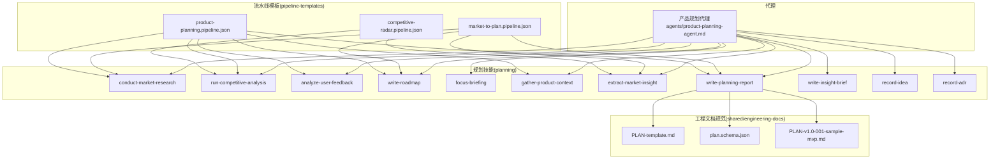
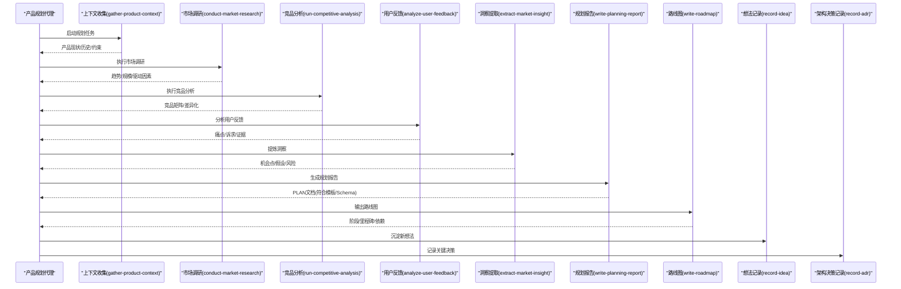
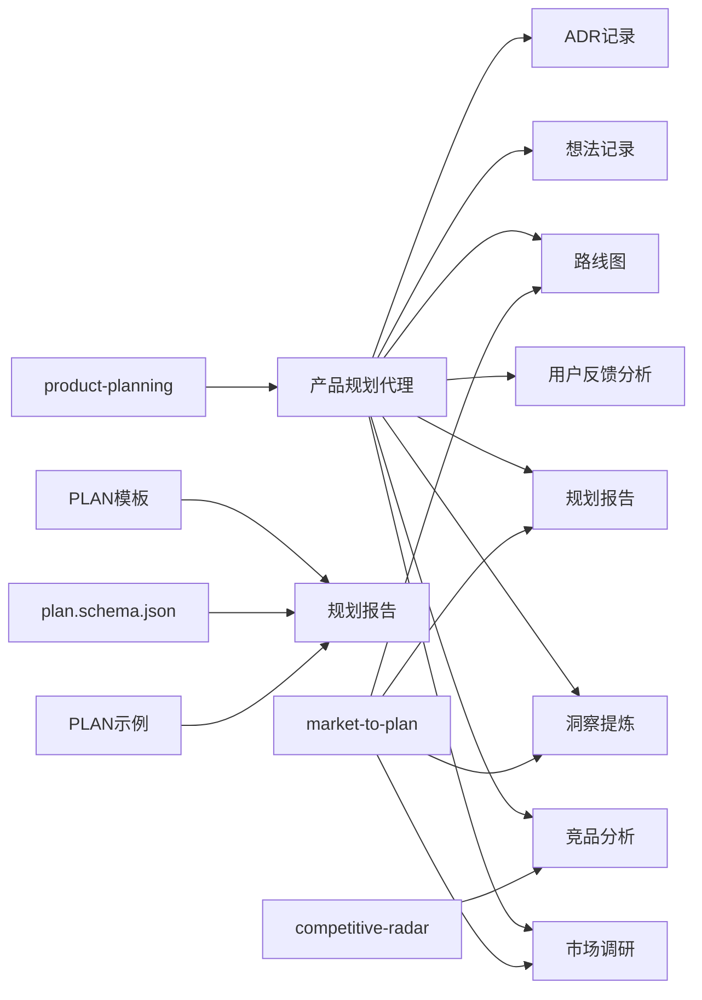
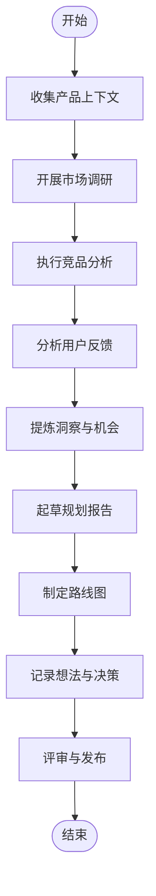

# 产品规划代理

<cite>
**本文档引用的文件**   
- [agents/product-planning-agent.md](file://agents/product-planning-agent.md)
- [skills/planning/conduct-market-research/SKILL.md](file://skills/planning/conduct-market-research/SKILL.md)
- [skills/planning/run-competitive-analysis/SKILL.md](file://skills/planning/run-competitive-analysis/SKILL.md)
- [skills/planning/analyze-user-feedback/SKILL.md](file://skills/planning/analyze-user-feedback/SKILL.md)
- [skills/planning/write-roadmap/SKILL.md](file://skills/planning/write-roadmap/SKILL.md)
- [skills/planning/focus-briefing/SKILL.md](file://skills/planning/focus-briefing/SKILL.md)
- [skills/planning/gather-product-context/SKILL.md](file://skills/planning/gather-product-context/SKILL.md)
- [skills/planning/extract-market-insight/SKILL.md](file://skills/planning/extract-market-insight/SKILL.md)
- [skills/planning/write-planning-report/SKILL.md](file://skills/planning/write-planning-report/SKILL.md)
- [skills/planning/write-insight-brief/SKILL.md](file://skills/planning/write-insight-brief/SKILL.md)
- [skills/planning/record-idea/SKILL.md](file://skills/planning/record-idea/SKILL.md)
- [skills/planning/record-adr/SKILL.md](file://skills/planning/record-adr/SKILL.md)
- [pipeline-templates/market-to-plan.pipeline.json](file://pipeline-templates/market-to-plan.pipeline.json)
- [pipeline-templates/product-planning.pipeline.json](file://pipeline-templates/product-planning.pipeline.json)
- [pipeline-templates/competitive-radar.pipeline.json](file://pipeline-templates/competitive-radar.pipeline.json)
- [pipeline-templates/README.md](file://pipeline-templates/README.md)
- [skills/shared/engineering-docs/templates/PLAN-template.md](file://skills/shared/engineering-docs/templates/PLAN-template.md)
- [skills/shared/engineering-docs/schemas/plan.schema.json](file://skills/shared/engineering-docs/schemas/plan.schema.json)
- [skills/shared/engineering-docs/examples/PLAN-v1.0-001-sample-mvp.md](file://skills/shared/engineering-docs/examples/PLAN-v1.0-001-sample-mvp.md)
</cite>

## 目录
1. [简介](#简介)
2. [项目结构](#项目结构)
3. [核心组件](#核心组件)
4. [架构总览](#架构总览)
5. [详细组件分析](#详细组件分析)
6. [依赖分析](#依赖分析)
7. [性能考虑](#性能考虑)
8. [故障排查指南](#故障排查指南)
9. [结论](#结论)
10. [附录](#附录)

## 简介
本使用文档面向“产品规划代理”的使用者与集成者，围绕其核心职责——市场调研分析、产品路线图制定、需求优先级排序与战略规划生成——提供端到端的方法论、配置指南与最佳实践。文档同时覆盖数据分析能力、市场情报收集与决策支持机制，并给出与项目管理工具、数据分析平台、用户反馈系统的集成方案，帮助团队实现产品决策科学化与规划可视化。

## 项目结构
仓库采用“代理 + 技能 + 流水线模板 + 工程文档规范”的分层组织方式：
- agents：定义各角色代理的职责与行为边界（含产品规划代理）
- skills：按主题划分可复用技能（planning 子域包含调研、洞察、竞品、路线图等）
- pipeline-templates：编排多技能协作的流水线模板（如从市场到规划、产品规划、竞品雷达）
- skills/shared/engineering-docs：统一的工程文档标准、模板、Schema 与示例，确保产出物一致性与可校验性

图表来源
- [agents/product-planning-agent.md](file://agents/product-planning-agent.md)
- [skills/planning/conduct-market-research/SKILL.md](file://skills/planning/conduct-market-research/SKILL.md)
- [skills/planning/run-competitive-analysis/SKILL.md](file://skills/planning/run-competitive-analysis/SKILL.md)
- [skills/planning/analyze-user-feedback/SKILL.md](file://skills/planning/analyze-user-feedback/SKILL.md)
- [skills/planning/write-roadmap/SKILL.md](file://skills/planning/write-roadmap/SKILL.md)
- [skills/planning/focus-briefing/SKILL.md](file://skills/planning/focus-briefing/SKILL.md)
- [skills/planning/gather-product-context/SKILL.md](file://skills/planning/gather-product-context/SKILL.md)
- [skills/planning/extract-market-insight/SKILL.md](file://skills/planning/extract-market-insight/SKILL.md)
- [skills/planning/write-planning-report/SKILL.md](file://skills/planning/write-planning-report/SKILL.md)
- [skills/planning/write-insight-brief/SKILL.md](file://skills/planning/write-insight-brief/SKILL.md)
- [skills/planning/record-idea/SKILL.md](file://skills/planning/record-idea/SKILL.md)
- [skills/planning/record-adr/SKILL.md](file://skills/planning/record-adr/SKILL.md)
- [pipeline-templates/market-to-plan.pipeline.json](file://pipeline-templates/market-to-plan.pipeline.json)
- [pipeline-templates/product-planning.pipeline.json](file://pipeline-templates/product-planning.pipeline.json)
- [pipeline-templates/competitive-radar.pipeline.json](file://pipeline-templates/competitive-radar.pipeline.json)
- [skills/shared/engineering-docs/templates/PLAN-template.md](file://skills/shared/engineering-docs/templates/PLAN-template.md)
- [skills/shared/engineering-docs/schemas/plan.schema.json](file://skills/shared/engineering-docs/schemas/plan.schema.json)
- [skills/shared/engineering-docs/examples/PLAN-v1.0-001-sample-mvp.md](file://skills/shared/engineering-docs/examples/PLAN-v1.0-001-sample-mvp.md)

章节来源
- [agents/product-planning-agent.md](file://agents/product-planning-agent.md)
- [pipeline-templates/README.md](file://pipeline-templates/README.md)

## 核心组件
- 产品规划代理：作为编排中枢，负责将“上下文收集—市场研究—竞品分析—用户反馈—洞察提炼—规划报告—路线图—决策记录”串联为可复用的工作流。
- 规划技能集：以细粒度技能封装关键能力，包括市场调研、竞品分析、用户反馈分析、洞察提取、聚焦简报、产品上下文聚合、规划报告撰写、路线图编写、想法与ADR记录等。
- 流水线模板：将多个技能组合成端到端流程，典型场景包括“从市场到规划”、“产品规划”、“竞品雷达”。
- 工程文档规范：通过模板与 Schema 约束规划产物结构，保障一致性、可追溯与可验证。

章节来源
- [agents/product-planning-agent.md](file://agents/product-planning-agent.md)
- [skills/planning/conduct-market-research/SKILL.md](file://skills/planning/conduct-market-research/SKILL.md)
- [skills/planning/run-competitive-analysis/SKILL.md](file://skills/planning/run-competitive-analysis/SKILL.md)
- [skills/planning/analyze-user-feedback/SKILL.md](file://skills/planning/analyze-user-feedback/SKILL.md)
- [skills/planning/write-roadmap/SKILL.md](file://skills/planning/write-roadmap/SKILL.md)
- [skills/planning/focus-briefing/SKILL.md](file://skills/planning/focus-briefing/SKILL.md)
- [skills/planning/gather-product-context/SKILL.md](file://skills/planning/gather-product-context/SKILL.md)
- [skills/planning/extract-market-insight/SKILL.md](file://skills/planning/extract-market-insight/SKILL.md)
- [skills/planning/write-planning-report/SKILL.md](file://skills/planning/write-planning-report/SKILL.md)
- [skills/planning/write-insight-brief/SKILL.md](file://skills/planning/write-insight-brief/SKILL.md)
- [skills/planning/record-idea/SKILL.md](file://skills/planning/record-idea/SKILL.md)
- [skills/planning/record-adr/SKILL.md](file://skills/planning/record-adr/SKILL.md)
- [pipeline-templates/market-to-plan.pipeline.json](file://pipeline-templates/market-to-plan.pipeline.json)
- [pipeline-templates/product-planning.pipeline.json](file://pipeline-templates/product-planning.pipeline.json)
- [pipeline-templates/competitive-radar.pipeline.json](file://pipeline-templates/competitive-radar.pipeline.json)
- [skills/shared/engineering-docs/templates/PLAN-template.md](file://skills/shared/engineering-docs/templates/PLAN-template.md)
- [skills/shared/engineering-docs/schemas/plan.schema.json](file://skills/shared/engineering-docs/schemas/plan.schema.json)
- [skills/shared/engineering-docs/examples/PLAN-v1.0-001-sample-mvp.md](file://skills/shared/engineering-docs/examples/PLAN-v1.0-001-sample-mvp.md)

## 架构总览
产品规划代理以“技能化+流水线化”的方式运作：代理负责目标分解与任务编排；技能完成具体分析与产出；流水线模板固化端到端流程；工程文档规范保证产出质量与一致性。

图表来源
- [agents/product-planning-agent.md](file://agents/product-planning-agent.md)
- [skills/planning/gather-product-context/SKILL.md](file://skills/planning/gather-product-context/SKILL.md)
- [skills/planning/conduct-market-research/SKILL.md](file://skills/planning/conduct-market-research/SKILL.md)
- [skills/planning/run-competitive-analysis/SKILL.md](file://skills/planning/run-competitive-analysis/SKILL.md)
- [skills/planning/analyze-user-feedback/SKILL.md](file://skills/planning/analyze-user-feedback/SKILL.md)
- [skills/planning/extract-market-insight/SKILL.md](file://skills/planning/extract-market-insight/SKILL.md)
- [skills/planning/write-planning-report/SKILL.md](file://skills/planning/write-planning-report/SKILL.md)
- [skills/planning/write-roadmap/SKILL.md](file://skills/planning/write-roadmap/SKILL.md)
- [skills/planning/record-idea/SKILL.md](file://skills/planning/record-idea/SKILL.md)
- [skills/planning/record-adr/SKILL.md](file://skills/planning/record-adr/SKILL.md)

## 详细组件分析

### 市场调研分析
- 职责：采集行业趋势、市场规模、政策与技术驱动因素，形成结构化洞察输入。
- 关键步骤：明确调研维度→数据源定位→信息抽取→交叉验证→摘要输出。
- 输出：市场研究报告（用于后续洞察与规划）。

章节来源
- [skills/planning/conduct-market-research/SKILL.md](file://skills/planning/conduct-market-research/SKILL.md)

### 竞品分析
- 职责：构建竞品矩阵，识别功能差异、定价策略、渠道与生态位，定位我方优势与缺口。
- 关键步骤：竞品清单→信息采集→对比维度建模→差距分析→建议。
- 输出：竞品分析报告（可接入“竞品雷达”流水线进行可视化呈现）。

章节来源
- [skills/planning/run-competitive-analysis/SKILL.md](file://skills/planning/run-competitive-analysis/SKILL.md)
- [pipeline-templates/competitive-radar.pipeline.json](file://pipeline-templates/competitive-radar.pipeline.json)

### 用户需求洞察
- 职责：汇聚多渠道用户反馈，聚类问题与诉求，量化影响面与紧急度。
- 关键步骤：反馈采集→清洗与标注→聚类与归因→优先级初筛。
- 输出：用户洞察摘要（支撑需求优先级排序与路线图排期）。

章节来源
- [skills/planning/analyze-user-feedback/SKILL.md](file://skills/planning/analyze-user-feedback/SKILL.md)

### 洞察提炼与聚焦简报
- 职责：将市场、竞品、用户等多源信息融合，提炼关键机会点、风险与假设，形成高层级聚焦简报。
- 关键步骤：多源对齐→假设提出→证据评估→结论收敛。
- 输出：聚焦简报（作为规划报告的输入之一）。

章节来源
- [skills/planning/extract-market-insight/SKILL.md](file://skills/planning/extract-market-insight/SKILL.md)
- [skills/planning/focus-briefing/SKILL.md](file://skills/planning/focus-briefing/SKILL.md)

### 规划报告与路线图
- 规划报告：基于上下文、调研、竞品、用户洞察，输出结构化规划文档，遵循统一模板与 Schema。
- 路线图：将机会点转化为阶段性目标、里程碑与依赖关系，明确节奏与资源。
- 输出：PLAN 文档与路线图（可被下游评审与追踪）。

章节来源
- [skills/planning/write-planning-report/SKILL.md](file://skills/planning/write-planning-report/SKILL.md)
- [skills/planning/write-roadmap/SKILL.md](file://skills/planning/write-roadmap/SKILL.md)
- [skills/shared/engineering-docs/templates/PLAN-template.md](file://skills/shared/engineering-docs/templates/PLAN-template.md)
- [skills/shared/engineering-docs/schemas/plan.schema.json](file://skills/shared/engineering-docs/schemas/plan.schema.json)
- [skills/shared/engineering-docs/examples/PLAN-v1.0-001-sample-mvp.md](file://skills/shared/engineering-docs/examples/PLAN-v1.0-001-sample-mvp.md)

### 想法与决策记录
- 想法记录：沉淀探索性方向与备选方案，便于后续回溯与演进。
- 架构决策记录：对关键取舍与权衡进行结构化记录，提升可追溯性。

章节来源
- [skills/planning/record-idea/SKILL.md](file://skills/planning/record-idea/SKILL.md)
- [skills/planning/record-adr/SKILL.md](file://skills/planning/record-adr/SKILL.md)

### 产品上下文聚合
- 职责：拉取产品现状、历史版本、指标与约束，为规划提供基线。
- 输出：上下文摘要（供后续所有技能消费）。

章节来源
- [skills/planning/gather-product-context/SKILL.md](file://skills/planning/gather-product-context/SKILL.md)

### 流水线编排
- “从市场到规划”：以市场研究与洞察为核心，快速生成规划草案与路线图。
- “产品规划”：全量流程，涵盖上下文、调研、竞品、用户反馈、报告与路线图。
- “竞品雷达”：专项竞品可视化与分析闭环。

章节来源
- [pipeline-templates/market-to-plan.pipeline.json](file://pipeline-templates/market-to-plan.pipeline.json)
- [pipeline-templates/product-planning.pipeline.json](file://pipeline-templates/product-planning.pipeline.json)
- [pipeline-templates/competitive-radar.pipeline.json](file://pipeline-templates/competitive-radar.pipeline.json)

## 依赖分析
- 内聚与耦合
  - 代理与技能松耦合：代理仅编排调用，技能自包含输入/输出契约，降低变更影响面。
  - 流水线模板对技能的组合依赖：通过 JSON 描述顺序、条件与数据传递，便于扩展与替换。
- 外部依赖
  - 工程文档模板与 Schema：确保规划产物一致性与可校验性。
  - 示例文档：提供落地参考，缩短上手时间。

图表来源
- [agents/product-planning-agent.md](file://agents/product-planning-agent.md)
- [skills/planning/conduct-market-research/SKILL.md](file://skills/planning/conduct-market-research/SKILL.md)
- [skills/planning/run-competitive-analysis/SKILL.md](file://skills/planning/run-competitive-analysis/SKILL.md)
- [skills/planning/analyze-user-feedback/SKILL.md](file://skills/planning/analyze-user-feedback/SKILL.md)
- [skills/planning/extract-market-insight/SKILL.md](file://skills/planning/extract-market-insight/SKILL.md)
- [skills/planning/write-planning-report/SKILL.md](file://skills/planning/write-planning-report/SKILL.md)
- [skills/planning/write-roadmap/SKILL.md](file://skills/planning/write-roadmap/SKILL.md)
- [skills/planning/record-idea/SKILL.md](file://skills/planning/record-idea/SKILL.md)
- [skills/planning/record-adr/SKILL.md](file://skills/planning/record-adr/SKILL.md)
- [skills/shared/engineering-docs/templates/PLAN-template.md](file://skills/shared/engineering-docs/templates/PLAN-template.md)
- [skills/shared/engineering-docs/schemas/plan.schema.json](file://skills/shared/engineering-docs/schemas/plan.schema.json)
- [skills/shared/engineering-docs/examples/PLAN-v1.0-001-sample-mvp.md](file://skills/shared/engineering-docs/examples/PLAN-v1.0-001-sample-mvp.md)
- [pipeline-templates/market-to-plan.pipeline.json](file://pipeline-templates/market-to-plan.pipeline.json)
- [pipeline-templates/product-planning.pipeline.json](file://pipeline-templates/product-planning.pipeline.json)
- [pipeline-templates/competitive-radar.pipeline.json](file://pipeline-templates/competitive-radar.pipeline.json)

## 性能考虑
- 并行与批处理：在流水线中尽可能并行执行独立技能（如竞品分析与用户反馈分析），减少端到端时延。
- 增量更新：对稳定数据源（如产品上下文）做缓存与增量刷新，避免重复计算。
- 结果校验前置：在写入规划报告前进行 Schema 校验，尽早发现结构性错误，降低返工成本。
- 分阶段交付：先产出聚焦简报与草稿路线图，再迭代完善，提高响应速度。

[本节为通用指导，不直接分析具体文件]

## 故障排查指南
- 规划报告不符合模板或 Schema
  - 现象：报告无法通过校验或下游引用失败。
  - 排查：核对模板字段、必填项与类型约束；参考示例文档的结构与命名约定。
  - 参考：模板、Schema 与示例文档路径见“工程文档规范”相关条目。
- 流水线中断或某技能失败
  - 现象：特定步骤报错或无输出。
  - 排查：检查该技能的输入契约是否满足；确认上游产出是否存在且格式正确；查看流水线定义中的顺序与条件。
- 洞察不一致或结论漂移
  - 现象：不同次运行结论差异较大。
  - 排查：固定数据源范围与时间窗口；增加证据权重与交叉验证步骤；在聚焦简报中显式记录假设与不确定性。

章节来源
- [skills/shared/engineering-docs/templates/PLAN-template.md](file://skills/shared/engineering-docs/templates/PLAN-template.md)
- [skills/shared/engineering-docs/schemas/plan.schema.json](file://skills/shared/engineering-docs/schemas/plan.schema.json)
- [skills/shared/engineering-docs/examples/PLAN-v1.0-001-sample-mvp.md](file://skills/shared/engineering-docs/examples/PLAN-v1.0-001-sample-mvp.md)
- [pipeline-templates/market-to-plan.pipeline.json](file://pipeline-templates/market-to-plan.pipeline.json)
- [pipeline-templates/product-planning.pipeline.json](file://pipeline-templates/product-planning.pipeline.json)
- [pipeline-templates/competitive-radar.pipeline.json](file://pipeline-templates/competitive-radar.pipeline.json)

## 结论
产品规划代理通过“技能化能力+流水线编排+工程文档规范”，将市场调研、竞品分析、用户反馈与洞察提炼整合为可复用的规划流程，并以标准化模板与 Schema 保障产出质量。结合聚焦简报与路线图，团队可实现更科学的产品决策与更清晰的规划可视化。

[本节为总结性内容，不直接分析具体文件]

## 附录

### 配置指南
- 调研维度设置
  - 建议维度：宏观环境、技术趋势、监管政策、市场规模与增长、细分赛道、用户画像与行为、渠道与生态。
  - 数据来源：公开报告、行业数据库、竞品公告、用户反馈系统、内部指标。
  - 质量控制：多源交叉验证、时效性标注、置信度评分。
- 评估模型配置
  - 优先级模型：建议采用“价值×可行性×风险”三维打分，并结合用户影响面与战略契合度加权。
  - 路线图分层：愿景→主题→特性→里程碑→依赖，逐层细化。
  - 决策记录：关键取舍与依据需写入 ADR，保持可追溯。
- 报告模板定制
  - 基于统一模板与 Schema 进行裁剪，保留必要字段，新增业务特有维度时需同步更新 Schema 与校验逻辑。
  - 示例文档可作为落笔参考，确保结构与风格一致。

章节来源
- [skills/planning/conduct-market-research/SKILL.md](file://skills/planning/conduct-market-research/SKILL.md)
- [skills/planning/run-competitive-analysis/SKILL.md](file://skills/planning/run-competitive-analysis/SKILL.md)
- [skills/planning/analyze-user-feedback/SKILL.md](file://skills/planning/analyze-user-feedback/SKILL.md)
- [skills/planning/extract-market-insight/SKILL.md](file://skills/planning/extract-market-insight/SKILL.md)
- [skills/planning/write-planning-report/SKILL.md](file://skills/planning/write-planning-report/SKILL.md)
- [skills/planning/write-roadmap/SKILL.md](file://skills/planning/write-roadmap/SKILL.md)
- [skills/planning/record-idea/SKILL.md](file://skills/planning/record-idea/SKILL.md)
- [skills/planning/record-adr/SKILL.md](file://skills/planning/record-adr/SKILL.md)
- [skills/shared/engineering-docs/templates/PLAN-template.md](file://skills/shared/engineering-docs/templates/PLAN-template.md)
- [skills/shared/engineering-docs/schemas/plan.schema.json](file://skills/shared/engineering-docs/schemas/plan.schema.json)
- [skills/shared/engineering-docs/examples/PLAN-v1.0-001-sample-mvp.md](file://skills/shared/engineering-docs/examples/PLAN-v1.0-001-sample-mvp.md)

### 产品规划流程（端到端）

[本图为概念流程图，不直接映射具体源码文件]

### 集成方案
- 与项目管理工具集成
  - 将路线图与里程碑同步至看板/甘特图，建立“规划→任务→进度”的链路。
  - 在流水线中加入“写回任务”的步骤，自动创建或更新任务项。
- 与数据分析平台集成
  - 将用户反馈与市场数据接入数据平台，形成可查询的数据资产。
  - 在洞察环节引入统计显著性与趋势检验，提升结论稳健性。
- 与用户反馈系统集成
  - 自动化抓取反馈标签与情感倾向，作为优先级模型的输入特征。
  - 将高优问题直接关联到路线图主题，形成闭环。

[本节为通用集成建议，不直接分析具体文件]

### 最佳实践
- 决策科学化
  - 用数据说话：为每个机会点提供证据链与置信度。
  - 明确假设与风险：在聚焦简报中显式列出，并制定验证计划。
- 规划可视化
  - 使用“竞品雷达”与“路线图分层视图”呈现关键信息。
  - 将 ADR 与想法库纳入知识图谱，便于检索与复盘。

[本节为通用最佳实践，不直接分析具体文件]