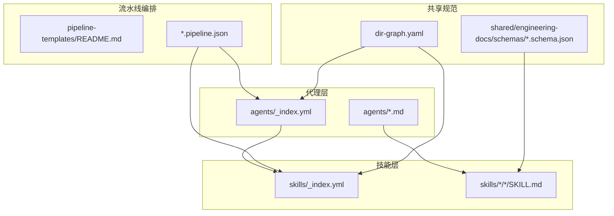
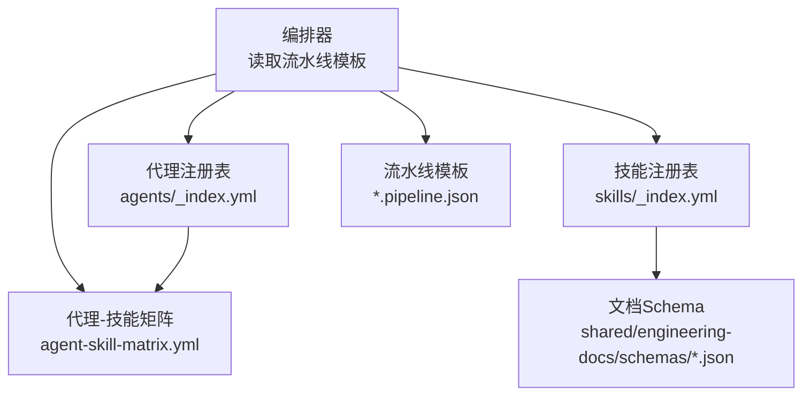
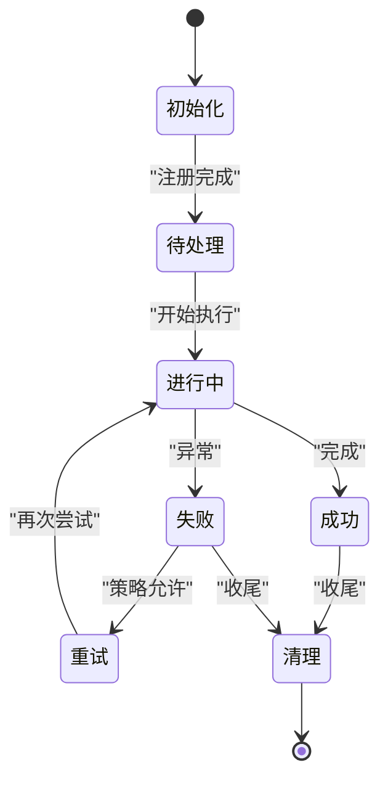
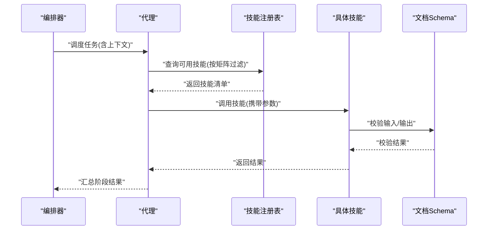
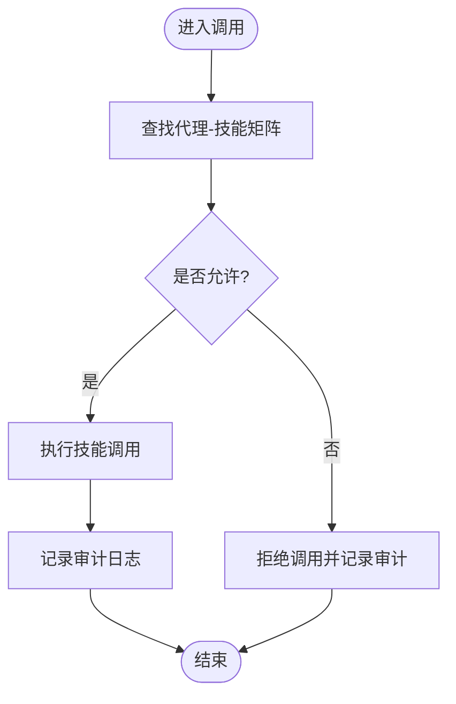
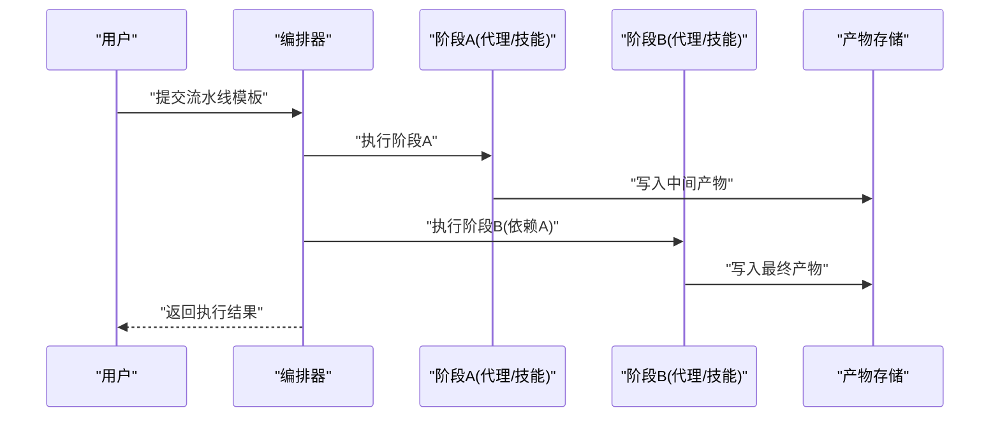
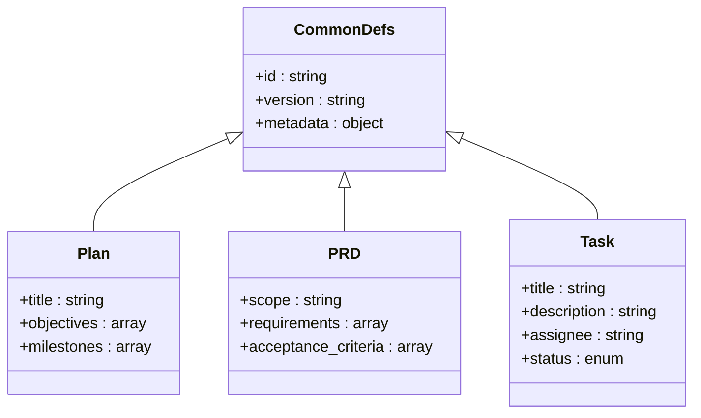
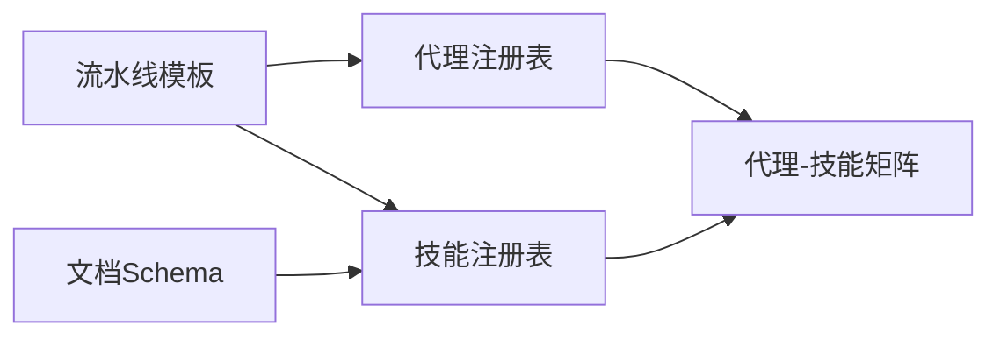

# 代理系统架构

<cite>
**本文引用的文件**   
- [agents/_index.yml](file://agents/_index.yml)
- [skills/_index.yml](file://skills/_index.yml)
- [agent-skill-matrix.yml](file://agent-skill-matrix.yml)
- [AGENT-SKILL-MATRIX.md](file://AGENT-SKILL-MATRIX.md)
- [AGENTS.md](file://AGENTS.md)
- [pipeline-templates/README.md](file://pipeline-templates/README.md)
- [pipeline-templates/architecture-design.pipeline.json](file://pipeline-templates/architecture-design.pipeline.json)
- [pipeline-templates/code-implementation.pipeline.json](file://pipeline-templates/code-implementation.pipeline.json)
- [pipeline-templates/product-planning.pipeline.json](file://pipeline-templates/product-planning.pipeline.json)
- [skills/shared/engineering-docs/schemas/common-defs.schema.json](file://skills/shared/engineering-docs/schemas/common-defs.schema.json)
- [skills/shared/engineering-docs/schemas/form.schema.json](file://skills/shared/engineering-docs/schemas/form.schema.json)
- [skills/shared/engineering-docs/schemas/module.schema.json](file://skills/shared/engineering-docs/schemas/module.schema.json)
- [skills/shared/engineering-docs/schemas/plan.schema.json](file://skills/shared/engineering-docs/schemas/plan.schema.json)
- [skills/shared/engineering-docs/schemas/prd.schema.json](file://skills/shared/engineering-docs/schemas/prd.schema.json)
- [skills/shared/engineering-docs/schemas/release.schema.json](file://skills/shared/engineering-docs/schemas/release.schema.json)
- [skills/shared/engineering-docs/schemas/sdd.schema.json](file://skills/shared/engineering-docs/schemas/sdd.schema.json)
- [skills/shared/engineering-docs/schemas/task.schema.json](file://skills/shared/engineering-docs/schemas/task.schema.json)
- [dir-graph.yaml](file://dir-graph.yaml)
</cite>

## 目录
1. [简介](#简介)
2. [项目结构](#项目结构)
3. [核心组件](#核心组件)
4. [架构总览](#架构总览)
5. [详细组件分析](#详细组件分析)
6. [依赖关系分析](#依赖关系分析)
7. [性能与扩展性](#性能与扩展性)
8. [故障排查指南](#故障排查指南)
9. [结论](#结论)
10. [附录](#附录)

## 简介
本技术文档面向AI代理系统的整体设计与实现，聚焦以下目标：
- 解释代理的生命周期管理、能力注册机制、权限控制模型与消息传递协议
- 说明代理与技能系统的集成方式（Skill调用接口、参数传递与结果处理）
- 提供代理配置文件的Schema定义与验证规则
- 给出代理间通信的架构图与数据流图，并阐述状态管理与错误处理机制
- 讨论代理扩展性、性能优化与安全性考虑

## 项目结构
仓库采用“按领域分层 + 资源声明式”的组织方式：
- agents：以YAML索引与Markdown描述定义各类代理及其职责边界
- skills：以目录+SKILL.md的方式组织可复用能力，并通过_index.yml进行全局索引
- pipeline-templates：以JSON模板定义端到端流水线编排，驱动多代理协作
- shared工程文档规范：通过schemas目录提供结构化文档的校验约束

图表来源
- [agents/_index.yml](file://agents/_index.yml)
- [skills/_index.yml](file://skills/_index.yml)
- [pipeline-templates/README.md](file://pipeline-templates/README.md)
- [dir-graph.yaml](file://dir-graph.yaml)

章节来源
- [agents/_index.yml](file://agents/_index.yml)
- [skills/_index.yml](file://skills/_index.yml)
- [pipeline-templates/README.md](file://pipeline-templates/README.md)
- [dir-graph.yaml](file://dir-graph.yaml)

## 核心组件
- 代理注册表：集中声明可用代理与其元信息，作为运行时发现与路由的依据
- 技能注册表：集中声明可用技能及其入口、参数与输出契约，供代理按需调用
- 代理-技能矩阵：明确每个代理可使用的技能集合，形成权限白名单
- 流水线模板：以JSON描述任务阶段、输入输出、触发条件与参与代理/技能
- 文档Schema：为工程文档产物提供强类型校验，确保跨代理协作的一致性

章节来源
- [agents/_index.yml](file://agents/_index.yml)
- [skills/_index.yml](file://skills/_index.yml)
- [agent-skill-matrix.yml](file://agent-skill-matrix.yml)
- [AGENT-SKILL-MATRIX.md](file://AGENT-SKILL-MATRIX.md)
- [pipeline-templates/README.md](file://pipeline-templates/README.md)
- [skills/shared/engineering-docs/schemas/common-defs.schema.json](file://skills/shared/engineering-docs/schemas/common-defs.schema.json)
- [skills/shared/engineering-docs/schemas/form.schema.json](file://skills/shared/engineering-docs/schemas/form.schema.json)
- [skills/shared/engineering-docs/schemas/module.schema.json](file://skills/shared/engineering-docs/schemas/module.schema.json)
- [skills/shared/engineering-docs/schemas/plan.schema.json](file://skills/shared/engineering-docs/schemas/plan.schema.json)
- [skills/shared/engineering-docs/schemas/prd.schema.json](file://skills/shared/engineering-docs/schemas/prd.schema.json)
- [skills/shared/engineering-docs/schemas/release.schema.json](file://skills/shared/engineering-docs/schemas/release.schema.json)
- [skills/shared/engineering-docs/schemas/sdd.schema.json](file://skills/shared/engineering-docs/schemas/sdd.schema.json)
- [skills/shared/engineering-docs/schemas/task.schema.json](file://skills/shared/engineering-docs/schemas/task.schema.json)

## 架构总览
下图展示代理、技能、流水线与文档规范之间的交互关系。代理通过注册表发现并调用技能；流水线模板协调多代理协作；所有产出的工程文档需通过Schema校验。

图表来源
- [agents/_index.yml](file://agents/_index.yml)
- [skills/_index.yml](file://skills/_index.yml)
- [agent-skill-matrix.yml](file://agent-skill-matrix.yml)
- [pipeline-templates/README.md](file://pipeline-templates/README.md)
- [skills/shared/engineering-docs/schemas/common-defs.schema.json](file://skills/shared/engineering-docs/schemas/common-defs.schema.json)

## 详细组件分析

### 代理注册与生命周期
- 注册入口：通过agents/_index.yml集中声明代理ID、名称、描述、版本等元数据
- 生命周期阶段：
  - 初始化：加载注册表、解析能力清单、建立权限白名单
  - 运行：接收编排器调度，执行任务阶段，产出中间结果
  - 清理：释放资源、归档日志、上报状态
- 状态管理：建议以“待处理/进行中/成功/失败/重试”五态流转，结合持久化记录

章节来源
- [agents/_index.yml](file://agents/_index.yml)

### 技能注册与调用协议
- 注册入口：通过skills/_index.yml集中声明技能ID、名称、描述、入参/出参契约
- 调用协议要点：
  - 请求体：包含技能ID、上下文、参数对象、追踪ID
  - 响应体：包含状态码、结果对象、诊断信息
  - 幂等键：用于去重与重试安全
- 参数与结果：遵循对应文档Schema进行校验与转换

图表来源
- [skills/_index.yml](file://skills/_index.yml)
- [agent-skill-matrix.yml](file://agent-skill-matrix.yml)
- [skills/shared/engineering-docs/schemas/common-defs.schema.json](file://skills/shared/engineering-docs/schemas/common-defs.schema.json)

章节来源
- [skills/_index.yml](file://skills/_index.yml)
- [agent-skill-matrix.yml](file://agent-skill-matrix.yml)

### 权限控制模型（基于矩阵）
- 白名单机制：通过agent-skill-matrix.yml限定每个代理可调用的技能集合
- 动态授权：在运行时根据上下文（如用户角色、环境标签）进一步裁剪
- 审计与追溯：每次调用记录代理ID、技能ID、时间戳与结果摘要

图表来源
- [agent-skill-matrix.yml](file://agent-skill-matrix.yml)
- [AGENT-SKILL-MATRIX.md](file://AGENT-SKILL-MATRIX.md)

章节来源
- [agent-skill-matrix.yml](file://agent-skill-matrix.yml)
- [AGENT-SKILL-MATRIX.md](file://AGENT-SKILL-MATRIX.md)

### 流水线编排与多代理协作
- 模板结构：以JSON描述阶段、前置依赖、输入输出、参与代理/技能
- 执行语义：顺序/并行阶段、失败回退、重试策略、超时控制
- 典型场景：架构设计、代码实现、产品规划等端到端流程

图表来源
- [pipeline-templates/README.md](file://pipeline-templates/README.md)
- [pipeline-templates/architecture-design.pipeline.json](file://pipeline-templates/architecture-design.pipeline.json)
- [pipeline-templates/code-implementation.pipeline.json](file://pipeline-templates/code-implementation.pipeline.json)
- [pipeline-templates/product-planning.pipeline.json](file://pipeline-templates/product-planning.pipeline.json)

章节来源
- [pipeline-templates/README.md](file://pipeline-templates/README.md)
- [pipeline-templates/architecture-design.pipeline.json](file://pipeline-templates/architecture-design.pipeline.json)
- [pipeline-templates/code-implementation.pipeline.json](file://pipeline-templates/code-implementation.pipeline.json)
- [pipeline-templates/product-planning.pipeline.json](file://pipeline-templates/product-planning.pipeline.json)

### 文档Schema与一致性保障
- 统一基础定义：common-defs.schema.json提供通用字段与枚举
- 领域Schema：form、module、plan、prd、release、sdd、task分别约束不同文档类型
- 校验时机：技能产出前后均进行校验，确保下游消费方获得一致结构

图表来源
- [skills/shared/engineering-docs/schemas/common-defs.schema.json](file://skills/shared/engineering-docs/schemas/common-defs.schema.json)
- [skills/shared/engineering-docs/schemas/plan.schema.json](file://skills/shared/engineering-docs/schemas/plan.schema.json)
- [skills/shared/engineering-docs/schemas/prd.schema.json](file://skills/shared/engineering-docs/schemas/prd.schema.json)
- [skills/shared/engineering-docs/schemas/task.schema.json](file://skills/shared/engineering-docs/schemas/task.schema.json)

章节来源
- [skills/shared/engineering-docs/schemas/common-defs.schema.json](file://skills/shared/engineering-docs/schemas/common-defs.schema.json)
- [skills/shared/engineering-docs/schemas/form.schema.json](file://skills/shared/engineering-docs/schemas/form.schema.json)
- [skills/shared/engineering-docs/schemas/module.schema.json](file://skills/shared/engineering-docs/schemas/module.schema.json)
- [skills/shared/engineering-docs/schemas/plan.schema.json](file://skills/shared/engineering-docs/schemas/plan.schema.json)
- [skills/shared/engineering-docs/schemas/prd.schema.json](file://skills/shared/engineering-docs/schemas/prd.schema.json)
- [skills/shared/engineering-docs/schemas/release.schema.json](file://skills/shared/engineering-docs/schemas/release.schema.json)
- [skills/shared/engineering-docs/schemas/sdd.schema.json](file://skills/shared/engineering-docs/schemas/sdd.schema.json)
- [skills/shared/engineering-docs/schemas/task.schema.json](file://skills/shared/engineering-docs/schemas/task.schema.json)

## 依赖关系分析
- 代理与技能解耦：通过注册表与矩阵进行弱耦合，便于替换与扩展
- 模板驱动：流水线模板决定执行路径，降低硬编码复杂度
- 文档即契约：Schema约束贯穿生产与消费两端，提升稳定性

图表来源
- [agents/_index.yml](file://agents/_index.yml)
- [skills/_index.yml](file://skills/_index.yml)
- [agent-skill-matrix.yml](file://agent-skill-matrix.yml)
- [pipeline-templates/README.md](file://pipeline-templates/README.md)
- [skills/shared/engineering-docs/schemas/common-defs.schema.json](file://skills/shared/engineering-docs/schemas/common-defs.schema.json)

章节来源
- [agents/_index.yml](file://agents/_index.yml)
- [skills/_index.yml](file://skills/_index.yml)
- [agent-skill-matrix.yml](file://agent-skill-matrix.yml)
- [pipeline-templates/README.md](file://pipeline-templates/README.md)
- [skills/shared/engineering-docs/schemas/common-defs.schema.json](file://skills/shared/engineering-docs/schemas/common-defs.schema.json)

## 性能与扩展性
- 并发与批处理：对无副作用的技能调用支持并发执行，批量参数合并减少往返
- 缓存与去重：基于幂等键与内容哈希缓存结果，避免重复计算
- 限流与熔断：对外部依赖设置速率限制与熔断阈值，保护系统稳定
- 可扩展点：
  - 新增代理：在注册表中登记并在矩阵中授权
  - 新增技能：在注册表中登记并提供Schema校验
  - 新流水线：编写JSON模板并接入编排器

[本节为通用指导，不直接分析具体文件]

## 故障排查指南
- 常见错误定位：
  - 权限拒绝：检查代理-技能矩阵是否包含该技能
  - 参数校验失败：对照对应文档Schema核对字段类型与必填项
  - 流水线阶段失败：查看阶段依赖与产物是否存在
- 诊断信息：
  - 记录调用链ID、代理ID、技能ID、输入摘要与错误堆栈
  - 保留中间产物快照以便复现

章节来源
- [agent-skill-matrix.yml](file://agent-skill-matrix.yml)
- [skills/shared/engineering-docs/schemas/common-defs.schema.json](file://skills/shared/engineering-docs/schemas/common-defs.schema.json)

## 结论
本架构通过“注册表 + 矩阵 + 模板 + Schema”的组合，实现了代理与技能的松耦合协作、严格的权限控制与一致的文档契约。配合完善的错误处理与可观测性，可在保证安全性的前提下持续提升扩展性与性能。

[本节为总结性内容，不直接分析具体文件]

## 附录

### 代理配置文件Schema（概念性）
- 字段类别：标识、元数据、能力清单、权限白名单、运行时策略
- 校验规则：必填字段、枚举值、引用完整性（指向注册表条目）
- 版本兼容：向后兼容的增量变更策略

[本节为概念性说明，不直接分析具体文件]

### 代理间通信协议（概念性）
- 消息格式：头部（追踪ID、优先级）、负载（任务描述、上下文）、附件（产物指针）
- 传输语义：至少一次投递、幂等处理、超时与重试
- 安全要求：签名校验、最小权限、敏感信息脱敏

[本节为概念性说明，不直接分析具体文件]