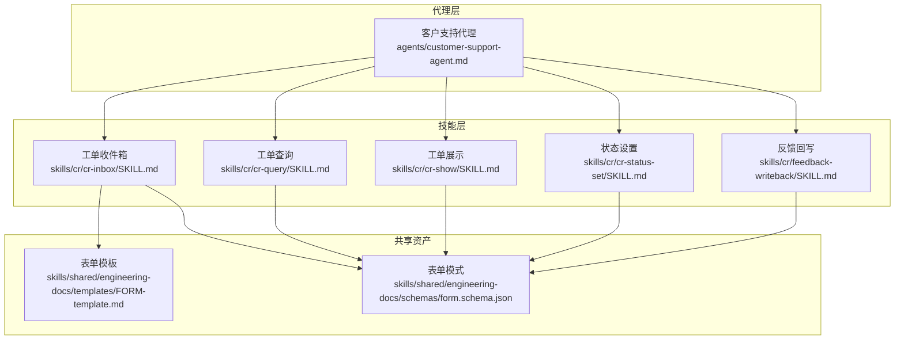
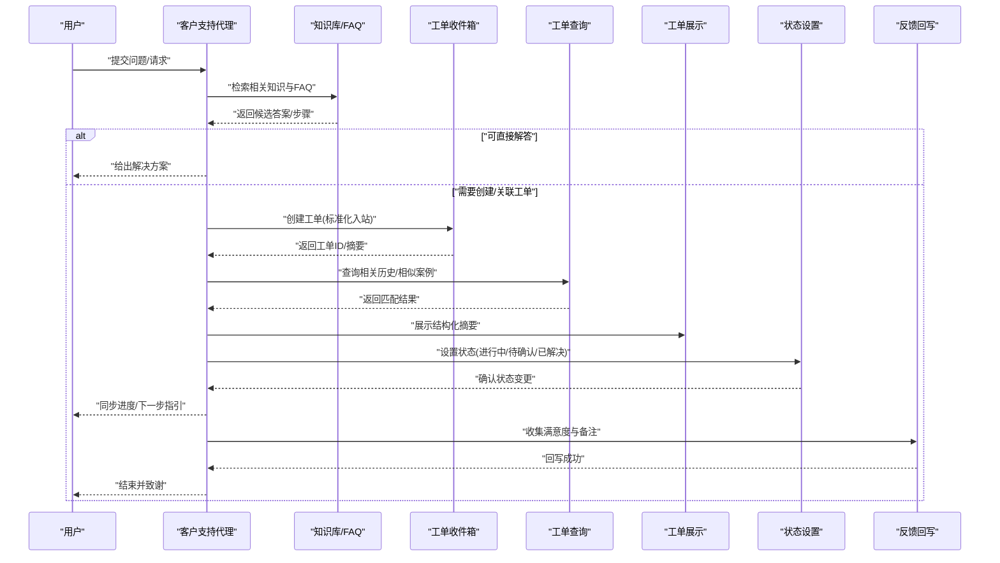
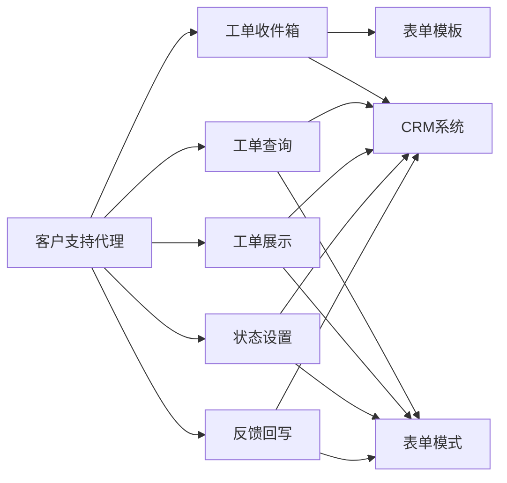

# 客户支持代理

<cite>
**本文引用的文件**   
- [agents/customer-support-agent.md](file://agents/customer-support-agent.md)
- [agents/_index.yml](file://agents/_index.yml)
- [skills/cr/cr-inbox/SKILL.md](file://skills/cr/cr-inbox/SKILL.md)
- [skills/cr/cr-query/SKILL.md](file://skills/cr/cr-query/SKILL.md)
- [skills/cr/cr-show/SKILL.md](file://skills/cr/cr-show/SKILL.md)
- [skills/cr/cr-status-set/SKILL.md](file://skills/cr/cr-status-set/SKILL.md)
- [skills/cr/feedback-writeback/SKILL.md](file://skills/cr/feedback-writeback/SKILL.md)
- [skills/shared/engineering-docs/templates/FORM-template.md](file://skills/shared/engineering-docs/templates/FORM-template.md)
- [skills/shared/engineering-docs/schemas/form.schema.json](file://skills/shared/engineering-docs/schemas/form.schema.json)
</cite>

## 目录
1. [简介](#简介)
2. [项目结构](#项目结构)
3. [核心组件](#核心组件)
4. [架构总览](#架构总览)
5. [详细组件分析](#详细组件分析)
6. [依赖关系分析](#依赖关系分析)
7. [性能与可用性考虑](#性能与可用性考虑)
8. [故障排查指南](#故障排查指南)
9. [结论](#结论)
10. [附录](#附录)

## 简介
本文件面向“客户支持代理”的使用与维护，聚焦以下职责：
- 客户咨询处理：接收并理解用户问题，进行意图识别、知识检索与解答。
- 问题诊断解决：基于知识库与工单上下文，定位根因并提供可执行修复步骤或临时规避方案。
- 服务请求管理：创建、查询、更新与关闭服务工单，确保流程闭环。
- 满意度跟踪：在对话结束后收集反馈，驱动持续改进。

同时说明：
- 知识库集成方式（文档模板与模式约束）
- 对话管理策略（状态流转、升级规则）
- 多语言支持能力（按会话上下文切换语言）
- 配置指南（响应模板、情感分析、升级规则）
- 典型应用场景（自动回复、复杂问题路由、自动生成工单）
- 与CRM/工单系统对接方案
- 服务质量监控与持续优化方法

## 项目结构
仓库采用“代理+技能”的模块化组织方式：
- agents：定义各角色代理的职责与行为边界
- skills：提供具体能力（如工单收件箱、查询、展示、状态设置、反馈回写等）
- shared：通用工程文档模板与校验模式，用于表单化数据与一致性约束

图表来源
- [agents/customer-support-agent.md](file://agents/customer-support-agent.md)
- [skills/cr/cr-inbox/SKILL.md](file://skills/cr/cr-inbox/SKILL.md)
- [skills/cr/cr-query/SKILL.md](file://skills/cr/cr-query/SKILL.md)
- [skills/cr/cr-show/SKILL.md](file://skills/cr/cr-show/SKILL.md)
- [skills/cr/cr-status-set/SKILL.md](file://skills/cr/cr-status-set/SKILL.md)
- [skills/cr/feedback-writeback/SKILL.md](file://skills/cr/feedback-writeback/SKILL.md)
- [skills/shared/engineering-docs/templates/FORM-template.md](file://skills/shared/engineering-docs/templates/FORM-template.md)
- [skills/shared/engineering-docs/schemas/form.schema.json](file://skills/shared/engineering-docs/schemas/form.schema.json)

章节来源
- [agents/customer-support-agent.md](file://agents/customer-support-agent.md)
- [agents/_index.yml](file://agents/_index.yml)

## 核心组件
- 客户支持代理：负责端到端的服务交互编排，包括意图识别、知识检索、工单生命周期管理与满意度采集。
- 工单技能集：
  - 收件箱：接收新请求，标准化入站信息，生成初始记录
  - 查询：按条件检索历史与当前工单，辅助诊断
  - 展示：呈现结构化摘要与关键时间线
  - 状态设置：推进或回退工单状态，触发后续动作
  - 反馈回写：将满意度与备注写入系统，形成闭环
- 共享资产：
  - 表单模板：统一字段结构与文案风格
  - 表单模式：强约束数据结构，保障跨系统一致性与可验证性

章节来源
- [agents/customer-support-agent.md](file://agents/customer-support-agent.md)
- [skills/cr/cr-inbox/SKILL.md](file://skills/cr/cr-inbox/SKILL.md)
- [skills/cr/cr-query/SKILL.md](file://skills/cr/cr-query/SKILL.md)
- [skills/cr/cr-show/SKILL.md](file://skills/cr/cr-show/SKILL.md)
- [skills/cr/cr-status-set/SKILL.md](file://skills/cr/cr-status-set/SKILL.md)
- [skills/cr/feedback-writeback/SKILL.md](file://skills/cr/feedback-writeback/SKILL.md)
- [skills/shared/engineering-docs/templates/FORM-template.md](file://skills/shared/engineering-docs/templates/FORM-template.md)
- [skills/shared/engineering-docs/schemas/form.schema.json](file://skills/shared/engineering-docs/schemas/form.schema.json)

## 架构总览
下图展示了从用户输入到工单闭环的关键路径，以及代理与各技能的协作关系。

图表来源
- [agents/customer-support-agent.md](file://agents/customer-support-agent.md)
- [skills/cr/cr-inbox/SKILL.md](file://skills/cr/cr-inbox/SKILL.md)
- [skills/cr/cr-query/SKILL.md](file://skills/cr/cr-query/SKILL.md)
- [skills/cr/cr-show/SKILL.md](file://skills/cr/cr-show/SKILL.md)
- [skills/cr/cr-status-set/SKILL.md](file://skills/cr/cr-status-set/SKILL.md)
- [skills/cr/feedback-writeback/SKILL.md](file://skills/cr/feedback-writeback/SKILL.md)

## 详细组件分析

### 组件一：客户支持代理
- 职责边界
  - 对话入口与路由：识别意图，决定直接回答、转接专家或创建工单
  - 上下文维护：保留会话历史、用户画像与产品版本等上下文
  - 质量把关：遵循模板与模式，保证输出一致性与可审计性
- 关键流程
  - 意图识别→知识检索→答案组装→必要时创建/关联工单→进度同步→满意度采集
- 多语言支持
  - 根据用户语言偏好与上下文自动选择语言；对术语与专有名词保持统一翻译表
- 升级策略
  - 当置信度低、重复失败或情绪负面时，触发人工接管或专家路由

章节来源
- [agents/customer-support-agent.md](file://agents/customer-support-agent.md)

### 组件二：工单技能集（CR系列）
- 工单收件箱
  - 作用：标准化入站信息，生成最小可用记录，便于后续追踪
  - 关键字段：主题、分类、优先级、描述、附件、来源渠道、首次响应时间
- 工单查询
  - 作用：按条件检索历史与当前工单，辅助诊断与避免重复劳动
  - 常用维度：时间范围、标签、状态、责任人、关键词
- 工单展示
  - 作用：以结构化摘要呈现关键信息与时间线，提升可读性
- 状态设置
  - 作用：推进或回退状态，触发通知与SLA计时
  - 常见状态：新建、进行中、等待用户、等待第三方、已解决、已关闭
- 反馈回写
  - 作用：收集满意度评分与备注，沉淀为改进依据

章节来源
- [skills/cr/cr-inbox/SKILL.md](file://skills/cr/cr-inbox/SKILL.md)
- [skills/cr/cr-query/SKILL.md](file://skills/cr/cr-query/SKILL.md)
- [skills/cr/cr-show/SKILL.md](file://skills/cr/cr-show/SKILL.md)
- [skills/cr/cr-status-set/SKILL.md](file://skills/cr/cr-status-set/SKILL.md)
- [skills/cr/feedback-writeback/SKILL.md](file://skills/cr/feedback-writeback/SKILL.md)

### 组件三：共享资产（表单模板与模式）
- 表单模板
  - 目的：统一字段命名、顺序与提示语，降低歧义
  - 适用场景：工单创建、更新、反馈收集等
- 表单模式
  - 目的：通过强类型约束与必填项校验，保障数据质量与跨系统一致性
  - 校验要点：必填字段、枚举值、长度限制、格式正则、唯一性约束

章节来源
- [skills/shared/engineering-docs/templates/FORM-template.md](file://skills/shared/engineering-docs/templates/FORM-template.md)
- [skills/shared/engineering-docs/schemas/form.schema.json](file://skills/shared/engineering-docs/schemas/form.schema.json)

### 组件四：对话管理与升级规则
- 对话管理策略
  - 会话记忆：保留最近N轮关键信息，避免重复询问
  - 澄清机制：缺失关键信息时主动追问，减少误判
  - 安全边界：拒绝敏感信息泄露，遵循最小必要原则
- 升级规则
  - 触发条件：多次重试失败、情绪负面、涉及合规/安全、超出权限范围
  - 升级目标：一线客服→二线专家→三线研发/运维
  - 交接内容：完整上下文、已尝试步骤、风险与影响面

章节来源
- [agents/customer-support-agent.md](file://agents/customer-support-agent.md)

### 组件五：知识库集成
- 集成方式
  - 检索增强：基于关键词与语义相似度召回候选片段
  - 可信度评估：结合命中数量、时效性与来源权威度打分
  - 答案组装：优先引用官方文档与FAQ，必要时附加免责声明
- 更新机制
  - 定期增量索引，热点内容优先刷新
  - 版本对齐：与产品发布节奏保持一致

章节来源
- [agents/customer-support-agent.md](file://agents/customer-support-agent.md)

### 组件六：多语言支持
- 语言检测与切换：根据用户输入与历史偏好自动选择
- 术语库：维护领域术语中英对照，确保专业表达一致
- 本地化适配：日期、货币、单位等按区域习惯格式化

章节来源
- [agents/customer-support-agent.md](file://agents/customer-support-agent.md)

### 组件七：与CRM与工单系统集成
- CRM集成
  - 身份与权限：通过令牌或会话映射用户身份
  - 数据同步：拉取客户画像、历史订单与服务记录
  - 事件回写：将互动摘要与满意度写入CRM
- 工单系统对接
  - 标准接口：REST/GraphQL或消息队列
  - 幂等设计：防止重复创建与状态抖动
  - 错误补偿：失败重试与死信队列

章节来源
- [skills/cr/cr-inbox/SKILL.md](file://skills/cr/cr-inbox/SKILL.md)
- [skills/cr/cr-query/SKILL.md](file://skills/cr/cr-query/SKILL.md)
- [skills/cr/cr-show/SKILL.md](file://skills/cr/cr-show/SKILL.md)
- [skills/cr/cr-status-set/SKILL.md](file://skills/cr/cr-status-set/SKILL.md)
- [skills/cr/feedback-writeback/SKILL.md](file://skills/cr/feedback-writeback/SKILL.md)

## 依赖关系分析
- 代理对技能的依赖
  - 客户支持代理依赖CR系列技能完成工单全生命周期管理
- 技能对共享资产的依赖
  - 所有CR技能均依赖表单模板与模式，确保数据一致性与可校验性
- 外部系统依赖
  - CRM、知识库、消息通道（邮件/IM/电话）作为外部扩展点

图表来源
- [agents/customer-support-agent.md](file://agents/customer-support-agent.md)
- [skills/cr/cr-inbox/SKILL.md](file://skills/cr/cr-inbox/SKILL.md)
- [skills/cr/cr-query/SKILL.md](file://skills/cr/cr-query/SKILL.md)
- [skills/cr/cr-show/SKILL.md](file://skills/cr/cr-show/SKILL.md)
- [skills/cr/cr-status-set/SKILL.md](file://skills/cr/cr-status-set/SKILL.md)
- [skills/cr/feedback-writeback/SKILL.md](file://skills/cr/feedback-writeback/SKILL.md)
- [skills/shared/engineering-docs/templates/FORM-template.md](file://skills/shared/engineering-docs/templates/FORM-template.md)
- [skills/shared/engineering-docs/schemas/form.schema.json](file://skills/shared/engineering-docs/schemas/form.schema.json)

## 性能与可用性考虑
- 响应延迟
  - 缓存高频问答与相似案例，缩短首字时延
  - 并行检索知识库与历史工单，合并结果后排序
- 吞吐与并发
  - 对读多写少场景启用只读副本与连接池
  - 批量操作采用异步任务与批处理
- 可靠性
  - 关键路径增加重试与熔断，失败快速降级至人工
  - 幂等键与去重策略避免重复工单
- 可观测性
  - 埋点覆盖：意图识别准确率、首次响应时长、解决率、满意度
  - 告警阈值：错误率、超时率、积压量

[本节为通用指导，不直接分析具体文件]

## 故障排查指南
- 常见问题
  - 无法创建工单：检查必填字段是否符合表单模式；查看错误码与日志
  - 查询无结果：确认检索条件与索引是否生效；核对时间范围与标签
  - 状态未更新：检查权限与状态机合法性；确认下游系统连通性
  - 反馈未回写：校验回调地址与签名；查看重试次数与死信队列
- 定位步骤
  - 复现路径：最小化输入，逐步缩小范围
  - 日志采集：聚合代理、技能与外部系统日志
  - 数据校验：使用表单模式进行离线校验
  - 回归测试：回归用例覆盖关键路径与异常分支

章节来源
- [skills/cr/cr-inbox/SKILL.md](file://skills/cr/cr-inbox/SKILL.md)
- [skills/cr/cr-query/SKILL.md](file://skills/cr/cr-query/SKILL.md)
- [skills/cr/cr-show/SKILL.md](file://skills/cr/cr-show/SKILL.md)
- [skills/cr/cr-status-set/SKILL.md](file://skills/cr/cr-status-set/SKILL.md)
- [skills/cr/feedback-writeback/SKILL.md](file://skills/cr/feedback-writeback/SKILL.md)
- [skills/shared/engineering-docs/schemas/form.schema.json](file://skills/shared/engineering-docs/schemas/form.schema.json)

## 结论
客户支持代理通过“代理编排+技能实现+共享资产约束”的架构，实现了从咨询受理到工单闭环的全链路自动化与半自动化协同。借助统一的表单模板与模式，系统在可扩展性与一致性之间取得平衡；配合完善的监控与排障手段，能够持续提升服务质量与客户体验。

[本节为总结性内容，不直接分析具体文件]

## 附录

### 配置指南
- 响应模板定制
  - 使用表单模板统一字段与文案风格，确保对外输出一致
  - 针对常见问题准备多套应答模板，按意图与上下文动态选择
- 情感分析设置
  - 开启情绪检测，对负面情绪提高响应优先级与人工介入概率
  - 设定阈值与策略：如连续负面则立即升级
- 升级规则配置
  - 明确升级条件（失败次数、情绪阈值、业务敏感度）
  - 指定升级目标与交接清单，确保无缝过渡

章节来源
- [agents/customer-support-agent.md](file://agents/customer-support-agent.md)
- [skills/shared/engineering-docs/templates/FORM-template.md](file://skills/shared/engineering-docs/templates/FORM-template.md)
- [skills/shared/engineering-docs/schemas/form.schema.json](file://skills/shared/engineering-docs/schemas/form.schema.json)

### 典型应用场景
- 常见问题自动回复
  - 意图识别→知识检索→模板组装→即时回复
- 复杂问题路由转接
  - 置信度不足或涉及权限→转接专家→附带上下文与已尝试步骤
- 服务工单自动生成
  - 标准化入站→创建工单→关联历史→进度同步→满意度采集

章节来源
- [agents/customer-support-agent.md](file://agents/customer-support-agent.md)
- [skills/cr/cr-inbox/SKILL.md](file://skills/cr/cr-inbox/SKILL.md)
- [skills/cr/cr-query/SKILL.md](file://skills/cr/cr-query/SKILL.md)
- [skills/cr/cr-show/SKILL.md](file://skills/cr/cr-show/SKILL.md)
- [skills/cr/cr-status-set/SKILL.md](file://skills/cr/cr-status-set/SKILL.md)
- [skills/cr/feedback-writeback/SKILL.md](file://skills/cr/feedback-writeback/SKILL.md)

### 服务质量监控与持续优化
- 指标体系
  - 效率：平均首次响应时长、平均解决时长、一次性解决率
  - 质量：满意度、投诉率、升级率、错误率
  - 成本：人均处理量、自动化占比
- 分析方法
  - 趋势分析：周/月对比，识别异常波动
  - 根因分析：分层下钻至意图、技能与外部系统
  - 实验评估：A/B测试不同模板与策略的效果
- 优化闭环
  - 洞察→策略调整→灰度发布→效果验证→全量推广

[本节为通用指导，不直接分析具体文件]