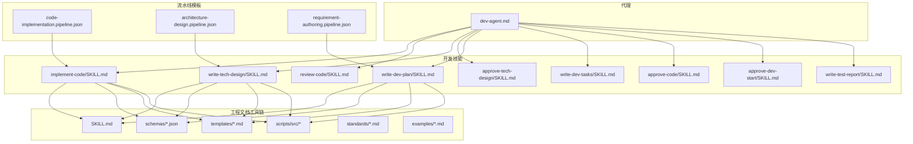
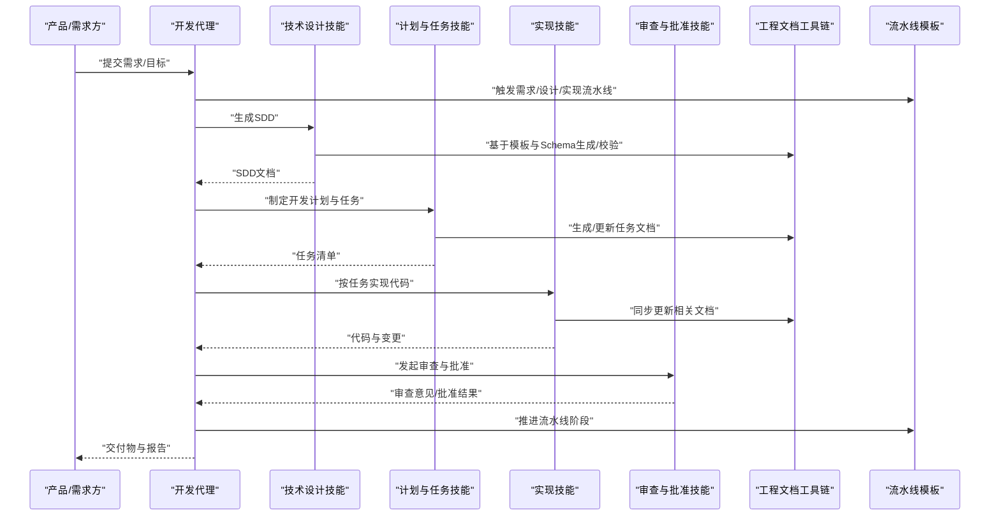
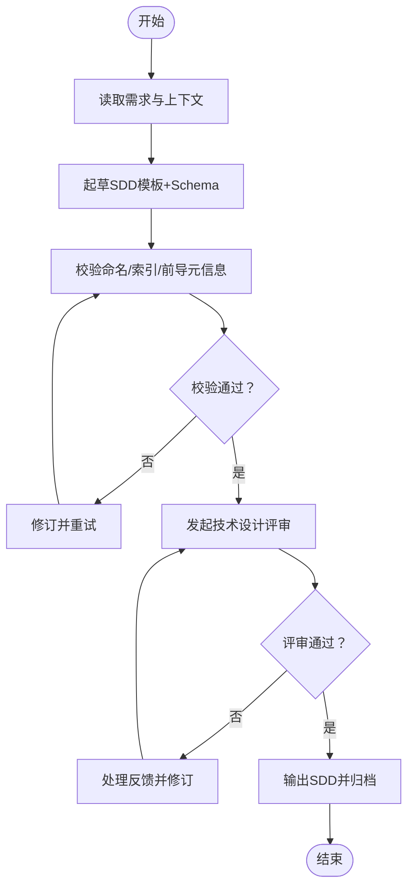
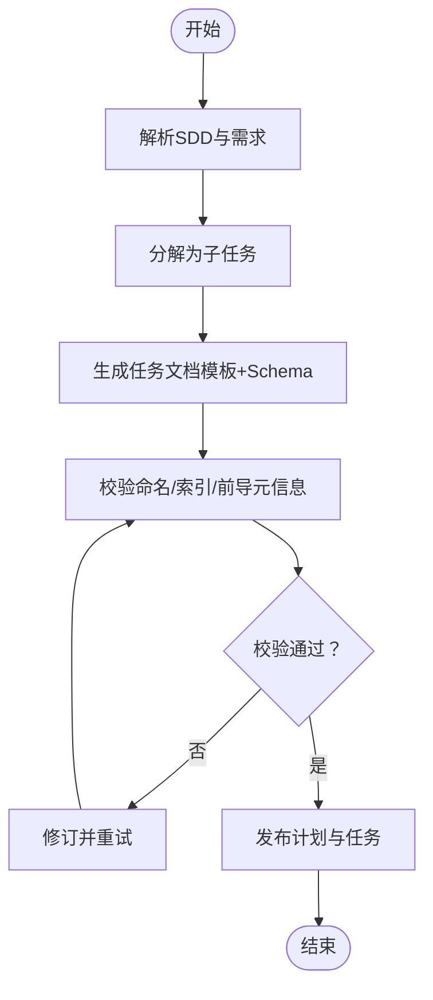
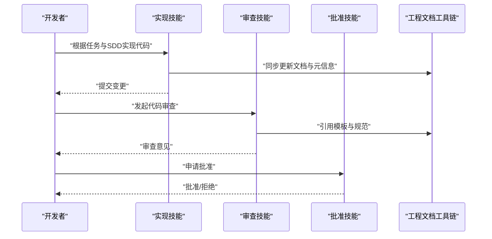
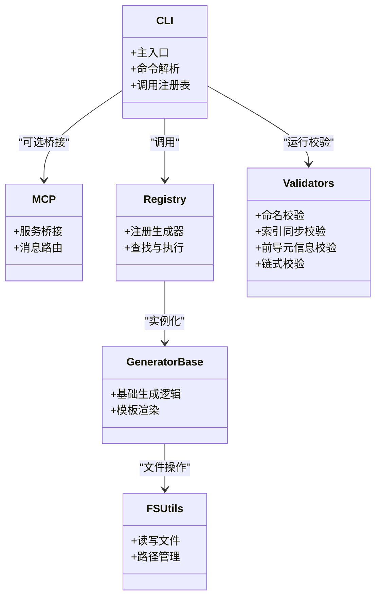
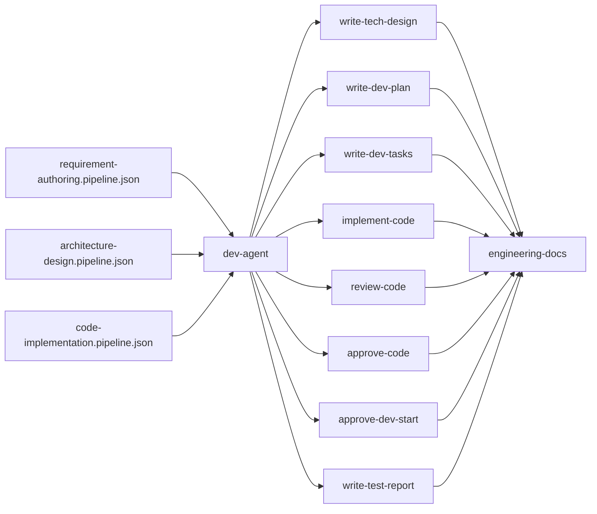

# 开发代理

<cite>
**本文引用的文件**   
- [agents/dev-agent.md](file://agents/dev-agent.md)
- [skills/develop/implement-code/SKILL.md](file://skills/develop/implement-code/SKILL.md)
- [skills/develop/review-code/SKILL.md](file://skills/develop/review-code/SKILL.md)
- [skills/develop/write-tech-design/SKILL.md](file://skills/develop/write-tech-design/SKILL.md)
- [skills/develop/approve-tech-design/SKILL.md](file://skills/develop/approve-tech-design/SKILL.md)
- [skills/develop/write-dev-plan/SKILL.md](file://skills/develop/write-dev-plan/SKILL.md)
- [skills/develop/write-dev-tasks/SKILL.md](file://skills/develop/write-dev-tasks/SKILL.md)
- [skills/develop/approve-code/SKILL.md](file://skills/develop/approve-code/SKILL.md)
- [skills/develop/approve-dev-start/SKILL.md](file://skills/develop/approve-dev-start/SKILL.md)
- [skills/develop/write-test-report/SKILL.md](file://skills/develop/write-test-report/SKILL.md)
- [pipeline-templates/code-implementation.pipeline.json](file://pipeline-templates/code-implementation.pipeline.json)
- [pipeline-templates/architecture-design.pipeline.json](file://pipeline-templates/architecture-design.pipeline.json)
- [pipeline-templates/requirement-authoring.pipeline.json](file://pipeline-templates/requirement-authoring.pipeline.json)
- [skills/shared/engineering-docs/schemas/common-defs.schema.json](file://skills/shared/engineering-docs/schemas/common-defs.schema.json)
- [skills/shared/engineering-docs/schemas/prd.schema.json](file://skills/shared/engineering-docs/schemas/prd.schema.json)
- [skills/shared/engineering-docs/schemas/sdd.schema.json](file://skills/shared/engineering-docs/schemas/sdd.schema.json)
- [skills/shared/engineering-docs/schemas/task.schema.json](file://skills/shared/engineering-docs/schemas/task.schema.json)
- [skills/shared/engineering-docs/templates/PRD-template.md](file://skills/shared/engineering-docs/templates/PRD-template.md)
- [skills/shared/engineering-docs/templates/SDD-template.md](file://skills/shared/engineering-docs/templates/SDD-template.md)
- [skills/shared/engineering-docs/templates/TASK-template.md](file://skills/shared/engineering-docs/templates/TASK-template.md)
- [skills/shared/engineering-docs/scripts/src/cli.ts](file://skills/shared/engineering-docs/scripts/src/cli.ts)
- [skills/shared/engineering-docs/scripts/src/mcp.ts](file://skills/shared/engineering-docs/scripts/src/mcp.ts)
- [skills/shared/engineering-docs/scripts/src/registry.ts](file://skills/shared/engineering-docs/scripts/src/registry.ts)
- [skills/shared/engineering-docs/scripts/src/generators/base.ts](file://skills/shared/engineering-docs/scripts/src/generators/base.ts)
- [skills/shared/engineering-docs/scripts/src/utils/fs.ts](file://skills/shared/engineering-docs/scripts/src/utils/fs.ts)
- [skills/shared/engineering-docs/scripts/src/validators/index-sync.ts](file://skills/shared/engineering-docs/scripts/src/validators/index-sync.ts)
- [skills/shared/engineering-docs/scripts/src/validators/naming.ts](file://skills/shared/engineering-docs/scripts/src/validators/naming.ts)
- [skills/shared/engineering-docs/scripts/src/validators/frontmatter.ts](file://skills/shared/engineering-docs/scripts/src/validators/frontmatter.ts)
- [skills/shared/engineering-docs/scripts/src/validators/chain.ts](file://skills/shared/engineering-docs/scripts/src/validators/chain.ts)
- [skills/shared/engineering-docs/scripts/package.json](file://skills/shared/engineering-docs/scripts/package.json)
- [skills/shared/engineering-docs/scripts/tsconfig.json](file://skills/shared/engineering-docs/scripts/tsconfig.json)
- [skills/shared/engineering-docs/scripts/vitest.config.ts](file://skills/shared/engineering-docs/scripts/vitest.config.ts)
- [skills/shared/engineering-docs/standards/ENGINEERING-STRUCTURE-TEAM.md](file://skills/shared/engineering-docs/standards/ENGINEERING-STRUCTURE-TEAM.md)
- [skills/shared/engineering-docs/examples/PLAN-v1.0-001-sample-mvp.md](file://skills/shared/engineering-docs/examples/PLAN-v1.0-001-sample-mvp.md)
- [skills/shared/engineering-docs/examples/PRD-001-sample-login.md](file://skills/shared/engineering-docs/examples/PRD-001-sample-login.md)
- [skills/shared/engineering-docs/SKILL.md](file://skills/shared/engineering-docs/SKILL.md)
- [skills/shared/validate-doc/SKILL.md](file://skills/shared/validate-doc/SKILL.md)
- [skills/sync/push-progress/SKILL.md](file://skills/sync/push-progress/SKILL.md)
- [skills/sync/pull-progress/SKILL.md](file://skills/sync/pull-progress/SKILL.md)
- [skills/sync/handover-cr/SKILL.md](file://skills/sync/handover-cr/SKILL.md)
- [skills/sync/resume-from-remote/SKILL.md](file://skills/sync/resume-from-remote/SKILL.md)
- [skills/writeback/writeback-prd-sdd/SKILL.md](file://skills/writeback/writeback-prd-sdd/SKILL.md)
- [skills/writeback/writeback-tasks/SKILL.md](file://skills/writeback/writeback-tasks/SKILL.md)
- [skills/writeback/writeback-traceability/SKILL.md](file://skills/writeback/writeback-traceability/SKILL.md)
- [skills/writeback/merge-feature-branch/SKILL.md](file://skills/writeback/merge-feature-branch/SKILL.md)
- [AGENT-SKILL-MATRIX.md](file://AGENT-SKILL-MATRIX.md)
- [dir-graph.yaml](file://dir-graph.yaml)
</cite>

## 目录
1. [简介](#简介)
2. [项目结构](#项目结构)
3. [核心组件](#核心组件)
4. [架构总览](#架构总览)
5. [详细组件分析](#详细组件分析)
6. [依赖分析](#依赖分析)
7. [性能考虑](#性能考虑)
8. [故障排查指南](#故障排查指南)
9. [结论](#结论)
10. [附录](#附录)

## 简介
本文件为“开发代理”的完整使用文档，面向工程团队与个人开发者。开发代理聚焦于以下职责：
- 代码实现辅助：将需求与设计转化为可执行的开发任务与代码骨架，支持多语言与框架适配。
- 技术方案设计：输出结构化技术设计（SDD），并驱动评审与批准流程。
- 代码审查与质量保证：提供审查清单、影响面分析与测试报告生成。
- 智能编码能力：结合工程文档规范、模板与校验器，确保产出一致性与可追溯性。

同时，文档覆盖配置项、工作流集成（从需求到代码、单元测试生成、文档同步）、IDE与版本控制协作模式，以及效率提升与质量改进实践。

## 项目结构
仓库采用“代理 + 技能 + 流水线模板 + 共享工程文档工具链”的分层组织方式：
- agents：定义各角色代理的职责与入口说明。
- skills：按领域划分的能力包，包含开发、评审、规划、需求、同步、回写等。
- pipeline-templates：端到端流水线模板，串联需求、设计、实现与回写。
- skills/shared/engineering-docs：工程文档标准、模板、Schema、脚本与示例，支撑文档一致性、校验与生成。

图表来源
- [agents/dev-agent.md:1-200](file://agents/dev-agent.md#L1-L200)
- [skills/develop/implement-code/SKILL.md:1-200](file://skills/develop/implement-code/SKILL.md#L1-L200)
- [skills/develop/write-tech-design/SKILL.md:1-200](file://skills/develop/write-tech-design/SKILL.md#L1-L200)
- [skills/develop/write-dev-plan/SKILL.md:1-200](file://skills/develop/write-dev-plan/SKILL.md#L1-L200)
- [pipeline-templates/code-implementation.pipeline.json:1-200](file://pipeline-templates/code-implementation.pipeline.json#L1-L200)
- [pipeline-templates/architecture-design.pipeline.json:1-200](file://pipeline-templates/architecture-design.pipeline.json#L1-L200)
- [pipeline-templates/requirement-authoring.pipeline.json:1-200](file://pipeline-templates/requirement-authoring.pipeline.json#L1-L200)
- [skills/shared/engineering-docs/SKILL.md:1-200](file://skills/shared/engineering-docs/SKILL.md#L1-L200)

章节来源
- [agents/dev-agent.md:1-200](file://agents/dev-agent.md#L1-L200)
- [AGENT-SKILL-MATRIX.md:1-200](file://AGENT-SKILL-MATRIX.md#L1-L200)
- [dir-graph.yaml:1-200](file://dir-graph.yaml#L1-L200)

## 核心组件
- 开发代理（dev-agent）：作为统一入口，协调开发相关技能与流水线，负责将需求与设计落地为可执行任务与代码。
- 开发技能集：
  - 设计与计划：技术设计编写与评审、开发计划与任务拆解。
  - 实现与审查：代码实现、代码审查、开发启动审批、代码批准。
  - 测试与报告：测试报告生成。
- 工程文档工具链：提供文档标准、模板、Schema、校验器与生成脚本，保障文档一致性与可验证性。
- 流水线模板：将需求、设计、实现与回写串联成端到端流程。

章节来源
- [agents/dev-agent.md:1-200](file://agents/dev-agent.md#L1-L200)
- [skills/develop/write-tech-design/SKILL.md:1-200](file://skills/develop/write-tech-design/SKILL.md#L1-L200)
- [skills/develop/approve-tech-design/SKILL.md:1-200](file://skills/develop/approve-tech-design/SKILL.md#L1-L200)
- [skills/develop/write-dev-plan/SKILL.md:1-200](file://skills/develop/write-dev-plan/SKILL.md#L1-L200)
- [skills/develop/write-dev-tasks/SKILL.md:1-200](file://skills/develop/write-dev-tasks/SKILL.md#L1-L200)
- [skills/develop/implement-code/SKILL.md:1-200](file://skills/develop/implement-code/SKILL.md#L1-L200)
- [skills/develop/review-code/SKILL.md:1-200](file://skills/develop/review-code/SKILL.md#L1-L200)
- [skills/develop/approve-code/SKILL.md:1-200](file://skills/develop/approve-code/SKILL.md#L1-L200)
- [skills/develop/approve-dev-start/SKILL.md:1-200](file://skills/develop/approve-dev-start/SKILL.md#L1-L200)
- [skills/develop/write-test-report/SKILL.md:1-200](file://skills/develop/write-test-report/SKILL.md#L1-L200)
- [skills/shared/engineering-docs/SKILL.md:1-200](file://skills/shared/engineering-docs/SKILL.md#L1-L200)

## 架构总览
开发代理通过“技能编排 + 工程文档工具链 + 流水线模板”形成闭环：
- 输入：需求文档（PRD）、历史上下文、约束与规范。
- 处理：技术设计（SDD）→ 开发计划与任务 → 代码实现 → 审查与批准 → 测试与报告。
- 输出：可合并的代码分支、更新后的文档与任务状态、可追踪的变更链路。

图表来源
- [pipeline-templates/requirement-authoring.pipeline.json:1-200](file://pipeline-templates/requirement-authoring.pipeline.json#L1-L200)
- [pipeline-templates/architecture-design.pipeline.json:1-200](file://pipeline-templates/architecture-design.pipeline.json#L1-L200)
- [pipeline-templates/code-implementation.pipeline.json:1-200](file://pipeline-templates/code-implementation.pipeline.json#L1-L200)
- [skills/develop/write-tech-design/SKILL.md:1-200](file://skills/develop/write-tech-design/SKILL.md#L1-L200)
- [skills/develop/write-dev-plan/SKILL.md:1-200](file://skills/develop/write-dev-plan/SKILL.md#L1-L200)
- [skills/develop/implement-code/SKILL.md:1-200](file://skills/develop/implement-code/SKILL.md#L1-L200)
- [skills/develop/review-code/SKILL.md:1-200](file://skills/develop/review-code/SKILL.md#L1-L200)
- [skills/shared/engineering-docs/SKILL.md:1-200](file://skills/shared/engineering-docs/SKILL.md#L1-L200)

## 详细组件分析

### 开发代理（dev-agent）
- 职责定位：统一协调开发相关技能与流水线，确保从需求到交付的一致性与可追溯性。
- 关键行为：
  - 解析需求与上下文，选择合适的设计与实现路径。
  - 编排技术设计、计划与任务、实现、审查与批准等步骤。
  - 驱动工程文档工具链进行文档生成与校验。
  - 与流水线模板对接，自动化推进阶段与状态。

章节来源
- [agents/dev-agent.md:1-200](file://agents/dev-agent.md#L1-L200)

### 技术设计与评审（write-tech-design / approve-tech-design）
- 输出：结构化技术设计文档（SDD），包含模块边界、接口、数据模型、非功能要求与风险。
- 评审要点：可行性、兼容性、扩展性、安全性与可测试性。
- 与工程文档工具链的关系：
  - 使用 SDD 模板与 Schema 保证结构与字段完整性。
  - 通过校验器检查命名、索引同步与前导元信息。

图表来源
- [skills/develop/write-tech-design/SKILL.md:1-200](file://skills/develop/write-tech-design/SKILL.md#L1-L200)
- [skills/develop/approve-tech-design/SKILL.md:1-200](file://skills/develop/approve-tech-design/SKILL.md#L1-L200)
- [skills/shared/engineering-docs/schemas/sdd.schema.json:1-200](file://skills/shared/engineering-docs/schemas/sdd.schema.json#L1-L200)
- [skills/shared/engineering-docs/templates/SDD-template.md:1-200](file://skills/shared/engineering-docs/templates/SDD-template.md#L1-L200)
- [skills/shared/engineering-docs/scripts/src/validators/naming.ts:1-200](file://skills/shared/engineering-docs/scripts/src/validators/naming.ts#L1-L200)
- [skills/shared/engineering-docs/scripts/src/validators/index-sync.ts:1-200](file://skills/shared/engineering-docs/scripts/src/validators/index-sync.ts#L1-L200)
- [skills/shared/engineering-docs/scripts/src/validators/frontmatter.ts:1-200](file://skills/shared/engineering-docs/scripts/src/validators/frontmatter.ts#L1-L200)

章节来源
- [skills/develop/write-tech-design/SKILL.md:1-200](file://skills/develop/write-tech-design/SKILL.md#L1-L200)
- [skills/develop/approve-tech-design/SKILL.md:1-200](file://skills/develop/approve-tech-design/SKILL.md#L1-L200)
- [skills/shared/engineering-docs/schemas/sdd.schema.json:1-200](file://skills/shared/engineering-docs/schemas/sdd.schema.json#L1-L200)
- [skills/shared/engineering-docs/templates/SDD-template.md:1-200](file://skills/shared/engineering-docs/templates/SDD-template.md#L1-L200)
- [skills/shared/engineering-docs/scripts/src/validators/naming.ts:1-200](file://skills/shared/engineering-docs/scripts/src/validators/naming.ts#L1-L200)
- [skills/shared/engineering-docs/scripts/src/validators/index-sync.ts:1-200](file://skills/shared/engineering-docs/scripts/src/validators/index-sync.ts#L1-L200)
- [skills/shared/engineering-docs/scripts/src/validators/frontmatter.ts:1-200](file://skills/shared/engineering-docs/scripts/src/validators/frontmatter.ts#L1-L200)

### 开发计划与任务（write-dev-plan / write-dev-tasks）
- 输出：开发计划与任务清单（TASK），明确范围、里程碑、依赖与验收标准。
- 与工程文档工具链的关系：
  - 使用 TASK 模板与 Schema 保证字段完整与一致性。
  - 通过校验器确保命名与索引同步。

图表来源
- [skills/develop/write-dev-plan/SKILL.md:1-200](file://skills/develop/write-dev-plan/SKILL.md#L1-L200)
- [skills/develop/write-dev-tasks/SKILL.md:1-200](file://skills/develop/write-dev-tasks/SKILL.md#L1-L200)
- [skills/shared/engineering-docs/schemas/task.schema.json:1-200](file://skills/shared/engineering-docs/schemas/task.schema.json#L1-L200)
- [skills/shared/engineering-docs/templates/TASK-template.md:1-200](file://skills/shared/engineering-docs/templates/TASK-template.md#L1-L200)
- [skills/shared/engineering-docs/scripts/src/validators/naming.ts:1-200](file://skills/shared/engineering-docs/scripts/src/validators/naming.ts#L1-L200)
- [skills/shared/engineering-docs/scripts/src/validators/index-sync.ts:1-200](file://skills/shared/engineering-docs/scripts/src/validators/index-sync.ts#L1-L200)
- [skills/shared/engineering-docs/scripts/src/validators/frontmatter.ts:1-200](file://skills/shared/engineering-docs/scripts/src/validators/frontmatter.ts#L1-L200)

章节来源
- [skills/develop/write-dev-plan/SKILL.md:1-200](file://skills/develop/write-dev-plan/SKILL.md#L1-L200)
- [skills/develop/write-dev-tasks/SKILL.md:1-200](file://skills/develop/write-dev-tasks/SKILL.md#L1-L200)
- [skills/shared/engineering-docs/schemas/task.schema.json:1-200](file://skills/shared/engineering-docs/schemas/task.schema.json#L1-L200)
- [skills/shared/engineering-docs/templates/TASK-template.md:1-200](file://skills/shared/engineering-docs/templates/TASK-template.md#L1-L200)
- [skills/shared/engineering-docs/scripts/src/validators/naming.ts:1-200](file://skills/shared/engineering-docs/scripts/src/validators/naming.ts#L1-L200)
- [skills/shared/engineering-docs/scripts/src/validators/index-sync.ts:1-200](file://skills/shared/engineering-docs/scripts/src/validators/index-sync.ts#L1-L200)
- [skills/shared/engineering-docs/scripts/src/validators/frontmatter.ts:1-200](file://skills/shared/engineering-docs/scripts/src/validators/frontmatter.ts#L1-L200)

### 代码实现与审查（implement-code / review-code / approve-code / approve-dev-start）
- 实现：依据任务与SDD生成代码骨架与实现，遵循工程文档与命名规范。
- 审查：对照审查清单与影响面分析，确保质量与一致性。
- 批准：在满足条件后进入合并或发布阶段。
- 开发启动审批：在进入实现前确认前置条件（设计批准、任务就绪、环境就绪）。

图表来源
- [skills/develop/implement-code/SKILL.md:1-200](file://skills/develop/implement-code/SKILL.md#L1-L200)
- [skills/develop/review-code/SKILL.md:1-200](file://skills/develop/review-code/SKILL.md#L1-L200)
- [skills/develop/approve-code/SKILL.md:1-200](file://skills/develop/approve-code/SKILL.md#L1-L200)
- [skills/develop/approve-dev-start/SKILL.md:1-200](file://skills/develop/approve-dev-start/SKILL.md#L1-L200)
- [skills/shared/engineering-docs/SKILL.md:1-200](file://skills/shared/engineering-docs/SKILL.md#L1-L200)

章节来源
- [skills/develop/implement-code/SKILL.md:1-200](file://skills/develop/implement-code/SKILL.md#L1-L200)
- [skills/develop/review-code/SKILL.md:1-200](file://skills/develop/review-code/SKILL.md#L1-L200)
- [skills/develop/approve-code/SKILL.md:1-200](file://skills/develop/approve-code/SKILL.md#L1-L200)
- [skills/develop/approve-dev-start/SKILL.md:1-200](file://skills/develop/approve-dev-start/SKILL.md#L1-L200)
- [skills/shared/engineering-docs/SKILL.md:1-200](file://skills/shared/engineering-docs/SKILL.md#L1-L200)

### 测试与报告（write-test-report）
- 输出：测试报告，汇总用例覆盖、失败项与回归建议。
- 与工程文档工具链的关系：引用模板与规范，确保报告格式与字段一致。

章节来源
- [skills/develop/write-test-report/SKILL.md:1-200](file://skills/develop/write-test-report/SKILL.md#L1-L200)
- [skills/shared/engineering-docs/SKILL.md:1-200](file://skills/shared/engineering-docs/SKILL.md#L1-L200)

### 工程文档工具链（shared/engineering-docs）
- 标准与模板：提供 PRD、SDD、TASK 等模板与团队结构标准。
- Schema 校验：common-defs、prd、sdd、task 等 Schema 确保文档结构正确。
- 生成与校验脚本：CLI、MCP、注册表、生成器、文件系统工具、校验器（命名、索引同步、前导元信息、链式校验）。
- 示例：提供 PLAN 与 PRD 示例，帮助快速上手。

图表来源
- [skills/shared/engineering-docs/scripts/src/cli.ts:1-200](file://skills/shared/engineering-docs/scripts/src/cli.ts#L1-L200)
- [skills/shared/engineering-docs/scripts/src/mcp.ts:1-200](file://skills/shared/engineering-docs/scripts/src/mcp.ts#L1-L200)
- [skills/shared/engineering-docs/scripts/src/registry.ts:1-200](file://skills/shared/engineering-docs/scripts/src/registry.ts#L1-L200)
- [skills/shared/engineering-docs/scripts/src/generators/base.ts:1-200](file://skills/shared/engineering-docs/scripts/src/generators/base.ts#L1-L200)
- [skills/shared/engineering-docs/scripts/src/utils/fs.ts:1-200](file://skills/shared/engineering-docs/scripts/src/utils/fs.ts#L1-L200)
- [skills/shared/engineering-docs/scripts/src/validators/naming.ts:1-200](file://skills/shared/engineering-docs/scripts/src/validators/naming.ts#L1-L200)
- [skills/shared/engineering-docs/scripts/src/validators/index-sync.ts:1-200](file://skills/shared/engineering-docs/scripts/src/validators/index-sync.ts#L1-L200)
- [skills/shared/engineering-docs/scripts/src/validators/frontmatter.ts:1-200](file://skills/shared/engineering-docs/scripts/src/validators/frontmatter.ts#L1-L200)
- [skills/shared/engineering-docs/scripts/src/validators/chain.ts:1-200](file://skills/shared/engineering-docs/scripts/src/validators/chain.ts#L1-L200)

章节来源
- [skills/shared/engineering-docs/SKILL.md:1-200](file://skills/shared/engineering-docs/SKILL.md#L1-L200)
- [skills/shared/engineering-docs/schemas/common-defs.schema.json:1-200](file://skills/shared/engineering-docs/schemas/common-defs.schema.json#L1-L200)
- [skills/shared/engineering-docs/schemas/prd.schema.json:1-200](file://skills/shared/engineering-docs/schemas/prd.schema.json#L1-L200)
- [skills/shared/engineering-docs/schemas/sdd.schema.json:1-200](file://skills/shared/engineering-docs/schemas/sdd.schema.json#L1-L200)
- [skills/shared/engineering-docs/schemas/task.schema.json:1-200](file://skills/shared/engineering-docs/schemas/task.schema.json#L1-L200)
- [skills/shared/engineering-docs/templates/PRD-template.md:1-200](file://skills/shared/engineering-docs/templates/PRD-template.md#L1-L200)
- [skills/shared/engineering-docs/templates/SDD-template.md:1-200](file://skills/shared/engineering-docs/templates/SDD-template.md#L1-L200)
- [skills/shared/engineering-docs/templates/TASK-template.md:1-200](file://skills/shared/engineering-docs/templates/TASK-template.md#L1-L200)
- [skills/shared/engineering-docs/scripts/src/cli.ts:1-200](file://skills/shared/engineering-docs/scripts/src/cli.ts#L1-L200)
- [skills/shared/engineering-docs/scripts/src/mcp.ts:1-200](file://skills/shared/engineering-docs/scripts/src/mcp.ts#L1-L200)
- [skills/shared/engineering-docs/scripts/src/registry.ts:1-200](file://skills/shared/engineering-docs/scripts/src/registry.ts#L1-L200)
- [skills/shared/engineering-docs/scripts/src/generators/base.ts:1-200](file://skills/shared/engineering-docs/scripts/src/generators/base.ts#L1-L200)
- [skills/shared/engineering-docs/scripts/src/utils/fs.ts:1-200](file://skills/shared/engineering-docs/scripts/src/utils/fs.ts#L1-L200)
- [skills/shared/engineering-docs/scripts/src/validators/naming.ts:1-200](file://skills/shared/engineering-docs/scripts/src/validators/naming.ts#L1-L200)
- [skills/shared/engineering-docs/scripts/src/validators/index-sync.ts:1-200](file://skills/shared/engineering-docs/scripts/src/validators/index-sync.ts#L1-L200)
- [skills/shared/engineering-docs/scripts/src/validators/frontmatter.ts:1-200](file://skills/shared/engineering-docs/scripts/src/validators/frontmatter.ts#L1-L200)
- [skills/shared/engineering-docs/scripts/src/validators/chain.ts:1-200](file://skills/shared/engineering-docs/scripts/src/validators/chain.ts#L1-L200)
- [skills/shared/engineering-docs/standards/ENGINEERING-STRUCTURE-TEAM.md:1-200](file://skills/shared/engineering-docs/standards/ENGINEERING-STRUCTURE-TEAM.md#L1-L200)
- [skills/shared/engineering-docs/examples/PLAN-v1.0-001-sample-mvp.md:1-200](file://skills/shared/engineering-docs/examples/PLAN-v1.0-001-sample-mvp.md#L1-L200)
- [skills/shared/engineering-docs/examples/PRD-001-sample-login.md:1-200](file://skills/shared/engineering-docs/examples/PRD-001-sample-login.md#L1-L200)

### 同步与回写（sync / writeback）
- 同步：推送/拉取进度、远程恢复、交接CR，保障跨环境与团队协作的一致性。
- 回写：将PRD/SDD、任务与可追溯性信息回写到目标位置，保持文档与代码联动。

章节来源
- [skills/sync/push-progress/SKILL.md:1-200](file://skills/sync/push-progress/SKILL.md#L1-L200)
- [skills/sync/pull-progress/SKILL.md:1-200](file://skills/sync/pull-progress/SKILL.md#L1-L200)
- [skills/sync/handover-cr/SKILL.md:1-200](file://skills/sync/handover-cr/SKILL.md#L1-L200)
- [skills/sync/resume-from-remote/SKILL.md:1-200](file://skills/sync/resume-from-remote/SKILL.md#L1-L200)
- [skills/writeback/writeback-prd-sdd/SKILL.md:1-200](file://skills/writeback/writeback-prd-sdd/SKILL.md#L1-L200)
- [skills/writeback/writeback-tasks/SKILL.md:1-200](file://skills/writeback/writeback-tasks/SKILL.md#L1-L200)
- [skills/writeback/writeback-traceability/SKILL.md:1-200](file://skills/writeback/writeback-traceability/SKILL.md#L1-L200)
- [skills/writeback/merge-feature-branch/SKILL.md:1-200](file://skills/writeback/merge-feature-branch/SKILL.md#L1-L200)

## 依赖分析
- 代理与技能：dev-agent 依赖开发相关技能；技能之间通过工程文档工具链解耦。
- 工程文档工具链内部：CLI 调用注册表与生成器；校验器独立且可组合；MCP 提供外部桥接。
- 流水线模板：串联需求、设计、实现与回写，驱动代理与技能执行。

图表来源
- [agents/dev-agent.md:1-200](file://agents/dev-agent.md#L1-L200)
- [skills/develop/write-tech-design/SKILL.md:1-200](file://skills/develop/write-tech-design/SKILL.md#L1-L200)
- [skills/develop/write-dev-plan/SKILL.md:1-200](file://skills/develop/write-dev-plan/SKILL.md#L1-L200)
- [skills/develop/write-dev-tasks/SKILL.md:1-200](file://skills/develop/write-dev-tasks/SKILL.md#L1-L200)
- [skills/develop/implement-code/SKILL.md:1-200](file://skills/develop/implement-code/SKILL.md#L1-L200)
- [skills/develop/review-code/SKILL.md:1-200](file://skills/develop/review-code/SKILL.md#L1-L200)
- [skills/develop/approve-code/SKILL.md:1-200](file://skills/develop/approve-code/SKILL.md#L1-L200)
- [skills/develop/approve-dev-start/SKILL.md:1-200](file://skills/develop/approve-dev-start/SKILL.md#L1-L200)
- [skills/develop/write-test-report/SKILL.md:1-200](file://skills/develop/write-test-report/SKILL.md#L1-L200)
- [skills/shared/engineering-docs/SKILL.md:1-200](file://skills/shared/engineering-docs/SKILL.md#L1-L200)
- [pipeline-templates/requirement-authoring.pipeline.json:1-200](file://pipeline-templates/requirement-authoring.pipeline.json#L1-L200)
- [pipeline-templates/architecture-design.pipeline.json:1-200](file://pipeline-templates/architecture-design.pipeline.json#L1-L200)
- [pipeline-templates/code-implementation.pipeline.json:1-200](file://pipeline-templates/code-implementation.pipeline.json#L1-L200)

章节来源
- [AGENT-SKILL-MATRIX.md:1-200](file://AGENT-SKILL-MATRIX.md#L1-L200)
- [dir-graph.yaml:1-200](file://dir-graph.yaml#L1-L200)

## 性能考虑
- 文档生成与校验：优先批量处理与缓存中间产物，减少重复IO与解析开销。
- 流水线并行：对无依赖的任务（如多任务并行实现）进行并发执行，缩短整体周期。
- 增量更新：仅对变更部分重新生成与校验，避免全量重跑。
- 资源限制：对大型仓库或长文档设置超时与内存上限，防止阻塞。

[本节为通用指导，不直接分析具体文件]

## 故障排查指南
- 文档校验失败：
  - 检查命名规则与索引同步是否一致。
  - 核对前导元信息与模板字段是否齐全。
  - 使用链式校验器逐步定位问题。
- 流水线卡住：
  - 确认上游阶段状态与依赖是否满足。
  - 查看同步与回写日志，确认远端状态一致。
- 代码审查阻塞：
  - 对照审查清单逐项修复。
  - 确保测试报告与覆盖率达标。

章节来源
- [skills/shared/engineering-docs/scripts/src/validators/naming.ts:1-200](file://skills/shared/engineering-docs/scripts/src/validators/naming.ts#L1-L200)
- [skills/shared/engineering-docs/scripts/src/validators/index-sync.ts:1-200](file://skills/shared/engineering-docs/scripts/src/validators/index-sync.ts#L1-L200)
- [skills/shared/engineering-docs/scripts/src/validators/frontmatter.ts:1-200](file://skills/shared/engineering-docs/scripts/src/validators/frontmatter.ts#L1-L200)
- [skills/shared/engineering-docs/scripts/src/validators/chain.ts:1-200](file://skills/shared/engineering-docs/scripts/src/validators/chain.ts#L1-L200)
- [skills/sync/push-progress/SKILL.md:1-200](file://skills/sync/push-progress/SKILL.md#L1-L200)
- [skills/sync/pull-progress/SKILL.md:1-200](file://skills/sync/pull-progress/SKILL.md#L1-L200)
- [skills/develop/review-code/SKILL.md:1-200](file://skills/develop/review-code/SKILL.md#L1-L200)
- [skills/develop/write-test-report/SKILL.md:1-200](file://skills/develop/write-test-report/SKILL.md#L1-L200)

## 结论
开发代理以“技能编排 + 工程文档工具链 + 流水线模板”为核心，实现了从需求到交付的标准化与自动化。通过严格的文档校验与审查流程，显著提升代码质量与团队协作效率。建议团队在落地时结合现有IDE与版本控制系统，完善本地与CI校验，持续优化流水线与技能配置。

[本节为总结，不直接分析具体文件]

## 附录

### 配置选项与实践指南
- 编程语言与框架适配：
  - 在实现技能中指定目标语言与框架，结合工程文档模板生成对应骨架与约定。
  - 参考工程文档标准与示例，确保命名与结构一致。
- 编码规范检查：
  - 启用命名与索引同步校验，确保文档与代码命名对齐。
  - 使用前导元信息校验，保证文档头部字段完整。
- 重构建议：
  - 基于影响面分析与审查清单，识别高风险变更点，优先重构。
- 工作流集成：
  - 需求到代码：需求文档（PRD）→ 技术设计（SDD）→ 计划与任务（TASK）→ 实现 → 审查与批准 → 测试报告。
  - 单元测试生成：在实现阶段自动生成测试骨架，并在测试报告中汇总覆盖情况。
  - 文档同步更新：实现完成后自动回写PRD/SDD与任务状态，保持可追溯性。
- IDE与版本控制协作：
  - 在IDE中集成工程文档校验器与模板提示，提前发现不一致。
  - 与版本控制系统联动，在提交与合并前触发校验与审查。
- 缺陷跟踪系统协作：
  - 将任务与变更关联至缺陷跟踪系统，确保问题闭环与审计。

章节来源
- [skills/develop/implement-code/SKILL.md:1-200](file://skills/develop/implement-code/SKILL.md#L1-L200)
- [skills/shared/engineering-docs/standards/ENGINEERING-STRUCTURE-TEAM.md:1-200](file://skills/shared/engineering-docs/standards/ENGINEERING-STRUCTURE-TEAM.md#L1-L200)
- [skills/shared/engineering-docs/examples/PRD-001-sample-login.md:1-200](file://skills/shared/engineering-docs/examples/PRD-001-sample-login.md#L1-L200)
- [skills/shared/engineering-docs/examples/PLAN-v1.0-001-sample-mvp.md:1-200](file://skills/shared/engineering-docs/examples/PLAN-v1.0-001-sample-mvp.md#L1-L200)
- [skills/shared/engineering-docs/scripts/package.json:1-200](file://skills/shared/engineering-docs/scripts/package.json#L1-L200)
- [skills/shared/engineering-docs/scripts/tsconfig.json:1-200](file://skills/shared/engineering-docs/scripts/tsconfig.json#L1-L200)
- [skills/shared/engineering-docs/scripts/vitest.config.ts:1-200](file://skills/shared/engineering-docs/scripts/vitest.config.ts#L1-L200)