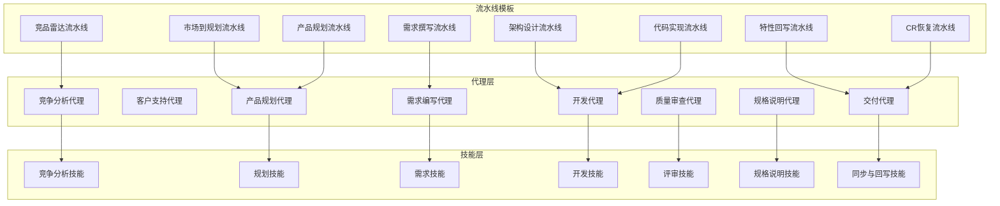
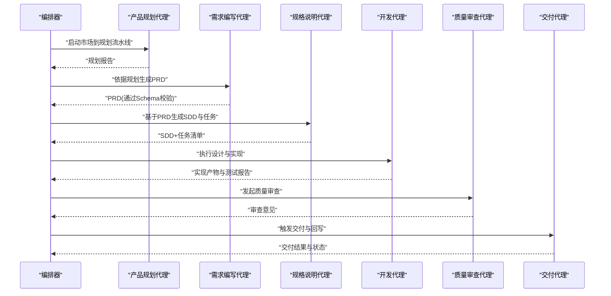
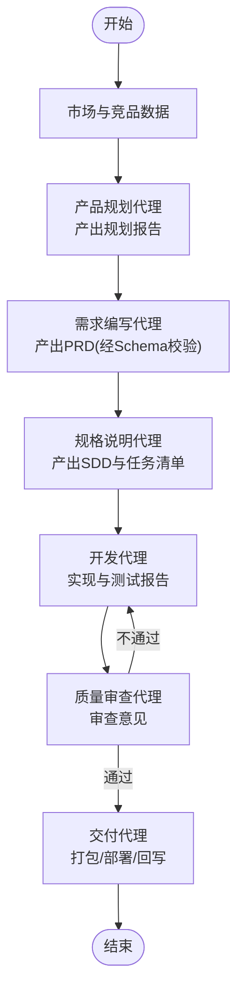
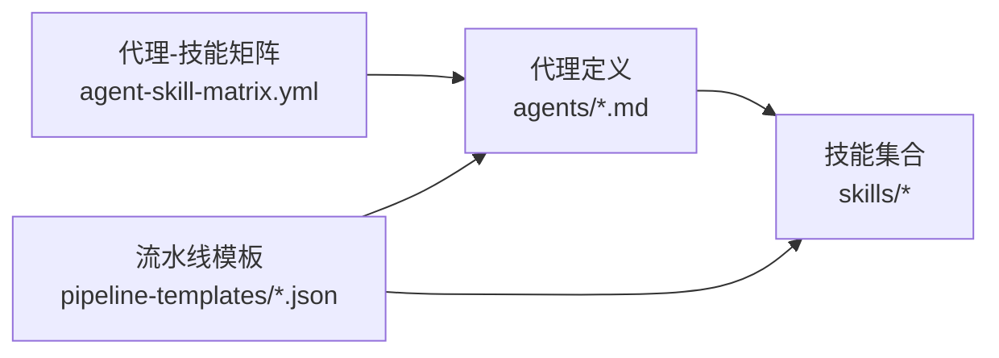

# 智能代理系统

<cite>
**本文引用的文件**   
- [agents/_index.yml](file://agents/_index.yml)
- [agents/competitive-analyst-agent.md](file://agents/competitive-analyst-agent.md)
- [agents/customer-support-agent.md](file://agents/customer-support-agent.md)
- [agents/delivery-agent.md](file://agents/delivery-agent.md)
- [agents/dev-agent.md](file://agents/dev-agent.md)
- [agents/product-planning-agent.md](file://agents/product-planning-agent.md)
- [agents/quality-reviewer-agent.md](file://agents/quality-reviewer-agent.md)
- [agents/requirement-writer.md](file://agents/requirement-writer.md)
- [agents/spec-agent.md](file://agents/spec-agent.md)
- [AGENT-SKILL-MATRIX.md](file://AGENT-SKILL-MATRIX.md)
- [agent-skill-matrix.yml](file://agent-skill-matrix.yml)
- [pipeline-templates/README.md](file://pipeline-templates/README.md)
- [pipeline-templates/architecture-design.pipeline.json](file://pipeline-templates/architecture-design.pipeline.json)
- [pipeline-templates/code-implementation.pipeline.json](file://pipeline-templates/code-implementation.pipeline.json)
- [pipeline-templates/competitive-radar.pipeline.json](file://pipeline-templates/competitive-radar.pipeline.json)
- [pipeline-templates/feature-writeback.pipeline.json](file://pipeline-templates/feature-writeback.pipeline.json)
- [pipeline-templates/market-to-plan.pipeline.json](file://pipeline-templates/market-to-plan.pipeline.json)
- [pipeline-templates/product-planning.pipeline.json](file://pipeline-templates/product-planning.pipeline.json)
- [pipeline-templates/requirement-authoring.pipeline.json](file://pipeline-templates/requirement-authoring.pipeline.json)
- [pipeline-templates/resume-cr.pipeline.json](file://pipeline-templates/resume-cr.pipeline.json)
- [skills/shared/engineering-docs/SKILL.md](file://skills/shared/engineering-docs/SKILL.md)
- [skills/shared/engineering-docs/schemas/common-defs.schema.json](file://skills/shared/engineering-docs/schemas/common-defs.schema.json)
- [skills/shared/engineering-docs/templates/PRD-template.md](file://skills/shared/engineering-docs/templates/PRD-template.md)
- [skills/shared/engineering-docs/templates/SDD-template.md](file://skills/shared/engineering-docs/templates/SDD-template.md)
- [skills/shared/engineering-docs/templates/TASK-template.md](file://skills/shared/engineering-docs/templates/TASK-template.md)
</cite>

## 目录
1. [简介](#简介)
2. [项目结构](#项目结构)
3. [核心组件](#核心组件)
4. [架构总览](#架构总览)
5. [详细组件分析](#详细组件分析)
6. [依赖分析](#依赖分析)
7. [性能考虑](#性能考虑)
8. [故障排查指南](#故障排查指南)
9. [结论](#结论)
10. [附录](#附录)

## 简介
本仓库围绕“智能代理系统”组织，提供一组面向产品、研发与交付流程的AI代理定义与配套技能（Skills）、流水线模板与工程文档规范。代理以“能力即服务”的方式组合工作流，通过标准化输入输出与可验证的文档模式，实现从市场洞察到需求、设计、开发、评审与交付的全链路自动化协作。

## 项目结构
- agents：内置代理的定义与说明，包含职责、能力边界、行为模式与配置项。
- skills：按领域划分的技能集合，包括竞争分析、规划、需求、开发、评审、规格说明、同步与回写等。
- pipeline-templates：端到端流水线模板，将多个代理与技能编排为可复用的工作流。
- shared/engineering-docs：工程文档标准、模板与Schema校验，确保产出物一致性。

图表来源
- [agents/_index.yml](file://agents/_index.yml)
- [pipeline-templates/README.md](file://pipeline-templates/README.md)
- [pipeline-templates/competitive-radar.pipeline.json](file://pipeline-templates/competitive-radar.pipeline.json)
- [pipeline-templates/market-to-plan.pipeline.json](file://pipeline-templates/market-to-plan.pipeline.json)
- [pipeline-templates/product-planning.pipeline.json](file://pipeline-templates/product-planning.pipeline.json)
- [pipeline-templates/requirement-authoring.pipeline.json](file://pipeline-templates/requirement-authoring.pipeline.json)
- [pipeline-templates/architecture-design.pipeline.json](file://pipeline-templates/architecture-design.pipeline.json)
- [pipeline-templates/code-implementation.pipeline.json](file://pipeline-templates/code-implementation.pipeline.json)
- [pipeline-templates/feature-writeback.pipeline.json](file://pipeline-templates/feature-writeback.pipeline.json)
- [pipeline-templates/resume-cr.pipeline.json](file://pipeline-templates/resume-cr.pipeline.json)

章节来源
- [agents/_index.yml](file://agents/_index.yml)
- [pipeline-templates/README.md](file://pipeline-templates/README.md)

## 核心组件
本节聚焦八大内置代理的职责、能力边界、行为模式与配置要点，并给出典型使用场景与协作关系。

- 竞争分析代理
  - 职责：采集竞品信息、生成分析报告、驱动规划建议。
  - 能力边界：聚焦外部市场与竞品动态，不直接修改内部代码或发布制品。
  - 行为模式：周期性扫描、增量更新、报告归档。
  - 配置要点：数据源、抓取频率、报告模板、归档路径。
  - 关联技能：竞争分析相关技能。
  - 参考路径
    - [agents/competitive-analyst-agent.md](file://agents/competitive-analyst-agent.md)
    - [AGENT-SKILL-MATRIX.md](file://AGENT-SKILL-MATRIX.md)
    - [agent-skill-matrix.yml](file://agent-skill-matrix.yml)

- 客户支持代理
  - 职责：处理用户反馈、工单分类、知识库检索与回复草稿。
  - 能力边界：对外沟通与知识检索，不直接变更生产配置。
  - 行为模式：事件驱动、多轮对话、SLA提醒。
  - 配置要点：渠道接入、知识库索引、升级策略。
  - 参考路径
    - [agents/customer-support-agent.md](file://agents/customer-support-agent.md)

- 交付代理
  - 职责：版本打包、部署协调、进度同步与回写。
  - 能力边界：执行受控操作（如分支合并、标签创建），需权限白名单。
  - 行为模式：流水线触发、状态拉取、结果回写。
  - 配置要点：目标环境、凭据管理、回滚策略。
  - 参考路径
    - [agents/delivery-agent.md](file://agents/delivery-agent.md)

- 开发代理
  - 职责：技术设计、任务拆解、编码实现、测试报告与代码评审辅助。
  - 能力边界：在受控沙箱内执行命令与读写工程文档；禁止高危操作。
  - 行为模式：计划先行、任务驱动、可追溯记录。
  - 配置要点：沙箱约束、工具链、评审规则。
  - 参考路径
    - [agents/dev-agent.md](file://agents/dev-agent.md)

- 产品规划代理
  - 职责：市场分析、用户反馈聚合、路线图与规划报告。
  - 能力边界：产出规划文档与建议，不直接实施功能。
  - 行为模式：研究-分析-决策-归档。
  - 配置要点：数据来源、分析框架、评审节点。
  - 参考路径
    - [agents/product-planning-agent.md](file://agents/product-planning-agent.md)

- 质量审查代理
  - 职责：变更影响分析、对齐性审查、风险识别与改进建议。
  - 能力边界：只读分析与建议，不直接修改产物。
  - 行为模式：基于规则与历史数据的评估。
  - 配置要点：审查清单、阈值、告警通道。
  - 参考路径
    - [agents/quality-reviewer-agent.md](file://agents/quality-reviewer-agent.md)

- 需求编写代理
  - 职责：需求注册、PRD撰写、评审与验收标准定义。
  - 能力边界：文档化与结构化表达，不直接实现功能。
  - 行为模式：模板驱动、Schema校验、版本化管理。
  - 配置要点：模板与Schema、命名规范、评审流程。
  - 参考路径
    - [agents/requirement-writer.md](file://agents/requirement-writer.md)
    - [skills/shared/engineering-docs/SKILL.md](file://skills/shared/engineering-docs/SKILL.md)
    - [skills/shared/engineering-docs/schemas/common-defs.schema.json](file://skills/shared/engineering-docs/schemas/common-defs.schema.json)
    - [skills/shared/engineering-docs/templates/PRD-template.md](file://skills/shared/engineering-docs/templates/PRD-template.md)

- 规格说明代理
  - 职责：SDD撰写、接口契约、任务分解与看板维护。
  - 能力边界：文档与契约定义，不直接部署。
  - 行为模式：契约优先、可验证、可追踪。
  - 配置要点：SDD模板、任务模板、看板集成。
  - 参考路径
    - [agents/spec-agent.md](file://agents/spec-agent.md)
    - [skills/shared/engineering-docs/templates/SDD-template.md](file://skills/shared/engineering-docs/templates/SDD-template.md)
    - [skills/shared/engineering-docs/templates/TASK-template.md](file://skills/shared/engineering-docs/templates/TASK-template.md)

章节来源
- [agents/competitive-analyst-agent.md](file://agents/competitive-analyst-agent.md)
- [agents/customer-support-agent.md](file://agents/customer-support-agent.md)
- [agents/delivery-agent.md](file://agents/delivery-agent.md)
- [agents/dev-agent.md](file://agents/dev-agent.md)
- [agents/product-planning-agent.md](file://agents/product-planning-agent.md)
- [agents/quality-reviewer-agent.md](file://agents/quality-reviewer-agent.md)
- [agents/requirement-writer.md](file://agents/requirement-writer.md)
- [agents/spec-agent.md](file://agents/spec-agent.md)
- [AGENT-SKILL-MATRIX.md](file://AGENT-SKILL-MATRIX.md)
- [agent-skill-matrix.yml](file://agent-skill-matrix.yml)
- [skills/shared/engineering-docs/SKILL.md](file://skills/shared/engineering-docs/SKILL.md)
- [skills/shared/engineering-docs/schemas/common-defs.schema.json](file://skills/shared/engineering-docs/schemas/common-defs.schema.json)
- [skills/shared/engineering-docs/templates/PRD-template.md](file://skills/shared/engineering-docs/templates/PRD-template.md)
- [skills/shared/engineering-docs/templates/SDD-template.md](file://skills/shared/engineering-docs/templates/SDD-template.md)
- [skills/shared/engineering-docs/templates/TASK-template.md](file://skills/shared/engineering-docs/templates/TASK-template.md)

## 架构总览
智能代理系统采用“代理-技能-流水线”三层架构：
- 代理层：定义角色、职责、能力边界与行为模式。
- 技能层：封装具体能力（如文档生成、查询、回写）与模板/Schema。
- 流水线层：将多个代理与技能编排为端到端工作流，提供可复用模板。

图表来源
- [pipeline-templates/market-to-plan.pipeline.json](file://pipeline-templates/market-to-plan.pipeline.json)
- [pipeline-templates/requirement-authoring.pipeline.json](file://pipeline-templates/requirement-authoring.pipeline.json)
- [pipeline-templates/architecture-design.pipeline.json](file://pipeline-templates/architecture-design.pipeline.json)
- [pipeline-templates/code-implementation.pipeline.json](file://pipeline-templates/code-implementation.pipeline.json)
- [pipeline-templates/feature-writeback.pipeline.json](file://pipeline-templates/feature-writeback.pipeline.json)

## 详细组件分析

### 竞争分析代理
- 职责与能力边界
  - 负责竞品信息采集、趋势分析与报告生成，输出用于规划的建议。
- 行为模式
  - 定时/事件触发，增量更新，报告归档与版本化。
- 关键配置
  - 数据源、抓取频率、报告模板、归档位置。
- 协作关系
  - 向产品规划代理输出洞察；被竞品雷达流水线调用。
- 参考路径
  - [agents/competitive-analyst-agent.md](file://agents/competitive-analyst-agent.md)
  - [pipeline-templates/competitive-radar.pipeline.json](file://pipeline-templates/competitive-radar.pipeline.json)

章节来源
- [agents/competitive-analyst-agent.md](file://agents/competitive-analyst-agent.md)
- [pipeline-templates/competitive-radar.pipeline.json](file://pipeline-templates/competitive-radar.pipeline.json)

### 客户支持代理
- 职责与能力边界
  - 处理用户反馈、工单分类、知识库检索与回复草稿，不直接变更生产配置。
- 行为模式
  - 事件驱动、多轮对话、SLA提醒与升级策略。
- 关键配置
  - 渠道接入、知识库索引、升级阈值。
- 协作关系
  - 与需求编写代理联动，将高频问题转化为需求条目。
- 参考路径
  - [agents/customer-support-agent.md](file://agents/customer-support-agent.md)

章节来源
- [agents/customer-support-agent.md](file://agents/customer-support-agent.md)

### 交付代理
- 职责与能力边界
  - 版本打包、部署协调、进度同步与回写；受控操作需权限白名单。
- 行为模式
  - 流水线触发、状态拉取、结果回写与失败重试。
- 关键配置
  - 目标环境、凭据管理、回滚策略、审计日志。
- 协作关系
  - 接收来自开发、审查与规格说明的产物，完成最终交付。
- 参考路径
  - [agents/delivery-agent.md](file://agents/delivery-agent.md)
  - [pipeline-templates/feature-writeback.pipeline.json](file://pipeline-templates/feature-writeback.pipeline.json)

章节来源
- [agents/delivery-agent.md](file://agents/delivery-agent.md)
- [pipeline-templates/feature-writeback.pipeline.json](file://pipeline-templates/feature-writeback.pipeline.json)

### 开发代理
- 职责与能力边界
  - 技术设计、任务拆解、编码实现、测试报告与评审辅助；在沙箱内执行受限命令。
- 行为模式
  - 计划先行、任务驱动、可追溯记录与变更摘要。
- 关键配置
  - 沙箱约束、工具链、评审规则、安全策略。
- 协作关系
  - 消费规格说明与需求文档，产出实现与测试报告。
- 参考路径
  - [agents/dev-agent.md](file://agents/dev-agent.md)

章节来源
- [agents/dev-agent.md](file://agents/dev-agent.md)

### 产品规划代理
- 职责与能力边界
  - 市场分析、用户反馈聚合、路线图与规划报告；仅产出建议与文档。
- 行为模式
  - 研究-分析-决策-归档，结合竞争情报与用户声音。
- 关键配置
  - 数据来源、分析框架、评审节点与发布节奏。
- 协作关系
  - 驱动需求编写与规格说明，被市场到规划与产品规划流水线调用。
- 参考路径
  - [agents/product-planning-agent.md](file://agents/product-planning-agent.md)
  - [pipeline-templates/market-to-plan.pipeline.json](file://pipeline-templates/market-to-plan.pipeline.json)
  - [pipeline-templates/product-planning.pipeline.json](file://pipeline-templates/product-planning.pipeline.json)

章节来源
- [agents/product-planning-agent.md](file://agents/product-planning-agent.md)
- [pipeline-templates/market-to-plan.pipeline.json](file://pipeline-templates/market-to-plan.pipeline.json)
- [pipeline-templates/product-planning.pipeline.json](file://pipeline-templates/product-planning.pipeline.json)

### 质量审查代理
- 职责与能力边界
  - 变更影响分析、对齐性审查、风险识别与改进建议；只读分析与建议。
- 行为模式
  - 基于规则与历史数据的评估，输出审查意见与整改清单。
- 关键配置
  - 审查清单、阈值、告警通道与豁免策略。
- 协作关系
  - 在开发与交付之间进行把关，阻塞高风险变更。
- 参考路径
  - [agents/quality-reviewer-agent.md](file://agents/quality-reviewer-agent.md)

章节来源
- [agents/quality-reviewer-agent.md](file://agents/quality-reviewer-agent.md)

### 需求编写代理
- 职责与能力边界
  - 需求注册、PRD撰写、评审与验收标准定义；文档化与结构化表达。
- 行为模式
  - 模板驱动、Schema校验、版本化管理与可追溯链接。
- 关键配置
  - 模板与Schema、命名规范、评审流程与归档策略。
- 协作关系
  - 消费规划与反馈，驱动规格说明与开发实现。
- 参考路径
  - [agents/requirement-writer.md](file://agents/requirement-writer.md)
  - [skills/shared/engineering-docs/SKILL.md](file://skills/shared/engineering-docs/SKILL.md)
  - [skills/shared/engineering-docs/schemas/common-defs.schema.json](file://skills/shared/engineering-docs/schemas/common-defs.schema.json)
  - [skills/shared/engineering-docs/templates/PRD-template.md](file://skills/shared/engineering-docs/templates/PRD-template.md)

章节来源
- [agents/requirement-writer.md](file://agents/requirement-writer.md)
- [skills/shared/engineering-docs/SKILL.md](file://skills/shared/engineering-docs/SKILL.md)
- [skills/shared/engineering-docs/schemas/common-defs.schema.json](file://skills/shared/engineering-docs/schemas/common-defs.schema.json)
- [skills/shared/engineering-docs/templates/PRD-template.md](file://skills/shared/engineering-docs/templates/PRD-template.md)

### 规格说明代理
- 职责与能力边界
  - SDD撰写、接口契约、任务分解与看板维护；契约优先、可验证、可追踪。
- 行为模式
  - 基于PRD生成SDD与任务清单，维护版本与变更记录。
- 关键配置
  - SDD模板、任务模板、看板集成与校验规则。
- 协作关系
  - 承接需求，指导开发实现与质量审查。
- 参考路径
  - [agents/spec-agent.md](file://agents/spec-agent.md)
  - [skills/shared/engineering-docs/templates/SDD-template.md](file://skills/shared/engineering-docs/templates/SDD-template.md)
  - [skills/shared/engineering-docs/templates/TASK-template.md](file://skills/shared/engineering-docs/templates/TASK-template.md)

章节来源
- [agents/spec-agent.md](file://agents/spec-agent.md)
- [skills/shared/engineering-docs/templates/SDD-template.md](file://skills/shared/engineering-docs/templates/SDD-template.md)
- [skills/shared/engineering-docs/templates/TASK-template.md](file://skills/shared/engineering-docs/templates/TASK-template.md)

### 概念总览：代理间协作与数据流转
下图展示从市场洞察到交付的关键数据流转与代理协作关系。

[此图为概念性流程图，无需图表来源]

## 依赖分析
- 代理与技能的映射关系由矩阵文件定义，便于快速定位每个代理可用的技能集。
- 流水线模板将代理与技能串联为端到端工作流，明确输入输出与阶段门控。

图表来源
- [agent-skill-matrix.yml](file://agent-skill-matrix.yml)
- [AGENT-SKILL-MATRIX.md](file://AGENT-SKILL-MATRIX.md)
- [pipeline-templates/README.md](file://pipeline-templates/README.md)

章节来源
- [agent-skill-matrix.yml](file://agent-skill-matrix.yml)
- [AGENT-SKILL-MATRIX.md](file://AGENT-SKILL-MATRIX.md)
- [pipeline-templates/README.md](file://pipeline-templates/README.md)

## 性能考虑
- 并行与批处理
  - 对独立的数据采集与分析任务采用并行执行，减少端到端耗时。
- 缓存与增量更新
  - 对竞品信息与知识库检索引入缓存与增量更新，降低重复计算。
- 资源隔离与限流
  - 在开发代理的沙箱中限制CPU/内存与网络访问，避免资源争用。
- 流水线优化
  - 将长耗时步骤拆分为子任务，利用流水线模板的阶段并行与重试机制。
- 文档与Schema校验
  - 在早期阶段进行Schema校验，尽早发现错误，减少后续返工成本。

[本节为通用指导，无需章节来源]

## 故障排查指南
- 常见问题定位
  - 流水线失败：检查阶段日志与返回码，确认上游产物是否完整。
  - Schema校验失败：对照common-defs与对应模板字段，修正缺失或类型错误。
  - 权限不足：核对交付代理的凭据与白名单，确认目标环境访问权限。
  - 沙箱异常：查看开发代理的命令执行日志，确认受限操作是否被允许。
- 调试建议
  - 启用详细日志与审计记录，保留关键中间产物以便回溯。
  - 使用最小可复现用例逐步缩小问题范围。
  - 对关键路径增加重试与降级策略，提升鲁棒性。
- 参考路径
  - [pipeline-templates/README.md](file://pipeline-templates/README.md)
  - [skills/shared/engineering-docs/SKILL.md](file://skills/shared/engineering-docs/SKILL.md)
  - [skills/shared/engineering-docs/schemas/common-defs.schema.json](file://skills/shared/engineering-docs/schemas/common-defs.schema.json)

章节来源
- [pipeline-templates/README.md](file://pipeline-templates/README.md)
- [skills/shared/engineering-docs/SKILL.md](file://skills/shared/engineering-docs/SKILL.md)
- [skills/shared/engineering-docs/schemas/common-defs.schema.json](file://skills/shared/engineering-docs/schemas/common-defs.schema.json)

## 结论
本系统通过清晰的代理职责划分、标准化的技能封装与可编排的流水线模板，实现了从洞察到交付的闭环自动化。借助工程文档规范与Schema校验，保障了产物的质量与一致性。建议在持续演进中完善权限控制、观测性与性能优化，进一步提升系统的可靠性与可扩展性。

[本节为总结性内容，无需章节来源]

## 附录
- 常用流水线模板
  - 竞品雷达：用于定期采集与汇总竞品动态。
    - [pipeline-templates/competitive-radar.pipeline.json](file://pipeline-templates/competitive-radar.pipeline.json)
  - 市场到规划：将市场洞察转化为规划建议。
    - [pipeline-templates/market-to-plan.pipeline.json](file://pipeline-templates/market-to-plan.pipeline.json)
  - 产品规划：系统化产出路线图与规划报告。
    - [pipeline-templates/product-planning.pipeline.json](file://pipeline-templates/product-planning.pipeline.json)
  - 需求撰写：从规划到PRD的结构化产出。
    - [pipeline-templates/requirement-authoring.pipeline.json](file://pipeline-templates/requirement-authoring.pipeline.json)
  - 架构设计：技术设计与方案评审。
    - [pipeline-templates/architecture-design.pipeline.json](file://pipeline-templates/architecture-design.pipeline.json)
  - 代码实现：实现、测试与评审辅助。
    - [pipeline-templates/code-implementation.pipeline.json](file://pipeline-templates/code-implementation.pipeline.json)
  - 特性回写：将实现结果回写到看板与文档。
    - [pipeline-templates/feature-writeback.pipeline.json](file://pipeline-templates/feature-writeback.pipeline.json)
  - CR恢复：从远程断点恢复变更请求流程。
    - [pipeline-templates/resume-cr.pipeline.json](file://pipeline-templates/resume-cr.pipeline.json)

章节来源
- [pipeline-templates/README.md](file://pipeline-templates/README.md)
- [pipeline-templates/competitive-radar.pipeline.json](file://pipeline-templates/competitive-radar.pipeline.json)
- [pipeline-templates/market-to-plan.pipeline.json](file://pipeline-templates/market-to-plan.pipeline.json)
- [pipeline-templates/product-planning.pipeline.json](file://pipeline-templates/product-planning.pipeline.json)
- [pipeline-templates/requirement-authoring.pipeline.json](file://pipeline-templates/requirement-authoring.pipeline.json)
- [pipeline-templates/architecture-design.pipeline.json](file://pipeline-templates/architecture-design.pipeline.json)
- [pipeline-templates/code-implementation.pipeline.json](file://pipeline-templates/code-implementation.pipeline.json)
- [pipeline-templates/feature-writeback.pipeline.json](file://pipeline-templates/feature-writeback.pipeline.json)
- [pipeline-templates/resume-cr.pipeline.json](file://pipeline-templates/resume-cr.pipeline.json)