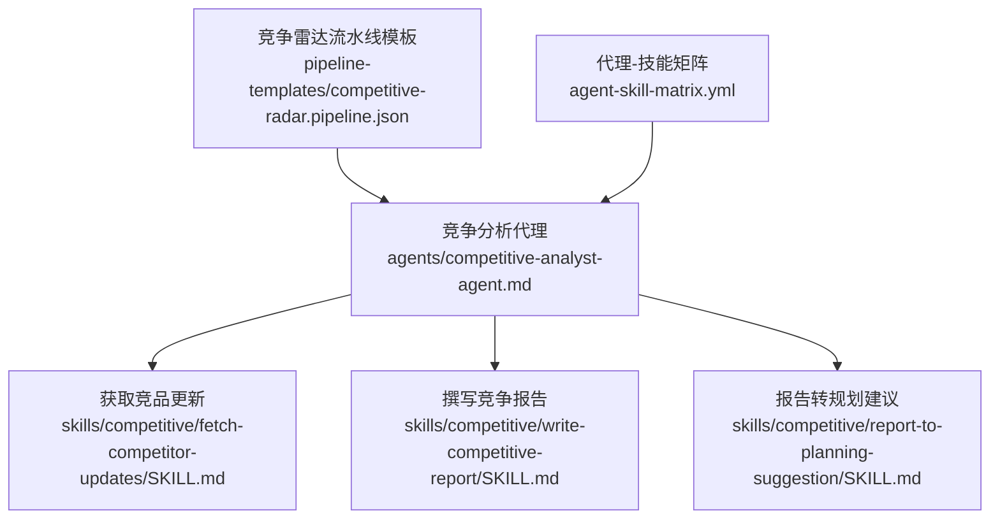
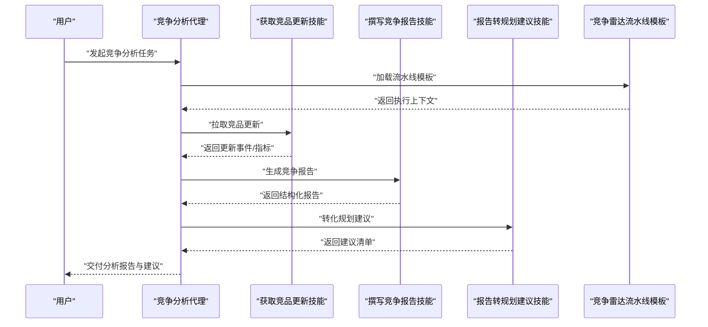
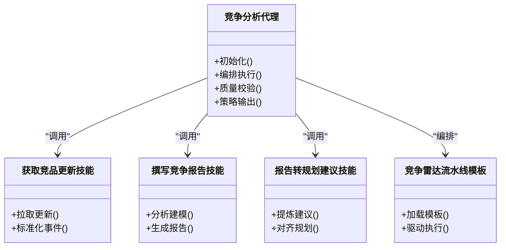

# 竞争分析代理

<cite>
**本文引用的文件**   
- [agents/competitive-analyst-agent.md](file://agents/competitive-analyst-agent.md)
- [skills/competitive/fetch-competitor-updates/SKILL.md](file://skills/competitive/fetch-competitor-updates/SKILL.md)
- [skills/competitive/report-to-planning-suggestion/SKILL.md](file://skills/competitive/report-to-planning-suggestion/SKILL.md)
- [skills/competitive/write-competitive-report/SKILL.md](file://skills/competitive/write-competitive-report/SKILL.md)
- [pipeline-templates/competitive-radar.pipeline.json](file://pipeline-templates/competitive-radar.pipeline.json)
- [agent-skill-matrix.yml](file://agent-skill-matrix.yml)
</cite>

## 目录
1. [简介](#简介)
2. [项目结构](#项目结构)
3. [核心组件](#核心组件)
4. [架构总览](#架构总览)
5. [详细组件分析](#详细组件分析)
6. [依赖关系分析](#依赖关系分析)
7. [性能考虑](#性能考虑)
8. [故障排查指南](#故障排查指南)
9. [结论](#结论)
10. [附录](#附录)

## 简介
本文件为“竞争分析代理”的完整使用文档，面向产品、市场与研发人员，帮助快速上手并高效使用该代理进行：
- 市场情报收集
- 竞品动态监控
- 竞争格局分析
- 战略建议生成

同时提供配置参数说明、数据源集成方式、输出格式规范、API接口定义（输入/返回/错误）、典型使用场景以及与相关技能的协作模式。文末包含性能调优建议与最佳实践。

## 项目结构
围绕竞争分析的相关资产主要分布在以下位置：
- 代理定义：agents/competitive-analyst-agent.md
- 竞争分析技能：skills/competitive/*
- 竞争雷达流水线模板：pipeline-templates/competitive-radar.pipeline.json
- 代理-技能矩阵：agent-skill-matrix.yml

图表来源
- [agents/competitive-analyst-agent.md](file://agents/competitive-analyst-agent.md)
- [skills/competitive/fetch-competitor-updates/SKILL.md](file://skills/competitive/fetch-competitor-updates/SKILL.md)
- [skills/competitive/write-competitive-report/SKILL.md](file://skills/competitive/write-competitive-report/SKILL.md)
- [skills/competitive/report-to-planning-suggestion/SKILL.md](file://skills/competitive/report-to-planning-suggestion/SKILL.md)
- [pipeline-templates/competitive-radar.pipeline.json](file://pipeline-templates/competitive-radar.pipeline.json)
- [agent-skill-matrix.yml](file://agent-skill-matrix.yml)

章节来源
- [agents/competitive-analyst-agent.md](file://agents/competitive-analyst-agent.md)
- [skills/competitive/fetch-competitor-updates/SKILL.md](file://skills/competitive/fetch-competitor-updates/SKILL.md)
- [skills/competitive/write-competitive-report/SKILL.md](file://skills/competitive/write-competitive-report/SKILL.md)
- [skills/competitive/report-to-planning-suggestion/SKILL.md](file://skills/competitive/report-to-planning-suggestion/SKILL.md)
- [pipeline-templates/competitive-radar.pipeline.json](file://pipeline-templates/competitive-radar.pipeline.json)
- [agent-skill-matrix.yml](file://agent-skill-matrix.yml)

## 核心组件
- 竞争分析代理：负责编排市场情报收集、竞品动态监控、竞争格局分析与战略建议生成等任务，协调相关技能完成端到端流程。
- 竞争分析技能集：
  - 获取竞品更新：用于拉取目标竞品的最新信息（如版本发布、功能变更、市场动作等）。
  - 撰写竞争报告：将采集到的信息进行结构化整理与分析，形成可复用的竞争报告。
  - 报告转规划建议：将竞争报告转化为可落地的产品或技术规划建议。
- 竞争雷达流水线模板：提供标准化的竞争分析流水线编排能力，便于批量、周期性地执行竞争分析任务。
- 代理-技能矩阵：明确各代理与其可用技能的映射关系，指导调用组合。

章节来源
- [agents/competitive-analyst-agent.md](file://agents/competitive-analyst-agent.md)
- [skills/competitive/fetch-competitor-updates/SKILL.md](file://skills/competitive/fetch-competitor-updates/SKILL.md)
- [skills/competitive/write-competitive-report/SKILL.md](file://skills/competitive/write-competitive-report/SKILL.md)
- [skills/competitive/report-to-planning-suggestion/SKILL.md](file://skills/competitive/report-to-planning-suggestion/SKILL.md)
- [pipeline-templates/competitive-radar.pipeline.json](file://pipeline-templates/competitive-radar.pipeline.json)
- [agent-skill-matrix.yml](file://agent-skill-matrix.yml)

## 架构总览
竞争分析代理通过“计划-执行-产出”的闭环工作流，结合外部数据源与内部知识库，持续产出高质量竞争洞察与建议。

图表来源
- [agents/competitive-analyst-agent.md](file://agents/competitive-analyst-agent.md)
- [skills/competitive/fetch-competitor-updates/SKILL.md](file://skills/competitive/fetch-competitor-updates/SKILL.md)
- [skills/competitive/write-competitive-report/SKILL.md](file://skills/competitive/write-competitive-report/SKILL.md)
- [skills/competitive/report-to-planning-suggestion/SKILL.md](file://skills/competitive/report-to-planning-suggestion/SKILL.md)
- [pipeline-templates/competitive-radar.pipeline.json](file://pipeline-templates/competitive-radar.pipeline.json)

## 详细组件分析

### 竞争分析代理
职责边界
- 统一入口：接收竞争分析需求，解析范围、时间窗口、关注维度。
- 编排调度：按流水线模板驱动技能执行，管理状态与重试。
- 质量把关：校验输入、聚合结果、确保输出符合规范。
- 策略输出：基于竞争报告生成可执行的规划建议。

关键行为
- 初始化：读取代理定义与技能矩阵，确定可用技能集合。
- 数据采集：调用“获取竞品更新”技能，汇总增量信息。
- 分析建模：调用“撰写竞争报告”技能，输出结构化报告。
- 决策支持：调用“报告转规划建议”技能，输出建议清单。
- 结果交付：以标准格式返回给用户或下游系统。

章节来源
- [agents/competitive-analyst-agent.md](file://agents/competitive-analyst-agent.md)
- [agent-skill-matrix.yml](file://agent-skill-matrix.yml)

### 技能：获取竞品更新
作用
- 从多源抓取竞品动态，包括产品发布、功能迭代、定价调整、市场活动、舆情变化等。
- 标准化事件模型，去重与合并，输出可用于分析的时序数据。

输入要点
- 目标竞品列表、时间范围、数据源偏好、过滤条件。

输出要点
- 标准化事件记录（含时间戳、来源、类型、摘要、链接等）。
- 可选：初步指标（如发布频率、热度评分）。

章节来源
- [skills/competitive/fetch-competitor-updates/SKILL.md](file://skills/competitive/fetch-competitor-updates/SKILL.md)

### 技能：撰写竞争报告
作用
- 对采集到的竞品更新进行深度分析，形成结构化竞争报告。
- 覆盖功能对比、差异化定位、市场份额趋势、技术路线演进等维度。

输入要点
- 竞品更新事件、历史报告、行业基准、内部产品上下文。

输出要点
- 结构化报告（含摘要、关键发现、证据链、风险与机会、可视化建议）。
- 可导出格式（如Markdown/JSON）与元数据（版本、作者、时间）。

章节来源
- [skills/competitive/write-competitive-report/SKILL.md](file://skills/competitive/write-competitive-report/SKILL.md)

### 技能：报告转规划建议
作用
- 将竞争报告中的洞察转化为具体、可落地的产品/技术规划建议。
- 对齐公司战略与资源约束，给出优先级与实施路径。

输入要点
- 竞争报告、当前产品路线图、资源与约束、战略目标。

输出要点
- 建议清单（主题、依据、影响面、优先级、里程碑、风险与对策）。
- 与现有规划的衔接点与冲突提示。

章节来源
- [skills/competitive/report-to-planning-suggestion/SKILL.md](file://skills/competitive/report-to-planning-suggestion/SKILL.md)

### 流水线模板：竞争雷达
作用
- 提供可复用的竞争分析流水线编排，支持定时/触发式执行。
- 串联“获取更新-撰写报告-转建议”的标准流程，保证一致性与可追溯性。

关键配置
- 触发器（定时/事件）、并行度、超时与重试、输出存储位置、通知渠道。

章节来源
- [pipeline-templates/competitive-radar.pipeline.json](file://pipeline-templates/competitive-radar.pipeline.json)

## 依赖关系分析
竞争分析代理与各技能及模板之间的依赖关系如下：

图表来源
- [agents/competitive-analyst-agent.md](file://agents/competitive-analyst-agent.md)
- [skills/competitive/fetch-competitor-updates/SKILL.md](file://skills/competitive/fetch-competitor-updates/SKILL.md)
- [skills/competitive/write-competitive-report/SKILL.md](file://skills/competitive/write-competitive-report/SKILL.md)
- [skills/competitive/report-to-planning-suggestion/SKILL.md](file://skills/competitive/report-to-planning-suggestion/SKILL.md)
- [pipeline-templates/competitive-radar.pipeline.json](file://pipeline-templates/competitive-radar.pipeline.json)

章节来源
- [agent-skill-matrix.yml](file://agent-skill-matrix.yml)

## 性能考虑
- 并发与批处理
  - 在“获取竞品更新”阶段采用分批拉取与并发控制，避免单点过载。
  - 合理设置流水线并行度，平衡吞吐与稳定性。
- 缓存与增量
  - 对高频访问的数据源启用缓存；对事件采用增量拉取与去重。
- 超时与重试
  - 为外部调用设置合理的超时与退避重试策略，提升鲁棒性。
- 输出压缩与分页
  - 大报告采用分片输出与按需加载，减少传输与渲染开销。
- 资源隔离
  - 将高负载任务放入独立队列或沙箱，避免影响其他服务。

[本节为通用性能建议，不直接分析具体文件]

## 故障排查指南
常见问题与定位步骤
- 数据源不可用
  - 检查网络连通性与鉴权配置；查看上游服务的健康状态。
- 事件缺失或重复
  - 核对时间窗口与过滤条件；确认去重键与幂等策略。
- 报告不完整
  - 检查上游事件完整性；验证报告模板字段是否齐全。
- 建议与规划脱节
  - 复核输入的战略目标与资源约束；确认建议优先级规则。
- 流水线失败
  - 查看流水线日志与中间产物；确认模板配置与依赖项。

章节来源
- [pipeline-templates/competitive-radar.pipeline.json](file://pipeline-templates/competitive-radar.pipeline.json)

## 结论
竞争分析代理通过标准化流水线与模块化技能，实现了从数据采集到洞察输出的全链路自动化。配合竞争雷达模板与代理-技能矩阵，可在不同业务场景中快速落地，持续提升竞争洞察的质量与效率。

[本节为总结性内容，不直接分析具体文件]

## 附录

### API 接口参考（概念性）
以下为概念性接口定义，实际实现请参考对应技能与流水线的具体说明。

- 接口：启动竞争分析任务
  - 方法：POST /api/v1/competitive-analysis/tasks
  - 请求体
    - 目标竞品：数组
    - 时间范围：起止时间
    - 关注维度：数组（如功能、价格、渠道、技术）
    - 输出格式：枚举（Markdown/JSON）
    - 附加上下文：对象（可选）
  - 响应体
    - 任务ID：字符串
    - 状态：枚举（进行中/成功/失败）
    - 结果URL：字符串（用于查询最终报告与建议）
  - 错误码
    - 400：参数校验失败
    - 401：未授权
    - 403：无权限
    - 429：限流
    - 500：内部错误

- 接口：查询任务状态
  - 方法：GET /api/v1/competitive-analysis/tasks/{taskId}
  - 响应体
    - 状态、进度、错误信息（如有）
    - 结果URL（当成功时）

- 接口：下载竞争报告
  - 方法：GET /api/v1/competitive-analysis/reports/{reportId}
  - 响应体：二进制文件或文本（取决于输出格式）

- 接口：下载规划建议
  - 方法：GET /api/v1/competitive-analysis/suggestions/{suggestionId}
  - 响应体：结构化建议清单（JSON/Markdown）

注意：以上为概念性接口，具体字段与行为请以实际实现为准。

[本节为概念性说明，不直接分析具体文件]

### 典型使用场景
- 竞品功能对比
  - 输入：竞品列表、功能维度、时间窗口
  - 过程：拉取更新→生成报告→提取差异点
  - 输出：功能对比矩阵与演进趋势
- 市场份额分析
  - 输入：行业数据、竞品份额指标、时间序列
  - 过程：整合指标→趋势分析→归因解读
  - 输出：份额变化图与关键驱动因素
- 技术趋势预测
  - 输入：技术专利、开源动态、论文与会议
  - 过程：信号采集→聚类与主题建模→趋势研判
  - 输出：技术路线图与风险提示

[本节为概念性说明，不直接分析具体文件]

### 与相关技能的协作模式
- 竞争对手更新获取
  - 由“获取竞品更新”技能负责，向代理提供标准化事件流。
- 竞争报告生成
  - 由“撰写竞争报告”技能负责，承接事件流并产出结构化报告。
- 规划建议生成
  - 由“报告转规划建议”技能负责，将洞察转化为行动项。

章节来源
- [skills/competitive/fetch-competitor-updates/SKILL.md](file://skills/competitive/fetch-competitor-updates/SKILL.md)
- [skills/competitive/write-competitive-report/SKILL.md](file://skills/competitive/write-competitive-report/SKILL.md)
- [skills/competitive/report-to-planning-suggestion/SKILL.md](file://skills/competitive/report-to-planning-suggestion/SKILL.md)

### 配置参数速查
- 代理级
  - 可用技能清单：来自代理-技能矩阵
  - 默认输出格式：Markdown/JSON
  - 并行度与超时：由流水线模板控制
- 技能级
  - 数据源配置：认证、速率限制、重试策略
  - 过滤与去重：时间窗口、关键词、来源白名单
  - 报告模板：字段、样式、附件
- 流水线级
  - 触发器：定时/事件
  - 存储：报告与建议的输出位置
  - 通知：邮件/IM/回调

章节来源
- [agent-skill-matrix.yml](file://agent-skill-matrix.yml)
- [pipeline-templates/competitive-radar.pipeline.json](file://pipeline-templates/competitive-radar.pipeline.json)

### 最佳实践
- 明确范围与目标：每次任务聚焦有限竞品与维度，提高信噪比。
- 建立基线与口径：统一指标定义与数据来源，保障可比性。
- 定期复盘与校准：根据反馈调整权重与阈值，持续优化模型。
- 安全与合规：遵循数据使用政策，做好敏感信息脱敏。
- 可观测性：完善日志、指标与告警，便于问题定位与容量规划。

[本节为通用实践建议，不直接分析具体文件]