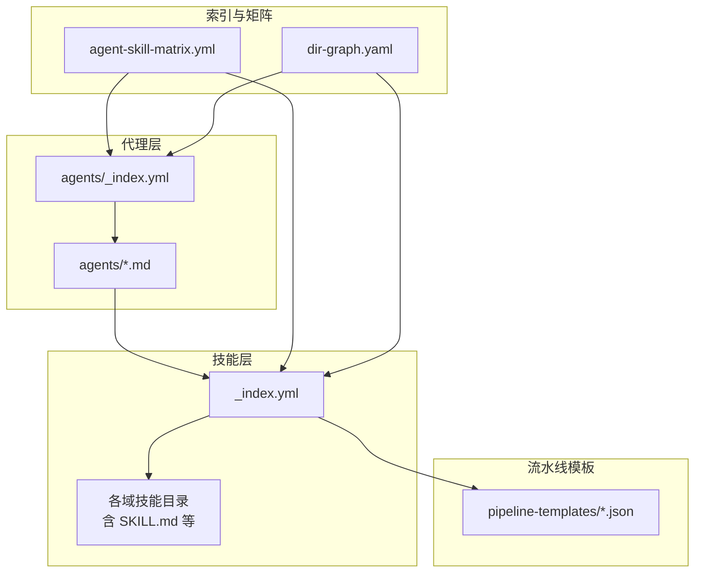
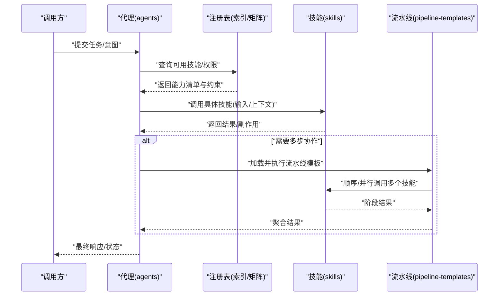
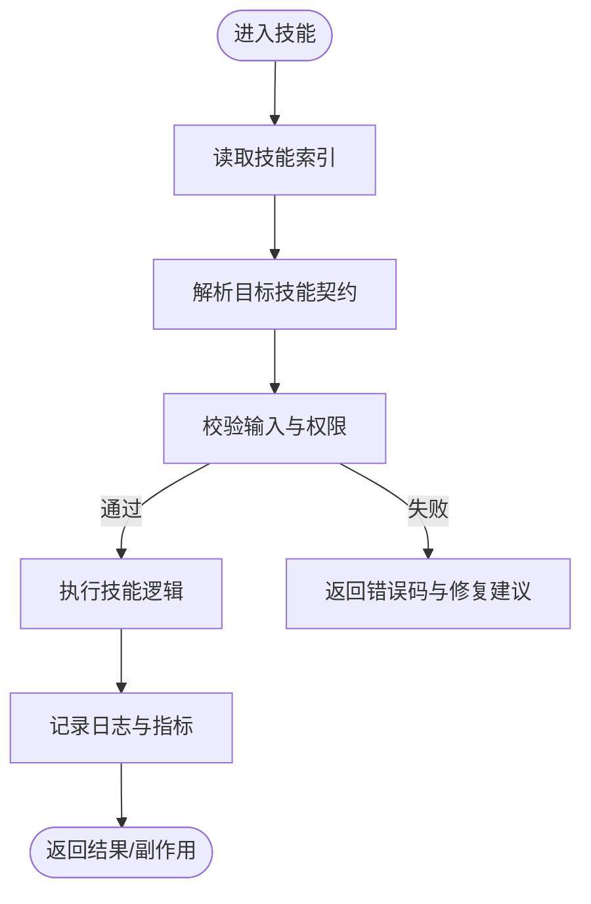
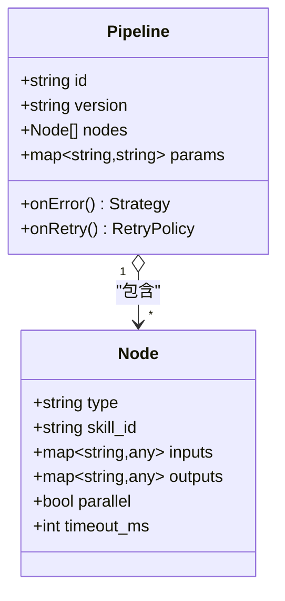
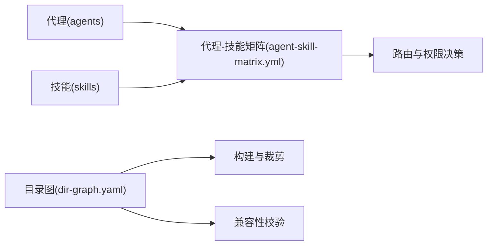
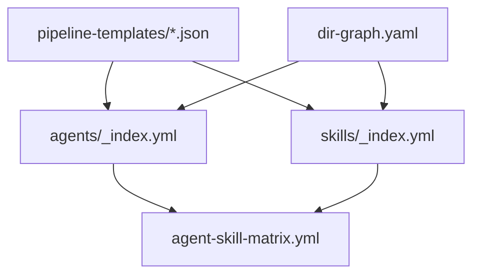

# 自定义代理开发

<cite>
**本文引用的文件**   
- [agents/_index.yml](file://agents/_index.yml)
- [agents/competitive-analyst-agent.md](file://agents/competitive-analyst-agent.md)
- [agents/customer-support-agent.md](file://agents/customer-support-agent.md)
- [agents/delivery-agent.md](file://agents/delivery-agent.md)
- [agents/dev-agent.md](file://agents/dev-agent.md)
- [agents/product-planning-agent.md](file://agents/product-planning-agent.md)
- [agents/quality-reviewer-agent.md](file://agents/quality-reviewer-agent.md)
- [agents/requirement-writer.md](file://agents/requirement-writer.md)
- [agents/spec-agent.md](file://agents/spec-agent.md)
- [skills/_index.yml](file://skills/_index.yml)
- [skills/reviewer-panel.yaml](file://skills/reviewer-panel.yaml)
- [pipeline-templates/README.md](file://pipeline-templates/README.md)
- [pipeline-templates/architecture-design.pipeline.json](file://pipeline-templates/architecture-design.pipeline.json)
- [pipeline-templates/code-implementation.pipeline.json](file://pipeline-templates/code-implementation.pipeline.json)
- [pipeline-templates/competitive-radar.pipeline.json](file://pipeline-templates/competitive-radar.pipeline.json)
- [pipeline-templates/feature-writeback.pipeline.json](file://pipeline-templates/feature-writeback.pipeline.json)
- [pipeline-templates/market-to-plan.pipeline.json](file://pipeline-templates/market-to-plan.pipeline.json)
- [pipeline-templates/product-planning.pipeline.json](file://pipeline-templates/product-planning.pipeline.json)
- [pipeline-templates/requirement-authoring.pipeline.json](file://pipeline-templates/requirement-authoring.pipeline.json)
- [pipeline-templates/resume-cr.pipeline.json](file://pipeline-templates/resume-cr.pipeline.json)
- [AGENT-SKILL-MATRIX.md](file://AGENT-SKILL-MATRIX.md)
- [agent-skill-matrix.yml](file://agent-skill-matrix.yml)
- [dir-graph.yaml](file://dir-graph.yaml)
</cite>

## 目录
1. [简介](#简介)
2. [项目结构](#项目结构)
3. [核心组件](#核心组件)
4. [架构总览](#架构总览)
5. [详细组件分析](#详细组件分析)
6. [依赖关系分析](#依赖关系分析)
7. [性能考虑](#性能考虑)
8. [故障排查指南](#故障排查指南)
9. [结论](#结论)
10. [附录](#附录)

## 简介
本指南面向希望在本仓库中开发“自定义代理”的工程师与产品人员，提供从需求分析、架构设计、实现到测试验证的全流程方法。结合仓库中的代理清单、技能索引、流水线模板与矩阵定义，文档将系统化阐述：
- 代理接口规范与能力注册机制
- 权限控制模型与消息协议约定
- 完整的开发工具链（脚手架、调试、测试、部署）
- 渐进式案例（从简单任务代理到复杂业务流程代理）
- 生命周期管理、错误处理、日志与监控
- 打包分发、版本管理与兼容性维护最佳实践

## 项目结构
仓库采用“代理 + 技能 + 流水线模板 + 矩阵与索引”的分层组织方式：
- agents：已定义的代理清单与说明，作为能力入口与角色契约
- skills：按领域划分的可复用技能集合，每个技能以 SKILL.md 描述其输入输出与约束
- pipeline-templates：端到端工作流模板，用于编排多个技能或代理协作
- 顶层索引与矩阵：统一发现代理与技能的映射关系，支撑注册与调度

图表来源
- [agents/_index.yml](file://agents/_index.yml)
- [skills/_index.yml](file://skills/_index.yml)
- [agent-skill-matrix.yml](file://agent-skill-matrix.yml)
- [dir-graph.yaml](file://dir-graph.yaml)

章节来源
- [agents/_index.yml](file://agents/_index.yml)
- [skills/_index.yml](file://skills/_index.yml)
- [agent-skill-matrix.yml](file://agent-skill-matrix.yml)
- [dir-graph.yaml](file://dir-graph.yaml)

## 核心组件
- 代理清单与元数据：通过 agents/_index.yml 集中声明代理标识、职责、依赖与可见范围，便于注册与发现
- 技能契约：每个技能以 SKILL.md 描述能力边界、输入输出、前置条件与后置状态，形成稳定的能力契约
- 流水线模板：以 JSON 形式定义多步骤工作流，串联多个技能或代理，支持参数化与分支合并
- 代理-技能矩阵：在 agent-skill-matrix.yml 中建立“代理→技能”的映射，驱动权限与路由决策
- 目录图：dir-graph.yaml 描述模块间依赖，辅助构建与发布时的裁剪与校验

章节来源
- [agents/_index.yml](file://agents/_index.yml)
- [skills/_index.yml](file://skills/_index.yml)
- [agent-skill-matrix.yml](file://agent-skill-matrix.yml)
- [dir-graph.yaml](file://dir-graph.yaml)

## 架构总览
整体架构围绕“代理编排 + 技能执行 + 流水线驱动”展开：
- 代理负责接收外部请求、解析意图、选择并编排合适的技能
- 技能是原子能力的封装，具备明确的输入输出与副作用边界
- 流水线模板用于跨代理/技能的多步协同，保证一致的状态推进与回滚策略
- 矩阵与索引提供统一的注册、发现与权限校验依据

图表来源
- [agents/_index.yml](file://agents/_index.yml)
- [skills/_index.yml](file://skills/_index.yml)
- [pipeline-templates/README.md](file://pipeline-templates/README.md)
- [agent-skill-matrix.yml](file://agent-skill-matrix.yml)

## 详细组件分析

### 代理清单与元数据（agents）
- 作用：集中声明代理的身份、职责、对外暴露的能力与依赖关系
- 建议字段：代理ID、名称、版本、描述、输入模式、输出模式、依赖技能、权限级别、兼容性与弃用标记
- 使用方式：由注册中心读取，生成能力目录；在权限校验时作为白名单依据

章节来源
- [agents/_index.yml](file://agents/_index.yml)
- [agents/competitive-analyst-agent.md](file://agents/competitive-analyst-agent.md)
- [agents/customer-support-agent.md](file://agents/customer-support-agent.md)
- [agents/delivery-agent.md](file://agents/delivery-agent.md)
- [agents/dev-agent.md](file://agents/dev-agent.md)
- [agents/product-planning-agent.md](file://agents/product-planning-agent.md)
- [agents/quality-reviewer-agent.md](file://agents/quality-reviewer-agent.md)
- [agents/requirement-writer.md](file://agents/requirement-writer.md)
- [agents/spec-agent.md](file://agents/spec-agent.md)

### 技能契约与索引（skills）
- 作用：以标准化文档描述技能的能力边界、输入输出、前置条件、副作用与示例
- 索引：skills/_index.yml 汇总所有技能，供注册与发现
- 评审面板：skills/reviewer-panel.yaml 定义评审相关配置，可用于质量门禁与人工复核

图表来源
- [skills/_index.yml](file://skills/_index.yml)
- [skills/reviewer-panel.yaml](file://skills/reviewer-panel.yaml)

章节来源
- [skills/_index.yml](file://skills/_index.yml)
- [skills/reviewer-panel.yaml](file://skills/reviewer-panel.yaml)

### 流水线模板（pipeline-templates）
- 作用：以 JSON 描述多步骤工作流，包括节点定义、依赖关系、参数注入、错误策略与重试
- 典型用途：跨代理/技能的业务流程编排，如竞品分析、需求编写、代码实现与写回等
- 关键要素：节点类型、输入/输出映射、条件分支、并发度、超时与回滚

图表来源
- [pipeline-templates/README.md](file://pipeline-templates/README.md)
- [pipeline-templates/architecture-design.pipeline.json](file://pipeline-templates/architecture-design.pipeline.json)
- [pipeline-templates/code-implementation.pipeline.json](file://pipeline-templates/code-implementation.pipeline.json)
- [pipeline-templates/competitive-radar.pipeline.json](file://pipeline-templates/competitive-radar.pipeline.json)
- [pipeline-templates/feature-writeback.pipeline.json](file://pipeline-templates/feature-writeback.pipeline.json)
- [pipeline-templates/market-to-plan.pipeline.json](file://pipeline-templates/market-to-plan.pipeline.json)
- [pipeline-templates/product-planning.pipeline.json](file://pipeline-templates/product-planning.pipeline.json)
- [pipeline-templates/requirement-authoring.pipeline.json](file://pipeline-templates/requirement-authoring.pipeline.json)
- [pipeline-templates/resume-cr.pipeline.json](file://pipeline-templates/resume-cr.pipeline.json)

章节来源
- [pipeline-templates/README.md](file://pipeline-templates/README.md)
- [pipeline-templates/architecture-design.pipeline.json](file://pipeline-templates/architecture-design.pipeline.json)
- [pipeline-templates/code-implementation.pipeline.json](file://pipeline-templates/code-implementation.pipeline.json)
- [pipeline-templates/competitive-radar.pipeline.json](file://pipeline-templates/competitive-radar.pipeline.json)
- [pipeline-templates/feature-writeback.pipeline.json](file://pipeline-templates/feature-writeback.pipeline.json)
- [pipeline-templates/market-to-plan.pipeline.json](file://pipeline-templates/market-to-plan.pipeline.json)
- [pipeline-templates/product-planning.pipeline.json](file://pipeline-templates/product-planning.pipeline.json)
- [pipeline-templates/requirement-authoring.pipeline.json](file://pipeline-templates/requirement-authoring.pipeline.json)
- [pipeline-templates/resume-cr.pipeline.json](file://pipeline-templates/resume-cr.pipeline.json)

### 代理-技能矩阵与目录图（索引与依赖）
- 矩阵：agent-skill-matrix.yml 明确“代理→技能”的映射，用于权限控制与路由
- 目录图：dir-graph.yaml 描述模块依赖，辅助构建、发布与兼容性检查

图表来源
- [agent-skill-matrix.yml](file://agent-skill-matrix.yml)
- [dir-graph.yaml](file://dir-graph.yaml)

章节来源
- [agent-skill-matrix.yml](file://agent-skill-matrix.yml)
- [dir-graph.yaml](file://dir-graph.yaml)

## 依赖关系分析
- 代理对技能存在显式依赖，通过矩阵进行约束与校验
- 流水线模板对技能与代理组合有强依赖，需确保版本兼容
- 目录图用于静态依赖分析，避免循环依赖与未声明依赖

图表来源
- [agents/_index.yml](file://agents/_index.yml)
- [skills/_index.yml](file://skills/_index.yml)
- [agent-skill-matrix.yml](file://agent-skill-matrix.yml)
- [dir-graph.yaml](file://dir-graph.yaml)

章节来源
- [agents/_index.yml](file://agents/_index.yml)
- [skills/_index.yml](file://skills/_index.yml)
- [agent-skill-matrix.yml](file://agent-skill-matrix.yml)
- [dir-graph.yaml](file://dir-graph.yaml)

## 性能考虑
- 流水线并发：合理设置并行度与超时，避免资源争用
- 幂等性：技能应尽可能幂等，便于重试与回滚
- 缓存与去重：对热点数据进行缓存，减少重复计算
- 限流与熔断：对下游依赖实施限流与熔断，保障系统稳定性
- 观测性：埋点关键指标（耗时、成功率、错误率），配合告警

[本节为通用指导，不直接分析具体文件]

## 故障排查指南
- 常见错误分类
  - 权限不足：检查代理-技能矩阵与调用者身份
  - 输入校验失败：核对技能契约的输入模式与必填项
  - 流水线节点失败：查看节点日志、重试策略与回滚路径
  - 依赖不可用：确认目录图与版本兼容性
- 定位步骤
  - 从代理入口开始，逐步下钻到技能与流水线节点
  - 对比期望契约与实际输入/输出
  - 启用更详细的日志与追踪信息
  - 复现最小用例，隔离问题范围

章节来源
- [pipeline-templates/README.md](file://pipeline-templates/README.md)
- [agent-skill-matrix.yml](file://agent-skill-matrix.yml)

## 结论
通过“代理清单 + 技能契约 + 流水线模板 + 矩阵与索引”的组合，本仓库提供了可扩展、可治理的代理开发体系。遵循本文档的流程与实践，可以高效地实现从简单任务代理到复杂业务流程代理的演进，并在权限、质量与性能方面获得良好保障。

[本节为总结性内容，不直接分析具体文件]

## 附录

### 开发工具链建议
- 脚手架工具
  - 基于 agents/_index.yml 与 skills/_index.yml 自动生成代理骨架与技能模板
  - 根据 agent-skill-matrix.yml 生成权限与路由配置
- 调试环境
  - 本地运行单技能与流水线的最小闭环
  - 注入模拟输入与断点观察中间状态
- 测试框架
  - 单元测试：针对技能契约的输入输出与边界条件
  - 集成测试：端到端流水线执行与回滚验证
  - 回归测试：基于矩阵与目录图的兼容性校验
- 部署脚本
  - 构建产物裁剪（依据 dir-graph.yaml）
  - 版本打标与发布流水线（依据 pipeline-templates）

[本节为通用指导，不直接分析具体文件]

### 代理接口规范（建议）
- 统一入口：每个代理提供标准化的调用接口（如 REST/gRPC/事件）
- 输入模式：严格遵循技能契约，包含必填项、类型与约束
- 输出模式：结构化响应，包含状态码、数据体与扩展字段
- 错误码：分层错误码（业务/系统/网络），附带修复建议
- 幂等键：支持幂等键以避免重复执行造成副作用

[本节为通用指导，不直接分析具体文件]

### 能力注册机制（建议）
- 注册表：以 agents/_index.yml 与 skills/_index.yml 为权威源
- 动态发现：运行时拉取最新清单，支持热更新
- 版本兼容：矩阵与目录图共同约束，禁止破坏性变更
- 权限绑定：基于矩阵进行细粒度授权

章节来源
- [agents/_index.yml](file://agents/_index.yml)
- [skills/_index.yml](file://skills/_index.yml)
- [agent-skill-matrix.yml](file://agent-skill-matrix.yml)

### 权限控制模型（建议）
- 主体-客体-动作三元组：谁（主体）对什么（客体）做什么（动作）
- 基于矩阵的白名单：仅允许矩阵中声明的代理-技能组合
- 上下文感知：结合用户角色、租户与环境变量做动态决策
- 审计与留痕：记录每次访问与决策依据

章节来源
- [agent-skill-matrix.yml](file://agent-skill-matrix.yml)

### 消息协议定义（建议）
- 请求头：包含代理ID、版本、追踪ID、幂等键、签名
- 请求体：遵循技能契约的输入模式
- 响应体：包含状态、数据、错误信息与扩展字段
- 事件流：可选的事件通道，用于异步通知与回调

[本节为通用指导，不直接分析具体文件]

### 渐进式案例
- 简单任务代理
  - 目标：完成单一技能的调用与结果返回
  - 要点：输入校验、错误处理、基础日志
- 中等复杂度代理
  - 目标：组合多个技能，引入条件分支与重试
  - 要点：流水线模板、幂等性、观测性
- 复杂业务流程代理
  - 目标：跨代理协作，涉及审批、写回与一致性保障
  - 要点：事务补偿、回滚策略、质量门禁（评审面板）

章节来源
- [pipeline-templates/README.md](file://pipeline-templates/README.md)
- [skills/reviewer-panel.yaml](file://skills/reviewer-panel.yaml)

### 生命周期管理
- 启动：加载索引与矩阵，初始化连接池与缓存
- 运行：接收请求、路由到技能/流水线、执行与观测
- 优雅关闭：停止新请求、等待进行中任务完成、释放资源
- 健康检查：就绪探针与存活探针

[本节为通用指导，不直接分析具体文件]

### 错误处理策略
- 分类与分级：区分可重试与不可重试错误
- 重试与退避：指数退避与最大重试次数
- 降级与熔断：对不稳定依赖快速失败
- 补偿与回滚：在流水线层面实现状态恢复

章节来源
- [pipeline-templates/README.md](file://pipeline-templates/README.md)

### 日志记录与性能监控
- 日志：结构化日志，包含上下文与追踪ID
- 指标：QPS、延迟分布、错误率、饱和度
- 追踪：端到端链路追踪，定位瓶颈
- 告警：阈值与异常检测，联动工单

[本节为通用指导，不直接分析具体文件]

### 打包、分发、版本管理与兼容性维护
- 打包：依据目录图裁剪依赖，生成最小可用包
- 分发：制品库托管，签名与校验
- 版本：语义化版本，变更日志与迁移指南
- 兼容性：矩阵与目录图双重校验，禁止破坏性升级

章节来源
- [dir-graph.yaml](file://dir-graph.yaml)
- [agent-skill-matrix.yml](file://agent-skill-matrix.yml)