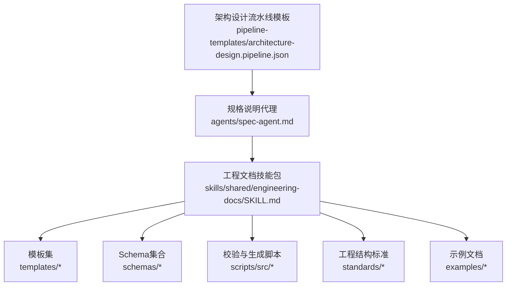
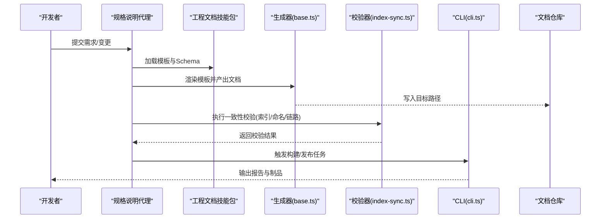
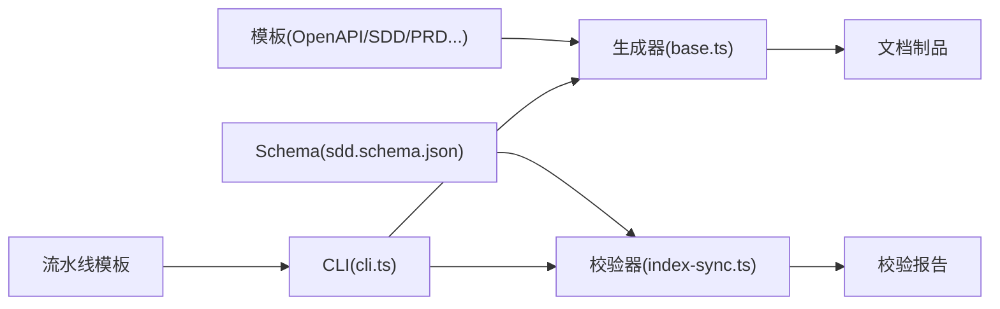
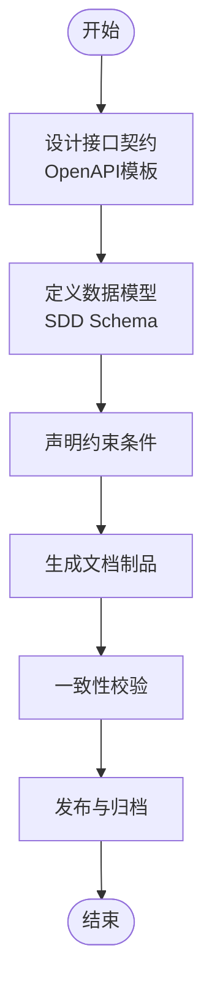

# 规格说明代理

<cite>
**本文引用的文件**   
- [agents/spec-agent.md](file://agents/spec-agent.md)
- [skills/shared/engineering-docs/SKILL.md](file://skills/shared/engineering-docs/SKILL.md)
- [skills/shared/engineering-docs/templates/OpenAPI-template.yaml](file://skills/shared/engineering-docs/templates/OpenAPI-template.yaml)
- [skills/shared/engineering-docs/schemas/sdd.schema.json](file://skills/shared/engineering-docs/schemas/sdd.schema.json)
- [skills/shared/engineering-docs/scripts/src/validators/index-sync.ts](file://skills/shared/engineering-docs/scripts/src/validators/index-sync.ts)
- [skills/shared/engineering-docs/scripts/src/generators/base.ts](file://skills/shared/engineering-docs/scripts/src/generators/base.ts)
- [skills/shared/engineering-docs/scripts/src/cli.ts](file://skills/shared/engineering-docs/scripts/src/cli.ts)
- [skills/shared/engineering-docs/scripts/package.json](file://skills/shared/engineering-docs/scripts/package.json)
- [skills/shared/engineering-docs/standards/ENGINEERING-STRUCTURE-TEAM.md](file://skills/shared/engineering-docs/standards/ENGINEERING-STRUCTURE-TEAM.md)
- [skills/shared/engineering-docs/examples/README.md](file://skills/shared/engineering-docs/examples/README.md)
- [pipeline-templates/architecture-design.pipeline.json](file://pipeline-templates/architecture-design.pipeline.json)
</cite>

## 目录
1. [简介](#简介)
2. [项目结构](#项目结构)
3. [核心组件](#核心组件)
4. [架构总览](#架构总览)
5. [详细组件分析](#详细组件分析)
6. [依赖关系分析](#依赖关系分析)
7. [性能与可扩展性](#性能与可扩展性)
8. [故障排查指南](#故障排查指南)
9. [结论](#结论)
10. [附录](#附录)

## 简介
本文件为“规格说明代理”的完整使用文档，聚焦以下职责：
- 技术规格定义：统一数据模型、接口规范与约束声明
- 接口规范生成：基于模板与Schema自动生成OpenAPI等接口描述
- 架构文档维护：结构化工程文档、版本化与一致性校验
- 规格一致性检查：跨文档链路与命名规范的自动化验证

同时提供配置项清单、端到端流程示例（接口设计、数据建模、约束声明、文档同步）、与外部系统（API平台、数据库工具、架构可视化）集成建议，以及质量保障与演进管理最佳实践。

## 项目结构
仓库中与规格说明代理相关的资源主要分布在如下位置：
- agents/spec-agent.md：规格说明代理的角色与能力说明
- skills/shared/engineering-docs：工程文档体系（模板、Schema、脚本、标准、示例）
- pipeline-templates：流水线模板（如架构设计）

图示来源
- [agents/spec-agent.md](file://agents/spec-agent.md)
- [skills/shared/engineering-docs/SKILL.md](file://skills/shared/engineering-docs/SKILL.md)
- [pipeline-templates/architecture-design.pipeline.json](file://pipeline-templates/architecture-design.pipeline.json)

章节来源
- [agents/spec-agent.md](file://agents/spec-agent.md)
- [skills/shared/engineering-docs/SKILL.md](file://skills/shared/engineering-docs/SKILL.md)
- [pipeline-templates/architecture-design.pipeline.json](file://pipeline-templates/architecture-design.pipeline.json)

## 核心组件
- 规格说明代理：负责统筹技术规格、接口规范与架构文档的全生命周期管理，驱动模板渲染、Schema校验与文档链路一致性检查。
- 工程文档技能包：提供模板、Schema、校验器、生成器与CLI工具，支撑文档的结构化生产与自动化流程。
- 流水线模板：将规格相关任务编排进CI/CD或本地工作流，实现从设计到发布的可重复执行。

章节来源
- [agents/spec-agent.md](file://agents/spec-agent.md)
- [skills/shared/engineering-docs/SKILL.md](file://skills/shared/engineering-docs/SKILL.md)
- [pipeline-templates/architecture-design.pipeline.json](file://pipeline-templates/architecture-design.pipeline.json)

## 架构总览
下图展示规格说明代理在“模板—Schema—校验—生成—发布”闭环中的角色与交互。

图示来源
- [skills/shared/engineering-docs/scripts/src/generators/base.ts](file://skills/shared/engineering-docs/scripts/src/generators/base.ts)
- [skills/shared/engineering-docs/scripts/src/validators/index-sync.ts](file://skills/shared/engineering-docs/scripts/src/validators/index-sync.ts)
- [skills/shared/engineering-docs/scripts/src/cli.ts](file://skills/shared/engineering-docs/scripts/src/cli.ts)
- [skills/shared/engineering-docs/SKILL.md](file://skills/shared/engineering-docs/SKILL.md)

## 详细组件分析

### 规格说明代理（Spec Agent）
- 职责边界
  - 技术规格定义：组织数据模型、接口契约、非功能约束
  - 接口规范生成：基于OpenAPI模板与Schema驱动生成
  - 架构文档维护：结构化SDD/PRD/PLAN等文档，保持版本一致
  - 规格一致性检查：通过校验器确保索引、命名、引用正确
- 关键输入
  - 工程文档模板（如OpenAPI模板）
  - Schema定义（如SDD Schema）
  - 工程结构标准与示例
- 关键输出
  - 标准化文档与制品（OpenAPI、SDD、PRD等）
  - 校验报告与差异对比
  - 流水线产物（用于后续集成）

章节来源
- [agents/spec-agent.md](file://agents/spec-agent.md)
- [skills/shared/engineering-docs/SKILL.md](file://skills/shared/engineering-docs/SKILL.md)

### 工程文档技能包（Engineering Docs Skill）
- 模板体系
  - OpenAPI模板：用于接口契约定义与生成
  - SDD/PRD/PLAN/TASK/FORM/MODULE/RELEASE模板：覆盖全生命周期文档
- Schema体系
  - 通用定义与类型约束，保证文档结构稳定
- 校验与生成
  - 生成器：基于模板与数据源渲染文档
  - 校验器：索引同步、命名规范、文档链一致性
- CLI与注册表
  - 命令行入口与命令注册，便于集成到流水线

章节来源
- [skills/shared/engineering-docs/templates/OpenAPI-template.yaml](file://skills/shared/engineering-docs/templates/OpenAPI-template.yaml)
- [skills/shared/engineering-docs/schemas/sdd.schema.json](file://skills/shared/engineering-docs/schemas/sdd.schema.json)
- [skills/shared/engineering-docs/scripts/src/generators/base.ts](file://skills/shared/engineering-docs/scripts/src/generators/base.ts)
- [skills/shared/engineering-docs/scripts/src/validators/index-sync.ts](file://skills/shared/engineering-docs/scripts/src/validators/index-sync.ts)
- [skills/shared/engineering-docs/scripts/src/cli.ts](file://skills/shared/engineering-docs/scripts/src/cli.ts)
- [skills/shared/engineering-docs/scripts/src/registry.ts](file://skills/shared/engineering-docs/scripts/src/registry.ts)

### 流水线模板（Architecture Design Pipeline）
- 作用：将规格相关步骤（生成、校验、发布）编排为可重复执行的流水线
- 典型阶段：拉取代码→渲染模板→Schema校验→一致性检查→产物归档/推送

章节来源
- [pipeline-templates/architecture-design.pipeline.json](file://pipeline-templates/architecture-design.pipeline.json)

## 依赖关系分析
- 模块内聚与耦合
  - 生成器与校验器解耦，分别关注“产出”和“质量”
  - CLI作为统一入口，聚合生成与校验能力
  - 模板与Schema强关联，确保“以模式驱动文档”
- 外部依赖
  - Node.js运行时与包管理器（pnpm）
  - 可选：API管理平台、数据库设计工具、架构可视化工具（通过制品对接）

图示来源
- [skills/shared/engineering-docs/scripts/src/generators/base.ts](file://skills/shared/engineering-docs/scripts/src/generators/base.ts)
- [skills/shared/engineering-docs/scripts/src/validators/index-sync.ts](file://skills/shared/engineering-docs/scripts/src/validators/index-sync.ts)
- [skills/shared/engineering-docs/scripts/src/cli.ts](file://skills/shared/engineering-docs/scripts/src/cli.ts)
- [skills/shared/engineering-docs/schemas/sdd.schema.json](file://skills/shared/engineering-docs/schemas/sdd.schema.json)
- [skills/shared/engineering-docs/templates/OpenAPI-template.yaml](file://skills/shared/engineering-docs/templates/OpenAPI-template.yaml)
- [pipeline-templates/architecture-design.pipeline.json](file://pipeline-templates/architecture-design.pipeline.json)

章节来源
- [skills/shared/engineering-docs/scripts/package.json](file://skills/shared/engineering-docs/scripts/package.json)
- [skills/shared/engineering-docs/scripts/src/cli.ts](file://skills/shared/engineering-docs/scripts/src/cli.ts)

## 性能与可扩展性
- 增量生成：按变更范围选择受影响模板与文档，减少全量渲染开销
- 并行校验：对多文档进行并发校验，缩短反馈时间
- 缓存策略：对模板解析与Schema编译结果进行缓存
- 扩展点：新增模板与Schema时，仅需注册至生成器与校验器，无需改动核心流程

[本节为通用指导，不直接分析具体文件]

## 故障排查指南
- 常见错误定位
  - 模板渲染失败：检查模板语法与变量映射
  - Schema校验失败：对照Schema字段约束修正文档结构
  - 索引不一致：运行索引同步校验并修复缺失链接
  - 命名不规范：依据命名规范修正文件/标题命名
- 快速自检
  - 使用CLI执行“生成+校验”一体化命令
  - 查看生成的校验报告，逐项修复问题
  - 回归测试：重新运行流水线确认无告警

章节来源
- [skills/shared/engineering-docs/scripts/src/validators/index-sync.ts](file://skills/shared/engineering-docs/scripts/src/validators/index-sync.ts)
- [skills/shared/engineering-docs/scripts/src/cli.ts](file://skills/shared/engineering-docs/scripts/src/cli.ts)

## 结论
规格说明代理通过“模板+Schema+校验+CLI+流水线”的组合，实现了从设计到交付的端到端自动化与一致性保障。建议在团队中推广该体系，结合API平台、数据库设计与架构可视化工具，形成统一的规格治理闭环。

[本节为总结性内容，不直接分析具体文件]

## 附录

### 配置选项清单
- 技术规范模板
  - OpenAPI模板：用于接口契约定义与生成
  - SDD/PRD/PLAN/TASK/FORM/MODULE/RELEASE模板：覆盖产品与研发各阶段文档
- API定义格式
  - 基于OpenAPI模板，遵循其结构与字段约定
- 文档结构规范
  - 参考工程结构标准与示例，统一目录、命名与元信息
- 验证规则
  - 索引同步校验、命名规范校验、文档链一致性校验

章节来源
- [skills/shared/engineering-docs/templates/OpenAPI-template.yaml](file://skills/shared/engineering-docs/templates/OpenAPI-template.yaml)
- [skills/shared/engineering-docs/schemas/sdd.schema.json](file://skills/shared/engineering-docs/schemas/sdd.schema.json)
- [skills/shared/engineering-docs/standards/ENGINEERING-STRUCTURE-TEAM.md](file://skills/shared/engineering-docs/standards/ENGINEERING-STRUCTURE-TEAM.md)
- [skills/shared/engineering-docs/examples/README.md](file://skills/shared/engineering-docs/examples/README.md)
- [skills/shared/engineering-docs/scripts/src/validators/index-sync.ts](file://skills/shared/engineering-docs/scripts/src/validators/index-sync.ts)

### 规格管理流程（端到端）
- 接口设计
  - 基于OpenAPI模板创建接口契约，定义路径、参数、响应与错误码
- 数据模型定义
  - 使用SDD Schema定义实体、字段、约束与关系
- 约束条件声明
  - 在Schema中声明必填、长度、枚举、正则等约束
- 文档同步更新
  - 通过生成器渲染最新文档，校验器确保索引与命名一致，CLI触发流水线发布

章节来源
- [skills/shared/engineering-docs/templates/OpenAPI-template.yaml](file://skills/shared/engineering-docs/templates/OpenAPI-template.yaml)
- [skills/shared/engineering-docs/schemas/sdd.schema.json](file://skills/shared/engineering-docs/schemas/sdd.schema.json)
- [skills/shared/engineering-docs/scripts/src/generators/base.ts](file://skills/shared/engineering-docs/scripts/src/generators/base.ts)
- [skills/shared/engineering-docs/scripts/src/validators/index-sync.ts](file://skills/shared/engineering-docs/scripts/src/validators/index-sync.ts)
- [skills/shared/engineering-docs/scripts/src/cli.ts](file://skills/shared/engineering-docs/scripts/src/cli.ts)

### 与外部系统集成示例
- API管理平台
  - 将生成的OpenAPI制品导入平台，自动同步路由、鉴权与沙箱环境
- 数据库设计工具
  - 基于SDD模型导出DDL或ER图，反向校验代码与数据库一致性
- 架构可视化系统
  - 将SDD/架构文档中的组件与关系导入可视化平台，持续呈现系统视图

章节来源
- [pipeline-templates/architecture-design.pipeline.json](file://pipeline-templates/architecture-design.pipeline.json)
- [skills/shared/engineering-docs/templates/OpenAPI-template.yaml](file://skills/shared/engineering-docs/templates/OpenAPI-template.yaml)
- [skills/shared/engineering-docs/schemas/sdd.schema.json](file://skills/shared/engineering-docs/schemas/sdd.schema.json)

### 质量保障与演进管理最佳实践
- 以Schema为中心：所有文档必须通过Schema校验
- 模板即契约：模板变更需评审并通过回归测试
- 增量与并行：优先增量生成与并行校验，提升效率
- 版本化与对比：对文档与制品进行版本化管理，支持差异对比与回滚
- 门禁与度量：在流水线中加入质量门禁（校验通过率、覆盖率、缺陷密度）

[本节为通用指导，不直接分析具体文件]