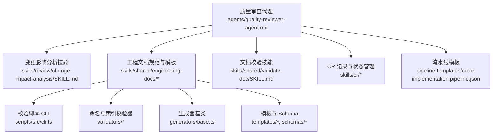
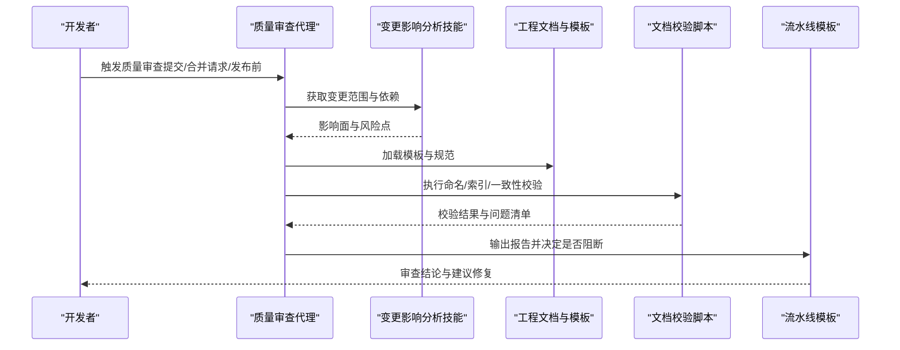
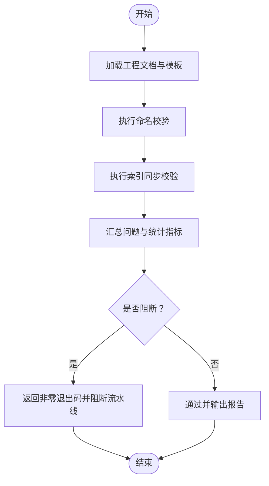
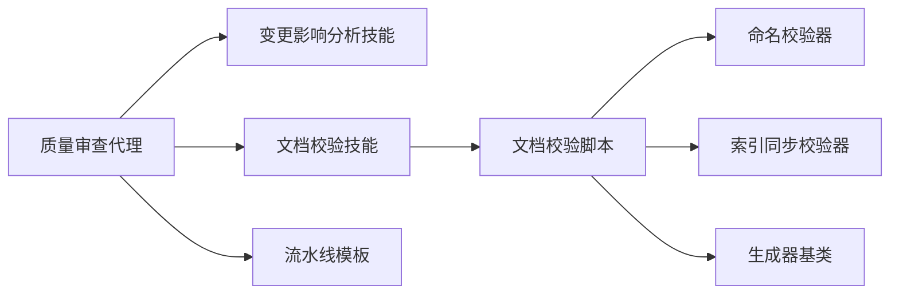

# 质量审查代理

<cite>
**本文引用的文件**   
- [agents/quality-reviewer-agent.md](file://agents/quality-reviewer-agent.md)
- [skills/review/change-impact-analysis/SKILL.md](file://skills/review/change-impact-analysis/SKILL.md)
- [skills/shared/engineering-docs/SKILL.md](file://skills/shared/engineering-docs/SKILL.md)
- [skills/shared/engineering-docs/scripts/src/cli.ts](file://skills/shared/engineering-docs/scripts/src/cli.ts)
- [skills/shared/engineering-docs/scripts/src/validators/index-sync.ts](file://skills/shared/engineering-docs/scripts/src/validators/index-sync.ts)
- [skills/shared/engineering-docs/scripts/src/validators/naming.ts](file://skills/shared/engineering-docs/scripts/src/validators/naming.ts)
- [skills/shared/engineering-docs/scripts/src/generators/base.ts](file://skills/shared/engineering-docs/scripts/src/generators/base.ts)
- [skills/shared/engineering-docs/scripts/package.json](file://skills/shared/engineering-docs/scripts/package.json)
- [skills/shared/engineering-docs/templates/PRD-template.md](file://skills/shared/engineering-docs/templates/PRD-template.md)
- [skills/shared/engineering-docs/templates/SDD-template.md](file://skills/shared/engineering-docs/templates/SDD-template.md)
- [skills/shared/engineering-docs/templates/TASK-template.md](file://skills/shared/engineering-docs/templates/TASK-template.md)
- [skills/shared/engineering-docs/schemas/common-defs.schema.json](file://skills/shared/engineering-docs/schemas/common-defs.schema.json)
- [skills/shared/engineering-docs/schemas/prd.schema.json](file://skills/shared/engineering-docs/schemas/prd.schema.json)
- [skills/shared/engineering-docs/schemas/sdd.schema.json](file://skills/shared/engineering-docs/schemas/sdd.schema.json)
- [skills/shared/engineering-docs/standards/ENGINEERING-STRUCTURE-TEAM.md](file://skills/shared/engineering-docs/standards/ENGINEERING-STRUCTURE-TEAM.md)
- [skills/shared/validate-doc/SKILL.md](file://skills/shared/validate-doc/SKILL.md)
- [skills/cr/cr-review-record/SKILL.md](file://skills/cr/cr-review-record/SKILL.md)
- [skills/cr/cr-status-set/SKILL.md](file://skills/cr/cr-status-set/SKILL.md)
- [skills/cr/cr-show/SKILL.md](file://skills/cr/cr-show/SKILL.md)
- [pipeline-templates/code-implementation.pipeline.json](file://pipeline-templates/code-implementation.pipeline.json)
</cite>

## 目录
1. [简介](#简介)
2. [项目结构](#项目结构)
3. [核心组件](#核心组件)
4. [架构总览](#架构总览)
5. [详细组件分析](#详细组件分析)
6. [依赖关系分析](#依赖关系分析)
7. [性能与可扩展性](#性能与可扩展性)
8. [故障排查指南](#故障排查指南)
9. [结论](#结论)
10. [附录](#附录)

## 简介
本文件为“质量审查代理”的使用文档，聚焦以下职责：代码质量检查、变更影响分析、合规性审查与风险评估。文档面向工程团队与自动化流水线，提供可操作的配置项说明、规则引擎能力、自动化检测流程以及与静态分析、安全扫描、测试框架的集成建议，并给出度量指标与持续改进方法论。

## 项目结构
仓库采用“代理 + 技能（Skill）+ 模板/规范 + 脚本工具 + 流水线模板”的组织方式：
- 代理定义位于 agents 目录，描述角色职责与行为边界
- 技能位于 skills 目录，按领域划分，如 review、shared、cr 等
- 共享工程文档规范、模板与校验脚本位于 skills/shared/engineering-docs
- 流水线模板位于 pipeline-templates，用于编排端到端流程

图表来源
- [agents/quality-reviewer-agent.md](file://agents/quality-reviewer-agent.md)
- [skills/review/change-impact-analysis/SKILL.md](file://skills/review/change-impact-analysis/SKILL.md)
- [skills/shared/engineering-docs/SKILL.md](file://skills/shared/engineering-docs/SKILL.md)
- [skills/shared/engineering-docs/scripts/src/cli.ts](file://skills/shared/engineering-docs/scripts/src/cli.ts)
- [skills/shared/engineering-docs/scripts/src/validators/index-sync.ts](file://skills/shared/engineering-docs/scripts/src/validators/index-sync.ts)
- [skills/shared/engineering-docs/scripts/src/validators/naming.ts](file://skills/shared/engineering-docs/scripts/src/validators/naming.ts)
- [skills/shared/engineering-docs/scripts/src/generators/base.ts](file://skills/shared/engineering-docs/scripts/src/generators/base.ts)
- [pipeline-templates/code-implementation.pipeline.json](file://pipeline-templates/code-implementation.pipeline.json)

章节来源
- [agents/quality-reviewer-agent.md](file://agents/quality-reviewer-agent.md)
- [skills/shared/engineering-docs/SKILL.md](file://skills/shared/engineering-docs/SKILL.md)
- [pipeline-templates/code-implementation.pipeline.json](file://pipeline-templates/code-implementation.pipeline.json)

## 核心组件
- 质量审查代理：负责协调质量相关任务，包括代码质量检查、变更影响分析、合规性审查与风险评估，并驱动相关技能与工具执行。
- 变更影响分析技能：基于变更范围与依赖关系，评估潜在风险与回归面，辅助制定审查策略。
- 工程文档规范与模板：提供统一的文档结构、命名约定与 Schema 约束，确保产出物一致性与可验证性。
- 文档校验脚本：提供 CLI 入口，串联命名、索引一致性等校验逻辑，支持在本地或 CI 中运行。
- CR 记录与状态管理：将审查结果、问题清单与状态流转纳入统一记录体系，便于追踪与审计。

章节来源
- [agents/quality-reviewer-agent.md](file://agents/quality-reviewer-agent.md)
- [skills/review/change-impact-analysis/SKILL.md](file://skills/review/change-impact-analysis/SKILL.md)
- [skills/shared/engineering-docs/SKILL.md](file://skills/shared/engineering-docs/SKILL.md)
- [skills/shared/engineering-docs/scripts/src/cli.ts](file://skills/shared/engineering-docs/scripts/src/cli.ts)
- [skills/cr/cr-review-record/SKILL.md](file://skills/cr/cr-review-record/SKILL.md)
- [skills/cr/cr-status-set/SKILL.md](file://skills/cr/cr-status-set/SKILL.md)

## 架构总览
质量审查代理以“规则 + 数据 + 工具”的方式组织：
- 规则层：编码规范、命名约定、文档 Schema、审查清单
- 数据层：工程文档、模板、Schema、变更记录
- 工具层：CLI 校验器、生成器、流水线模板

图表来源
- [agents/quality-reviewer-agent.md](file://agents/quality-reviewer-agent.md)
- [skills/review/change-impact-analysis/SKILL.md](file://skills/review/change-impact-analysis/SKILL.md)
- [skills/shared/engineering-docs/SKILL.md](file://skills/shared/engineering-docs/SKILL.md)
- [skills/shared/engineering-docs/scripts/src/cli.ts](file://skills/shared/engineering-docs/scripts/src/cli.ts)
- [pipeline-templates/code-implementation.pipeline.json](file://pipeline-templates/code-implementation.pipeline.json)

## 详细组件分析

### 质量审查代理
- 职责边界：协调变更影响分析、文档合规性检查、风险评估与报告输出；在关键节点（提交前、MR 审查、发布前）进行拦截与提示。
- 输入：变更集、工程文档、模板与规范、历史审查记录。
- 输出：审查报告、问题清单、风险等级、修复建议、流水线阻断决策。

章节来源
- [agents/quality-reviewer-agent.md](file://agents/quality-reviewer-agent.md)

### 变更影响分析技能
- 目标：识别受影响的模块、接口与文档，评估回归面与风险点，指导测试与审查重点。
- 方法：基于变更路径、依赖关系与文档关联进行影响面推断。
- 输出：影响矩阵、风险等级、建议的测试用例与审查要点。

章节来源
- [skills/review/change-impact-analysis/SKILL.md](file://skills/review/change-impact-analysis/SKILL.md)

### 工程文档规范与模板
- 规范与标准：统一文档结构、命名约定、版本与元数据字段要求。
- 模板：覆盖 PRD、SDD、TASK 等关键文档类型，保证内容完整性与一致性。
- Schema：对文档字段进行强约束，提升自动化校验能力。

章节来源
- [skills/shared/engineering-docs/SKILL.md](file://skills/shared/engineering-docs/SKILL.md)
- [skills/shared/engineering-docs/templates/PRD-template.md](file://skills/shared/engineering-docs/templates/PRD-template.md)
- [skills/shared/engineering-docs/templates/SDD-template.md](file://skills/shared/engineering-docs/templates/SDD-template.md)
- [skills/shared/engineering-docs/templates/TASK-template.md](file://skills/shared/engineering-docs/templates/TASK-template.md)
- [skills/shared/engineering-docs/schemas/common-defs.schema.json](file://skills/shared/engineering-docs/schemas/common-defs.schema.json)
- [skills/shared/engineering-docs/schemas/prd.schema.json](file://skills/shared/engineering-docs/schemas/prd.schema.json)
- [skills/shared/engineering-docs/schemas/sdd.schema.json](file://skills/shared/engineering-docs/schemas/sdd.schema.json)
- [skills/shared/engineering-docs/standards/ENGINEERING-STRUCTURE-TEAM.md](file://skills/shared/engineering-docs/standards/ENGINEERING-STRUCTURE-TEAM.md)

### 文档校验脚本（CLI）
- 入口：CLI 命令用于批量执行文档校验任务。
- 校验器：
  - 命名校验：依据命名约定检查文件名与内容引用的一致性。
  - 索引同步校验：确保文档索引与实际文件保持一致。
- 生成器：提供基础生成能力，辅助快速创建符合规范的文档骨架。

图表来源
- [skills/shared/engineering-docs/scripts/src/cli.ts](file://skills/shared/engineering-docs/scripts/src/cli.ts)
- [skills/shared/engineering-docs/scripts/src/validators/naming.ts](file://skills/shared/engineering-docs/scripts/src/validators/naming.ts)
- [skills/shared/engineering-docs/scripts/src/validators/index-sync.ts](file://skills/shared/engineering-docs/scripts/src/validators/index-sync.ts)
- [skills/shared/engineering-docs/scripts/src/generators/base.ts](file://skills/shared/engineering-docs/scripts/src/generators/base.ts)

章节来源
- [skills/shared/engineering-docs/scripts/src/cli.ts](file://skills/shared/engineering-docs/scripts/src/cli.ts)
- [skills/shared/engineering-docs/scripts/src/validators/naming.ts](file://skills/shared/engineering-docs/scripts/src/validators/naming.ts)
- [skills/shared/engineering-docs/scripts/src/validators/index-sync.ts](file://skills/shared/engineering-docs/scripts/src/validators/index-sync.ts)
- [skills/shared/engineering-docs/scripts/src/generators/base.ts](file://skills/shared/engineering-docs/scripts/src/generators/base.ts)
- [skills/shared/engineering-docs/scripts/package.json](file://skills/shared/engineering-docs/scripts/package.json)

### 文档校验技能
- 作用：封装文档校验流程，提供标准化调用方式，便于在代理或流水线中复用。
- 能力：结合模板与 Schema 进行完整性与一致性检查，输出结构化问题列表。

章节来源
- [skills/shared/validate-doc/SKILL.md](file://skills/shared/validate-doc/SKILL.md)

### CR 记录与状态管理
- 审查记录：将审查过程、问题清单、修复建议与结论持久化，形成可追溯记录。
- 状态设置：支持在审查过程中更新状态（如待处理、已修复、已通过），并与流水线联动。
- 展示查询：提供查看与检索功能，便于团队协作与审计。

章节来源
- [skills/cr/cr-review-record/SKILL.md](file://skills/cr/cr-review-record/SKILL.md)
- [skills/cr/cr-status-set/SKILL.md](file://skills/cr/cr-status-set/SKILL.md)
- [skills/cr/cr-show/SKILL.md](file://skills/cr/cr-show/SKILL.md)

## 依赖关系分析
- 代理依赖变更影响分析技能与文档校验技能，组合形成完整的质量审查闭环。
- 文档校验脚本依赖命名与索引校验器，以及生成器基类提供的通用能力。
- 流水线模板作为编排入口，串联代理与各技能，实现端到端自动化。

图表来源
- [agents/quality-reviewer-agent.md](file://agents/quality-reviewer-agent.md)
- [skills/review/change-impact-analysis/SKILL.md](file://skills/review/change-impact-analysis/SKILL.md)
- [skills/shared/validate-doc/SKILL.md](file://skills/shared/validate-doc/SKILL.md)
- [skills/shared/engineering-docs/scripts/src/cli.ts](file://skills/shared/engineering-docs/scripts/src/cli.ts)
- [skills/shared/engineering-docs/scripts/src/validators/naming.ts](file://skills/shared/engineering-docs/scripts/src/validators/naming.ts)
- [skills/shared/engineering-docs/scripts/src/validators/index-sync.ts](file://skills/shared/engineering-docs/scripts/src/validators/index-sync.ts)
- [skills/shared/engineering-docs/scripts/src/generators/base.ts](file://skills/shared/engineering-docs/scripts/src/generators/base.ts)
- [pipeline-templates/code-implementation.pipeline.json](file://pipeline-templates/code-implementation.pipeline.json)

章节来源
- [agents/quality-reviewer-agent.md](file://agents/quality-reviewer-agent.md)
- [skills/shared/engineering-docs/scripts/src/cli.ts](file://skills/shared/engineering-docs/scripts/src/cli.ts)
- [pipeline-templates/code-implementation.pipeline.json](file://pipeline-templates/code-implementation.pipeline.json)

## 性能与可扩展性
- 增量校验：优先对变更涉及的文档与模板执行校验，减少全量扫描开销。
- 并行执行：命名与索引校验可并行运行，缩短整体耗时。
- 缓存策略：对模板解析与 Schema 加载结果进行缓存，避免重复计算。
- 扩展点：新增校验器或生成器时，遵循现有接口与注册机制，保持低耦合高内聚。

[本节为通用指导，不直接分析具体文件]

## 故障排查指南
- 常见问题
  - 命名不一致：根据命名校验器的错误定位，修正文件或引用名称。
  - 索引不同步：使用索引同步校验器生成的差异清单，补齐或删除冗余条目。
  - 模板字段缺失：对照 Schema 与模板要求，补充必要字段与元数据。
- 定位步骤
  - 在本地运行 CLI 校验，观察问题清单与统计指标。
  - 结合 CR 记录查看历史问题与修复情况，确认是否为回归。
  - 在流水线中复现，捕获更详细的日志与上下文。
- 恢复措施
  - 针对阻断性问题，先修复命名与索引问题，再重新触发审查。
  - 对于模板与 Schema 变更，需同步更新模板与校验规则，避免误报。

章节来源
- [skills/shared/engineering-docs/scripts/src/cli.ts](file://skills/shared/engineering-docs/scripts/src/cli.ts)
- [skills/shared/engineering-docs/scripts/src/validators/naming.ts](file://skills/shared/engineering-docs/scripts/src/validators/naming.ts)
- [skills/shared/engineering-docs/scripts/src/validators/index-sync.ts](file://skills/shared/engineering-docs/scripts/src/validators/index-sync.ts)
- [skills/cr/cr-review-record/SKILL.md](file://skills/cr/cr-review-record/SKILL.md)

## 结论
质量审查代理通过整合变更影响分析、工程文档规范与自动化校验脚本，构建了从提交到发布的端到端质量保障体系。借助清晰的规则与可观测的度量指标，团队可实现持续改进与风险前置控制。建议在关键里程碑（提交前、MR 审查、发布前）严格执行审查流程，并将审查结果纳入团队知识库与度量看板。

[本节为总结性内容，不直接分析具体文件]

## 附录

### 配置选项与质量标准
- 代码规范检查
  - 启用命名约定与结构规范校验
  - 结合模板与 Schema 进行完整性检查
- 安全漏洞扫描
  - 在流水线中集成第三方安全扫描器，输出告警与修复建议
- 性能基准测试
  - 在发布前阶段执行性能基准，对比阈值与趋势
- 文档完整性验证
  - 使用文档校验技能与 CLI 工具，确保模板字段齐全、索引一致

章节来源
- [skills/shared/engineering-docs/SKILL.md](file://skills/shared/engineering-docs/SKILL.md)
- [skills/shared/validate-doc/SKILL.md](file://skills/shared/validate-doc/SKILL.md)
- [pipeline-templates/code-implementation.pipeline.json](file://pipeline-templates/code-implementation.pipeline.json)

### 质量审查流程示例
- 提交前检查
  - 触发本地 CLI 校验，修复命名与索引问题
- 合并请求审查
  - 代理执行变更影响分析与文档校验，输出审查报告与建议
- 发布前审计
  - 在流水线中执行全量校验与安全扫描，达到阈值后放行

章节来源
- [agents/quality-reviewer-agent.md](file://agents/quality-reviewer-agent.md)
- [skills/review/change-impact-analysis/SKILL.md](file://skills/review/change-impact-analysis/SKILL.md)
- [skills/shared/engineering-docs/scripts/src/cli.ts](file://skills/shared/engineering-docs/scripts/src/cli.ts)
- [pipeline-templates/code-implementation.pipeline.json](file://pipeline-templates/code-implementation.pipeline.json)

### 与外部工具的集成建议
- 静态分析工具
  - 在流水线中调用静态分析命令，收集问题并写入 CR 记录
- 安全扫描器
  - 集成 SAST/DAST 工具，将漏洞清单与严重级别纳入审查报告
- 测试框架
  - 在变更影响分析基础上，动态选择测试用例集，提高覆盖率与效率

[本节为通用指导，不直接分析具体文件]

### 质量度量指标与持续改进
- 指标建议
  - 命名与索引一致性比率
  - 文档字段完整率
  - 审查通过率与平均修复时长
  - 安全漏洞密度与修复周期
- 持续改进
  - 定期回顾审查问题，优化规则与模板
  - 建立度量看板，跟踪趋势与异常波动
  - 将最佳实践沉淀为规范与模板，降低回归概率

[本节为通用指导，不直接分析具体文件]