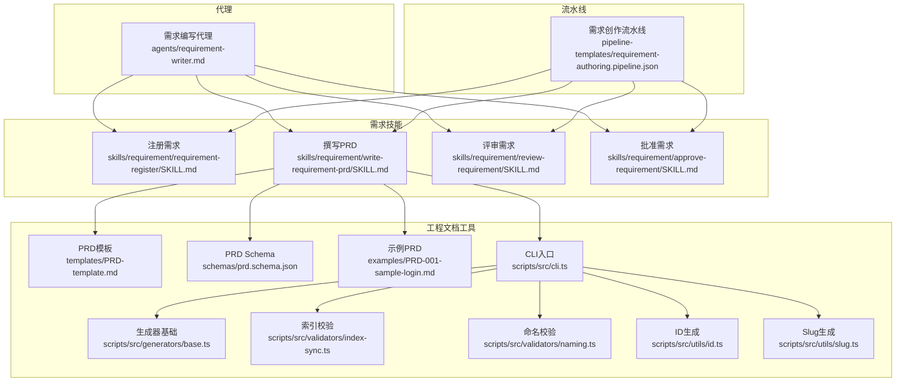
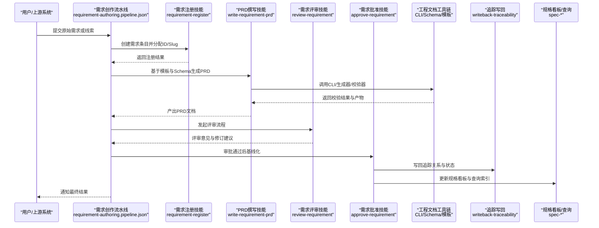
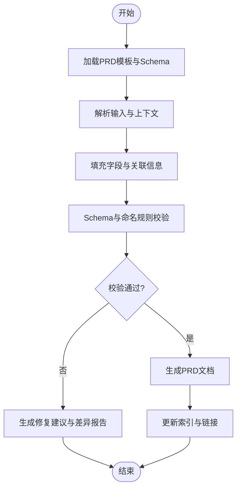
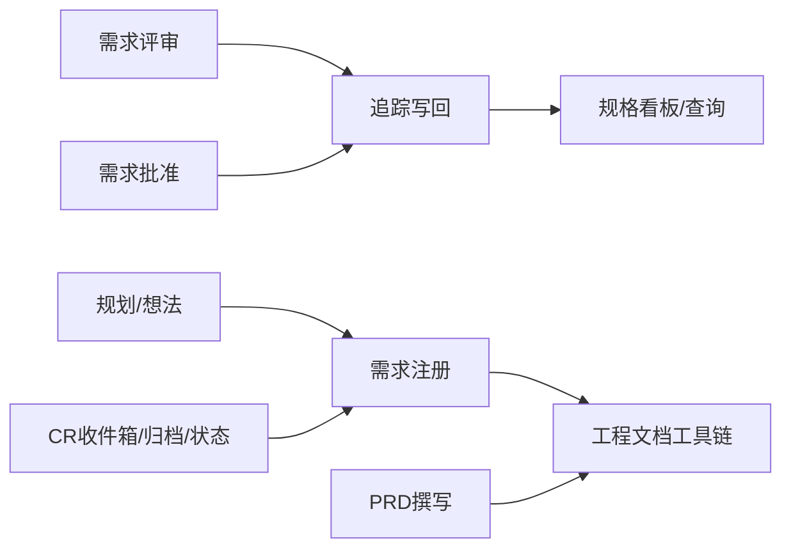

# 需求编写代理

<cite>
**本文引用的文件**   
- [agents/requirement-writer.md](file://agents/requirement-writer.md)
- [pipeline-templates/requirement-authoring.pipeline.json](file://pipeline-templates/requirement-authoring.pipeline.json)
- [skills/requirement/write-requirement-prd/SKILL.md](file://skills/requirement/write-requirement-prd/SKILL.md)
- [skills/requirement/requirement-register/SKILL.md](file://skills/requirement/requirement-register/SKILL.md)
- [skills/requirement/review-requirement/SKILL.md](file://skills/requirement/review-requirement/SKILL.md)
- [skills/requirement/approve-requirement/SKILL.md](file://skills/requirement/approve-requirement/SKILL.md)
- [skills/shared/engineering-docs/templates/PRD-template.md](file://skills/shared/engineering-docs/templates/PRD-template.md)
- [skills/shared/engineering-docs/schemas/prd.schema.json](file://skills/shared/engineering-docs/schemas/prd.schema.json)
- [skills/shared/engineering-docs/examples/PRD-001-sample-login.md](file://skills/shared/engineering-docs/examples/PRD-001-sample-login.md)
- [skills/shared/engineering-docs/scripts/src/cli.ts](file://skills/shared/engineering-docs/scripts/src/cli.ts)
- [skills/shared/engineering-docs/scripts/src/generators/base.ts](file://skills/shared/engineering-docs/scripts/src/generators/base.ts)
- [skills/shared/engineering-docs/scripts/src/validators/index-sync.ts](file://skills/shared/engineering-docs/scripts/src/validators/index-sync.ts)
- [skills/shared/engineering-docs/scripts/src/validators/naming.ts](file://skills/shared/engineering-docs/scripts/src/validators/naming.ts)
- [skills/shared/engineering-docs/scripts/src/utils/id.ts](file://skills/shared/engineering-docs/scripts/src/utils/id.ts)
- [skills/shared/engineering-docs/scripts/src/utils/slug.ts](file://skills/shared/engineering-docs/scripts/src/utils/slug.ts)
- [skills/shared/engineering-docs/scripts/package.json](file://skills/shared/engineering-docs/scripts/package.json)
- [skills/shared/engineering-docs/standards/ENGINEERING-STRUCTURE-TEAM.md](file://skills/shared/engineering-docs/standards/ENGINEERING-STRUCTURE-TEAM.md)
- [skills/shared/validate-doc/SKILL.md](file://skills/shared/validate-doc/SKILL.md)
- [skills/spec/spec-dashboard/SKILL.md](file://skills/spec/spec-dashboard/SKILL.md)
- [skills/spec/spec-query/SKILL.md](file://skills/spec/spec-query/SKILL.md)
- [skills/spec/spec-show/SKILL.md](file://skills/spec/spec-show/SKILL.md)
- [skills/writeback/writeback-traceability/SKILL.md](file://skills/writeback/writeback-traceability/SKILL.md)
- [skills/writeback/writeback-prd-sdd/SKILL.md](file://skills/writeback/writeback-prd-sdd/SKILL.md)
- [skills/cr/cr-inbox/SKILL.md](file://skills/cr/cr-inbox/SKILL.md)
- [skills/cr/cr-archive/SKILL.md](file://skills/cr/cr-archive/SKILL.md)
- [skills/cr/cr-status-set/SKILL.md](file://skills/cr/cr-status-set/SKILL.md)
- [skills/cr/cr-review-record/SKILL.md](file://skills/cr/cr-review-record/SKILL.md)
- [skills/cr/cr-show/SKILL.md](file://skills/cr/cr-show/SKILL.md)
- [skills/cr/cr-dashboard/SKILL.md](file://skills/cr/cr-dashboard/SKILL.md)
- [skills/cr/feedback-writeback/SKILL.md](file://skills/cr/feedback-writeback/SKILL.md)
- [skills/cr/inbox-emit/SKILL.md](file://skills/cr/inbox-emit/SKILL.md)
- [skills/planning/focus-briefing/SKILL.md](file://skills/planning/focus-briefing/SKILL.md)
- [skills/planning/record-idea/SKILL.md](file://skills/planning/record-idea/SKILL.md)
- [skills/planning/write-planning-entry/SKILL.md](file://skills/planning/write-planning-entry/SKILL.md)
- [skills/planning/write-planning-report/SKILL.md](file://skills/planning/write-planning-report/SKILL.md)
- [skills/planning/write-roadmap/SKILL.md](file://skills/planning/write-roadmap/SKILL.md)
- [skills/review/change-impact-analysis/SKILL.md](file://skills/review/change-impact-analysis/SKILL.md)
- [skills/review/review-alignment/SKILL.md](file://skills/review/review-alignment/SKILL.md)
</cite>

## 目录
1. [简介](#简介)
2. [项目结构](#项目结构)
3. [核心组件](#核心组件)
4. [架构总览](#架构总览)
5. [详细组件分析](#详细组件分析)
6. [依赖分析](#依赖分析)
7. [性能考虑](#性能考虑)
8. [故障排查指南](#故障排查指南)
9. [结论](#结论)
10. [附录](#附录)

## 简介
本文件为“需求编写代理”的完整使用文档，面向产品经理、需求工程师与研发协作团队。该代理围绕以下核心职责展开：
- 需求收集整理：从多渠道输入（用户反馈、竞品动态、规划记录等）汇聚原始需求素材，进行去重、分类与优先级初筛。
- PRD文档生成：基于统一模板与模式校验，自动生成结构化PRD，确保字段完备、命名规范、版本可追溯。
- 需求规格定义：将业务语言转化为可执行的功能规格，包括用例、验收标准、接口契约与数据模型约定。
- 需求追踪管理：贯穿注册、评审、批准、基线化与变更控制的全生命周期，形成端到端可审计链路。

此外，代理具备：
- 自然语言处理能力：对口语化、碎片化输入进行意图识别、实体抽取与结构化映射。
- 结构化文档生成：以JSON Schema驱动模板填充与一致性校验，输出符合工程规范的文档。
- 版本管理机制：通过ID/Slug生成、索引同步与变更影响分析，实现可回溯的版本治理。

## 项目结构
仓库采用“代理+技能+流水线模板+共享工程文档工具链”的分层组织方式：
- agents：定义各角色代理的职责与入口说明
- skills：按领域划分的可复用技能包（需求、评审、规划、写回、CR等）
- pipeline-templates：编排多阶段工作流的流水线配置
- shared/engineering-docs：统一的文档模板、Schema、示例与脚本工具（CLI、生成器、校验器、ID/Slug工具）

图表来源
- [agents/requirement-writer.md](file://agents/requirement-writer.md)
- [skills/requirement/write-requirement-prd/SKILL.md](file://skills/requirement/write-requirement-prd/SKILL.md)
- [skills/requirement/requirement-register/SKILL.md](file://skills/requirement/requirement-register/SKILL.md)
- [skills/requirement/review-requirement/SKILL.md](file://skills/requirement/review-requirement/SKILL.md)
- [skills/requirement/approve-requirement/SKILL.md](file://skills/requirement/approve-requirement/SKILL.md)
- [skills/shared/engineering-docs/templates/PRD-template.md](file://skills/shared/engineering-docs/templates/PRD-template.md)
- [skills/shared/engineering-docs/schemas/prd.schema.json](file://skills/shared/engineering-docs/schemas/prd.schema.json)
- [skills/shared/engineering-docs/examples/PRD-001-sample-login.md](file://skills/shared/engineering-docs/examples/PRD-001-sample-login.md)
- [skills/shared/engineering-docs/scripts/src/cli.ts](file://skills/shared/engineering-docs/scripts/src/cli.ts)
- [skills/shared/engineering-docs/scripts/src/generators/base.ts](file://skills/shared/engineering-docs/scripts/src/generators/base.ts)
- [skills/shared/engineering-docs/scripts/src/validators/index-sync.ts](file://skills/shared/engineering-docs/scripts/src/validators/index-sync.ts)
- [skills/shared/engineering-docs/scripts/src/validators/naming.ts](file://skills/shared/engineering-docs/scripts/src/validators/naming.ts)
- [skills/shared/engineering-docs/scripts/src/utils/id.ts](file://skills/shared/engineering-docs/scripts/src/utils/id.ts)
- [skills/shared/engineering-docs/scripts/src/utils/slug.ts](file://skills/shared/engineering-docs/scripts/src/utils/slug.ts)
- [pipeline-templates/requirement-authoring.pipeline.json](file://pipeline-templates/requirement-authoring.pipeline.json)

章节来源
- [agents/requirement-writer.md](file://agents/requirement-writer.md)
- [pipeline-templates/requirement-authoring.pipeline.json](file://pipeline-templates/requirement-authoring.pipeline.json)

## 核心组件
- 需求注册技能：负责收集原始需求、建立唯一标识、登记元数据并进入待处理队列。
- PRD撰写技能：依据模板与Schema生成PRD，自动补齐必要字段，产出示例对照与差异提示。
- 需求评审技能：提供评审要点清单、对齐检查与问题归集，支持多人协同批注。
- 需求批准技能：完成基线化与发布标记，触发下游写回与追踪更新。
- 工程文档工具链：提供模板、Schema、示例、CLI、生成器、校验器与ID/Slug工具，保障文档一致性与可追溯性。

章节来源
- [skills/requirement/requirement-register/SKILL.md](file://skills/requirement/requirement-register/SKILL.md)
- [skills/requirement/write-requirement-prd/SKILL.md](file://skills/requirement/write-requirement-prd/SKILL.md)
- [skills/requirement/review-requirement/SKILL.md](file://skills/requirement/review-requirement/SKILL.md)
- [skills/requirement/approve-requirement/SKILL.md](file://skills/requirement/approve-requirement/SKILL.md)
- [skills/shared/engineering-docs/scripts/src/cli.ts](file://skills/shared/engineering-docs/scripts/src/cli.ts)
- [skills/shared/engineering-docs/scripts/src/generators/base.ts](file://skills/shared/engineering-docs/scripts/src/generators/base.ts)
- [skills/shared/engineering-docs/scripts/src/validators/index-sync.ts](file://skills/shared/engineering-docs/scripts/src/validators/index-sync.ts)
- [skills/shared/engineering-docs/scripts/src/validators/naming.ts](file://skills/shared/engineering-docs/scripts/src/validators/naming.ts)
- [skills/shared/engineering-docs/scripts/src/utils/id.ts](file://skills/shared/engineering-docs/scripts/src/utils/id.ts)
- [skills/shared/engineering-docs/scripts/src/utils/slug.ts](file://skills/shared/engineering-docs/scripts/src/utils/slug.ts)

## 架构总览
需求编写代理以“流水线驱动 + 技能编排 + 工程文档工具链”的方式运行。上游输入来自规划与反馈渠道，经注册与撰写后进入评审与批准流程；批准后触发写回与追踪更新，并与规格看板联动展示。

图表来源
- [pipeline-templates/requirement-authoring.pipeline.json](file://pipeline-templates/requirement-authoring.pipeline.json)
- [skills/requirement/requirement-register/SKILL.md](file://skills/requirement/requirement-register/SKILL.md)
- [skills/requirement/write-requirement-prd/SKILL.md](file://skills/requirement/write-requirement-prd/SKILL.md)
- [skills/requirement/review-requirement/SKILL.md](file://skills/requirement/review-requirement/SKILL.md)
- [skills/requirement/approve-requirement/SKILL.md](file://skills/requirement/approve-requirement/SKILL.md)
- [skills/shared/engineering-docs/scripts/src/cli.ts](file://skills/shared/engineering-docs/scripts/src/cli.ts)
- [skills/writeback/writeback-traceability/SKILL.md](file://skills/writeback/writeback-traceability/SKILL.md)
- [skills/spec/spec-dashboard/SKILL.md](file://skills/spec/spec-dashboard/SKILL.md)
- [skills/spec/spec-query/SKILL.md](file://skills/spec/spec-query/SKILL.md)

## 详细组件分析

### 需求注册技能
- 职责：接收原始需求，提取关键实体（主题、范围、相关方、优先级），生成唯一ID与Slug，写入索引并进入待处理队列。
- 能力：
  - 自然语言解析：从自由文本中抽取结构化字段，补全缺失项。
  - 冲突检测：基于标题/关键词相似度与已有索引，避免重复注册。
  - 元数据登记：记录来源、时间戳、责任人、初始状态。
- 输出：注册记录、ID/Slug、索引条目、待办任务。

章节来源
- [skills/requirement/requirement-register/SKILL.md](file://skills/requirement/requirement-register/SKILL.md)
- [skills/shared/engineering-docs/scripts/src/utils/id.ts](file://skills/shared/engineering-docs/scripts/src/utils/id.ts)
- [skills/shared/engineering-docs/scripts/src/utils/slug.ts](file://skills/shared/engineering-docs/scripts/src/utils/slug.ts)
- [skills/shared/engineering-docs/scripts/src/validators/index-sync.ts](file://skills/shared/engineering-docs/scripts/src/validators/index-sync.ts)

### PRD撰写技能
- 职责：根据模板与Schema生成PRD，自动填充字段、校验完整性与一致性，输出示例对照与差异报告。
- 能力：
  - 模板驱动：基于PRD模板与通用定义，保证结构与风格统一。
  - Schema校验：严格遵循PRD Schema，拦截非法或缺失字段。
  - 示例对比：参考示例PRD，辅助定位差异与改进点。
- 输出：PRD文档、校验报告、差异摘要。

图表来源
- [skills/requirement/write-requirement-prd/SKILL.md](file://skills/requirement/write-requirement-prd/SKILL.md)
- [skills/shared/engineering-docs/templates/PRD-template.md](file://skills/shared/engineering-docs/templates/PRD-template.md)
- [skills/shared/engineering-docs/schemas/prd.schema.json](file://skills/shared/engineering-docs/schemas/prd.schema.json)
- [skills/shared/engineering-docs/examples/PRD-001-sample-login.md](file://skills/shared/engineering-docs/examples/PRD-001-sample-login.md)
- [skills/shared/engineering-docs/scripts/src/cli.ts](file://skills/shared/engineering-docs/scripts/src/cli.ts)
- [skills/shared/engineering-docs/scripts/src/generators/base.ts](file://skills/shared/engineering-docs/scripts/src/generators/base.ts)
- [skills/shared/engineering-docs/scripts/src/validators/naming.ts](file://skills/shared/engineering-docs/scripts/src/validators/naming.ts)

章节来源
- [skills/requirement/write-requirement-prd/SKILL.md](file://skills/requirement/write-requirement-prd/SKILL.md)
- [skills/shared/engineering-docs/templates/PRD-template.md](file://skills/shared/engineering-docs/templates/PRD-template.md)
- [skills/shared/engineering-docs/schemas/prd.schema.json](file://skills/shared/engineering-docs/schemas/prd.schema.json)
- [skills/shared/engineering-docs/examples/PRD-001-sample-login.md](file://skills/shared/engineering-docs/examples/PRD-001-sample-login.md)
- [skills/shared/engineering-docs/scripts/src/cli.ts](file://skills/shared/engineering-docs/scripts/src/cli.ts)
- [skills/shared/engineering-docs/scripts/src/generators/base.ts](file://skills/shared/engineering-docs/scripts/src/generators/base.ts)
- [skills/shared/engineering-docs/scripts/src/validators/naming.ts](file://skills/shared/engineering-docs/scripts/src/validators/naming.ts)

### 需求评审技能
- 职责：组织评审活动，提供评审清单、对齐检查与问题归集，支持多轮迭代修订。
- 能力：
  - 评审要点：覆盖目标达成度、范围边界、风险与依赖、验收标准完备性。
  - 对齐检查：与规划目标、路线图与既有规格的一致性验证。
  - 问题跟踪：记录问题、责任人与解决时限，闭环管理。
- 输出：评审纪要、问题清单、修订建议。

章节来源
- [skills/requirement/review-requirement/SKILL.md](file://skills/requirement/review-requirement/SKILL.md)
- [skills/review/review-alignment/SKILL.md](file://skills/review/review-alignment/SKILL.md)

### 需求批准技能
- 职责：在评审通过后完成基线化与发布标记，触发写回与追踪更新。
- 能力：
  - 基线化：锁定当前版本PRD与关联工件，生成基线号。
  - 写回：将状态与关系写回至追踪系统与看板。
  - 通知：向相关方发送批准结果与后续动作。
- 输出：基线记录、写回日志、通知消息。

章节来源
- [skills/requirement/approve-requirement/SKILL.md](file://skills/requirement/approve-requirement/SKILL.md)
- [skills/writeback/writeback-traceability/SKILL.md](file://skills/writeback/writeback-traceability/SKILL.md)

### 工程文档工具链
- CLI：统一入口，协调模板加载、生成与校验流程。
- 生成器：基于基础生成器扩展具体文档类型。
- 校验器：索引同步与命名规则校验，保障文档体系一致性。
- 工具：ID与Slug生成，确保唯一性与可读性。
- 依赖：通过package.json声明运行时依赖与脚本命令。

章节来源
- [skills/shared/engineering-docs/scripts/src/cli.ts](file://skills/shared/engineering-docs/scripts/src/cli.ts)
- [skills/shared/engineering-docs/scripts/src/generators/base.ts](file://skills/shared/engineering-docs/scripts/src/generators/base.ts)
- [skills/shared/engineering-docs/scripts/src/validators/index-sync.ts](file://skills/shared/engineering-docs/scripts/src/validators/index-sync.ts)
- [skills/shared/engineering-docs/scripts/src/validators/naming.ts](file://skills/shared/engineering-docs/scripts/src/validators/naming.ts)
- [skills/shared/engineering-docs/scripts/src/utils/id.ts](file://skills/shared/engineering-docs/scripts/src/utils/id.ts)
- [skills/shared/engineering-docs/scripts/src/utils/slug.ts](file://skills/shared/engineering-docs/scripts/src/utils/slug.ts)
- [skills/shared/engineering-docs/scripts/package.json](file://skills/shared/engineering-docs/scripts/package.json)

## 依赖分析
- 组件耦合：
  - 需求注册与PRD撰写强依赖工程文档工具链（CLI、Schema、模板）。
  - 评审与批准依赖写回与规格看板，形成闭环。
- 外部集成点：
  - 需求管理平台：通过写回技能同步状态与关系。
  - 原型设计工具：可在PRD中引用原型链接，由写回技能维护关联。
  - 测试用例生成器：基于PRD中的验收标准与功能规格，生成测试用例并回写追踪。
- 潜在循环依赖：
  - 评审与批准环节应避免直接反向修改注册阶段未决字段，需通过修订建议与二次生成流程处理。

图表来源
- [skills/requirement/requirement-register/SKILL.md](file://skills/requirement/requirement-register/SKILL.md)
- [skills/requirement/write-requirement-prd/SKILL.md](file://skills/requirement/write-requirement-prd/SKILL.md)
- [skills/requirement/review-requirement/SKILL.md](file://skills/requirement/review-requirement/SKILL.md)
- [skills/requirement/approve-requirement/SKILL.md](file://skills/requirement/approve-requirement/SKILL.md)
- [skills/writeback/writeback-traceability/SKILL.md](file://skills/writeback/writeback-traceability/SKILL.md)
- [skills/spec/spec-dashboard/SKILL.md](file://skills/spec/spec-dashboard/SKILL.md)
- [skills/spec/spec-query/SKILL.md](file://skills/spec/spec-query/SKILL.md)
- [skills/cr/cr-inbox/SKILL.md](file://skills/cr/cr-inbox/SKILL.md)
- [skills/cr/cr-archive/SKILL.md](file://skills/cr/cr-archive/SKILL.md)
- [skills/cr/cr-status-set/SKILL.md](file://skills/cr/cr-status-set/SKILL.md)

章节来源
- [skills/requirement/requirement-register/SKILL.md](file://skills/requirement/requirement-register/SKILL.md)
- [skills/requirement/write-requirement-prd/SKILL.md](file://skills/requirement/write-requirement-prd/SKILL.md)
- [skills/requirement/review-requirement/SKILL.md](file://skills/requirement/review-requirement/SKILL.md)
- [skills/requirement/approve-requirement/SKILL.md](file://skills/requirement/approve-requirement/SKILL.md)
- [skills/writeback/writeback-traceability/SKILL.md](file://skills/writeback/writeback-traceability/SKILL.md)
- [skills/spec/spec-dashboard/SKILL.md](file://skills/spec/spec-dashboard/SKILL.md)
- [skills/spec/spec-query/SKILL.md](file://skills/spec/spec-query/SKILL.md)
- [skills/cr/cr-inbox/SKILL.md](file://skills/cr/cr-inbox/SKILL.md)
- [skills/cr/cr-archive/SKILL.md](file://skills/cr/cr-archive/SKILL.md)
- [skills/cr/cr-status-set/SKILL.md](file://skills/cr/cr-status-set/SKILL.md)

## 性能考虑
- 批量生成：利用CLI并行处理多个需求的PRD生成与校验，减少I/O等待。
- 增量校验：仅对变更文件执行Schema与命名规则校验，降低整体耗时。
- 缓存策略：对模板与Schema加载结果进行内存缓存，避免重复解析。
- 索引优化：定期重建索引，提升查重与查询效率。

[本节为通用指导，不直接分析具体文件]

## 故障排查指南
- 校验失败：
  - 现象：PRD生成时报错字段缺失或格式不符。
  - 排查：查看Schema错误详情与命名规则提示，修正对应字段。
  - 参考：PRD Schema与命名校验器。
- 索引不同步：
  - 现象：搜索不到已生成的PRD或出现重复ID。
  - 排查：运行索引同步校验，修复不一致条目。
  - 参考：索引同步校验器。
- 审批卡住：
  - 现象：批准后未触发写回或看板未更新。
  - 排查：检查写回日志与权限配置，确认下游服务可用。
  - 参考：追踪写回技能。

章节来源
- [skills/shared/engineering-docs/schemas/prd.schema.json](file://skills/shared/engineering-docs/schemas/prd.schema.json)
- [skills/shared/engineering-docs/scripts/src/validators/naming.ts](file://skills/shared/engineering-docs/scripts/src/validators/naming.ts)
- [skills/shared/engineering-docs/scripts/src/validators/index-sync.ts](file://skills/shared/engineering-docs/scripts/src/validators/index-sync.ts)
- [skills/writeback/writeback-traceability/SKILL.md](file://skills/writeback/writeback-traceability/SKILL.md)

## 结论
需求编写代理通过“注册-撰写-评审-批准-写回-追踪”的闭环流程，结合工程文档工具链的模板与校验能力，实现了从自然语言输入到结构化PRD的高质量产出。借助流水线编排与写回机制，代理能够与需求管理平台、原型设计工具与测试用例生成器无缝集成，支撑需求质量评估与变更控制的持续实践。

[本节为总结性内容，不直接分析具体文件]

## 附录

### 配置指南
- 需求模板定制：
  - 编辑PRD模板，增删章节与字段，保持与Schema一致。
  - 参考示例PRD，确保结构与样例对齐。
  - 参考工程文档团队规范，统一命名与版本策略。
- 字段映射规则：
  - 在注册与撰写阶段，明确输入字段到PRD字段的映射关系。
  - 使用ID/Slug工具保证唯一性与可读性。
- 审批流程设置：
  - 在流水线中配置评审与批准节点，设定条件与分支。
  - 批准后触发写回与追踪更新，确保状态一致。

章节来源
- [skills/shared/engineering-docs/templates/PRD-template.md](file://skills/shared/engineering-docs/templates/PRD-template.md)
- [skills/shared/engineering-docs/examples/PRD-001-sample-login.md](file://skills/shared/engineering-docs/examples/PRD-001-sample-login.md)
- [skills/shared/engineering-docs/standards/ENGINEERING-STRUCTURE-TEAM.md](file://skills/shared/engineering-docs/standards/ENGINEERING-STRUCTURE-TEAM.md)
- [skills/shared/engineering-docs/scripts/src/utils/id.ts](file://skills/shared/engineering-docs/scripts/src/utils/id.ts)
- [skills/shared/engineering-docs/scripts/src/utils/slug.ts](file://skills/shared/engineering-docs/scripts/src/utils/slug.ts)
- [pipeline-templates/requirement-authoring.pipeline.json](file://pipeline-templates/requirement-authoring.pipeline.json)
- [skills/requirement/approve-requirement/SKILL.md](file://skills/requirement/approve-requirement/SKILL.md)
- [skills/writeback/writeback-traceability/SKILL.md](file://skills/writeback/writeback-traceability/SKILL.md)

### 需求工程流程实践
- 用户故事提取：
  - 从规划与想法记录中提取用户故事，形成需求条目。
  - 参考聚焦简报与规划条目，确保背景与目标清晰。
- 功能规格定义：
  - 在PRD中定义功能范围、交互流程与数据模型约定。
  - 使用示例PRD作为参考，保持一致性。
- 验收标准制定：
  - 明确可测试的验收条件，便于测试用例生成与回归验证。
- 需求基线管理：
  - 批准后锁定版本，记录基线号与变更影响分析。
  - 通过写回与追踪技能维护基线与关系。

章节来源
- [skills/planning/focus-briefing/SKILL.md](file://skills/planning/focus-briefing/SKILL.md)
- [skills/planning/record-idea/SKILL.md](file://skills/planning/record-idea/SKILL.md)
- [skills/planning/write-planning-entry/SKILL.md](file://skills/planning/write-planning-entry/SKILL.md)
- [skills/planning/write-planning-report/SKILL.md](file://skills/planning/write-planning-report/SKILL.md)
- [skills/planning/write-roadmap/SKILL.md](file://skills/planning/write-roadmap/SKILL.md)
- [skills/shared/engineering-docs/examples/PRD-001-sample-login.md](file://skills/shared/engineering-docs/examples/PRD-001-sample-login.md)
- [skills/requirement/approve-requirement/SKILL.md](file://skills/requirement/approve-requirement/SKILL.md)
- [skills/review/change-impact-analysis/SKILL.md](file://skills/review/change-impact-analysis/SKILL.md)
- [skills/writeback/writeback-traceability/SKILL.md](file://skills/writeback/writeback-traceability/SKILL.md)

### 集成方案
- 与需求管理平台集成：
  - 通过写回技能同步需求状态、关联关系与评论。
  - 使用CR收件箱与归档技能管理变更请求与历史。
- 与原型设计工具集成：
  - 在PRD中嵌入原型链接，写回时维护关联关系。
  - 通过规格看板与查询技能展示最新原型版本。
- 与测试用例生成器集成：
  - 基于PRD中的验收标准与功能规格，自动生成测试用例。
  - 将测试结果与缺陷写回追踪系统，形成闭环。

章节来源
- [skills/writeback/writeback-traceability/SKILL.md](file://skills/writeback/writeback-traceability/SKILL.md)
- [skills/cr/cr-inbox/SKILL.md](file://skills/cr/cr-inbox/SKILL.md)
- [skills/cr/cr-archive/SKILL.md](file://skills/cr/cr-archive/SKILL.md)
- [skills/spec/spec-dashboard/SKILL.md](file://skills/spec/spec-dashboard/SKILL.md)
- [skills/spec/spec-query/SKILL.md](file://skills/spec/spec-query/SKILL.md)
- [skills/cr/feedback-writeback/SKILL.md](file://skills/cr/feedback-writeback/SKILL.md)
- [skills/cr/inbox-emit/SKILL.md](file://skills/cr/inbox-emit/SKILL.md)

### 需求质量评估与变更控制
- 质量评估：
  - 使用评审对齐技能检查与规划目标的一致性。
  - 通过工程文档校验器确保文档规范性与完整性。
- 变更控制：
  - 变更影响分析技能评估范围、风险与依赖变化。
  - 通过CR状态设置与审查记录，实现变更闭环管理。
  - 看板与显示技能提供可视化监控与审计。

章节来源
- [skills/review/review-alignment/SKILL.md](file://skills/review/review-alignment/SKILL.md)
- [skills/shared/engineering-docs/scripts/src/validators/index-sync.ts](file://skills/shared/engineering-docs/scripts/src/validators/index-sync.ts)
- [skills/review/change-impact-analysis/SKILL.md](file://skills/review/change-impact-analysis/SKILL.md)
- [skills/cr/cr-status-set/SKILL.md](file://skills/cr/cr-status-set/SKILL.md)
- [skills/cr/cr-review-record/SKILL.md](file://skills/cr/cr-review-record/SKILL.md)
- [skills/cr/cr-show/SKILL.md](file://skills/cr/cr-show/SKILL.md)
- [skills/cr/cr-dashboard/SKILL.md](file://skills/cr/cr-dashboard/SKILL.md)