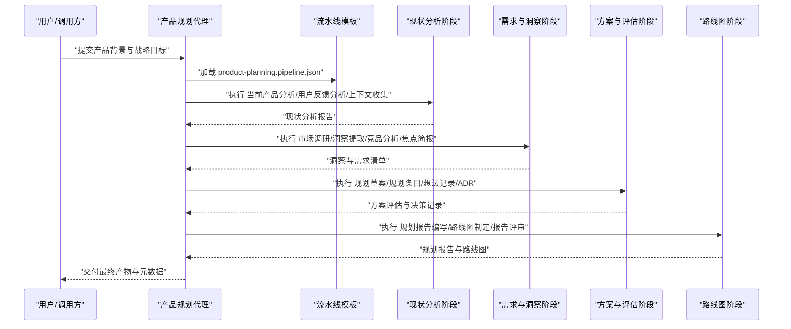
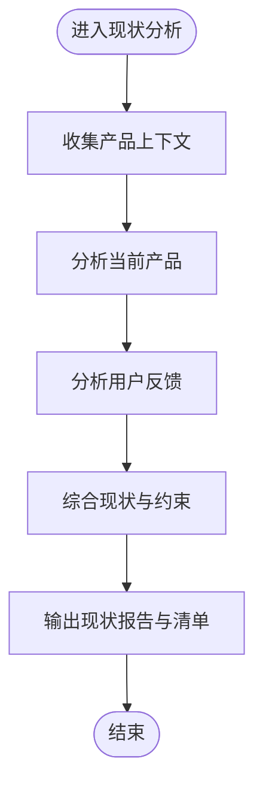
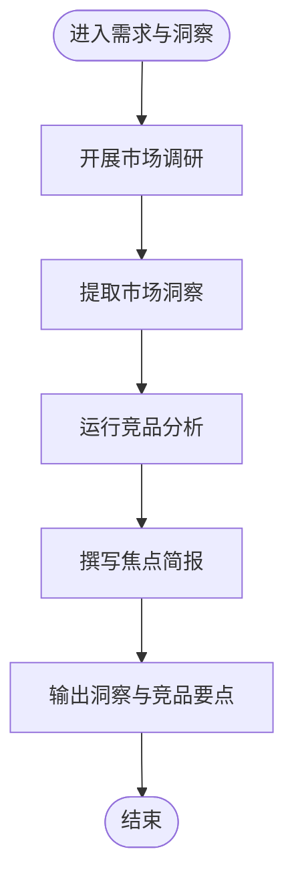
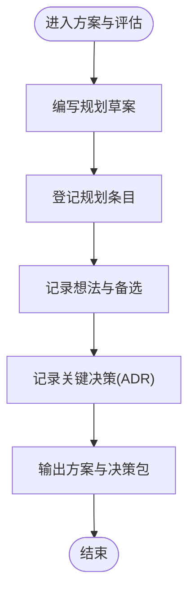
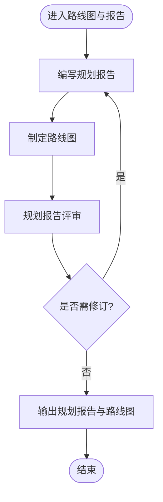
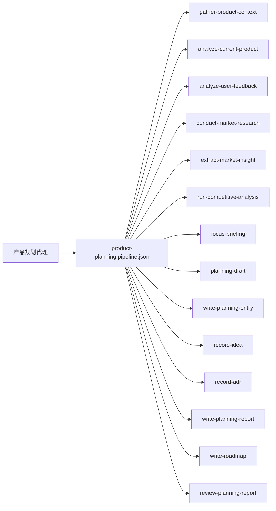

# 产品规划流水线

<cite>
**本文引用的文件**   
- [product-planning.pipeline.json](file://pipeline-templates/product-planning.pipeline.json)
- [market-to-plan.pipeline.json](file://pipeline-templates/market-to-plan.pipeline.json)
- [product-planning-agent.md](file://agents/product-planning-agent.md)
- [analyze-current-product/SKILL.md](file://skills/planning/analyze-current-product/SKILL.md)
- [analyze-user-feedback/SKILL.md](file://skills/planning/analyze-user-feedback/SKILL.md)
- [write-planning-report/SKILL.md](file://skills/planning/write-planning-report/SKILL.md)
- [write-roadmap/SKILL.md](file://skills/planning/write-roadmap/SKILL.md)
- [gather-product-context/SKILL.md](file://skills/planning/gather-product-context/SKILL.md)
- [conduct-market-research/SKILL.md](file://skills/planning/conduct-market-research/SKILL.md)
- [planning-draft/SKILL.md](file://skills/planning/planning-draft/SKILL.md)
- [record-adr/SKILL.md](file://skills/planning/record-adr/SKILL.md)
- [review-planning-report/SKILL.md](file://skills/planning/review-planning-report/SKILL.md)
- [focus-briefing/SKILL.md](file://skills/planning/focus-briefing/SKILL.md)
- [write-insight-brief/SKILL.md](file://skills/planning/write-insight-brief/SKILL.md)
- [extract-market-insight/SKILL.md](file://skills/planning/extract-market-insight/SKILL.md)
- [run-competitive-analysis/SKILL.md](file://skills/planning/run-competitive-analysis/SKILL.md)
- [write-planning-entry/SKILL.md](file://skills/planning/write-planning-entry/SKILL.md)
- [record-idea/SKILL.md](file://skills/planning/record-idea/SKILL.md)
- [_index.yml](file://skills/_index.yml)
- [_index.yml](file://agents/_index.yml)
</cite>

## 目录
1. [简介](#简介)
2. [项目结构](#项目结构)
3. [核心组件](#核心组件)
4. [架构总览](#架构总览)
5. [详细组件分析](#详细组件分析)
6. [依赖关系分析](#依赖关系分析)
7. [性能与可扩展性](#性能与可扩展性)
8. [故障排查指南](#故障排查指南)
9. [结论](#结论)
10. [附录：使用示例与配置项](#附录使用示例与配置项)

## 简介
本文件面向产品团队与平台使用者，系统化说明“产品规划流水线”的目标、阶段划分、输入输出、依赖的Agent与Skill，以及可操作的使用示例。该流水线用于制定产品战略与发展路线图，贯穿现状分析、需求收集、方案评估、路线图制定等关键阶段，并通过标准化文档与决策记录保障过程可追溯、结果可复用。

## 项目结构
仓库中与产品规划相关的资产主要分布在以下位置：
- 流水线模板：pipeline-templates 下提供可直接运行的 JSON 定义，其中 product-planning.pipeline.json 为通用产品规划主流程；market-to-plan.pipeline.json 为市场洞察到规划的专用流程。
- Agent 定义：agents 目录下包含产品规划代理（product-planning-agent.md）及索引（_index.yml）。
- Skill 能力集：skills/planning 下提供当前产品分析、用户反馈分析、规划报告编写、路线图制定等具体技能，另有上下文收集、竞品分析、洞察提取、评审与记录等辅助技能。

```mermaid
graph TB
subgraph "流水线模板"
P["product-planning.pipeline.json"]
M["market-to-plan.pipeline.json"]
end
subgraph "Agent"
A["product-planning-agent.md"]
end
subgraph "规划类 Skill"
S1["analyze-current-product"]
S2["analyze-user-feedback"]
S3["gather-product-context"]
S4["conduct-market-research"]
S5["planning-draft"]
S6["write-planning-report"]
S7["write-roadmap"]
S8["record-adr"]
S9["review-planning-report"]
S10["focus-briefing"]
S11["write-insight-brief"]
S12["extract-market-insight"]
S13["run-competitive-analysis"]
S14["write-planning-entry"]
S15["record-idea"]
end
P --> A
P --> S1
P --> S2
P --> S3
P --> S4
P --> S5
P --> S6
P --> S7
P --> S8
P --> S9
P --> S10
P --> S11
P --> S12
P --> S13
P --> S14
P --> S15
M --> A
M --> S4
M --> S12
M --> S6
M --> S7
```

图示来源
- [product-planning.pipeline.json](file://pipeline-templates/product-planning.pipeline.json)
- [market-to-plan.pipeline.json](file://pipeline-templates/market-to-plan.pipeline.json)
- [product-planning-agent.md](file://agents/product-planning-agent.md)
- [analyze-current-product/SKILL.md](file://skills/planning/analyze-current-product/SKILL.md)
- [analyze-user-feedback/SKILL.md](file://skills/planning/analyze-user-feedback/SKILL.md)
- [gather-product-context/SKILL.md](file://skills/planning/gather-product-context/SKILL.md)
- [conduct-market-research/SKILL.md](file://skills/planning/conduct-market-research/SKILL.md)
- [planning-draft/SKILL.md](file://skills/planning/planning-draft/SKILL.md)
- [write-planning-report/SKILL.md](file://skills/planning/write-planning-report/SKILL.md)
- [write-roadmap/SKILL.md](file://skills/planning/write-roadmap/SKILL.md)
- [record-adr/SKILL.md](file://skills/planning/record-adr/SKILL.md)
- [review-planning-report/SKILL.md](file://skills/planning/review-planning-report/SKILL.md)
- [focus-briefing/SKILL.md](file://skills/planning/focus-briefing/SKILL.md)
- [write-insight-brief/SKILL.md](file://skills/planning/write-insight-brief/SKILL.md)
- [extract-market-insight/SKILL.md](file://skills/planning/extract-market-insight/SKILL.md)
- [run-competitive-analysis/SKILL.md](file://skills/planning/run-competitive-analysis/SKILL.md)
- [write-planning-entry/SKILL.md](file://skills/planning/write-planning-entry/SKILL.md)
- [record-idea/SKILL.md](file://skills/planning/record-idea/SKILL.md)

章节来源
- [product-planning.pipeline.json](file://pipeline-templates/product-planning.pipeline.json)
- [market-to-plan.pipeline.json](file://pipeline-templates/market-to-plan.pipeline.json)
- [product-planning-agent.md](file://agents/product-planning-agent.md)
- [_index.yml](file://skills/_index.yml)
- [_index.yml](file://agents/_index.yml)

## 核心组件
- 产品规划代理（Product Planning Agent）
  - 角色定位：作为流水线的编排者，负责解析流水线模板、调度各阶段任务、协调Skill执行、汇总中间产物并驱动最终产出。
  - 职责范围：参数校验、阶段推进、异常处理、结果归档与版本化。
- 规划类 Skill 集合
  - 现状分析：当前产品分析、用户反馈分析、产品上下文收集。
  - 需求与洞察：市场调研、洞察提取、竞品分析、焦点简报、洞察摘要。
  - 方案与评估：规划草案、规划条目记录、想法记录、ADR（架构/决策记录）。
  - 报告与路线：规划报告编写、路线图制定、规划报告评审。
- 流水线模板
  - 以 JSON 形式声明阶段、节点、依赖、输入输出映射、重试与超时策略等，便于复用与扩展。

章节来源
- [product-planning-agent.md](file://agents/product-planning-agent.md)
- [analyze-current-product/SKILL.md](file://skills/planning/analyze-current-product/SKILL.md)
- [analyze-user-feedback/SKILL.md](file://skills/planning/analyze-user-feedback/SKILL.md)
- [gather-product-context/SKILL.md](file://skills/planning/gather-product-context/SKILL.md)
- [conduct-market-research/SKILL.md](file://skills/planning/conduct-market-research/SKILL.md)
- [extract-market-insight/SKILL.md](file://skills/planning/extract-market-insight/SKILL.md)
- [run-competitive-analysis/SKILL.md](file://skills/planning/run-competitive-analysis/SKILL.md)
- [planning-draft/SKILL.md](file://skills/planning/planning-draft/SKILL.md)
- [write-planning-report/SKILL.md](file://skills/planning/write-planning-report/SKILL.md)
- [write-roadmap/SKILL.md](file://skills/planning/write-roadmap/SKILL.md)
- [record-adr/SKILL.md](file://skills/planning/record-adr/SKILL.md)
- [review-planning-report/SKILL.md](file://skills/planning/review-planning-report/SKILL.md)
- [focus-briefing/SKILL.md](file://skills/planning/focus-briefing/SKILL.md)
- [write-insight-brief/SKILL.md](file://skills/planning/write-insight-brief/SKILL.md)
- [write-planning-entry/SKILL.md](file://skills/planning/write-planning-entry/SKILL.md)
- [record-idea/SKILL.md](file://skills/planning/record-idea/SKILL.md)

## 架构总览
产品规划流水线采用“Agent 编排 + 多 Skill 协作”的架构。Agent 读取流水线模板，按阶段顺序或并行执行相应 Skill，将上游输出作为下游输入，形成端到端的规划闭环。

图示来源
- [product-planning.pipeline.json](file://pipeline-templates/product-planning.pipeline.json)
- [product-planning-agent.md](file://agents/product-planning-agent.md)
- [analyze-current-product/SKILL.md](file://skills/planning/analyze-current-product/SKILL.md)
- [analyze-user-feedback/SKILL.md](file://skills/planning/analyze-user-feedback/SKILL.md)
- [gather-product-context/SKILL.md](file://skills/planning/gather-product-context/SKILL.md)
- [conduct-market-research/SKILL.md](file://skills/planning/conduct-market-research/SKILL.md)
- [extract-market-insight/SKILL.md](file://skills/planning/extract-market-insight/SKILL.md)
- [run-competitive-analysis/SKILL.md](file://skills/planning/run-competitive-analysis/SKILL.md)
- [planning-draft/SKILL.md](file://skills/planning/planning-draft/SKILL.md)
- [write-planning-report/SKILL.md](file://skills/planning/write-planning-report/SKILL.md)
- [write-roadmap/SKILL.md](file://skills/planning/write-roadmap/SKILL.md)
- [record-adr/SKILL.md](file://skills/planning/record-adr/SKILL.md)
- [review-planning-report/SKILL.md](file://skills/planning/review-planning-report/SKILL.md)

## 详细组件分析

### 阶段一：现状分析
- 目标：全面掌握产品现状，包括功能矩阵、质量指标、用户声音、历史问题与瓶颈。
- 关键 Skill
  - 当前产品分析：梳理产品现状、能力边界与短板。
  - 用户反馈分析：聚合多渠道反馈，提炼痛点与诉求优先级。
  - 产品上下文收集：拉取业务背景、约束条件与资源信息。
- 输入
  - 产品背景、战略目标、资源约束、时间窗口、历史文档与数据源地址。
- 输出
  - 现状分析报告、用户反馈摘要、上下文清单。
- 典型流程

图示来源
- [gather-product-context/SKILL.md](file://skills/planning/gather-product-context/SKILL.md)
- [analyze-current-product/SKILL.md](file://skills/planning/analyze-current-product/SKILL.md)
- [analyze-user-feedback/SKILL.md](file://skills/planning/analyze-user-feedback/SKILL.md)

章节来源
- [gather-product-context/SKILL.md](file://skills/planning/gather-product-context/SKILL.md)
- [analyze-current-product/SKILL.md](file://skills/planning/analyze-current-product/SKILL.md)
- [analyze-user-feedback/SKILL.md](file://skills/planning/analyze-user-feedback/SKILL.md)

### 阶段二：需求与洞察
- 目标：基于现状与市场环境，识别机会点、明确需求方向并形成洞察。
- 关键 Skill
  - 市场调研：扫描行业趋势、政策与技术演进。
  - 洞察提取：从调研材料中抽取关键洞察与信号。
  - 竞品分析：对比竞品能力、差异化与威胁。
  - 焦点简报：聚焦关键议题，形成高层级洞察摘要。
- 输入
  - 现状报告、外部数据源、竞品资料、行业报告。
- 输出
  - 洞察清单、竞品对比要点、焦点简报。
- 典型流程

图示来源
- [conduct-market-research/SKILL.md](file://skills/planning/conduct-market-research/SKILL.md)
- [extract-market-insight/SKILL.md](file://skills/planning/extract-market-insight/SKILL.md)
- [run-competitive-analysis/SKILL.md](file://skills/planning/run-competitive-analysis/SKILL.md)
- [focus-briefing/SKILL.md](file://skills/planning/focus-briefing/SKILL.md)

章节来源
- [conduct-market-research/SKILL.md](file://skills/planning/conduct-market-research/SKILL.md)
- [extract-market-insight/SKILL.md](file://skills/planning/extract-market-insight/SKILL.md)
- [run-competitive-analysis/SKILL.md](file://skills/planning/run-competitive-analysis/SKILL.md)
- [focus-briefing/SKILL.md](file://skills/planning/focus-briefing/SKILL.md)

### 阶段三：方案与评估
- 目标：将洞察转化为可执行的方案，建立评估标准并完成权衡决策。
- 关键 Skill
  - 规划草案：生成候选方案与实施路径。
  - 规划条目记录：结构化沉淀方案要点与依赖。
  - 想法记录：捕获临时创意与备选思路。
  - ADR 记录：记录关键决策与依据。
- 输入
  - 洞察清单、竞品要点、焦点简报、资源约束。
- 输出
  - 规划草案、规划条目、想法库、决策记录。
- 典型流程

图示来源
- [planning-draft/SKILL.md](file://skills/planning/planning-draft/SKILL.md)
- [write-planning-entry/SKILL.md](file://skills/planning/write-planning-entry/SKILL.md)
- [record-idea/SKILL.md](file://skills/planning/record-idea/SKILL.md)
- [record-adr/SKILL.md](file://skills/planning/record-adr/SKILL.md)

章节来源
- [planning-draft/SKILL.md](file://skills/planning/planning-draft/SKILL.md)
- [write-planning-entry/SKILL.md](file://skills/planning/write-planning-entry/SKILL.md)
- [record-idea/SKILL.md](file://skills/planning/record-idea/SKILL.md)
- [record-adr/SKILL.md](file://skills/planning/record-adr/SKILL.md)

### 阶段四：路线图与报告
- 目标：形成对外/对内发布的规划报告与路线图，完成评审与定稿。
- 关键 Skill
  - 规划报告编写：整合前序成果，输出完整规划报告。
  - 路线图制定：按时间轴与优先级生成路线图。
  - 规划报告评审：组织评审、收集意见并迭代。
- 输入
  - 方案与决策包、洞察与竞品要点、资源与约束。
- 输出
  - 规划报告、路线图、评审意见与修订记录。
- 典型流程

图示来源
- [write-planning-report/SKILL.md](file://skills/planning/write-planning-report/SKILL.md)
- [write-roadmap/SKILL.md](file://skills/planning/write-roadmap/SKILL.md)
- [review-planning-report/SKILL.md](file://skills/planning/review-planning-report/SKILL.md)

章节来源
- [write-planning-report/SKILL.md](file://skills/planning/write-planning-report/SKILL.md)
- [write-roadmap/SKILL.md](file://skills/planning/write-roadmap/SKILL.md)
- [review-planning-report/SKILL.md](file://skills/planning/review-planning-report/SKILL.md)

## 依赖关系分析
- Agent 与模板
  - 产品规划代理依赖 product-planning.pipeline.json 进行阶段编排与数据流转。
- 阶段与 Skill
  - 现状分析阶段依赖 gather-product-context、analyze-current-product、analyze-user-feedback。
  - 需求与洞察阶段依赖 conduct-market-research、extract-market-insight、run-competitive-analysis、focus-briefing。
  - 方案与评估阶段依赖 planning-draft、write-planning-entry、record-idea、record-adr。
  - 路线图与报告阶段依赖 write-planning-report、write-roadmap、review-planning-report。
- 索引与注册
  - skills/_index.yml 与 agents/_index.yml 提供能力注册与发现入口，确保 Agent 能正确解析与调用对应 Skill。

图示来源
- [product-planning.pipeline.json](file://pipeline-templates/product-planning.pipeline.json)
- [product-planning-agent.md](file://agents/product-planning-agent.md)
- [gather-product-context/SKILL.md](file://skills/planning/gather-product-context/SKILL.md)
- [analyze-current-product/SKILL.md](file://skills/planning/analyze-current-product/SKILL.md)
- [analyze-user-feedback/SKILL.md](file://skills/planning/analyze-user-feedback/SKILL.md)
- [conduct-market-research/SKILL.md](file://skills/planning/conduct-market-research/SKILL.md)
- [extract-market-insight/SKILL.md](file://skills/planning/extract-market-insight/SKILL.md)
- [run-competitive-analysis/SKILL.md](file://skills/planning/run-competitive-analysis/SKILL.md)
- [focus-briefing/SKILL.md](file://skills/planning/focus-briefing/SKILL.md)
- [planning-draft/SKILL.md](file://skills/planning/planning-draft/SKILL.md)
- [write-planning-entry/SKILL.md](file://skills/planning/write-planning-entry/SKILL.md)
- [record-idea/SKILL.md](file://skills/planning/record-idea/SKILL.md)
- [record-adr/SKILL.md](file://skills/planning/record-adr/SKILL.md)
- [write-planning-report/SKILL.md](file://skills/planning/write-planning-report/SKILL.md)
- [write-roadmap/SKILL.md](file://skills/planning/write-roadmap/SKILL.md)
- [review-planning-report/SKILL.md](file://skills/planning/review-planning-report/SKILL.md)
- [_index.yml](file://skills/_index.yml)
- [_index.yml](file://agents/_index.yml)

章节来源
- [product-planning.pipeline.json](file://pipeline-templates/product-planning.pipeline.json)
- [product-planning-agent.md](file://agents/product-planning-agent.md)
- [_index.yml](file://skills/_index.yml)
- [_index.yml](file://agents/_index.yml)

## 性能与可扩展性
- 并行与批处理
  - 在现状分析与洞察阶段，多个 Skill 可并行执行以提升吞吐；对大文档与长列表建议分批处理。
- 缓存与增量
  - 对稳定数据源（如历史报告、竞品快照）引入缓存，减少重复抓取与计算。
- 失败重试与降级
  - 对网络与外部 API 调用设置重试与退避策略；当某 Skill 不可用时，允许跳过并标记风险。
- 资源与配额
  - 结合资源约束控制并发度与单次处理规模，避免超出配额导致中断。

[本节为通用指导，不直接分析具体文件]

## 故障排查指南
- 常见错误
  - 模板解析失败：检查 pipeline JSON 结构与字段命名是否与 Agent 期望一致。
  - Skill 未注册：确认 skills/_index.yml 已包含对应 Skill 的定义与路径。
  - 输入缺失：核对产品背景、战略目标、资源约束等必填项是否齐全。
  - 外部依赖不可用：检查数据源可达性与鉴权配置。
- 定位方法
  - 查看阶段日志与中间产物，确认上游输出是否符合下游预期。
  - 针对特定 Skill 单独运行，验证其输入输出契约。
  - 通过 review-planning-report 触发评审，获取人工反馈与修正建议。

章节来源
- [review-planning-report/SKILL.md](file://skills/planning/review-planning-report/SKILL.md)
- [_index.yml](file://skills/_index.yml)
- [_index.yml](file://agents/_index.yml)

## 结论
产品规划流水线通过标准化的阶段划分与可复用的 Skill 组合，将复杂的产品战略规划过程解耦为可执行、可追踪的任务流。借助产品规划代理的统一编排，团队能够高效产出高质量的规划报告与路线图，并在评审与决策记录的支持下持续迭代优化。

[本节为总结性内容，不直接分析具体文件]

## 附录：使用示例与配置项

### 基础配置项（输入）
- 产品背景
  - 产品名称、所属业务线、目标用户群体、核心价值主张。
- 战略目标
  - 短期/中期/长期目标、关键成功指标、合规与风控要求。
- 资源约束
  - 预算上限、人力规模、技术栈限制、发布节奏与里程碑。
- 数据源与参考
  - 历史规划文档、用户反馈渠道、竞品资料、行业报告链接。
- 评估维度与标准
  - 价值、可行性、风险、成本、影响面、时间窗等权重与阈值。
- 路线图格式
  - 时间粒度（季度/月）、视图类型（主题/特性/版本）、颜色与标签规范。

章节来源
- [product-planning.pipeline.json](file://pipeline-templates/product-planning.pipeline.json)
- [market-to-plan.pipeline.json](file://pipeline-templates/market-to-plan.pipeline.json)

### 示例一：启动一次完整的规划流水线
- 步骤
  - 准备上述基础配置项。
  - 选择 product-planning.pipeline.json 作为模板。
  - 由产品规划代理加载模板并依次执行四个阶段。
  - 审阅规划报告与路线图，必要时触发评审与修订。
- 关键产物
  - 现状分析报告、洞察与竞品要点、方案与决策包、规划报告与路线图。

章节来源
- [product-planning.pipeline.json](file://pipeline-templates/product-planning.pipeline.json)
- [product-planning-agent.md](file://agents/product-planning-agent.md)

### 示例二：从市场洞察到规划（市场驱动）
- 适用场景
  - 需要快速响应市场变化，基于外部洞察驱动产品方向调整。
- 步骤
  - 使用 market-to-plan.pipeline.json。
  - 重点执行市场调研、洞察提取、规划报告与路线图制定。
- 关键产物
  - 市场洞察摘要、规划报告、路线图。

章节来源
- [market-to-plan.pipeline.json](file://pipeline-templates/market-to-plan.pipeline.json)
- [conduct-market-research/SKILL.md](file://skills/planning/conduct-market-research/SKILL.md)
- [extract-market-insight/SKILL.md](file://skills/planning/extract-market-insight/SKILL.md)
- [write-planning-report/SKILL.md](file://skills/planning/write-planning-report/SKILL.md)
- [write-roadmap/SKILL.md](file://skills/planning/write-roadmap/SKILL.md)

### 示例三：定制评估标准与路线图格式
- 评估标准
  - 在模板中定义维度权重与评分规则，驱动方案排序与取舍。
- 路线图格式
  - 指定时间粒度、视图类型与标签体系，确保输出符合团队阅读习惯。
- 评审机制
  - 通过 review-planning-report 组织跨职能评审，收集意见并回写修订。

章节来源
- [product-planning.pipeline.json](file://pipeline-templates/product-planning.pipeline.json)
- [review-planning-report/SKILL.md](file://skills/planning/review-planning-report/SKILL.md)
- [write-roadmap/SKILL.md](file://skills/planning/write-roadmap/SKILL.md)