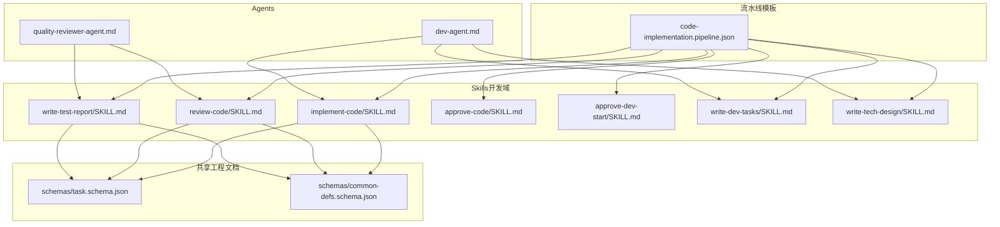
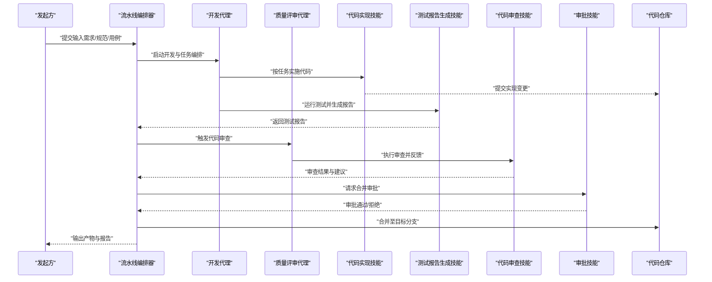
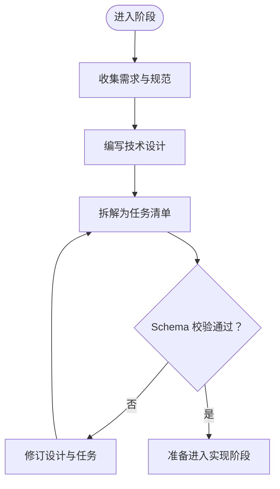
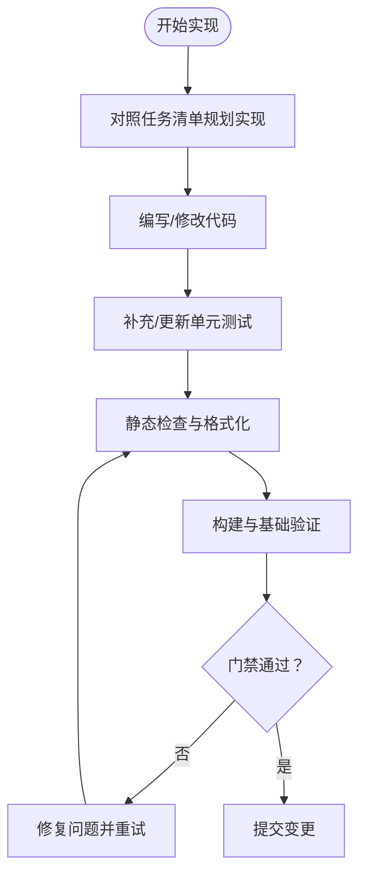
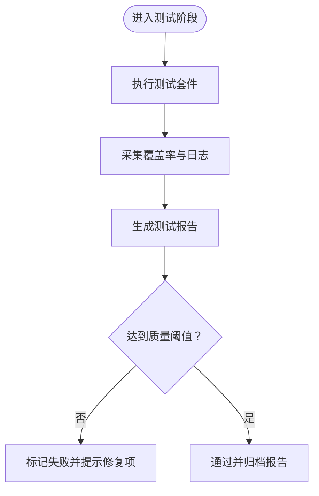
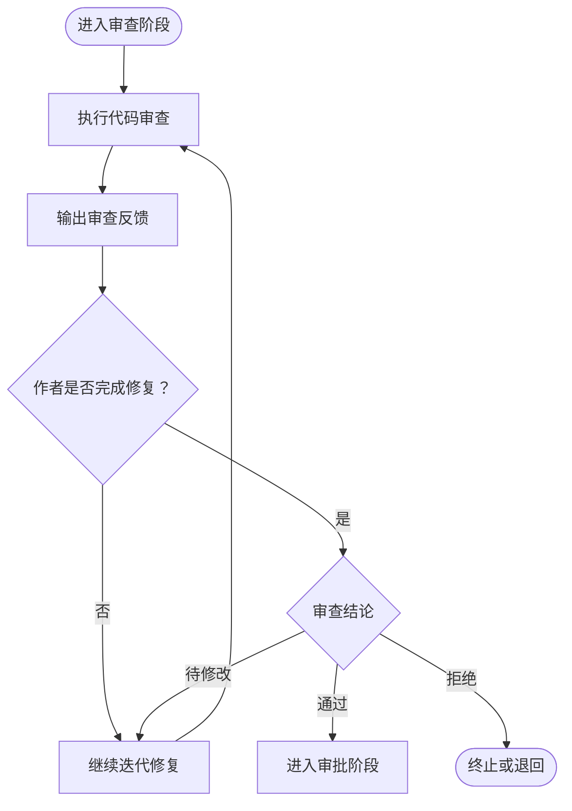
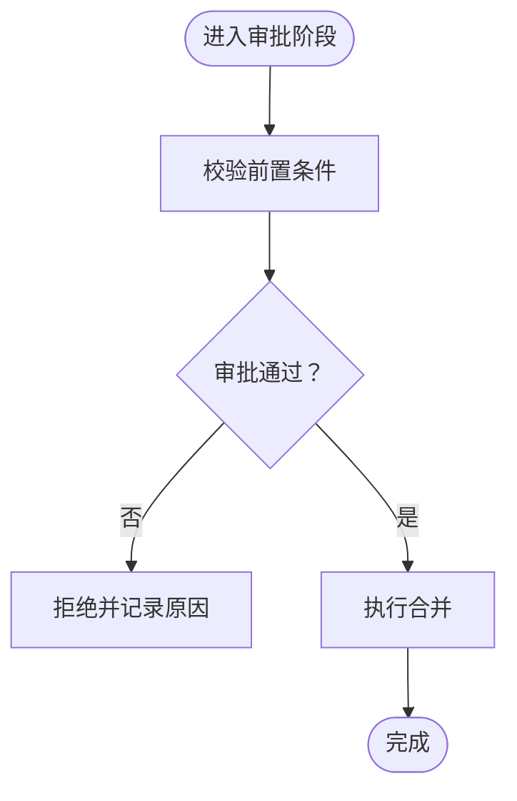
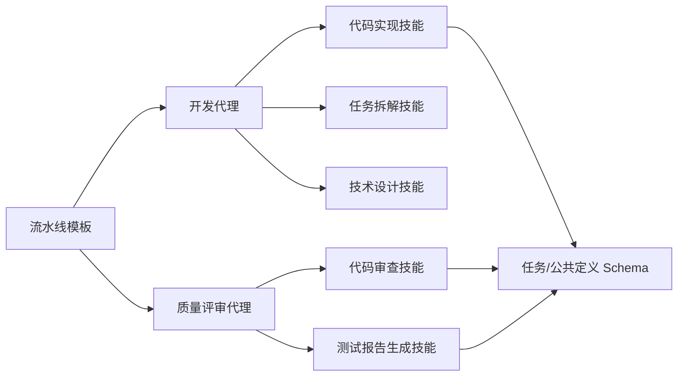

# 代码实现流水线

<cite>
**本文引用的文件**   
- [pipeline-templates/code-implementation.pipeline.json](file://pipeline-templates/code-implementation.pipeline.json)
- [skills/develop/implement-code/SKILL.md](file://skills/develop/implement-code/SKILL.md)
- [skills/develop/review-code/SKILL.md](file://skills/develop/review-code/SKILL.md)
- [skills/develop/write-test-report/SKILL.md](file://skills/develop/write-test-report/SKILL.md)
- [skills/develop/approve-code/SKILL.md](file://skills/develop/approve-code/SKILL.md)
- [skills/develop/approve-dev-start/SKILL.md](file://skills/develop/approve-dev-start/SKILL.md)
- [skills/develop/write-dev-tasks/SKILL.md](file://skills/develop/write-dev-tasks/SKILL.md)
- [skills/develop/write-tech-design/SKILL.md](file://skills/develop/write-tech-design/SKILL.md)
- [skills/shared/engineering-docs/schemas/task.schema.json](file://skills/shared/engineering-docs/schemas/task.schema.json)
- [skills/shared/engineering-docs/schemas/common-defs.schema.json](file://skills/shared/engineering-docs/schemas/common-defs.schema.json)
- [agents/dev-agent.md](file://agents/dev-agent.md)
- [agents/quality-reviewer-agent.md](file://agents/quality-reviewer-agent.md)
- [agent-skill-matrix.yml](file://agent-skill-matrix.yml)
- [AGENT-SKILL-MATRIX.md](file://AGENT-SKILL-MATRIX.md)
</cite>

## 目录
1. [简介](#简介)
2. [项目结构](#项目结构)
3. [核心组件](#核心组件)
4. [架构总览](#架构总览)
5. [详细组件分析](#详细组件分析)
6. [依赖关系分析](#依赖关系分析)
7. [性能与质量考量](#性能与质量考量)
8. [故障排查指南](#故障排查指南)
9. [结论](#结论)
10. [附录](#附录)

## 简介
本文件面向“代码实现流水线”，系统化说明其目标、阶段划分、输入输出、Agent 与 Skill 的协作方式，以及配置与使用示例。该流水线用于自动化从需求到技术设计、任务分解、代码实现、测试与报告、代码审查、审批与合并的全流程，确保交付质量与可追溯性。

## 项目结构
围绕“代码实现流水线”的相关资产主要分布在以下位置：
- 流水线模板：定义阶段、参数、触发条件与执行顺序
- Skills：封装具体能力（如代码实现、代码审查、测试报告生成等）
- Agents：提供角色化能力（开发代理、质量评审代理等）
- 共享工程文档规范与 Schema：统一产出物结构与校验规则

图表来源
- [pipeline-templates/code-implementation.pipeline.json](file://pipeline-templates/code-implementation.pipeline.json)
- [skills/develop/implement-code/SKILL.md](file://skills/develop/implement-code/SKILL.md)
- [skills/develop/review-code/SKILL.md](file://skills/develop/review-code/SKILL.md)
- [skills/develop/write-test-report/SKILL.md](file://skills/develop/write-test-report/SKILL.md)
- [skills/develop/approve-code/SKILL.md](file://skills/develop/approve-code/SKILL.md)
- [skills/develop/approve-dev-start/SKILL.md](file://skills/develop/approve-dev-start/SKILL.md)
- [skills/develop/write-dev-tasks/SKILL.md](file://skills/develop/write-dev-tasks/SKILL.md)
- [skills/develop/write-tech-design/SKILL.md](file://skills/develop/write-tech-design/SKILL.md)
- [skills/shared/engineering-docs/schemas/task.schema.json](file://skills/shared/engineering-docs/schemas/task.schema.json)
- [skills/shared/engineering-docs/schemas/common-defs.schema.json](file://skills/shared/engineering-docs/schemas/common-defs.schema.json)
- [agents/dev-agent.md](file://agents/dev-agent.md)
- [agents/quality-reviewer-agent.md](file://agents/quality-reviewer-agent.md)

章节来源
- [pipeline-templates/code-implementation.pipeline.json](file://pipeline-templates/code-implementation.pipeline.json)
- [agent-skill-matrix.yml](file://agent-skill-matrix.yml)
- [AGENT-SKILL-MATRIX.md](file://AGENT-SKILL-MATRIX.md)

## 核心组件
- 流水线模板
  - 负责编排阶段、定义输入输出、设置门禁与分支策略、指定 Agent 与 Skill 的组合调用。
- 开发域 Skills
  - 代码实现：依据设计与任务清单生成或修改代码，遵循工程规范与命名约定。
  - 代码审查：对变更进行可读性、正确性与一致性检查，并给出改进建议。
  - 测试报告生成：汇总单测/集成测试结果、覆盖率与失败用例摘要。
  - 审批类技能：在关键节点进行人工或自动审批（启动、代码合并）。
  - 设计与任务：技术设计、任务拆解与跟踪。
- 共享工程文档与 Schema
  - 通过统一的 schema 约束任务、公共定义等产出物的结构，保证跨阶段一致性与可验证性。
- Agents
  - 开发代理：驱动实现、设计与任务工作流。
  - 质量评审代理：主导代码审查与质量门禁。

章节来源
- [skills/develop/implement-code/SKILL.md](file://skills/develop/implement-code/SKILL.md)
- [skills/develop/review-code/SKILL.md](file://skills/develop/review-code/SKILL.md)
- [skills/develop/write-test-report/SKILL.md](file://skills/develop/write-test-report/SKILL.md)
- [skills/develop/approve-code/SKILL.md](file://skills/develop/approve-code/SKILL.md)
- [skills/develop/approve-dev-start/SKILL.md](file://skills/develop/approve-dev-start/SKILL.md)
- [skills/develop/write-dev-tasks/SKILL.md](file://skills/develop/write-dev-tasks/SKILL.md)
- [skills/develop/write-tech-design/SKILL.md](file://skills/develop/write-tech-design/SKILL.md)
- [skills/shared/engineering-docs/schemas/task.schema.json](file://skills/shared/engineering-docs/schemas/task.schema.json)
- [skills/shared/engineering-docs/schemas/common-defs.schema.json](file://skills/shared/engineering-docs/schemas/common-defs.schema.json)
- [agents/dev-agent.md](file://agents/dev-agent.md)
- [agents/quality-reviewer-agent.md](file://agents/quality-reviewer-agent.md)

## 架构总览
下图展示“代码实现流水线”的整体架构与数据流转：从输入（功能需求、技术规范、测试用例）出发，经任务分解、代码实现、测试与报告、代码审查、审批与合并，最终产出可集成的特性分支与质量报告。

图表来源
- [pipeline-templates/code-implementation.pipeline.json](file://pipeline-templates/code-implementation.pipeline.json)
- [skills/develop/implement-code/SKILL.md](file://skills/develop/implement-code/SKILL.md)
- [skills/develop/write-test-report/SKILL.md](file://skills/develop/write-test-report/SKILL.md)
- [skills/develop/review-code/SKILL.md](file://skills/develop/review-code/SKILL.md)
- [skills/develop/approve-code/SKILL.md](file://skills/develop/approve-code/SKILL.md)
- [agents/dev-agent.md](file://agents/dev-agent.md)
- [agents/quality-reviewer-agent.md](file://agents/quality-reviewer-agent.md)

## 详细组件分析

### 阶段一：任务分解与技术设计
- 目标
  - 将功能需求转化为可执行的技术设计与任务清单，明确范围、边界与验收标准。
- 输入
  - 功能需求、技术规范、历史上下文、相关文档与约束。
- 处理逻辑
  - 由开发代理协调技术设计与任务拆解，产出结构化任务与关联的设计文档。
- 输出
  - 技术设计文档、任务清单（遵循统一 Schema）、依赖与风险说明。
- 质量门禁
  - 设计文档与任务清单需通过 Schema 校验与同行审阅。

图表来源
- [skills/develop/write-tech-design/SKILL.md](file://skills/develop/write-tech-design/SKILL.md)
- [skills/develop/write-dev-tasks/SKILL.md](file://skills/develop/write-dev-tasks/SKILL.md)
- [skills/shared/engineering-docs/schemas/task.schema.json](file://skills/shared/engineering-docs/schemas/task.schema.json)
- [skills/shared/engineering-docs/schemas/common-defs.schema.json](file://skills/shared/engineering-docs/schemas/common-defs.schema.json)

章节来源
- [skills/develop/write-tech-design/SKILL.md](file://skills/develop/write-tech-design/SKILL.md)
- [skills/develop/write-dev-tasks/SKILL.md](file://skills/develop/write-dev-tasks/SKILL.md)
- [skills/shared/engineering-docs/schemas/task.schema.json](file://skills/shared/engineering-docs/schemas/task.schema.json)
- [skills/shared/engineering-docs/schemas/common-defs.schema.json](file://skills/shared/engineering-docs/schemas/common-defs.schema.json)

### 阶段二：代码实现
- 目标
  - 基于设计与任务逐项实现代码，保持风格一致、接口稳定、可测试性强。
- 输入
  - 技术设计、任务清单、编码规范与依赖库版本。
- 处理逻辑
  - 开发代理驱动代码实现技能，按任务粒度提交变更，必要时回滚或迭代修复。
- 输出
  - 源代码变更、单元测试、必要的文档更新。
- 质量门禁
  - 构建通过、单测覆盖达标、无严重静态检查问题。

图表来源
- [skills/develop/implement-code/SKILL.md](file://skills/develop/implement-code/SKILL.md)
- [skills/shared/engineering-docs/schemas/task.schema.json](file://skills/shared/engineering-docs/schemas/task.schema.json)

章节来源
- [skills/develop/implement-code/SKILL.md](file://skills/develop/implement-code/SKILL.md)

### 阶段三：测试与报告
- 目标
  - 执行单元与集成测试，汇总覆盖率与失败信息，形成可追溯的报告。
- 输入
  - 已提交的代码变更、测试套件与测试环境配置。
- 处理逻辑
  - 测试报告生成技能执行测试、采集指标、生成报告并归档。
- 输出
  - 测试报告（含通过率、覆盖率、失败用例详情）、缺陷定位线索。
- 质量门禁
  - 通过率阈值、覆盖率阈值、阻塞性问题清零。

图表来源
- [skills/develop/write-test-report/SKILL.md](file://skills/develop/write-test-report/SKILL.md)

章节来源
- [skills/develop/write-test-report/SKILL.md](file://skills/develop/write-test-report/SKILL.md)

### 阶段四：代码审查
- 目标
  - 对变更进行可读性、正确性、安全性与一致性审查，提出改进建议。
- 输入
  - 代码变更、测试报告、设计规范与任务清单。
- 处理逻辑
  - 质量评审代理驱动代码审查技能，逐条反馈并跟踪闭环。
- 输出
  - 审查意见、改进建议、审查结论（通过/待修改/拒绝）。
- 质量门禁
  - 所有阻塞性问题必须修复并通过复验。

图表来源
- [skills/develop/review-code/SKILL.md](file://skills/develop/review-code/SKILL.md)
- [agents/quality-reviewer-agent.md](file://agents/quality-reviewer-agent.md)

章节来源
- [skills/develop/review-code/SKILL.md](file://skills/develop/review-code/SKILL.md)
- [agents/quality-reviewer-agent.md](file://agents/quality-reviewer-agent.md)

### 阶段五：审批与合并
- 目标
  - 在关键节点进行审批，确保变更符合业务与质量要求后合并。
- 输入
  - 审查结论、测试报告、合规检查结果。
- 处理逻辑
  - 审批技能根据预设规则进行自动或人工审批；通过后执行合并。
- 输出
  - 合并结果、变更记录、发布就绪状态。
- 质量门禁
  - 至少一名授权审批人同意；满足分支保护与合并规则。

图表来源
- [skills/develop/approve-code/SKILL.md](file://skills/develop/approve-code/SKILL.md)
- [pipeline-templates/code-implementation.pipeline.json](file://pipeline-templates/code-implementation.pipeline.json)

章节来源
- [skills/develop/approve-code/SKILL.md](file://skills/develop/approve-code/SKILL.md)
- [pipeline-templates/code-implementation.pipeline.json](file://pipeline-templates/code-implementation.pipeline.json)

### 阶段零：启动审批（可选）
- 目标
  - 在进入实现前确认资源、范围与风险，避免无效投入。
- 输入
  - 需求摘要、初步方案、风险评估。
- 输出
  - 启动许可或调整建议。

章节来源
- [skills/develop/approve-dev-start/SKILL.md](file://skills/develop/approve-dev-start/SKILL.md)

## 依赖关系分析
- 组件耦合
  - 流水线模板依赖各 Skills 的能力契约与输入输出格式。
  - Skills 依赖共享工程文档 Schema 以保障产出物一致性。
  - Agents 作为编排者，组合多个 Skills 完成端到端流程。
- 外部依赖
  - 代码仓库（分支、标签、PR/MR 管理）。
  - 测试环境与构建系统。
  - 静态检查与质量平台（可选）。
- 潜在循环依赖
  - 应避免在 Skills 中反向引用上层编排逻辑；仅通过标准化输入输出交互。

图表来源
- [pipeline-templates/code-implementation.pipeline.json](file://pipeline-templates/code-implementation.pipeline.json)
- [agents/dev-agent.md](file://agents/dev-agent.md)
- [agents/quality-reviewer-agent.md](file://agents/quality-reviewer-agent.md)
- [skills/develop/implement-code/SKILL.md](file://skills/develop/implement-code/SKILL.md)
- [skills/develop/review-code/SKILL.md](file://skills/develop/review-code/SKILL.md)
- [skills/develop/write-test-report/SKILL.md](file://skills/develop/write-test-report/SKILL.md)
- [skills/develop/write-dev-tasks/SKILL.md](file://skills/develop/write-dev-tasks/SKILL.md)
- [skills/develop/write-tech-design/SKILL.md](file://skills/develop/write-tech-design/SKILL.md)
- [skills/shared/engineering-docs/schemas/task.schema.json](file://skills/shared/engineering-docs/schemas/task.schema.json)
- [skills/shared/engineering-docs/schemas/common-defs.schema.json](file://skills/shared/engineering-docs/schemas/common-defs.schema.json)

章节来源
- [agent-skill-matrix.yml](file://agent-skill-matrix.yml)
- [AGENT-SKILL-MATRIX.md](file://AGENT-SKILL-MATRIX.md)

## 性能与质量考量
- 并行与批处理
  - 对独立任务的实现与测试可并行执行，缩短整体周期。
- 增量构建与缓存
  - 利用增量编译与测试缓存减少重复工作。
- 质量阈值
  - 合理设置通过率、覆盖率与静态检查阈值，避免过度严格导致瓶颈。
- 可观测性
  - 为每个阶段增加日志与指标上报，便于定位慢点与失败根因。

[本节为通用指导，不直接分析具体文件]

## 故障排查指南
- 常见问题
  - 任务清单未通过 Schema 校验：检查字段完整性与枚举值。
  - 测试失败或缺失：核对测试套件路径与环境变量。
  - 审查阻塞：根据审查反馈逐项修复并重新触发审查。
  - 审批失败：确认分支保护规则与所需审批人数。
- 定位方法
  - 查看对应阶段的产物与报告（测试报告、审查意见、审批记录）。
  - 回溯上游输入（需求、设计、任务）是否存在歧义或不完整。

章节来源
- [skills/develop/write-test-report/SKILL.md](file://skills/develop/write-test-report/SKILL.md)
- [skills/develop/review-code/SKILL.md](file://skills/develop/review-code/SKILL.md)
- [skills/develop/approve-code/SKILL.md](file://skills/develop/approve-code/SKILL.md)
- [skills/shared/engineering-docs/schemas/task.schema.json](file://skills/shared/engineering-docs/schemas/task.schema.json)

## 结论
“代码实现流水线”通过明确的阶段划分、标准化的输入输出与严格的门禁机制，将需求到交付的过程自动化与规范化。借助开发代理与质量评审代理协同，结合代码实现、代码审查与测试报告生成等技能，可有效提升交付效率与质量稳定性。

[本节为总结性内容，不直接分析具体文件]

## 附录

### 配置与使用示例（概念性）
- 分支策略
  - 特性分支命名规范、主干保护规则、最小审批人数。
- 合并规则
  - 必须通过的检查项（构建、测试、审查）、冲突解决策略。
- 质量门禁
  - 通过率、覆盖率、静态检查等级、安全扫描要求。
- 触发方式
  - 事件触发（推送、PR/MR 创建）、定时触发、手动触发。
- 环境变量与凭据
  - 测试环境连接、第三方服务密钥、仓库访问令牌。

[本节为概念性说明，不直接分析具体文件]