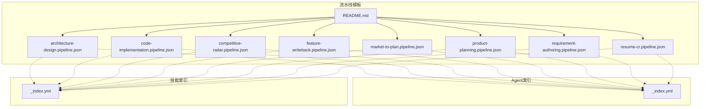
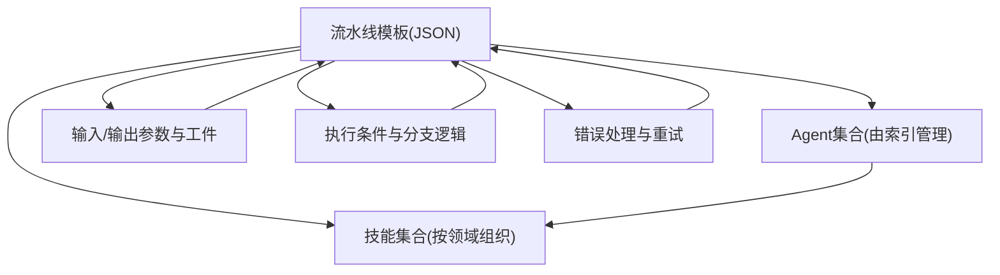
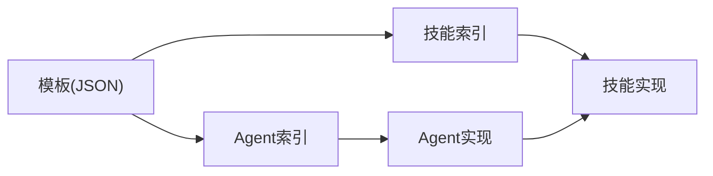

# 内置流水线模板

<cite>
**本文引用的文件**   
- [pipeline-templates/README.md](file://pipeline-templates/README.md)
- [pipeline-templates/architecture-design.pipeline.json](file://pipeline-templates/architecture-design.pipeline.json)
- [pipeline-templates/code-implementation.pipeline.json](file://pipeline-templates/code-implementation.pipeline.json)
- [pipeline-templates/competitive-radar.pipeline.json](file://pipeline-templates/competitive-radar.pipeline.json)
- [pipeline-templates/feature-writeback.pipeline.json](file://pipeline-templates/feature-writeback.pipeline.json)
- [pipeline-templates/market-to-plan.pipeline.json](file://pipeline-templates/market-to-plan.pipeline.json)
- [pipeline-templates/product-planning.pipeline.json](file://pipeline-templates/product-planning.pipeline.json)
- [pipeline-templates/requirement-authoring.pipeline.json](file://pipeline-templates/requirement-authoring.pipeline.json)
- [pipeline-templates/resume-cr.pipeline.json](file://pipeline-templates/resume-cr.pipeline.json)
- [agents/_index.yml](file://agents/_index.yml)
- [skills/_index.yml](file://skills/_index.yml)
</cite>

## 目录
1. [简介](#简介)
2. [项目结构](#项目结构)
3. [核心组件](#核心组件)
4. [架构总览](#架构总览)
5. [详细组件分析](#详细组件分析)
6. [依赖分析](#依赖分析)
7. [性能考虑](#性能考虑)
8. [故障排查指南](#故障排查指南)
9. [结论](#结论)
10. [附录](#附录)

## 简介
本章节面向使用方与集成方，系统化梳理仓库中提供的8个内置流水线模板：架构设计流水线、代码实现流水线、竞争雷达流水线、特性回写流水线、市场到计划流水线、产品规划流水线、需求编写流水线、简历筛选流水线。文档将逐一说明每个模板的目标场景、阶段定义、输入输出参数、依赖的Agent与技能、执行条件与分支逻辑，并提供配置方法与优化建议，帮助读者快速落地并持续改进。

## 项目结构
与流水线模板相关的核心目录与文件如下：
- pipeline-templates：包含所有预定义的流水线模板（JSON），以及一个统一的说明文件。
- agents：Agent索引与描述，用于定位各Agent的职责与能力边界。
- skills：按领域划分的技能集合，提供可复用的工具化能力（如竞品分析、开发流程、规划、需求、评审、同步、回写等）。

图示来源
- [pipeline-templates/README.md](file://pipeline-templates/README.md)
- [pipeline-templates/architecture-design.pipeline.json](file://pipeline-templates/architecture-design.pipeline.json)
- [pipeline-templates/code-implementation.pipeline.json](file://pipeline-templates/code-implementation.pipeline.json)
- [pipeline-templates/competitive-radar.pipeline.json](file://pipeline-templates/competitive-radar.pipeline.json)
- [pipeline-templates/feature-writeback.pipeline.json](file://pipeline-templates/feature-writeback.pipeline.json)
- [pipeline-templates/market-to-plan.pipeline.json](file://pipeline-templates/market-to-plan.pipeline.json)
- [pipeline-templates/product-planning.pipeline.json](file://pipeline-templates/product-planning.pipeline.json)
- [pipeline-templates/requirement-authoring.pipeline.json](file://pipeline-templates/requirement-authoring.pipeline.json)
- [pipeline-templates/resume-cr.pipeline.json](file://pipeline-templates/resume-cr.pipeline.json)
- [agents/_index.yml](file://agents/_index.yml)
- [skills/_index.yml](file://skills/_index.yml)

章节来源
- [pipeline-templates/README.md](file://pipeline-templates/README.md)
- [agents/_index.yml](file://agents/_index.yml)
- [skills/_index.yml](file://skills/_index.yml)

## 核心组件
本节聚焦于“流水线模板”这一核心概念及其在系统中的角色：
- 流水线模板：以JSON形式声明的阶段序列、输入输出、条件判断、分支策略、资源与权限、错误处理与重试策略等。
- Agent：负责具体任务执行的智能体，具备特定职责与能力范围。
- 技能：可被Agent调用的工具化能力，覆盖竞品分析、开发流程、规划、需求、评审、同步、回写等。

关键要点
- 模板驱动：通过模板统一编排多Agent协作流程，降低重复建设成本。
- 解耦清晰：模板仅声明阶段与依赖，不耦合具体实现细节；Agent与技能按需装配。
- 可扩展：新增或替换Agent/技能时，只需调整模板中的引用与参数映射。

章节来源
- [pipeline-templates/README.md](file://pipeline-templates/README.md)
- [agents/_index.yml](file://agents/_index.yml)
- [skills/_index.yml](file://skills/_index.yml)

## 架构总览
下图展示了“模板—Agent—技能”的整体关系与数据流转方向。

图示来源
- [pipeline-templates/README.md](file://pipeline-templates/README.md)
- [agents/_index.yml](file://agents/_index.yml)
- [skills/_index.yml](file://skills/_index.yml)

## 详细组件分析
以下对8个内置流水线模板逐一进行深度解析。为便于阅读，每个模板均包含目标场景、阶段定义、输入输出、依赖的Agent与技能、执行条件与分支逻辑、使用示例与配置方法、优化建议等。

### 架构设计流水线（architecture-design）
- 目标场景
  - 基于产品规划或需求文档，产出系统架构设计与技术决策记录，支撑后续开发与评审。
- 阶段定义（典型顺序）
  - 上下文收集：聚合产品背景、约束与非功能要求。
  - 架构草拟：生成候选架构方案与模块划分。
  - 决策记录：沉淀ADR（架构决策记录）与权衡说明。
  - 评审与修订：引入评审意见并迭代完善。
  - 归档与发布：输出最终版本并纳入知识库。
- 输入输出
  - 输入：产品规划摘要、需求要点、非功能指标、历史ADR。
  - 输出：架构设计文档、模块接口约定、风险清单、ADR记录。
- 依赖的Agent与技能
  - Agent：架构设计Agent、评审Agent。
  - 技能：规划类技能（如记录ADR）、共享工程文档规范、评审对齐技能。
- 执行条件与分支逻辑
  - 若输入缺失关键上下文，则进入补全分支。
  - 若评审未通过，则回到修订阶段直至通过。
- 使用示例与配置方法
  - 在模板中指定输入源（如规划条目ID、需求编号）。
  - 配置评审门槛（至少X位评审人通过）。
  - 设置归档路径与命名规范。
- 优化建议
  - 复用历史ADR减少重复决策。
  - 引入自动化校验（命名、结构、必填字段）。
  - 并行化草稿生成与外部参考检索。

章节来源
- [pipeline-templates/architecture-design.pipeline.json](file://pipeline-templates/architecture-design.pipeline.json)
- [agents/_index.yml](file://agents/_index.yml)
- [skills/_index.yml](file://skills/_index.yml)

### 代码实现流水线（code-implementation）
- 目标场景
  - 依据技术方案与任务拆分，完成编码、测试与合并，保障质量与可追溯性。
- 阶段定义（典型顺序）
  - 任务分解：从设计文档拆解可执行任务。
  - 开发计划：制定排期与依赖关系。
  - 编码实现：按任务推进，提交变更。
  - 代码与设计评审：确保一致性与质量。
  - 测试报告：产出测试覆盖与结果。
  - 合并与回写：合并分支并更新追踪信息。
- 输入输出
  - 输入：技术设计文档、任务列表、编码规范。
  - 输出：源代码、测试报告、变更记录、合并结果。
- 依赖的Agent与Agent与技能
  - Agent：开发Agent、评审Agent、交付Agent。
  - 技能：开发流程技能（审批、实现、评审、测试报告）、回写技能（合并分支、任务回写）。
- 执行条件与分支逻辑
  - 评审失败返回修订分支。
  - 测试不通过进入修复分支。
  - 合并前需满足门禁（覆盖率、无阻塞问题）。
- 使用示例与配置方法
  - 配置分支策略与保护规则。
  - 设定评审人数阈值与必须通过的检查项。
  - 绑定回写目标（任务系统、制品库）。
- 优化建议
  - 增量评审与分阶段合并。
  - 缓存构建与并行测试。
  - 自动化工单状态同步。

章节来源
- [pipeline-templates/code-implementation.pipeline.json](file://pipeline-templates/code-implementation.pipeline.json)
- [agents/_index.yml](file://agents/_index.yml)
- [skills/_index.yml](file://skills/_index.yml)

### 竞争雷达流水线（competitive-radar）
- 目标场景
  - 持续跟踪竞品动态，形成洞察简报与规划建议，辅助产品与市场决策。
- 阶段定义（典型顺序）
  - 数据采集：抓取竞品更新、公告、评测等。
  - 情报整理：结构化清洗与去重。
  - 洞察分析：提炼趋势、威胁与机会。
  - 报告撰写：生成竞品分析报告与建议。
  - 分发与归档：推送至相关团队并归档。
- 输入输出
  - 输入：竞品清单、关注主题、时间窗口。
  - 输出：竞品报告、洞察简报、规划建议。
- 依赖的Agent与技能
  - Agent：竞品分析Agent、规划建议Agent。
  - 技能：竞品采集、报告撰写、洞察提取、规划建议生成。
- 执行条件与分支逻辑
  - 数据不足触发补充采集分支。
  - 低置信度洞察进入人工复核分支。
- 使用示例与配置方法
  - 配置数据源与关键词过滤。
  - 设定报告周期与受众。
  - 选择模板与输出格式。
- 优化建议
  - 增量采集与指纹去重。
  - 多语言支持与实体消歧。
  - 可视化看板与订阅推送。

章节来源
- [pipeline-templates/competitive-radar.pipeline.json](file://pipeline-templates/competitive-radar.pipeline.json)
- [agents/_index.yml](file://agents/_index.yml)
- [skills/_index.yml](file://skills/_index.yml)

### 特性回写流水线（feature-writeback）
- 目标场景
  - 将特性分支的开发产物与元数据回写到主分支或制品库，保持端到端可追溯。
- 阶段定义（典型顺序）
  - 差异比对：识别变更集与影响面。
  - 一致性校验：核对PRD/SDD/任务的一致性。
  - 合并与打标签：执行合并与版本标记。
  - 追踪更新：回填任务状态与关联关系。
- 输入输出
  - 输入：特性分支、变更清单、关联工件。
  - 输出：合并结果、版本标签、追踪记录。
- 依赖的Agent与技能
  - Agent：交付Agent、回写Agent。
  - 技能：合并分支、回写PRD/SDD、任务回写、可追溯性校验。
- 执行条件与分支逻辑
  - 校验失败进入修复分支。
  - 冲突解决后重新校验。
- 使用示例与配置方法
  - 配置源分支与目标分支。
  - 指定回写目标系统与字段映射。
  - 设置合并策略与保留策略。
- 优化建议
  - 预检与沙箱验证。
  - 幂等回写与断点续传。
  - 审计日志与告警。

章节来源
- [pipeline-templates/feature-writeback.pipeline.json](file://pipeline-templates/feature-writeback.pipeline.json)
- [agents/_index.yml](file://agents/_index.yml)
- [skills/_index.yml](file://skills/_index.yml)

### 市场到计划流水线（market-to-plan）
- 目标场景
  - 将市场研究与用户反馈转化为产品规划条目，形成可执行的路线图草案。
- 阶段定义（典型顺序）
  - 市场调研：收集行业趋势与竞品态势。
  - 用户反馈分析：聚类与优先级排序。
  - 洞察提炼：形成机会点与假设。
  - 规划起草：生成规划条目与里程碑。
  - 评审与定稿：内审与跨部门对齐。
- 输入输出
  - 输入：市场数据、用户反馈、历史规划。
  - 输出：规划条目、洞察简报、路线图草案。
- 依赖的Agent与技能
  - Agent：规划Agent、洞察分析Agent。
  - 技能：市场分析、洞察提取、规划草案、规划报告。
- 执行条件与分支逻辑
  - 证据不足触发补充调研分支。
  - 评审未通过进入修订分支。
- 使用示例与配置方法
  - 配置数据来源与权重模型。
  - 设定评审委员会与通过标准。
  - 选择规划模板与输出渠道。
- 优化建议
  - 数据质量评分与异常检测。
  - 多视角加权与敏感性分析。
  - 版本化规划与变更追踪。

章节来源
- [pipeline-templates/market-to-plan.pipeline.json](file://pipeline-templates/market-to-plan.pipeline.json)
- [agents/_index.yml](file://agents/_index.yml)
- [skills/_index.yml](file://skills/_index.yml)

### 产品规划流水线（product-planning）
- 目标场景
  - 围绕产品愿景与战略，产出阶段性规划与路线图，指导研发与运营。
- 阶段定义（典型顺序）
  - 现状盘点：当前产品状态与指标。
  - 机会识别：结合市场与用户洞察。
  - 目标设定：明确OKR与关键结果。
  - 路线制定：里程碑与依赖关系。
  - 规划发布：对外发布与内部宣贯。
- 输入输出
  - 输入：产品现状、市场洞察、战略目标。
  - 输出：规划报告、路线图、行动清单。
- 依赖的Agent与技能
  - Agent：规划Agent、记录Agent。
  - 技能：现状分析、机会识别、目标设定、路线图撰写、规划报告。
- 执行条件与分支逻辑
  - 数据缺失进入补齐分支。
  - 目标不可达成触发重估分支。
- 使用示例与配置方法
  - 配置指标口径与数据源。
  - 设定发布节奏与受众范围。
  - 选择模板与图表样式。
- 优化建议
  - 指标自动化采集与看板联动。
  - 情景模拟与风险评估。
  - 定期复盘与滚动更新。

章节来源
- [pipeline-templates/product-planning.pipeline.json](file://pipeline-templates/product-planning.pipeline.json)
- [agents/_index.yml](file://agents/_index.yml)
- [skills/_index.yml](file://skills/_index.yml)

### 需求编写流水线（requirement-authoring）
- 目标场景
  - 将原始需求转化为标准化PRD，并通过评审与归档，确保可实施与可验收。
- 阶段定义（典型顺序）
  - 需求注册：登记与分类。
  - 需求撰写：结构化PRD内容。
  - 需求评审：同行与专家审核。
  - 批准与发布：正式生效与通知。
- 输入输出
  - 输入：原始需求、业务背景、约束条件。
  - 输出：PRD文档、评审意见、批准记录。
- 依赖的Agent与技能
  - Agent：需求写作Agent、评审Agent。
  - 技能：需求注册、PRD撰写、需求评审、需求批准。
- 执行条件与分支逻辑
  - 评审不通过进入修订分支。
  - 缺少必要信息进入补全分支。
- 使用示例与配置方法
  - 配置PRD模板与必填字段。
  - 设定评审人与通过阈值。
  - 绑定归档位置与版本策略。
- 优化建议
  - 模板校验与一致性检查。
  - 历史需求复用与相似度匹配。
  - 评审意见结构化与追踪。

章节来源
- [pipeline-templates/requirement-authoring.pipeline.json](file://pipeline-templates/requirement-authoring.pipeline.json)
- [agents/_index.yml](file://agents/_index.yml)
- [skills/_index.yml](file://skills/_index.yml)

### 简历筛选流水线（resume-cr）
- 目标场景
  - 对候选人简历进行初筛、匹配与打分，输出推荐名单与淘汰原因，提升招聘效率。
- 阶段定义（典型顺序）
  - 简历入库：解析与结构化。
  - 岗位匹配：基于JD与画像进行匹配。
  - 初筛与打分：多维度评估与排名。
  - 推荐与归档：输出推荐名单与记录。
- 输入输出
  - 输入：简历文件、岗位描述、筛选规则。
  - 输出：匹配结果、评分明细、推荐名单。
- 依赖的Agent与技能
  - Agent：CR（招聘）Agent、评审Agent。
  - 技能：CR入库、CR查询、CR展示、状态设置、收件箱投递。
- 执行条件与分支逻辑
  - 匹配度低于阈值进入淘汰分支。
  - 高分候选人进入加急通道。
- 使用示例与配置方法
  - 配置JD模板与权重模型。
  - 设定阈值与推荐数量。
  - 对接ATS与邮件通知。
- 优化建议
  - 反偏见校验与公平性度量。
  - 简历去重与相似合并。
  - 面试反馈闭环与模型迭代。

章节来源
- [pipeline-templates/resume-cr.pipeline.json](file://pipeline-templates/resume-cr.pipeline.json)
- [agents/_index.yml](file://agents/_index.yml)
- [skills/_index.yml](file://skills/_index.yml)

## 依赖分析
- 组件耦合与内聚
  - 模板与Agent/技能松耦合：模板仅声明依赖，运行时动态装配。
  - 技能按领域高内聚：同一领域的技能集中管理，便于复用与维护。
- 直接/间接依赖
  - 模板直接依赖Agent与技能索引；Agent间接依赖具体技能实现。
- 潜在循环依赖
  - 模板不应反向依赖具体实现；通过索引与契约避免循环。
- 外部依赖与集成点
  - 可能涉及文档库、任务系统、制品库、消息队列等，需在模板中显式声明。
- 接口契约与实现细节
  - 模板定义输入/输出契约；Agent与技能遵循统一协议（参数、返回值、错误码）。

图示来源
- [pipeline-templates/README.md](file://pipeline-templates/README.md)
- [agents/_index.yml](file://agents/_index.yml)
- [skills/_index.yml](file://skills/_index.yml)

章节来源
- [pipeline-templates/README.md](file://pipeline-templates/README.md)
- [agents/_index.yml](file://agents/_index.yml)
- [skills/_index.yml](file://skills/_index.yml)

## 性能考虑
- 并发与并行
  - 将独立阶段并行化（如数据采集与分析），缩短整体耗时。
- 缓存与增量
  - 对热点数据（竞品更新、历史文档）建立缓存与增量更新机制。
- 批处理与分页
  - 大对象处理采用分批与分页，避免内存峰值。
- 超时与重试
  - 合理设置超时与退避重试，提高鲁棒性。
- 资源隔离
  - 不同流水线使用独立资源池，避免相互干扰。

[本节为通用指导，无需源码引用]

## 故障排查指南
- 常见问题定位
  - 输入缺失或格式错误：检查模板输入校验与默认值。
  - 权限不足：确认Agent/技能访问凭证与目标系统权限。
  - 外部服务异常：查看重试策略与降级路径。
  - 分支逻辑误判：审查条件表达式与阈值配置。
- 日志与可观测性
  - 启用阶段级日志与指标上报，便于快速定位瓶颈与异常。
- 回滚与恢复
  - 支持断点续跑与幂等操作，确保失败后可恢复。

章节来源
- [pipeline-templates/README.md](file://pipeline-templates/README.md)

## 结论
通过8个内置流水线模板，团队可在架构设计、代码实现、竞争情报、特性回写、市场到计划、产品规划、需求编写与简历筛选等关键场景中快速落地标准化流程。建议在现有模板基础上，结合业务实际进行参数调优与阶段裁剪，逐步沉淀企业级最佳实践。

[本节为总结性内容，无需源码引用]

## 附录
- 术语表
  - 模板：描述流水线阶段、输入输出、条件与分支的配置单元。
  - Agent：执行具体任务的智能体。
  - 技能：可被Agent调用的工具化能力。
- 参考路径
  - 模板清单与说明：[pipeline-templates/README.md](file://pipeline-templates/README.md)
  - Agent索引：[agents/_index.yml](file://agents/_index.yml)
  - 技能索引：[skills/_index.yml](file://skills/_index.yml)

[本节为参考资料，无需源码引用]