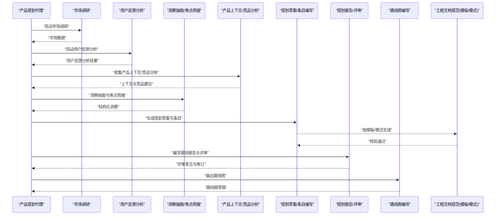
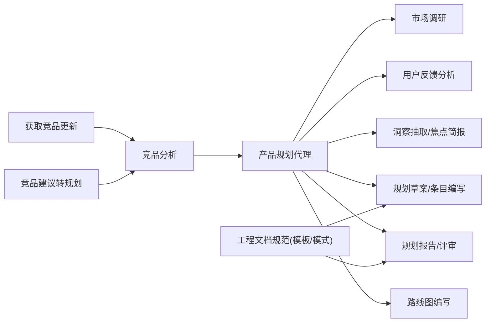

# 市场到计划流水线

<cite>
**本文引用的文件**   
- [market-to-plan.pipeline.json](file://pipeline-templates/market-to-plan.pipeline.json)
- [product-planning-agent.md](file://agents/product-planning-agent.md)
- [conduct-market-research/SKILL.md](file://skills/planning/conduct-market-research/SKILL.md)
- [analyze-user-feedback/SKILL.md](file://skills/planning/analyze-user-feedback/SKILL.md)
- [extract-market-insight/SKILL.md](file://skills/planning/extract-market-insight/SKILL.md)
- [focus-briefing/SKILL.md](file://skills/planning/focus-briefing/SKILL.md)
- [planning-draft/SKILL.md](file://skills/planning/planning-draft/SKILL.md)
- [write-insight-brief/SKILL.md](file://skills/planning/write-insight-brief/SKILL.md)
- [write-planning-entry/SKILL.md](file://skills/planning/write-planning-entry/SKILL.md)
- [write-planning-report/SKILL.md](file://skills/planning/write-planning-report/SKILL.md)
- [record-idea/SKILL.md](file://skills/planning/record-idea/SKILL.md)
- [record-adr/SKILL.md](file://skills/planning/record-adr/SKILL.md)
- [run-competitive-analysis/SKILL.md](file://skills/planning/run-competitive-analysis/SKILL.md)
- [fetch-competitor-updates/SKILL.md](file://skills/competitive/fetch-competitor-updates/SKILL.md)
- [report-to-planning-suggestion/SKILL.md](file://skills/competitive/report-to-planning-suggestion/SKILL.md)
- [gather-product-context/SKILL.md](file://skills/planning/gather-product-context/SKILL.md)
- [analyze-current-product/SKILL.md](file://skills/planning/analyze-current-product/SKILL.md)
- [review-planning-report/SKILL.md](file://skills/planning/review-planning-report/SKILL.md)
- [write-roadmap/SKILL.md](file://skills/planning/write-roadmap/SKILL.md)
- [shared-engineering-docs SKILL.md](file://skills/shared/engineering-docs/SKILL.md)
- [plan.schema.json](file://skills/shared/engineering-docs/schemas/plan.schema.json)
- [PLAN-template.md](file://skills/shared/engineering-docs/templates/PLAN-template.md)
</cite>

## 目录
1. [简介](#简介)
2. [项目结构](#项目结构)
3. [核心组件](#核心组件)
4. [架构总览](#架构总览)
5. [详细组件分析](#详细组件分析)
6. [依赖分析](#依赖分析)
7. [性能考虑](#性能考虑)
8. [故障排查指南](#故障排查指南)
9. [结论](#结论)
10. [附录](#附录)

## 简介
本文件面向“市场到计划流水线”，用于将市场洞察系统化地转化为产品规划。该流水线通过编排多个技能（Skill）与一个核心代理（Agent），完成从数据采集、用户反馈分析、机会识别，到规划草案生成与评审的端到端流程。其目标是：
- 以可配置的数据源与分析模型驱动洞察提取
- 将洞察结构化沉淀为机会清单与规划条目
- 输出符合工程文档规范的规划报告与路线图草稿
- 支持模板化与校验，确保产出一致性与可追溯性

## 项目结构
围绕“市场到计划”的关键资产包括：
- 流水线定义：market-to-plan.pipeline.json
- 核心代理：product-planning-agent.md
- 规划相关技能：planning 目录下各 SKILL.md
- 竞争情报技能：competitive 目录下相关 SKILL.md
- 共享工程文档规范与模板：shared/engineering-docs 下的 schema 与 template

```mermaid
graph TB
A["市场到计划流水线<br/>market-to-plan.pipeline.json"] --> B["产品规划代理<br/>product-planning-agent.md"]
A --> C["市场调研<br/>conduct-market-research/SKILL.md"]
A --> D["用户反馈分析<br/>analyze-user-feedback/SKILL.md"]
A --> E["洞察抽取<br/>extract-market-insight/SKILL.md"]
A --> F["焦点简报<br/>focus-briefing/SKILL.md"]
A --> G["规划草案<br/>planning-draft/SKILL.md"]
A --> H["洞察简报编写<br/>write-insight-brief/SKILL.md"]
A --> I["规划条目编写<br/>write-planning-entry/SKILL.md"]
A --> J["规划报告编写<br/>write-planning-report/SKILL.md"]
A --> K["记录想法/决策<br/>record-idea / record-adr"]
A --> L["竞品分析<br/>run-competitive-analysis/SKILL.md"]
L --> M["获取竞品更新<br/>fetch-competitor-updates/SKILL.md"]
L --> N["竞品建议转规划<br/>report-to-planning-suggestion/SKILL.md"]
A --> O["收集产品上下文<br/>gather-product-context/SKILL.md"]
A --> P["分析当前产品<br/>analyze-current-product/SKILL.md"]
A --> Q["规划评审<br/>review-planning-report/SKILL.md"]
A --> R["路线图编写<br/>write-roadmap/SKILL.md"]
S["工程文档规范与模板<br/>shared/engineering-docs"] --> T["plan.schema.json"]
S --> U["PLAN-template.md"]
G --> T
G --> U
J --> T
J --> U
```

图表来源
- [market-to-plan.pipeline.json](file://pipeline-templates/market-to-plan.pipeline.json)
- [product-planning-agent.md](file://agents/product-planning-agent.md)
- [conduct-market-research/SKILL.md](file://skills/planning/conduct-market-research/SKILL.md)
- [analyze-user-feedback/SKILL.md](file://skills/planning/analyze-user-feedback/SKILL.md)
- [extract-market-insight/SKILL.md](file://skills/planning/extract-market-insight/SKILL.md)
- [focus-briefing/SKILL.md](file://skills/planning/focus-briefing/SKILL.md)
- [planning-draft/SKILL.md](file://skills/planning/planning-draft/SKILL.md)
- [write-insight-brief/SKILL.md](file://skills/planning/write-insight-brief/SKILL.md)
- [write-planning-entry/SKILL.md](file://skills/planning/write-planning-entry/SKILL.md)
- [write-planning-report/SKILL.md](file://skills/planning/write-planning-report/SKILL.md)
- [record-idea/SKILL.md](file://skills/planning/record-idea/SKILL.md)
- [record-adr/SKILL.md](file://skills/planning/record-adr/SKILL.md)
- [run-competitive-analysis/SKILL.md](file://skills/planning/run-competitive-analysis/SKILL.md)
- [fetch-competitor-updates/SKILL.md](file://skills/competitive/fetch-competitor-updates/SKILL.md)
- [report-to-planning-suggestion/SKILL.md](file://skills/competitive/report-to-planning-suggestion/SKILL.md)
- [gather-product-context/SKILL.md](file://skills/planning/gather-product-context/SKILL.md)
- [analyze-current-product/SKILL.md](file://skills/planning/analyze-current-product/SKILL.md)
- [review-planning-report/SKILL.md](file://skills/planning/review-planning-report/SKILL.md)
- [write-roadmap/SKILL.md](file://skills/planning/write-roadmap/SKILL.md)
- [shared-engineering-docs SKILL.md](file://skills/shared/engineering-docs/SKILL.md)
- [plan.schema.json](file://skills/shared/engineering-docs/schemas/plan.schema.json)
- [PLAN-template.md](file://skills/shared/engineering-docs/templates/PLAN-template.md)

章节来源
- [market-to-plan.pipeline.json](file://pipeline-templates/market-to-plan.pipeline.json)
- [product-planning-agent.md](file://agents/product-planning-agent.md)

## 核心组件
- 产品规划代理（Product Planning Agent）
  - 职责：作为流水线的编排者，协调各阶段技能的执行、参数传递、结果聚合与质量门禁。
  - 能力：理解业务目标与约束，选择合适的数据源与分析模型，驱动洞察到规划的转化。
- 关键技能（Skills）
  - 市场调研：采集行业趋势、竞品动态、政策与技术变化等外部信息。
  - 用户反馈分析：聚合多渠道用户声音，进行主题聚类与优先级排序。
  - 洞察抽取：从调研与反馈中提炼关键洞察，形成结构化摘要。
  - 焦点简报：聚焦特定问题域，输出高价值洞察简报。
  - 规划草案：基于洞察与上下文生成初步规划条目与假设。
  - 洞察简报编写：将洞察整理为可读、可评审的简报文档。
  - 规划条目编写：按规范生成标准化规划条目。
  - 规划报告编写：汇总条目与背景，形成完整规划报告。
  - 记录想法/决策：沉淀创意与关键决策，保障可追溯性。
  - 竞品分析：拉取竞品更新并转换为规划建议。
  - 收集产品上下文与分析当前产品：为规划提供内部现状基线。
  - 规划评审与路线图编写：对规划进行评审并输出阶段性路线图。
- 工程文档规范与模板
  - 使用 plan.schema.json 对规划数据进行模式校验。
  - 使用 PLAN-template.md 统一规划文档结构与风格。

章节来源
- [product-planning-agent.md](file://agents/product-planning-agent.md)
- [conduct-market-research/SKILL.md](file://skills/planning/conduct-market-research/SKILL.md)
- [analyze-user-feedback/SKILL.md](file://skills/planning/analyze-user-feedback/SKILL.md)
- [extract-market-insight/SKILL.md](file://skills/planning/extract-market-insight/SKILL.md)
- [focus-briefing/SKILL.md](file://skills/planning/focus-briefing/SKILL.md)
- [planning-draft/SKILL.md](file://skills/planning/planning-draft/SKILL.md)
- [write-insight-brief/SKILL.md](file://skills/planning/write-insight-brief/SKILL.md)
- [write-planning-entry/SKILL.md](file://skills/planning/write-planning-entry/SKILL.md)
- [write-planning-report/SKILL.md](file://skills/planning/write-planning-report/SKILL.md)
- [record-idea/SKILL.md](file://skills/planning/record-idea/SKILL.md)
- [record-adr/SKILL.md](file://skills/planning/record-adr/SKILL.md)
- [run-competitive-analysis/SKILL.md](file://skills/planning/run-competitive-analysis/SKILL.md)
- [fetch-competitor-updates/SKILL.md](file://skills/competitive/fetch-competitor-updates/SKILL.md)
- [report-to-planning-suggestion/SKILL.md](file://skills/competitive/report-to-planning-suggestion/SKILL.md)
- [gather-product-context/SKILL.md](file://skills/planning/gather-product-context/SKILL.md)
- [analyze-current-product/SKILL.md](file://skills/planning/analyze-current-product/SKILL.md)
- [review-planning-report/SKILL.md](file://skills/planning/review-planning-report/SKILL.md)
- [write-roadmap/SKILL.md](file://skills/planning/write-roadmap/SKILL.md)
- [shared-engineering-docs SKILL.md](file://skills/shared/engineering-docs/SKILL.md)
- [plan.schema.json](file://skills/shared/engineering-docs/schemas/plan.schema.json)
- [PLAN-template.md](file://skills/shared/engineering-docs/templates/PLAN-template.md)

## 架构总览
下图展示了“市场到计划流水线”的整体数据流与控制流：代理负责编排，技能负责具体处理，工程文档规范保证一致性。

图表来源
- [market-to-plan.pipeline.json](file://pipeline-templates/market-to-plan.pipeline.json)
- [product-planning-agent.md](file://agents/product-planning-agent.md)
- [conduct-market-research/SKILL.md](file://skills/planning/conduct-market-research/SKILL.md)
- [analyze-user-feedback/SKILL.md](file://skills/planning/analyze-user-feedback/SKILL.md)
- [extract-market-insight/SKILL.md](file://skills/planning/extract-market-insight/SKILL.md)
- [focus-briefing/SKILL.md](file://skills/planning/focus-briefing/SKILL.md)
- [gather-product-context/SKILL.md](file://skills/planning/gather-product-context/SKILL.md)
- [run-competitive-analysis/SKILL.md](file://skills/planning/run-competitive-analysis/SKILL.md)
- [planning-draft/SKILL.md](file://skills/planning/planning-draft/SKILL.md)
- [write-planning-entry/SKILL.md](file://skills/planning/write-planning-entry/SKILL.md)
- [write-planning-report/SKILL.md](file://skills/planning/write-planning-report/SKILL.md)
- [review-planning-report/SKILL.md](file://skills/planning/review-planning-report/SKILL.md)
- [write-roadmap/SKILL.md](file://skills/planning/write-roadmap/SKILL.md)
- [shared-engineering-docs SKILL.md](file://skills/shared/engineering-docs/SKILL.md)
- [plan.schema.json](file://skills/shared/engineering-docs/schemas/plan.schema.json)
- [PLAN-template.md](file://skills/shared/engineering-docs/templates/PLAN-template.md)

## 详细组件分析

### 阶段一：市场调研
- 输入
  - 市场数据：行业报告、政策文件、技术趋势、渠道数据等
  - 分析模型：关键词、主题模型、趋势检测策略
  - 范围与时间窗口：目标市场、时间段、地域限制
- 处理逻辑
  - 数据采集与清洗
  - 信号提取与去重
  - 初步分类与标签化
- 输出
  - 结构化市场数据集
  - 信号清单与置信度评分
- 依赖
  - 工程文档规范：如需归档，遵循命名与元数据约定

章节来源
- [conduct-market-research/SKILL.md](file://skills/planning/conduct-market-research/SKILL.md)
- [shared-engineering-docs SKILL.md](file://skills/shared/engineering-docs/SKILL.md)

### 阶段二：用户反馈分析
- 输入
  - 用户反馈：工单、评论、访谈记录、NPS/CSAT 指标
  - 分析模型：情感分析、主题聚类、需求归因
- 处理逻辑
  - 多源汇聚与去噪
  - 主题发现与优先级评估
  - 与现有功能映射
- 输出
  - 用户痛点与期望清单
  - 需求候选集与证据链

章节来源
- [analyze-user-feedback/SKILL.md](file://skills/planning/analyze-user-feedback/SKILL.md)

### 阶段三：机会识别与洞察抽取
- 输入
  - 市场数据与用户反馈分析结果
  - 产品上下文与竞品分析
- 处理逻辑
  - 交叉比对与缺口识别
  - 机会点打分（影响面、可行性、时效性）
  - 焦点问题聚焦与简报撰写
- 输出
  - 结构化洞察与机会清单
  - 焦点简报文档

章节来源
- [extract-market-insight/SKILL.md](file://skills/planning/extract-market-insight/SKILL.md)
- [focus-briefing/SKILL.md](file://skills/planning/focus-briefing/SKILL.md)
- [gather-product-context/SKILL.md](file://skills/planning/gather-product-context/SKILL.md)
- [analyze-current-product/SKILL.md](file://skills/planning/analyze-current-product/SKILL.md)
- [run-competitive-analysis/SKILL.md](file://skills/planning/run-competitive-analysis/SKILL.md)
- [fetch-competitor-updates/SKILL.md](file://skills/competitive/fetch-competitor-updates/SKILL.md)
- [report-to-planning-suggestion/SKILL.md](file://skills/competitive/report-to-planning-suggestion/SKILL.md)

### 阶段四：规划草案与条目编写
- 输入
  - 洞察与机会清单
  - 业务目标与约束（资源、合规、里程碑）
  - 工程文档模板与模式
- 处理逻辑
  - 生成规划条目（目标、范围、验收标准、风险）
  - 按模板填充与模式校验
  - 迭代修订与版本管理
- 输出
  - 规划条目集合
  - 规划草案文档

章节来源
- [planning-draft/SKILL.md](file://skills/planning/planning-draft/SKILL.md)
- [write-planning-entry/SKILL.md](file://skills/planning/write-planning-entry/SKILL.md)
- [shared-engineering-docs SKILL.md](file://skills/shared/engineering-docs/SKILL.md)
- [plan.schema.json](file://skills/shared/engineering-docs/schemas/plan.schema.json)
- [PLAN-template.md](file://skills/shared/engineering-docs/templates/PLAN-template.md)

### 阶段五：洞察简报与规划报告
- 输入
  - 洞察与条目
  - 评审意见与修订历史
- 处理逻辑
  - 整合背景、洞察、条目与依据
  - 组织章节与引用
  - 评审闭环与版本归档
- 输出
  - 洞察简报
  - 规划报告（含评审结论）

章节来源
- [write-insight-brief/SKILL.md](file://skills/planning/write-insight-brief/SKILL.md)
- [write-planning-report/SKILL.md](file://skills/planning/write-planning-report/SKILL.md)
- [review-planning-report/SKILL.md](file://skills/planning/review-planning-report/SKILL.md)

### 阶段六：记录想法与决策、路线图
- 输入
  - 规划条目与评审结论
  - 战略方向与资源计划
- 处理逻辑
  - 记录创意与关键决策（ADR）
  - 制定阶段目标与里程碑
  - 输出路线图草稿
- 输出
  - 想法与决策记录
  - 路线图

章节来源
- [record-idea/SKILL.md](file://skills/planning/record-idea/SKILL.md)
- [record-adr/SKILL.md](file://skills/planning/record-adr/SKILL.md)
- [write-roadmap/SKILL.md](file://skills/planning/write-roadmap/SKILL.md)

## 依赖分析
- 代理与技能耦合
  - 产品规划代理与各技能为松耦合编排关系，通过输入/输出契约交互。
  - 竞争情报技能与通用规划技能解耦，便于替换数据源或分析模型。
- 工程文档规范
  - 所有规划产物需通过 plan.schema.json 校验，并使用 PLAN-template.md 保持格式一致。
- 外部依赖
  - 数据来源（市场数据、用户反馈、竞品更新）可通过配置切换；分析模型可按需替换。

图表来源
- [product-planning-agent.md](file://agents/product-planning-agent.md)
- [conduct-market-research/SKILL.md](file://skills/planning/conduct-market-research/SKILL.md)
- [analyze-user-feedback/SKILL.md](file://skills/planning/analyze-user-feedback/SKILL.md)
- [extract-market-insight/SKILL.md](file://skills/planning/extract-market-insight/SKILL.md)
- [focus-briefing/SKILL.md](file://skills/planning/focus-briefing/SKILL.md)
- [planning-draft/SKILL.md](file://skills/planning/planning-draft/SKILL.md)
- [write-planning-entry/SKILL.md](file://skills/planning/write-planning-entry/SKILL.md)
- [write-planning-report/SKILL.md](file://skills/planning/write-planning-report/SKILL.md)
- [review-planning-report/SKILL.md](file://skills/planning/review-planning-report/SKILL.md)
- [write-roadmap/SKILL.md](file://skills/planning/write-roadmap/SKILL.md)
- [run-competitive-analysis/SKILL.md](file://skills/planning/run-competitive-analysis/SKILL.md)
- [fetch-competitor-updates/SKILL.md](file://skills/competitive/fetch-competitor-updates/SKILL.md)
- [report-to-planning-suggestion/SKILL.md](file://skills/competitive/report-to-planning-suggestion/SKILL.md)
- [shared-engineering-docs SKILL.md](file://skills/shared/engineering-docs/SKILL.md)
- [plan.schema.json](file://skills/shared/engineering-docs/schemas/plan.schema.json)
- [PLAN-template.md](file://skills/shared/engineering-docs/templates/PLAN-template.md)

## 性能考虑
- 并行与批处理
  - 市场调研与用户反馈分析可并行执行，缩短整体周期。
  - 批量抓取与增量更新结合，降低重复成本。
- 缓存与复用
  - 对热点洞察与条目建立索引，避免重复计算。
  - 竞品更新采用增量拉取与差异合并。
- 质量控制
  - 在草案与报告阶段引入模式校验与模板检查，减少返工。
  - 评审环节设置最小通过阈值，控制质量门。

[本节为通用指导，不直接分析具体文件]

## 故障排查指南
- 数据源不可用
  - 现象：市场调研或竞品更新失败
  - 排查：检查连接配置、权限与速率限制；确认数据源可用性
  - 参考：竞品更新获取技能
- 模式校验失败
  - 现象：规划条目或报告无法通过 plan.schema.json 校验
  - 排查：对照模式字段要求补齐必填项与类型；核对模板结构
  - 参考：工程文档模式与模板
- 评审未通过
  - 现象：规划报告评审结论为不通过
  - 排查：根据评审意见定位缺失证据或逻辑漏洞；补充洞察与条目依据
  - 参考：规划评审技能

章节来源
- [fetch-competitor-updates/SKILL.md](file://skills/competitive/fetch-competitor-updates/SKILL.md)
- [plan.schema.json](file://skills/shared/engineering-docs/schemas/plan.schema.json)
- [PLAN-template.md](file://skills/shared/engineering-docs/templates/PLAN-template.md)
- [review-planning-report/SKILL.md](file://skills/planning/review-planning-report/SKILL.md)

## 结论
“市场到计划流水线”通过代理编排与技能协作，将分散的市场与用户信号转化为高质量的产品规划。借助工程文档规范与模板，流水线确保了产物的规范性与可追溯性。建议在持续使用中完善数据源接入、优化分析模型，并强化评审机制，以提升规划效率与质量。

[本节为总结性内容，不直接分析具体文件]

## 附录

### 流水线配置要点（示例说明）
- 数据来源配置
  - 市场数据：指定来源类型、时间窗口、过滤条件
  - 用户反馈：接入渠道、采样策略、去重规则
  - 竞品更新：订阅源、更新频率、增量策略
- 分析模型选择
  - 主题模型、情感分析、趋势检测的参数与阈值
  - 竞品建议转换规则与权重
- 规划模板定制
  - 使用 PLAN-template.md 调整章节与字段
  - 通过 plan.schema.json 扩展或收紧字段约束
- 运行与回写
  - 触发方式（定时/事件）、重试与幂等策略
  - 产物落盘路径与版本管理

章节来源
- [market-to-plan.pipeline.json](file://pipeline-templates/market-to-plan.pipeline.json)
- [shared-engineering-docs SKILL.md](file://skills/shared/engineering-docs/SKILL.md)
- [plan.schema.json](file://skills/shared/engineering-docs/schemas/plan.schema.json)
- [PLAN-template.md](file://skills/shared/engineering-docs/templates/PLAN-template.md)