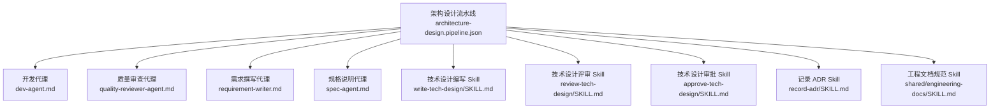
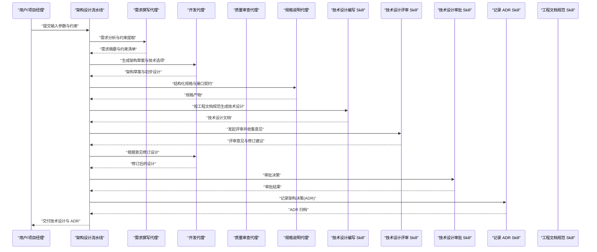
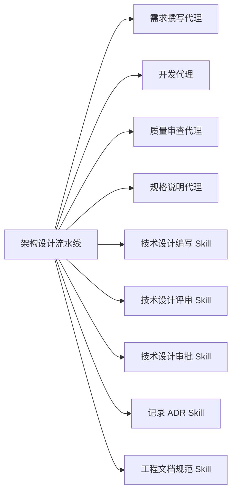

# 架构设计流水线

<cite>
**本文引用的文件**   
- [architecture-design.pipeline.json](file://pipeline-templates/architecture-design.pipeline.json)
- [README.md](file://pipeline-templates/README.md)
- [AGENT-SKILL-MATRIX.md](file://AGENT-SKILL-MATRIX.md)
- [agent-skill-matrix.yml](file://agent-skill-matrix.yml)
- [dev-agent.md](file://agents/dev-agent.md)
- [quality-reviewer-agent.md](file://agents/quality-reviewer-agent.md)
- [requirement-writer.md](file://agents/requirement-writer.md)
- [spec-agent.md](file://agents/spec-agent.md)
- [write-tech-design SKILL.md](file://skills/develop/write-tech-design/SKILL.md)
- [review-tech-design SKILL.md](file://skills/develop/review-tech-design/SKILL.md)
- [approve-tech-design SKILL.md](file://skills/develop/approve-tech-design/SKILL.md)
- [record-adr SKILL.md](file://skills/planning/record-adr/SKILL.md)
- [engineering-docs SKILL.md](file://skills/shared/engineering-docs/SKILL.md)
</cite>

## 目录
1. [简介](#简介)
2. [项目结构](#项目结构)
3. [核心组件](#核心组件)
4. [架构总览](#架构总览)
5. [详细组件分析](#详细组件分析)
6. [依赖分析](#依赖分析)
7. [性能与质量考量](#性能与质量考量)
8. [故障排查指南](#故障排查指南)
9. [结论](#结论)
10. [附录](#附录)

## 简介
本文件面向“系统架构设计和技术方案制定”的目标场景，系统化说明“架构设计流水线”的阶段定义、输入输出参数、依赖的 Agent 与 Skill、执行方式与配置方法，并提供可操作的使用示例。该流水线旨在将业务需求转化为可落地的技术架构与设计方案，明确技术栈偏好、约束条件、风险与缓解策略，并沉淀为可评审、可追溯的工程文档。

## 项目结构
仓库中与架构设计流水线直接相关的资源主要分布在以下位置：
- 流水线模板：pipeline-templates/architecture-design.pipeline.json
- 流水线说明：pipeline-templates/README.md
- Agent 清单与矩阵：agents/*.md、AGENT-SKILL-MATRIX.md、agent-skill-matrix.yml
- 相关 Skill：skills/develop/*（技术设计编写与评审）、skills/planning/record-adr（ADR 记录）、skills/shared/engineering-docs（工程文档规范）

图表来源
- [architecture-design.pipeline.json](file://pipeline-templates/architecture-design.pipeline.json)
- [dev-agent.md](file://agents/dev-agent.md)
- [quality-reviewer-agent.md](file://agents/quality-reviewer-agent.md)
- [requirement-writer.md](file://agents/requirement-writer.md)
- [spec-agent.md](file://agents/spec-agent.md)
- [write-tech-design SKILL.md](file://skills/develop/write-tech-design/SKILL.md)
- [review-tech-design SKILL.md](file://skills/develop/review-tech-design/SKILL.md)
- [approve-tech-design SKILL.md](file://skills/develop/approve-tech-design/SKILL.md)
- [record-adr SKILL.md](file://skills/planning/record-adr/SKILL.md)
- [engineering-docs SKILL.md](file://skills/shared/engineering-docs/SKILL.md)

章节来源
- [README.md](file://pipeline-templates/README.md)
- [architecture-design.pipeline.json](file://pipeline-templates/architecture-design.pipeline.json)

## 核心组件
- 流水线编排器：负责加载 pipeline-templates/architecture-design.pipeline.json，解析阶段、Agent、Skill、输入输出与校验规则，驱动执行。
- 参与 Agent：
  - 开发代理：负责技术方案细化、架构草图、接口与数据模型初稿等。
  - 质量审查代理：负责一致性、完整性、合规性检查与问题反馈。
  - 需求撰写代理：负责从原始需求中抽取关键约束、目标与非目标范围。
  - 规格说明代理：负责产出结构化规格（如模块边界、接口契约、数据流）。
- 关键 Skill：
  - 技术设计编写：用于生成标准化技术设计文档。
  - 技术设计评审：用于组织评审要点、收集意见与闭环跟踪。
  - 技术设计审批：用于基于评审结果进行决策与放行。
  - 记录 ADR：用于记录架构决策及其背景、影响与替代方案。
  - 工程文档规范：提供文档模板、命名约定、结构与校验规则。

章节来源
- [AGENT-SKILL-MATRIX.md](file://AGENT-SKILL-MATRIX.md)
- [agent-skill-matrix.yml](file://agent-skill-matrix.yml)
- [dev-agent.md](file://agents/dev-agent.md)
- [quality-reviewer-agent.md](file://agents/quality-reviewer-agent.md)
- [requirement-writer.md](file://agents/requirement-writer.md)
- [spec-agent.md](file://agents/spec-agent.md)
- [write-tech-design SKILL.md](file://skills/develop/write-tech-design/SKILL.md)
- [review-tech-design SKILL.md](file://skills/develop/review-tech-design/SKILL.md)
- [approve-tech-design SKILL.md](file://skills/develop/approve-tech-design/SKILL.md)
- [record-adr SKILL.md](file://skills/planning/record-adr/SKILL.md)
- [engineering-docs SKILL.md](file://skills/shared/engineering-docs/SKILL.md)

## 架构总览
下图展示了架构设计流水线的端到端流程：从输入约束到最终产出的技术设计与 ADR 归档，贯穿需求澄清、方案设计、评审与审批环节。

图表来源
- [architecture-design.pipeline.json](file://pipeline-templates/architecture-design.pipeline.json)
- [dev-agent.md](file://agents/dev-agent.md)
- [quality-reviewer-agent.md](file://agents/quality-reviewer-agent.md)
- [requirement-writer.md](file://agents/requirement-writer.md)
- [spec-agent.md](file://agents/spec-agent.md)
- [write-tech-design SKILL.md](file://skills/develop/write-tech-design/SKILL.md)
- [review-tech-design SKILL.md](file://skills/develop/review-tech-design/SKILL.md)
- [approve-tech-design SKILL.md](file://skills/develop/approve-tech-design/SKILL.md)
- [record-adr SKILL.md](file://skills/planning/record-adr/SKILL.md)
- [engineering-docs SKILL.md](file://skills/shared/engineering-docs/SKILL.md)

## 详细组件分析

### 阶段一：需求分析与约束澄清
- 目标：从原始需求中提取关键目标、非目标、约束与验收标准，形成可被后续阶段使用的结构化输入。
- 输入参数（示例）：
  - 业务背景与目标
  - 关键干系人与受众
  - 已知约束（合规、地域、预算、时间窗口）
  - 性能与可用性要求（吞吐、延迟、SLA）
  - 安全与隐私要求
  - 现有系统与集成点
- 处理逻辑：
  - 使用需求撰写代理对需求进行结构化梳理
  - 结合工程文档规范进行格式与完整性校验
  - 输出需求摘要与约束清单
- 输出参数（示例）：
  - 需求摘要
  - 约束清单（含优先级）
  - 验收标准与度量指标
- 依赖：
  - Agent：requirement-writer.md
  - Skill：engineering-docs SKILL.md

章节来源
- [requirement-writer.md](file://agents/requirement-writer.md)
- [engineering-docs SKILL.md](file://skills/shared/engineering-docs/SKILL.md)

### 阶段二：架构设计与技术选型
- 目标：在约束范围内提出可行的架构方案与技术栈选择，评估权衡与风险。
- 输入参数（示例）：
  - 需求摘要与约束清单
  - 技术栈偏好与限制（语言、框架、中间件、云厂商）
  - 性能与容量规划假设
  - 运维与可观测性要求
- 处理逻辑：
  - 开发代理基于约束生成多套候选方案
  - 规格说明代理产出模块边界、接口契约与数据流
  - 工程文档规范确保文档结构与命名一致
- 输出参数（示例）：
  - 架构草案（含备选方案对比）
  - 技术选型建议与理由
  - 接口契约与数据模型初稿
  - 容量与部署拓扑草图
- 依赖：
  - Agent：dev-agent.md、spec-agent.md
  - Skill：engineering-docs SKILL.md

章节来源
- [dev-agent.md](file://agents/dev-agent.md)
- [spec-agent.md](file://agents/spec-agent.md)
- [engineering-docs SKILL.md](file://skills/shared/engineering-docs/SKILL.md)

### 阶段三：技术设计编写与规范化
- 目标：将架构草案转化为标准化的技术设计文档，便于评审与归档。
- 输入参数（示例）：
  - 架构草案
  - 接口契约与数据模型
  - 工程文档模板与规范
- 处理逻辑：
  - 使用技术设计编写 Skill 生成结构化文档
  - 依据工程文档规范进行前后置信息、引用与版本管理
- 输出参数（示例）：
  - 技术设计文档（含背景、目标、方案、权衡、实施计划）
  - 关联的接口与数据模型附件
- 依赖：
  - Skill：write-tech-design SKILL.md、engineering-docs SKILL.md

章节来源
- [write-tech-design SKILL.md](file://skills/develop/write-tech-design/SKILL.md)
- [engineering-docs SKILL.md](file://skills/shared/engineering-docs/SKILL.md)

### 阶段四：技术设计评审与修订
- 目标：通过跨角色评审发现缺陷与遗漏，推动设计完善。
- 输入参数（示例）：
  - 技术设计文档
  - 评审关注点（安全性、可扩展性、可维护性、成本）
- 处理逻辑：
  - 使用技术设计评审 Skill 组织评审、收集意见
  - 开发代理根据意见进行修订
  - 质量审查代理进行一致性复核
- 输出参数（示例）：
  - 评审意见汇总
  - 修订后的技术设计文档
  - 问题追踪清单
- 依赖：
  - Skill：review-tech-design SKILL.md
  - Agent：quality-reviewer-agent.md

章节来源
- [review-tech-design SKILL.md](file://skills/develop/review-tech-design/SKILL.md)
- [quality-reviewer-agent.md](file://agents/quality-reviewer-agent.md)

### 阶段五：技术设计审批与 ADR 归档
- 目标：完成审批决策并将关键架构决策沉淀为 ADR，保障可追溯性。
- 输入参数（示例）：
  - 修订后的技术设计文档
  - 评审意见与闭环情况
- 处理逻辑：
  - 使用技术设计审批 Skill 进行决策
  - 使用记录 ADR Skill 归档决策背景、影响与替代方案
- 输出参数（示例）：
  - 审批结果（通过/有条件通过/退回）
  - ADR 文档（含编号、状态、关联设计）
- 依赖：
  - Skill：approve-tech-design SKILL.md、record-adr SKILL.md

章节来源
- [approve-tech-design SKILL.md](file://skills/develop/approve-tech-design/SKILL.md)
- [record-adr SKILL.md](file://skills/planning/record-adr/SKILL.md)

### 阶段六：风险评估与缓解策略
- 目标：识别技术、进度、合规与运营风险，制定缓解措施与监控指标。
- 输入参数（示例）：
  - 技术设计文档
  - 约束与验收标准
  - 历史经验与外部基准
- 处理逻辑：
  - 质量审查代理主导风险识别与分级
  - 开发代理补充技术可行性与工作量估算
  - 工程文档规范统一风险登记与跟踪格式
- 输出参数（示例）：
  - 风险清单（概率、影响、责任人、缓解措施）
  - 监控与告警建议
  - 回滚与应急方案
- 依赖：
  - Agent：quality-reviewer-agent.md、dev-agent.md
  - Skill：engineering-docs SKILL.md

章节来源
- [quality-reviewer-agent.md](file://agents/quality-reviewer-agent.md)
- [dev-agent.md](file://agents/dev-agent.md)
- [engineering-docs SKILL.md](file://skills/shared/engineering-docs/SKILL.md)

## 依赖分析
- 内部依赖关系：
  - 流水线编排器依赖各 Agent 与 Skill 的能力描述与执行契约。
  - 工程文档规范 Skill 作为横切能力，贯穿所有阶段的文档生产与校验。
  - ADR 归档与审批环节依赖评审闭环与修订结果。
- 外部依赖与集成点：
  - 文档存储与版本控制（由工程文档规范 Skill 约定路径与命名）。
  - 评审与审批工作流（由对应 Skill 定义触发与通知机制）。

图表来源
- [architecture-design.pipeline.json](file://pipeline-templates/architecture-design.pipeline.json)
- [AGENT-SKILL-MATRIX.md](file://AGENT-SKILL-MATRIX.md)
- [agent-skill-matrix.yml](file://agent-skill-matrix.yml)

章节来源
- [AGENT-SKILL-MATRIX.md](file://AGENT-SKILL-MATRIX.md)
- [agent-skill-matrix.yml](file://agent-skill-matrix.yml)

## 性能与质量考量
- 并行化与批处理：
  - 在约束允许的情况下，并行运行多个 Skill（如文档生成与校验），缩短整体周期。
- 增量评审：
  - 针对大型设计文档，采用分章节评审与滚动修订，降低一次性评审负担。
- 文档质量门禁：
  - 利用工程文档规范进行前置校验，减少返工。
- 可观测性与回溯：
  - 通过 ADR 与版本化文档，建立变更轨迹与影响面分析基础。

[本节为通用指导，不直接分析具体文件]

## 故障排查指南
- 常见问题定位：
  - 输入参数缺失或格式错误：检查需求摘要与约束清单是否完整，确认工程文档规范要求的字段齐全。
  - 评审未通过：核对评审意见闭环情况，确认修订后文档已更新并重新触发校验。
  - ADR 未归档：确认审批结果为通过或有条件通过，且关联的设计文档版本正确。
- 快速恢复步骤：
  - 使用工程文档规范进行自动校验与修复建议。
  - 重新触发评审与审批流程，确保变更可见与可追溯。
- 日志与证据：
  - 保留评审意见、修订差异与审批记录，便于复盘与审计。

章节来源
- [engineering-docs SKILL.md](file://skills/shared/engineering-docs/SKILL.md)
- [review-tech-design SKILL.md](file://skills/develop/review-tech-design/SKILL.md)
- [approve-tech-design SKILL.md](file://skills/develop/approve-tech-design/SKILL.md)
- [record-adr SKILL.md](file://skills/planning/record-adr/SKILL.md)

## 结论
架构设计流水线以结构化输入、标准化文档与闭环评审为核心，将需求转化为可落地的技术设计与决策记录。通过明确的阶段划分、清晰的输入输出与严格的工程文档规范，团队可在保证质量的前提下高效推进架构设计与技术方案制定。

[本节为总结性内容，不直接分析具体文件]

## 附录

### 使用示例：配置与执行架构设计流水线
- 准备输入参数：
  - 业务背景与目标、关键约束、性能与可用性要求、技术栈偏好、集成点与合规要求。
- 配置流水线：
  - 在 pipeline-templates/architecture-design.pipeline.json 中设置阶段、Agent 与 Skill 的绑定关系与参数映射。
  - 指定工程文档规范的模板与校验规则。
- 执行流水线：
  - 启动流水线，观察各阶段产出物（需求摘要、架构草案、技术设计文档、评审意见、审批结果、ADR）。
- 调整参数：
  - 根据项目特点调整技术栈偏好、性能阈值与评审关注点，必要时增加或裁剪阶段。

章节来源
- [architecture-design.pipeline.json](file://pipeline-templates/architecture-design.pipeline.json)
- [README.md](file://pipeline-templates/README.md)

### 关键配置项参考
- 架构约束：
  - 合规与安全要求、地域与数据驻留、预算与时间窗口。
- 技术栈偏好：
  - 语言与框架、数据库与缓存、消息队列与中间件、云厂商与部署环境。
- 性能要求：
  - 吞吐量、延迟、并发度、容量规划与扩展策略。
- 质量与可观测性：
  - 监控指标、日志规范、错误处理与告警策略。
- 文档与规范：
  - 模板、命名约定、结构、版本管理与归档路径。

章节来源
- [engineering-docs SKILL.md](file://skills/shared/engineering-docs/SKILL.md)