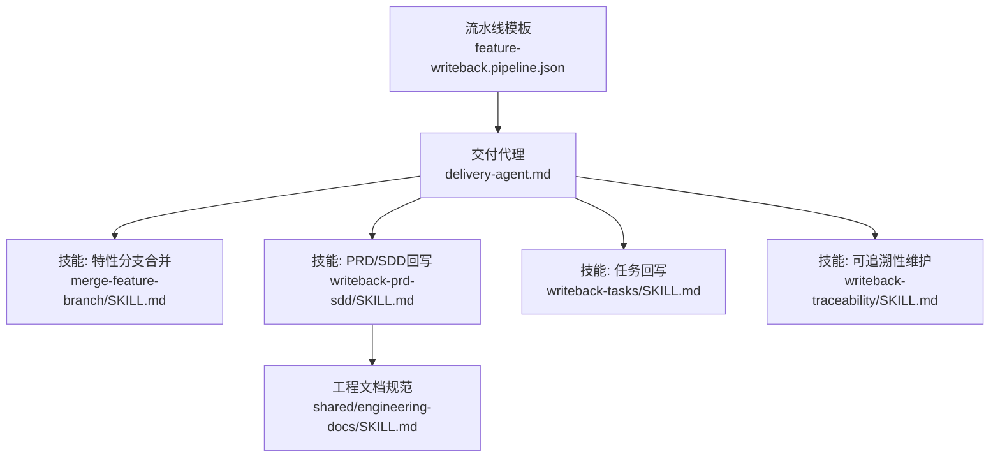
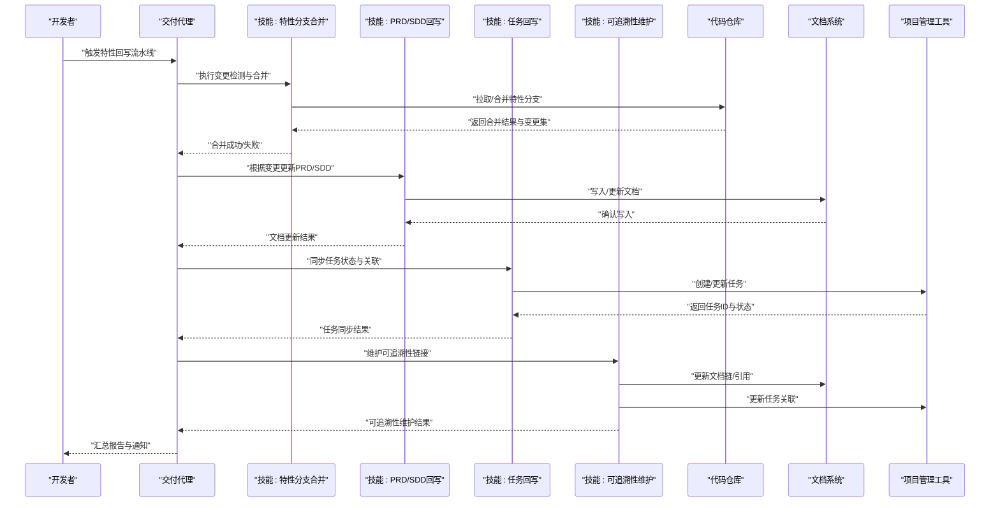
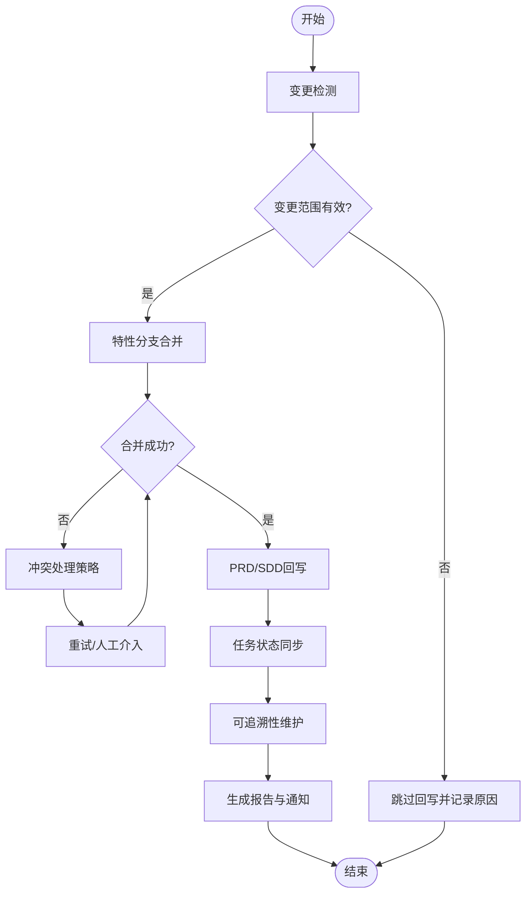
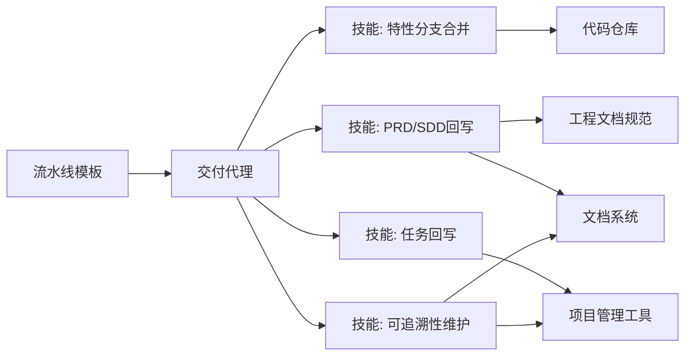

# 特性回写流水线

<cite>
**本文引用的文件**   
- [feature-writeback.pipeline.json](file://pipeline-templates/feature-writeback.pipeline.json)
- [merge-feature-branch/SKILL.md](file://skills/writeback/merge-feature-branch/SKILL.md)
- [writeback-prd-sdd/SKILL.md](file://skills/writeback/writeback-prd-sdd/SKILL.md)
- [writeback-tasks/SKILL.md](file://skills/writeback/writeback-tasks/SKILL.md)
- [writeback-traceability/SKILL.md](file://skills/writeback/writeback-traceability/SKILL.md)
- [delivery-agent.md](file://agents/delivery-agent.md)
- [dev-agent.md](file://agents/dev-agent.md)
- [engineer-docs SKILL.md](file://skills/shared/engineering-docs/SKILL.md)
</cite>

## 目录
1. [简介](#简介)
2. [项目结构](#项目结构)
3. [核心组件](#核心组件)
4. [架构总览](#架构总览)
5. [详细组件分析](#详细组件分析)
6. [依赖分析](#依赖分析)
7. [性能考虑](#性能考虑)
8. [故障排查指南](#故障排查指南)
9. [结论](#结论)
10. [附录](#附录)

## 简介
本文件面向“特性回写流水线”，用于将开发成果（代码、文档与任务状态）同步到文档系统与项目管理工具，确保需求、设计、实现与可追溯性在多个系统间保持一致。流水线覆盖变更检测、文档更新、任务状态同步与可追溯性维护等关键阶段，并通过交付代理与技能组合完成跨系统协作。

## 项目结构
特性回写流水线由以下要素组成：
- 流水线模板：定义阶段、输入输出、执行顺序与参数
- 交付代理：负责编排与调度
- 技能集合：封装具体能力（分支合并、PRD/SDD回写、任务回写、可追溯性维护）
- 工程文档规范：提供文档结构与校验标准，保障回写质量

图表来源
- [feature-writeback.pipeline.json](file://pipeline-templates/feature-writeback.pipeline.json)
- [delivery-agent.md](file://agents/delivery-agent.md)
- [merge-feature-branch/SKILL.md](file://skills/writeback/merge-feature-branch/SKILL.md)
- [writeback-prd-sdd/SKILL.md](file://skills/writeback/writeback-prd-sdd/SKILL.md)
- [writeback-tasks/SKILL.md](file://skills/writeback/writeback-tasks/SKILL.md)
- [writeback-traceability/SKILL.md](file://skills/writeback/writeback-traceability/SKILL.md)
- [engineer-docs SKILL.md](file://skills/shared/engineering-docs/SKILL.md)

章节来源
- [feature-writeback.pipeline.json](file://pipeline-templates/feature-writeback.pipeline.json)
- [delivery-agent.md](file://agents/delivery-agent.md)
- [engineer-docs SKILL.md](file://skills/shared/engineering-docs/SKILL.md)

## 核心组件
- 流水线模板
  - 作用：定义阶段序列、阶段职责、输入输出参数、错误处理策略与通知机制
  - 典型阶段：变更检测、文档更新、任务状态同步、可追溯性维护
  - 配置项：特性标识、变更范围、目标系统、同步策略、冲突处理、通知渠道
- 交付代理
  - 作用：解析流水线模板、编排阶段执行、管理上下文与凭据、汇总结果与日志
- 技能
  - 特性分支合并：拉取特性分支、合并至目标分支、处理冲突与提交信息
  - PRD/SDD回写：基于变更生成或更新产品需求与设计文档，遵循工程文档规范
  - 任务回写：同步任务创建、状态推进、关联关系与验收结果
  - 可追溯性维护：建立并维护需求-设计-实现-测试的链接关系，保证双向可追溯
- 工程文档规范
  - 作用：统一文档结构、命名约定、元数据与校验规则，提升回写一致性与可验证性

章节来源
- [feature-writeback.pipeline.json](file://pipeline-templates/feature-writeback.pipeline.json)
- [delivery-agent.md](file://agents/delivery-agent.md)
- [merge-feature-branch/SKILL.md](file://skills/writeback/merge-feature-branch/SKILL.md)
- [writeback-prd-sdd/SKILL.md](file://skills/writeback/writeback-prd-sdd/SKILL.md)
- [writeback-tasks/SKILL.md](file://skills/writeback/writeback-tasks/SKILL.md)
- [writeback-traceability/SKILL.md](file://skills/writeback/writeback-traceability/SKILL.md)
- [engineer-docs SKILL.md](file://skills/shared/engineering-docs/SKILL.md)

## 架构总览
下图展示从触发到完成的端到端流程，包括变更检测、文档更新、任务同步与可追溯性维护。

图表来源
- [feature-writeback.pipeline.json](file://pipeline-templates/feature-writeback.pipeline.json)
- [delivery-agent.md](file://agents/delivery-agent.md)
- [merge-feature-branch/SKILL.md](file://skills/writeback/merge-feature-branch/SKILL.md)
- [writeback-prd-sdd/SKILL.md](file://skills/writeback/writeback-prd-sdd/SKILL.md)
- [writeback-tasks/SKILL.md](file://skills/writeback/writeback-tasks/SKILL.md)
- [writeback-traceability/SKILL.md](file://skills/writeback/writeback-traceability/SKILL.md)

## 详细组件分析

### 流水线模板：阶段与参数
- 阶段划分
  - 变更检测：识别本次特性涉及的代码与文档变更范围
  - 文档更新：依据变更生成或更新PRD/SDD，遵循工程文档规范
  - 任务状态同步：将实现进展映射为任务状态，保持项目视图一致
  - 可追溯性维护：维护需求-设计-实现-测试的链接关系
- 输入参数（示例字段）
  - 特性标识：唯一标识当前特性
  - 变更范围：影响模块、文件、子系统等
  - 目标系统：代码仓库、文档系统、项目管理工具的地址与凭据
  - 同步策略：全量/增量、是否强制覆盖、是否保留历史版本
  - 冲突处理：自动重试、人工介入、跳过或标记待办
  - 通知机制：邮件、IM、Webhook等渠道与受众
- 输出产物（示例字段）
  - 合并结果：分支合并状态、提交哈希、冲突清单
  - 文档更新：更新的文档列表、版本号、校验结果
  - 任务同步：新增/更新的任务ID、状态变化、关联关系
  - 可追溯性：链接图谱摘要、缺失链接告警

章节来源
- [feature-writeback.pipeline.json](file://pipeline-templates/feature-writeback.pipeline.json)

### 交付代理：编排与协调
- 角色
  - 解析流水线模板，加载阶段配置与凭据
  - 按序调用各技能，传递上下文与中间结果
  - 收集日志、指标与错误，进行重试与降级
  - 生成运行报告与通知消息
- 关键行为
  - 阶段前置检查：依赖服务可用性、权限与资源配额
  - 阶段后置清理：临时文件、会话与缓存
  - 异常恢复：断点续跑、部分回滚、人工干预入口

章节来源
- [delivery-agent.md](file://agents/delivery-agent.md)

### 技能：特性分支合并
- 职责
  - 拉取特性分支，计算差异范围
  - 合并至目标分支，处理冲突与提交信息
  - 输出合并结果与变更清单供后续阶段使用
- 输入
  - 源分支、目标分支、合并策略、冲突处理方式
- 输出
  - 合并状态、提交哈希、冲突详情、受影响文件列表

章节来源
- [merge-feature-branch/SKILL.md](file://skills/writeback/merge-feature-branch/SKILL.md)

### 技能：PRD/SDD回写
- 职责
  - 基于变更范围与上下文，生成或更新PRD/SDD
  - 遵循工程文档规范，确保结构与元数据完整
  - 输出文档更新清单与校验结果
- 输入
  - 变更范围、特性标识、文档模板与规范路径
- 输出
  - 更新后的文档、版本信息、校验报告

章节来源
- [writeback-prd-sdd/SKILL.md](file://skills/writeback/writeback-prd-sdd/SKILL.md)
- [engineer-docs SKILL.md](file://skills/shared/engineering-docs/SKILL.md)

### 技能：任务回写
- 职责
  - 将实现进展映射为任务状态，创建或更新任务
  - 维护任务与文档、代码提交的关联关系
  - 输出任务同步结果与差异报告
- 输入
  - 任务模板、关联键（特性标识）、状态映射规则
- 输出
  - 任务ID、状态、关联关系、同步日志

章节来源
- [writeback-tasks/SKILL.md](file://skills/writeback/writeback-tasks/SKILL.md)

### 技能：可追溯性维护
- 职责
  - 建立并维护需求-设计-实现-测试的链接关系
  - 检测缺失链接与断裂关系，生成修复建议
  - 输出可追溯性图谱摘要与告警
- 输入
  - 文档与任务索引、链接规则、校验阈值
- 输出
  - 链接图谱、缺失项清单、修复建议

章节来源
- [writeback-traceability/SKILL.md](file://skills/writeback/writeback-traceability/SKILL.md)

### 概念总览：回写流程决策图

[此图为概念流程图，不直接映射具体源码文件]

## 依赖分析
- 内部依赖
  - 流水线模板依赖交付代理与各技能
  - PRD/SDD回写依赖工程文档规范
- 外部依赖
  - 代码仓库：拉取/合并分支、读取提交与差异
  - 文档系统：读写文档、版本控制与校验
  - 项目管理工具：任务CRUD、状态同步与关联
- 耦合与内聚
  - 交付代理高内聚于编排逻辑，低耦合于具体技能实现
  - 技能之间通过标准化上下文与中间产物交互，降低直接耦合

图表来源
- [feature-writeback.pipeline.json](file://pipeline-templates/feature-writeback.pipeline.json)
- [delivery-agent.md](file://agents/delivery-agent.md)
- [merge-feature-branch/SKILL.md](file://skills/writeback/merge-feature-branch/SKILL.md)
- [writeback-prd-sdd/SKILL.md](file://skills/writeback/writeback-prd-sdd/SKILL.md)
- [writeback-tasks/SKILL.md](file://skills/writeback/writeback-tasks/SKILL.md)
- [writeback-traceability/SKILL.md](file://skills/writeback/writeback-traceability/SKILL.md)
- [engineer-docs SKILL.md](file://skills/shared/engineering-docs/SKILL.md)

章节来源
- [feature-writeback.pipeline.json](file://pipeline-templates/feature-writeback.pipeline.json)
- [delivery-agent.md](file://agents/delivery-agent.md)

## 性能考虑
- 增量处理：优先仅处理变更范围内的文件与任务，减少不必要的全量扫描
- 并行化：对无依赖的阶段（如文档更新与任务同步）尽可能并行执行
- 缓存与复用：复用已解析的上下文与索引，避免重复IO
- 限流与退避：对外部系统调用实施限流与指数退避，避免雪崩
- 批量化：批量写入文档与任务，减少网络往返

[本节为通用指导，不直接分析具体文件]

## 故障排查指南
- 常见问题
  - 合并冲突：检查冲突处理策略与重试次数，必要时人工介入
  - 文档校验失败：核对工程文档规范与模板版本，定位缺失元数据
  - 任务同步失败：确认权限、API限流与关联键一致性
  - 可追溯性断裂：检查链接规则与索引完整性，修复缺失关系
- 诊断要点
  - 查看交付代理的运行日志与阶段指标
  - 对比变更范围与实际影响面，缩小问题域
  - 使用最小可复现案例隔离问题

章节来源
- [delivery-agent.md](file://agents/delivery-agent.md)
- [engineer-docs SKILL.md](file://skills/shared/engineering-docs/SKILL.md)

## 结论
特性回写流水线通过标准化的阶段设计与技能化能力封装，实现了从变更检测到可追溯性维护的闭环。借助交付代理的编排与工程文档规范的约束，可在多系统间高效、可靠地同步开发成果，提升团队协同效率与资产一致性。

[本节为总结性内容，不直接分析具体文件]

## 附录

### 使用示例：配置特性回写流水线
- 基本配置
  - 特性标识：填写唯一标识，便于追踪与检索
  - 变更范围：指定模块/文件/子系统，支持通配符与排除规则
  - 目标系统：配置代码仓库、文档系统、项目管理工具的地址与凭据
- 同步策略
  - 全量/增量：首次运行建议全量，后续采用增量以提升性能
  - 覆盖策略：默认增量更新；如需强制覆盖，请明确风险与回滚方案
- 冲突处理
  - 自动重试：设置最大重试次数与间隔
  - 人工介入：当冲突无法自动解决时，暂停流水线并通知负责人
- 通知机制
  - 渠道：邮件、IM、Webhook
  - 受众：特性负责人、文档维护者、项目经理
  - 事件：阶段开始/结束、失败告警、重要变更提醒

章节来源
- [feature-writeback.pipeline.json](file://pipeline-templates/feature-writeback.pipeline.json)

### 相关代理与角色
- 交付代理：负责流水线编排与协调
- 开发代理：提供开发上下文与变更来源，协助定位问题

章节来源
- [delivery-agent.md](file://agents/delivery-agent.md)
- [dev-agent.md](file://agents/dev-agent.md)