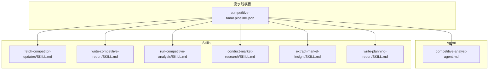
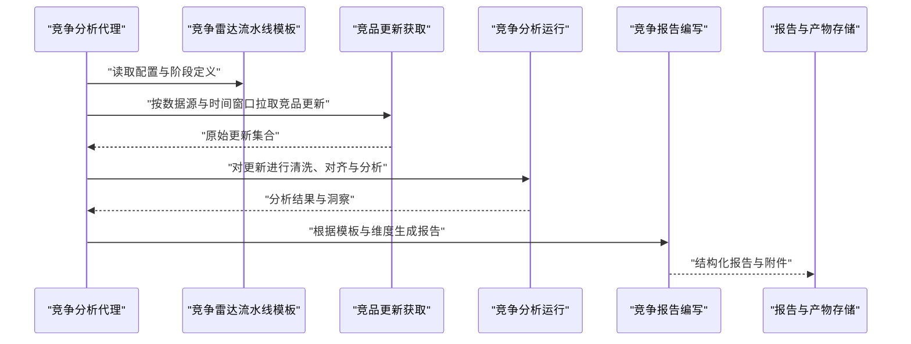
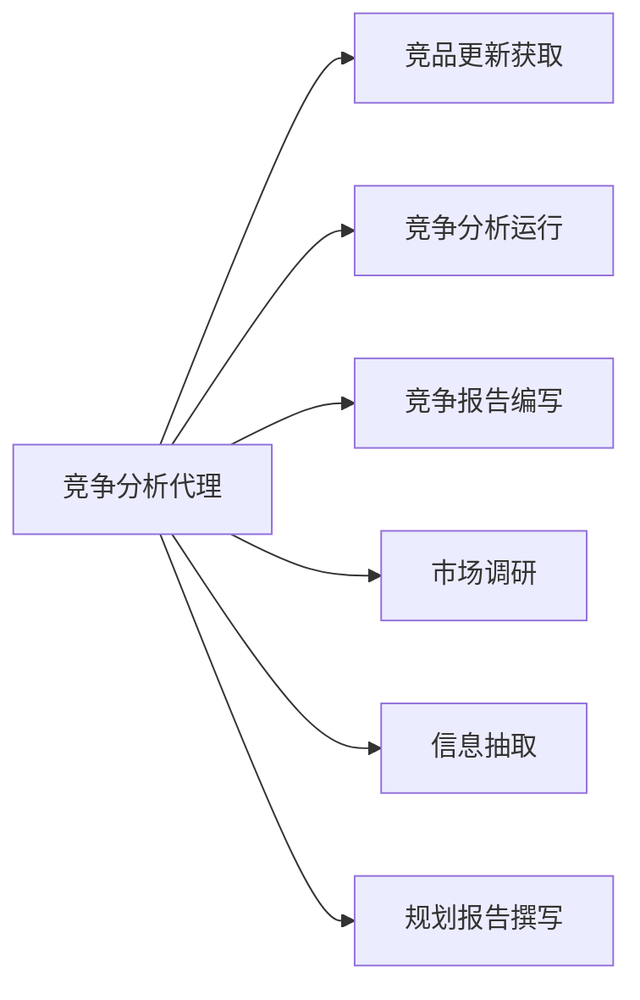

# 竞争雷达流水线

<cite>
**本文引用的文件**   
- [competitive-radar.pipeline.json](file://pipeline-templates/competitive-radar.pipeline.json)
- [competitive-analyst-agent.md](file://agents/competitive-analyst-agent.md)
- [fetch-competitor-updates/SKILL.md](file://skills/competitive/fetch-competitor-updates/SKILL.md)
- [write-competitive-report/SKILL.md](file://skills/competitive/write-competitive-report/SKILL.md)
- [run-competitive-analysis/SKILL.md](file://skills/planning/run-competitive-analysis/SKILL.md)
- [conduct-market-research/SKILL.md](file://skills/planning/conduct-market-research/SKILL.md)
- [extract-market-insight/SKILL.md](file://skills/planning/extract-market-insight/SKILL.md)
- [write-planning-report/SKILL.md](file://skills/planning/write-planning-report/SKILL.md)
</cite>

## 目录
1. [简介](#简介)
2. [项目结构](#项目结构)
3. [核心组件](#核心组件)
4. [架构总览](#架构总览)
5. [详细组件分析](#详细组件分析)
6. [依赖关系分析](#依赖关系分析)
7. [性能与可观测性](#性能与可观测性)
8. [故障排查指南](#故障排查指南)
9. [结论](#结论)
10. [附录：配置与使用示例](#附录配置与使用示例)

## 简介
竞争雷达流水线用于持续监控竞品动态、采集市场情报，并基于统一的分析维度生成结构化报告。该流水线通过“竞争分析代理”协调多个技能（Skill），完成从竞品识别、信息收集、数据分析到报告生成的端到端流程，支持灵活的监控频率、数据源与报告格式定制，便于产品与市场团队进行竞品分析与决策。

## 项目结构
本仓库中与竞争雷达相关的资产主要分布在以下位置：
- 流水线模板：定义阶段、输入输出、调度与编排参数
- Agent：提供竞争分析所需的智能体能力
- Skill：封装具体任务的可复用能力，如获取竞品更新、编写竞争报告等

图表来源
- [competitive-radar.pipeline.json](file://pipeline-templates/competitive-radar.pipeline.json)
- [competitive-analyst-agent.md](file://agents/competitive-analyst-agent.md)
- [fetch-competitor-updates/SKILL.md](file://skills/competitive/fetch-competitor-updates/SKILL.md)
- [write-competitive-report/SKILL.md](file://skills/competitive/write-competitive-report/SKILL.md)
- [run-competitive-analysis/SKILL.md](file://skills/planning/run-competitive-analysis/SKILL.md)
- [conduct-market-research/SKILL.md](file://skills/planning/conduct-market-research/SKILL.md)
- [extract-market-insight/SKILL.md](file://skills/planning/extract-market-insight/SKILL.md)
- [write-planning-report/SKILL.md](file://skills/planning/write-planning-report/SKILL.md)

章节来源
- [competitive-radar.pipeline.json](file://pipeline-templates/competitive-radar.pipeline.json)
- [competitive-analyst-agent.md](file://agents/competitive-analyst-agent.md)
- [fetch-competitor-updates/SKILL.md](file://skills/competitive/fetch-competitor-updates/SKILL.md)
- [write-competitive-report/SKILL.md](file://skills/competitive/write-competitive-report/SKILL.md)
- [run-competitive-analysis/SKILL.md](file://skills/planning/run-competitive-analysis/SKILL.md)
- [conduct-market-research/SKILL.md](file://skills/planning/conduct-market-research/SKILL.md)
- [extract-market-insight/SKILL.md](file://skills/planning/extract-market-insight/SKILL.md)
- [write-planning-report/SKILL.md](file://skills/planning/write-planning-report/SKILL.md)

## 核心组件
- 竞争分析代理（Competitive Analyst Agent）
  - 职责：作为流水线的编排者，负责解析流水线配置、驱动各阶段执行、管理上下文与结果聚合。
  - 关键能力：阶段路由、参数校验、错误恢复、日志与追踪。
- 竞争雷达流水线模板（Pipeline Template）
  - 职责：定义流水线阶段、输入输出契约、调度策略（监控频率）、数据源与报告格式。
  - 关键要素：竞品列表、关注领域、分析维度、数据源配置、输出路径与格式。
- 竞争相关技能（Skills）
  - 竞品更新获取：拉取外部渠道的竞品动态（公告、版本、定价、功能变更等）。
  - 竞争报告编写：将分析结果组织为标准化报告。
  - 竞争分析运行：组合多技能完成一次完整的竞争分析任务。
  - 市场调研与信息抽取：辅助数据采集与洞察提炼。
  - 规划报告撰写：将竞争洞察转化为规划建议或行动项。

章节来源
- [competitive-analyst-agent.md](file://agents/competitive-analyst-agent.md)
- [competitive-radar.pipeline.json](file://pipeline-templates/competitive-radar.pipeline.json)
- [fetch-competitor-updates/SKILL.md](file://skills/competitive/fetch-competitor-updates/SKILL.md)
- [write-competitive-report/SKILL.md](file://skills/competitive/write-competitive-report/SKILL.md)
- [run-competitive-analysis/SKILL.md](file://skills/planning/run-competitive-analysis/SKILL.md)
- [conduct-market-research/SKILL.md](file://skills/planning/conduct-market-research/SKILL.md)
- [extract-market-insight/SKILL.md](file://skills/planning/extract-market-insight/SKILL.md)
- [write-planning-report/SKILL.md](file://skills/planning/write-planning-report/SKILL.md)

## 架构总览
竞争雷达流水线以“代理+技能”的方式解耦编排与实现，形成清晰的阶段化数据处理管道。

图表来源
- [competitive-radar.pipeline.json](file://pipeline-templates/competitive-radar.pipeline.json)
- [competitive-analyst-agent.md](file://agents/competitive-analyst-agent.md)
- [fetch-competitor-updates/SKILL.md](file://skills/competitive/fetch-competitor-updates/SKILL.md)
- [run-competitive-analysis/SKILL.md](file://skills/planning/run-competitive-analysis/SKILL.md)
- [write-competitive-report/SKILL.md](file://skills/competitive/write-competitive-report/SKILL.md)

## 详细组件分析

### 竞争分析代理（Competitive Analyst Agent）
- 角色定位：流水线编排者与状态管理者
- 主要职责：
  - 解析流水线模板中的阶段、输入输出与调度参数
  - 驱动各技能按顺序或并行执行
  - 维护上下文（竞品列表、关注领域、分析维度、数据源、时间窗口等）
  - 处理异常与重试，记录执行轨迹
- 与其他组件的关系：
  - 依赖流水线模板获取阶段定义
  - 调用各类技能完成具体任务
  - 向下游输出最终报告与中间产物

章节来源
- [competitive-analyst-agent.md](file://agents/competitive-analyst-agent.md)

### 竞争雷达流水线模板（Pipeline Template）
- 作用：定义端到端的竞争雷达流程，包括阶段划分、输入输出契约、调度策略与输出格式
- 典型阶段：
  - 竞品识别：基于配置的竞品列表与关注领域筛选目标
  - 信息收集：通过数据源拉取竞品更新与公开信息
  - 数据分析：对齐、去重、分类、评分与洞察提取
  - 报告生成：按模板与维度生成结构化报告
- 关键配置项（概念说明）：
  - 竞品列表：需要监控的竞品实体清单
  - 关注领域：产品功能、定价策略、市场活动、技术路线等
  - 分析维度：功能对比、差异化指标、趋势判断、风险预警等
  - 数据源配置：外部站点、API、RSS、文档库等
  - 监控频率：定时触发周期（如每日/每周）
  - 报告格式：Markdown、JSON、PDF等，以及字段模板

章节来源
- [competitive-radar.pipeline.json](file://pipeline-templates/competitive-radar.pipeline.json)

### 技能：竞品更新获取（fetch-competitor-updates）
- 职责：从指定数据源拉取竞品动态，进行初步清洗与标准化
- 输入：
  - 竞品列表与关注领域
  - 数据源配置（URL、认证、过滤规则）
  - 时间窗口（上次抓取时间至当前）
- 输出：
  - 标准化更新条目（标题、来源、时间、内容摘要、标签）
- 注意事项：
  - 反爬与限流控制
  - 增量抓取与去重
  - 失败重试与告警

章节来源
- [fetch-competitor-updates/SKILL.md](file://skills/competitive/fetch-competitor-updates/SKILL.md)

### 技能：竞争分析运行（run-competitive-analysis）
- 职责：整合多源更新，执行分析逻辑，产出洞察与建议
- 输入：
  - 标准化更新集合
  - 分析维度与权重
  - 历史基线与阈值
- 输出：
  - 分析结果（对比矩阵、趋势、风险点）
  - 洞察摘要与优先级排序

章节来源
- [run-competitive-analysis/SKILL.md](file://skills/planning/run-competitive-analysis/SKILL.md)

### 技能：竞争报告编写（write-competitive-report）
- 职责：将分析结果组织为可读、可追溯的结构化报告
- 输入：
  - 分析结果与洞察
  - 报告模板与字段规范
- 输出：
  - 报告文件（Markdown/JSON/PDF）
  - 元数据（版本号、生成时间、覆盖范围）

章节来源
- [write-competitive-report/SKILL.md](file://skills/competitive/write-competitive-report/SKILL.md)

### 辅助技能：市场调研与信息抽取
- conduct-market-research：扩展数据采集面，补充行业背景与生态信息
- extract-market-insight：从非结构化文本中抽取关键洞察与实体关系
- write-planning-report：将竞争洞察转化为规划建议与行动项

章节来源
- [conduct-market-research/SKILL.md](file://skills/planning/conduct-market-research/SKILL.md)
- [extract-market-insight/SKILL.md](file://skills/planning/extract-market-insight/SKILL.md)
- [write-planning-report/SKILL.md](file://skills/planning/write-planning-report/SKILL.md)

## 依赖关系分析
竞争雷达流水线由代理与多个技能组成，依赖关系清晰且低耦合。

图表来源
- [competitive-analyst-agent.md](file://agents/competitive-analyst-agent.md)
- [fetch-competitor-updates/SKILL.md](file://skills/competitive/fetch-competitor-updates/SKILL.md)
- [run-competitive-analysis/SKILL.md](file://skills/planning/run-competitive-analysis/SKILL.md)
- [write-competitive-report/SKILL.md](file://skills/competitive/write-competitive-report/SKILL.md)
- [conduct-market-research/SKILL.md](file://skills/planning/conduct-market-research/SKILL.md)
- [extract-market-insight/SKILL.md](file://skills/planning/extract-market-insight/SKILL.md)
- [write-planning-report/SKILL.md](file://skills/planning/write-planning-report/SKILL.md)

## 性能与可观测性
- 并发与批处理：在数据源允许的情况下，对竞品更新拉取与分析进行并行化，提升吞吐
- 增量与缓存：避免重复抓取与计算，利用时间窗口与去重策略降低负载
- 限流与退避：对外部接口实施速率限制与指数退避，保障稳定性
- 可观测性：记录阶段耗时、错误率、数据量与报告大小，便于容量规划与问题定位

[本节为通用指导，不直接分析具体文件]

## 故障排查指南
- 数据源不可达或鉴权失败
  - 检查数据源配置与凭据
  - 查看网络连通性与访问权限
  - 启用重试与降级策略
- 更新抓取不完整或重复
  - 确认时间窗口与游标设置
  - 检查去重键与哈希策略
  - 核对分页与翻页逻辑
- 分析结果异常或缺失
  - 验证分析维度与权重配置
  - 检查输入数据的完整性与一致性
  - 审查阈值与过滤条件
- 报告生成失败或格式不正确
  - 校验报告模板与字段映射
  - 检查输出路径与写入权限
  - 查看渲染引擎与依赖版本

章节来源
- [competitive-radar.pipeline.json](file://pipeline-templates/competitive-radar.pipeline.json)
- [fetch-competitor-updates/SKILL.md](file://skills/competitive/fetch-competitor-updates/SKILL.md)
- [run-competitive-analysis/SKILL.md](file://skills/planning/run-competitive-analysis/SKILL.md)
- [write-competitive-report/SKILL.md](file://skills/competitive/write-competitive-report/SKILL.md)

## 结论
竞争雷达流水线通过代理与技能的协作，实现了从竞品识别到报告生成的闭环流程。借助灵活的配置与可扩展的技能体系，团队可以高效地获取市场情报、沉淀洞察并驱动产品与战略决策。建议在上线前完善可观测性与容错机制，并根据业务需求持续优化分析维度与报告模板。

[本节为总结性内容，不直接分析具体文件]

## 附录：配置与使用示例

### 基本配置项说明
- 竞品列表
  - 描述：需要监控的竞品实体清单
  - 类型：数组
  - 必填：是
- 关注领域
  - 描述：产品功能、定价策略、市场活动等
  - 类型：字符串数组
  - 必填：是
- 分析维度
  - 描述：功能对比、差异化指标、趋势判断、风险预警等
  - 类型：对象（含维度名称、权重、阈值）
  - 必填：是
- 数据源配置
  - 描述：外部站点、API、RSS、文档库等
  - 类型：数组（每项包含类型、URL、认证、过滤规则）
  - 必填：是
- 监控频率
  - 描述：定时触发周期（如每日、每周）
  - 类型：字符串（cron表达式或固定周期）
  - 必填：是
- 报告格式
  - 描述：输出格式与模板（Markdown、JSON、PDF）
  - 类型：对象（含格式、模板路径、字段映射）
  - 必填：是

章节来源
- [competitive-radar.pipeline.json](file://pipeline-templates/competitive-radar.pipeline.json)

### 使用示例一：最小可用配置
- 目标：快速启动竞争雷达流水线，完成一次竞品更新抓取与报告生成
- 步骤：
  - 在流水线模板中填写竞品列表与至少一个数据源
  - 设置监控频率为每日
  - 选择报告格式为 Markdown
  - 运行流水线并检查输出路径

章节来源
- [competitive-radar.pipeline.json](file://pipeline-templates/competitive-radar.pipeline.json)
- [fetch-competitor-updates/SKILL.md](file://skills/competitive/fetch-competitor-updates/SKILL.md)
- [write-competitive-report/SKILL.md](file://skills/competitive/write-competitive-report/SKILL.md)

### 使用示例二：多数据源与深度分析
- 目标：结合多个数据源，增强信息覆盖面并进行深度分析
- 步骤：
  - 配置多个数据源（官方公告、第三方评测、社区讨论）
  - 调整分析维度权重，突出差异化指标
  - 启用市场调研与信息抽取技能，补充行业背景
  - 生成规划报告，输出行动项与优先级

章节来源
- [competitive-radar.pipeline.json](file://pipeline-templates/competitive-radar.pipeline.json)
- [run-competitive-analysis/SKILL.md](file://skills/planning/run-competitive-analysis/SKILL.md)
- [conduct-market-research/SKILL.md](file://skills/planning/conduct-market-research/SKILL.md)
- [extract-market-insight/SKILL.md](file://skills/planning/extract-market-insight/SKILL.md)
- [write-planning-report/SKILL.md](file://skills/planning/write-planning-report/SKILL.md)

### 使用示例三：定制化报告与归档
- 目标：定制报告字段与样式，并将历史报告归档以便回溯
- 步骤：
  - 在报告格式配置中指定模板与字段映射
  - 设置输出路径与命名规则
  - 启用归档策略（按日期与版本）
  - 定期导出与分享报告

章节来源
- [competitive-radar.pipeline.json](file://pipeline-templates/competitive-radar.pipeline.json)
- [write-competitive-report/SKILL.md](file://skills/competitive/write-competitive-report/SKILL.md)