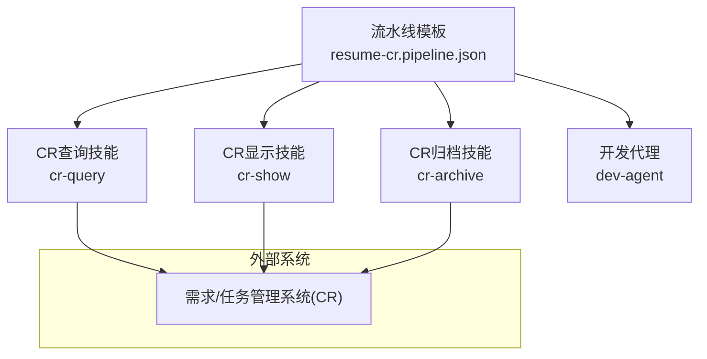
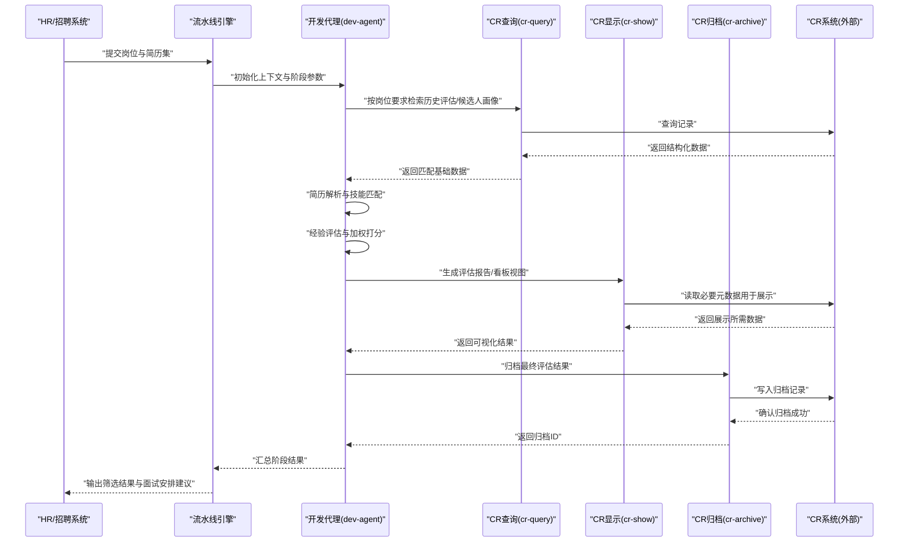
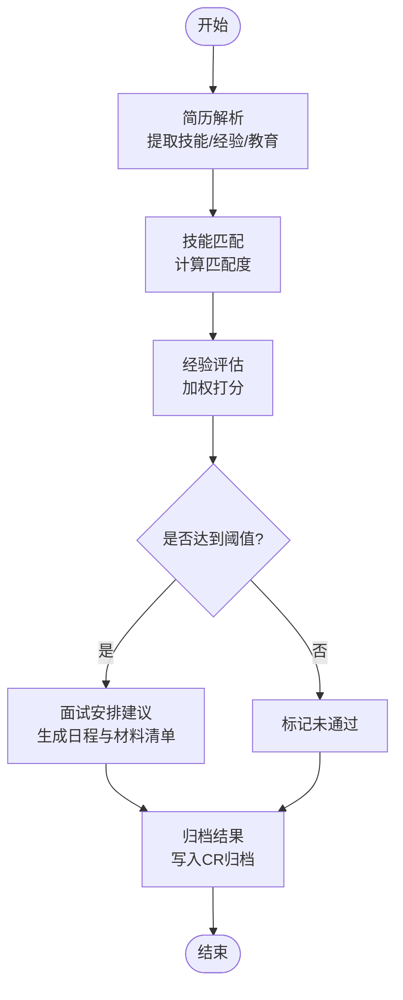
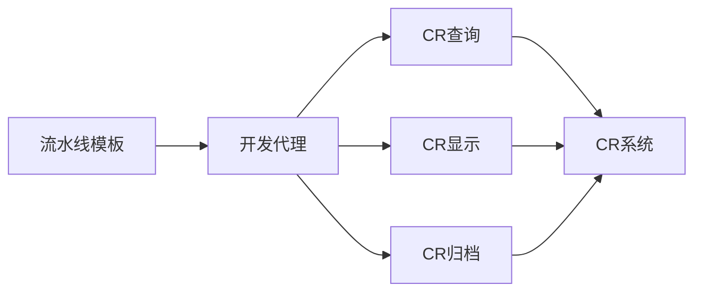

# 简历筛选流水线

<cite>
**本文引用的文件**   
- [pipeline-templates/resume-cr.pipeline.json](file://pipeline-templates/resume-cr.pipeline.json)
- [skills/cr/cr-query/SKILL.md](file://skills/cr/cr-query/SKILL.md)
- [skills/cr/cr-show/SKILL.md](file://skills/cr/cr-show/SKILL.md)
- [skills/cr/cr-archive/SKILL.md](file://skills/cr/cr-archive/SKILL.md)
- [agents/dev-agent.md](file://agents/dev-agent.md)
- [pipeline-templates/README.md](file://pipeline-templates/README.md)
</cite>

## 目录
1. [简介](#简介)
2. [项目结构](#项目结构)
3. [核心组件](#核心组件)
4. [架构总览](#架构总览)
5. [详细组件分析](#详细组件分析)
6. [依赖分析](#依赖分析)
7. [性能考虑](#性能考虑)
8. [故障排查指南](#故障排查指南)
9. [结论](#结论)
10. [附录](#附录)

## 简介
本文件为“简历筛选流水线”的权威文档，面向HR、招聘团队与自动化工程师，说明如何通过该流水线实现简历解析、技能匹配、经验评估、面试安排等阶段的自动化处理。流水线以配置驱动的方式编排多个阶段，并调用开发代理（Agent）与CR相关技能（Skill：CR查询、CR显示、CR归档）完成数据获取、结果展示与归档闭环。文档同时提供输入输出参数定义、评分权重配置方法、通知机制建议以及端到端使用示例。

## 项目结构
仓库中与简历筛选相关的资产主要位于以下位置：
- 流水线模板：pipeline-templates/resume-cr.pipeline.json
- CR相关技能：skills/cr/cr-query、skills/cr/cr-show、skills/cr/cr-archive
- 开发代理：agents/dev-agent.md
- 流水线模板索引与说明：pipeline-templates/README.md

图表来源
- [pipeline-templates/resume-cr.pipeline.json](file://pipeline-templates/resume-cr.pipeline.json)
- [skills/cr/cr-query/SKILL.md](file://skills/cr/cr-query/SKILL.md)
- [skills/cr/cr-show/SKILL.md](file://skills/cr/cr-show/SKILL.md)
- [skills/cr/cr-archive/SKILL.md](file://skills/cr/cr-archive/SKILL.md)
- [agents/dev-agent.md](file://agents/dev-agent.md)

章节来源
- [pipeline-templates/README.md](file://pipeline-templates/README.md)

## 核心组件
- 流水线模板（Pipeline Template）
  - 负责编排阶段顺序、参数传递、错误处理策略与重试策略。
  - 典型阶段包括：简历解析、技能匹配、经验评估、面试安排、结果归档。
- 开发代理（Dev Agent）
  - 作为执行主体，协调各阶段任务，调用相应技能，维护上下文与状态。
- CR相关技能（Skills）
  - CR查询：根据条件检索候选记录或历史评估信息。
  - CR显示：将结构化结果渲染为可读报告或看板视图。
  - CR归档：将最终评估结果写入归档记录，便于审计与回溯。

章节来源
- [pipeline-templates/resume-cr.pipeline.json](file://pipeline-templates/resume-cr.pipeline.json)
- [agents/dev-agent.md](file://agents/dev-agent.md)
- [skills/cr/cr-query/SKILL.md](file://skills/cr/cr-query/SKILL.md)
- [skills/cr/cr-show/SKILL.md](file://skills/cr/cr-show/SKILL.md)
- [skills/cr/cr-archive/SKILL.md](file://skills/cr/cr-archive/SKILL.md)

## 架构总览
下图展示了从输入到输出的端到端流程，涵盖解析、匹配、评估、面试安排与归档。

图表来源
- [pipeline-templates/resume-cr.pipeline.json](file://pipeline-templates/resume-cr.pipeline.json)
- [agents/dev-agent.md](file://agents/dev-agent.md)
- [skills/cr/cr-query/SKILL.md](file://skills/cr/cr-query/SKILL.md)
- [skills/cr/cr-show/SKILL.md](file://skills/cr/cr-show/SKILL.md)
- [skills/cr/cr-archive/SKILL.md](file://skills/cr/cr-archive/SKILL.md)

## 详细组件分析

### 流水线模板（resume-cr.pipeline.json）
- 作用
  - 定义阶段序列、阶段间数据契约、失败重试与回退策略、通知钩子。
- 关键配置项（概念性说明）
  - 阶段列表：解析、匹配、评估、面试安排、归档。
  - 输入参数：岗位要求、筛选标准、评分权重、通知渠道。
  - 输出参数：候选人评分、匹配度、面试建议、归档ID。
  - 错误处理：重试次数、超时时间、降级策略。
- 使用方式
  - 通过流水线引擎加载模板，注入运行时参数后执行。
  - 支持在阶段级别覆盖默认权重与阈值。

章节来源
- [pipeline-templates/resume-cr.pipeline.json](file://pipeline-templates/resume-cr.pipeline.json)

### 开发代理（dev-agent）
- 职责
  - 编排阶段执行、维护上下文、聚合中间结果、触发通知。
- 能力边界
  - 不直接访问外部系统，而是通过技能进行交互。
  - 对异常进行捕获与上报，保证流水线可观测性。
- 与技能的协作
  - 调用CR查询获取背景数据；调用CR显示生成报告；调用CR归档持久化结果。

章节来源
- [agents/dev-agent.md](file://agents/dev-agent.md)

### 技能：CR查询（cr-query）
- 功能
  - 基于岗位要求与关键词检索历史评估、候选人画像、过往面试反馈等。
- 输入
  - 查询条件：岗位标签、技能集合、经验年限范围、地域等。
  - 分页与排序参数。
- 输出
  - 结构化候选数据集，包含字段：ID、姓名、匹配分数、来源记录ID、更新时间。
- 错误处理
  - 网络异常、权限不足、空结果集的处理策略。

章节来源
- [skills/cr/cr-query/SKILL.md](file://skills/cr/cr-query/SKILL.md)

### 技能：CR显示（cr-show）
- 功能
  - 将评估结果渲染为可读报告或看板视图，便于HR快速审阅。
- 输入
  - 结构化评估数据、展示模板选择、过滤维度。
- 输出
  - 渲染后的报告内容或看板URL，附带摘要与关键指标。
- 扩展点
  - 支持自定义模板与主题，适配不同团队的展示偏好。

章节来源
- [skills/cr/cr-show/SKILL.md](file://skills/cr/cr-show/SKILL.md)

### 技能：CR归档（cr-archive）
- 功能
  - 将最终评估结果与过程数据归档至CR系统，形成审计轨迹。
- 输入
  - 归档条目：候选人ID、评分明细、决策依据、附件链接。
- 输出
  - 归档ID、归档时间戳、版本信息。
- 一致性保障
  - 幂等写入、冲突检测与合并策略。

章节来源
- [skills/cr/cr-archive/SKILL.md](file://skills/cr/cr-archive/SKILL.md)

### 阶段算法与流程（概念性）
以下为评分与筛选的核心流程示意，便于理解权重与阈值的组合效果。

[此图为概念性流程图，无需图表来源]

## 依赖分析
- 内部依赖
  - 流水线模板依赖开发代理与各CR技能。
  - 开发代理依赖CR查询、CR显示、CR归档的技能接口。
- 外部依赖
  - CR系统（数据库/服务）：提供查询、显示与归档的数据源与落盘能力。
- 耦合与内聚
  - 阶段之间通过明确的数据契约解耦，提升可替换性与可测试性。
  - 技能层封装外部系统差异，降低上层复杂度。

图表来源
- [pipeline-templates/resume-cr.pipeline.json](file://pipeline-templates/resume-cr.pipeline.json)
- [agents/dev-agent.md](file://agents/dev-agent.md)
- [skills/cr/cr-query/SKILL.md](file://skills/cr/cr-query/SKILL.md)
- [skills/cr/cr-show/SKILL.md](file://skills/cr/cr-show/SKILL.md)
- [skills/cr/cr-archive/SKILL.md](file://skills/cr/cr-archive/SKILL.md)

章节来源
- [pipeline-templates/resume-cr.pipeline.json](file://pipeline-templates/resume-cr.pipeline.json)
- [agents/dev-agent.md](file://agents/dev-agent.md)

## 性能考虑
- 批处理与并行
  - 对大批量简历采用分片并行处理，结合CR查询的分页与并发限制。
- 缓存与去重
  - 对重复简历与相似候选人进行指纹识别与缓存，减少重复计算。
- 资源控制
  - 设置合理的超时、重试与熔断策略，避免雪崩效应。
- 存储优化
  - 归档时仅保留必要字段与摘要，原始附件走对象存储并保存引用。

[本节为通用指导，无需章节来源]

## 故障排查指南
- 常见问题
  - 查询为空：检查查询条件与岗位标签映射是否正确。
  - 显示异常：确认模板变量与数据结构一致。
  - 归档失败：核对权限、唯一键冲突与幂等逻辑。
- 日志与追踪
  - 关注阶段级日志、技能调用链路与CR系统响应码。
- 恢复策略
  - 支持断点续跑与增量归档，确保失败后可从最近成功节点继续。

章节来源
- [pipeline-templates/resume-cr.pipeline.json](file://pipeline-templates/resume-cr.pipeline.json)
- [skills/cr/cr-query/SKILL.md](file://skills/cr/cr-query/SKILL.md)
- [skills/cr/cr-show/SKILL.md](file://skills/cr/cr-show/SKILL.md)
- [skills/cr/cr-archive/SKILL.md](file://skills/cr/cr-archive/SKILL.md)

## 结论
本流水线以模板驱动的方式将简历筛选的关键环节标准化与自动化，借助开发代理与CR技能实现数据拉取、结果呈现与归档闭环。通过明确的输入输出契约与可扩展的评分权重配置，团队可在保持灵活性的同时获得一致的筛选体验与可追溯的审计轨迹。

[本节为总结性内容，无需章节来源]

## 附录

### 输入参数定义（概念性）
- 岗位要求
  - 岗位名称、部门、职级、工作地点、紧急程度。
- 筛选标准
  - 最低学历、工作年限下限、必备技能集合、加分项。
- 评分权重
  - 技能匹配权重、经验年限权重、项目质量权重、稳定性权重。
- 通知机制
  - 通知渠道（邮件/IM）、接收人、触发时机（通过/未通过/需复核）。

[本节为概念性说明，无需章节来源]

### 输出参数定义（概念性）
- 候选人评分
  - 总分、分项得分、匹配等级（高/中/低）。
- 面试安排建议
  - 推荐面试官、建议时间段、面试材料清单。
- 归档信息
  - 归档ID、归档时间、版本、关联记录ID。

[本节为概念性说明，无需章节来源]

### 使用示例（步骤式）
- 准备阶段
  - 在流水线模板中配置岗位与筛选标准，设定评分权重与阈值。
- 执行阶段
  - 启动流水线，传入简历集与通知配置。
  - 观察各阶段日志与中间结果。
- 审阅与决策
  - 通过CR显示查看评估报告，必要时调整权重后重新运行。
- 归档与通知
  - 确认通过后自动归档，并发送通知给HR与面试官。

[本节为概念性说明，无需章节来源]