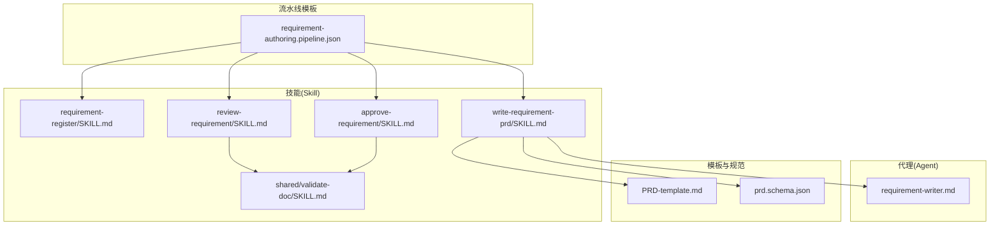
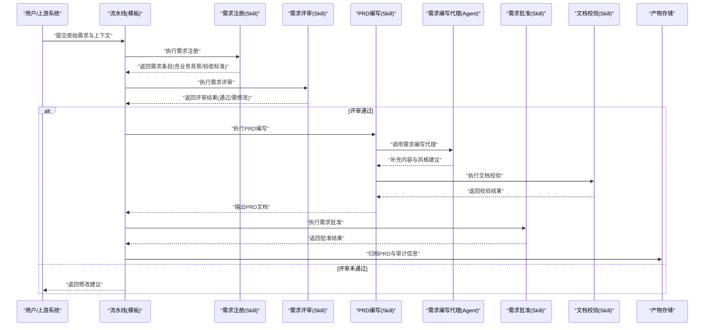
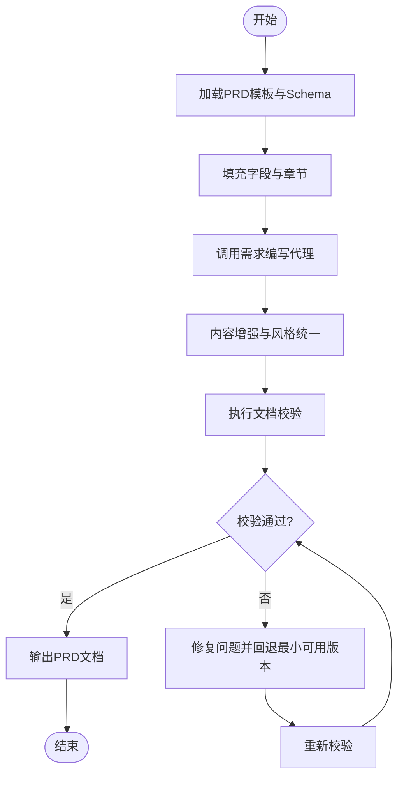
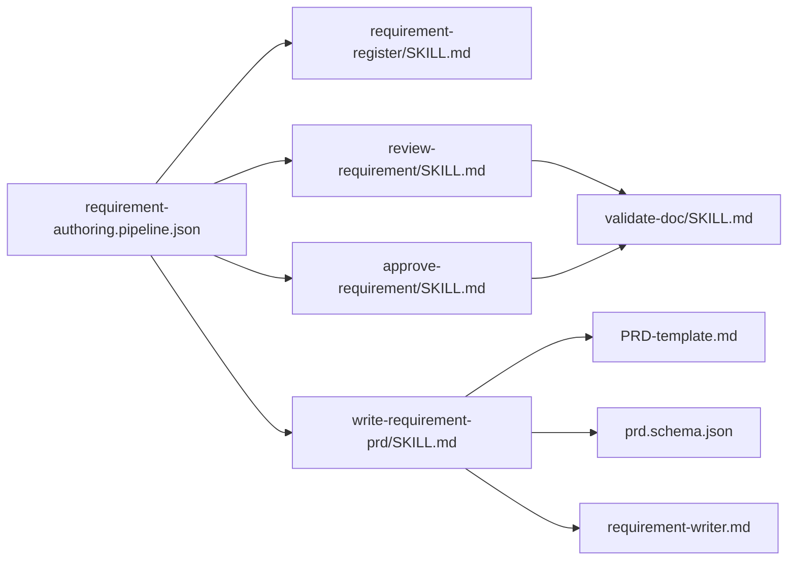

# 需求编写流水线

<cite>
**本文引用的文件**   
- [requirement-authoring.pipeline.json](file://pipeline-templates/requirement-authoring.pipeline.json)
- [requirement-register/SKILL.md](file://skills/requirement/requirement-register/SKILL.md)
- [review-requirement/SKILL.md](file://skills/requirement/review-requirement/SKILL.md)
- [write-requirement-prd/SKILL.md](file://skills/requirement/write-requirement-prd/SKILL.md)
- [approve-requirement/SKILL.md](file://skills/requirement/approve-requirement/SKILL.md)
- [requirement-writer.md](file://agents/requirement-writer.md)
- [PRD-template.md](file://assets/shared/engineering-docs/templates/PRD-template.md)
- [prd.schema.json](file://assets/shared/engineering-docs/schemas/prd.schema.json)
- [validate-doc/SKILL.md](file://skills/shared/validate-doc/SKILL.md)
</cite>

## 目录
1. [简介](#简介)
2. [项目结构](#项目结构)
3. [核心组件](#核心组件)
4. [架构总览](#架构总览)
5. [详细组件分析](#详细组件分析)
6. [依赖分析](#依赖分析)
7. [性能考虑](#性能考虑)
8. [故障排查指南](#故障排查指南)
9. [结论](#结论)
10. [附录](#附录)

## 简介
本文件面向“需求编写流水线”，用于自动化完成从原始需求收集到PRD文档生成与审批的全流程。流水线包含以下阶段：
- 需求注册：采集原始需求、业务背景、验收标准等输入，形成结构化需求条目
- 需求评审：基于规则对需求进行一致性、完整性与可行性审查
- PRD编写：依据模板与Schema生成标准化PRD文档
- 需求确认（批准）：由审批者或Agent完成最终确认并归档

该流水线通过可配置的Pipeline模板驱动，结合Skill（能力单元）与Agent（智能代理）协同工作，确保输出文档质量与可追溯性。

## 项目结构
围绕“需求编写流水线”的相关资源分布在如下位置：
- 流水线模板：定义阶段编排、参数与调用关系
- Skill：封装各阶段的执行逻辑与校验规则
- Agent：提供特定角色的智能能力（如需求编写代理）
- 模板与Schema：规范PRD结构与字段约束

图示来源
- [requirement-authoring.pipeline.json](file://pipeline-templates/requirement-authoring.pipeline.json)
- [requirement-register/SKILL.md](file://skills/requirement/requirement-register/SKILL.md)
- [review-requirement/SKILL.md](file://skills/requirement/review-requirement/SKILL.md)
- [write-requirement-prd/SKILL.md](file://skills/requirement/write-requirement-prd/SKILL.md)
- [approve-requirement/SKILL.md](file://skills/requirement/approve-requirement/SKILL.md)
- [requirement-writer.md](file://agents/requirement-writer.md)
- [PRD-template.md](file://assets/shared/engineering-docs/templates/PRD-template.md)
- [prd.schema.json](file://assets/shared/engineering-docs/schemas/prd.schema.json)
- [validate-doc/SKILL.md](file://skills/shared/validate-doc/SKILL.md)

章节来源
- [requirement-authoring.pipeline.json](file://pipeline-templates/requirement-authoring.pipeline.json)
- [requirement-register/SKILL.md](file://skills/requirement/requirement-register/SKILL.md)
- [review-requirement/SKILL.md](file://skills/requirement/review-requirement/SKILL.md)
- [write-requirement-prd/SKILL.md](file://skills/requirement/write-requirement-prd/SKILL.md)
- [approve-requirement/SKILL.md](file://skills/requirement/approve-requirement/SKILL.md)
- [requirement-writer.md](file://agents/requirement-writer.md)
- [PRD-template.md](file://assets/shared/engineering-docs/templates/PRD-template.md)
- [prd.schema.json](file://assets/shared/engineering-docs/schemas/prd.schema.json)
- [validate-doc/SKILL.md](file://skills/shared/validate-doc/SKILL.md)

## 核心组件
- 流水线模板
  - 作用：定义阶段顺序、参数传递、条件分支与重试策略
  - 关键配置项：阶段名称、输入/输出变量、依赖的Skill、环境变量、超时与重试
- 技能(Skill)
  - requirement-register：负责需求注册，规范化输入并产出“需求条目”
  - review-requirement：执行评审规则，输出评审意见与通过/不通过状态
  - write-requirement-prd：根据模板与Schema生成PRD，并进行格式校验
  - approve-requirement：完成最终批准，记录审批结果与审计信息
  - validate-doc：通用文档校验能力，支持Schema与命名规范检查
- 代理(Agent)
  - requirement-writer：需求编写代理，辅助PRD内容生成、补全与风格统一
- 模板与Schema
  - PRD-template.md：PRD文档的结构化模板
  - prd.schema.json：PRD字段的JSON Schema约束，保障数据一致性与完整性

章节来源
- [requirement-authoring.pipeline.json](file://pipeline-templates/requirement-authoring.pipeline.json)
- [requirement-register/SKILL.md](file://skills/requirement/requirement-register/SKILL.md)
- [review-requirement/SKILL.md](file://skills/requirement/review-requirement/SKILL.md)
- [write-requirement-prd/SKILL.md](file://skills/requirement/write-requirement-prd/SKILL.md)
- [approve-requirement/SKILL.md](file://skills/requirement/approve-requirement/SKILL.md)
- [requirement-writer.md](file://agents/requirement-writer.md)
- [PRD-template.md](file://assets/shared/engineering-docs/templates/PRD-template.md)
- [prd.schema.json](file://assets/shared/engineering-docs/schemas/prd.schema.json)
- [validate-doc/SKILL.md](file://skills/shared/validate-doc/SKILL.md)

## 架构总览
下图展示了“需求编写流水线”的整体架构与各组件交互关系。

图示来源
- [requirement-authoring.pipeline.json](file://pipeline-templates/requirement-authoring.pipeline.json)
- [requirement-register/SKILL.md](file://skills/requirement/requirement-register/SKILL.md)
- [review-requirement/SKILL.md](file://skills/requirement/review-requirement/SKILL.md)
- [write-requirement-prd/SKILL.md](file://skills/requirement/write-requirement-prd/SKILL.md)
- [approve-requirement/SKILL.md](file://skills/requirement/approve-requirement/SKILL.md)
- [requirement-writer.md](file://agents/requirement-writer.md)
- [validate-doc/SKILL.md](file://skills/shared/validate-doc/SKILL.md)

## 详细组件分析

### 阶段一：需求注册
- 目标：将原始需求、业务背景、验收标准等输入规范化为“需求条目”，便于后续评审与生成PRD
- 输入参数
  - 原始需求描述
  - 业务背景说明
  - 验收标准（功能与非功能）
  - 相关干系人与优先级
- 处理逻辑
  - 解析与清洗输入文本
  - 抽取关键字段（标题、范围、影响面、风险点）
  - 生成唯一标识与版本信息
  - 输出结构化需求条目
- 输出参数
  - 需求条目（含元数据与正文）
  - 待评审清单（缺失字段、模糊表述）
- 错误处理
  - 必填字段缺失时返回修正建议
  - 输入格式异常时提示重新提交

章节来源
- [requirement-register/SKILL.md](file://skills/requirement/requirement-register/SKILL.md)

### 阶段二：需求评审
- 目标：基于规则对需求条目进行一致性、完整性与可行性审查
- 输入参数
  - 需求条目
  - 评审规则集（模板选择、命名规范、覆盖度要求）
- 处理逻辑
  - 对照评审规则逐项检查
  - 识别冲突与遗漏
  - 生成评审意见与评分
- 输出参数
  - 评审报告（通过/不通过/需修改）
  - 修改建议与优先级
- 错误处理
  - 规则冲突时给出仲裁建议
  - 无法判定项标记为人工复核

章节来源
- [review-requirement/SKILL.md](file://skills/requirement/review-requirement/SKILL.md)
- [validate-doc/SKILL.md](file://skills/shared/validate-doc/SKILL.md)

### 阶段三：PRD编写
- 目标：依据模板与Schema生成标准化PRD文档，并保证结构与字段合规
- 输入参数
  - 已评审通过的需求条目
  - PRD模板选择
  - 文档格式定制选项（语言、层级、图表占位）
- 处理逻辑
  - 加载PRD模板与Schema
  - 填充字段与章节内容
  - 调用需求编写代理进行内容增强与风格统一
  - 执行文档校验（Schema与命名规范）
- 输出参数
  - PRD文档（Markdown或其他格式）
  - 校验报告（通过/问题列表）
- 错误处理
  - Schema校验失败时回退至最小可用版本并标注问题
  - 模板不可用时切换默认模板

章节来源
- [write-requirement-prd/SKILL.md](file://skills/requirement/write-requirement-prd/SKILL.md)
- [requirement-writer.md](file://agents/requirement-writer.md)
- [PRD-template.md](file://assets/shared/engineering-docs/templates/PRD-template.md)
- [prd.schema.json](file://assets/shared/engineering-docs/schemas/prd.schema.json)
- [validate-doc/SKILL.md](file://skills/shared/validate-doc/SKILL.md)

### 阶段四：需求确认（批准）
- 目标：完成最终批准，记录审批结果与审计信息，归档产物
- 输入参数
  - PRD文档
  - 审批人信息与审批规则
- 处理逻辑
  - 校验文档完整性与版本一致性
  - 汇总评审与校验结果
  - 生成批准决定与审计日志
- 输出参数
  - 批准结果（通过/拒绝）
  - 审计日志（时间、人员、决策依据）
  - 归档路径与索引
- 错误处理
  - 审批规则不满足时退回修改
  - 审计日志写入失败时重试并告警

章节来源
- [approve-requirement/SKILL.md](file://skills/requirement/approve-requirement/SKILL.md)
- [validate-doc/SKILL.md](file://skills/shared/validate-doc/SKILL.md)

### 流程图：PRD生成与校验

图示来源
- [write-requirement-prd/SKILL.md](file://skills/requirement/write-requirement-prd/SKILL.md)
- [requirement-writer.md](file://agents/requirement-writer.md)
- [PRD-template.md](file://assets/shared/engineering-docs/templates/PRD-template.md)
- [prd.schema.json](file://assets/shared/engineering-docs/schemas/prd.schema.json)
- [validate-doc/SKILL.md](file://skills/shared/validate-doc/SKILL.md)

## 依赖分析
- 组件耦合
  - 流水线模板依赖四个Skill与一个Agent
  - PRD编写阶段强依赖模板与Schema，并通过通用校验Skill保障质量
- 外部依赖
  - 文档模板与Schema位于共享工程文档资产中
  - 校验能力复用通用文档校验Skill
- 潜在循环依赖
  - 当前设计无循环依赖；评审与批准均单向依赖上游产物

图示来源
- [requirement-authoring.pipeline.json](file://pipeline-templates/requirement-authoring.pipeline.json)
- [requirement-register/SKILL.md](file://skills/requirement/requirement-register/SKILL.md)
- [review-requirement/SKILL.md](file://skills/requirement/review-requirement/SKILL.md)
- [write-requirement-prd/SKILL.md](file://skills/requirement/write-requirement-prd/SKILL.md)
- [approve-requirement/SKILL.md](file://skills/requirement/approve-requirement/SKILL.md)
- [requirement-writer.md](file://agents/requirement-writer.md)
- [PRD-template.md](file://assets/shared/engineering-docs/templates/PRD-template.md)
- [prd.schema.json](file://assets/shared/engineering-docs/schemas/prd.schema.json)
- [validate-doc/SKILL.md](file://skills/shared/validate-doc/SKILL.md)

章节来源
- [requirement-authoring.pipeline.json](file://pipeline-templates/requirement-authoring.pipeline.json)
- [requirement-register/SKILL.md](file://skills/requirement/requirement-register/SKILL.md)
- [review-requirement/SKILL.md](file://skills/requirement/review-requirement/SKILL.md)
- [write-requirement-prd/SKILL.md](file://skills/requirement/write-requirement-prd/SKILL.md)
- [approve-requirement/SKILL.md](file://skills/requirement/approve-requirement/SKILL.md)
- [requirement-writer.md](file://agents/requirement-writer.md)
- [PRD-template.md](file://assets/shared/engineering-docs/templates/PRD-template.md)
- [prd.schema.json](file://assets/shared/engineering-docs/schemas/prd.schema.json)
- [validate-doc/SKILL.md](file://skills/shared/validate-doc/SKILL.md)

## 性能考虑
- 并行与缓存
  - 若评审与校验可并行执行，应利用流水线并发能力缩短整体耗时
  - 对模板与Schema加载进行缓存，避免重复IO
- 增量处理
  - 在PRD编写阶段仅更新变更章节，减少生成成本
- 重试与熔断
  - 对网络或外部服务调用设置合理重试与熔断阈值，防止级联失败
- 资源限制
  - 控制Agent调用的并发度与令牌配额，避免过载

[本节为通用指导，无需具体文件引用]

## 故障排查指南
- 常见问题
  - 必填字段缺失：检查需求注册阶段的输入是否完整
  - 评审规则冲突：核对评审规则集是否存在互斥条款
  - Schema校验失败：对照Schema定位字段类型与约束问题
  - 模板不可用：确认模板路径与权限，必要时切换默认模板
- 诊断步骤
  - 查看各阶段日志与产物快照
  - 使用通用文档校验Skill复现问题
  - 逐步缩小范围至具体字段或章节
- 恢复策略
  - 回退到上一稳定版本
  - 自动修复可识别问题后重新运行流水线

章节来源
- [validate-doc/SKILL.md](file://skills/shared/validate-doc/SKILL.md)
- [prd.schema.json](file://assets/shared/engineering-docs/schemas/prd.schema.json)
- [PRD-template.md](file://assets/shared/engineering-docs/templates/PRD-template.md)

## 结论
“需求编写流水线”通过标准化的阶段编排与可配置的Skill/Agent组合，实现了从需求收集到PRD生成与批准的端到端自动化。借助模板与Schema约束以及通用校验能力，确保了输出文档的一致性与高质量。建议在团队内推广该流水线，并结合业务特性持续优化评审规则与模板。

[本节为总结性内容，无需具体文件引用]

## 附录

### 使用示例：配置需求编写流水线
- 选择PRD模板
  - 在流水线模板中指定PRD模板路径
  - 参考模板文件以了解章节结构与字段约定
- 设置评审规则
  - 在评审阶段配置规则集，包括命名规范、覆盖度要求与冲突仲裁策略
- 定制文档格式
  - 在PRD编写阶段启用语言、层级与图表占位等选项
- 集成需求编写代理
  - 在PRD编写阶段启用需求编写代理以提升内容质量与风格统一

章节来源
- [requirement-authoring.pipeline.json](file://pipeline-templates/requirement-authoring.pipeline.json)
- [PRD-template.md](file://assets/shared/engineering-docs/templates/PRD-template.md)
- [write-requirement-prd/SKILL.md](file://skills/requirement/write-requirement-prd/SKILL.md)
- [requirement-writer.md](file://agents/requirement-writer.md)