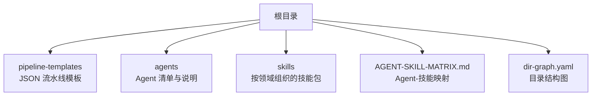
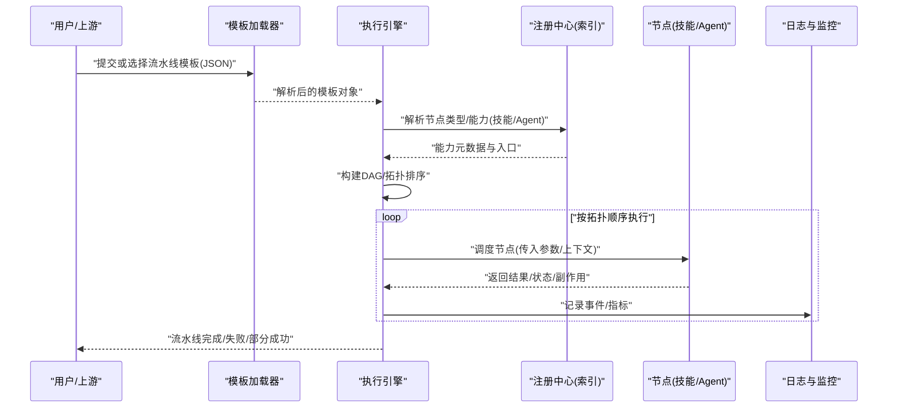
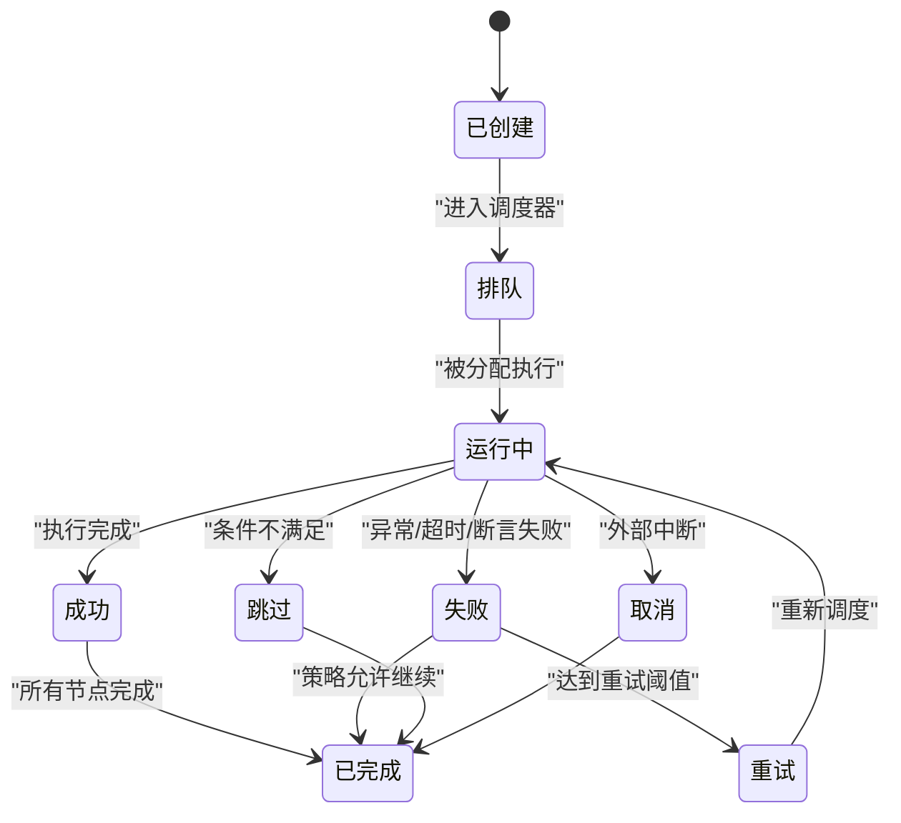
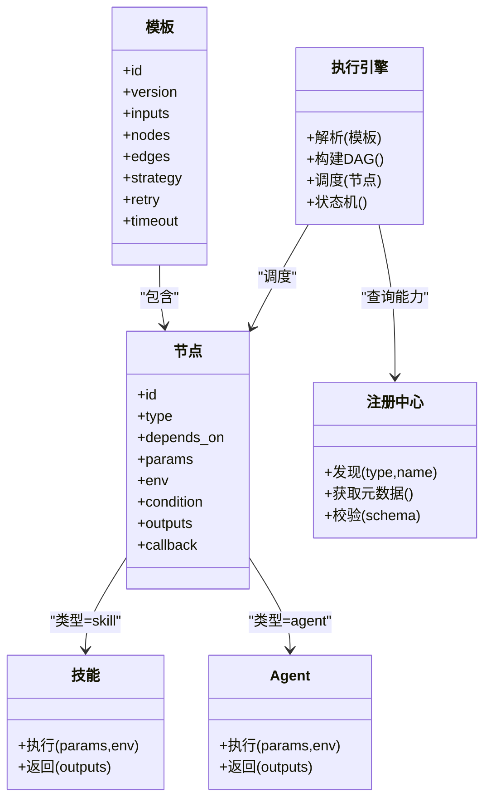
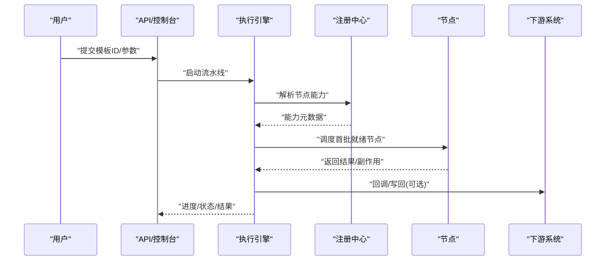
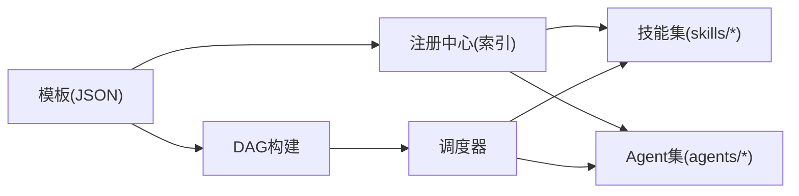

# 流水线架构设计

<cite>
**本文引用的文件**   
- [pipeline-templates/README.md](file://pipeline-templates/README.md)
- [pipeline-templates/architecture-design.pipeline.json](file://pipeline-templates/architecture-design.pipeline.json)
- [pipeline-templates/code-implementation.pipeline.json](file://pipeline-templates/code-implementation.pipeline.json)
- [pipeline-templates/competitive-radar.pipeline.json](file://pipeline-templates/competitive-radar.pipeline.json)
- [pipeline-templates/feature-writeback.pipeline.json](file://pipeline-templates/feature-writeback.pipeline.json)
- [pipeline-templates/market-to-plan.pipeline.json](file://pipeline-templates/market-to-plan.pipeline.json)
- [pipeline-templates/product-planning.pipeline.json](file://pipeline-templates/product-planning.pipeline.json)
- [pipeline-templates/requirement-authoring.pipeline.json](file://pipeline-templates/requirement-authoring.pipeline.json)
- [pipeline-templates/resume-cr.pipeline.json](file://pipeline-templates/resume-cr.pipeline.json)
- [agents/_index.yml](file://agents/_index.yml)
- [skills/_index.yml](file://skills/_index.yml)
- [AGENT-SKILL-MATRIX.md](file://AGENT-SKILL-MATRIX.md)
- [dir-graph.yaml](file://dir-graph.yaml)
</cite>

## 目录
1. [简介](#简介)
2. [项目结构](#项目结构)
3. [核心组件](#核心组件)
4. [架构总览](#架构总览)
5. [详细组件分析](#详细组件分析)
6. [依赖关系分析](#依赖关系分析)
7. [性能与可扩展性](#性能与可扩展性)
8. [故障排查指南](#故障排查指南)
9. [结论](#结论)
10. [附录](#附录)

## 简介
本文件面向“流水线编排系统”的架构设计与实现说明，聚焦以下目标：
- 解释流水线编排系统的核心架构与设计原理
- 定义并规范 JSON 配置文件的结构与语法
- 阐述流水线的生命周期管理、执行引擎机制、状态转换模型与错误处理策略
- 说明流水线与 Agent、技能的集成模式（参数传递、数据共享、回调）
- 提供监控、日志记录与调试方法
- 通过架构图与流程图帮助开发者理解整体工作原理

## 项目结构
仓库采用“模板驱动 + 技能注册 + Agent 矩阵”的组织方式：
- pipeline-templates：以 JSON 定义的流水线模板集合，描述步骤、节点、条件分支、输入输出等
- agents：Agent 清单与角色说明，用于在流水线中调度具体智能体
- skills：按领域划分的技能包，每个技能包含 SKILL.md 描述与可选脚本/工具
- AGENT-SKILL-MATRIX.md：Agent 与技能的映射矩阵，指导编排时选择合适能力
- dir-graph.yaml：目录结构图，便于快速定位资源

**图表来源**
- [dir-graph.yaml](file://dir-graph.yaml)

**章节来源**
- [dir-graph.yaml](file://dir-graph.yaml)

## 核心组件
- 流水线模板（JSON）：声明式描述任务序列、并行度、条件分支、输入输出、重试与超时等
- 执行引擎：解析模板、构建有向无环图（DAG）、调度节点、管理状态机与错误恢复
- Agent 与技能：作为可插拔的执行单元，由引擎根据模板调用；支持参数注入、上下文共享与回调
- 监控与日志：采集节点运行指标、事件流与结构化日志，支撑可视化与排障
- 配置与注册：Agent 索引与技能索引，为模板解析与运行时发现提供依据

**章节来源**
- [pipeline-templates/README.md](file://pipeline-templates/README.md)
- [agents/_index.yml](file://agents/_index.yml)
- [skills/_index.yml](file://skills/_index.yml)
- [AGENT-SKILL-MATRIX.md](file://AGENT-SKILL-MATRIX.md)

## 架构总览
下图展示从“模板加载 → DAG 构建 → 节点调度 → 结果汇聚”的整体流程。

**图表来源**
- [pipeline-templates/README.md](file://pipeline-templates/README.md)
- [agents/_index.yml](file://agents/_index.yml)
- [skills/_index.yml](file://skills/_index.yml)

## 详细组件分析

### 流水线模板（JSON）结构与语法
- 顶层字段
  - id/name/description：标识与说明
  - version：模板版本
  - inputs：全局输入参数与默认值
  - outputs：全局输出变量名与来源表达式
  - nodes：节点数组，表示 DAG 的顶点
  - edges：边数组，表示节点间的依赖关系
  - strategy：执行策略（串行/并行/最大并发数）
  - retry：全局重试策略（次数/退避）
  - timeout：全局超时
  - on_failure/on_success：钩子（回调）
- 节点字段
  - id/type：唯一标识与类型（如 skill/agent/script）
  - name/title：显示名称
  - depends_on：前置节点集合
  - params：入参映射（引用 inputs/nodes.*.outputs）
  - env：环境变量
  - retry/timeout：覆盖全局策略
  - condition：布尔表达式控制是否执行
  - outputs：节点级输出键值
  - callback：完成后回调（通知/写回）
- 边字段
  - from/to：源节点与目标节点
  - when：条件表达式（如 success/failure/skip）
- 表达式与上下文
  - 引用路径：inputs.xxx、nodes.<id>.outputs.xxx
  - 内置函数：字符串处理、条件判断、列表聚合等
  - 安全沙箱：限制危险操作，仅允许白名单函数

建议将常用模板沉淀到 pipeline-templates 目录，并通过 README 维护示例与约束。

**章节来源**
- [pipeline-templates/README.md](file://pipeline-templates/README.md)
- [pipeline-templates/architecture-design.pipeline.json](file://pipeline-templates/architecture-design.pipeline.json)
- [pipeline-templates/code-implementation.pipeline.json](file://pipeline-templates/code-implementation.pipeline.json)
- [pipeline-templates/competitive-radar.pipeline.json](file://pipeline-templates/competitive-radar.pipeline.json)
- [pipeline-templates/feature-writeback.pipeline.json](file://pipeline-templates/feature-writeback.pipeline.json)
- [pipeline-templates/market-to-plan.pipeline.json](file://pipeline-templates/market-to-plan.pipeline.json)
- [pipeline-templates/product-planning.pipeline.json](file://pipeline-templates/product-planning.pipeline.json)
- [pipeline-templates/requirement-authoring.pipeline.json](file://pipeline-templates/requirement-authoring.pipeline.json)
- [pipeline-templates/resume-cr.pipeline.json](file://pipeline-templates/resume-cr.pipeline.json)

### 执行引擎与状态机
- 解析阶段
  - 校验模板语法与语义（必填字段、循环依赖检测）
  - 构建 DAG，进行拓扑排序
- 调度阶段
  - 按拓扑顺序推进就绪节点
  - 并行执行受策略与资源配额限制
  - 条件分支与短路逻辑
- 状态转换模型
  - 初始 → 排队 → 运行中 → 成功/失败/跳过/取消
  - 节点级与流水线级状态一致化
- 错误处理
  - 节点级重试与退避
  - 全局失败策略（继续/中止/收集错误）
  - 补偿与回滚（可选）
- 资源与限流
  - 并发上限、队列长度、超时熔断
  - 幂等性与去重（基于节点 ID 与输入指纹）

**图表来源**
- [pipeline-templates/README.md](file://pipeline-templates/README.md)

**章节来源**
- [pipeline-templates/README.md](file://pipeline-templates/README.md)

### 与 Agent 和技能的集成模式
- 能力注册
  - 通过 agents/_index.yml 与 skills/_index.yml 集中登记
  - 元数据包括：名称、版本、入口、参数 schema、权限范围
- 参数传递
  - 模板 inputs → 节点 params → 技能/Agent 入参
  - 支持嵌套对象、枚举、必填/可选、默认值
- 数据共享
  - 节点 outputs 写入上下文，后续节点通过路径引用
  - 大对象走临时存储，上下文仅保留引用
- 回调机制
  - 节点级 with_callback：成功后触发写回/通知
  - 流水线级 on_failure/on_success：统一告警/审计
- 安全与隔离
  - 最小权限原则、网络访问白名单、文件系统沙箱

**图表来源**
- [agents/_index.yml](file://agents/_index.yml)
- [skills/_index.yml](file://skills/_index.yml)
- [pipeline-templates/README.md](file://pipeline-templates/README.md)

**章节来源**
- [agents/_index.yml](file://agents/_index.yml)
- [skills/_index.yml](file://skills/_index.yml)
- [AGENT-SKILL-MATRIX.md](file://AGENT-SKILL-MATRIX.md)

### 关键流程时序（端到端）

**图表来源**
- [pipeline-templates/README.md](file://pipeline-templates/README.md)
- [agents/_index.yml](file://agents/_index.yml)
- [skills/_index.yml](file://skills/_index.yml)

## 依赖关系分析
- 模板与能力解耦：模板只声明 type/name，具体实现由注册中心提供
- 节点间依赖显式化：通过 edges 与 depends_on 明确 DAG
- 索引驱动发现：agents/_index.yml 与 skills/_index.yml 是运行时发现的权威来源
- 矩阵辅助编排：AGENT-SKILL-MATRIX.md 指导选择合适 Agent/技能组合

**图表来源**
- [agents/_index.yml](file://agents/_index.yml)
- [skills/_index.yml](file://skills/_index.yml)
- [AGENT-SKILL-MATRIX.md](file://AGENT-SKILL-MATRIX.md)

**章节来源**
- [agents/_index.yml](file://agents/_index.yml)
- [skills/_index.yml](file://skills/_index.yml)
- [AGENT-SKILL-MATRIX.md](file://AGENT-SKILL-MATRIX.md)

## 性能与可扩展性
- 并行与吞吐
  - 合理设置 strategy.max_concurrency，避免热点节点阻塞
  - 对 I/O 密集型节点启用异步与连接池
- 缓存与复用
  - 对纯计算节点引入结果缓存（基于输入指纹）
  - 对读多写少的外部数据使用短 TTL 缓存
- 背压与降级
  - 队列满时拒绝新任务或延迟提交
  - 非关键路径节点失败时按策略继续
- 扩展点
  - 新增技能/Agent 仅需更新索引与文档
  - 自定义节点类型通过插件机制接入

[本节为通用指导，无需代码来源]

## 故障排查指南
- 常见问题定位
  - 模板语法错误：检查必填字段、表达式语法、循环依赖
  - 节点执行失败：查看节点日志、重试次数、超时与退出码
  - 参数不匹配：核对 inputs→params→schema 的一致性
  - 回调失败：确认权限、网络可达性与幂等性
- 日志与追踪
  - 结构化日志：trace_id、node_id、step、duration、error_code
  - 指标上报：QPS、P95/P99、失败率、重试率
  - 链路追踪：跨节点传播 trace_id，关联外部系统调用
- 调试技巧
  - 单步执行：强制串行，打印中间 outputs
  - 条件分支：打印 when 表达式求值结果
  - 回放：保存输入与中间产物，复现问题

**章节来源**
- [pipeline-templates/README.md](file://pipeline-templates/README.md)

## 结论
本架构以“声明式模板 + 注册中心 + 执行引擎”为核心，实现了高内聚、低耦合的流水线编排体系。通过明确的 JSON 规范、完善的 DAG 调度与状态机、以及灵活的 Agent/技能集成模式，既保证了可观测性与稳定性，又具备良好的可扩展性与可维护性。建议在团队内推广模板化实践，持续完善索引与矩阵，形成可复用的能力资产。

[本节为总结，无需代码来源]

## 附录

### 典型模板参考
以下为仓库中的模板清单，可作为学习与实践的起点：
- architecture-design.pipeline.json
- code-implementation.pipeline.json
- competitive-radar.pipeline.json
- feature-writeback.pipeline.json
- market-to-plan.pipeline.json
- product-planning.pipeline.json
- requirement-authoring.pipeline.json
- resume-cr.pipeline.json

**章节来源**
- [pipeline-templates/architecture-design.pipeline.json](file://pipeline-templates/architecture-design.pipeline.json)
- [pipeline-templates/code-implementation.pipeline.json](file://pipeline-templates/code-implementation.pipeline.json)
- [pipeline-templates/competitive-radar.pipeline.json](file://pipeline-templates/competitive-radar.pipeline.json)
- [pipeline-templates/feature-writeback.pipeline.json](file://pipeline-templates/feature-writeback.pipeline.json)
- [pipeline-templates/market-to-plan.pipeline.json](file://pipeline-templates/market-to-plan.pipeline.json)
- [pipeline-templates/product-planning.pipeline.json](file://pipeline-templates/product-planning.pipeline.json)
- [pipeline-templates/requirement-authoring.pipeline.json](file://pipeline-templates/requirement-authoring.pipeline.json)
- [pipeline-templates/resume-cr.pipeline.json](file://pipeline-templates/resume-cr.pipeline.json)