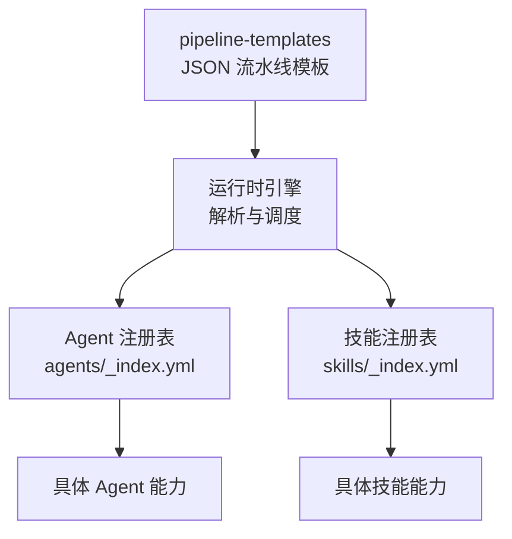
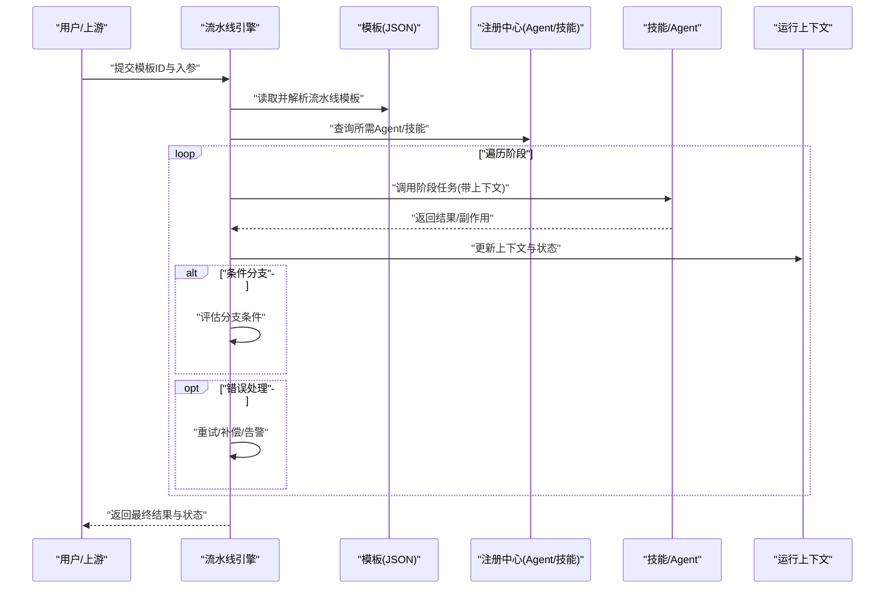
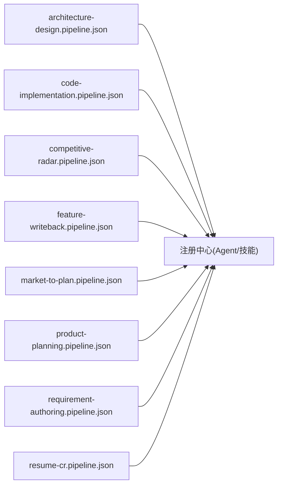

# 流水线编排

<cite>
**本文引用的文件**   
- [pipeline-templates/README.md](file://pipeline-templates/README.md)
- [pipeline-templates/architecture-design.pipeline.json](file://pipeline-templates/architecture-design.pipeline.json)
- [pipeline-templates/code-implementation.pipeline.json](file://pipeline-templates/code-implementation.pipeline.json)
- [pipeline-templates/competitive-radar.pipeline.json](file://pipeline-templates/competitive-radar.pipeline.json)
- [pipeline-templates/feature-writeback.pipeline.json](file://pipeline-templates/feature-writeback.pipeline.json)
- [pipeline-templates/market-to-plan.pipeline.json](file://pipeline-templates/market-to-plan.pipeline.json)
- [pipeline-templates/product-planning.pipeline.json](file://pipeline-templates/product-planning.pipeline.json)
- [pipeline-templates/requirement-authoring.pipeline.json](file://pipeline-templates/requirement-authoring.pipeline.json)
- [pipeline-templates/resume-cr.pipeline.json](file://pipeline-templates/resume-cr.pipeline.json)
- [skills/_index.yml](file://skills/_index.yml)
- [agents/_index.yml](file://agents/_index.yml)
</cite>

## 目录
1. [简介](#简介)
2. [项目结构](#项目结构)
3. [核心组件](#核心组件)
4. [架构总览](#架构总览)
5. [详细组件分析](#详细组件分析)
6. [依赖关系分析](#依赖关系分析)
7. [性能考量](#性能考量)
8. [故障排查指南](#故障排查指南)
9. [结论](#结论)
10. [附录](#附录)

## 简介
本文件面向“流水线编排系统”的使用者与扩展开发者，系统性阐述如何通过 JSON 配置文件定义复杂业务流程与工作流，覆盖阶段定义、条件分支、错误处理与状态管理。文档同时详解八类内置流水线模板：架构设计流水线、代码实现流水线、竞争雷达流水线、特性回写流水线、市场到计划流水线、产品规划流水线、需求编写流水线与简历筛选流水线，并提供自定义流水线开发指南、执行监控与调试方法，以及与 Agent 和技能的集成方式。

## 项目结构
仓库中与流水线编排直接相关的资源主要位于 pipeline-templates 目录，每个模板以 .pipeline.json 命名；技能（Skills）与智能体（Agents）分别通过 skills/_index.yml 与 agents/_index.yml 进行索引注册，便于流水线在运行时发现并调用。

图表来源
- [pipeline-templates/README.md](file://pipeline-templates/README.md)
- [agents/_index.yml](file://agents/_index.yml)
- [skills/_index.yml](file://skills/_index.yml)

章节来源
- [pipeline-templates/README.md](file://pipeline-templates/README.md)
- [agents/_index.yml](file://agents/_index.yml)
- [skills/_index.yml](file://skills/_index.yml)

## 核心组件
- 流水线模板（JSON）：描述工作流的阶段、输入输出、条件分支、错误处理策略与状态流转。
- 执行引擎：负责解析模板、实例化阶段、驱动 Agent/技能执行、维护上下文与状态、处理异常与重试。
- 注册中心：
  - Agent 注册表：集中声明可用 Agent 及其能力边界。
  - 技能注册表：集中声明可被调用的技能清单与元数据。
- 运行上下文：贯穿流水线的共享数据载体，用于阶段间传递产物与中间结果。

章节来源
- [pipeline-templates/README.md](file://pipeline-templates/README.md)
- [agents/_index.yml](file://agents/_index.yml)
- [skills/_index.yml](file://skills/_index.yml)

## 架构总览
下图展示了从模板到执行的端到端流程：引擎加载 JSON 模板，解析阶段图，按拓扑顺序或条件分支调度 Agent/技能，更新运行上下文与状态，并在出错时触发错误处理策略。

图表来源
- [pipeline-templates/README.md](file://pipeline-templates/README.md)
- [agents/_index.yml](file://agents/_index.yml)
- [skills/_index.yml](file://skills/_index.yml)

## 详细组件分析

### 内置流水线模板概览
以下模板均位于 pipeline-templates 目录，采用统一的 JSON 结构表达阶段、分支、错误处理与状态机。各模板侧重点不同，但遵循相同的编排语义。

- 架构设计流水线：围绕技术架构方案生成、评审与归档展开，强调多角色协同与决策节点。
- 代码实现流水线：将设计转化为可执行代码，包含任务拆分、编码、审查与质量门禁。
- 竞争雷达流水线：持续采集竞品动态、提炼洞察并反馈至规划与路线图。
- 特性回写流水线：将特性相关产物（如 PRD/SDD/任务等）回写到目标系统，确保一致性。
- 市场到计划流水线：从市场研究到规划草案的端到端流程，支持多源信息聚合与评审。
- 产品规划流水线：聚焦产品愿景、路线图与里程碑的制定与发布。
- 需求编写流水线：从需求登记到 PRD 产出与评审的全链路。
- 简历筛选流水线：面向招聘场景的简历收集、初筛、复核与归档。

章节来源
- [pipeline-templates/architecture-design.pipeline.json](file://pipeline-templates/architecture-design.pipeline.json)
- [pipeline-templates/code-implementation.pipeline.json](file://pipeline-templates/code-implementation.pipeline.json)
- [pipeline-templates/competitive-radar.pipeline.json](file://pipeline-templates/competitive-radar.pipeline.json)
- [pipeline-templates/feature-writeback.pipeline.json](file://pipeline-templates/feature-writeback.pipeline.json)
- [pipeline-templates/market-to-plan.pipeline.json](file://pipeline-templates/market-to-plan.pipeline.json)
- [pipeline-templates/product-planning.pipeline.json](file://pipeline-templates/product-planning.pipeline.json)
- [pipeline-templates/requirement-authoring.pipeline.json](file://pipeline-templates/requirement-authoring.pipeline.json)
- [pipeline-templates/resume-cr.pipeline.json](file://pipeline-templates/resume-cr.pipeline.json)

### 阶段定义与执行模型
- 阶段类型：常见包括“准备/分析/设计/实现/评审/验证/归档/回写”等，可按业务扩展。
- 输入输出契约：每个阶段声明其消费与产出的上下文键，保证阶段间解耦。
- 并行与串行：同一层级内可并行执行，跨层级遵循依赖顺序。
- 条件分支：基于上下文变量或外部信号决定后续路径。
- 错误处理：支持重试、跳过、补偿动作与告警。
- 状态管理：全局状态随阶段推进而演进，提供可视化追踪与断点恢复。

章节来源
- [pipeline-templates/README.md](file://pipeline-templates/README.md)

### 条件分支与错误处理
- 条件表达式：对上下文中的关键指标、评审结果或外部事件进行判断，驱动不同分支。
- 错误分类：可区分“可恢复错误”“不可恢复错误”，分别采取重试或终止策略。
- 补偿机制：对已生效的副作用（如写入外部系统）提供撤销或修正步骤。
- 告警与审计：关键决策与失败路径需记录日志与审计信息，便于复盘。

章节来源
- [pipeline-templates/README.md](file://pipeline-templates/README.md)

### 状态管理与可观测性
- 状态机：定义初始态、终态与中间态，明确迁移条件。
- 进度上报：阶段开始/完成/失败事件上报，供前端或监控系统消费。
- 快照与恢复：支持保存上下文快照，必要时从最近稳定点恢复。
- 指标与追踪：为关键阶段埋点，统计耗时、成功率与瓶颈。

章节来源
- [pipeline-templates/README.md](file://pipeline-templates/README.md)

### 与 Agent 和技能的集成
- Agent 注册：通过 agents/_index.yml 声明可用 Agent 及能力范围，流水线按需选择。
- 技能注册：通过 skills/_index.yml 声明技能清单与参数契约，流水线在阶段中调用。
- 调用约定：统一通过“能力名+参数”的方式调用，返回标准化结果与错误码。
- 权限与隔离：根据 Agent/技能的安全域限制访问范围，避免越权。

章节来源
- [agents/_index.yml](file://agents/_index.yml)
- [skills/_index.yml](file://skills/_index.yml)

### 使用示例与最佳实践
- 最小可用模板：先定义最少阶段与必要分支，逐步增强复杂度。
- 幂等设计：阶段尽量幂等，结合上下文键避免重复副作用。
- 渐进式校验：在早期阶段做轻量校验，后期再做深度检查。
- 失败快速收敛：尽早失败、清晰错误信息，缩短定位时间。
- 版本化模板：对模板变更进行版本控制，兼容历史运行实例。

[本节为通用指导，不直接分析具体文件]

## 依赖关系分析
- 模板与注册中心：流水线模板依赖 Agent/技能注册表进行能力发现。
- 阶段与上下文：阶段之间通过上下文键耦合，降低硬依赖。
- 外部系统：回写、同步等阶段可能依赖外部存储或协作平台。

图表来源
- [pipeline-templates/architecture-design.pipeline.json](file://pipeline-templates/architecture-design.pipeline.json)
- [pipeline-templates/code-implementation.pipeline.json](file://pipeline-templates/code-implementation.pipeline.json)
- [pipeline-templates/competitive-radar.pipeline.json](file://pipeline-templates/competitive-radar.pipeline.json)
- [pipeline-templates/feature-writeback.pipeline.json](file://pipeline-templates/feature-writeback.pipeline.json)
- [pipeline-templates/market-to-plan.pipeline.json](file://pipeline-templates/market-to-plan.pipeline.json)
- [pipeline-templates/product-planning.pipeline.json](file://pipeline-templates/product-planning.pipeline.json)
- [pipeline-templates/requirement-authoring.pipeline.json](file://pipeline-templates/requirement-authoring.pipeline.json)
- [pipeline-templates/resume-cr.pipeline.json](file://pipeline-templates/resume-cr.pipeline.json)
- [agents/_index.yml](file://agents/_index.yml)
- [skills/_index.yml](file://skills/_index.yml)

章节来源
- [pipeline-templates/README.md](file://pipeline-templates/README.md)
- [agents/_index.yml](file://agents/_index.yml)
- [skills/_index.yml](file://skills/_index.yml)

## 性能考量
- 并行度控制：合理设置同层并行度，避免资源争用。
- 缓存与复用：对计算密集型阶段引入缓存，减少重复工作。
- 超时与限流：对外部调用设置超时与熔断，防止雪崩。
- 批处理与分页：大批量数据处理时采用分批策略。
- 资源隔离：为高负载阶段分配独立资源池。

[本节为通用指导，不直接分析具体文件]

## 故障排查指南
- 常见问题
  - 模板解析失败：检查 JSON 语法与必填字段。
  - 阶段找不到能力：确认 Agent/技能已在注册表中正确声明。
  - 上下文键缺失：核对阶段输入输出契约是否一致。
  - 外部系统不可达：检查网络、凭据与配额。
- 定位手段
  - 查看阶段日志与审计记录。
  - 导出运行上下文快照进行离线分析。
  - 启用更详细的追踪级别。
- 恢复策略
  - 针对可恢复错误启用重试。
  - 对副作用阶段增加补偿步骤。
  - 从最近稳定快照恢复执行。

章节来源
- [pipeline-templates/README.md](file://pipeline-templates/README.md)

## 结论
通过 JSON 驱动的流水线编排，团队可以将复杂业务流程标准化、自动化与可观测化。配合 Agent 与技能生态，流水线能够灵活组合能力、快速响应变化。建议在实践中坚持幂等、渐进校验与失败快速收敛原则，持续提升交付效率与质量。

[本节为总结性内容，不直接分析具体文件]

## 附录

### 自定义流水线开发指南
- 设计阶段
  - 明确目标与边界，识别关键阶段与决策点。
  - 定义上下文键与阶段契约，确保可测试与可替换。
- 编写模板
  - 从最小可用模板起步，逐步添加分支与错误处理。
  - 为关键阶段补充注释与示例参数。
- 集成能力
  - 在注册表中声明新 Agent/技能，完善参数与返回值规范。
  - 在模板中引用能力名，绑定上下文键。
- 执行与监控
  - 配置日志、指标与告警阈值。
  - 建立快照与恢复策略，保障稳定性。
- 调试方法
  - 使用单步执行与断点模式定位问题。
  - 构造最小复现用例，隔离外部依赖。
  - 对比成功与失败上下文差异，快速定位根因。

[本节为通用指导，不直接分析具体文件]

### 内置模板速查
- 架构设计流水线：[architecture-design.pipeline.json](file://pipeline-templates/architecture-design.pipeline.json)
- 代码实现流水线：[code-implementation.pipeline.json](file://pipeline-templates/code-implementation.pipeline.json)
- 竞争雷达流水线：[competitive-radar.pipeline.json](file://pipeline-templates/competitive-radar.pipeline.json)
- 特性回写流水线：[feature-writeback.pipeline.json](file://pipeline-templates/feature-writeback.pipeline.json)
- 市场到计划流水线：[market-to-plan.pipeline.json](file://pipeline-templates/market-to-plan.pipeline.json)
- 产品规划流水线：[product-planning.pipeline.json](file://pipeline-templates/product-planning.pipeline.json)
- 需求编写流水线：[requirement-authoring.pipeline.json](file://pipeline-templates/requirement-authoring.pipeline.json)
- 简历筛选流水线：[resume-cr.pipeline.json](file://pipeline-templates/resume-cr.pipeline.json)

章节来源
- [pipeline-templates/architecture-design.pipeline.json](file://pipeline-templates/architecture-design.pipeline.json)
- [pipeline-templates/code-implementation.pipeline.json](file://pipeline-templates/code-implementation.pipeline.json)
- [pipeline-templates/competitive-radar.pipeline.json](file://pipeline-templates/competitive-radar.pipeline.json)
- [pipeline-templates/feature-writeback.pipeline.json](file://pipeline-templates/feature-writeback.pipeline.json)
- [pipeline-templates/market-to-plan.pipeline.json](file://pipeline-templates/market-to-plan.pipeline.json)
- [pipeline-templates/product-planning.pipeline.json](file://pipeline-templates/product-planning.pipeline.json)
- [pipeline-templates/requirement-authoring.pipeline.json](file://pipeline-templates/requirement-authoring.pipeline.json)
- [pipeline-templates/resume-cr.pipeline.json](file://pipeline-templates/resume-cr.pipeline.json)