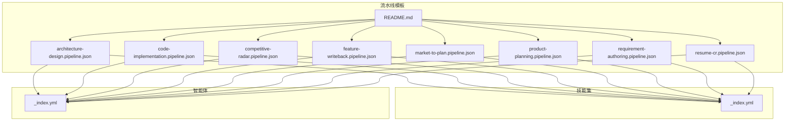
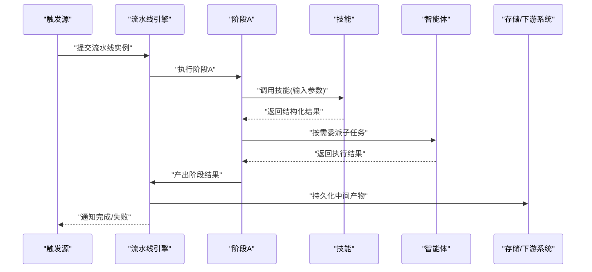
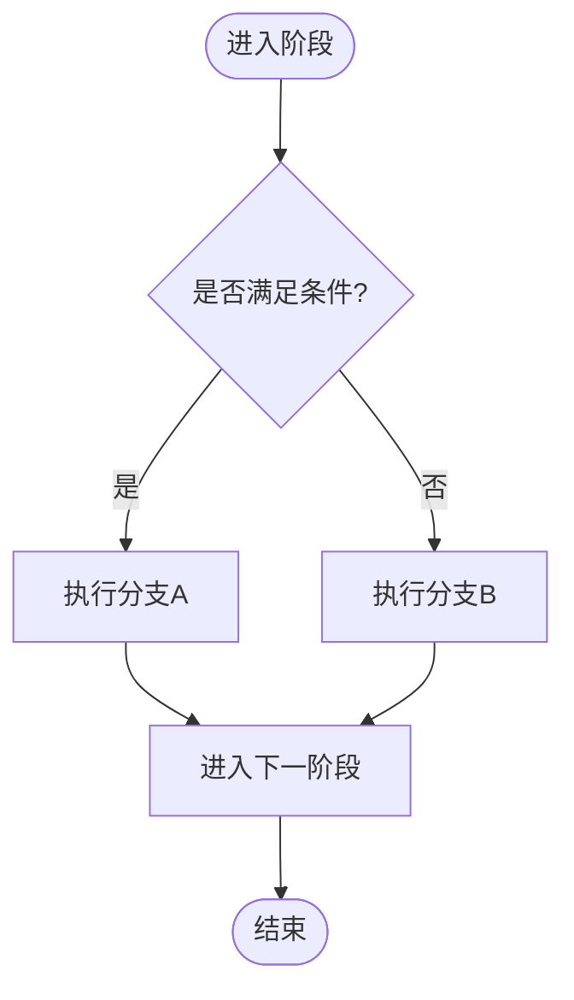
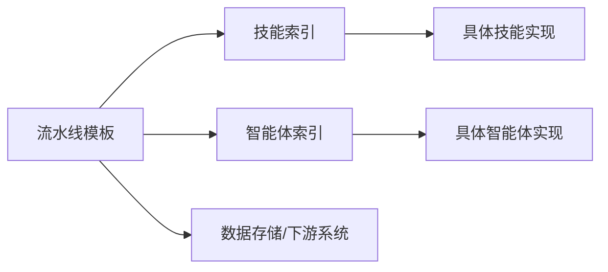

# 自定义流水线开发

<cite>
**本文引用的文件**   
- [pipeline-templates/README.md](file://pipeline-templates/README.md)
- [pipeline-templates/architecture-design.pipeline.json](file://pipeline-templates/architecture-design.pipeline.json)
- [pipeline-templates/code-implementation.pipeline.json](file://pipeline-templates/code-implementation.pipeline.json)
- [pipeline-templates/competitive-radar.pipeline.json](file://pipeline-templates/competitive-radar.pipeline.json)
- [pipeline-templates/feature-writeback.pipeline.json](file://pipeline-templates/feature-writeback.pipeline.json)
- [pipeline-templates/market-to-plan.pipeline.json](file://pipeline-templates/market-to-plan.pipeline.json)
- [pipeline-templates/product-planning.pipeline.json](file://pipeline-templates/product-planning.pipeline.json)
- [pipeline-templates/requirement-authoring.pipeline.json](file://pipeline-templates/requirement-authoring.pipeline.json)
- [pipeline-templates/resume-cr.pipeline.json](file://pipeline-templates/resume-cr.pipeline.json)
- [skills/_index.yml](file://skills/_index.yml)
- [agents/_index.yml](file://agents/_index.yml)
</cite>

## 目录
1. [简介](#简介)
2. [项目结构](#项目结构)
3. [核心组件](#核心组件)
4. [架构总览](#架构总览)
5. [详细组件分析](#详细组件分析)
6. [依赖关系分析](#依赖关系分析)
7. [性能考虑](#性能考虑)
8. [故障排查指南](#故障排查指南)
9. [结论](#结论)
10. [附录](#附录)

## 简介
本指南面向希望基于现有仓库构建“自定义流水线”的开发者。内容覆盖：
- 流水线模板的设计模式与最佳实践
- JSON 配置语法详解（阶段、Agent、技能参数、输入输出）
- 条件分支与循环控制机制
- 新阶段的定义方式、Agent 调用与返回值处理
- 测试方法、调试技巧与性能优化策略
- 错误处理、重试机制与监控告警的配置建议
- 实际案例与可复用的模板参考

## 项目结构
仓库围绕“流水线模板 + 技能 + Agent”的组织方式展开，便于通过声明式 JSON 编排多阶段工作流，并复用领域技能与智能体能力。

图表来源
- [pipeline-templates/README.md](file://pipeline-templates/README.md)
- [pipeline-templates/architecture-design.pipeline.json](file://pipeline-templates/architecture-design.pipeline.json)
- [pipeline-templates/code-implementation.pipeline.json](file://pipeline-templates/code-implementation.pipeline.json)
- [pipeline-templates/competitive-radar.pipeline.json](file://pipeline-templates/competitive-radar.pipeline.json)
- [pipeline-templates/feature-writeback.pipeline.json](file://pipeline-templates/feature-writeback.pipeline.json)
- [pipeline-templates/market-to-plan.pipeline.json](file://pipeline-templates/market-to-plan.pipeline.json)
- [pipeline-templates/product-planning.pipeline.json](file://pipeline-templates/product-planning.pipeline.json)
- [pipeline-templates/requirement-authoring.pipeline.json](file://pipeline-templates/requirement-authoring.pipeline.json)
- [pipeline-templates/resume-cr.pipeline.json](file://pipeline-templates/resume-cr.pipeline.json)
- [skills/_index.yml](file://skills/_index.yml)
- [agents/_index.yml](file://agents/_index.yml)

章节来源
- [pipeline-templates/README.md](file://pipeline-templates/README.md)
- [skills/_index.yml](file://skills/_index.yml)
- [agents/_index.yml](file://agents/_index.yml)

## 核心组件
- 流水线模板（JSON）：以声明式方式描述阶段序列、数据流转、条件分支与循环控制，是自定义流水线的核心载体。
- 技能（SKILL）：按领域划分的可复用能力单元，提供标准化的输入/输出契约，供流水线阶段调用。
- 智能体（Agent）：具备特定角色或能力的执行主体，可在流水线中被调度参与任务。

设计要点
- 阶段原子化：每个阶段聚焦单一职责，输入输出明确，便于组合与复用。
- 数据契约：阶段间通过结构化数据传递，避免隐式状态耦合。
- 可观测性：为关键阶段埋点日志与指标，便于追踪与排障。
- 容错与重试：对易失败的外部调用设置重试与退避策略。
- 可扩展性：新增阶段时优先复用已有技能与智能体，减少重复实现。

章节来源
- [pipeline-templates/README.md](file://pipeline-templates/README.md)

## 架构总览
下图展示了典型自定义流水线的端到端流程：从触发源进入，经条件路由到不同阶段，调用技能与智能体完成数据处理与产出，最终汇聚结果并持久化。

图表来源
- [pipeline-templates/architecture-design.pipeline.json](file://pipeline-templates/architecture-design.pipeline.json)
- [pipeline-templates/code-implementation.pipeline.json](file://pipeline-templates/code-implementation.pipeline.json)
- [pipeline-templates/competitive-radar.pipeline.json](file://pipeline-templates/competitive-radar.pipeline.json)
- [pipeline-templates/feature-writeback.pipeline.json](file://pipeline-templates/feature-writeback.pipeline.json)
- [pipeline-templates/market-to-plan.pipeline.json](file://pipeline-templates/market-to-plan.pipeline.json)
- [pipeline-templates/product-planning.pipeline.json](file://pipeline-templates/product-planning.pipeline.json)
- [pipeline-templates/requirement-authoring.pipeline.json](file://pipeline-templates/requirement-authoring.pipeline.json)
- [pipeline-templates/resume-cr.pipeline.json](file://pipeline-templates/resume-cr.pipeline.json)

## 详细组件分析

### 流水线模板设计与 JSON 配置语法
- 模板组织
  - 每个业务场景对应一个 .pipeline.json 文件，命名体现用途，如“产品规划”、“需求编写”等。
  - README 提供模板说明与使用指引，便于快速上手。
- 阶段定义
  - 阶段通常包含：名称、类型（如“调用技能”、“条件分支”、“循环”）、输入映射、输出绑定、超时与重试策略、可选的 Agent 指派。
  - 输入/输出采用键值映射，确保阶段间数据契约清晰。
- 条件分支
  - 支持基于上游阶段输出字段进行判断，将流程路由至不同分支。
  - 常见用法：根据评审结果、质量阈值、外部系统响应码选择后续路径。
- 循环控制
  - 支持对集合型数据进行迭代处理，可配置最大迭代次数与退出条件。
  - 适用于批量任务、分批写入、逐项校验等场景。
- 参数与变量
  - 支持在阶段中引用全局变量与上游阶段输出，形成表达式求值链。
  - 建议在模板顶部集中声明常用变量，提升可读性与可维护性。
- 错误与重试
  - 为易失败步骤配置重试次数与退避间隔；对不可恢复错误直接短路并上报。
- 监控与日志
  - 为关键阶段记录入参、出参与耗时；为异常路径记录堆栈与上下文。

章节来源
- [pipeline-templates/README.md](file://pipeline-templates/README.md)
- [pipeline-templates/architecture-design.pipeline.json](file://pipeline-templates/architecture-design.pipeline.json)
- [pipeline-templates/code-implementation.pipeline.json](file://pipeline-templates/code-implementation.pipeline.json)
- [pipeline-templates/competitive-radar.pipeline.json](file://pipeline-templates/competitive-radar.pipeline.json)
- [pipeline-templates/feature-writeback.pipeline.json](file://pipeline-templates/feature-writeback.pipeline.json)
- [pipeline-templates/market-to-plan.pipeline.json](file://pipeline-templates/market-to-plan.pipeline.json)
- [pipeline-templates/product-planning.pipeline.json](file://pipeline-templates/product-planning.pipeline.json)
- [pipeline-templates/requirement-authoring.pipeline.json](file://pipeline-templates/requirement-authoring.pipeline.json)
- [pipeline-templates/resume-cr.pipeline.json](file://pipeline-templates/resume-cr.pipeline.json)

### 如何定义新的流水线阶段
- 明确职责与边界
  - 单一职责原则：一个阶段只做一件事，输入输出最小化且稳定。
- 选择执行主体
  - 优先复用现有“技能”，必要时引入“智能体”承担复杂推理或交互任务。
- 定义输入/输出契约
  - 输入：必填字段、可选字段、默认值、取值范围。
  - 输出：标准化结构，包含成功标志、数据载荷、错误信息。
- 配置条件与循环
  - 若存在前置依赖或分支逻辑，使用条件节点；若需批量处理，使用循环节点。
- 错误与重试
  - 区分可重试错误与不可重试错误；为网络/IO 类错误配置指数退避。
- 可观测性
  - 记录阶段开始/结束时间、关键指标与上下文快照，便于定位问题。

章节来源
- [pipeline-templates/README.md](file://pipeline-templates/README.md)

### 配置 Agent 调用与技能参数
- Agent 调用
  - 在阶段中指定目标 Agent，传入必要上下文与约束条件。
  - 对于需要人工介入的阶段，可结合审批与回写机制。
- 技能参数
  - 通过映射表将上游输出注入技能输入；对常量参数在模板中集中管理。
  - 遵循技能的输入校验规则，提前在阶段层做预检查以减少失败率。
- 返回值处理
  - 解析技能返回的结构化数据，提取关键字段并映射到下游阶段输入。
  - 对异常返回进行规范化封装，统一错误码与消息格式。

章节来源
- [skills/_index.yml](file://skills/_index.yml)
- [agents/_index.yml](file://agents/_index.yml)

### 条件分支与循环控制机制
- 条件分支
  - 基于上游输出字段进行布尔判断，支持多路分支与默认分支。
  - 建议为每条分支标注预期条件与兜底策略。
- 循环控制
  - 对数组型数据进行遍历，支持分页/分片处理。
  - 配置最大迭代次数与早停条件，防止无限循环。
- 流程图示例

章节来源
- [pipeline-templates/README.md](file://pipeline-templates/README.md)

### 错误处理、重试机制与监控告警
- 错误分类
  - 可重试错误：网络抖动、限流、临时资源不可用。
  - 不可重试错误：参数非法、权限不足、数据缺失。
- 重试策略
  - 指数退避 + 随机抖动，限制最大重试次数与总时长。
  - 对幂等操作启用重试，非幂等操作需谨慎评估副作用。
- 监控告警
  - 指标：阶段成功率、平均耗时、P95/P99 延迟、错误分布。
  - 告警：错误率突增、长时间阻塞、关键阶段超时。
- 日志规范
  - 结构化日志，包含请求ID、阶段名、入参摘要、出参摘要、耗时与错误码。

章节来源
- [pipeline-templates/README.md](file://pipeline-templates/README.md)

### 测试方法与调试技巧
- 单元测试
  - 针对阶段函数与工具方法进行断言，覆盖正常路径与异常路径。
- 集成测试
  - 使用沙箱环境与 Mock 服务验证端到端流程，包括条件分支与循环。
- 回归测试
  - 对历史模板运行全量用例，确保变更不破坏既有行为。
- 调试技巧
  - 开启详细日志与追踪 ID，定位慢步骤与失败根因。
  - 使用只读模式或 Dry Run 验证配置正确性。
- 性能基线
  - 建立基准数据集，对比优化前后吞吐与时延变化。

章节来源
- [pipeline-templates/README.md](file://pipeline-templates/README.md)

### 性能优化策略
- 并行与批处理
  - 对无依赖阶段并发执行；对批量数据分片并行处理。
- 缓存与去重
  - 对计算密集型或外部查询结果进行缓存；对重复输入进行去重。
- 资源隔离
  - 为高负载阶段分配独立队列与资源池，避免相互影响。
- 超时与熔断
  - 设置合理的阶段超时与熔断阈值，保护整体稳定性。
- 数据局部性
  - 尽量就近读写数据，减少跨域/跨库访问。

章节来源
- [pipeline-templates/README.md](file://pipeline-templates/README.md)

### 实战案例与最佳实践
- 案例一：产品规划流水线
  - 目标：整合市场洞察、竞品分析与用户反馈，生成规划报告。
  - 关键点：多源数据聚合、条件分支（依据数据完备度）、循环（逐条洞察处理）。
- 案例二：需求编写流水线
  - 目标：从原始需求到 PRD 文档的自动化生成与评审。
  - 关键点：模板驱动、版本回溯、评审回写。
- 案例三：代码实现流水线
  - 目标：技术设计到代码落地的自动化推进。
  - 关键点：分支合并、自动化测试、质量门禁。
- 最佳实践
  - 模板分层：通用模板 + 场景特化模板。
  - 契约先行：先定义输入/输出再实现阶段。
  - 渐进演进：小步快跑，持续集成与灰度发布。

章节来源
- [pipeline-templates/product-planning.pipeline.json](file://pipeline-templates/product-planning.pipeline.json)
- [pipeline-templates/requirement-authoring.pipeline.json](file://pipeline-templates/requirement-authoring.pipeline.json)
- [pipeline-templates/code-implementation.pipeline.json](file://pipeline-templates/code-implementation.pipeline.json)

## 依赖关系分析
- 内部依赖
  - 流水线模板依赖技能索引与智能体索引，用于解析可用能力与执行主体。
- 外部依赖
  - 可能涉及外部 API、数据库、对象存储与消息队列，需在阶段层抽象适配。
- 耦合与内聚
  - 阶段之间仅通过数据契约耦合，保持高内聚低耦合。
- 潜在循环依赖
  - 避免阶段间互相引用导致执行顺序不确定，应通过显式数据流连接。

图表来源
- [skills/_index.yml](file://skills/_index.yml)
- [agents/_index.yml](file://agents/_index.yml)
- [pipeline-templates/README.md](file://pipeline-templates/README.md)

章节来源
- [skills/_index.yml](file://skills/_index.yml)
- [agents/_index.yml](file://agents/_index.yml)
- [pipeline-templates/README.md](file://pipeline-templates/README.md)

## 性能考虑
- 合理拆分阶段粒度，避免单阶段过重。
- 利用并发与批处理提升吞吐。
- 引入缓存与去重降低重复成本。
- 设置超时与熔断，保障系统弹性。
- 建立性能基线与回归测试，持续优化。

[本节为通用指导，无需源码引用]

## 故障排查指南
- 常见问题
  - 阶段超时：检查外部依赖延迟与资源配额。
  - 数据缺失：核对上游输出字段与映射关系。
  - 权限错误：确认凭据与访问策略。
  - 循环未终止：检查退出条件与最大迭代次数。
- 定位步骤
  - 查看阶段日志与追踪 ID，定位失败点。
  - 回放输入数据，验证契约一致性。
  - 逐步禁用分支与循环，缩小问题范围。
- 恢复措施
  - 对可重试错误自动重试；对不可重试错误快速失败并告警。
  - 保留中间产物以便离线修复与重放。

章节来源
- [pipeline-templates/README.md](file://pipeline-templates/README.md)

## 结论
通过声明式流水线模板、可复用技能与智能体，团队可以快速构建高质量、可观测、可演进的自动化流程。遵循契约先行、原子化阶段、容错与可观测性等原则，能够在保证稳定性的同时持续提升交付效率。

[本节为总结性内容，无需源码引用]

## 附录
- 术语
  - 流水线：由多个阶段组成的端到端工作流。
  - 阶段：流水线中的最小执行单元。
  - 技能：可复用的领域能力单元。
  - 智能体：具备特定角色的执行主体。
- 参考模板
  - 架构设计、代码实现、竞争雷达、特性回写、市场转规划、产品规划、需求编写、简历 CR 等模板可作为起点。

章节来源
- [pipeline-templates/README.md](file://pipeline-templates/README.md)
- [pipeline-templates/architecture-design.pipeline.json](file://pipeline-templates/architecture-design.pipeline.json)
- [pipeline-templates/code-implementation.pipeline.json](file://pipeline-templates/code-implementation.pipeline.json)
- [pipeline-templates/competitive-radar.pipeline.json](file://pipeline-templates/competitive-radar.pipeline.json)
- [pipeline-templates/feature-writeback.pipeline.json](file://pipeline-templates/feature-writeback.pipeline.json)
- [pipeline-templates/market-to-plan.pipeline.json](file://pipeline-templates/market-to-plan.pipeline.json)
- [pipeline-templates/product-planning.pipeline.json](file://pipeline-templates/product-planning.pipeline.json)
- [pipeline-templates/requirement-authoring.pipeline.json](file://pipeline-templates/requirement-authoring.pipeline.json)
- [pipeline-templates/resume-cr.pipeline.json](file://pipeline-templates/resume-cr.pipeline.json)