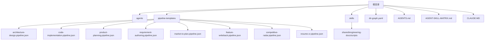
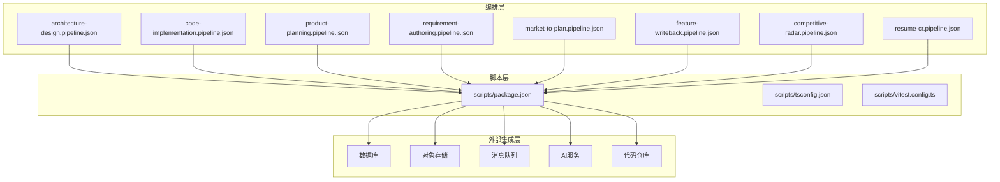
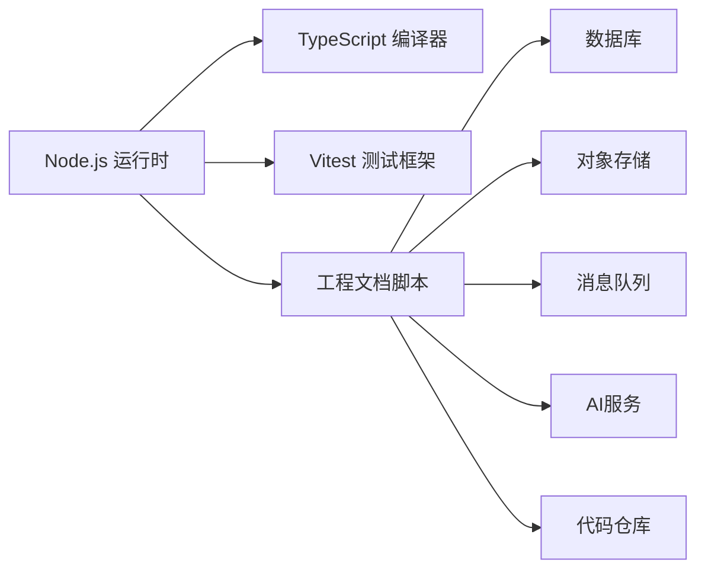

# 部署与运维

<cite>
**本文引用的文件**   
- [CLAUDE.MD](file://CLAUDE.MD)
- [AGENT-SKILL-MATRIX.md](file://AGENT-SKILL-MATRIX.md)
- [AGENTS.md](file://AGENTS.md)
- [dir-graph.yaml](file://dir-graph.yaml)
- [pipeline-templates/README.md](file://pipeline-templates/README.md)
- [pipeline-templates/architecture-design.pipeline.json](file://pipeline-templates/architecture-design.pipeline.json)
- [pipeline-templates/code-implementation.pipeline.json](file://pipeline-templates/code-implementation.pipeline.json)
- [pipeline-templates/competitive-radar.pipeline.json](file://pipeline-templates/competitive-radar.pipeline.json)
- [pipeline-templates/feature-writeback.pipeline.json](file://pipeline-templates/feature-writeback.pipeline.json)
- [pipeline-templates/market-to-plan.pipeline.json](file://pipeline-templates/market-to-plan.pipeline.json)
- [pipeline-templates/product-planning.pipeline.json](file://pipeline-templates/product-planning.pipeline.json)
- [pipeline-templates/requirement-authoring.pipeline.json](file://pipeline-templates/requirement-authoring.pipeline.json)
- [pipeline-templates/resume-cr.pipeline.json](file://pipeline-templates/resume-cr.pipeline.json)
- [skills/shared/engineering-docs/scripts/package.json](file://skills/shared/engineering-docs/scripts/package.json)
- [skills/shared/engineering-docs/scripts/tsconfig.json](file://skills/shared/engineering-docs/scripts/tsconfig.json)
- [skills/shared/engineering-docs/scripts/vitest.config.ts](file://skills/shared/engineering-docs/scripts/vitest.config.ts)
</cite>

## 目录
1. [简介](#简介)
2. [项目结构](#项目结构)
3. [核心组件](#核心组件)
4. [架构总览](#架构总览)
5. [详细组件分析](#详细组件分析)
6. [依赖分析](#依赖分析)
7. [性能考虑](#性能考虑)
8. [故障排查指南](#故障排查指南)
9. [结论](#结论)
10. [附录](#附录)

## 简介
本文件面向部署与运维人员，提供基于当前仓库的“部署与运维”操作文档。仓库以工程化文档与技能（Skills）为主，包含多套流水线模板与脚本工具，用于产品规划、需求编写、技术设计、代码实现与写回等流程。由于仓库未包含应用服务源码或容器编排清单，本文档将围绕现有工件（流水线模板、脚本工具、配置与说明）给出可落地的部署与运维建议，并明确需要补充的外部依赖与环境要求。

## 项目结构
仓库采用“能力/领域 + 模板 + 脚本”的组织方式：
- agents：智能体角色定义与协作关系说明
- pipeline-templates：各业务场景的流水线模板（JSON），描述步骤、输入输出与集成点
- skills：按领域划分的技能集合，其中 shared/engineering-docs/scripts 为工程文档生成与校验的 Node.js 工具集
- dir-graph.yaml：目录结构与依赖关系图
- AGENTS.md、AGENT-SKILL-MATRIX.md、CLAUDE.MD：智能体与技能矩阵说明

图表来源
- [dir-graph.yaml](file://dir-graph.yaml)
- [pipeline-templates/README.md](file://pipeline-templates/README.md)

章节来源
- [dir-graph.yaml](file://dir-graph.yaml)
- [pipeline-templates/README.md](file://pipeline-templates/README.md)

## 核心组件
- 流水线模板（pipeline-templates/*.pipeline.json）：定义端到端工作流，包括阶段、任务、参数、外部集成点与产物路径。适用于自动化执行与版本化管理。
- 工程文档脚本（skills/shared/engineering-docs/scripts）：Node.js 工具集，负责文档生成、校验与测试，提供 CLI 入口与测试框架配置。
- 智能体与技能矩阵（AGENTS.md、AGENT-SKILL-MATRIX.md、CLAUDE.MD）：描述智能体职责、技能映射与协作规则，可作为自动化编排的参考。

章节来源
- [pipeline-templates/README.md](file://pipeline-templates/README.md)
- [skills/shared/engineering-docs/scripts/package.json](file://skills/shared/engineering-docs/scripts/package.json)
- [skills/shared/engineering-docs/scripts/tsconfig.json](file://skills/shared/engineering-docs/scripts/tsconfig.json)
- [skills/shared/engineering-docs/scripts/vitest.config.ts](file://skills/shared/engineering-docs/scripts/vitest.config.ts)
- [AGENTS.md](file://AGENTS.md)
- [AGENT-SKILL-MATRIX.md](file://AGENT-SKILL-MATRIX.md)
- [CLAUDE.MD](file://CLAUDE.MD)

## 架构总览
从运维视角，系统由“流水线编排层 + 工程文档脚本层 + 外部集成层”构成。流水线模板驱动执行顺序与数据流转；脚本层提供本地或CI环境中的构建与验证能力；外部集成层通过环境变量与凭据管理对接数据库、对象存储、消息队列、AI服务等。

图表来源
- [pipeline-templates/architecture-design.pipeline.json](file://pipeline-templates/architecture-design.pipeline.json)
- [pipeline-templates/code-implementation.pipeline.json](file://pipeline-templates/code-implementation.pipeline.json)
- [pipeline-templates/product-planning.pipeline.json](file://pipeline-templates/product-planning.pipeline.json)
- [pipeline-templates/requirement-authoring.pipeline.json](file://pipeline-templates/requirement-authoring.pipeline.json)
- [pipeline-templates/market-to-plan.pipeline.json](file://pipeline-templates/market-to-plan.pipeline.json)
- [pipeline-templates/feature-writeback.pipeline.json](file://pipeline-templates/feature-writeback.pipeline.json)
- [pipeline-templates/competitive-radar.pipeline.json](file://pipeline-templates/competitive-radar.pipeline.json)
- [pipeline-templates/resume-cr.pipeline.json](file://pipeline-templates/resume-cr.pipeline.json)
- [skills/shared/engineering-docs/scripts/package.json](file://skills/shared/engineering-docs/scripts/package.json)
- [skills/shared/engineering-docs/scripts/tsconfig.json](file://skills/shared/engineering-docs/scripts/tsconfig.json)
- [skills/shared/engineering-docs/scripts/vitest.config.ts](file://skills/shared/engineering-docs/scripts/vitest.config.ts)

## 详细组件分析

### 流水线模板组件
- 作用：定义端到端流程的阶段、任务、参数、输入输出与集成点，便于在CI/CD中复用与版本化。
- 关键要素：
  - 阶段划分：准备、生成、校验、发布等
  - 任务定义：命令、环境变量、依赖、重试策略
  - 集成点：数据库、对象存储、消息队列、AI服务、代码仓库
  - 产物与日志：标准化输出路径与日志格式
- 使用建议：
  - 将敏感信息通过环境变量注入，避免硬编码
  - 为每个模板维护最小权限凭据与访问白名单
  - 对关键步骤增加幂等与重试逻辑

章节来源
- [pipeline-templates/README.md](file://pipeline-templates/README.md)
- [pipeline-templates/architecture-design.pipeline.json](file://pipeline-templates/architecture-design.pipeline.json)
- [pipeline-templates/code-implementation.pipeline.json](file://pipeline-templates/code-implementation.pipeline.json)
- [pipeline-templates/product-planning.pipeline.json](file://pipeline-templates/product-planning.pipeline.json)
- [pipeline-templates/requirement-authoring.pipeline.json](file://pipeline-templates/requirement-authoring.pipeline.json)
- [pipeline-templates/market-to-plan.pipeline.json](file://pipeline-templates/market-to-plan.pipeline.json)
- [pipeline-templates/feature-writeback.pipeline.json](file://pipeline-templates/feature-writeback.pipeline.json)
- [pipeline-templates/competitive-radar.pipeline.json](file://pipeline-templates/competitive-radar.pipeline.json)
- [pipeline-templates/resume-cr.pipeline.json](file://pipeline-templates/resume-cr.pipeline.json)

### 工程文档脚本组件
- 作用：提供工程文档的生成、校验与测试能力，支持CLI调用与单元测试。
- 关键要素：
  - package.json：声明依赖、脚本命令与入口
  - tsconfig.json：TypeScript编译选项与模块解析
  - vitest.config.ts：测试框架配置与运行参数
- 使用建议：
  - 在CI中统一安装依赖并执行构建与测试
  - 将生成的产物与校验报告归档到对象存储
  - 通过环境变量控制不同环境的配置差异

章节来源
- [skills/shared/engineering-docs/scripts/package.json](file://skills/shared/engineering-docs/scripts/package.json)
- [skills/shared/engineering-docs/scripts/tsconfig.json](file://skills/shared/engineering-docs/scripts/tsconfig.json)
- [skills/shared/engineering-docs/scripts/vitest.config.ts](file://skills/shared/engineering-docs/scripts/vitest.config.ts)

### 智能体与技能矩阵组件
- 作用：定义智能体角色、技能映射与协作规则，作为编排与自动化的参考依据。
- 使用建议：
  - 将智能体行为与流水线模板进行对齐，确保职责清晰
  - 在变更时同步更新矩阵与模板，保持一致性

章节来源
- [AGENTS.md](file://AGENTS.md)
- [AGENT-SKILL-MATRIX.md](file://AGENT-SKILL-MATRIX.md)
- [CLAUDE.MD](file://CLAUDE.MD)

## 依赖分析
- 运行时依赖：
  - Node.js：用于执行工程文档脚本与相关工具链
  - TypeScript 编译器：根据 tsconfig.json 进行类型检查与构建
  - Vitest：执行单元测试与覆盖率收集
- 外部依赖：
  - 数据库：连接字符串、认证凭据、网络可达性
  - 对象存储：Bucket、AccessKey/SecretKey、区域与域名
  - 消息队列：Broker地址、Topic/Queue名称、认证
  - AI服务：API密钥、模型选择、速率限制
  - 代码仓库：SSH/Token、分支与标签策略

图表来源
- [skills/shared/engineering-docs/scripts/package.json](file://skills/shared/engineering-docs/scripts/package.json)
- [skills/shared/engineering-docs/scripts/tsconfig.json](file://skills/shared/engineering-docs/scripts/tsconfig.json)
- [skills/shared/engineering-docs/scripts/vitest.config.ts](file://skills/shared/engineering-docs/scripts/vitest.config.ts)

章节来源
- [skills/shared/engineering-docs/scripts/package.json](file://skills/shared/engineering-docs/scripts/package.json)
- [skills/shared/engineering-docs/scripts/tsconfig.json](file://skills/shared/engineering-docs/scripts/tsconfig.json)
- [skills/shared/engineering-docs/scripts/vitest.config.ts](file://skills/shared/engineering-docs/scripts/vitest.config.ts)

## 性能考虑
- 流水线优化：
  - 并行执行独立任务，减少整体耗时
  - 缓存依赖与中间产物，降低重复计算
  - 合理设置超时与重试，避免长尾阻塞
- 脚本优化：
  - 增量构建与按需校验，避免全量扫描
  - 控制并发度，避免资源争用
  - 使用结构化日志，便于定位瓶颈
- 外部服务：
  - 连接池与限流，防止雪崩
  - 指标上报与慢查询告警
  - 降级与熔断策略，保障核心链路

[本节为通用指导，不直接分析具体文件]

## 故障排查指南
- 常见问题定位：
  - 依赖安装失败：检查Node.js版本与包管理器锁定文件一致性
  - 构建失败：核对tsconfig与vitest配置，确认模块解析路径
  - 外部集成错误：验证环境变量、网络连通性与凭据有效性
  - 流水线中断：查看阶段日志、重试次数与退出码
- 诊断手段：
  - 启用详细日志与TraceID，关联跨阶段问题
  - 采集关键指标（CPU、内存、I/O、网络）
  - 对关键步骤增加断言与快照对比
- 恢复策略：
  - 幂等重跑与断点续跑
  - 快速回滚至上一稳定版本
  - 隔离故障节点与流量切换

章节来源
- [pipeline-templates/README.md](file://pipeline-templates/README.md)
- [skills/shared/engineering-docs/scripts/vitest.config.ts](file://skills/shared/engineering-docs/scripts/vitest.config.ts)

## 结论
本仓库以流水线模板与工程文档脚本为核心，结合智能体与技能矩阵形成可编排、可验证的工程化体系。运维侧应重点关注环境依赖、凭据管理、监控告警与备份恢复，并通过CI/CD实现一致性与可追溯性。建议在后续迭代中补充容器编排清单与应用服务源码，以便进一步完善云原生部署方案。

[本节为总结性内容，不直接分析具体文件]

## 附录

### 环境与依赖要求
- Node.js：建议使用LTS版本，确保与package.json与锁定文件兼容
- 包管理器：pnpm/npm/yarn均可，需与锁定文件一致
- 操作系统：Linux/macOS/Windows均可，CI推荐Linux镜像
- 外部服务：数据库、对象存储、消息队列、AI服务、代码仓库需具备网络可达性与正确凭据

章节来源
- [skills/shared/engineering-docs/scripts/package.json](file://skills/shared/engineering-docs/scripts/package.json)

### 安装与初始化步骤
- 克隆仓库并进入工程文档脚本目录
- 安装依赖并执行构建与测试
- 配置环境变量（数据库、对象存储、消息队列、AI服务、代码仓库）
- 在CI中引入流水线模板，配置凭据与缓存策略
- 首次运行模板，验证产物与日志是否符合预期

章节来源
- [pipeline-templates/README.md](file://pipeline-templates/README.md)
- [skills/shared/engineering-docs/scripts/package.json](file://skills/shared/engineering-docs/scripts/package.json)

### 监控与日志收集
- 指标：流水线执行时长、成功率、重试率、资源使用率
- 日志：结构化输出、统一时间戳、TraceID贯穿
- 告警：失败阈值、慢任务、外部服务异常
- 追踪：关键步骤埋点与快照对比

章节来源
- [pipeline-templates/README.md](file://pipeline-templates/README.md)

### 备份与恢复
- 数据备份：数据库定期快照、对象存储版本化与跨区域复制
- 配置备份：环境变量与模板版本化保存
- 恢复演练：定期演练RTO/RPO目标，验证恢复流程
- 灾难恢复：多可用区部署、流量切换与灰度发布

[本节为通用指导，不直接分析具体文件]

### 容器化与云原生最佳实践
- 容器化：
  - 使用多阶段构建，减小镜像体积
  - 非root用户运行，最小权限原则
  - 健康检查与探针配置
- 编排：
  - 使用Deployment/StatefulSet管理无状态/有状态服务
  - 配置HPA与资源配额，弹性伸缩
  - 使用ConfigMap/Secret管理配置与凭据
- 可观测性：
  - 接入APM与日志聚合平台
  - 统一指标导出与告警规则
  - 分布式追踪与链路分析

[本节为通用指导，不直接分析具体文件]