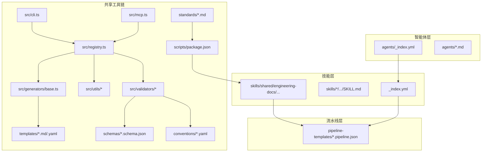
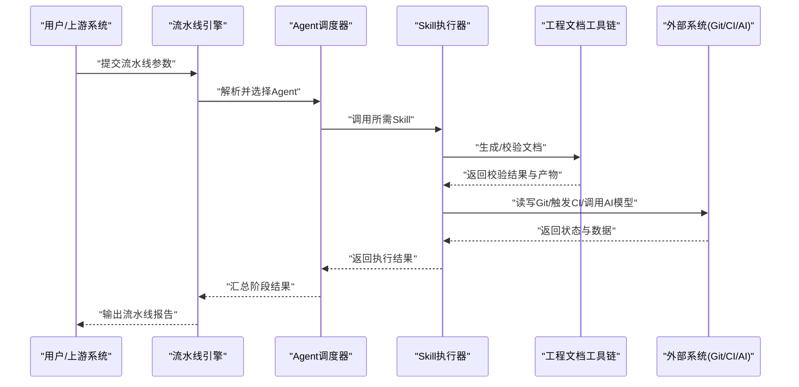
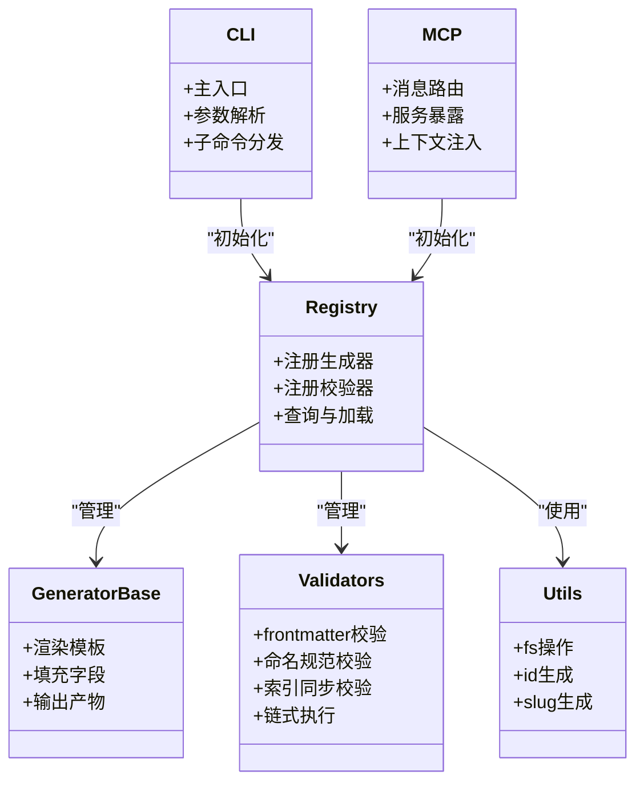
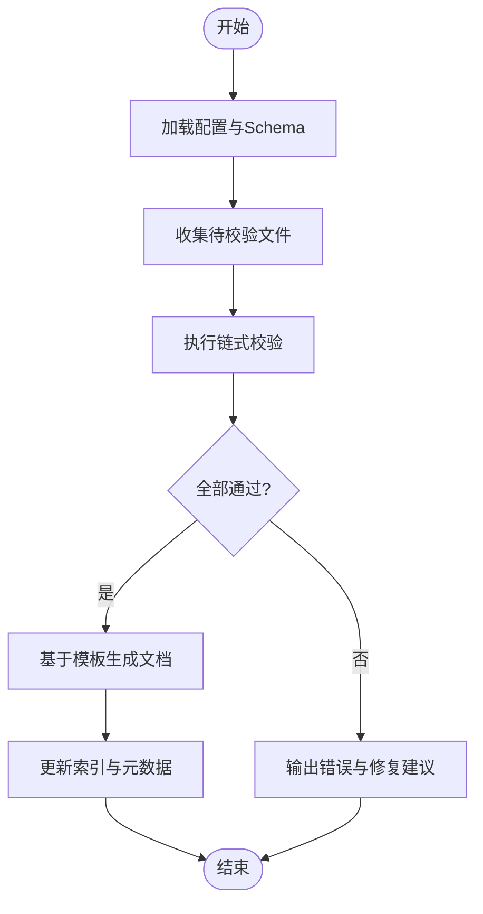
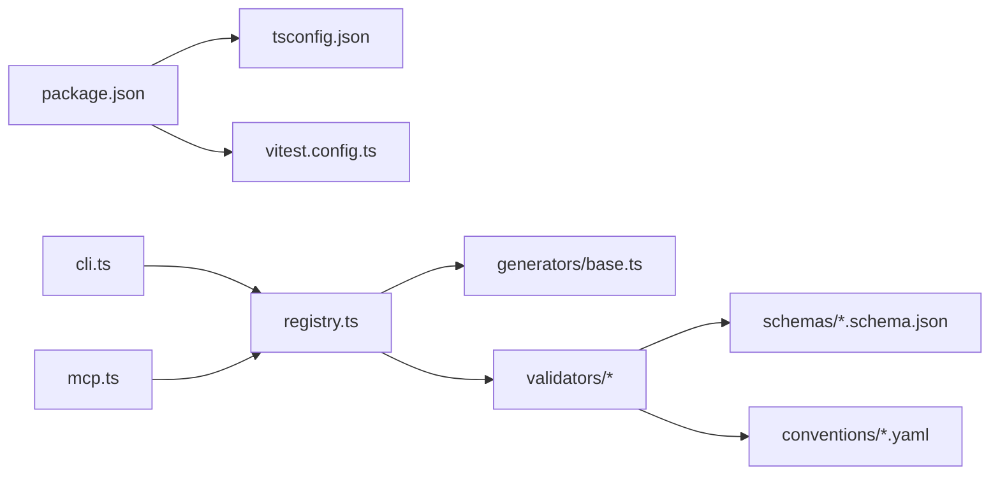

# 集成与扩展指南

<cite>
**本文引用的文件**   
- [agents/_index.yml](file://agents/_index.yml)
- [skills/_index.yml](file://skills/_index.yml)
- [pipeline-templates/README.md](file://pipeline-templates/README.md)
- [pipeline-templates/architecture-design.pipeline.json](file://pipeline-templates/architecture-design.pipeline.json)
- [pipeline-templates/code-implementation.pipeline.json](file://pipeline-templates/code-implementation.pipeline.json)
- [pipeline-templates/competitive-radar.pipeline.json](file://pipeline-templates/competitive-radar.pipeline.json)
- [pipeline-templates/feature-writeback.pipeline.json](file://pipeline-templates/feature-writeback.pipeline.json)
- [pipeline-templates/market-to-plan.pipeline.json](file://pipeline-templates/market-to-plan.pipeline.json)
- [pipeline-templates/product-planning.pipeline.json](file://pipeline-templates/product-planning.pipeline.json)
- [pipeline-templates/requirement-authoring.pipeline.json](file://pipeline-templates/requirement-authoring.pipeline.json)
- [pipeline-templates/resume-cr.pipeline.json](file://pipeline-templates/resume-cr.pipeline.json)
- [skills/shared/engineering-docs/scripts/package.json](file://skills/shared/engineering-docs/scripts/package.json)
- [skills/shared/engineering-docs/scripts/tsconfig.json](file://skills/shared/engineering-docs/scripts/tsconfig.json)
- [skills/shared/engineering-docs/scripts/vitest.config.ts](file://skills/shared/engineering-docs/scripts/vitest.config.ts)
- [skills/shared/engineering-docs/scripts/src/cli.ts](file://skills/shared/engineering-docs/scripts/src/cli.ts)
- [skills/shared/engineering-docs/scripts/src/mcp.ts](file://skills/shared/engineering-docs/scripts/src/mcp.ts)
- [skills/shared/engineering-docs/scripts/src/registry.ts](file://skills/shared/engineering-docs/scripts/src/registry.ts)
- [skills/shared/engineering-docs/scripts/src/generators/base.ts](file://skills/shared/engineering-docs/scripts/src/generators/base.ts)
- [skills/shared/engineering-docs/scripts/src/utils/fs.ts](file://skills/shared/engineering-docs/scripts/src/utils/fs.ts)
- [skills/shared/engineering-docs/scripts/src/utils/id.ts](file://skills/shared/engineering-docs/scripts/src/utils/id.ts)
- [skills/shared/engineering-docs/scripts/src/utils/slug.ts](file://skills/shared/engineering-docs/scripts/src/utils/slug.ts)
- [skills/shared/engineering-docs/scripts/src/validators/index-sync.ts](file://skills/shared/engineering-docs/scripts/src/validators/index-sync.ts)
- [skills/shared/engineering-docs/scripts/src/validators/naming.ts](file://skills/shared/engineering-docs/scripts/src/validators/naming.ts)
- [skills/shared/engineering-docs/scripts/src/validators/frontmatter.ts](file://skills/shared/engineering-docs/scripts/src/validators/frontmatter.ts)
- [skills/shared/engineering-docs/scripts/src/validators/chain.ts](file://skills/shared/engineering-docs/scripts/src/validators/chain.ts)
- [skills/shared/engineering-docs/scripts/src/__tests__/chain.test.ts](file://skills/shared/engineering-docs/scripts/src/__tests__/chain.test.ts)
- [skills/shared/engineering-docs/scripts/src/__tests__/generators.test.ts](file://skills/shared/engineering-docs/scripts/src/__tests__/generators.test.ts)
- [skills/shared/engineering-docs/scripts/src/__tests__/validators.test.ts](file://skills/shared/engineering-docs/scripts/src/__tests__/validators.test.ts)
- [skills/shared/engineering-docs/schemas/common-defs.schema.json](file://skills/shared/engineering-docs/schemas/common-defs.schema.json)
- [skills/shared/engineering-docs/schemas/form.schema.json](file://skills/shared/engineering-docs/schemas/form.schema.json)
- [skills/shared/engineering-docs/schemas/module.schema.json](file://skills/shared/engineering-docs/schemas/module.schema.json)
- [skills/shared/engineering-docs/schemas/plan.schema.json](file://skills/shared/engineering-docs/schemas/plan.schema.json)
- [skills/shared/engineering-docs/schemas/prd.schema.json](file://skills/shared/engineering-docs/schemas/prd.schema.json)
- [skills/shared/engineering-docs/schemas/release.schema.json](file://skills/shared/engineering-docs/schemas/release.schema.json)
- [skills/shared/engineering-docs/schemas/sdd.schema.json](file://skills/shared/engineering-docs/schemas/sdd.schema.json)
- [skills/shared/engineering-docs/schemas/task.schema.json](file://skills/shared/engineering-docs/schemas/task.schema.json)
- [skills/shared/engineering-docs/templates/PLAN-template.md](file://skills/shared/engineering-docs/templates/PLAN-template.md)
- [skills/shared/engineering-docs/templates/PRD-template.md](file://skills/shared/engineering-docs/templates/PRD-template.md)
- [skills/shared/engineering-docs/templates/SDD-template.md](file://skills/shared/engineering-docs/templates/SDD-template.md)
- [skills/shared/engineering-docs/templates/TASK-template.md](file://skills/shared/engineering-docs/templates/TASK-template.md)
- [skills/shared/engineering-docs/templates/RELEASE-template.md](file://skills/shared/engineering-docs/templates/RELEASE-template.md)
- [skills/shared/engineering-docs/templates/MODULE-template.md](file://skills/shared/engineering-docs/templates/MODULE-template.md)
- [skills/shared/engineering-docs/templates/FORM-template.yaml](file://skills/shared/engineering-docs/templates/FORM-template.yaml)
- [skills/shared/engineering-docs/templates/OpenAPI-template.yaml](file://skills/shared/engineering-docs/templates/OpenAPI-template.yaml)
- [skills/shared/engineering-docs/conventions/doc-chain.yaml](file://skills/shared/engineering-docs/conventions/doc-chain.yaml)
- [skills/shared/engineering-docs/conventions/naming.yaml](file://skills/shared/engineering-docs/conventions/naming.yaml)
- [skills/shared/engineering-docs/standards/ENGINEERING-STRUCTURE-TEAM.md](file://skills/shared/engineering-docs/standards/ENGINEERING-STRUCTURE-TEAM.md)
- [skills/shared/engineering-docs/SKILL.md](file://skills/shared/engineering-docs/SKILL.md)
- [AGENT-SKILL-MATRIX.md](file://AGENT-SKILL-MATRIX.md)
- [dir-graph.yaml](file://dir-graph.yaml)
</cite>

## 目录
1. [简介](#简介)
2. [项目结构](#项目结构)
3. [核心组件](#核心组件)
4. [架构总览](#架构总览)
5. [详细组件分析](#详细组件分析)
6. [依赖分析](#依赖分析)
7. [性能考虑](#性能考虑)
8. [故障排查指南](#故障排查指南)
9. [结论](#结论)
10. [附录](#附录)

## 简介
本指南面向希望集成和扩展该AI工具集的用户与开发者，重点说明系统的插件化架构与扩展机制，包括如何添加自定义Agent、Skill与Pipeline；如何对接第三方系统（如Git、CI/CD、外部AI模型）；并提供完整的开发环境搭建、测试策略、代码规范与发布流程建议。同时涵盖依赖管理与版本兼容性、升级路径、实际集成案例与最佳实践、常见问题排查与监控方案。

## 项目结构
仓库采用“能力即文档”的组织方式：
- agents：以Markdown描述不同角色型Agent的职责与行为约定，配合索引文件进行注册与发现。
- skills：按领域划分的可复用技能集合，每个技能包含SKILL.md等元数据与可选脚本/模板/校验规则。
- pipeline-templates：预置的流水线模板，用于编排多步骤工作流，驱动Agent与Skill协同完成端到端任务。
- shared工程文档工具链：提供文档生成、校验、命名与索引同步等通用能力，支持CLI与MCP两种运行模式。

图表来源
- [agents/_index.yml](file://agents/_index.yml)
- [skills/_index.yml](file://skills/_index.yml)
- [pipeline-templates/README.md](file://pipeline-templates/README.md)
- [skills/shared/engineering-docs/scripts/package.json](file://skills/shared/engineering-docs/scripts/package.json)
- [skills/shared/engineering-docs/scripts/src/cli.ts](file://skills/shared/engineering-docs/scripts/src/cli.ts)
- [skills/shared/engineering-docs/scripts/src/mcp.ts](file://skills/shared/engineering-docs/scripts/src/mcp.ts)
- [skills/shared/engineering-docs/scripts/src/registry.ts](file://skills/shared/engineering-docs/scripts/src/registry.ts)
- [skills/shared/engineering-docs/scripts/src/generators/base.ts](file://skills/shared/engineering-docs/scripts/src/generators/base.ts)
- [skills/shared/engineering-docs/scripts/src/utils/fs.ts](file://skills/shared/engineering-docs/scripts/src/utils/fs.ts)
- [skills/shared/engineering-docs/scripts/src/utils/id.ts](file://skills/shared/engineering-docs/scripts/src/utils/id.ts)
- [skills/shared/engineering-docs/scripts/src/utils/slug.ts](file://skills/shared/engineering-docs/scripts/src/utils/slug.ts)
- [skills/shared/engineering-docs/scripts/src/validators/index-sync.ts](file://skills/shared/engineering-docs/scripts/src/validators/index-sync.ts)
- [skills/shared/engineering-docs/scripts/src/validators/naming.ts](file://skills/shared/engineering-docs/scripts/src/validators/naming.ts)
- [skills/shared/engineering-docs/scripts/src/validators/frontmatter.ts](file://skills/shared/engineering-docs/scripts/src/validators/frontmatter.ts)
- [skills/shared/engineering-docs/scripts/src/validators/chain.ts](file://skills/shared/engineering-docs/scripts/src/validators/chain.ts)
- [skills/shared/engineering-docs/schemas/*.schema.json](file://skills/shared/engineering-docs/schemas/common-defs.schema.json)
- [skills/shared/engineering-docs/templates/*.md](file://skills/shared/engineering-docs/templates/PLAN-template.md)
- [skills/shared/engineering-docs/conventions/*.yaml](file://skills/shared/engineering-docs/conventions/doc-chain.yaml)
- [skills/shared/engineering-docs/standards/*.md](file://skills/shared/engineering-docs/standards/ENGINEERING-STRUCTURE-TEAM.md)

章节来源
- [agents/_index.yml](file://agents/_index.yml)
- [skills/_index.yml](file://skills/_index.yml)
- [pipeline-templates/README.md](file://pipeline-templates/README.md)
- [dir-graph.yaml](file://dir-graph.yaml)

## 核心组件
- Agent定义与注册
  - 通过agents/_index.yml集中声明可用Agent，各Agent的具体职责与约束在对应Markdown中描述。
  - 新增Agent时，需在索引中登记并完善行为契约，确保被流水线或上层编排正确识别。
- Skill定义与组合
  - 每个技能位于独立目录，包含SKILL.md作为入口契约，必要时附带脚本、模板、校验规则与示例。
  - 通过skills/_index.yml进行全局索引，便于统一发现与检索。
- Pipeline模板
  - 使用*.pipeline.json描述端到端流程，串联多个Agent与Skill，形成可复用的自动化流水线。
  - README提供模板使用说明与适配要点。
- 共享工程文档工具链
  - CLI与MCP双入口，提供文档生成、校验、命名与索引同步等能力。
  - 基于Schema与Conventions对产物进行强约束，保障一致性。

章节来源
- [agents/_index.yml](file://agents/_index.yml)
- [skills/_index.yml](file://skills/_index.yml)
- [pipeline-templates/README.md](file://pipeline-templates/README.md)
- [skills/shared/engineering-docs/scripts/src/cli.ts](file://skills/shared/engineering-docs/scripts/src/cli.ts)
- [skills/shared/engineering-docs/scripts/src/mcp.ts](file://skills/shared/engineering-docs/scripts/src/mcp.ts)
- [skills/shared/engineering-docs/scripts/src/registry.ts](file://skills/shared/engineering-docs/scripts/src/registry.ts)

## 架构总览
系统采用“Agent + Skill + Pipeline”的分层解耦架构：
- 顶层由Pipeline模板编排，按需调用Agent与Skill。
- Agent负责角色化决策与任务拆解，Skill封装具体执行逻辑与产出物。
- 共享工具链为文档类Skill提供统一的生成、校验与治理基础设施。

图表来源
- [pipeline-templates/README.md](file://pipeline-templates/README.md)
- [skills/shared/engineering-docs/scripts/src/cli.ts](file://skills/shared/engineering-docs/scripts/src/cli.ts)
- [skills/shared/engineering-docs/scripts/src/mcp.ts](file://skills/shared/engineering-docs/scripts/src/mcp.ts)
- [skills/shared/engineering-docs/scripts/src/registry.ts](file://skills/shared/engineering-docs/scripts/src/registry.ts)

## 详细组件分析

### 自定义Agent开发指南
- 目标
  - 明确Agent的角色边界、输入输出契约、依赖Skill清单与异常处理策略。
- 步骤
  - 在agents目录下新增Agent Markdown文件，描述职责、前置条件、后置动作与失败回退。
  - 在agents/_index.yml中登记新Agent，确保名称、版本与依赖关系清晰。
  - 在相关Pipeline模板中引用新Agent，验证端到端流程。
- 最佳实践
  - 将复杂决策拆分为多个细粒度Skill，保持Agent轻量。
  - 为Agent定义明确的错误码与重试策略，便于流水线级容错。

章节来源
- [agents/_index.yml](file://agents/_index.yml)
- [pipeline-templates/README.md](file://pipeline-templates/README.md)

### 自定义Skill开发指南
- 目标
  - 封装可复用的业务能力，提供清晰的SKILL.md契约与必要的脚本/模板/校验。
- 步骤
  - 在skills下新建目录，编写SKILL.md描述输入、输出、依赖与环境要求。
  - 如需自动化能力，可在同目录放置脚本与配置，并在SKILL.md中声明执行命令。
  - 在skills/_index.yml中登记新Skill，保证可被发现。
- 校验与模板
  - 使用shared工程文档工具链的Schema与Conventions对产物进行强约束。
  - 利用模板快速生成标准化文档，减少手工差异。
- 测试
  - 参考现有单元测试组织方式，覆盖关键分支与边界条件。

章节来源
- [skills/_index.yml](file://skills/_index.yml)
- [skills/shared/engineering-docs/scripts/package.json](file://skills/shared/engineering-docs/scripts/package.json)
- [skills/shared/engineering-docs/scripts/tsconfig.json](file://skills/shared/engineering-docs/scripts/tsconfig.json)
- [skills/shared/engineering-docs/scripts/vitest.config.ts](file://skills/shared/engineering-docs/scripts/vitest.config.ts)
- [skills/shared/engineering-docs/scripts/src/__tests__/chain.test.ts](file://skills/shared/engineering-docs/scripts/src/__tests__/chain.test.ts)
- [skills/shared/engineering-docs/scripts/src/__tests__/generators.test.ts](file://skills/shared/engineering-docs/scripts/src/__tests__/generators.test.ts)
- [skills/shared/engineering-docs/scripts/src/__tests__/validators.test.ts](file://skills/shared/engineering-docs/scripts/src/__tests__/validators.test.ts)

### 自定义Pipeline模板开发指南
- 目标
  - 将多个Agent与Skill编排成可复用的端到端流程，支持参数化与条件分支。
- 步骤
  - 在pipeline-templates下新增*.pipeline.json，定义阶段、节点、依赖与参数。
  - 在README中补充使用示例与注意事项。
  - 结合共享工具链对产物进行校验与归档。
- 典型场景
  - 需求到设计再到实现的端到端流水线。
  - 竞品分析与规划落地的闭环流水线。
  - 特性分支合并与追溯写回的自动化流水线。

章节来源
- [pipeline-templates/README.md](file://pipeline-templates/README.md)
- [pipeline-templates/architecture-design.pipeline.json](file://pipeline-templates/architecture-design.pipeline.json)
- [pipeline-templates/code-implementation.pipeline.json](file://pipeline-templates/code-implementation.pipeline.json)
- [pipeline-templates/competitive-radar.pipeline.json](file://pipeline-templates/competitive-radar.pipeline.json)
- [pipeline-templates/feature-writeback.pipeline.json](file://pipeline-templates/feature-writeback.pipeline.json)
- [pipeline-templates/market-to-plan.pipeline.json](file://pipeline-templates/market-to-plan.pipeline.json)
- [pipeline-templates/product-planning.pipeline.json](file://pipeline-templates/product-planning.pipeline.json)
- [pipeline-templates/requirement-authoring.pipeline.json](file://pipeline-templates/requirement-authoring.pipeline.json)
- [pipeline-templates/resume-cr.pipeline.json](file://pipeline-templates/resume-cr.pipeline.json)

### 共享工程文档工具链分析
- 入口与模式
  - CLI模式：命令行直接调用，适合本地开发与CI集成。
  - MCP模式：通过消息通信协议接入，适合与Agent或外部系统交互。
- 核心模块
  - 注册中心：统一管理生成器、校验器与工具函数。
  - 生成器：基于模板与Schema生成结构化文档。
  - 校验器：基于Schema与约定进行一致性检查，支持链式校验。
  - 工具库：文件系统、ID与Slug生成等基础能力。
- 测试与质量
  - 使用Vitest组织测试用例，覆盖生成器、校验链与索引同步等关键路径。
  - 通过tsconfig与package.json管理构建与依赖。

图表来源
- [skills/shared/engineering-docs/scripts/src/cli.ts](file://skills/shared/engineering-docs/scripts/src/cli.ts)
- [skills/shared/engineering-docs/scripts/src/mcp.ts](file://skills/shared/engineering-docs/scripts/src/mcp.ts)
- [skills/shared/engineering-docs/scripts/src/registry.ts](file://skills/shared/engineering-docs/scripts/src/registry.ts)
- [skills/shared/engineering-docs/scripts/src/generators/base.ts](file://skills/shared/engineering-docs/scripts/src/generators/base.ts)
- [skills/shared/engineering-docs/scripts/src/validators/frontmatter.ts](file://skills/shared/engineering-docs/scripts/src/validators/frontmatter.ts)
- [skills/shared/engineering-docs/scripts/src/validators/naming.ts](file://skills/shared/engineering-docs/scripts/src/validators/naming.ts)
- [skills/shared/engineering-docs/scripts/src/validators/index-sync.ts](file://skills/shared/engineering-docs/scripts/src/validators/index-sync.ts)
- [skills/shared/engineering-docs/scripts/src/validators/chain.ts](file://skills/shared/engineering-docs/scripts/src/validators/chain.ts)
- [skills/shared/engineering-docs/scripts/src/utils/fs.ts](file://skills/shared/engineering-docs/scripts/src/utils/fs.ts)
- [skills/shared/engineering-docs/scripts/src/utils/id.ts](file://skills/shared/engineering-docs/scripts/src/utils/id.ts)
- [skills/shared/engineering-docs/scripts/src/utils/slug.ts](file://skills/shared/engineering-docs/scripts/src/utils/slug.ts)

章节来源
- [skills/shared/engineering-docs/scripts/src/cli.ts](file://skills/shared/engineering-docs/scripts/src/cli.ts)
- [skills/shared/engineering-docs/scripts/src/mcp.ts](file://skills/shared/engineering-docs/scripts/src/mcp.ts)
- [skills/shared/engineering-docs/scripts/src/registry.ts](file://skills/shared/engineering-docs/scripts/src/registry.ts)
- [skills/shared/engineering-docs/scripts/src/generators/base.ts](file://skills/shared/engineering-docs/scripts/src/generators/base.ts)
- [skills/shared/engineering-docs/scripts/src/validators/chain.ts](file://skills/shared/engineering-docs/scripts/src/validators/chain.ts)
- [skills/shared/engineering-docs/scripts/src/utils/fs.ts](file://skills/shared/engineering-docs/scripts/src/utils/fs.ts)
- [skills/shared/engineering-docs/scripts/src/utils/id.ts](file://skills/shared/engineering-docs/scripts/src/utils/id.ts)
- [skills/shared/engineering-docs/scripts/src/utils/slug.ts](file://skills/shared/engineering-docs/scripts/src/utils/slug.ts)

### 文档校验与生成流程（算法视角）

图表来源
- [skills/shared/engineering-docs/scripts/src/validators/chain.ts](file://skills/shared/engineering-docs/scripts/src/validators/chain.ts)
- [skills/shared/engineering-docs/scripts/src/validators/frontmatter.ts](file://skills/shared/engineering-docs/scripts/src/validators/frontmatter.ts)
- [skills/shared/engineering-docs/scripts/src/validators/naming.ts](file://skills/shared/engineering-docs/scripts/src/validators/naming.ts)
- [skills/shared/engineering-docs/scripts/src/validators/index-sync.ts](file://skills/shared/engineering-docs/scripts/src/validators/index-sync.ts)
- [skills/shared/engineering-docs/scripts/src/generators/base.ts](file://skills/shared/engineering-docs/scripts/src/generators/base.ts)

## 依赖分析
- 运行时依赖
  - Node.js与包管理器：由package.json声明，建议使用稳定LTS版本。
  - TypeScript编译与测试：tsconfig与vitest配置确保类型安全与测试一致性。
- 内部依赖
  - CLI与MCP均依赖注册中心，统一加载生成器与校验器。
  - 校验器依赖Schema与约定文件，确保产物一致性与可追溯性。
- 外部依赖
  - Git：用于版本控制与变更追踪。
  - CI/CD：用于自动化构建、测试与发布。
  - 外部AI模型：通过Skill或Agent调用，需配置鉴权与限流。

图表来源
- [skills/shared/engineering-docs/scripts/package.json](file://skills/shared/engineering-docs/scripts/package.json)
- [skills/shared/engineering-docs/scripts/tsconfig.json](file://skills/shared/engineering-docs/scripts/tsconfig.json)
- [skills/shared/engineering-docs/scripts/vitest.config.ts](file://skills/shared/engineering-docs/scripts/vitest.config.ts)
- [skills/shared/engineering-docs/scripts/src/cli.ts](file://skills/shared/engineering-docs/scripts/src/cli.ts)
- [skills/shared/engineering-docs/scripts/src/mcp.ts](file://skills/shared/engineering-docs/scripts/src/mcp.ts)
- [skills/shared/engineering-docs/scripts/src/registry.ts](file://skills/shared/engineering-docs/scripts/src/registry.ts)
- [skills/shared/engineering-docs/scripts/src/generators/base.ts](file://skills/shared/engineering-docs/scripts/src/generators/base.ts)
- [skills/shared/engineering-docs/scripts/src/validators/chain.ts](file://skills/shared/engineering-docs/scripts/src/validators/chain.ts)
- [skills/shared/engineering-docs/schemas/common-defs.schema.json](file://skills/shared/engineering-docs/schemas/common-defs.schema.json)
- [skills/shared/engineering-docs/conventions/doc-chain.yaml](file://skills/shared/engineering-docs/conventions/doc-chain.yaml)

章节来源
- [skills/shared/engineering-docs/scripts/package.json](file://skills/shared/engineering-docs/scripts/package.json)
- [skills/shared/engineering-docs/scripts/tsconfig.json](file://skills/shared/engineering-docs/scripts/tsconfig.json)
- [skills/shared/engineering-docs/scripts/vitest.config.ts](file://skills/shared/engineering-docs/scripts/vitest.config.ts)
- [skills/shared/engineering-docs/scripts/src/registry.ts](file://skills/shared/engineering-docs/scripts/src/registry.ts)

## 性能考虑
- 批量处理与并行
  - 对大量文件的校验与生成应启用并发，注意资源限制与错误聚合。
- 缓存与增量
  - 对模板渲染与外部AI调用引入缓存，避免重复计算与网络开销。
- I/O优化
  - 使用流式读取与写入，减少内存占用；合理设置缓冲区大小。
- 外部系统限流
  - 对Git与AI模型的调用增加重试与退避策略，防止雪崩。

[本节为通用指导，不直接分析具体文件]

## 故障排查指南
- 常见错误定位
  - 校验失败：查看链式校验器的错误输出，对照Schema与命名约定修正。
  - 模板渲染异常：检查模板字段与数据结构是否匹配，确认默认值与必填项。
  - 索引不一致：运行索引同步校验，修复缺失或冗余条目。
- 日志与调试
  - CLI与MCP模式下分别开启详细日志，记录关键步骤与异常堆栈。
  - 使用单元测试复现问题，逐步缩小范围。
- 外部系统问题
  - Git权限与网络连通性检查；CI环境变量与密钥配置核对；AI模型鉴权与配额检查。

章节来源
- [skills/shared/engineering-docs/scripts/src/validators/chain.ts](file://skills/shared/engineering-docs/scripts/src/validators/chain.ts)
- [skills/shared/engineering-docs/scripts/src/validators/index-sync.ts](file://skills/shared/engineering-docs/scripts/src/validators/index-sync.ts)
- [skills/shared/engineering-docs/scripts/src/validators/naming.ts](file://skills/shared/engineering-docs/scripts/src/validators/naming.ts)
- [skills/shared/engineering-docs/scripts/src/validators/frontmatter.ts](file://skills/shared/engineering-docs/scripts/src/validators/frontmatter.ts)

## 结论
本指南提供了从Agent、Skill到Pipeline的完整扩展路径，并结合共享工程文档工具链实现了文档生产与治理的自动化。通过清晰的契约、严格的校验与可复用的模板，团队可以快速构建高质量、可维护的AI驱动工作流。建议在持续集成中固化校验与测试，确保演进过程中的稳定性与一致性。

[本节为总结性内容，不直接分析具体文件]

## 附录

### 开发环境搭建
- 安装Node.js LTS与包管理器。
- 进入共享工具链目录，安装依赖并执行构建与测试。
- 配置Git凭据与CI环境变量，准备外部AI模型访问密钥。

章节来源
- [skills/shared/engineering-docs/scripts/package.json](file://skills/shared/engineering-docs/scripts/package.json)
- [skills/shared/engineering-docs/scripts/tsconfig.json](file://skills/shared/engineering-docs/scripts/tsconfig.json)
- [skills/shared/engineering-docs/scripts/vitest.config.ts](file://skills/shared/engineering-docs/scripts/vitest.config.ts)

### 测试策略
- 单元与集成测试并重，覆盖生成器、校验链与索引同步。
- 使用Mock隔离外部依赖，确保测试稳定性。
- 在CI中自动执行测试与覆盖率统计。

章节来源
- [skills/shared/engineering-docs/scripts/src/__tests__/chain.test.ts](file://skills/shared/engineering-docs/scripts/src/__tests__/chain.test.ts)
- [skills/shared/engineering-docs/scripts/src/__tests__/generators.test.ts](file://skills/shared/engineering-docs/scripts/src/__tests__/generators.test.ts)
- [skills/shared/engineering-docs/scripts/src/__tests__/validators.test.ts](file://skills/shared/engineering-docs/scripts/src/__tests__/validators.test.ts)

### 代码规范
- 遵循命名约定与文档结构标准，确保一致性与可读性。
- 使用Schema约束文档结构，减少人为差异。
- 通过Conventions与Standards统一团队实践。

章节来源
- [skills/shared/engineering-docs/conventions/doc-chain.yaml](file://skills/shared/engineering-docs/conventions/doc-chain.yaml)
- [skills/shared/engineering-docs/conventions/naming.yaml](file://skills/shared/engineering-docs/conventions/naming.yaml)
- [skills/shared/engineering-docs/standards/ENGINEERING-STRUCTURE-TEAM.md](file://skills/shared/engineering-docs/standards/ENGINEERING-STRUCTURE-TEAM.md)
- [skills/shared/engineering-docs/schemas/common-defs.schema.json](file://skills/shared/engineering-docs/schemas/common-defs.schema.json)

### 发布流程
- 构建与测试通过后，打包并发布至内部制品库。
- 在CI中自动执行版本标记与发布流水线。
- 更新索引与依赖声明，确保下游可发现与可升级。

章节来源
- [skills/shared/engineering-docs/scripts/package.json](file://skills/shared/engineering-docs/scripts/package.json)
- [pipeline-templates/README.md](file://pipeline-templates/README.md)

### 第三方系统集成
- Git集成
  - 在Skill中封装拉取、推送与分支管理逻辑，结合流水线实现自动化。
- CI/CD对接
  - 在流水线模板中嵌入构建、测试与发布阶段，统一环境与凭据。
- 外部AI模型连接
  - 在Agent或Skill中抽象模型调用接口，统一鉴权、重试与限流策略。

章节来源
- [pipeline-templates/README.md](file://pipeline-templates/README.md)
- [skills/shared/engineering-docs/scripts/src/cli.ts](file://skills/shared/engineering-docs/scripts/src/cli.ts)
- [skills/shared/engineering-docs/scripts/src/mcp.ts](file://skills/shared/engineering-docs/scripts/src/mcp.ts)

### 实际集成案例与最佳实践
- 需求到设计的端到端流水线
  - 使用需求撰写与市场分析Skill，结合规划Agent生成PRD与SDD。
- 竞品雷达与规划落地
  - 通过竞品分析Skill与规划流水线，形成洞察到路线图的闭环。
- 特性分支合并与追溯写回
  - 在合并后自动写回任务与可追溯信息，提升协作效率。

章节来源
- [pipeline-templates/requirement-authoring.pipeline.json](file://pipeline-templates/requirement-authoring.pipeline.json)
- [pipeline-templates/competitive-radar.pipeline.json](file://pipeline-templates/competitive-radar.pipeline.json)
- [pipeline-templates/feature-writeback.pipeline.json](file://pipeline-templates/feature-writeback.pipeline.json)

### 监控方案
- 指标采集
  - 记录流水线耗时、成功率与错误分布。
- 告警与回溯
  - 对关键失败阈值设置告警，保留日志与产物以便回溯。
- 可视化看板
  - 汇聚关键指标，辅助团队持续改进。

[本节为通用指导，不直接分析具体文件]