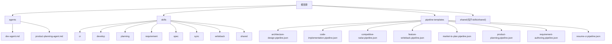
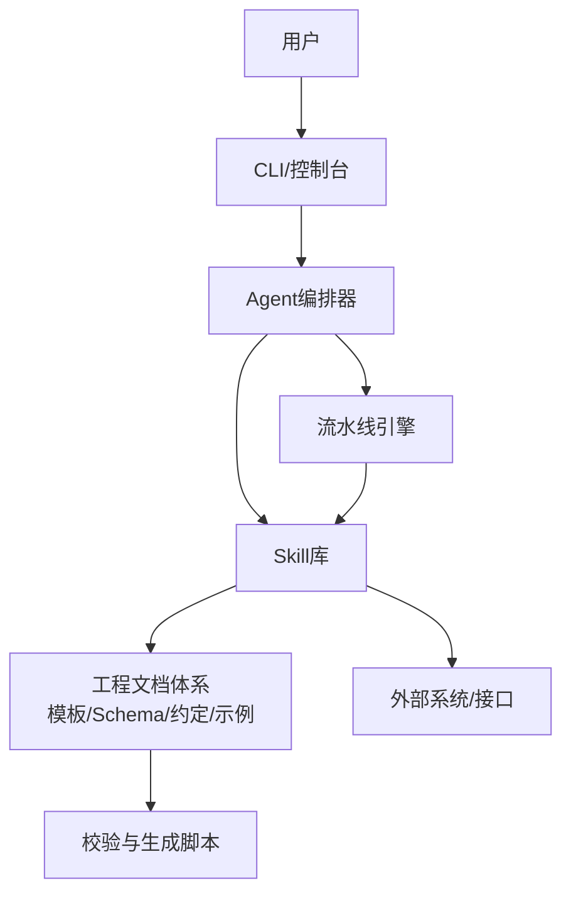
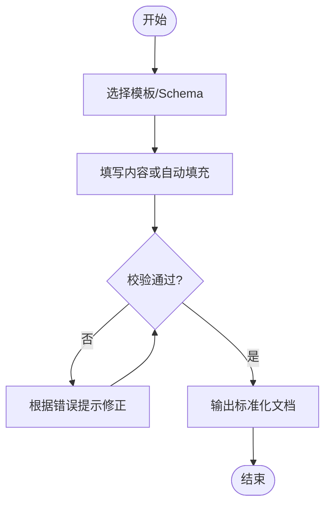
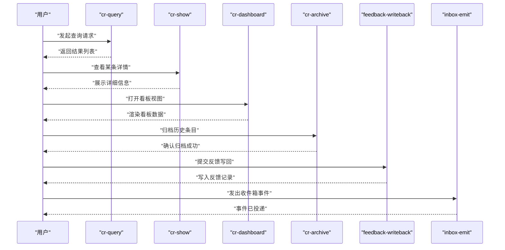
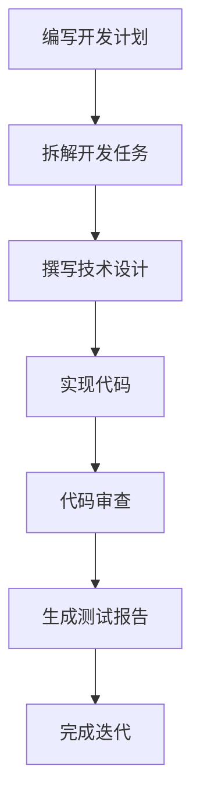
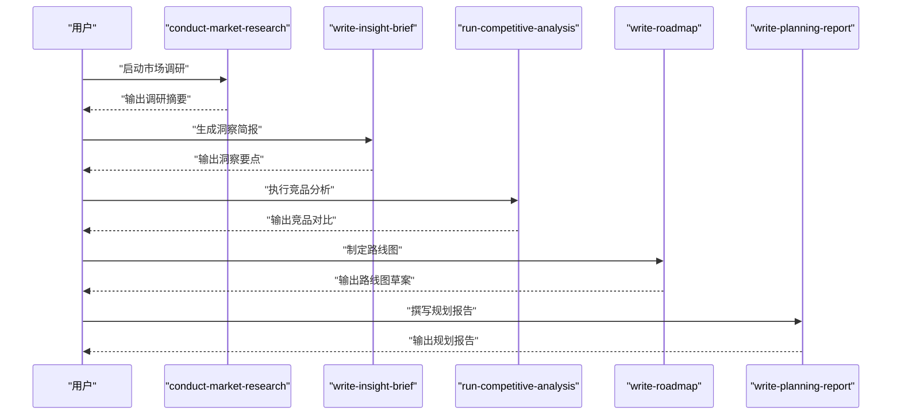
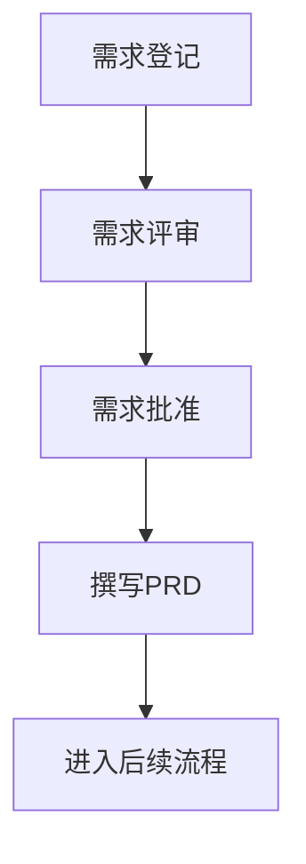
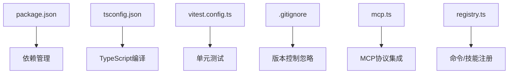

# 快速开始指南

<cite>
**本文引用的文件**   
- [CLAUDE.MD](file://CLAUDE.MD)
- [AGENT-SKILL-MATRIX.md](file://AGENT-SKILL-MATRIX.md)
- [AGENTS.md](file://AGENTS.md)
- [dir-graph.yaml](file://dir-graph.yaml)
- [pipeline-templates/README.md](file://pipeline-templates/README.md)
- [skills/shared/engineering-docs/SKILL.md](file://skills/shared/engineering-docs/SKILL.md)
- [skills/shared/engineering-docs/scripts/package.json](file://skills/shared/engineering-docs/scripts/package.json)
- [skills/shared/engineering-docs/scripts/tsconfig.json](file://skills/shared/engineering-docs/scripts/tsconfig.json)
- [skills/shared/engineering-docs/scripts/src/cli.ts](file://skills/shared/engineering-docs/scripts/src/cli.ts)
- [skills/shared/engineering-docs/scripts/src/mcp.ts](file://skills/shared/engineering-docs/scripts/src/mcp.ts)
- [skills/shared/engineering-docs/scripts/src/registry.ts](file://skills/shared/engineering-docs/scripts/src/registry.ts)
- [skills/shared/engineering-docs/scripts/vitest.config.ts](file://skills/shared/engineering-docs/scripts/vitest.config.ts)
- [skills/shared/engineering-docs/scripts/.gitignore](file://skills/shared/engineering-docs/scripts/.gitignore)
- [skills/shared/engineering-docs/examples/README.md](file://skills/shared/engineering-docs/examples/README.md)
- [skills/shared/engineering-docs/templates/PLAN-template.md](file://skills/shared/engineering-docs/templates/PLAN-template.md)
- [skills/shared/engineering-docs/templates/PRD-template.md](file://skills/shared/engineering-docs/templates/PRD-template.md)
- [skills/shared/engineering-docs/templates/SDD-template.md](file://skills/shared/engineering-docs/templates/SDD-template.md)
- [skills/shared/engineering-docs/templates/TASK-template.md](file://skills/shared/engineering-docs/templates/TASK-template.md)
- [skills/shared/engineering-docs/schemas/common-defs.schema.json](file://skills/shared/engineering-docs/schemas/common-defs.schema.json)
- [skills/shared/engineering-docs/schemas/form.schema.json](file://skills/shared/engineering-docs/schemas/form.schema.json)
- [skills/shared/engineering-docs/schemas/module.schema.json](file://skills/shared/engineering-docs/schemas/module.schema.json)
- [skills/shared/engineering-docs/schemas/plan.schema.json](file://skills/shared/engineering-docs/schemas/plan.schema.json)
- [skills/shared/engineering-docs/schemas/prd.schema.json](file://skills/shared/engineering-docs/schemas/prd.schema.json)
- [skills/shared/engineering-docs/schemas/release.schema.json](file://skills/shared/engineering-docs/schemas/release.schema.json)
- [skills/shared/engineering-docs/schemas/sdd.schema.json](file://skills/shared/engineering-docs/schemas/sdd.schema.json)
- [skills/shared/engineering-docs/schemas/task.schema.json](file://skills/shared/engineering-docs/schemas/task.schema.json)
- [skills/shared/engineering-docs/standards/ENGINEERING-STRUCTURE-TEAM.md](file://skills/shared/engineering-docs/standards/ENGINEERING-STRUCTURE-TEAM.md)
- [skills/shared/engineering-docs/conventions/doc-chain.yaml](file://skills/shared/engineering-docs/conventions/doc-chain.yaml)
- [skills/shared/engineering-docs/conventions/naming.yaml](file://skills/shared/engineering-docs/conventions/naming.yaml)
- [skills/shared/validate-doc/SKILL.md](file://skills/shared/validate-doc/SKILL.md)
- [skills/cr/cr-query/SKILL.md](file://skills/cr/cr-query/SKILL.md)
- [skills/cr/cr-show/SKILL.md](file://skills/cr/cr-show/SKILL.md)
- [skills/cr/cr-dashboard/SKILL.md](file://skills/cr/cr-dashboard/SKILL.md)
- [skills/cr/cr-archive/SKILL.md](file://skills/cr/cr-archive/SKILL.md)
- [skills/cr/cr-review-record/SKILL.md](file://skills/cr/cr-review-record/SKILL.md)
- [skills/cr/feedback-writeback/SKILL.md](file://skills/cr/feedback-writeback/SKILL.md)
- [skills/cr/inbox-emit/SKILL.md](file://skills/cr/inbox-emit/SKILL.md)
- [skills/develop/implement-code/SKILL.md](file://skills/develop/implement-code/SKILL.md)
- [skills/develop/review-code/SKILL.md](file://skills/develop/review-code/SKILL.md)
- [skills/develop/write-dev-plan/SKILL.md](file://skills/develop/write-dev-plan/SKILL.md)
- [skills/develop/write-dev-tasks/SKILL.md](file://skills/develop/write-dev-tasks/SKILL.md)
- [skills/develop/write-tech-design/SKILL.md](file://skills/develop/write-tech-design/SKILL.md)
- [skills/develop/write-test-report/SKILL.md](file://skills/develop/write-test-report/SKILL.md)
- [skills/planning/conduct-market-research/SKILL.md](file://skills/planning/conduct-market-research/SKILL.md)
- [skills/planning/focus-briefing/SKILL.md](file://skills/planning/focus-briefing/SKILL.md)
- [skills/planning/gather-product-context/SKILL.md](file://skills/planning/gather-product-context/SKILL.md)
- [skills/planning/planning-draft/SKILL.md](file://skills/planning/planning-draft/SKILL.md)
- [skills/planning/record-adr/SKILL.md](file://skills/planning/record-adr/SKILL.md)
- [skills/planning/record-idea/SKILL.md](file://skills/planning/record-idea/SKILL.md)
- [skills/planning/run-competitive-analysis/SKILL.md](file://skills/planning/run-competitive-analysis/SKILL.md)
- [skills/planning/write-insight-brief/SKILL.md](file://skills/planning/write-insight-brief/SKILL.md)
- [skills/planning/write-planning-entry/SKILL.md](file://skills/planning/write-planning-entry/SKILL.md)
- [skills/planning/write-planning-report/SKILL.md](file://skills/planning/write-planning-report/SKILL.md)
- [skills/planning/write-roadmap/SKILL.md](file://skills/planning/write-roadmap/SKILL.md)
- [skills/requirement/approve-requirement/SKILL.md](file://skills/requirement/approve-requirement/SKILL.md)
- [skills/requirement/requirement-register/SKILL.md](file://skills/requirement/requirement-register/SKILL.md)
- [skills/requirement/review-requirement/SKILL.md](file://skills/requirement/review-requirement/SKILL.md)
- [skills/requirement/write-requirement-prd/SKILL.md](file://skills/requirement/write-requirement-prd/SKILL.md)
- [skills/spec/spec-dashboard/SKILL.md](file://skills/spec/spec-dashboard/SKILL.md)
- [skills/spec/spec-show/SKILL.md](file://skills/spec/spec-show/SKILL.md)
- [skills/sync/pull-progress/SKILL.md](file://skills/sync/pull-progress/SKILL.md)
- [skills/sync/push-progress/SKILL.md](file://skills/sync/push-progress/SKILL.md)
- [skills/sync/resume-from-remote/SKILL.md](file://skills/sync/resume-from-remote/SKILL.md)
- [skills/writeback/merge-feature-branch/SKILL.md](file://skills/writeback/merge-feature-branch/SKILL.md)
- [skills/writeback/writeback-prd-sdd/SKILL.md](file://skills/writeback/writeback-prd-sdd/SKILL.md)
- [skills/writeback/writeback-tasks/SKILL.md](file://skills/writeback/writeback-tasks/SKILL.md)
- [skills/writeback/writeback-traceability/SKILL.md](file://skills/writeback/writeback-traceability/SKILL.md)
- [agents/_index.yml](file://agents/_index.yml)
- [agents/dev-agent.md](file://agents/dev-agent.md)
- [agents/product-planning-agent.md](file://agents/product-planning-agent.md)
- [agents/customer-support-agent.md](file://agents/customer-support-agent.md)
- [agents/delivery-agent.md](file://agents/delivery-agent.md)
- [agents/quality-reviewer-agent.md](file://agents/quality-reviewer-agent.md)
- [agents/requirement-writer.md](file://agents/requirement-writer.md)
- [agents/spec-agent.md](file://agents/spec-agent.md)
- [agents/competitive-analyst-agent.md](file://agents/competitive-analyst-agent.md)
</cite>

## 目录
1. [简介](#简介)
2. [项目结构](#项目结构)
3. [核心组件](#核心组件)
4. [架构总览](#架构总览)
5. [详细组件分析](#详细组件分析)
6. [依赖分析](#依赖分析)
7. [性能考虑](#性能考虑)
8. [故障排查指南](#故障排查指南)
9. [结论](#结论)
10. [附录](#附录)

## 简介
本快速开始指南面向首次接触该AI工程化工具集的用户，目标是在30分钟内完成环境准备、安装与基础配置，并运行第一个Agent、执行一个Skill以及启动一个流水线。文档提供循序渐进的步骤、常见问题排查和最佳实践建议，帮助你快速上手并建立稳定的本地开发体验。

## 项目结构
仓库采用“按能力域组织”的结构：
- agents：预置的Agent定义与说明，用于编排不同角色的工作流（如研发、产品规划、需求、质量评审等）。
- skills：可复用的技能包，覆盖竞争情报、CR管理、开发、规划、需求、规格、同步、写回等场景。
- pipeline-templates：流水线模板，描述端到端任务编排（如竞品雷达、产品规划、代码实现等）。
- shared：跨领域共享资源，包括工程文档规范、模板、Schema校验、脚本工具等。

图表来源
- [dir-graph.yaml](file://dir-graph.yaml)

章节来源
- [dir-graph.yaml](file://dir-graph.yaml)

## 核心组件
- Agent：以角色为中心的任务编排入口，通常组合多个Skill形成完整流程。
- Skill：最小可复用单元，封装具体能力（查询、生成、校验、写回等），通过SKILL.md进行说明与参数约定。
- Pipeline：将多个Skill串联为端到端流水线，支持顺序、分支与条件控制。
- Shared工程文档体系：包含模板、Schema、命名与链式约定、示例与验证脚本，保障产出物的规范性与一致性。

章节来源
- [AGENTS.md](file://AGENTS.md)
- [AGENT-SKILL-MATRIX.md](file://AGENT-SKILL-MATRIX.md)
- [skills/shared/engineering-docs/SKILL.md](file://skills/shared/engineering-docs/SKILL.md)
- [skills/shared/engineering-docs/examples/README.md](file://skills/shared/engineering-docs/examples/README.md)

## 架构总览
下图展示了从用户到Agent、Skill与流水线的交互关系，以及共享工程文档体系的支撑作用。

图表来源
- [CLAUDE.MD](file://CLAUDE.MD)
- [skills/shared/engineering-docs/SKILL.md](file://skills/shared/engineering-docs/SKILL.md)
- [skills/shared/engineering-docs/scripts/src/cli.ts](file://skills/shared/engineering-docs/scripts/src/cli.ts)
- [skills/shared/engineering-docs/scripts/src/mcp.ts](file://skills/shared/engineering-docs/scripts/src/mcp.ts)
- [skills/shared/engineering-docs/scripts/src/registry.ts](file://skills/shared/engineering-docs/scripts/src/registry.ts)

## 详细组件分析

### 工程文档体系（Shared）
Shared模块提供统一的工程文档标准与工具链，确保各Skill产出的文档具备一致的结构与质量。

- 模板与示例
  - 模板：PLAN、PRD、SDD、TASK等，用于标准化产出物结构。
  - 示例：包含样例文档与使用说明，便于快速对照。
- Schema与校验
  - 提供common-defs、form、module、plan、prd、release、sdd、task等Schema，配合校验脚本保证数据完整性与一致性。
- 约定与规范
  - 命名约定与文档链约定，指导文档间的引用与版本演进。
- 脚本工具
  - CLI入口、MCP集成、注册表与测试配置，支持自动化生成与校验。

图表来源
- [skills/shared/engineering-docs/SKILL.md](file://skills/shared/engineering-docs/SKILL.md)
- [skills/shared/engineering-docs/scripts/src/cli.ts](file://skills/shared/engineering-docs/scripts/src/cli.ts)
- [skills/shared/engineering-docs/scripts/src/mcp.ts](file://skills/shared/engineering-docs/scripts/src/mcp.ts)
- [skills/shared/engineering-docs/scripts/src/registry.ts](file://skills/shared/engineering-docs/scripts/src/registry.ts)
- [skills/shared/engineering-docs/scripts/vitest.config.ts](file://skills/shared/engineering-docs/scripts/vitest.config.ts)
- [skills/shared/engineering-docs/scripts/.gitignore](file://skills/shared/engineering-docs/scripts/.gitignore)
- [skills/shared/engineering-docs/scripts/package.json](file://skills/shared/engineering-docs/scripts/package.json)
- [skills/shared/engineering-docs/scripts/tsconfig.json](file://skills/shared/engineering-docs/scripts/tsconfig.json)
- [skills/shared/engineering-docs/templates/PLAN-template.md](file://skills/shared/engineering-docs/templates/PLAN-template.md)
- [skills/shared/engineering-docs/templates/PRD-template.md](file://skills/shared/engineering-docs/templates/PRD-template.md)
- [skills/shared/engineering-docs/templates/SDD-template.md](file://skills/shared/engineering-docs/templates/SDD-template.md)
- [skills/shared/engineering-docs/templates/TASK-template.md](file://skills/shared/engineering-docs/templates/TASK-template.md)
- [skills/shared/engineering-docs/schemas/common-defs.schema.json](file://skills/shared/engineering-docs/schemas/common-defs.schema.json)
- [skills/shared/engineering-docs/schemas/form.schema.json](file://skills/shared/engineering-docs/schemas/form.schema.json)
- [skills/shared/engineering-docs/schemas/module.schema.json](file://skills/shared/engineering-docs/schemas/module.schema.json)
- [skills/shared/engineering-docs/schemas/plan.schema.json](file://skills/shared/engineering-docs/schemas/plan.schema.json)
- [skills/shared/engineering-docs/schemas/prd.schema.json](file://skills/shared/engineering-docs/schemas/prd.schema.json)
- [skills/shared/engineering-docs/schemas/release.schema.json](file://skills/shared/engineering-docs/schemas/release.schema.json)
- [skills/shared/engineering-docs/schemas/sdd.schema.json](file://skills/shared/engineering-docs/schemas/sdd.schema.json)
- [skills/shared/engineering-docs/schemas/task.schema.json](file://skills/shared/engineering-docs/schemas/task.schema.json)
- [skills/shared/engineering-docs/standards/ENGINEERING-STRUCTURE-TEAM.md](file://skills/shared/engineering-docs/standards/ENGINEERING-STRUCTURE-TEAM.md)
- [skills/shared/engineering-docs/conventions/doc-chain.yaml](file://skills/shared/engineering-docs/conventions/doc-chain.yaml)
- [skills/shared/engineering-docs/conventions/naming.yaml](file://skills/shared/engineering-docs/conventions/naming.yaml)
- [skills/shared/engineering-docs/examples/README.md](file://skills/shared/engineering-docs/examples/README.md)

章节来源
- [skills/shared/engineering-docs/SKILL.md](file://skills/shared/engineering-docs/SKILL.md)
- [skills/shared/engineering-docs/scripts/package.json](file://skills/shared/engineering-docs/scripts/package.json)
- [skills/shared/engineering-docs/scripts/tsconfig.json](file://skills/shared/engineering-docs/scripts/tsconfig.json)
- [skills/shared/engineering-docs/scripts/src/cli.ts](file://skills/shared/engineering-docs/scripts/src/cli.ts)
- [skills/shared/engineering-docs/scripts/src/mcp.ts](file://skills/shared/engineering-docs/scripts/src/mcp.ts)
- [skills/shared/engineering-docs/scripts/src/registry.ts](file://skills/shared/engineering-docs/scripts/src/registry.ts)
- [skills/shared/engineering-docs/scripts/vitest.config.ts](file://skills/shared/engineering-docs/scripts/vitest.config.ts)
- [skills/shared/engineering-docs/scripts/.gitignore](file://skills/shared/engineering-docs/scripts/.gitignore)
- [skills/shared/engineering-docs/examples/README.md](file://skills/shared/engineering-docs/examples/README.md)
- [skills/shared/engineering-docs/templates/PLAN-template.md](file://skills/shared/engineering-docs/templates/PLAN-template.md)
- [skills/shared/engineering-docs/templates/PRD-template.md](file://skills/shared/engineering-docs/templates/PRD-template.md)
- [skills/shared/engineering-docs/templates/SDD-template.md](file://skills/shared/engineering-docs/templates/SDD-template.md)
- [skills/shared/engineering-docs/templates/TASK-template.md](file://skills/shared/engineering-docs/templates/TASK-template.md)
- [skills/shared/engineering-docs/schemas/common-defs.schema.json](file://skills/shared/engineering-docs/schemas/common-defs.schema.json)
- [skills/shared/engineering-docs/schemas/form.schema.json](file://skills/shared/engineering-docs/schemas/form.schema.json)
- [skills/shared/engineering-docs/schemas/module.schema.json](file://skills/shared/engineering-docs/schemas/module.schema.json)
- [skills/shared/engineering-docs/schemas/plan.schema.json](file://skills/shared/engineering-docs/schemas/plan.schema.json)
- [skills/shared/engineering-docs/schemas/prd.schema.json](file://skills/shared/engineering-docs/schemas/prd.schema.json)
- [skills/shared/engineering-docs/schemas/release.schema.json](file://skills/shared/engineering-docs/schemas/release.schema.json)
- [skills/shared/engineering-docs/schemas/sdd.schema.json](file://skills/shared/engineering-docs/schemas/sdd.schema.json)
- [skills/shared/engineering-docs/schemas/task.schema.json](file://skills/shared/engineering-docs/schemas/task.schema.json)
- [skills/shared/engineering-docs/standards/ENGINEERING-STRUCTURE-TEAM.md](file://skills/shared/engineering-docs/standards/ENGINEERING-STRUCTURE-TEAM.md)
- [skills/shared/engineering-docs/conventions/doc-chain.yaml](file://skills/shared/engineering-docs/conventions/doc-chain.yaml)
- [skills/shared/engineering-docs/conventions/naming.yaml](file://skills/shared/engineering-docs/conventions/naming.yaml)

### CR管理（CR系列Skill）
CR系列Skill覆盖查询、展示、看板、归档、记录反馈与收件箱事件等能力，适合在需求与缺陷管理中构建闭环。

图表来源
- [skills/cr/cr-query/SKILL.md](file://skills/cr/cr-query/SKILL.md)
- [skills/cr/cr-show/SKILL.md](file://skills/cr/cr-show/SKILL.md)
- [skills/cr/cr-dashboard/SKILL.md](file://skills/cr/cr-dashboard/SKILL.md)
- [skills/cr/cr-archive/SKILL.md](file://skills/cr/cr-archive/SKILL.md)
- [skills/cr/cr-review-record/SKILL.md](file://skills/cr/cr-review-record/SKILL.md)
- [skills/cr/feedback-writeback/SKILL.md](file://skills/cr/feedback-writeback/SKILL.md)
- [skills/cr/inbox-emit/SKILL.md](file://skills/cr/inbox-emit/SKILL.md)

章节来源
- [skills/cr/cr-query/SKILL.md](file://skills/cr/cr-query/SKILL.md)
- [skills/cr/cr-show/SKILL.md](file://skills/cr/cr-show/SKILL.md)
- [skills/cr/cr-dashboard/SKILL.md](file://skills/cr/cr-dashboard/SKILL.md)
- [skills/cr/cr-archive/SKILL.md](file://skills/cr/cr-archive/SKILL.md)
- [skills/cr/cr-review-record/SKILL.md](file://skills/cr/cr-review-record/SKILL.md)
- [skills/cr/feedback-writeback/SKILL.md](file://skills/cr/feedback-writeback/SKILL.md)
- [skills/cr/inbox-emit/SKILL.md](file://skills/cr/inbox-emit/SKILL.md)

### 开发（Develop系列Skill）
开发系列Skill涵盖计划制定、任务拆解、技术设计、代码实现、代码审查与测试报告等关键步骤，帮助团队提升交付效率与质量。

图表来源
- [skills/develop/write-dev-plan/SKILL.md](file://skills/develop/write-dev-plan/SKILL.md)
- [skills/develop/write-dev-tasks/SKILL.md](file://skills/develop/write-dev-tasks/SKILL.md)
- [skills/develop/write-tech-design/SKILL.md](file://skills/develop/write-tech-design/SKILL.md)
- [skills/develop/implement-code/SKILL.md](file://skills/develop/implement-code/SKILL.md)
- [skills/develop/review-code/SKILL.md](file://skills/develop/review-code/SKILL.md)
- [skills/develop/write-test-report/SKILL.md](file://skills/develop/write-test-report/SKILL.md)

章节来源
- [skills/develop/write-dev-plan/SKILL.md](file://skills/develop/write-dev-plan/SKILL.md)
- [skills/develop/write-dev-tasks/SKILL.md](file://skills/develop/write-dev-tasks/SKILL.md)
- [skills/develop/write-tech-design/SKILL.md](file://skills/develop/write-tech-design/SKILL.md)
- [skills/develop/implement-code/SKILL.md](file://skills/develop/implement-code/SKILL.md)
- [skills/develop/review-code/SKILL.md](file://skills/develop/review-code/SKILL.md)
- [skills/develop/write-test-report/SKILL.md](file://skills/develop/write-test-report/SKILL.md)

### 规划（Planning系列Skill）
规划系列Skill支持市场调研、洞察提炼、竞品分析、路线图制定与规划报告撰写，辅助产品策略落地。

图表来源
- [skills/planning/conduct-market-research/SKILL.md](file://skills/planning/conduct-market-research/SKILL.md)
- [skills/planning/write-insight-brief/SKILL.md](file://skills/planning/write-insight-brief/SKILL.md)
- [skills/planning/run-competitive-analysis/SKILL.md](file://skills/planning/run-competitive-analysis/SKILL.md)
- [skills/planning/write-roadmap/SKILL.md](file://skills/planning/write-roadmap/SKILL.md)
- [skills/planning/write-planning-report/SKILL.md](file://skills/planning/write-planning-report/SKILL.md)

章节来源
- [skills/planning/conduct-market-research/SKILL.md](file://skills/planning/conduct-market-research/SKILL.md)
- [skills/planning/write-insight-brief/SKILL.md](file://skills/planning/write-insight-brief/SKILL.md)
- [skills/planning/run-competitive-analysis/SKILL.md](file://skills/planning/run-competitive-analysis/SKILL.md)
- [skills/planning/write-roadmap/SKILL.md](file://skills/planning/write-roadmap/SKILL.md)
- [skills/planning/write-planning-report/SKILL.md](file://skills/planning/write-planning-report/SKILL.md)

### 需求（Requirement系列Skill）
需求系列Skill覆盖需求登记、评审、批准与PRD撰写，确保需求从提出到落地的全过程可控。

图表来源
- [skills/requirement/requirement-register/SKILL.md](file://skills/requirement/requirement-register/SKILL.md)
- [skills/requirement/review-requirement/SKILL.md](file://skills/requirement/review-requirement/SKILL.md)
- [skills/requirement/approve-requirement/SKILL.md](file://skills/requirement/approve-requirement/SKILL.md)
- [skills/requirement/write-requirement-prd/SKILL.md](file://skills/requirement/write-requirement-prd/SKILL.md)

章节来源
- [skills/requirement/requirement-register/SKILL.md](file://skills/requirement/requirement-register/SKILL.md)
- [skills/requirement/review-requirement/SKILL.md](file://skills/requirement/review-requirement/SKILL.md)
- [skills/requirement/approve-requirement/SKILL.md](file://skills/requirement/approve-requirement/SKILL.md)
- [skills/requirement/write-requirement-prd/SKILL.md](file://skills/requirement/write-requirement-prd/SKILL.md)

### 规格（Spec系列Skill）
规格系列Skill提供规格查询、展示与看板能力，便于追踪规格状态与变更。

章节来源
- [skills/spec/spec-show/SKILL.md](file://skills/spec/spec-show/SKILL.md)
- [skills/spec/spec-dashboard/SKILL.md](file://skills/spec/spec-dashboard/SKILL.md)

### 同步（Sync系列Skill）
同步系列Skill支持进度拉取/推送与远程恢复，保障多端协作的一致性。

章节来源
- [skills/sync/pull-progress/SKILL.md](file://skills/sync/pull-progress/SKILL.md)
- [skills/sync/push-progress/SKILL.md](file://skills/sync/push-progress/SKILL.md)
- [skills/sync/resume-from-remote/SKILL.md](file://skills/sync/resume-from-remote/SKILL.md)

### 写回（Writeback系列Skill）
写回系列Skill负责将产物写回到目标系统，如合并特性分支、写回PRD/SDD、写回任务与追溯信息。

章节来源
- [skills/writeback/merge-feature-branch/SKILL.md](file://skills/writeback/merge-feature-branch/SKILL.md)
- [skills/writeback/writeback-prd-sdd/SKILL.md](file://skills/writeback/writeback-prd-sdd/SKILL.md)
- [skills/writeback/writeback-tasks/SKILL.md](file://skills/writeback/writeback-tasks/SKILL.md)
- [skills/writeback/writeback-traceability/SKILL.md](file://skills/writeback/writeback-traceability/SKILL.md)

### 文档校验（Validate-Doc）
文档校验Skill基于Schema与约定对工程文档进行一致性检查，确保模板使用正确、字段完整且命名符合规范。

章节来源
- [skills/shared/validate-doc/SKILL.md](file://skills/shared/validate-doc/SKILL.md)

## 依赖分析
- Node.js生态
  - 工程文档脚本使用TypeScript与Vitest进行测试，依赖package.json与tsconfig.json进行构建与运行。
  - 建议在Node.js LTS环境下运行，并使用pnpm或npm进行依赖安装与脚本执行。
- 配置文件
  - tsconfig.json：TypeScript编译选项。
  - vitest.config.ts：单元测试配置。
  - .gitignore：忽略构建产物与临时文件。
- 外部集成
  - MCP集成：mcp.ts提供与MCP协议的对接能力，便于与其他工具链集成。
  - 注册表：registry.ts维护可用命令/技能的注册与发现。

图表来源
- [skills/shared/engineering-docs/scripts/package.json](file://skills/shared/engineering-docs/scripts/package.json)
- [skills/shared/engineering-docs/scripts/tsconfig.json](file://skills/shared/engineering-docs/scripts/tsconfig.json)
- [skills/shared/engineering-docs/scripts/vitest.config.ts](file://skills/shared/engineering-docs/scripts/vitest.config.ts)
- [skills/shared/engineering-docs/scripts/.gitignore](file://skills/shared/engineering-docs/scripts/.gitignore)
- [skills/shared/engineering-docs/scripts/src/mcp.ts](file://skills/shared/engineering-docs/scripts/src/mcp.ts)
- [skills/shared/engineering-docs/scripts/src/registry.ts](file://skills/shared/engineering-docs/scripts/src/registry.ts)

章节来源
- [skills/shared/engineering-docs/scripts/package.json](file://skills/shared/engineering-docs/scripts/package.json)
- [skills/shared/engineering-docs/scripts/tsconfig.json](file://skills/shared/engineering-docs/scripts/tsconfig.json)
- [skills/shared/engineering-docs/scripts/vitest.config.ts](file://skills/shared/engineering-docs/scripts/vitest.config.ts)
- [skills/shared/engineering-docs/scripts/.gitignore](file://skills/shared/engineering-docs/scripts/.gitignore)
- [skills/shared/engineering-docs/scripts/src/mcp.ts](file://skills/shared/engineering-docs/scripts/src/mcp.ts)
- [skills/shared/engineering-docs/scripts/src/registry.ts](file://skills/shared/engineering-docs/scripts/src/registry.ts)

## 性能考虑
- 批量处理：优先使用批处理API或流水线模式减少往返调用次数。
- 缓存策略：对热点数据（如竞品信息、市场洞察）进行缓存，降低重复计算成本。
- 增量更新：利用同步Skill的拉取/推送能力，仅处理变更部分。
- 并行执行：在不影响一致性的前提下，并行执行独立Skill以提升吞吐。
- 资源限制：合理设置并发度与超时时间，避免资源耗尽。

[本节为通用建议，不直接分析具体文件]

## 故障排查指南
- 环境相关
  - Node.js版本不匹配：请切换到LTS版本，清理node_modules后重新安装依赖。
  - 权限问题：确保对目标目录有读写权限，必要时使用管理员权限运行。
- 配置相关
  - 路径错误：检查相对/绝对路径是否正确，避免中文路径导致解析异常。
  - 环境变量缺失：核对必要的环境变量是否已设置（如API密钥、数据库连接等）。
- 脚本相关
  - TypeScript编译失败：检查tsconfig.json与源码类型声明，修复类型错误后重试。
  - 测试失败：查看vitest日志定位失败用例，修复后再运行。
- 集成相关
  - MCP连接失败：检查MCP服务地址与认证信息，确认网络可达。
  - 注册表未找到命令：确认registry.ts中已正确注册对应命令/技能。

章节来源
- [skills/shared/engineering-docs/scripts/package.json](file://skills/shared/engineering-docs/scripts/package.json)
- [skills/shared/engineering-docs/scripts/tsconfig.json](file://skills/shared/engineering-docs/scripts/tsconfig.json)
- [skills/shared/engineering-docs/scripts/vitest.config.ts](file://skills/shared/engineering-docs/scripts/vitest.config.ts)
- [skills/shared/engineering-docs/scripts/src/mcp.ts](file://skills/shared/engineering-docs/scripts/src/mcp.ts)
- [skills/shared/engineering-docs/scripts/src/registry.ts](file://skills/shared/engineering-docs/scripts/src/registry.ts)

## 结论
通过本指南，你已完成环境准备、基础配置与首个Agent、Skill与流水线的体验。建议结合工程文档体系与校验脚本，逐步扩展你的工作流，并在团队内推广标准化产出与自动化流水线，以获得更高的交付效率与质量。

[本节为总结性内容，不直接分析具体文件]

## 附录

### 环境准备与安装（Node.js与依赖）
- 安装Node.js LTS版本（建议使用当前稳定版）。
- 在项目根目录或子模块目录执行依赖安装：
  - 使用pnpm：pnpm install
  - 使用npm：npm install
- 构建与测试（工程文档脚本）：
  - 构建：npm run build 或 pnpm build
  - 测试：npm test 或 pnpm test

章节来源
- [skills/shared/engineering-docs/scripts/package.json](file://skills/shared/engineering-docs/scripts/package.json)
- [skills/shared/engineering-docs/scripts/tsconfig.json](file://skills/shared/engineering-docs/scripts/tsconfig.json)
- [skills/shared/engineering-docs/scripts/vitest.config.ts](file://skills/shared/engineering-docs/scripts/vitest.config.ts)

### 初始配置与基本参数
- 工程文档模板与Schema
  - 参考模板目录与Schema目录，按需调整字段与约束。
- 命名与链式约定
  - 遵循conventions下的命名与文档链约定，确保文档间引用一致。
- 脚本与MCP集成
  - 在mcp.ts中配置外部服务地址与认证；在registry.ts中注册新命令/技能。

章节来源
- [skills/shared/engineering-docs/templates/PLAN-template.md](file://skills/shared/engineering-docs/templates/PLAN-template.md)
- [skills/shared/engineering-docs/templates/PRD-template.md](file://skills/shared/engineering-docs/templates/PRD-template.md)
- [skills/shared/engineering-docs/templates/SDD-template.md](file://skills/shared/engineering-docs/templates/SDD-template.md)
- [skills/shared/engineering-docs/templates/TASK-template.md](file://skills/shared/engineering-docs/templates/TASK-template.md)
- [skills/shared/engineering-docs/schemas/common-defs.schema.json](file://skills/shared/engineering-docs/schemas/common-defs.schema.json)
- [skills/shared/engineering-docs/schemas/form.schema.json](file://skills/shared/engineering-docs/schemas/form.schema.json)
- [skills/shared/engineering-docs/schemas/module.schema.json](file://skills/shared/engineering-docs/schemas/module.schema.json)
- [skills/shared/engineering-docs/schemas/plan.schema.json](file://skills/shared/engineering-docs/schemas/plan.schema.json)
- [skills/shared/engineering-docs/schemas/prd.schema.json](file://skills/shared/engineering-docs/schemas/prd.schema.json)
- [skills/shared/engineering-docs/schemas/release.schema.json](file://skills/shared/engineering-docs/schemas/release.schema.json)
- [skills/shared/engineering-docs/schemas/sdd.schema.json](file://skills/shared/engineering-docs/schemas/sdd.schema.json)
- [skills/shared/engineering-docs/schemas/task.schema.json](file://skills/shared/engineering-docs/schemas/task.schema.json)
- [skills/shared/engineering-docs/conventions/doc-chain.yaml](file://skills/shared/engineering-docs/conventions/doc-chain.yaml)
- [skills/shared/engineering-docs/conventions/naming.yaml](file://skills/shared/engineering-docs/conventions/naming.yaml)
- [skills/shared/engineering-docs/scripts/src/mcp.ts](file://skills/shared/engineering-docs/scripts/src/mcp.ts)
- [skills/shared/engineering-docs/scripts/src/registry.ts](file://skills/shared/engineering-docs/scripts/src/registry.ts)

### 运行第一个Agent
- 选择目标Agent（例如研发Agent或产品规划Agent）。
- 根据Agent说明准备输入参数（主题、范围、目标等）。
- 通过CLI或控制台触发Agent执行，观察输出与中间产物。

章节来源
- [agents/dev-agent.md](file://agents/dev-agent.md)
- [agents/product-planning-agent.md](file://agents/product-planning-agent.md)
- [agents/_index.yml](file://agents/_index.yml)

### 执行第一个Skill
- 选择一个简单Skill（例如文档校验或CR查询）。
- 按照SKILL.md中的参数说明准备输入。
- 执行并查看输出结果，必要时根据错误提示进行调整。

章节来源
- [skills/shared/validate-doc/SKILL.md](file://skills/shared/validate-doc/SKILL.md)
- [skills/cr/cr-query/SKILL.md](file://skills/cr/cr-query/SKILL.md)

### 启动一个流水线
- 选择流水线模板（如产品规划或代码实现）。
- 根据模板要求准备输入数据与上下文。
- 启动流水线并监控执行过程，查看阶段产物与最终结果。

章节来源
- [pipeline-templates/README.md](file://pipeline-templates/README.md)
- [pipeline-templates/product-planning.pipeline.json](file://pipeline-templates/product-planning.pipeline.json)
- [pipeline-templates/code-implementation.pipeline.json](file://pipeline-templates/code-implementation.pipeline.json)

### 交互式示例与可运行片段
- 工程文档脚本
  - 使用CLI生成或校验文档，参考scripts目录中的入口与注册表。
- 单元测试
  - 运行vitest测试套件，验证脚本行为是否符合预期。

章节来源
- [skills/shared/engineering-docs/scripts/src/cli.ts](file://skills/shared/engineering-docs/scripts/src/cli.ts)
- [skills/shared/engineering-docs/scripts/src/registry.ts](file://skills/shared/engineering-docs/scripts/src/registry.ts)
- [skills/shared/engineering-docs/scripts/vitest.config.ts](file://skills/shared/engineering-docs/scripts/vitest.config.ts)

### 最佳实践建议
- 统一模板与Schema：所有产出物遵循同一套模板与约束，减少返工。
- 自动化校验：在CI中加入文档校验与测试，提前发现问题。
- 渐进式引入：先从单一领域（如CR或规划）入手，再扩展到全链路。
- 文档驱动：以文档为契约，明确输入输出与验收标准。
- 持续改进：定期回顾流水线与Skill效果，优化参数与流程。

[本节为通用建议，不直接分析具体文件]

### 入门学习路径
- 第1步：阅读AGENTS与矩阵，了解Agent与Skill的关系。
- 第2步：熟悉工程文档体系（模板、Schema、约定、示例）。
- 第3步：选择一个Skill进行实操（如文档校验或CR查询）。
- 第4步：尝试运行一个Agent，观察其调用的Skill与产出。
- 第5步：选择一个流水线模板，端到端跑通一次。
- 第6步：基于现有模板与Schema，定制你自己的模板与校验规则。

章节来源
- [AGENTS.md](file://AGENTS.md)
- [AGENT-SKILL-MATRIX.md](file://AGENT-SKILL-MATRIX.md)
- [skills/shared/engineering-docs/SKILL.md](file://skills/shared/engineering-docs/SKILL.md)
- [skills/shared/engineering-docs/examples/README.md](file://skills/shared/engineering-docs/examples/README.md)